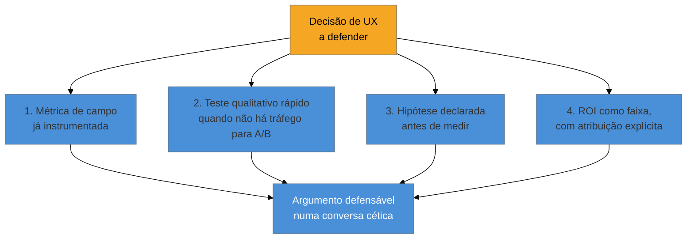

# Defender decisão de UX com número

> [!abstract] TL;DR
> O relatório mais equilibrado sobre ROI de UX, o *"UX Metrics & ROI"* da Nielsen Norman Group (44 case studies), descreve sucessos **e** casos neutros ou negativos, e alerta contra três mitos: achar que ROI é só dinheiro, exigir precisão perfeita, e ignorar a **atribuição causal frágil** — mudança de marketing, preço e evento externo se misturam ao efeito de UX no mesmo período. Conclusão do próprio relatório: **cálculo de ROI é estimativa, não fato**. A citação mais repetida do campo — Forrester, "$1 investido em UX retorna $100" — **circula amplamente sem metodologia visível, é estudo antigo e de contexto específico, e não está verificada** nesta pesquisa; se aparecer nesta nota, é como exemplo de número que vira folclore sem lastro, nunca como argumento. A síntese prática de como o engenheiro solo defende uma decisão de UX com número — amarrar a uma métrica de campo já instrumentada, usar teste qualitativo rápido quando não há tráfego para A/B, declarar hipótese antes de medir, apresentar ROI como faixa com atribuição explícita — é **inferência desta pesquisa, não framework nomeado por nenhum autor**, e deve ser tratada como tal.

Imagine a reunião em que você precisa justificar, para um cliente que controla o orçamento, por que vale a pena investir mais duas semanas reformulando um fluxo de onboarding em vez de partir direto para a próxima feature que ele já quer construir. Você tem boa intuição de que o fluxo atual está ruim — viu usuários travando no teste de usabilidade, sabe que a taxa de conclusão está baixa. Mas "eu acho que está ruim" não sobrevive numa sala onde a pergunta seguinte é "quanto isso vai retornar em dinheiro?". A tentação, nesse momento, é buscar um número grande e definitivo para fechar a conversa — e é exatamente aqui que a citação Forrester de "$1 vira $100" aparece com mais frequência: um número tão grande e tão fácil de repetir que parece resolver a conversa inteira sozinho. É também, por isso mesmo, o número mais perigoso de usar sem checar.

## O que o relatório mais equilibrado do campo realmente diz

O *"UX Metrics & ROI"* da Nielsen Norman Group, consolidando **44 case studies** reais de projeto de UX, é a fonte mais honesta disponível sobre o assunto — precisamente porque descreve **sucessos e casos neutros ou negativos** lado a lado, em vez de só coletar histórias de vitória para justificar a existência da disciplina. O relatório nomeia três mitos que atravessam a maioria das conversas informais sobre ROI de UX:

1. **Achar que ROI é só dinheiro.** Retorno de investimento em UX inclui redução de custo de suporte, redução de tempo de treinamento, retenção de cliente, e redução de risco legal/compliance — nem todo retorno converte diretamente em receita nova, e insistir em traduzir tudo para receita descarta ganhos reais que não têm essa forma.
2. **Exigir precisão perfeita.** Tratar o número de ROI como se fosse um cálculo contábil exato, com casas decimais defensáveis, é um padrão de rigor que a própria natureza do dado não sustenta — e exigir essa precisão só empurra quem está calculando a inflar confiança artificial no número.
3. **Ignorar a atribuição causal frágil.** Este é o mito mais importante para esta nota: no mesmo período em que uma mudança de UX acontece, **mudanças de marketing, preço e eventos externos** também estão acontecendo — uma campanha nova, um concorrente saindo do mercado, uma sazonalidade de negócio. Separar o efeito específico da mudança de UX do efeito dessas outras variáveis, sem um desenho experimental controlado (o mesmo problema discutido na [[03-Dominios/Engenharia/UX/Medir, Validar e Sustentar/42 - Quando A-B não se aplica|nota 42]] sobre limites do A/B), é estatisticamente difícil — e fingir que não é dificulta mais do que ajuda.

**A conclusão do próprio relatório é a frase mais importante desta nota inteira: cálculo de ROI é estimativa, não fato.** Tratá-lo como fato definitivo, com uma casa decimal de precisão, é uma escolha de comunicação que a evidência não sustenta — e que, quando desmontada por alguém cético na sala, destrói a credibilidade de todo o argumento, não só do número específico.

## A citação Forrester: o número mais folclórico da área

> [!warning] "$1 investido em UX retorna $100" — não verificado, e é exatamente o tipo de número que este domínio ensina a desconfiar
> Esta citação circula amplamente em apresentações, artigos e posts sobre ROI de UX, atribuída à Forrester Research, com a alegação de retorno de aproximadamente 9900%. **Esta pesquisa não conseguiu verificar a fonte primária, a metodologia ou o contexto específico do estudo original** — é um número antigo, de um contexto de produto e época específicos, citado de forma generalizada e descontextualizada sem que a metodologia por trás dele esteja disponível para checagem.
>
> O motivo de nomear isso explicitamente, em vez de simplesmente omitir a citação: ela é **o exemplo mais folclórico** de um número que se tornou "verdade repetida" na área de UX inteira, exatamente pelo mesmo mecanismo que a [[03-Dominios/Engenharia/UX/Medir, Validar e Sustentar/40 - NPS e North Star - promessa, crítica e Goodhart|nota 40]] descreve para o NPS: fácil de comunicar, poderoso para convencer um executivo numa única frase, e raramente questionado sobre a robustez que sustenta a alegação. Seria incoerente este domínio — que ensina a checar benchmark de SUS antes de repetir "68 é a média" e a desconfiar de métrica de vaidade — usar exatamente esse tipo de número não verificado como argumento de autoridade. Se você ouvir essa citação numa reunião ou artigo, trate-a como **exemplo do problema, não como munição** — e prefira sempre um número calculado a partir do próprio caso, mesmo que menor e menos impressionante, a um número emprestado sem lastro.

## A síntese prática: como o engenheiro solo defende uma decisão

> [!info] Isto é inferência da pesquisa, não framework nomeado
> Os quatro passos abaixo não vêm de um único autor ou publicação com nome próprio — são uma síntese construída a partir do relatório da NN/g, da distinção entre métrica de campo e de laboratório ([[03-Dominios/Engenharia/UX/Medir, Validar e Sustentar/39 - SUS, UMUX-Lite, SUPR-Q e SEQ|nota 39]]) e dos limites do A/B para tráfego baixo ([[03-Dominios/Engenharia/UX/Medir, Validar e Sustentar/42 - Quando A-B não se aplica|nota 42]]). Apresente-a como raciocínio próprio aplicado ao contexto do engenheiro fractional, não como "o método X de defender ROI" citando um autor que não a formulou dessa forma.

1. **Amarrar a decisão a uma métrica de campo já instrumentada, não a opinião.** Antes de defender a decisão, tenha um número de produção — taxa de conclusão de tarefa, volume de ticket de suporte relacionado (ver [[03-Dominios/Engenharia/UX/Medir, Validar e Sustentar/44 - UX debt e matriz severidade x esforço|nota 44]] sobre ticket como fonte de pesquisa), tempo até primeira ação de valor — em vez de "eu acho que está confuso". A métrica não precisa ser grande ou impressionante; precisa ser **real e verificável** por qualquer pessoa na sala que queira checar.
2. **Usar teste qualitativo rápido quando não há tráfego para A/B.** Se o produto não sustenta comparação estatística formal (o cenário central da nota 42), um SEQ pós-tarefa com 5 usuários, ou uma entrevista de descoberta, gera evidência concreta e defensável — "5 de 6 usuários travaram no mesmo passo" é dado real, mesmo sem significância estatística formal, e é mais honesto do que forçar um A/B sem amostra suficiente.
3. **Declarar a hipótese antes de medir.** O mesmo princípio do GSM ([[03-Dominios/Engenharia/UX/Medir, Validar e Sustentar/38 - HEART e Goals-Signals-Metrics|nota 38]]): escrever, antes de implementar a mudança, o que você espera que aconteça e como vai medir — evita a armadilha de escolher, depois do fato, a métrica que por acaso melhorou e ignorar as que pioraram.
4. **Apresentar ROI como faixa com atribuição explícita, nunca como certeza.** Em vez de "essa mudança vai gerar $50.000 de retorno", algo como "com base na redução observada de X% no tempo de tarefa e no volume atual de uso, a estimativa de economia fica entre $20.000 e $40.000 por trimestre — considerando que outras mudanças no mesmo período (nova campanha de marketing, sazonalidade) também podem ter contribuído para o resultado observado". É uma frase mais longa e menos impressionante que "$1 vira $100" — e é a única das duas que sobrevive a uma pergunta cética de acompanhamento.

**O mecanismo em uma frase:** um argumento de UX sobrevive a uma pergunta cética não porque o número é grande, mas porque cada passo entre a decisão e o número é rastreável e honesto sobre o que não sabe — e é exatamente essa rastreabilidade, não a magnitude do retorno alegado, que separa um argumento sênior de um número emprestado sem lastro.

## A fronteira com o stakeholder: quem você está de fato convencendo

A [[03-Dominios/Engenharia/UX/Descoberta e Pesquisa/08 - Cliente não é usuário - a armadilha do B2B e consultoria|nota 08]] deste domínio nomeia que, em B2B e consultoria, quem paga raramente é quem usa o sistema no dia a dia. Essa mesma distinção volta aqui, com uma torção prática: **defender uma decisão de UX com número é, quase sempre, uma conversa com quem paga, não com quem usa** — o que muda o que "convincente" significa. Quem usa o sistema já sente o problema na pele; quem paga precisa de um argumento que se sustente numa reunião de orçamento, comparando o investimento em UX contra outras prioridades concorrentes de negócio. Isso não significa manipular o número para parecer maior — significa reconhecer que a audiência da estimativa de ROI é estrutural e diferente da audiência do teste de usabilidade, e ajustar a forma de apresentação (faixa honesta, atribuição explícita) sem ajustar a honestidade do conteúdo.

## O que dá pra fazer sozinho, e o que não dá

Amarrar uma decisão a uma métrica de campo já instrumentada e apresentar uma estimativa de ROI como faixa com atribuição explícita são **inteiramente praticáveis sozinho** — exigem disciplina de comunicação e um número real, não uma equipe de análise de dados. Rodar teste qualitativo rápido com 5 usuários para gerar evidência quando não há tráfego para A/B também é praticável sozinho, e já foi discutido em profundidade na nota 42.

Já **calcular ROI com atribuição causal isolada e estatisticamente controlada** — separando de fato o efeito da mudança de UX do efeito simultâneo de marketing, preço e sazonalidade, com significância formal — exige desenho experimental controlado (A/B com tráfego suficiente, ou análise de séries temporais com controle de variável de confusão) que, como a nota 42 já discutiu, frequentemente não está disponível para este público. A honestidade metodológica correta, quando esse rigor não está ao alcance, é declarar a limitação explicitamente ("não isolamos estatisticamente o efeito de outras mudanças no período") em vez de apresentar uma atribuição causal que a evidência disponível não sustenta.

E **conduzir um programa formal e contínuo de mensuração de ROI de UX, com metodologia auditada e comparável entre múltiplos projetos ao longo de anos** — o tipo de rigor que sustenta um relatório como o da NN/g com 44 case studies — é trabalho de pesquisa institucional que uma pessoa sozinha, dentro do escopo de um projeto de consultoria, não tem como (nem precisa) replicar. A versão que cabe na escala de um é: uma estimativa honesta, por projeto, com os quatro passos da síntese desta nota.

## Casos práticos

### Cenário 1: a citação Forrester quase usada, e a correção a tempo
Um engenheiro fractional, preparando uma apresentação para justificar duas semanas extras de trabalho num fluxo de onboarding, encontra a citação "$1 investido em UX retorna $100" numa busca rápida e quase a inclui no slide, porque "é um número forte que vai convencer o cliente". Ao tentar checar a fonte primária para citar corretamente, não encontra metodologia nem estudo original disponível — só repetições da mesma frase em blogs e apresentações, sem nenhuma citando a fonte original com rigor. A correção: remove a citação e, em vez dela, apresenta o dado real do próprio teste de usabilidade — "5 de 6 usuários testados abandonaram o onboarding no mesmo passo, e a taxa de conclusão atual é 40%" — um número menor, mas verificável e defensável se o cliente perguntar de onde veio.

### Cenário 2: ROI apresentado como faixa, não como certeza
Uma reformulação de checkout reduz o tempo médio de conclusão de 3 minutos para 1 minuto e meio, medido por instrumentação de evento (nota 41). O engenheiro, em vez de calcular "isso vale $X de receita adicional" como número fixo, apresenta: "com base na redução de tempo observada e no volume atual de transações, estimamos uma redução de abandono entre 5% e 12%, considerando que uma campanha de marketing também rodou no mesmo período e pode ter contribuído para parte do resultado". O cliente, cético por natureza, pergunta sobre a campanha de marketing — e a resposta já estava preparada na própria apresentação, porque a atribuição frágil foi nomeada de antemão em vez de escondida.

### Cenário 3: hipótese declarada antes, evitando escolher a métrica que "deu certo" depois
Antes de lançar uma mudança de navegação, o time declara por escrito (seguindo GSM, nota 38): "esperamos que a taxa de conclusão de busca suba e que o tempo até a primeira ação caia; não esperamos mudança relevante em retenção de 30 dias, porque essa mudança não afeta a experiência de retorno". Depois do lançamento, a taxa de conclusão de busca de fato sobe, mas a retenção de 30 dias cai ligeiramente (provavelmente por uma causa não relacionada, um problema de performance identificado à parte). Como a hipótese tinha sido declarada antes, o time não tenta forçar uma narrativa de sucesso completo ignorando a queda de retenção — reporta os dois resultados, exatamente como previsto, o que reforça a credibilidade do processo de medição inteiro, não só desta mudança específica.

## Armadilhas comuns

> [!warning] Citar Forrester ($1→$100) sem verificar a fonte
> **O que acontece:** o número aparece num slide ou numa conversa como argumento de autoridade, porque "todo mundo cita isso" no campo de UX. **Por quê:** é um número grande, fácil de lembrar e repetir, e raramente alguém pede a fonte primária numa conversa informal — o que permite que ele circule por anos sem verificação. **Como evitar:** nunca cite a estatística sem acesso à metodologia original; prefira sempre um número calculado a partir do próprio projeto, mesmo que menor.

> [!warning] Apresentar ROI como número exato, sem faixa nem atribuição
> **O que acontece:** um relatório diz "essa mudança vai gerar $50.000 de retorno anual", como se fosse cálculo contábil exato. **Por quê:** um número único e definitivo parece mais confiante e mais fácil de defender numa apresentação — mas essa aparência de confiança se desfaz na primeira pergunta cética sobre como o número foi calculado. **Como evitar:** sempre apresente ROI como faixa, com a atribuição causal nomeada explicitamente, como no Cenário 2 desta nota.

> [!warning] Escolher a métrica depois de ver qual "deu certo"
> **O que acontece:** depois de uma mudança, o time busca entre várias métricas disponíveis qual delas melhorou, e reporta só essa, ignorando as que pioraram ou ficaram neutras. **Por quê:** é tentador construir a narrativa de sucesso depois do fato, escolhendo o dado que sustenta a história desejada — mas isso é o oposto do rigor de declarar hipótese antes de medir (GSM). **Como evitar:** declare, por escrito, quais métricas espera que mudem e como antes de lançar qualquer mudança, como no Cenário 3 — e reporte todas as métricas declaradas, não só as favoráveis.

> [!warning] Ignorar atribuição causal frágil para simplificar a apresentação
> **O que acontece:** o relatório atribui 100% de uma melhora de métrica à mudança de UX, sem mencionar outras mudanças concorrentes no mesmo período (marketing, preço, sazonalidade). **Por quê:** nomear a atribuição frágil parece "enfraquecer" o próprio argumento que se está tentando defender — mas omiti-la é o que de fato enfraquece o argumento, ao expô-lo a ser desmontado por qualquer pergunta cética. **Como evitar:** nomeie explicitamente outras variáveis que mudaram no mesmo período, como no Cenário 2 — um argumento que já reconhece sua própria limitação é mais difícil de desmontar do que um que finge não ter nenhuma.

## Como explicar em inglês

> "The most balanced report on UX ROI, NN/g's 'UX Metrics & ROI' (44 case studies), documents successes **and** neutral or negative outcomes, and warns against three myths: thinking ROI is only about money, demanding perfect precision, and ignoring **fragile causal attribution** — marketing, pricing, and external events shift in the same window as any UX change. Its conclusion: ROI is an estimate, not a fact. The most-cited number in the field — Forrester's '\$1 in UX returns \$100' — circulates without visible methodology and is **unverified**; treat it as an example of the problem, never as an argument."

| PT | EN |
|----|----|
| atribuição causal frágil | fragile causal attribution |
| estimativa, não fato | estimate, not a fact |
| não verificado | unverified |
| faixa com atribuição explícita | range with explicit attribution |
| número emprestado sem lastro | borrowed number without backing |
| declarar hipótese antes de medir | declare the hypothesis before measuring |

## O que vem a seguir

Esta nota fecha o sub-galho de medição e validação do domínio de UX nomeando o limite mais importante de todos: número nenhum, por mais impressionante, substitui honestidade sobre o que ele realmente prova. O próximo sub-galho do domínio muda de registro — de como medir para as questões éticas e de ofício que atravessam a prática inteira de UX.

- [[03-Dominios/Engenharia/UX/Ética e Ofício/index|SG8 — Ética e Ofício]] — as questões de responsabilidade profissional que continuam depois que o número já foi medido e apresentado.
- [[03-Dominios/Engenharia/UX/Medir, Validar e Sustentar/38 - HEART e Goals-Signals-Metrics|38 — HEART e Goals-Signals-Metrics]] — o ponto de partida deste sub-galho, para quem chegou direto a esta nota final.

## Fontes

- **Nielsen Norman Group** — [*UX Metrics & ROI*](https://www.nngroup.com/reports/ux-metrics-roi/) — relatório com 44 case studies, fonte central desta nota sobre os três mitos de ROI e a conclusão de que ROI é estimativa, não fato.
- **Nielsen Norman Group** — [*Three Myths About Calculating the ROI of UX*](https://www.nngroup.com/articles/three-myths-roi-ux/) — artigo complementar sobre os mesmos três mitos.
- Citação Forrester ("$1 → $100") — **não verificada nesta pesquisa**; citada apenas como exemplo do problema de número sem lastro que circula na área, nunca como argumento de autoridade.

> [!tip] Assista: Don't Overthink UX ROI
> **Canal:** Nielsen Norman Group (NN/g), com Kate Moran | **Duração:** ~3min | **Idioma:** EN
>
> Reforça o argumento central desta nota — evitar cálculos de ROI excessivamente complexos e apresentar valor estratégico de forma direta, sem fingir precisão que os dados não sustentam. Cobertura parcial: o vídeo trata de simplicidade na comunicação de ROI; a discussão dos três mitos do relatório completo, da citação Forrester não verificada e da síntese de quatro passos desta nota vêm de outras fontes e de raciocínio próprio, nomeado como tal.
>
> 🎬 [Assistir no YouTube](https://www.youtube.com/watch?v=25_bu4z72h8)
