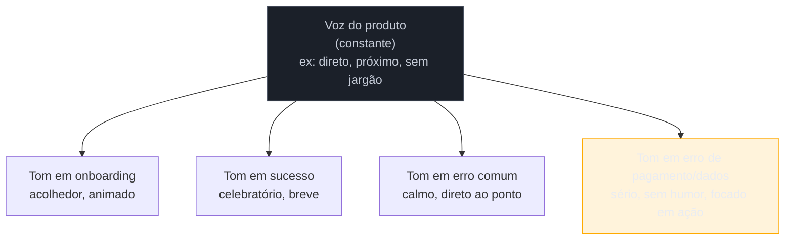

# Voz e tom

> [!abstract] TL;DR
> **Voz** é a personalidade do produto — não muda entre telas, é a mesma em todo lugar. **Tom** é a voz ajustada ao contexto e ao estado emocional do usuário — o mesmo produto fala diferente numa tela de sucesso e numa tela de erro de pagamento. O erro clássico é confundir os dois: manter a voz "divertida" também no momento em que o usuário acabou de perder dados ou dinheiro. Praticável sozinho: um mini style-guide de **meia página a uma página**, com 3-5 adjetivos de voz e uma tabela "isto sim / isto não" — o valor está nos exemplos contrastantes, não na prosa descritiva de quem a marca "é".

Imagine um app financeiro cuja marca decidiu, num workshop de branding, que a voz do produto seria "divertida, próxima, sem formalidade corporativa". A equipe de copy aplica essa diretriz em todo lugar: o onboarding cumprimenta com "Aí, tudo certo?", o botão de transferência diz "Manda ver!", e a tela de sucesso comemora com um emoji de foguete. Até aqui, funciona — o produto tem personalidade e se diferencia da concorrência bancária tradicional. O problema aparece na tela seguinte: uma transferência falha porque o cartão foi recusado, e a mensagem de erro diz "Ops, deu ruim! 😅 Bora tentar de novo?". O usuário, que estava tentando pagar uma conta atrasada e agora não sabe se o dinheiro saiu da conta ou não, não acha graça nenhuma. A mesma voz que soava simpática na tela de boas-vindas soa desrespeitosa na tela de erro — porque ninguém separou "quem o produto é" (constante) de "como o produto deveria soar agora, dado o que o usuário está sentindo" (variável).

## Voz é constante, tom é variável

A distinção central do campo, usada por praticamente toda literatura de content design desde Nicole Fenton e Kate Kiefer Lee em *[Nicely Said](https://www.nicelysaid.co/)* (2014), é esta: **voz é a personalidade do produto — fixa, definida uma vez, aplicada em todo lugar.** É o equivalente textual de uma identidade visual: assim como um produto não muda de paleta de cores dependendo da tela, ele não muda de personalidade dependendo da tela. **Tom é a voz modulada pelo contexto** — mais especificamente, pelo estado emocional em que o usuário provavelmente está naquele momento da jornada.

Pense em uma pessoa real com personalidade estável — digamos, alguém genuinamente bem-humorado. Essa pessoa não some quando o assunto fica sério: ela continua sendo quem é, mas ajusta *como* fala. No velório de um amigo, ela não conta piada, mas também não vira outra pessoa — ela está mais quieta, mais cuidadosa, ainda ela mesma. Numa comemoração, o humor volta à tona sem esforço. A voz (quem ela é) não mudou; o tom (como ela se expressa naquele momento) mudou porque o contexto mudou. Um produto que erra o tom na tela de erro de pagamento é como aquela pessoa que conta piada no velório — não porque a personalidade dela seja ruim, mas porque ela não percebeu que o momento pedia outra coisa.

**O mecanismo em uma frase:** a voz responde "quem fala", o tom responde "como essa pessoa fala dado o que está acontecendo agora" — e o erro de misturar os dois é tratar a resposta da primeira pergunta como se já respondesse a segunda.

> [!question]- Se a voz não muda, por que ela parece diferente lendo textos de telas distintas?
> Porque o vocabulário e a estrutura de frase mudam com o tom, mas o *caráter* por trás deles não. Um produto de voz "direta e sem jargão" continua direto e sem jargão tanto na tela de boas-vindas quanto na tela de erro — o que muda é a temperatura emocional: mais leveza quando o contexto permite, mais sobriedade quando o usuário está sob estresse. Se ler duas telas do mesmo produto dá a sensação de dois produtos diferentes, a voz não estava definida com precisão suficiente para sobreviver à variação de tom.

## Praticável sozinho: o mini style-guide de voz e tom

A coluna prática desta nota é curta de propósito: um engenheiro fractional não vai escrever (nem precisa escrever) um voice & tone guide de 20 páginas com seções de história de marca, arquétipos e workshops de brand voice — isso é trabalho de content strategist com tempo e orçamento dedicados. O que dá para fazer sozinho, em uma tarde, é um documento de **meia página a uma página** com três peças:

1. **3-5 adjetivos de voz**, cada um com uma frase de exemplo — não adjetivos genéricos como "amigável" (todo produto se descreve como amigável), mas adjetivos que discriminam: "direto" (não "claro", que não diz nada sobre concisão), "sem jargão técnico", "respeitoso mesmo sob pressão".
2. **Uma tabela "isto sim / isto não"** com 5-8 pares de frases reais do produto — o valor do documento inteiro está aqui, porque exemplo contrastante ensina em segundos o que um parágrafo de descrição de personalidade não ensina em uma página.
3. **Uma linha por estado emocional principal** (sucesso, erro comum, erro grave/financeiro, primeira vez) dizendo em que direção o tom se desloca a partir da voz-base — não uma reescrita completa da voz, só o ajuste.

O que **não** compensa fazer sozinho, e volta a aparecer nas armadilhas abaixo, é tentar reproduzir a profundidade de um documento de content strategy formal — arquétipos de marca, pesquisa de percepção de tom por segmento de usuário, testes A/B de variações de copy. Isso exige tráfego, orçamento e, geralmente, mais de uma pessoa decidindo — exatamente o recorte "exige time" descrito na [[03-Dominios/Engenharia/UX/Fundamentos e Modelo Mental/01 - UX não é tela - o ofício e seus limites|nota 01]] deste domínio.

| Isto sim | Isto não |
|---|---|
| "Não conseguimos processar o pagamento. Verifique os dados do cartão e tente de novo." | "Ops, deu ruim! 😅 Bora tentar de novo?" |
| "Sua conta foi criada. Vamos configurar o primeiro projeto?" | "PARABÉÉÉNS!!! Você tá dentro! 🎉🎉🎉" |
| "Não encontramos resultados para 'relatório trimestral'. Tente outro termo ou remova filtros." | "Hmm, nada por aqui! Que tal tentar de novo? 🤔" |

## Casos práticos

### Cenário 1: o app financeiro que comemora o próprio erro
Retomando o cenário de abertura: um app bancário aplica a mesma voz "divertida e próxima" em toda tela, sem distinguir tom por contexto. Na tela de cartão recusado, o emoji e a exclamação da mensagem de erro fazem o usuário se sentir zombado num momento de ansiedade real sobre dinheiro. A correção não é abandonar a voz do produto — é definir, no mini style-guide, uma linha específica: "em erros que envolvem dinheiro ou dados perdidos, o tom cai para sério e direto, sem humor, mesmo mantendo o vocabulário simples e próximo que é a marca registrada da voz." O texto vira "Não conseguimos processar o pagamento agora. Nenhum valor foi debitado. Tente novamente ou use outro cartão." — ainda soa como o mesmo produto, mas sem o descompasso emocional.

### Cenário 2: o SaaS B2B em que cada engenheiro escreve o próprio erro
Um SaaS interno cresce ao longo de dois anos, com seis engenheiros diferentes escrevendo mensagens de erro pontualmente, cada um no momento em que implementava a feature correspondente. Não existe voz nem tom definidos em lugar nenhum. O resultado, invisível linha a linha durante o desenvolvimento, fica óbvio quando alguém navega o produto inteiro numa sessão: uma tela fala "Erro: campo obrigatório", outra fala "Ops! Esqueceu de preencher um campinho aqui", outra ainda simplesmente mostra "400 Bad Request". São três vozes diferentes, nenhuma delas escolhida deliberadamente — são o resultado de seis pessoas com gosto pessoal de escrita diferente, sem um documento de referência para alinhar contra. A correção prática, que qualquer um dos seis poderia ter feito sozinho: um mini style-guide de uma página, linkado no README do design system, que qualquer engenheiro consulta antes de escrever uma string nova.

### Cenário 3: a landing page "engraçada" que não sobrevive ao primeiro erro de checkout
Uma ferramenta de produtividade define sua voz como "espirituosa" logo na landing page e no onboarding, e os primeiros usuários reagem bem — a personalidade diferencia o produto de concorrentes genéricos. Só que o time nunca discutiu explicitamente onde o humor para. No fluxo de checkout, um erro de cartão gera a mesma piadinha usada no onboarding ("Eita, isso não rolou 😬"), só que agora o usuário está tentando *pagar* pelo produto e vê a falha como sinal de que o sistema de pagamento é pouco confiável. A métrica de abandono no checkout confirma o problema. A correção: manter o humor onde ele conquistou o usuário (marketing, onboarding, sucesso) e desligá-lo explicitamente em qualquer tela que envolva dinheiro, dados sensíveis ou erro grave — a mesma regra do Cenário 1, aplicada a um produto diferente.

## Armadilhas comuns

> [!warning] Voz divertida no momento errado
> **O que acontece:** o tom "engraçadinho" da marca aparece intacto numa tela de erro grave, perda de dados ou falha de pagamento — exatamente os cenários 1 e 3 acima. **Por quê:** quando a voz é definida sem uma regra explícita de variação de tom, a equipe (ou o próprio engenheiro escrevendo a string) aplica a mesma personalidade em toda tela por padrão, porque é o caminho de menor esforço — copiar o registro que já existe em outro lugar do produto. **Como evitar:** no mini style-guide, nomeie explicitamente pelo menos um estado emocional em que o humor é desligado (erro financeiro, perda de dados, cancelamento) — a regra "onde o tom muda" precisa estar escrita, não presumida.

> [!warning] Confundir "ter voz" com "ser genérico e formal"
> **O que acontece:** por medo de errar o tom, o time reage removendo toda personalidade — toda mensagem vira um texto burocrático e neutro, mesmo em telas de sucesso onde um pouco de calor humano ajudaria. **Por quê:** overcorrection é o reflexo natural depois de um erro de tom visível (como o Cenário 1) — "vamos parar de arriscar" é mais fácil de decidir em grupo do que "vamos definir onde arriscar e onde não". **Como evitar:** trate voz e tom como um espectro com regras, não como ligado/desligado. A voz continua presente mesmo em erro grave — só perde o humor, não a clareza nem a proximidade do vocabulário.

> [!warning] Nenhum documento de referência, cada string escrita isoladamente
> **O que acontece:** como no Cenário 2, cada engenheiro escreve a mensagem que "soa certa" pra ele no momento em que implementa a feature, sem consultar nada — e o produto acumula N vozes diferentes ao longo do tempo. **Por quê:** copy de interface é frequentemente tratada como preenchimento de última hora, não como decisão de produto (ver a armadilha "copy escrita por último", estrutural neste sub-galho) — sem um documento de referência, não existe padrão contra o qual comparar a string nova. **Como evitar:** o mini style-guide de uma página, mesmo informal, funciona como o "linter" da voz do produto — qualquer engenheiro consegue conferir a própria string contra ele antes de dar commit, sem precisar perguntar a ninguém.

## Como explicar em inglês

> "**Voice** is your product's personality — it's constant, it doesn't change screen to screen. **Tone** is that voice adjusted to context and to the user's likely emotional state — the same product sounds different on a success screen than on a failed-payment screen. The classic mistake is keeping a 'fun' tone in the exact moment a user just lost data or money. The practical version of this, doable solo, is a half-page to one-page style guide: 3-5 voice adjectives plus a 'do this / not this' table of real product copy — the contrastive examples do more work than any paragraph describing what the brand 'is'."

| PT | EN |
|----|----|
| voz do produto | brand/product voice |
| tom | tone |
| tom varia com o contexto | tone shifts with context |
| mini style-guide de voz e tom | voice and tone mini style guide |
| estado emocional do usuário | user's emotional state |
| copy da interface | UI copy |

## O que vem a seguir

Voz e tom definem *como* o produto soa. A próxima nota entra no *o quê* — as palavras específicas de cada botão, campo e mensagem curta, e a armadilha mais provável para quem vem de engenharia: deixar o vocabulário interno do sistema vazar para a tela que o usuário lê.

- [[03-Dominios/Engenharia/UX/UX Writing e Content Design/34 - Microcopy, labels de ação e jargão interno|34 — Microcopy, labels de ação e jargão interno]] — cada palavra da interface como decisão de produto, e por que o jargão interno vazando é o erro mais comum de quem já pensa em termos de modelo de domínio.
- [[03-Dominios/Engenharia/UX/UX Writing e Content Design/35 - Erros - fluxo de recuperação e mensagem que não culpa|35 — Erros: fluxo de recuperação e mensagem que não culpa]] — o caso mais crítico de acerto de tom: a mensagem de erro que o Cenário 1 desta nota já antecipou.

## Fontes

- **Nicole Fenton e Kate Kiefer Lee** — *[Nicely Said: Writing for the Web with Style and Purpose](https://www.nicelysaid.co/)* (Peachpit Press, 2014) — origem da distinção voz constante / tom variável usada nesta nota, com entrevistas a Kristina Halvorson e Sarah Richards (GOV.UK) sobre voz e style guides simples.
- **Torrey Podmajersky** — *Strategic Writing for UX* (O'Reilly, 1ª ed., julho de 2019) — tratamento estratégico de voz e tom como parte do content design de produto. Existe uma 2ª edição anunciada (atualizada para conteúdo de UX assistido por IA), mas a data de publicação não foi confirmada em fonte independente — não citar o ano dela.
- **Ginny (Janice) Redish** — *Letting Go of the Words: Writing Web Content that Works* (Morgan Kaufmann, 1ª ed. 2007, 2ª ed. 2014) — tese de escrever para conversa, não para prosa impressa; base para o registro direto que sustenta qualquer voz de produto.

> [!tip] Assista: The Four Dimensions of Tone of Voice in UX Writing
> **Canal:** Nielsen Norman Group (NN/g) | **Duração:** ~3min | **Idioma:** EN
>
> O vídeo aplica a mesma mensagem de erro genérica ("An error has occurred") em quatro combinações de tom — sério/formal, casual, entusiasmado, irreverente — usando quatro dimensões (humor, formalidade, respeito, entusiasmo) para mostrar como a mesma voz-base produz textos completamente diferentes dependendo da escolha de tom. É a demonstração prática exata do mecanismo desta nota: a personalidade não muda, a expressão muda.
>
> 🎬 [Assistir no YouTube](https://www.youtube.com/watch?v=0ar4DezKKGI)
