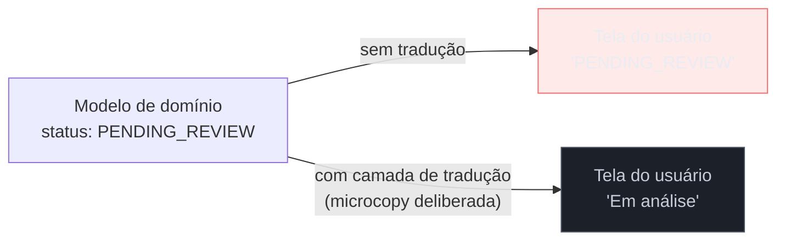

# Microcopy, labels de ação e jargão interno

> [!abstract] TL;DR
> **Microcopy** é o texto curto que a interface fala em toda parte — labels de botão, placeholder, tooltip, título de campo — e cada palavra dele é **decisão de produto**, não preenchimento. Um label de botão orientado a ação (verbo + objeto específico, como "Excluir conta" em vez de "OK") diz o que vai acontecer sem exigir que o usuário releia o texto acima. Terminologia consistente — um glossário simples de termos do produto — evita a maior parte da inconsistência de copy com pouco esforço. A armadilha mais provável para este público é o **jargão interno vazando para a UI**: nome de tabela, valor de enum, código de erro de backend aparecendo direto na tela do usuário final — o sintoma exato de que o **modelo de domínio vazou para fora do sistema**, a mesma disciplina de nomeação de código exercida (ou negligenciada) na superfície visível.

Imagine revisar o PR de uma feature de exclusão de registro. O componente de confirmação tem dois botões: "OK" e "Cancelar". O código está limpo, o teste passa, a função `deleteRecord()` é chamada corretamente ao clicar em "OK". Do ponto de vista de engenharia, está tudo certo. Do ponto de vista do usuário, "OK" não diz nada — OK para quê? Confirmar o quê, exatamente? Ele releu o texto acima ("Tem certeza que deseja continuar?") para lembrar o que "OK" significa, e num fluxo mais longo, com mais de um modal na sequência, essa releitura vira hesitação real: alguns usuários clicam errado, outros abandonam por insegurança. Nenhuma linha de código está errada. A palavra "OK" é que está fazendo o trabalho errado — porque ninguém tratou aquela palavra como decisão de produto, só como texto padrão de botão.

## Cada palavra é decisão de produto

Microcopy é o nome que o campo dá ao texto curto — normalmente uma frase ou menos — que aparece em toda interface: labels de botão, placeholder de campo, texto de tooltip, título de seção, mensagem de confirmação, texto de link. É, de longe, a forma de copy mais abundante de qualquer produto: a maioria das telas não tem nenhum parágrafo de texto corrido, só microcopy espalhada pelos componentes. E, justamente por ser curta e onipresente, é fácil tratá-la como preenchimento sem decisão — o "texto que tem que ter ali" em vez do "texto que decide se o usuário entende o que vai acontecer".

### Labels de botão orientados a ação

A regra prática mais citada em UX writing para labels de botão é **verbo + objeto específico**: o label deve dizer exatamente o que vai acontecer quando clicado, sem exigir que o usuário releia o contexto ao redor para decidir. "Excluir conta" é melhor que "OK" ou "Confirmar" porque contém a ação (excluir) e o objeto dessa ação (conta) — o usuário decide com uma leitura só, sem precisar voltar ao parágrafo anterior para reconstruir o que "confirmar" está confirmando.

| Genérico (evitar) | Orientado a ação (usar) |
|---|---|
| "OK" | "Excluir conta" |
| "Confirmar" | "Cancelar assinatura" |
| "Enviar" | "Enviar pedido de reembolso" |
| "Sim" / "Não" | "Sim, cancelar" / "Não, manter assinatura" |

Repare que o padrão vale principalmente para **ações com consequência** — exclusão, cancelamento, envio de algo irreversível ou custoso. Um botão "Salvar" genérico num formulário simples raramente precisa virar "Salvar as alterações deste formulário" — o contexto já é óbvio o suficiente. A regra existe para reduzir ambiguidade quando a ambiguidade tem custo real, não para inflar todo botão do produto com um parágrafo.

### Terminologia consistente

A segunda peça de microcopy disciplinada é um **glossário de termos do produto** — uma lista curta que fixa, por exemplo, que a entidade que o usuário cria sempre se chama "projeto" na interface, nunca "workspace" numa tela e "espaço de trabalho" noutra. Sinônimos livres para o mesmo conceito parecem inofensivos individualmente, mas somados ao longo do produto forçam o usuário a decidir, a cada tela nova, se "workspace" e "projeto" são a mesma coisa ou coisas diferentes — é exatamente a heurística 4 de Nielsen (consistência e padrões, ver [[03-Dominios/Engenharia/UX/Fundamentos e Modelo Mental/03 - As 10 heurísticas de Nielsen|nota 03]]) aplicada ao vocabulário em vez de ao layout. Manter um glossário simples de termos do produto — uma tabela de uma página, termo aprovado por conceito — resolve a maior parte desse problema com esforço baixo: é a mesma disciplina de nomeação que um engenheiro já aplica a classes e variáveis no código, só que exercida na superfície que o usuário lê.

## A armadilha central: jargão interno vazando para a UI

Para o público deste domínio — quem já pensa em termos de modelagem, camadas e contratos internos — a armadilha mais provável não é escrever um botão "OK" genérico. É o oposto: escrever exatamente o vocabulário interno do sistema direto na tela, porque é o vocabulário que já está na cabeça de quem construiu a feature. Nome de coluna de banco de dados, valor cru de um enum (`status: PENDING_REVIEW`), código de erro HTTP, nome de uma flag de feature interna — tudo isso vazando para o texto que o usuário final lê.

> [!question]- Por que isso acontece tanto com quem vem de engenharia especificamente?
> Porque o modelo mental de quem construiu a feature já tem nomes — a tabela se chama `orders`, o campo se chama `status`, o valor válido é o enum `SHIPPED`. Esses nomes são ótimos *para o código*: precisos, sem ambiguidade, fáceis de buscar. O erro é assumir que, por serem bons nomes internos, também são bons nomes de interface — sem perceber que o usuário não compartilha o mesmo modelo mental de quem projetou o schema.

Esse vazamento não é um detalhe estético: **é o sintoma direto de que o modelo de domínio vazou para o usuário sem tradução.** No vocabulário de modelagem que este público já tem — [[03-Dominios/Engenharia/Arquitetura/Arquitetura de Software#Domain-Driven Design (DDD)|Domain-Driven Design]] descreve exatamente esse problema com o conceito de **bounded context**: um mesmo conceito ("pedido", "status") pode ter um modelo interno rico, cheio de estados técnicos, e um modelo externo que precisa ser deliberadamente mais simples e mais próximo da linguagem do usuário. A **Ubiquitous Language** de um bounded context é a linguagem compartilhada *dentro* daquele contexto entre devs e especialistas de domínio — não é automaticamente a linguagem que deveria aparecer na tela do usuário final, que muitas vezes está fora desse contexto e não compartilha o vocabulário técnico dele. Quando um valor de enum aparece cru na UI, o que aconteceu é que a fronteira de tradução entre o modelo interno e a superfície visível simplesmente não existiu — o mesmo tipo de vazamento que uma Anti-Corruption Layer existe para evitar entre dois bounded contexts, só que aqui o "contexto externo" é o próprio usuário.

**O mecanismo em uma frase:** todo valor interno que chega à tela sem passar por uma camada de tradução de microcopy carrega consigo as escolhas de nomenclatura otimizadas para o código, não para quem lê a tela — e a correção é sempre a mesma, uma tabela pequena mapeando cada valor interno para o texto que o usuário deveria ler.

## O que dá pra fazer sozinho, e o que não dá

O núcleo praticável sozinho aqui é desproporcionalmente barato para o retorno que dá. Escrever um **glossário de termos do produto** — uma tabela de uma página com o termo aprovado para cada conceito central, e uma nota rápida de quais sinônimos evitar — evita, segundo a prática difundida em content design, a maior parte da inconsistência de copy do produto com uma fração pequena do esforço: é o mesmo princípio de "poucas regras, aplicadas com disciplina" que qualquer padrão de nomeação de código já segue, só que documentado numa página em vez de vivido só na cabeça de quem escreveu. Da mesma forma, **mapear cada enum e cada código de erro interno para um texto legível** é trabalho mecânico e finito — uma tabela `valor_interno → texto_para_usuário` que qualquer engenheiro escreve sozinho, sem depender de mais ninguém, e que elimina o vazamento de jargão de uma vez por todas naquele fluxo. E **revisar os labels de botão de ação com consequência** (excluir, cancelar, enviar dado sensível) contra o padrão verbo+objeto é uma passada de 30 minutos por produto, não um projeto.

O que exige mais estrutura é diferente em natureza, não em disciplina: um **glossário de produto formal, com governança entre times** — onde múltiplas equipes precisam concordar e manter sincronizado um vocabulário compartilhado entre produtos ou squads — exige processo organizacional que uma pessoa sozinha não instaura por decreto, porque depende de outras pessoas aderirem e manterem ao longo do tempo. Um **sistema de content design com catálogo de mensagens versionado e revisão editorial** (o tipo de estrutura que grandes produtos usam para garantir que centenas de strings, escritas por dezenas de pessoas, permaneçam consistentes) é investimento de plataforma, não de uma feature — o retorno só compensa quando o volume de strings e de pessoas escrevendo justifica a manutenção contínua. E uma **pesquisa formal de comprensão de terminologia com usuários reais** (testar se "workspace" e "projeto" são realmente entendidos como sinônimos pelo público-alvo, ou se um deles gera confusão sistemática) exige participantes e metodologia — sem isso, a escolha do termo aprovado no glossário continua sendo julgamento informado, não fato validado, e vale nomear essa diferença honestamente ao cliente ou ao time.

| Praticável sozinho | Exige time/estrutura |
|---|---|
| Glossário de termos do produto (1 página) | Glossário multi-time com governança |
| Tabela enum interno → texto legível | Catálogo de mensagens versionado com revisão editorial |
| Revisão de labels de botão (verbo + objeto) | Pesquisa de compreensão de terminologia com usuários |

## Casos práticos

### Cenário 1: o modal de exclusão com "OK" e "Cancelar"
Retomando a abertura desta nota: um modal de confirmação de exclusão de registro usa "OK" e "Cancelar" como labels. Um teste de usabilidade guerrilha com 5 pessoas (praticável sozinho, ver [[03-Dominios/Engenharia/UX/Fundamentos e Modelo Mental/01 - UX não é tela - o ofício e seus limites|nota 01]]) mostra duas delas hesitando visivelmente antes de clicar, uma perguntando em voz alta "OK de quê mesmo?". A correção não muda nenhuma lógica: troca "OK" por "Excluir registro" e "Cancelar" por "Manter registro" — os dois labels agora descrevem a consequência de cada clique sem exigir releitura do texto acima.

### Cenário 2: o enum de status vazando direto na lista de pedidos
Uma tela de pedidos internos mostra a coluna "Status" com os valores exatamente como vêm do banco: `PENDING_REVIEW`, `SHIPPED`, `CANCELLED_BY_USER`. Funciona para quem construiu o sistema — os valores são autoexplicativos para um engenheiro. Para o time de operações que usa a tela todo dia, os underscores e o inglês técnico exigem uma tradução mental repetida centenas de vezes ao dia. A correção é uma tabela de mapeamento — `PENDING_REVIEW → "Em análise"`, `CANCELLED_BY_USER → "Cancelado pelo cliente"` — aplicada na camada de apresentação, sem tocar no schema nem no enum interno. É o exato mecanismo descrito na seção acima: o modelo de domínio continua rico e preciso por dentro; só a fronteira de exibição ganha uma camada de tradução que antes não existia.

### Cenário 3: "workspace", "espaço" e "projeto" disputando a mesma tela
Um produto B2B, construído ao longo de um ano por três desenvolvedores diferentes em momentos distintos, usa "workspace" no menu lateral, "espaço de trabalho" no e-mail de convite, e "projeto" na documentação de suporte — todos referindo-se exatamente ao mesmo conceito. Um cliente novo, tentando seguir um artigo de ajuda que menciona "projeto", não encontra esse termo em lugar nenhum da própria interface e abre um ticket de suporte perguntando onde fica essa funcionalidade. A causa não é falta de conteúdo de ajuda — é ausência de um glossário de termos do produto que qualquer um dos três desenvolvedores poderia ter criado sozinho, em uma tarde, no início do projeto.

## Armadilhas comuns

> [!warning] Jargão interno vazando para a UI
> **O que acontece:** nome de tabela, valor de enum ou código de erro de backend aparece diretamente na tela do usuário final, como no Cenário 2. **Por quê:** é o vocabulário que já está na cabeça de quem construiu a feature — nenhuma tradução extra é necessária para o código funcionar, então a tradução para o usuário simplesmente não acontece, a menos que alguém pare para adicioná-la deliberadamente. **Como evitar:** trate toda saída de um enum, código de erro ou valor técnico como um ponto de tradução obrigatório antes de chegar à tela — uma tabela pequena `valor interno → texto do usuário`, mantida perto do código, resolve estruturalmente.

> [!warning] Label de botão que exige releitura do contexto
> **O que acontece:** botões genéricos como "OK", "Confirmar" ou "Enviar" em ações com consequência real, forçando o usuário a voltar ao texto acima para lembrar o que está confirmando (Cenário 1). **Por quê:** "OK" é o texto padrão que qualquer biblioteca de componentes de UI sugere primeiro — é o caminho de menor esforço ao implementar o modal, e funciona sem erro nenhum de código, então nunca é sinalizado como problema em revisão técnica. **Como evitar:** para toda ação com consequência (exclusão, cancelamento, envio irreversível), aplique o padrão verbo + objeto específico — "Excluir conta", não "OK".

> [!warning] Sinônimos livres para o mesmo conceito
> **O que acontece:** o mesmo conceito de produto aparece com nomes diferentes em telas, e-mails e documentação diferentes, como no Cenário 3. **Por quê:** sem um glossário centralizado, cada pessoa que escreve uma string nova usa a palavra que soa natural para ela naquele momento — nenhuma delas está "errada" isoladamente, mas a soma cria inconsistência que o usuário sente como confusão. **Como evitar:** um glossário de termos do produto de uma página, consultado antes de nomear qualquer conceito novo na UI, elimina a maior parte dessa deriva com esforço mínimo.

## Como explicar em inglês

> "**Microcopy** — button labels, placeholders, tooltips — is a product decision, not filler text. Action-oriented button labels (verb + specific object, like 'Delete account' instead of 'OK') tell users exactly what will happen without forcing them to re-read surrounding context. The single most likely trap for engineers writing their own UI copy is **internal jargon leaking into the interface** — a raw enum value, a database column name, a backend error code showing up on the user-facing screen. That's not a cosmetic issue; it's the symptom of a **domain model leaking without translation** — the same problem an anti-corruption layer solves between bounded contexts, except here the 'external context' is the end user."

| PT | EN |
|----|----|
| microcopy | microcopy |
| label de ação | action-oriented label |
| glossário de termos do produto | product terminology glossary |
| jargão interno vazando | internal jargon leaking |
| modelo de domínio | domain model |
| linguagem ubíqua | ubiquitous language |
| camada de tradução | translation layer |

## O que vem a seguir

Uma vez que o vocabulário do produto está consistente e traduzido para o usuário, o teste mais duro aparece exatamente quando algo dá errado: é na tela de erro que o jargão interno mais tenta vazar (um código de exceção é, literalmente, jargão de sistema), e é ali que o tom de voz definido na nota anterior mais precisa segurar sob pressão.

- [[03-Dominios/Engenharia/UX/UX Writing e Content Design/35 - Erros - fluxo de recuperação e mensagem que não culpa|35 — Erros: fluxo de recuperação e mensagem que não culpa]] — a mesma disciplina de tradução desta nota, aplicada ao caso mais crítico: o momento em que o sistema falhou.
- [[03-Dominios/Engenharia/Arquitetura/Arquitetura de Software|Arquitetura de Software]] — para quem quiser aprofundar bounded context e Domain-Driven Design além do que esta nota usa por empréstimo.

## Fontes

- **Nicole Fenton e Kate Kiefer Lee** — *Nicely Said: Writing for the Web with Style and Purpose* (Peachpit Press, 2014) — cobre microcopy e style guides simples como parte do mesmo tratamento de voz e tom usado na nota anterior.
- **Ginny (Janice) Redish** — *Letting Go of the Words: Writing Web Content that Works* (Morgan Kaufmann, 2ª ed. 2014) — tese de escrever para conversa, base do padrão verbo + objeto em labels de ação.
- **Torrey Podmajersky** — *Strategic Writing for UX* (O'Reilly, 1ª ed., julho de 2019) — tratamento de microcopy como parte de um sistema de content design estratégico, não texto avulso.
- **Eric Evans** — *Domain-Driven Design* (2003), via [[03-Dominios/Engenharia/Arquitetura/Arquitetura de Software|Arquitetura de Software]] deste vault — origem dos conceitos de Bounded Context e Ubiquitous Language usados para explicar o vazamento de jargão interno.

> [!tip] Assista: The 3 Sizes of UX Copy
> **Canal:** Nielsen Norman Group (NN/g) | **Duração:** ~5min | **Idioma:** EN
>
> O vídeo define com precisão as três categorias de texto de UX — long-form, short-form e microcopy — e mostra por que microcopy, apesar de ser a menor unidade de texto, é a mais abundante e não sobrevive sozinha: sem os elementos visuais e o contexto ao redor, ela não comunica nada. É a base conceitual que sustenta por que cada label de botão desta nota precisa ser tratado com o mesmo cuidado de uma frase inteira, mesmo tendo só duas ou três palavras.
>
> 🎬 [Assistir no YouTube](https://www.youtube.com/watch?v=MBrngFrbEAs)
