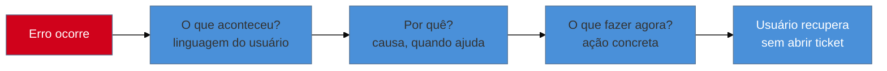

# Erros: fluxo de recuperação e mensagem que não culpa

> [!abstract] TL;DR
> Uma boa mensagem de erro tem três partes, sempre nesta ordem: **o que aconteceu · por que · o que fazer agora.** A regra de tom mais violada é culpar o usuário — "Digite um e-mail válido" é melhor que "Você digitou um e-mail inválido", porque foca na solução, não na falha, e evita que o usuário se sinta repreendido por um sistema. A âncora canônica é a **heurística 9 de Nielsen** (ajudar a reconhecer, diagnosticar e recuperar de erros); esta nota não a reexplica, aprofunda o **conteúdo e o tom** da mensagem. O *fluxo* de recuperação e o desenho do retry pertencem à nota 25 (latência e feedback); o **anúncio a leitor de tela** já está no domínio de Acessibilidade — aqui, linka-se os dois, não se repete nenhum.

Imagine preencher um formulário de cadastro, clicar em "Enviar" e ver, no topo da tela, uma faixa vermelha genérica: "Algo deu errado, tente novamente". Nenhuma indicação de qual campo, qual regra foi violada, ou se o problema é seu (um campo mal preenchido) ou do sistema (o servidor caiu). Você revisa o formulário inteiro, não encontra nada óbvio, tenta enviar de novo — a mesma mensagem aparece. Na terceira tentativa, você desiste e abandona o cadastro. Três dias depois, uma investigação no time revela que o erro era um CEP com formato inválido, detectado no backend, mas cuja mensagem específica nunca chegou ao frontend — só o "algo deu errado" chegou. O sistema *sabia* exatamente o que estava errado. A mensagem que o usuário recebeu não sabia de nada. É esse abismo entre "o sistema tem a informação" e "o usuário recebeu a informação" que esta nota existe para fechar — e ele se fecha com texto, não com mais lógica de validação.

## Anatomia de um bom erro

Toda mensagem de erro que funciona responde três perguntas, nesta ordem, e uma mensagem que pula qualquer uma delas deixa o usuário preso:

1. **O que aconteceu** — nomear o problema em linguagem que o usuário entende, sem código interno nem jargão de sistema (a mesma disciplina de tradução da [[03-Dominios/Engenharia/UX/UX Writing e Content Design/34 - Microcopy, labels de ação e jargão interno|nota 34]] aplicada ao pior momento possível: quando algo já falhou).
2. **Por que** — dar contexto suficiente para o usuário entender a causa, quando isso ajuda a evitar repetir o erro (nem todo erro precisa de explicação longa, mas "campo obrigatório vazio" é diferente de "conexão perdida", e o usuário se beneficia de saber qual dos dois aconteceu).
3. **O que fazer agora** — a parte mais frequentemente ausente. Uma mensagem que diagnostica bem mas não sugere ação deixa o usuário informado e ainda assim travado.

A âncora canônica dessa estrutura é a **heurística 9 de Nielsen — ajudar o usuário a reconhecer, diagnosticar e recuperar de erros** — já coberta em profundidade na [[03-Dominios/Engenharia/UX/Fundamentos e Modelo Mental/03 - As 10 heurísticas de Nielsen|nota 03]] deste domínio. Esta nota não reexplica a heurística; ela é a aplicação concreta dela ao problema específico de *como escrever* o texto que a heurística exige.

**O mecanismo em uma frase:** o sistema quase sempre já sabe o que aconteceu — a mensagem de erro genérica não é falta de informação técnica, é falta de tradução dessa informação para as três perguntas que o usuário precisa ter respondidas.

## Não culpar o usuário

A regra de tom mais citada — e mais violada — em conteúdo de erro é não colocar a culpa no usuário. Compare: "Você digitou um e-mail inválido" versus "Digite um e-mail válido". As duas frases descrevem exatamente a mesma situação técnica, mas a primeira posiciona o usuário como quem errou (sujeito da frase: "você"), e a segunda foca na ação corretiva (o verbo no imperativo aponta para o próximo passo, não para a falha passada). A diferença parece cosmética até se pensar no volume: um formulário com dez validações que culpam o usuário, uma a uma, acumula uma sensação de estar sendo repreendido por uma máquina — desproporcional ao tamanho real de cada erro individual, que muitas vezes é só um espaço a mais ou um formato diferente do esperado.

O princípio se generaliza: **erro inline, perto do campo que falhou**, é preferível a uma faixa genérica no topo da tela, pela mesma razão da heurística 6 de Nielsen (reconhecimento em vez de recordação, ver [[03-Dominios/Engenharia/UX/Fundamentos e Modelo Mental/03 - As 10 heurísticas de Nielsen|nota 03]]) — o usuário não deveria precisar lembrar qual dos doze campos do formulário está com problema; a mensagem deveria estar exatamente onde o olho já está olhando.

> [!question]- "Digite um e-mail válido" não soa impessoal demais, sem nenhuma cordialidade?
> Impessoal e direto não é o mesmo que frio. A frase pode carregar o tom de voz definido no mini style-guide do produto (ver [[03-Dominios/Engenharia/UX/UX Writing e Content Design/33 - Voz e tom|nota 33]]) sem precisar do sujeito acusatório: "Esse e-mail não parece válido — confira o formato" mantém a mesma orientação-para-solução, mas soa mais próximo, se essa for a voz do produto. O que não muda é o alvo da frase: sempre a correção, nunca a falha do usuário.

## Anti-padrão fixo: a mensagem genérica que não distingue causas

"Algo deu errado, tente novamente" é o anti-padrão mais comum, e o motivo pelo qual ele é ruim não é a falta de simpatia — é a falta de **discriminação de causa**. Uma falha de rede, uma falha de permissão e uma falha de servidor são três situações completamente diferentes, e cada uma pede uma ação diferente do usuário: tentar de novo resolve a primeira, não resolve nenhuma das outras duas. Uma mensagem genérica trata as três como se fossem a mesma coisa, e o usuário — sem saber qual delas está acontecendo de fato — só tem uma ação disponível: repetir a mesma tentativa que já falhou, o que funciona só por acidente, quando o problema realmente era transitório de rede.

| Causa real | Mensagem genérica (evitar) | Mensagem específica (usar) |
|---|---|---|
| Falha de rede | "Algo deu errado, tente novamente" | "Não foi possível conectar. Verifique sua internet e tente de novo." |
| Falha de permissão | "Algo deu errado, tente novamente" | "Você não tem permissão para esta ação. Peça acesso ao administrador." |
| Falha de servidor | "Algo deu errado, tente novamente" | "Nosso servidor está com um problema. Já estamos verificando — tente novamente em alguns minutos." |

## As duas fronteiras que esta nota respeita

Esta nota cobre deliberadamente só uma fatia do problema de erro, e as outras duas fatias já têm dono no vault — linkar em vez de reexplicar evita que as três notas divirjam com o tempo.

**Fronteira com o fluxo de recuperação:** o *desenho* do que acontece depois do erro — se existe botão de retry, se o retry é automático ou manual, como o estado "carregando de novo" aparece — pertence à [[03-Dominios/Engenharia/UX/Design de Interação/25 - Latência percebida e feedback|nota 25]] (latência percebida e feedback) e ao design de interação de forma mais ampla. Esta nota decide **o que o texto diz**; a nota 25 decide **como a interação de tentar de novo se comporta**. Uma mensagem de erro bem escrita ("Não foi possível conectar. Tente novamente.") ainda depende de um botão de retry bem desenhado para se completar — as duas peças são necessárias, nenhuma substitui a outra.

**Fronteira com acessibilidade:** quando o erro aparece na tela, alguém usando leitor de tela precisa ser avisado da mudança de estado sem precisar navegar manualmente até encontrá-la — isso é resolvido tecnicamente com uma região `aria-live` (ou equivalente) anunciando a mudança, mecanismo já coberto em [[03-Dominios/Tecnologia/Acessibilidade/Construir Acessível/07 - Formulários acessíveis de verdade|Formulários acessíveis de verdade]], no domínio de Acessibilidade. Esta nota não reexplica ARIA nem `aria-live` — o texto que a região anuncia é assunto de conteúdo (aqui); o mecanismo de anúncio é assunto técnico (lá).

## O que dá pra fazer sozinho, e o que não dá

Praticável sozinho, sem depender de mais ninguém: **auditar as mensagens de erro já existentes no produto contra as três perguntas** (o que aconteceu, por quê, o que fazer) é um exercício de uma ou duas horas, tela por tela — exatamente como a avaliação heurística da nota 03, só que focada nas mensagens de erro em vez do conjunto das dez heurísticas. **Reescrever mensagens genéricas em mensagens específicas por causa** (rede, permissão, servidor) é trabalho mecânico de mapear cada tipo de falha já capturada no código para um texto próprio — não exige infraestrutura nova, só a disciplina de não deixar todo `catch` cair na mesma string genérica. E **remover a linguagem que culpa o usuário** de mensagens existentes ("você digitou errado" → "confira o formato") é uma passada de busca e substituição guiada por critério, não um projeto.

O que exige mais estrutura: um **catálogo de mensagens de erro compartilhado entre times**, com um componente de erro único reutilizado por toda a base de código, é o tipo de investimento de arquitetura que só compensa quando várias equipes ou vários serviços precisam produzir mensagens consistentes — é exatamente o que a pergunta de entrevista sênior deste sub-galho testa (ver abaixo). Construir isso sozinho, para uma única feature, é desproporcional; construir isso como prática de produto, com governança de quem aprova novas mensagens, exige mais de uma pessoa decidindo e mantendo ao longo do tempo. Uma **auditoria completa de todos os `catch` genéricos do sistema**, em uma base de código grande e antiga, é trabalho de escopo real — vale nomear como iniciativa própria, com tempo alocado, em vez de tentar encaixar entre outras tarefas.

## Casos práticos

### Cenário 1: o CEP inválido que virou "algo deu errado"
Retomando a abertura: um formulário de cadastro tem validação de CEP no backend, que retorna uma mensagem de erro específica e correta — mas o frontend, ao receber qualquer erro 400, sempre mostra "Algo deu errado, tente novamente", ignorando o corpo da resposta. A correção não exige mudança nenhuma no backend: é propagar a mensagem específica que já existe até a tela, e posicioná-la perto do campo de CEP em vez de numa faixa genérica no topo — o mesmo padrão da tabela "causa real → mensagem específica" acima, aplicado a um caso concreto.

### Cenário 2: "Você digitou uma senha fraca" numa tela de criação de conta
Um formulário de cadastro valida a força da senha e, quando ela não atende aos critérios, mostra "Sua senha é fraca demais" — frase que julga o usuário sem dizer o que fazer a respeito. Um teste rápido com usuários reais mostra hesitação: as pessoas não sabem se "fraca" significa curta, sem número, sem caractere especial, ou as três coisas. A correção troca a frase por "A senha precisa ter pelo menos 8 caracteres, um número e uma letra maiúscula" — ainda descreve o mesmo problema técnico, mas tira o julgamento ("fraca demais") e substitui por instrução acionável, seguindo exatamente as três perguntas da anatomia de erro desta nota.

### Cenário 3: erro de permissão disfarçado de erro genérico
Um usuário de nível básico tenta editar um relatório que só administradores podem alterar, e recebe "Algo deu errado, tente novamente" — a mesma mensagem que aparece para qualquer outra falha do sistema. Ele tenta de novo, três vezes, sempre com o mesmo resultado, e finalmente abre um ticket de suporte perguntando se o sistema está com bug. A causa real — falta de permissão — nunca chega a ele, porque o time nunca separou esse tipo de falha da falha de rede ou de servidor no tratamento de erro do frontend. A correção, seguindo a tabela de causas específicas acima, troca a mensagem por "Você não tem permissão para editar este relatório. Peça acesso ao administrador." — o usuário para de tentar de novo (uma ação inútil nesse caso) e sabe exatamente quem procurar.

## O ângulo de entrevista sênior

Uma pergunta reveladora em entrevista sênior/staff: *"como você garante que mensagens de erro geradas em 15 lugares diferentes do código não soem como 15 vozes diferentes?"* A resposta que soa júnior é escrever cada mensagem bem, uma de cada vez, no momento em que a feature é implementada. A resposta que soa sênior trata content design como **parte da arquitetura**: um glossário de termos (nota 34), um componente de erro compartilhado que já aplica a estrutura "o que aconteceu · por que · o que fazer" por padrão, e um catálogo central de mensagens que qualquer parte do sistema consulta em vez de inventar texto novo a cada `catch`. É a diferença entre tratar erro como responsabilidade individual de quem escreveu aquele endpoint e tratar erro como responsabilidade de sistema — a mesma distinção que separa código bem arquitetado de código que só "funciona".

## Armadilhas comuns

> [!warning] Mensagem genérica que não distingue causa
> **O que acontece:** "Algo deu errado, tente novamente" aparece para falha de rede, de permissão e de servidor igualmente, como nos Cenários 1 e 3. **Por quê:** é mais barato de implementar capturar qualquer erro num `catch` único e mostrar uma string fixa do que propagar e traduzir cada tipo de falha — o caminho de menor esforço no código vira o pior caminho para o usuário. **Como evitar:** trate cada categoria de falha (rede, permissão, servidor, validação) como um caso de mensagem própria desde o desenho da feature, não como refinamento posterior.

> [!warning] Mensagem que culpa o usuário
> **O que acontece:** o texto do erro posiciona o usuário como sujeito da falha ("você digitou errado", "sua senha é fraca"), como no Cenário 2. **Por quê:** é a forma mais direta, gramaticalmente, de descrever o que aconteceu — "você fez X" é uma frase mais curta e mais fácil de escrever rápido do que reformular para focar na ação corretiva. **Como evitar:** reescreva toda mensagem de erro tirando o usuário do papel de sujeito da falha e colocando a ação corretiva no centro da frase — "Digite um e-mail válido", não "Você digitou um e-mail inválido".

> [!warning] Diagnosticar sem sugerir ação
> **O que acontece:** a mensagem descreve corretamente o problema técnico, mas para aí — não diz o que o usuário deveria fazer a seguir. **Por quê:** a parte "o que aconteceu" costuma já existir no sistema (é literalmente a mensagem de exceção ou o código de erro), então é tentador mostrá-la como está; a parte "o que fazer agora" exige alguém pensar deliberadamente na experiência do usuário, um passo a mais que fica de fora sob pressão de prazo. **Como evitar:** trate as três perguntas da anatomia de erro como checklist obrigatório antes de considerar uma mensagem pronta — se "o que fazer agora" está vazio, a mensagem não está completa.

## Como explicar em inglês

> "A good error message answers three questions, in this order: **what happened, why, and what to do now.** The most commonly broken rule is blaming the user — 'Enter a valid email' beats 'You entered an invalid email' because it focuses on the fix, not the failure. The canonical anchor is **Nielsen's heuristic 9** (help users recognize, diagnose, and recover from errors) — this note doesn't re-explain the heuristic, it's the applied version: the content and tone of the message itself. The retry *flow* and the screen-reader announcement both live elsewhere — link to them, don't duplicate."

| PT | EN |
|----|----|
| mensagem de erro | error message |
| culpar o usuário | blaming the user |
| erro inline | inline error |
| fluxo de recuperação | recovery flow |
| falha de rede/permissão/servidor | network/permission/server failure |
| catálogo de mensagens de erro | error message catalog |

## O que vem a seguir

Um erro bem escrito ainda é, na maioria dos produtos, o caso menos comum das telas de "sem dados". A próxima nota cobre os outros dois: o vazio de primeiro uso e o vazio de busca sem resultado — que exigem um tom de voz completamente diferente do erro, porque não há nada quebrado, só nada ainda.

- [[03-Dominios/Engenharia/UX/UX Writing e Content Design/36 - Estados vazios como conteúdo|36 — Estados vazios como conteúdo]] — o estado de erro é um dos três tipos de "vazio" cobertos ali; esta nota já resolveu o conteúdo dele, a próxima resolve os outros dois.

## Fontes

- **Nielsen Norman Group** — [*10 Usability Heuristics for User Interface Design*](https://www.nngroup.com/articles/ten-usability-heuristics/) — heurística 9, âncora canônica desta nota (ver aplicação completa em [[03-Dominios/Engenharia/UX/Fundamentos e Modelo Mental/03 - As 10 heurísticas de Nielsen|nota 03]]).
- **Nicole Fenton e Kate Kiefer Lee** — *Nicely Said: Writing for the Web with Style and Purpose* (Peachpit Press, 2014) — princípios de tom para conteúdo de erro que não culpa o usuário.
- **Torrey Podmajersky** — *Strategic Writing for UX* (O'Reilly, 1ª ed., julho de 2019) — tratamento de mensagens de erro como parte de um sistema de content design, incluindo a ideia de catálogo compartilhado de mensagens.

> [!tip] Assista: Error Messages: 4 Guidelines for Effective Communication
> **Canal:** Nielsen Norman Group (NN/g) | **Duração:** ~4min | **Idioma:** EN
>
> O vídeo detalha quatro diretrizes — linguagem legível por humanos, descrição concisa e precisa do problema, conselho construtivo, e tom positivo sem culpar o usuário — e usa um caso real (as máquinas de sorvete quebradas do McDonald's, cujos códigos de erro cripticos geraram até disputa judicial) para mostrar o custo real de mensagens mal escritas. Reforça exatamente a anatomia de três perguntas e a regra de não-culpa desta nota, com um exemplo fora do software que ilustra até onde o problema escala.
>
> 🎬 [Assistir no YouTube](https://www.youtube.com/watch?v=vx_YTT3PL8Y)
