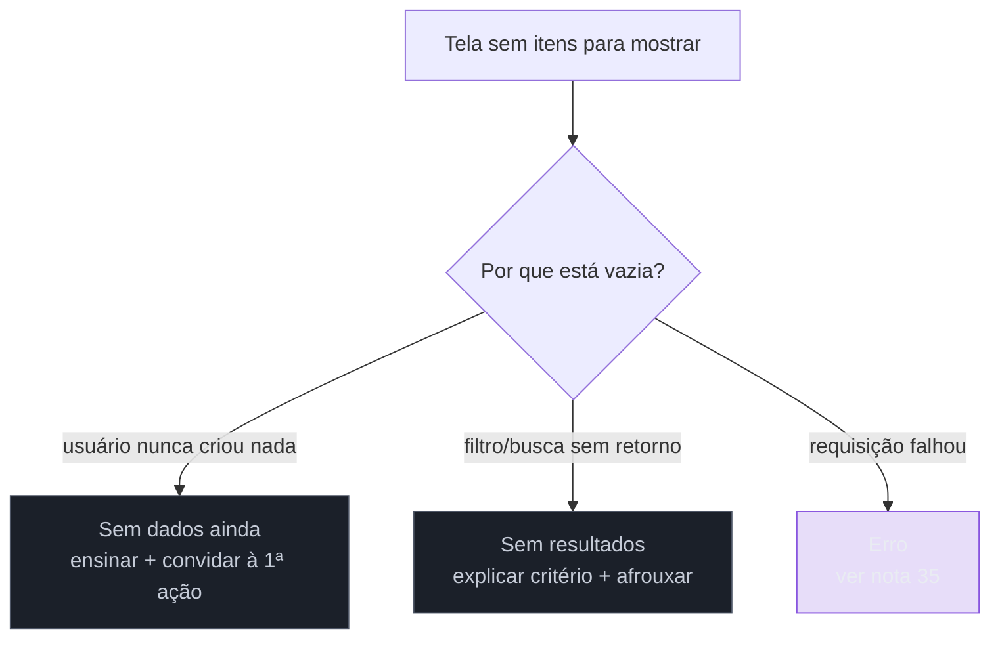

# Estados vazios como conteúdo

> [!abstract] TL;DR
> O estado vazio é **oportunidade de orientação e ação**, não ausência de conteúdo — é frequentemente a primeira tela real que um usuário vê, e decide se ele entende o produto. Existem três estados vazios distintos, que pedem conteúdos diferentes: **"sem dados ainda"** (primeiro uso, ensinar e convidar à primeira ação), **"sem resultados"** (busca ou filtro sem retorno, explicar o critério e oferecer como afrouxá-lo) e **"erro"** (já resolvido na nota anterior). Tratar os três com a mesma tela genérica ("Nada aqui") é o erro mais comum. Esta nota cobre o **conteúdo** dentro do estado vazio — a nota 20 (SG4) já cobre o **espaço** de estados de tela e declara essa fronteira; aqui fica só o outro lado dela.

Imagine abrir, pela primeira vez, um aplicativo de gestão de tarefas recém-criado. A tela principal, "Minhas Tarefas", mostra apenas um retângulo cinza sem nenhum item dentro, e nenhuma linha de texto explicando por que está vazio nem o que fazer a seguir. Você presume, num primeiro instante de dúvida, que o app está com bug — talvez as tarefas não tenham carregado. Só depois de clicar em alguns menus você descobre, por conta própria, o botão "+" escondido no canto que cria a primeira tarefa. Compare com um segundo cenário: a mesma tela vazia, mas com uma ilustração simples, o texto "Você ainda não tem tarefas. Crie a primeira para começar a organizar seu dia" e um botão "Criar minha primeira tarefa" centralizado. A diferença entre os dois cenários não está em nenhuma linha de código de backend — os dois mostram exatamente o mesmo dado (zero tarefas). A diferença inteira é texto: o segundo cenário tratou a ausência de dados como o primeiro contato real do usuário com o produto; o primeiro tratou o mesmo momento como "nada para renderizar, então não renderiza nada".

## O estado vazio é a primeira tela real de muitos usuários

Para um produto novo, ou para uma feature nova dentro de um produto existente, o estado vazio não é um caso raro de borda — é, estatisticamente, **a primeira coisa que a maioria dos usuários vê**, porque todo usuário começa sem dados antes de ter dados. Tratar essa tela como "conteúdo ausente, sem texto necessário" ignora que ela é, na prática, parte do onboarding: é o momento em que o produto tem a maior chance de ensinar, com o menor custo, o que essa área faz e como começar a usá-la — porque o usuário está ali, olhando para aquele espaço específico, genuinamente querendo saber o que preenchê-lo.

## Três estados vazios, três conteúdos diferentes

O erro mais comum não é esquecer o estado vazio — é desenhar **um único** estado vazio genérico e usá-lo para três situações que precisam de mensagens completamente diferentes:

1. **"Sem dados ainda" (primeiro uso)** — o usuário genuinamente ainda não tem nenhum item. O conteúdo certo **ensina** (o que essa área faz, por que ela é útil) e **convida à primeira ação** (um botão claro que leva direto à criação do primeiro item). É o cenário de abertura desta nota.
2. **"Sem resultados" (busca ou filtro sem retorno)** — o usuário tem dados no sistema, mas o critério de busca ou filtro aplicado não encontrou nenhum. O conteúdo certo **explica o critério usado** ("Nenhum resultado para 'relatório trimestral' com o filtro 'Este mês'") e **oferece como afrouxá-lo** — limpar filtro, tentar outro termo, ampliar o período. Convidar para "criar o primeiro item" aqui seria um erro: o usuário já tem itens, só não encontrou o que procurava com aquele critério.
3. **"Erro"** — a requisição falhou. Esse caso já foi tratado com profundidade na [[03-Dominios/Engenharia/UX/UX Writing e Content Design/35 - Erros - fluxo de recuperação e mensagem que não culpa|nota 35]] deste mesmo sub-galho: anatomia de três perguntas, tom que não culpa, e distinção por causa (rede, permissão, servidor). Esta nota não repete esse conteúdo — só registra que "erro" é o terceiro membro da família de estados vazios, e que confundi-lo com os outros dois (mostrar "sem dados ainda" quando na verdade a rede falhou) é o próprio anti-padrão que a nota 20 já nomeou como armadilha de modelagem.

**O mecanismo em uma frase:** os três casos parecem visualmente idênticos (uma tela sem itens), mas pedem ações opostas do usuário — criar, afrouxar filtro, ou tentar de novo — então tratar os três com o mesmo texto genérico é, na prática, dar a ação errada em dois dos três casos.

## Fronteira com a nota 20: espaço de estados vs. conteúdo do estado

A [[03-Dominios/Engenharia/UX/Design de Interação/20 - Os 5 estados de tela|nota 20]] deste vault (sub-galho de Design de Interação) já resolve uma pergunta diferente e anterior a esta: **quantos** estados uma tela precisa modelar e **quando** cada um aparece no espaço de estados de uma tela assíncrona (vazio, carregando, erro, parcial, sucesso). Ela declara explicitamente, na própria nota, que o *conteúdo* do estado vazio — que texto usar, que tom adotar, se vale ilustração, como escrever a chamada para ação — é assunto desta nota 36. Esta nota fecha o outro lado dessa fronteira: aqui não se reexplica o espaço de estados (o `switch`/union type, o diagrama de transição entre carregando/parcial/erro/sucesso) — isso já está resolvido na nota 20. Aqui só entra o que vai **dentro** da caixa "vazio" depois que ela já foi corretamente modelada como estado de primeira classe.

A divisão em uma frase: a nota 20 garante que o estado vazio *existe como caixa desenhada no fluxo*; esta nota garante que o *texto dentro dessa caixa* faz o trabalho de orientar e converter, em vez de só ocupar o espaço.

## O que dá pra fazer sozinho, e o que não dá

Escrever o conteúdo dos três estados vazios de uma tela — sem dados, sem resultados, erro (esse último já resolvido na nota 35) — é trabalho **inteiramente praticável sozinho**, e o motivo é estrutural: o texto de estado vazio não depende de pesquisa de usuário para a primeira versão, só de responder três perguntas por escrito, para cada um dos dois primeiros casos: o que essa área faz, por que vale a pena preenchê-la, e qual é a próxima ação concreta. Isso é trabalho de meia hora por tela, feito no momento em que a feature é construída — não depois, como um retrofit de "polimento". Da mesma forma, **auditar as telas existentes do produto atrás de estados vazios genéricos ou ausentes** é um exercício de uma tarde, tela por tela, no mesmo espírito da avaliação heurística da nota 03: percorrer o produto perguntando "essa tela distingue sem-dados de sem-resultados, ou usa o mesmo texto para os dois?".

O que exige mais estrutura: uma **pesquisa de usuário validando qual variação de texto de estado vazio converte melhor** — testar duas ou três versões da chamada para ação e medir qual gera mais primeira-tarefa-criada — depende de tráfego e instrumentação de analytics que uma pessoa sozinha não tem como rodar de um dia para o outro; sem volume real de usuários, a escolha entre duas frases candidatas continua sendo palpite informado, não fato medido. Um **sistema de ilustração ou animação para estados vazios**, com um conjunto visual consistente por categoria de conteúdo (sem dados, sem resultados, erro), é investimento de design system que só compensa quando várias telas do produto reaproveitam o mesmo conjunto — construir isso para uma tela isolada é desproporcional ao ganho. E um **monitoramento de produção que meça a taxa de conversão do estado "sem dados ainda" para "primeiro item criado"**, útil para saber se o texto está realmente funcionando ao longo do tempo, exige instrumentação de evento e dashboard — infraestrutura de plataforma, não de uma tela.

## Casos práticos

### Cenário 1: o app de tarefas sem nenhuma orientação no primeiro uso
Retomando a abertura desta nota: um app de gestão de tarefas mostra um retângulo cinza vazio no primeiro acesso, sem texto e sem chamada para ação. Analytics mostra uma taxa de abandono alta nos primeiros 60 segundos de uso — usuários abrem o app, veem a tela vazia, e fecham sem criar nada. A correção não muda nenhuma lógica de dados: adiciona um texto de duas frases ("Você ainda não tem tarefas. Crie a primeira para começar a organizar seu dia") e um botão "Criar minha primeira tarefa" centralizado na área vazia. A taxa de criação de primeira tarefa nos primeiros 60 segundos sobe de forma mensurável — o mesmo dado, zero tarefas, virou um convite em vez de um vazio silencioso.

### Cenário 2: a busca sem resultado tratada como "sem dados ainda"
Um catálogo de produtos interno usa exatamente o mesmo componente de "vazio" tanto para "nenhum produto cadastrado" quanto para "sua busca não encontrou nada" — o texto em ambos os casos diz "Nenhum produto encontrado. Cadastre o primeiro produto." Um usuário buscando "parafuso M6" e não encontrando (porque o produto existe, mas com o nome "parafuso métrico 6mm" no catálogo) recebe a instrução de *cadastrar* um produto que na verdade já existe sob outro nome — instrução ativamente incorreta, não apenas genérica. A correção separa os dois estados: quando há um termo de busca ativo e zero resultados, o texto muda para "Nenhum resultado para 'parafuso M6'. Tente outro termo ou confira a grafia." — sem nenhuma menção a cadastrar, porque cadastrar não é a ação certa nesse contexto.

### Cenário 3: o filtro esquecido que parece "conta sem dados"
Um dashboard de vendas mostra "Nenhuma venda registrada" para um vendedor que na verdade tem centenas de vendas no sistema — o problema é um filtro de data esquecido de uma sessão anterior, ainda ativo ("Este mês", num mês em que ele estava de férias e não vendeu nada). O vendedor, vendo "Nenhuma venda registrada" sem nenhuma menção a filtro, presume que o sistema perdeu os dados dele e abre um chamado de suporte urgente. A correção resolve dois problemas ao mesmo tempo: o texto do estado "sem resultados" passa a nomear o filtro ativo explicitamente ("Nenhuma venda encontrada com o filtro 'Este mês — Julho'. Ver todos os períodos?"), e um link de "limpar filtro" aparece junto — o usuário entende a causa e tem a ação de correção a um clique, sem precisar abrir chamado nenhum.

## Armadilhas comuns

> [!warning] Tela vazia sem nenhum texto
> **O que acontece:** o estado "sem dados ainda" é implementado como ausência total de conteúdo — nenhuma frase, nenhuma chamada para ação, só espaço em branco (Cenário 1). **Por quê:** tecnicamente é o caminho de menor esforço — se não há itens para mapear numa lista, o componente simplesmente não renderiza nada, e ninguém percebeu que "não renderizar nada" também é uma decisão de conteúdo, só que uma decisão ruim tomada por omissão. **Como evitar:** trate a escrita do texto de estado vazio como parte obrigatória do escopo de qualquer feature nova que lista dados — não como polimento posterior.

> [!warning] Um único estado vazio genérico para sem-dados e sem-resultados
> **O que acontece:** a mesma mensagem ("Nenhum item encontrado") aparece tanto quando o usuário genuinamente não tem itens quanto quando a busca ou filtro dele não encontrou nada, como nos Cenários 2 e 3. **Por quê:** os dois casos são visualmente idênticos (zero itens na tela), e é tentador reutilizar o mesmo componente sem distinguir a causa — mas as ações corretas são opostas: no primeiro caso, a ação é "criar"; no segundo, é "ajustar o critério de busca ou filtro". **Como evitar:** trate "sem dados ainda" e "sem resultados" como dois estados distintos no conteúdo (mesmo que compartilhem o mesmo componente visual), cada um com seu próprio texto e sua própria chamada para ação.

> [!warning] Filtro ativo não mencionado no texto do estado vazio
> **O que acontece:** quando um filtro está escondendo dados que existem, o texto do estado vazio não menciona esse filtro, deixando o usuário sem saber por que a tela está vazia (Cenário 3). **Por quê:** o texto de estado vazio costuma ser escrito pensando no caso mais comum ("realmente não há dados"), sem considerar que filtros esquecidos de sessões anteriores são uma causa frequente de falso-vazio em produtos com muitos filtros combináveis. **Como evitar:** sempre que houver um filtro ou busca ativa, o texto do estado vazio deve nomeá-lo explicitamente e oferecer uma ação de limpeza — nunca apresentar "zero resultados com filtro ativo" da mesma forma que "zero dados sem filtro nenhum".

## Como explicar em inglês

> "An empty state is an **opportunity for orientation and action**, not an absence of content — it's often the first real screen a user sees, and it decides whether they understand the product. There are three distinct empty states that need different content: **'no data yet'** (first use — teach and invite the first action), **'no results'** (search or filter with no matches — explain the criteria and offer to loosen it), and **'error'** (already covered by the previous note). Treating all three with the same generic screen is the most common mistake. This note covers the **content** inside the empty state — a sibling note in this vault already covers the **state space** of a screen and explicitly hands off empty-state content to this one."

| PT | EN |
|----|----|
| estado vazio | empty state |
| sem dados ainda (primeiro uso) | no data yet (first use) |
| sem resultados (busca/filtro) | no results (search/filter) |
| chamada para ação | call to action |
| espaço de estados | state space |
| filtro ativo | active filter |

## O que vem a seguir

Depois de resolver voz, tom, microcopy, erro e estado vazio dentro de um único idioma, a última fronteira deste sub-galho é o que acontece quando o mesmo texto precisa existir em outro idioma — e por que essa mudança, que parece só de conteúdo, quebra decisões de layout que ninguém tinha testado para strings mais longas.

- [[03-Dominios/Engenharia/UX/UX Writing e Content Design/37 - i18n quebra layout|37 — i18n quebra layout]] — fecha o sub-galho mostrando como a mesma disciplina de conteúdo desta nota (e das anteriores) muda de forma quando o idioma muda.
- [[03-Dominios/Engenharia/UX/Design de Interação/20 - Os 5 estados de tela|20 — Os 5 estados de tela]] — para revisitar o espaço de estados que esta nota deliberadamente não reexplicou.

## Fontes

- **Nielsen Norman Group** — [*Designing Empty States in Complex Applications: 3 Guidelines*](https://www.nngroup.com/articles/empty-state-interface-design/) — as três funções do conteúdo de estado vazio (comunicar status, ensinar features, orientar a próxima ação) usadas como base desta nota.
- **Torrey Podmajersky** — *Strategic Writing for UX* (O'Reilly, 1ª ed., julho de 2019) — tratamento de estados de sistema (incluindo vazio) como parte do conteúdo estratégico de produto, não só de erro.

> [!tip] Assista: Empty States in Application Design: 3 Guidelines
> **Canal:** Nielsen Norman Group (NN/g) | **Duração:** ~3min | **Idioma:** EN
>
> O mesmo vídeo é citado na nota 20 (SG4) pelo ângulo de espaço de estados; aqui a citação é pelo ângulo que importa a esta nota — o vídeo é, na verdade, inteiramente sobre **conteúdo**: as três diretrizes que ele apresenta (comunicar status do sistema, ajudar a descobrir features não usadas, orientar a próxima tarefa) são exatamente a base da distinção entre "sem dados ainda" e "sem resultados" usada aqui. Cobertura parcial: o vídeo trata só do estado vazio, não dos outros dois estados desta nota (sem-resultados como categoria separada e erro).
>
> 🎬 [Assistir no YouTube](https://www.youtube.com/watch?v=MUh3xyvEWDE)
