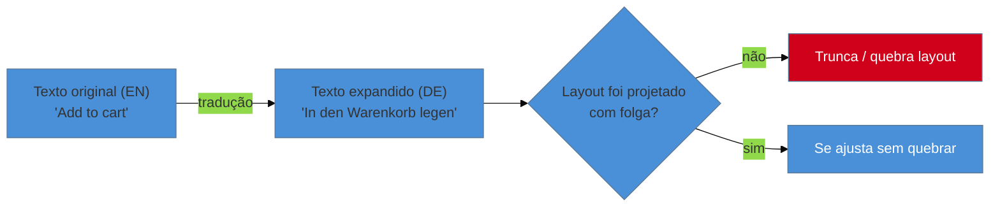

# i18n quebra layout

> [!abstract] TL;DR
> Internacionalização (**i18n**) é onde uma decisão de *conteúdo* vira bug de *layout* — e é por
> isso que esta nota mora em UX writing, não em CSS: o texto é a variável, o layout é a vítima.
> Quatro problemas recorrentes: **expansão de string** (alemão e finlandês podem ficar
> substancialmente mais longos que o inglês — a ordem de grandeza citada por fontes de indústria
> vai de ~30% a 200%, dependendo do tamanho do texto original; trate como estimativa, não número
> exato), **direção de texto (RTL)** que inverte o layout inteiro, **pluralização não-binária** (a
> concatenação `"${n} item(s)"` não sobrevive à tradução), e **truncamento de labels de botão**.
> Esta nota não reexplica CSS nem layout responsivo — foca no que muda de *conteúdo* e como projetar
> para essa mudança sem depender de um time de localização dedicado.

Imagine um botão "Adicionar ao carrinho" que cabe perfeitamente na largura desenhada em inglês — o texto ocupa 80% da largura do botão, com uma margem confortável dos dois lados. O produto lança em alemão, onde a mesma ação se escreve "In den Warenkorb legen" — quase o dobro dos caracteres. O botão, que nunca foi testado com texto mais longo, ou trunca o texto ("In den Warenko...") ou quebra em duas linhas de forma desalinhada, dependendo do componente. Nenhuma linha de CSS estava "errada" para o caso que foi testado — o botão funciona perfeitamente em inglês, a linguagem que qualquer desenvolvedor do time usou em todos os testes manuais. O bug só existe porque ninguém tratou o comprimento do texto como uma variável que muda por idioma, e o layout foi desenhado como se "Adicionar ao carrinho" fosse o comprimento definitivo de qualquer texto que aquele botão algum dia precisaria mostrar.

## Por que isso mora em UX writing, e não em CSS

A ponte para este público é direta: i18n é exatamente o ponto em que uma decisão de **conteúdo** — que texto usar, em que idioma, com que estrutura gramatical — se transforma em um **bug de layout** visível na tela. O texto é a variável que muda; o layout é a vítima que quebra quando essa variável muda de um jeito que ninguém previu. Por isso esta nota fecha o sub-galho de UX writing em vez de aparecer num domínio de CSS ou layout responsivo — o problema nasce de uma escolha de conteúdo (a string em inglês foi tratada como comprimento fixo), não de uma escolha de grid ou breakpoint. Esta nota **não** reexplica flexbox, `min-width` ou layout responsivo — os domínios de front-end do vault já cobrem isso; aqui o foco é o que muda quando o *texto* muda.

## Os quatro problemas recorrentes

### Expansão de string

A causa mais comum de layout quebrado em i18n é simples de enunciar e fácil de esquecer: **textos em outros idiomas raramente têm o mesmo comprimento do texto original em inglês.** Alemão e finlandês, em particular, tendem a produzir palavras compostas mais longas para o mesmo conceito. A ordem de grandeza citada por fontes de indústria de localização varia de **~30% a 200%** de expansão, dependendo do tamanho do texto original — textos curtos (um label de botão de duas palavras) tendem a expandir proporcionalmente *mais*, não menos, porque não há texto longo o suficiente para a expansão se diluir. Essa faixa é uma estimativa de ordem de grandeza, não um número exato a ser codificado como constante — o comprimento real depende do idioma específico, do domínio semântico e de como o tradutor escolheu formular a frase.

### Direção de texto (RTL)

Árabe e hebraico não só se leem da direita para a esquerda — **o layout inteiro espelha**, não só o texto. Menu que era à esquerda vai para a direita, ícone de "voltar" que apontava para a esquerda passa a apontar para a direita, a ordem de leitura de um formulário inteiro se inverte. Não é um ajuste cosmético de alinhamento de texto; é uma inversão estrutural do fluxo visual da interface inteira.

### Pluralização não-binária

Código escrito pensando só em inglês tende a assumir que existem apenas duas formas — singular e plural — e resolve isso com concatenação ingênua: `"${n} item(s)"`. Essa solução já é feia em inglês (o "(s)" entre parênteses é uma gambiarra visível) e **não sobrevive à tradução**: várias línguas têm mais de duas formas plurais (o russo, por exemplo, tem formas gramaticais diferentes para quantidades terminadas em 1, em 2-4, e em 5 ou mais), e a string concatenada simplesmente não tem como representar essa variação.

### Truncamento de labels de botão

A consequência visual mais direta da expansão de string: o botão dimensionado para o comprimento do texto em inglês trunca, quebra em duas linhas de forma inesperada, ou estoura o container quando o texto real (mais longo) chega — exatamente o cenário de abertura desta nota.

**O mecanismo em uma frase:** todo layout testado com uma única string, num único idioma, carrega uma suposição implícita de comprimento fixo — e essa suposição só é revelada como falsa no momento em que uma string mais longa (ou uma direção de leitura invertida) tenta ocupar o mesmo espaço.

> [!question]- Se a faixa de expansão é "~30% a 200%", como projetar sem saber o número exato?
> Projetando para a folga, não para o número. A prática — detalhada na seção seguinte — é testar com a string mais longa plausível (uma técnica chamada pseudolocalização, ver mídia abaixo) em vez de tentar acertar um percentual exato por idioma. A pergunta certa não é "quanto esse texto vai crescer em alemão", é "esse componente ainda funciona se o texto dobrar de tamanho" — porque a resposta certa para essa segunda pergunta cobre a faixa inteira de expansão possível, exata ou não.

## O que dá pra fazer sozinho, e o que não dá

Praticável sozinho, sem depender de um time de tradução: **projetar componentes com folga de comprimento** — usar `min-width` em vez de `width` fixo em botões, permitir que labels quebrem linha graciosamente em vez de assumir uma linha só — é decisão de implementação que qualquer desenvolvedor toma sozinho, no momento de construir o componente, sem esperar a tradução real chegar. **Testar com a string mais longa antes de lançar** — mesmo que seja só colar manualmente um texto artificialmente longo no lugar do texto em inglês, para ver se o layout aguenta — é um teste de minutos, não um projeto. **Não concatenar frases** — evitar `"Você tem " + count + " itens"` em favor de uma função de formatação que recebe a contagem inteira e decide a forma correta — é mudança de padrão de código, não de infraestrutura. E **usar as APIs nativas de pluralização e formatação** já disponíveis na maioria das stacks modernas (Intl.PluralRules em JavaScript, ICU MessageFormat em várias linguagens) resolve a pluralização não-binária sem exigir que o desenvolvedor conheça as regras gramaticais de cada idioma — a API já encapsula essa regra.

O que exige mais estrutura: **localização profissional com time de tradução dedicado** é o item mais claramente fora do escopo de uma pessoa só — não porque traduzir seja tecnicamente difícil, mas porque tradução de qualidade, revisão cultural e manutenção contínua de strings à medida que o produto evolui exigem processo e pessoas com fluência nativa no idioma-alvo. Isso **não significa ignorar i18n** — significa não tentar montar sozinho um processo de tradução gerenciada, que é organizacionalmente diferente de projetar componentes com folga. Um **suporte RTL completo e testado** (não só espelhar CSS, mas validar que ícones direcionais, gráficos e fluxos de leitura inteiros fazem sentido invertidos) tipicamente exige revisão por alguém com fluência no idioma RTL-alvo, porque bugs de RTL sutis (um ícone de "próximo" que devia inverter mas não inverteu) são fáceis de passar despercebidos por quem não lê a língua. E uma **suíte de testes visuais automatizados por idioma**, rodando captura de tela em cada release contra cada idioma suportado, é investimento de infraestrutura de QA que só compensa quando o produto já suporta vários idiomas simultaneamente — para o primeiro idioma adicional, o teste manual com pseudolocalização (praticável sozinho) já cobre a maior parte do risco.

| Praticável sozinho | Exige time/estrutura |
|---|---|
| `min-width` em vez de `width` fixo, folga de layout | Localização profissional com tradutores dedicados |
| Testar com string artificialmente longa (pseudolocalização) | Suporte RTL completo revisado por fluente nativo |
| Não concatenar frases, usar API nativa de pluralização | Suíte de testes visuais automatizados por idioma |

## Casos práticos

### Cenário 1: o botão "Adicionar ao carrinho" que trunca em alemão
Retomando a abertura: um botão de e-commerce dimensionado com `width` fixo trunca o texto ao lançar em alemão. A correção não muda a tradução — muda o CSS de `width: 180px` para `min-width: 180px` com `padding` horizontal generoso, permitindo que o botão cresça quando o texto for mais longo, e adiciona `white-space: normal` para permitir quebra de linha graciosa em vez de corte abrupto se, mesmo com folga, o texto ainda for longo demais para uma linha. O teste que teria pego esse bug antes do lançamento: colar "In den Warenkorb legen" (ou qualquer string 80% mais longa) no lugar de "Add to cart" durante o desenvolvimento, sem esperar a tradução real chegar.

### Cenário 2: "3 item(s) no carrinho" traduzido literalmente para o russo
Um contador de carrinho usa a string `"${n} item(s) no carrinho"` — já uma solução capenga em português, mas que "funciona" visualmente. Ao localizar para o russo, o texto traduzido preserva a mesma estrutura de concatenação, produzindo uma frase gramaticalmente incorreta para as formas plurais que o russo exige (o russo tem regras diferentes para quantidades terminadas em 1 versus 2-4 versus 5+, nenhuma delas equivalente ao "(s)" do inglês/português). A correção substitui a concatenação por uma chamada à API nativa de pluralização da stack (por exemplo, `Intl.PluralRules` em JavaScript), passando a contagem completa e deixando a biblioteca escolher a forma gramatical correta por idioma — o desenvolvedor não precisa saber as regras do russo, só parar de montar a frase manualmente.

### Cenário 3: o app que lançou em árabe sem revisar a direção do fluxo
Um app de checkout lança suporte a árabe aplicando `dir="rtl"` globalmente no CSS, e a maior parte do layout espelha automaticamente como esperado. O que ninguém testou manualmente foi o fluxo de etapas do checkout (endereço → pagamento → confirmação), representado visualmente por uma barra de progresso com setas apontando da esquerda para a direita — que, mesmo com o `dir="rtl"` aplicado, continuou apontando na mesma direção original, porque o ícone de seta estava embutido como imagem estática, não como elemento que respeita a direção do documento. Usuários árabes reportam confusão sobre "em que etapa estão" — o texto lê certo, mas a seta contradiz a direção de leitura. A correção troca o ícone estático por um SVG que herda a direção do container ou por dois assets (LTR/RTL) trocados condicionalmente — um lembrete de que RTL exige revisão elemento a elemento, não só a aplicação de uma propriedade CSS global.

## Armadilhas comuns

> [!warning] Layout dimensionado só para o comprimento do texto em inglês
> **O que acontece:** botões, labels e containers usam `width` fixo ou espaço calculado exatamente para caber o texto original em inglês, sem folga (Cenário 1).
> **Por quê:** o desenvolvedor testa o produto inteiro no próprio idioma de trabalho, geralmente inglês ou português, e o layout "parece certo" porque o único texto testado é o único texto que existe até o momento do lançamento internacional.
> **Como evitar:** use `min-width` em vez de `width` fixo, teste com uma string artificialmente longa (pseudolocalização) antes de considerar o componente pronto, mesmo que a tradução real ainda não exista.

> [!warning] Concatenação de frase para pluralização
> **O que acontece:** o código monta a frase manualmente juntando número e texto (`"${n} item(s)"`), assumindo que só existem formas singular e plural (Cenário 2).
> **Por quê:** a concatenação funciona sem erro nenhum para o idioma de desenvolvimento (inglês ou português têm só duas formas), então o problema fica invisível até a tradução para um idioma com mais formas gramaticais expor a limitação.
> **Como evitar:** use a API nativa de pluralização da stack (`Intl.PluralRules`, ICU MessageFormat, ou equivalente) desde o primeiro dia, mesmo em produtos monolíngues — o custo extra é mínimo e evita reescrever tudo depois.

> [!warning] RTL tratado como só espelhar CSS
> **O que acontece:** o time aplica `dir="rtl"` e considera o suporte a árabe/hebraico completo, sem revisar ícones direcionais, imagens estáticas e fluxos de leitura elemento a elemento (Cenário 3).
> **Por quê:** a maior parte do layout realmente espelha de graça com `dir="rtl"` no CSS moderno, o que cria uma falsa sensação de "está tudo resolvido" — mas ícones embutidos como imagem estática, gráficos com direção implícita, e a ordem lógica de elementos em fluxos de múltiplas etapas não espelham automaticamente.
> **Como evitar:** trate o lançamento RTL como uma revisão manual, tela por tela, procurando especificamente por elementos direcionais que não sejam texto — setas, ícones de navegação, gráficos, barras de progresso — e teste com alguém fluente no idioma-alvo antes do lançamento.

## Como explicar em inglês

> "Internationalization is where a **content** decision turns into a **layout** bug — that's why this topic lives in UX writing, not CSS. Four recurring issues: **string expansion** (German and Finnish can run substantially longer than English — industry sources cite a range of roughly 30% to 200% depending on the original text's length; treat it as an order of magnitude, not an exact number), **RTL direction** that mirrors the entire layout, not just the text, **non-binary pluralization** (naive concatenation like `'${n} item(s)'` doesn't survive translation), and **button label truncation**. None of this requires reworking your CSS knowledge — it requires designing for a text length variable you haven't tested yet."

| PT | EN |
|----|----|
| internacionalização (i18n) | internationalization (i18n) |
| expansão de string | string expansion |
| direção de texto (RTL) | right-to-left (RTL) |
| pluralização não-binária | non-binary pluralization |
| pseudolocalização | pseudolocalization |
| truncamento | truncation |

## O que vem a seguir

Este é o fim do sub-galho de UX Writing e Content Design — voz, microcopy, erro, estado vazio e, agora, o limite entre conteúdo e layout que a tradução expõe. A próxima parada do domínio sai do texto e entra na linguagem visual — tokens, tipografia, cor — que é onde o mesmo tipo de decisão de "comprimento fixo assumido sem testar" volta a aparecer, desta vez em componentes visuais em vez de em strings.

- [[03-Dominios/Engenharia/UX/Linguagem Visual e Design System/index|Linguagem Visual e Design System]] — a próxima disciplina do domínio, onde tokens e componentes reutilizáveis precisam da mesma folga que esta nota pediu para texto.
- [[03-Dominios/Engenharia/UX/UX Writing e Content Design/34 - Microcopy, labels de ação e jargão interno|34 — Microcopy, labels de ação e jargão interno]] — os mesmos labels de botão discutidos ali são exatamente o que quebra primeiro quando a string expande, como no Cenário 1 desta nota.

## Fontes

- **Robyn Larsen (Shopify)** — talk *International Is The New Mobile First*, SmashingConf Freiburg (2019) — origem da cifra "~30% mais longo em alemão" e da técnica de pseudolocalização usadas nesta nota, a partir da experiência real de lançamento do Shopify em seis novos idiomas.
- Práticas de indústria de localização de software (SimpleLocalize, Phrase, Lokalise e fontes equivalentes) — origem da faixa mais ampla de expansão de string (~30% a 200%) citada como ordem de grandeza, não número exato.
- **Intl.PluralRules (ECMAScript Internationalization API)** e **ICU MessageFormat** — APIs nativas de pluralização citadas como alternativa à concatenação manual de frase.

> [!tip] Assista: International Is The New Mobile First
> **Canal:** SmashingConf (palestra de Robyn Larsen, Shopify) | **Duração:** ~32min | **Idioma:** EN
>
> A palestra narra o lançamento do Shopify em seis novos idiomas em 2018 e o que quebrou: texto ultrapassando limites de botão, grid quebrando, navegação ilegível para falantes não-nativos. Ela introduz a técnica de **pseudolocalização** — expandir texto artificialmente (ex.: +50% para simular alemão/holandês) para testar layout antes mesmo de a tradução real chegar — e cita a cifra de alemão sendo cerca de 30% mais longo que o inglês, a mesma ordem de grandeza usada nesta nota. Cobertura completa do problema de expansão de string com exemplo real de produção; a palestra também toca em imagens localizadas por região, além do escopo estrito desta nota.
>
> 🎬 [Assistir no YouTube](https://www.youtube.com/watch?v=leGFOCQeijU)
