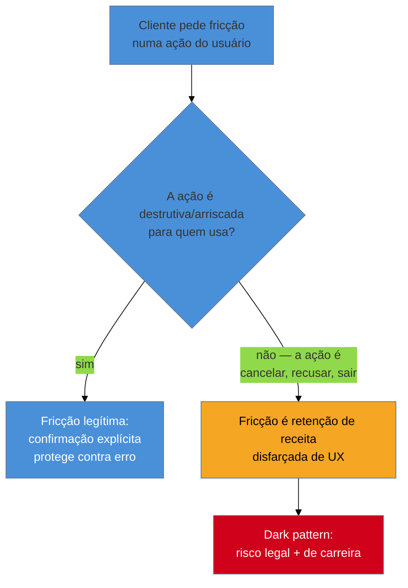

# Dark patterns e regulação

> [!abstract] TL;DR
> Dark pattern é design de interface que engana, manipula ou distorce a decisão de quem usa — caixa pré-marcada, urgência falsa, fluxo de cancelamento labiríntico. Para o engenheiro fractional full-cycle, o padrão deixou de ser questão estética e virou **risco legal e de carreira**, porque não existe time de design entre o pedido do cliente e o código: quem implementa é quem responde. Na UE, o **Digital Services Act (Art. 25)** já proíbe dark patterns desde fevereiro de 2024, com multa de até 6% do faturamento global; o **Digital Fairness Act**, que endereçaria o tema com mais profundidade, **ainda não existe como lei** — segue em consulta e proposta. Nos EUA, a FTC processou a Amazon (US$ 2,5 bi) e a Epic Games (US$ 245 mi) por fluxos de cancelamento e cobrança manipulados, em ambos os casos com prova documental interna. A fricção deliberada para reter receita é o oposto exato da fricção legítima que protege contra erro — o contraste com a [[03-Dominios/Engenharia/UX/Design de Interação/23 - Undo vs confirmação|nota 23]] resolve a confusão entre as duas.

> [!info] Nota com prazo de validade — escrita em 2026-07-29, verifique antes de confiar
> Cenário regulatório muda rápido; datas e status abaixo foram conferidos nesta data, não presuma que continuam exatos. Duas precisões que valem a pena destacar: **(1)** a lei da UE atualmente em vigor contra dark patterns é o **Digital Services Act** (Art. 25), não o Digital Markets Act — o DMA é uma lei separada, focada em poder de mercado de *gatekeepers* (interoperabilidade, autopreferência), com teto de multa diferente (até 10%, não 6%); é fácil confundir os dois porque as siglas são parecidas e ambos vieram do mesmo pacote legislativo europeu. **(2)** o Digital Fairness Act (DFA) **não está em vigor** — a consulta pública rodou de julho a outubro de 2025, a Comissão Europeia planeja apresentar a proposta formal no **4º trimestre de 2026**, adoção provável só em 2027, e vigência escalonada entre 2028 e 2030. Se você lê isto depois de 2026, trate cada prazo acima como suspeito e reconfira na fonte — o mesmo padrão de cautela que a [[03-Dominios/Tecnologia/Acessibilidade/Sustentar e Conformidade/18 - Cenário legal e normativo|nota 18 de Acessibilidade]] usa para legislação.

Imagine o pedido mais comum que um engenheiro fractional recebe de um cliente de SaaS: "a gente está perdendo receita com cancelamento — dá pra colocar mais uns passos antes de confirmar, tipo oferecer desconto, perguntar o motivo, esse tipo de coisa?". Não existe designer de UX na sala para levantar a bandeira ética. Não existe jurídico revisando o wireframe antes do deploy. Existe você, o teclado, e o prazo de sprint. Se você implementa exatamente como pedido — quatro páginas, seis cliques, quinze opções antes de cancelar —, você não é um espectador da decisão: é o autor do artefato que, se a empresa crescer o suficiente para atrair a atenção de um regulador, vira a evidência técnica do caso. Este é o agravante que separa este sub-galho do resto do domínio: em toda outra nota, uma escolha ruim de UX custa retrabalho; aqui, ela pode custar um processo.

## A taxonomia dos padrões enganosos

Cinco padrões concentram quase toda a ação regulatória e a maior parte da literatura sobre o tema:

- **Roach motel** — fácil entrar, difícil sair. O nome vem do inseticida homônimo ("baratas entram, não saem"); a assinatura de um clique e o cancelamento que exige telefone, chat ou carta são a versão digital.
- **Urgência falsa** — contadores regressivos e "restam 2 unidades" sem lastro real no estoque ou na promoção, criando pressão de decisão artificial.
- **Caixas pré-marcadas** — consentimento obtido por inércia: a opção que gera receita (newsletter, upsell, compartilhamento de dado) já vem marcada, e a maioria das pessoas não desmarca.
- **Confirmshaming** — o botão de recusa é redigido para constranger quem recusa ("Não, prefiro pagar caro" em vez de "Não, obrigado"), transformando uma escolha neutra em admissão de burrice.
- **Fluxo de cancelamento confuso** — o padrão com mais ação regulatória concreta, porque é o mais fácil de provar objetivamente: basta contar páginas, cliques e opções, e comparar com o fluxo de inscrição do mesmo produto.

## O cenário regulatório verificado em 2026-07-29

**Europa — o que está em vigor:** o **Digital Services Act (DSA)** é aplicável em toda a UE desde **17 de fevereiro de 2024**. Seu Artigo 25 proíbe que plataformas online "projetem, organizem ou operem suas interfaces de forma que engane ou manipule os destinatários do seu serviço, ou que de outra forma distorça ou prejudique materialmente a capacidade dos destinatários de tomar decisões livres e informadas" — tradução direta do texto legal, e a formulação mais próxima de uma definição jurídica de dark pattern que existe hoje. A infração abre multa de até **6% do faturamento global anual** da plataforma. O DMA (Digital Markets Act), separado, mira poder de mercado de *gatekeepers* — não é a lei central contra dark patterns, ainda que gatekeepers também estejam sujeitos a regras de design não manipulativo em obrigações específicas.

**Europa — o que ainda não está em vigor:** o **Digital Fairness Act (DFA)** é o projeto que endereçaria dark patterns, *design* aditivo e personalização agressiva com mais profundidade e um regime dedicado — mas, na data desta nota, é apenas uma iniciativa anunciada, com consulta pública encerrada e proposta formal esperada para o 4º trimestre de 2026. Tratar o DFA como lei vigente é o erro mais fácil de cometer lendo material de 2025 desatualizado.

**Estados Unidos — a via do litígio:** não existe uma lei federal única contra dark patterns; a FTC processa sob a autoridade ampla da Seção 5 do FTC Act ("práticas desleais ou enganosas") e, em assinaturas, sob a **ROSCA** (Restore Online Shoppers' Confidence Act). Dois casos com valor público confirmado:

- **Amazon — US$ 2,5 bilhões** (acordo de setembro de 2025; US$ 1 bi em multa civil, US$ 1,5 bi em restituição ao consumidor) — o maior acordo da história da FTC por violação de regra. O fluxo de cancelamento do Prime, batizado internamente de **"Project Iliad"** (referência à Guerra de Troia — dez anos de cerco, o símbolo antigo para algo que devia ser rápido e se arrasta), exigia quatro páginas, seis cliques e quinze opções para cancelar, contra dois cliques para assinar. A FTC nomeou três executivos pessoalmente, algo incomum em caso de proteção ao consumidor.
- **Epic Games — US$ 245 milhões** (ordem finalizada em março de 2023) — configuração de botões inconsistente e confusa no Fortnite levava jogadores a cobranças não intencionais; a empresa também permitia que crianças comprassem sem consentimento parental. Foi a maior ordem administrativa da história da FTC destinada a reembolso, até ser superada pelo caso Amazon.

## A tese: dark pattern virou risco legal e de carreira

O caso Amazon é didático para este público exatamente pelo detalhe que normalmente passa despercebido: **a prova não foi o próprio fluxo de cancelamento** — telas manipuladoras já existiam de sobra sem virar processo bilionário. A prova foram **comunicações internas**: funcionários da Amazon descreveram táticas de retenção como "*a bit of a shady world*" e, num documento, como "*an unspoken cancer*" dentro da empresa. Outros funcionários tentaram simplificar o fluxo; a simplificação foi atrasada ou revertida especificamente porque um fluxo mais simples custaria receita — e, segundo a FTC, a liderança sabia exatamente desse trade-off e escolheu a receita. Slack, e-mail, ticket de Jira, comentário de PR, mensagem de code review dizendo "adicionei mais um passo de confirmação a pedido do cliente, mas acho isso meio sujo" — qualquer registro escrito é, potencialmente, a mesma categoria de prova que condenou a Amazon.

Isso muda o cálculo de risco de quem só implementa. "Só estou implementando o que pediram" não é uma defesa nova — é exatamente o argumento que os processos da FTC desmontaram ao nomear executivos e ao usar as próprias palavras internas da empresa como evidência de intenção. Um engenheiro fractional que constrói o fluxo, documenta a decisão do cliente por escrito e propõe a alternativa não manipuladora não está "se protegendo de trabalho" — está fazendo o mesmo que os funcionários da Amazon que tentaram simplificar o fluxo e foram ignorados: criando o registro que separa quem executou de quem decidiu.

## A fronteira com a nota 23: os dois tipos de fricção não são o mesmo fenômeno

A [[03-Dominios/Engenharia/UX/Design de Interação/23 - Undo vs confirmação|nota 23]] estabelece quando um modal de confirmação é a escolha certa: ações destrutivas e irreversíveis, como deletar uma conta. Essa fricção **protege** quem usa. O dark pattern de cancelamento é o espelho invertido exato: fricção **imposta sobre a saída**, para reter receita, não para proteger de erro. O diagrama da seção anterior nomeia esse teste — a mesma pergunta técnica ("essa ação é reversível e de baixo custo?") que a nota 23 usa para decidir entre undo e confirmação serve aqui para decidir entre fricção legítima e dark pattern: se a ação (cancelar, sair, recusar) não é arriscada para quem usa, qualquer fricção adicionada existe só para o benefício de quem constrói o produto.

## Casos práticos

### Cenário 1: o cliente pede o "Project Iliad" de bolso
Um cliente de SaaS B2C pede explicitamente: "quero que cancelar a assinatura passe por pelo menos três telas — oferece desconto, pergunta o motivo, confirma de novo." **O que dá errado:** implementado ao pé da letra, isso é o mesmo mecanismo do caso Amazon em escala menor — fricção deliberada sobre a saída, medida e otimizada para reduzir cancelamento, não para informar a decisão de quem cancela. **Correção específica:** o engenheiro constrói o fluxo com um botão de cancelamento claro (o padrão de dois cliques que a própria UE já impôs à Amazon na Europa em 2022, antes do caso americano), documenta por e-mail a recomendação contrária e a decisão final do cliente, e propõe a oferta de desconto como um passo opcional *depois* da confirmação de cancelamento, não como bloqueio antes dela — o desconto continua existindo, só não é mais um obstáculo.

### Cenário 2: a caixa pré-marcada que o PM pediu "só para aumentar a base de e-mail"
Num checkout, o PM do cliente pede para pré-marcar a caixa de "quero receber ofertas por e-mail", porque a taxa de opt-in manual está baixa. **O que dá errado:** consentimento obtido por inércia é exatamente o padrão que o Art. 25 do DSA nomeia como manipulação de "decisão livre e informada", e é também violação comum de GDPR/LGPD (consentimento precisa ser afirmativo, não presumido). **Correção específica:** o engenheiro implementa a caixa desmarcada por padrão, mostra ao PM o dado real de opt-in honesto (mesmo que menor) e nomeia explicitamente o risco de compliance, deslocando a decisão de "qual métrica de e-mail eu quero" para "esse dado vale o risco regulatório" — uma conversa que o PM, não o engenheiro, deveria decidir com informação completa.

### Cenário 3: o confirmshaming no modal de saída de um teste grátis
Um modal de cancelamento de teste grátis tem dois botões: "Sim, continuar aproveitando os benefícios" (destacado) e "Não, prefiro perder minhas economias" (cinza, pequeno). **O que dá errado:** o texto do botão de recusa foi redigido para constranger, não para informar — típico confirmshaming, que a NN/g e a literatura de UX já catalogam como antipadrão antes mesmo da onda regulatória atual. **Correção específica:** os dois botões recebem o mesmo peso visual e texto neutro e simétrico — "Continuar assinatura" e "Cancelar assinatura" — sem carregar juízo de valor em nenhum dos dois; a decisão do usuário deixa de ser filtrada por vergonha.

## Praticável sozinho vs. exige time

O que dá para fazer sozinho, sem esperar por ninguém: **auditar os próprios fluxos contra a taxonomia desta nota e contra a linguagem do Art. 25 do DSA** — é trabalho de leitura e julgamento, não de ferramenta. **Recusar implementar um padrão manipulador por escrito, documentando a recomendação e a decisão final do cliente** também é inteiramente seu — é o mesmo gesto dos funcionários da Amazon que tentaram simplificar o Project Iliad, só que registrado a tempo de proteger você, não depois do fato. **Propor a alternativa não manipuladora already desenhada** (o botão de dois cliques, a caixa desmarcada, o texto neutro) é trabalho de design de interação que você já sabe fazer sozinho desde o SG4.

O que exige estrutura ou apoio externo: **uma opinião jurídica formal sobre se um fluxo específico viola a lei numa jurisdição concreta** — isso é trabalho de advogado, não de engenheiro, por mais que você entenda o Art. 25 de cor; a mesma fronteira que a [[03-Dominios/Engenharia/UX/Fundamentos e Modelo Mental/01 - UX não é tela - o ofício e seus limites|nota 01]] nomeou para dados sensíveis de saúde vale aqui para risco regulatório de design. **Negociar um contrato quando o cliente insiste no padrão manipulador mesmo depois de avisado** é decisão de negócio do próprio engenheiro fractional enquanto prestador de serviço (aceitar o risco, recusar o projeto, ou exigir isenção contratual por escrito) — não é mais uma decisão de UX, é gestão do próprio negócio de consultoria. E **um processo formal de revisão de compliance antes de qualquer lançamento**, com jurídico e produto sentados junto, é estrutura organizacional que uma pessoa sozinha não recria — o que ela pode fazer é nomear, a cada vez, quando esse processo deveria existir e não existe.

## Armadilhas comuns

> [!warning] "Só estou implementando o que pediram"
> **O que acontece:** o engenheiro constrói exatamente o que o cliente ou PM especificou, sem registrar objeção, achando que a responsabilidade é inteiramente de quem pediu.
> **Por quê:** é exatamente a defesa que os processos da FTC desmontaram — a agência nomeou executivos pessoalmente e usou comunicação interna como prova de que a decisão foi consciente em toda a cadeia, não só na liderança. Quem escreve o código participa da cadeia de decisão, mesmo sem assinar o pedido.
> **Como evitar:** documente por escrito, antes de implementar, a recomendação contrária e a decisão final — o Cenário 1 mostra como isso fica concreto na prática.

> [!warning] Confundir fricção legítima com dark pattern
> **O que acontece:** o time trata qualquer fricção adicionada a um fluxo como suspeita, incluindo confirmação genuína de ações destrutivas — ou, no sentido oposto, justifica fricção de retenção chamando-a de "proteção ao usuário".
> **Por quê:** os dois fenômenos parecem tecnicamente idênticos (ambos são "um passo a mais antes de confirmar"); a diferença está inteiramente em *para quem* a fricção protege, não na fricção em si.
> **Como evitar:** aplique o teste da nota 23: a ação é destrutiva/arriscada para quem usa, ou é só saída/recusa? Fricção sobre a primeira protege; fricção sobre a segunda manipula.

> [!warning] Achar que o Digital Fairness Act já resolve o problema
> **O que acontece:** alguém cita o DFA como se já fosse lei em vigor para justificar não agir agora ("quando a lei entrar valendo, a gente ajusta").
> **Por quê:** o DFA ainda é proposta não formalizada, com vigência estimada só para 2028-2030 mesmo no cenário mais otimista; o DSA, que **já está em vigor** desde 2024 com o mesmo tipo de proibição, é o risco real e imediato — adiar para o DFA é adiar para uma lei que talvez nem chegue no texto atualmente discutido.
> **Como evitar:** trate o Art. 25 do DSA (em vigor) como a régua atual; trate o DFA como sinal de que a régua vai ficar mais rígida, não como desculpa para esperar.

## Como explicar em inglês

> "A dark pattern isn't a design opinion anymore — it's a compliance and career risk, especially for a solo engineer, because there's no design team standing between the client's request and the code that ships. The EU's Digital Services Act already bans interfaces that 'deceive, manipulate, or materially distort' a user's free decision, with fines up to 6% of global turnover. In the US, the FTC's $2.5B settlement with Amazon over its 'Iliad' cancellation flow shows exactly how this plays out: the evidence wasn't just the confusing flow, it was internal messages calling the practice 'shady' — proof that engineers and executives alike knew what they were building."

| PT | EN |
|----|----|
| padrão enganoso / dark pattern | dark pattern |
| roach motel | roach motel |
| urgência falsa | false urgency |
| caixa pré-marcada | pre-checked box |
| confirmshaming | confirmshaming |
| decisão livre e informada | free and informed decision |
| fluxo de cancelamento confuso | confusing cancellation flow |
| risco de compliance | compliance risk |
| acordo (jurídico) | settlement |

## O que vem a seguir

Reconhecer o risco não impede que ele reapareça no próximo projeto — para isso, a disciplina de UX precisa deixar de depender de vigilância individual e virar parte do processo de desenvolvimento, do jeito que a acessibilidade já fez no domínio vizinho.

- [[03-Dominios/Engenharia/UX/Ética e Ofício/47 - UX no ciclo de dev|47 — UX no ciclo de dev]] — como a Definition of Done, o code review e o gate de CI tornam estruturalmente difícil reintroduzir um dark pattern sem que alguém perceba.
- [[03-Dominios/Engenharia/UX/Design de Interação/23 - Undo vs confirmação|23 — Undo vs confirmação]] — o par conceitual que resolve a distinção entre fricção legítima e manipuladora.

## Fontes

- **European Commission / EUR-Lex** — Regulation (EU) 2022/2065 (Digital Services Act), Artigo 25 — o texto legal em vigor que proíbe design que engane, manipule ou distorça materialmente a decisão do usuário, com multa de até 6% do faturamento global.
- **European Parliament — Legislative Train Schedule** — [*Digital Fairness Act*](https://www.europarl.europa.eu/legislative-train/theme-protecting-our-democracy-upholding-our-values/file-digital-fairness-act) — status da proposta (consulta pública 2025, proposta esperada Q4 2026), usado para verificar que o DFA ainda não é lei.
- **Federal Trade Commission** — [*FTC Takes Action Against Amazon*](https://www.ftc.gov/news-events/news/press-releases/2023/06/ftc-takes-action-against-amazon-enrolling-consumers-amazon-prime-without-consent-sabotaging-their) e cobertura do acordo de setembro de 2025 — a base factual do caso Amazon/Project Iliad.
- **Federal Trade Commission** — [*FTC Finalizes Order Requiring Epic Games to Pay $245 Million*](https://www.ftc.gov/news-events/news/press-releases/2023/03/ftc-finalizes-order-requiring-fortnite-maker-epic-games-pay-245-million-tricking-users-making) — o caso Epic Games.

> [!tip] Assista: Amazon's $2.5 Billion Subscription Trick — Amazon Prime FTC Settlement Explained
> **Canal:** The Hidden Engine | **Duração:** ~7min33 | **Idioma:** EN
>
> Cobre o caso Amazon em profundidade maior do que cabe nesta nota: o nome interno "Project Iliad", a queda de 14% em cancelamentos que a própria Amazon rastreou como métrica de sucesso, as comunicações internas ("a bit of a shady world", "an unspoken cancer") citadas no processo, os três executivos nomeados pessoalmente, e o contraste com o fluxo de dois cliques que a UE já havia imposto em 2022. Cobertura parcial: o vídeo não trata do cenário regulatório europeu (DSA/DFA) nem do caso Epic Games — essas partes vêm de outras fontes nesta nota.
>
> 🎬 [Assistir no YouTube](https://www.youtube.com/watch?v=19ZYeOgKvnM)
