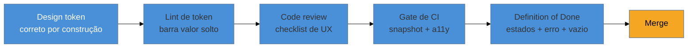

# UX no ciclo de dev

> [!abstract] TL;DR
> Boa vontade individual não sustenta qualidade de UX além do primeiro sprint — o que sustenta é **processo**: uma Definition of Done que inclui estado de erro e estado vazio, não só o caminho feliz; revisão de UX no code review, tratada como bom senso ancorado na própria DoD estendida, **não como framework nomeado**, porque não existe corpo de literatura formal consolidado sobre isso; e um gate de CI que barra regressão visual ou de contraste antes do merge — o mesmo mecanismo que [[03-Dominios/Tecnologia/Acessibilidade/Sustentar e Conformidade/17 - A11y no ciclo de desenvolvimento|a11y já aplica]], só que para uma disciplina diferente. O que dá para fazer sozinho: estender a própria DoD, escrever seu checklist, automatizar o que é automatizável (lint, snapshot). O que exige time: revisão formal de design com múltiplas pessoas, papel dedicado de QA de UX, governança de design system.

Imagine a cena: um pull request corrige um bug de validação de formulário, passa no code review (dois aprovadores, testes verdes, CI verde) e vai para produção. Duas semanas depois, um usuário reporta que, quando o campo de e-mail falha, a mensagem que aparece é "Erro. Tente novamente." — sem dizer o quê, sem dizer por quê. Ninguém no code review percebeu, porque ninguém estava olhando para aquilo: os revisores checaram se o código compilava, se os testes cobriam o caminho feliz e o caminho de erro *tecnicamente* (a exceção é capturada, o teste unitário passa), mas nenhum deles perguntou "essa mensagem ajuda alguém a se recuperar?". A UX não faltou por falta de talento — faltou porque não havia processo que a tornasse parte de "pronto".

## A Definition of Done que inclui UX

Uma Definition of Done tradicional de engenharia pergunta: o código compila, os testes passam, a cobertura não caiu, a documentação foi atualizada. Nenhuma dessas perguntas cobre se a tela realmente funciona para quem usa. Estender a DoD para incluir UX significa adicionar critérios como:

- **Os 5 estados de tela foram desenhados** — vazio, carregando, com dado, com erro, parcial — não só o caminho feliz. Ver [[03-Dominios/Engenharia/UX/Design de Interação/20 - Os 5 estados de tela|nota 20]].
- **A mensagem de erro foi escrita, não deixada no genérico do framework** — segue o padrão de recuperação (o que aconteceu, por que, o que fazer agora) da [[03-Dominios/Engenharia/UX/UX Writing e Content Design/35 - Erros - fluxo de recuperação e mensagem que não culpa|nota 35]].
- **O estado vazio tem conteúdo**, não é uma tela em branco — ver [[03-Dominios/Engenharia/UX/UX Writing e Content Design/36 - Estados vazios como conteúdo|nota 36]].

O ganho de tratar isso como critério de "pronto" — em vez de tarefa separada de polimento — é o mesmo raciocínio que a a11y já aplicou: uma tarefa concluída deixando dívida para trás não deveria contar como concluída.

## Revisão de UX no code review

> [!info] Isto é bom senso ancorado em processo, não framework nomeado
> Diferente da Definition of Done (conceito de Scrum com origem documentada) ou do gate de CI (prática de engenharia amplamente descrita), **não existe corpo de literatura acadêmica formal sobre "checklist de UX em code review"** — é prática difundida na indústria, mas fragmentada por empresa, sem um nome ou autor canônico. Trate o que vem a seguir como extensão natural da DoD estendida acima, nunca como "o método X de revisão de UX" citando alguém que não formulou isso dessa forma.

A ideia central é simples: se o time já revisa código por legibilidade e corretude, a mesma revisão pode carregar duas ou três perguntas de UX, sem virar uma segunda reunião de design. Um checklist mínimo, aplicado ao PR que está sendo revisado, cobre:

- **Acessibilidade básica** — ordem de foco, contraste, nome acessível — ponto onde este item se sobrepõe diretamente ao checklist de a11y da nota 17 linkada abaixo.
- **Estados de erro e cenários de falha** — o PR trata o que acontece quando a chamada de rede falha, não só quando ela funciona.
- **Estados de foco/hover/disabled** — o componente novo se comporta de forma consistente com o resto do produto nesses estados.
- **Responsividade e i18n** — o layout não quebra em mobile nem quando o texto traduzido é mais longo (ver [[03-Dominios/Engenharia/UX/UX Writing e Content Design/37 - i18n quebra layout|nota 37]]).

Nenhum desses itens exige uma segunda pessoa "de design" no time — exige que a pessoa que já está revisando o código saiba que essas perguntas fazem parte do que ela está aprovando, do mesmo jeito que já sabe perguntar "esse código tem teste".

## Gates de CI: o mecanismo que a11y já construiu, aplicado a outra disciplina

O paralelo mais forte e mais verificável para este ponto já existe no vault, no domínio vizinho: [[03-Dominios/Tecnologia/Acessibilidade/Sustentar e Conformidade/17 - A11y no ciclo de desenvolvimento|17 — A11y no ciclo de desenvolvimento]] descreve em detalhe como transformar uma checagem em **gate que bloqueia o merge**, com baseline para não travar um legado, e por que o CI cobre só a metade mecânica do problema. O mecanismo é idêntico para UX geral — só a disciplina que ele protege é diferente:

- **Teste de regressão visual** (screenshot diff) pega uma mudança não intencional de layout ou de cor antes que chegue a produção — o equivalente, para UX visual, do que o axe é para a11y. A infraestrutura de testes de snapshot já está descrita em [[03-Dominios/Engenharia/Testes/13 - Além do básico - property-based, snapshot, contract, smoke|Engenharia/Testes/13]] e roda dentro do mesmo pipeline de [[03-Dominios/Engenharia/Testes/15 - Testes em CI-CD|Testes em CI-CD]].
- **Lint de design tokens** barra o uso de uma cor "solta" (hex direto no CSS) em vez do token semântico aprovado — a ponte direta com a próxima seção.
- Assim como no a11y, o gate deve nascer com **baseline**, não com exigência de perfeição instantânea num produto legado — a mesma lição da nota 17, sem repeti-la aqui.

Uma regressão visual que escapa do gate e chega a produção — um botão que muda de cor sem ninguém perceber, uma tela que quebra em resoluções específicas — é, na prática, o mesmo tipo de evento que a [[03-Dominios/Engenharia/Operação/Anatomia de um incidente de produção|Anatomia de um incidente de produção]] descreve para falhas técnicas: um problema que custa ordens de grandeza mais caro para diagnosticar depois de publicado do que teria custado para pegar no PR.

## Design tokens como gate automatizado

A ponte mais concreta entre "regra de design" e "regra que o computador aplica sozinho" é o [[03-Dominios/Engenharia/UX/Linguagem Visual e Design System/29 - Design tokens como sistema|design token]]: quando contraste, espaçamento e cor deixam de ser escolha manual de cada desenvolvedor e viram token com valor único e testável, a conformidade deixa de depender de alguém lembrar de checar e passa a ser **verificação automática** — o lint recusa um valor de cor que não é token; o teste de contraste roda sobre os tokens, não sobre cada tela individualmente. É a mesma virada que a a11y descreve como "acessível por construção": corrigir o token uma vez corrige todo lugar que o usa; usar um valor fora do token quebra o gate antes de chegar a qualquer revisor humano.

## Casos práticos

### Cenário 1: o estado vazio que ninguém desenhou
Um time constrói uma tela de "meus relatórios" e, sob pressão de prazo, só testa com dados de exemplo — a tela sempre tem pelo menos um relatório na demo. Em produção, um usuário novo que ainda não criou nenhum relatório vê uma tela em branco, sem indicação do que fazer. **O que dá errado:** o estado vazio nunca foi parte do escopo declarado da tarefa; a Definition of Done do time só exigia "os dados aparecem corretamente", sem cobrir o caso de zero dados. **Correção específica:** a DoD passa a incluir explicitamente "estado vazio tratado com conteúdo (nota 36), não tela em branco" como item de conclusão, e a tarefa é reaberta para adicionar uma chamada para ação no estado vazio — "Crie seu primeiro relatório" com um botão, em vez de nada.

### Cenário 2: o code review que pegou a mensagem de erro genérica
Um revisor, seguindo o checklist estendido de code review, para no trecho `catch (e) { showError("Erro. Tente novamente.") }` e comenta: "essa mensagem não diz o que falhou nem o que fazer — dá pra especificar, tipo 'Não foi possível salvar. Verifique sua conexão e tente de novo'?". **O que dá errado (se o comentário não existisse):** a mensagem genérica passaria no CI (o teste só verifica que uma mensagem de erro aparece, não o conteúdo dela) e só seria percebida quando um usuário real reclamasse. **Correção específica:** o autor do PR reescreve a mensagem seguindo o padrão da nota 35 (o que aconteceu, por que, o que fazer), e o time documenta esse tipo de comentário como exemplo no checklist interno de code review, para que o próximo revisor saiba procurar o mesmo padrão.

### Cenário 3: o token que o lint bloqueou antes do merge
Um desenvolvedor, sem perceber, usa `color: #6b7280` direto no CSS de um novo componente em vez do token `--color-text-secondary` (que aponta para o mesmo valor, mas é rastreável e trocável). O lint de tokens configurado no CI falha o build com a mensagem "cor fora do sistema de tokens detectada". **O que dá errado (sem o gate):** o valor solto funcionaria visualmente de forma idêntica hoje, mas na próxima atualização de paleta (por exemplo, ajuste de contraste para acessibilidade) esse componente ficaria para trás, porque não está ligado ao token — a mesma dívida sistêmica que a nota 17 de a11y descreve para um `<Modal>` sem gestão de foco. **Correção específica:** o desenvolvedor troca o valor pelo token equivalente; o merge só é liberado depois que o lint passa — o gate transformou um erro que só apareceria meses depois numa correção de trinta segundos agora.

## Praticável sozinho vs. exige time

O que dá para fazer sozinho, com o que já está no seu repositório: **estender a própria Definition of Done** para incluir os itens desta nota é uma edição de documento, não uma mudança de ferramenta. **Escrever um checklist pessoal de code review** — mesmo os três ou quatro itens da seção acima — não exige aprovação de ninguém; você aplica a si mesmo antes de abrir o PR. **Configurar lint de acessibilidade (axe) e teste de snapshot no seu próprio pipeline de CI** é trabalho de configuração de ferramenta que um engenheiro fractional já sabe fazer sozinho, porque a infraestrutura (Testes em CI-CD, snapshot testing) já existe genericamente em qualquer stack moderno — a nota 17 de a11y já mostrou o `npm run test:a11y` como gate; adicionar um `npm run test:visual` ao lado é a mesma mecânica.

O que exige time, orçamento ou estrutura: **um processo formal de revisão de design com múltiplas pessoas** — reunião dedicada, aprovação de designer sênior, sign-off documentado — pressupõe que exista mais de uma pessoa fazendo design no projeto, o que contradiz a própria premissa do leitor deste domínio. **Um papel dedicado de QA de UX** que revisa cada PR antes do merge não escala para uma pessoa: ou você é o revisor e o autor ao mesmo tempo (o que já é o caso do engenheiro fractional), ou esse papel exige contratar alguém. **Governança formal de design system multi-produto** — comitê de aprovação de novos tokens, processo de deprecação de componentes, versionamento coordenado entre times — é estrutura organizacional que só se justifica quando múltiplos produtos ou times compartilham o mesmo sistema; um projeto de escopo único não precisa recriar isso, só precisa do lint de token da seção anterior.

## Armadilhas comuns

> [!warning] DoD com UX que ninguém verifica
> **O que acontece:** o time adiciona itens de UX à Definition of Done num documento, mas ninguém checa de fato se cada tarefa cumpre esses itens antes de fechar — o checklist vira decorativo. **Por quê:** um critério de "pronto" que não é verificado por ninguém não é diferente de não ter critério nenhum; a DoD só funciona quando alguém — o próprio autor, o revisor, ou um gate automatizado — de fato confere cada item antes do merge. **Como evitar:** amarre cada item de UX da DoD a uma verificação concreta: automatizada quando possível (o gate de CI), manual e nomeada quando não (o checklist de code review do Cenário 2).

> [!warning] Achar que o gate de CI dispensa julgamento humano
> **O que acontece:** o time vê o pipeline verde — snapshot igual, lint de token passando — e conclui que a tela está pronta, sem revisar se a mensagem de erro faz sentido ou se o fluxo é coerente. **Por quê:** testes automatizados pegam regressão *mecânica* (uma cor mudou, um pixel se moveu) — não pegam se o conteúdo escrito ajuda alguém a se recuperar de um erro, porque isso exige julgamento sobre significado, não comparação de pixel. É o mesmo teto que a nota 17 de a11y já nomeou para a automação de acessibilidade. **Como evitar:** trate o gate automatizado como piso, não teto — ele libera tempo do revisor humano para focar no que a máquina não vê (o Cenário 2 é exatamente esse julgamento).

> [!warning] Tratar UX como épico separado, sempre despriorizado
> **O que acontece:** "melhorias de UX" vira um card no backlog que nunca sobe de prioridade frente a features novas — o mesmo padrão que a nota 17 de a11y descreve para acessibilidade tratada como trabalho à parte. **Por quê:** trabalho isolado num épico compete diretamente com feature nova e perde sempre, porque o custo de adiar não aparece imediatamente — só aparece meses depois, como o ticket de suporte ou o usuário que desiste silenciosamente. **Como evitar:** UX não é épico, é propriedade de cada tarefa — entra na Definition of Done de cada história, não numa fila separada que nunca sobe.

## Como explicar em inglês

> "We don't rely on anyone remembering to care about UX — we build it into the process. Our Definition of Done includes the error and empty states, not just the happy path. Code review carries two or three UX questions alongside the usual correctness checks — no separate design review meeting needed. And CI gates catch what a human might miss: a visual regression test flags an unintended layout shift, and a token lint blocks a color value that bypasses our design system. It's the same shift-left logic our accessibility gate already uses — just applied to UX broadly, not only to a11y."

| PT | EN |
|----|----|
| Definição de Pronto | Definition of Done (DoD) |
| revisão de código | code review |
| teste de regressão visual | visual regression test |
| lint de tokens | token lint |
| gate de CI | CI gate |
| caminho feliz | happy path |
| estado vazio | empty state |
| dívida sistêmica | systemic debt |
| acessível por construção | accessible by construction |

## O que vem a seguir

Processo garante que a qualidade não dependa de vigilância manual — mas processo, por si só, não ensina ninguém a *falar* sobre essas decisões numa sala de entrevista. A última nota do domínio principal fecha esse arco: como transformar tudo o que este sub-galho (e os sete anteriores) ensinou em resposta articulada, sênior, para quem entrevista para vaga de engenharia com peso de produto.

- [[03-Dominios/Engenharia/UX/Ética e Ofício/48 - UX em entrevista sênior e staff|48 — UX em entrevista sênior e staff]] — como nomear trade-off, processo e ownership numa conversa de carreira.
- [[03-Dominios/Tecnologia/Acessibilidade/Sustentar e Conformidade/17 - A11y no ciclo de desenvolvimento|17 — A11y no ciclo de desenvolvimento]] — o mecanismo gêmeo desta nota, para a disciplina de acessibilidade.

## Fontes

- **Qase** — [*How Can QA Shape UX? Early Involvement, Design Reviews & Visual Regression Testing*](https://www.youtube.com/watch?v=J9dztDkluow) — a fonte mais concreta desta nota sobre checklist de design ("litmus test"), revisão pós-implementação e teste de regressão visual (ver callout de mídia abaixo).
- **Scrum.org / Scrum Guide** — conceito de Definition of Done como critério compartilhado de conclusão, base para a extensão proposta nesta nota.
- [[03-Dominios/Tecnologia/Acessibilidade/Sustentar e Conformidade/17 - A11y no ciclo de desenvolvimento|A11y no ciclo de desenvolvimento]] — fonte interna do mecanismo de gate de CI e design system acessível, referenciado extensivamente nesta nota em vez de reexplicado.

> [!tip] Assista: How Can QA Shape UX? Early Involvement, Design Reviews & Visual Regression Testing
> **Canal:** Qase | **Duração:** ~27min | **Idioma:** EN
>
> Cobre, com exemplos concretos de checklist ("litmus test" de design cobrindo acessibilidade, estados de erro, hover/disabled/focus, responsividade e i18n), o mesmo shift-left que esta nota descreve para código: envolver QA antes do desenvolvimento, revisão de design depois da implementação, e automação de regressão visual. Cobertura parcial: o vídeo fala da perspectiva de QA, não de engenharia de código diretamente, e não cobre Definition of Done nem design tokens como gate — essas partes vêm de raciocínio próprio nesta nota, aplicado ao contexto do engenheiro fractional.
>
> 🎬 [Assistir no YouTube](https://www.youtube.com/watch?v=J9dztDkluow)
