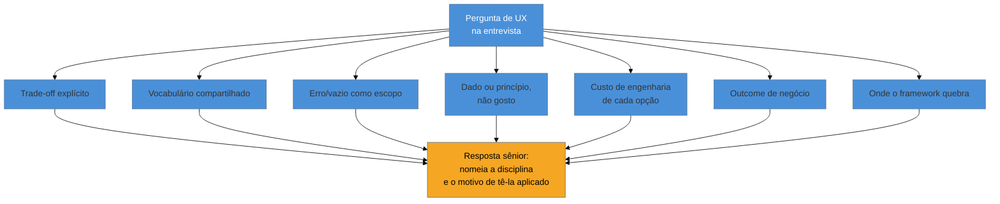

# UX em entrevista sênior e staff

> [!abstract] TL;DR
> Esta é a nota de fechamento das 48 do domínio: onde tudo o que você aprendeu vira resposta falada numa entrevista de vaga sênior/staff. Um candidato sênior se distingue de um pleno em sete sinais — trade-off explícito, vocabulário compartilhado com design, estado de erro/vazio como escopo (não afterthought), justificativa com dado ou princípio (não gosto), consciência do custo de engenharia de cada opção, conexão com outcome de negócio, e saber onde o framework quebra. O gancho narrativo próprio de quem trabalha fractional/full-cycle é ser **o trio de produto inteiro** — e isso, contado com precisão, é evidência de escopo de ownership, não desculpa por não ter time. Link-se com [[03-Dominios/Carreira/Entrevistas/index|Carreira/Entrevistas]] e com a [[03-Dominios/Tecnologia/Acessibilidade/Sustentar e Conformidade/20 - A11y em entrevista|nota-irmã de acessibilidade]], que faz o mesmo trabalho de destilação para a disciplina vizinha.

Imagine a pergunta mais comum de entrevista de produto/UX para engenharia sênior: "me conta sobre uma decisão de UX que você tomou sozinho." A resposta que soa júnior é factual e curta: "o cliente pediu um dashboard, eu construí o dashboard que ele desenhou no Figma." Tecnicamente verdadeira, e completamente inútil para o entrevistador — porque não revela nenhum dos sete sinais que ele está de fato avaliando. A resposta que soa sênior tem a mesma extensão, mas outra estrutura: "o cliente pediu um dashboard parecido com um que ele tinha visto; antes de construir, entrevistei três dos analistas que iriam usá-lo e descobri que eles já confiavam numa planilha compartilhada — então validei se o dashboard precisava *substituir* essa planilha ou só *complementá-la*, e a resposta mudou a arquitetura de informação inteira." A diferença entre as duas respostas não é o vocabulário técnico — é que a segunda nomeia uma disciplina que a primeira pulou, e explica *por que* ela importou. Essa é a estrutura que atravessa esta nota inteira: nomear a disciplina, e o motivo de tê-la aplicado.

## O que sinaliza senioridade — sete frentes

A pesquisa que sustenta esta nota converge em sete sinais concretos, cada um ligado a uma nota específica do domínio, para que você saiba onde revisar se um deles estiver fraco:

1. **Trade-off explícito articulado.** "Modal em vez de página porque o custo de perder contexto é maior que o de navegar" é sênior; "porque ficou melhor assim" é júnior. Ver [[03-Dominios/Engenharia/UX/Design de Interação/22 - Modal vs página vs drawer|nota 22]] para o vocabulário de trade-off de modal vs página vs drawer.
2. **Vocabulário compartilhado com design.** Citar uma heurística de Nielsen ou as leis de Fitts/Hick pelo nome (ver [[03-Dominios/Engenharia/UX/Fundamentos e Modelo Mental/03 - As 10 heurísticas de Nielsen|nota 03]] e [[03-Dominios/Engenharia/UX/Fundamentos e Modelo Mental/04 - Leis de UX - Fitts, Hick, Jakob, Miller, Peak-End|nota 04]]) sinaliza fluência sem exigir formação de designer — desde que você explique o mecanismo, não só o nome (o mesmo erro que a nota-irmã de a11y nomeia: recitar número de critério sem explicar o efeito).
3. **Estado de erro e vazio como parte do escopo da feature**, não afterthought de QA — a mesma disciplina que a [[03-Dominios/Engenharia/UX/Ética e Ofício/47 - UX no ciclo de dev|nota 47]] descreveu como parte da Definition of Done.
4. **Justificar com dado ou princípio, não com gosto pessoal** — "5 de 6 usuários travaram no mesmo passo" em vez de "eu acho que ficou confuso". Ver [[03-Dominios/Engenharia/UX/Medir, Validar e Sustentar/45 - Defender decisão de UX com número|nota 45]].
5. **Consciência do custo de engenharia** de cada opção de design — é aqui que o full-cycle se diferencia do designer puro: saber que undo exige soft delete e confirmação não (ver [[03-Dominios/Engenharia/UX/Design de Interação/23 - Undo vs confirmação|nota 23]]) é um tipo de julgamento que só quem já implementou os dois lados possui.
6. **Conectar trabalho de engenharia a outcome de negócio**, não a output de feature — "reduzimos o tempo de checkout" é output; "isso correlacionou com queda de abandono" é outcome, com a ressalva honesta sobre atribuição causal que a nota 45 já ensinou a nomear.
7. **Saber onde o framework quebra.** Nomear JTBD ou Opportunity Solution Tree é fácil; dizer quando não usar sinaliza senioridade de verdade — o exemplo mais forte do domínio é a [[03-Dominios/Engenharia/UX/Medir, Validar e Sustentar/42 - Quando A-B não se aplica|nota 42]]: saber que não há tráfego suficiente para um A/B, e o que fazer no lugar, é exatamente o tipo de limite que separa quem decorou de quem aplicou.

## As perguntas reveladoras — e como respondê-las

> [!example] "Como você garante que mensagens de erro geradas em 15 lugares diferentes do código não soem como 15 vozes diferentes?"
> **O que essa pergunta testa:** se você trata content design como parte da **arquitetura**, não como texto solto que cada desenvolvedor escreve na hora. **Resposta sênior:** "eu trato mensagem de erro como componente compartilhado, não como string solta — um catálogo central de mensagens com um padrão fixo de estrutura (o que aconteceu, por que, o que fazer), do jeito que a nota 35 do meu próprio estudo de UX descreve. Isso também é o que entra na Definition of Done: nenhuma tarefa nova adiciona um `catch` com string genérica sem passar pelo catálogo."

> [!example] "Como você decide entre adotar um design system pronto e construir o seu?"
> **O que essa pergunta testa:** julgamento de custo/benefício, não conhecimento de API de nenhuma biblioteca específica. **Resposta sênior:** nomear o critério real — volume de telas a construir, prazo, se o produto precisa de identidade visual diferenciada versus utilitária — em vez de recitar uma comparação técnica entre bibliotecas. A profundidade dessa resposta já vive em [[03-Dominios/Engenharia/UX/Linguagem Visual e Design System/32 - Adotar vs construir, e governança mínima|nota 32]].

> [!example] "Que sinais indicam que um design system virou dívida em vez de ativo?"
> **O que essa pergunta testa:** se você reconhece que um sistema de design não é permanentemente bom só porque foi bem construído uma vez. **Resposta sênior:** citar sinais concretos — componentes duplicados porque ninguém lembra que o oficial existe, inconsistência visual crescente entre telas novas, tempo de onboarding de um dev novo no design system aumentando em vez de caindo.

> [!example] "Como o contraste acessível se propaga automaticamente pelo sistema?"
> **O que essa pergunta testa:** se você entende a ponte entre token e CI, não só a regra de contraste isolada. **Resposta sênior:** "contraste vira valor de token, não escolha manual de cada tela; o CI testa o token, não cada instância — corrigir uma vez corrige tudo que usa o token." É exatamente a lógica que a [[03-Dominios/Engenharia/UX/Ética e Ofício/47 - UX no ciclo de dev|nota 47]] descreveu.

> [!example] "O que você faz quando não há tráfego para A/B?"
> **O que essa pergunta testa:** se você decorou "sempre rode um A/B" como receita universal, ou entendeu que ele exige volume. **Resposta sênior:** nomear a alternativa concreta — teste qualitativo com 5 usuários, SEQ pós-tarefa, declarar hipótese antes de medir — em vez de insistir num A/B sem amostra suficiente. É a pergunta que, segundo a própria pesquisa deste sub-galho, separa quem decorou experimentação de quem entendeu — ver [[03-Dominios/Engenharia/UX/Medir, Validar e Sustentar/42 - Quando A-B não se aplica|nota 42]].

## O gancho narrativo próprio deste público: você é o trio inteiro

A [[03-Dominios/Engenharia/UX/Fundamentos e Modelo Mental/01 - UX não é tela - o ofício e seus limites|nota 01]], a primeira do domínio, já nomeou o conceito: o fractional engineer full-cycle **é o trio de produto inteiro** — PM, designer e engenheiro — por necessidade estrutural, não por acúmulo de função. Numa entrevista, esse fato pode ser contado de duas formas radicalmente diferentes:

- **Como desculpa:** "eu não tinha designer, então fiz o que dava." Isso soa como limitação, e convida o entrevistador a perguntar "e se tivesse tido designer, você teria feito diferente?" — uma pergunta que você não quer receber.
- **Como evidência de ownership:** "eu conduzi a entrevista de descoberta com o cliente, decidi a arquitetura de informação sozinho porque não havia ninguém mais para consultar, e depois construí e sustentei o sistema em produção — o escopo de decisão que numa Big Tech estaria dividido entre três pessoas, eu carreguei de ponta a ponta." Isso soa como amplitude de responsabilidade, que é exatamente o que uma vaga sênior/staff busca: alguém que já opera decisões de escopo maior do que o cargo anterior exigia.

A diferença entre as duas versões não está no fato — é o mesmo fato, contado duas vezes. Está em nomear explicitamente **quais decisões** você tomou em cada um dos três papéis, com um exemplo concreto de cada, em vez de deixar a frase genérica "eu fiz tudo sozinho" fazer o trabalho.

## Red flags que afundam candidatos

Tão relevante quanto o que dizer é o que evitar:

- **Tratar pesquisa qualitativa como plano B** — "não tivemos tempo para pesquisa de verdade, então só perguntamos para alguns colegas" soa como desculpa, não como método; a resposta que sobrevive nomeia a pesquisa pelo que ela realmente foi (proto-persona, teste guerrilha) e por que essa escolha fez sentido no prazo disponível.
- **Citar NPS como veredito de saúde do produto** — ignora as críticas conhecidas à métrica (ver [[03-Dominios/Engenharia/UX/Medir, Validar e Sustentar/40 - NPS e North Star - promessa, crítica e Goodhart|nota 40]]) e sinaliza que você não olhou criticamente para a própria ferramenta que está citando.
- **Apresentar ROI de UX como fato, não estimativa** — a nota 45 já nomeou por que isso é frágil; repetir "essa mudança gerou $50 mil" como número exato numa entrevista é o mesmo erro amplificado sob escrutínio.
- **Falar de acessibilidade só como conformidade legal** — reduz uma disciplina inteira a "fazer a lei não me processar", ignorando o argumento de produto e de ética que a atravessa; a nota-irmã de a11y em entrevista trata exatamente desse red flag.

## Casos práticos

### Cenário 1: a pergunta sobre decisão solo, respondida com estrutura STAR
Um candidato recebe a pergunta de abertura desta nota. Em vez de responder linearmente, ele usa a estrutura do [[03-Dominios/Carreira/Entrevistas/STAR Method|STAR Method]]: Situação (cliente B2B pediu dashboard), Tarefa (entregar em três semanas), Ação (entrevistou três analistas antes de desenhar, descobriu a planilha concorrente, redesenhou a arquitetura de informação para substituir, não coexistir), Resultado (adoção subiu de quase zero para uso diário em duas semanas, medido por evento de acesso). **O que fez a resposta soar sênior:** cada letra do STAR carregou um sinal dos sete listados acima — a Ação nomeou a disciplina de pesquisa que ele decidiu aplicar (não pulou), e o Resultado usou dado de instrumentação, não impressão.

### Cenário 2: a pergunta das 15 mensagens de erro, na prática
Um entrevistador pergunta especificamente sobre consistência de mensagem de erro. O candidato, que nunca tinha pensado nisso como "arquitetura", hesita e responde genericamente: "a gente tenta escrever mensagens claras." **O que dá errado:** a resposta não nomeia mecanismo nenhum — não diz *como* a consistência é garantida, só afirma que existe intenção de fazer bem. **Correção, se ele tivesse se preparado com esta nota:** "eu centralizo mensagens de erro num catálogo compartilhado com um padrão fixo de estrutura, então qualquer novo `catch` no código puxa de lá em vez de escrever a string na hora — isso é parte da minha Definition of Done." A correção não muda o que o candidato realmente fez — muda se ele consegue *nomear* o mecanismo, que é exatamente o que a pergunta testa.

### Cenário 3: "o que você faz sem tráfego para A/B", respondida com o framework certo no lugar certo
Um candidato ouve a pergunta e, em vez de insistir "a gente sempre roda A/B, só precisa de mais tempo", responde: "com tráfego baixo, um A/B não chega a significância em tempo útil — então eu uso teste de usabilidade com 5 pessoas e uma métrica como SEQ pós-tarefa, e declaro a hipótese por escrito antes de implementar, para não escolher depois qual métrica 'deu certo'." **O que essa resposta demonstra:** exatamente o sinal 7 (saber onde o framework quebra) e o sinal 4 (dado, não gosto) ao mesmo tempo, sem que o candidato precise dizer explicitamente "eu sei onde os frameworks quebram" — a resposta já prova isso pela estrutura.

## Praticável sozinho vs. exige apoio externo

O que dá para preparar inteiramente sozinho: **montar seu repertório de vocabulário** (heurísticas, leis de UX, os nomes dos frameworks e seus limites) é leitura e memorização ativa — o material já está nas 47 notas anteriores deste domínio. **Escrever suas próprias histórias no formato STAR**, a partir de projetos reais que você já executou, é trabalho de reflexão que só você pode fazer, porque só você viveu a decisão. **Revisar as notas-espinha do domínio antes de uma entrevista** — [[03-Dominios/Engenharia/UX/Descoberta e Pesquisa/08 - Cliente não é usuário - a armadilha do B2B e consultoria|nota 08]] (cliente ≠ usuário) e [[03-Dominios/Engenharia/UX/Medir, Validar e Sustentar/42 - Quando A-B não se aplica|nota 42]] (quando A/B não se aplica) — é releitura dirigida, sem depender de mais ninguém.

O que genuinamente se beneficia de apoio externo: **um mock interview real, com outra pessoa fazendo as perguntas e dando feedback**, revela pontos cegos que você não enxerga sozinho — você sabe o que quis dizer, mas não sabe se a resposta *soou* como pretendia para quem ouve pela primeira vez; é o mesmo motivo pelo qual um segundo par de olhos reduz viés de autoavaliação, o argumento que a nota 01 já usou para pesquisa qualitativa. **Calibração sobre se a resposta realmente atinge a barra de sênior/staff** exige alguém que já entrevistou ou já passou por esse processo em empresas do porte que você está mirando — um critério que uma pessoa sozinha, sem referência externa, não tem como validar objetivamente. **Revisão de fluência e naturalidade em inglês** por um falante fluente ou nativo pega nuances de registro (formalidade, idiomatismo) que um estudo solitário de vocabulário não cobre — a mesma lógica de "escala de um tem teto" que atravessa o domínio inteiro desde a nota 01.

## Armadilhas comuns

> [!warning] Decorar vocabulário sem entender o mecanismo
> **O que acontece:** o candidato cita "heurística 3 de Nielsen" ou "lei de Fitts" no lugar errado, ou não consegue explicar por que aquele princípio se aplica à pergunta feita.
> **Por quê:** citar o nome certo no contexto errado é pior do que não citar nada — sinaliza flashcard decorado, não modelo mental internalizado. É o mesmo erro que a nota-irmã de a11y em entrevista nomeia para critérios WCAG citados sem mecanismo.
> **Como evitar:** treine explicar o *efeito* do princípio antes do nome — se você não consegue dizer por que a lei de Hick se aplica a um menu específico, não a cite só porque soa bem.

> [!warning] Contar "eu era o trio inteiro" como desculpa, não como evidência
> **O que acontece:** o candidato menciona ter feito tudo sozinho em tom de justificativa ou lamento ("infelizmente não tinha designer"), em vez de nomear as decisões concretas tomadas em cada papel.
> **Por quê:** o mesmo fato, contado em tom de limitação, soa como resultado de restrição de recursos; contado com as decisões nomeadas, soa como amplitude de responsabilidade — a diferença está inteiramente na narrativa, não no que de fato aconteceu.
> **Como evitar:** sempre que mencionar ter sido o trio inteiro, siga imediatamente com um exemplo concreto de decisão tomada em cada um dos três papéis (o Cenário 1 mostra a estrutura).

> [!warning] Responder pergunta de framework como se ele nunca quebrasse
> **O que acontece:** perguntado sobre A/B testing, JTBD, ou qualquer outro framework do domínio, o candidato descreve só o caso ideal de uso, sem mencionar quando ele não se aplica.
> **Por quê:** frameworks sem limite nomeado soam como algo decorado de um curso, não como ferramenta que você já usou e testou contra a realidade — a pesquisa deste sub-galho identifica exatamente essa lacuna como o que separa quem decorou de quem aplicou.
> **Como evitar:** para cada framework que você cita, tenha pronta a frase "e não uso quando X" — o Cenário 3 mostra essa estrutura aplicada ao A/B testing.

## Como explicar em inglês

> "The signal I try to hit in every UX-related interview answer isn't a vocabulary word, it's structure: name the discipline I applied and why. Being the whole product trio — PM, designer, and engineer — on a fractional project isn't an excuse for skipping steps; it's evidence of ownership scope, as long as I can name the specific decisions I made in each of those three roles, not just say 'I did everything myself.'"

| PT | EN |
|----|----|
| trio de produto | product trio |
| sinal de senioridade | seniority signal |
| trade-off explícito | explicit trade-off |
| outcome de negócio | business outcome |
| onde o framework quebra | where the framework breaks down |
| escopo de ownership | ownership scope |
| red flag (de entrevista) | red flag |
| calibração (de resposta) | calibration |

## O que vem a seguir

Esta é a última nota do conteúdo instrucional do domínio principal de UX — as oito frentes que começaram nas seis disciplinas da nota 01 terminam aqui, na conversa que decide se todo esse repertório vira uma vaga nova. O que resta no domínio inteiro é a metade mais volátil (Ferramentas de Design) e o capstone que costura as oito frentes num exercício único.

- [[03-Dominios/Carreira/Entrevistas/index|Carreira/Entrevistas]] — o repertório geral de entrevista sênior/staff onde este vocabulário de UX se encaixa.
- [[03-Dominios/Tecnologia/Acessibilidade/Sustentar e Conformidade/20 - A11y em entrevista|20 — A11y em entrevista]] — a nota-irmã que faz o mesmo trabalho de destilação para a disciplina de acessibilidade.
- [[03-Dominios/Engenharia/UX/Fundamentos e Modelo Mental/01 - UX não é tela - o ofício e seus limites|01 — UX não é tela]] — a nota que abriu o domínio e que este fechamento inteiro destila.

## Fontes

- **Marty Cagan** — *INSPIRED: How to Create Tech Products Customers Love* — origem do modelo de trio de produto, já citado na nota 01 e revisitado aqui sob a lente de entrevista.
- **Nielsen Norman Group** — o corpo de heurísticas e leis de UX citado ao longo do domínio, base do "vocabulário compartilhado" (sinal 2).
- Perguntas reveladoras e sinais de senioridade — síntese própria a partir da pesquisa deste sub-galho (2026-07-28), não atribuída a nenhum autor ou publicação específica com nome próprio.

> [!tip] Assista: Trade offs — Lucy Spence | UX Brighton 2022
> **Canal:** UX Brighton | **Duração:** ~26min | **Idioma:** EN
>
> Palestra de conferência sobre como articular trade-offs entre UX e produto (velocidade vs. qualidade, aquisição vs. retenção) — o sinal 1 desta nota, tratado em profundidade maior do que cabe aqui, com exemplos de tensão real entre as duas funções. Cobertura parcial: a palestra fala da perspectiva de quem transitou de UX para product management, não do contexto específico de entrevista de engenharia fractional — a aplicação ao vocabulário de entrevista e aos outros seis sinais desta nota é elaboração própria.
>
> 🎬 [Assistir no YouTube](https://www.youtube.com/watch?v=zNfoSKIobK8)
