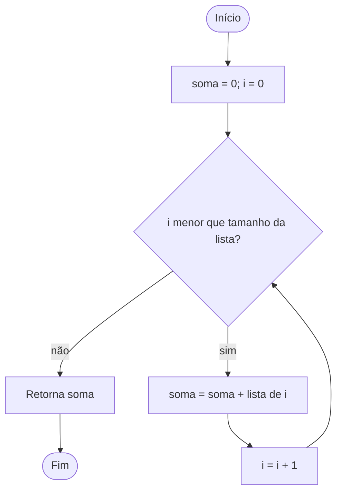
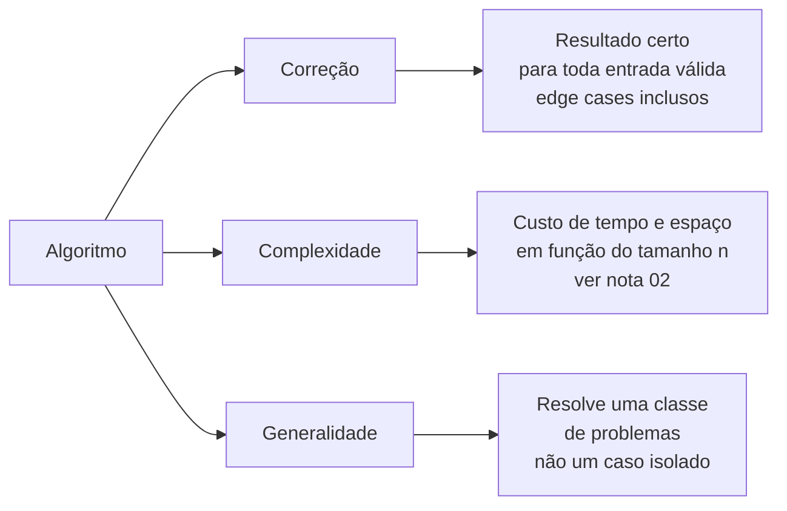
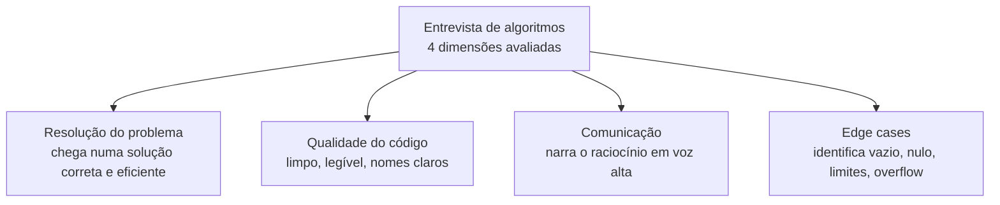

# O que é um algoritmo

Você acordou hoje, abriu o GPS e ele te disse: "vire à direita em 200 metros".

Para chegar nesse "vire à direita", uma máquina pegou um mapa com milhões de ruas, considerou trânsito, pedágio e distância, e devolveu *uma* rota — a melhor que ela conseguiu calcular no tempo que tinha. Não foi mágica. Foi um algoritmo, rodando em algum servidor, resolvendo um problema bem definido: dado um ponto A, um ponto B e um grafo de ruas, encontre o caminho de menor custo.

Esta é a nota de abertura do galho. Ela não ensina nenhum algoritmo específico — ensina o que é a coisa em si. O que separa uma "sequência de passos" qualquer de um algoritmo de verdade, quais propriedades ele precisa ter para merecer o nome, e — porque este galho é preparação para entrevista — o que exatamente está sendo medido quando alguém te observa resolver um problema no quadro branco.

> [!abstract] TL;DR
> Um algoritmo é uma **sequência finita e bem-definida de passos** que resolve uma **classe** de problemas computacionais. Três propriedades o sustentam: **correção** (resultado certo para toda entrada válida, edge cases inclusos), **complexidade** (custo de tempo e espaço em função do tamanho da entrada — aprofundado em [[02 - Análise de complexidade - Big-O]]) e **generalidade** (resolve um tipo de problema, não um caso isolado). Some a isso a **terminação**: todo algoritmo precisa parar. O algoritmo é a **ideia**, independente da linguagem; o código é só uma encarnação dela. E numa entrevista você é avaliado em quatro dimensões — resolver, codar bem, **comunicar** e achar edge cases — sendo a comunicação a que mais surpreende: quem narra o raciocínio errando detalhes bate quem acerta tudo em silêncio.

## O que é, de fato

Comece pela definição que cabe numa linha.

Um **algoritmo** é uma sequência finita e não-ambígua de passos que, partindo de uma entrada válida, produz a saída correta para um problema computacional.

Cada palavra dessa frase está fazendo força. "Sequência de passos" é a parte intuitiva. Mas repare nas qualificadoras — **finita**, **não-ambígua**, **válida**, **correta** —, porque é nelas que mora a diferença entre um algoritmo e um amontoado de instruções.

### A analogia da receita — e por que ela vaza

Todo mundo aprende algoritmo com a analogia da receita de bolo. É boa o suficiente para começar e ruim o suficiente para merecer um pé atrás. Vamos levar a sério.

Uma receita tem uma sequência de passos. Tem entrada (ingredientes) e saída (bolo). Tem ordem. Até aqui, parece um algoritmo. Mas pegue uma receita real e tente executá-la como um computador executaria:

- "Bata os ovos **até** a gemada ficar fofa." Até quando, exatamente? Isso é **ambíguo**. Um computador não sabe o que é "fofa".
- "Adicione **uma pitada** de sal." Quanto é uma pitada? Dois cozinheiros produzem quantidades diferentes. Não é **determinístico**.
- "Asse **até** dourar." E se nunca dourar? A receita não diz o que fazer. Pode não **terminar**.

A receita conta com um humano para preencher as lacunas com bom senso. Um algoritmo não pode contar com isso. Toda decisão precisa estar especificada de forma que **dois executores quaisquer cheguem ao mesmo resultado** — seja um processador, seja outra pessoa seguindo à risca. É isso que "bem-definido" significa, e é exatamente o que a receita não tem.

A rota de GPS é uma analogia melhor justamente porque não vaza: o problema é formal (menor caminho num grafo ponderado), cada passo é não-ambíguo, e o algoritmo sempre termina com uma rota ou com um "não há caminho".

> [!tip] O teste do executor burro
> Quer saber se você descreveu um algoritmo ou só uma intenção? Imagine que quem vai executar é o ser mais literal e sem bom senso do universo — ele faz *exatamente* o que está escrito, nada a mais. Se em algum passo ele precisaria "adivinhar" o que você quis dizer, esse passo ainda não é algoritmo. É um desejo.

## As propriedades fundamentais

Um algoritmo de verdade carrega três propriedades centrais — e uma quarta que costuma ficar implícita, mas que define a fronteira entre algoritmo e não-algoritmo. Memorize as três principais: elas reaparecem em toda nota deste galho.

A primeira é **correção**. O algoritmo produz o resultado certo para *toda* entrada válida — não para a maioria, não para o caso bonito que você testou. Correção inclui os **edge cases**: a lista vazia, o único elemento, o valor máximo que estoura o inteiro, o nó nulo. Um algoritmo de busca binária que acerta no meio do array mas erra quando o elemento é o último não está "quase correto" — está incorreto. Aliás, busca binária é o exemplo clássico: por décadas, livros publicaram versões com um bug de *overflow* no cálculo do meio (`(lo + hi) / 2` estoura quando os índices são grandes). Estava "correto" para arrays pequenos e errado para os grandes. Edge case.

A segunda é **complexidade**. Dois algoritmos podem ser igualmente corretos e ainda assim um ser inútil. Ordenar um milhão de elementos comparando todos os pares (O(n²)) versus dividir e conquistar (O(n log n)) é a diferença entre horas e milissegundos. Complexidade mede **quanto o custo de tempo e de memória cresce em função do tamanho da entrada**. Não vou aprofundar aqui — a notação Big-O, a hierarquia das classes de custo, melhor/médio/pior caso, tudo isso é o assunto inteiro de [[02 - Análise de complexidade - Big-O]]. Por ora, retenha só isto: correção te dá o direito de existir; complexidade te dá o direito de rodar em produção.

A terceira é **generalidade**. Um algoritmo resolve uma **classe** de problemas, não um caso específico. "Como ordenar `[3, 1, 2]`?" não é um problema algorítmico — a resposta é `[1, 2, 3]` e acabou. "Como ordenar *qualquer* lista de números comparáveis?" é um problema algorítmico, porque a solução precisa funcionar para entradas que você nunca viu. Se a sua "solução" só funciona para o exemplo do enunciado, você não escreveu um algoritmo: escreveu uma resposta decorada (em entrevista, isso é detectado na hora — o entrevistador troca o input e a coisa desmorona).

> [!example] Correto, eficiente, geral — os três, ou nada
> Pense em retornar o n-ésimo número de Fibonacci.
> - Uma tabela fixa com os 10 primeiros valores é *correta* só para n ≤ 10 — falha em generalidade.
> - A recursão ingênua `fib(n) = fib(n-1) + fib(n-2)` é geral e correta, mas é O(2ⁿ) — colapsa em complexidade já em n ≈ 50.
> - A versão iterativa com dois acumuladores é correta, geral *e* O(n).
> Só a terceira é o que um senior chamaria de "um bom algoritmo".

### A quarta propriedade: terminação

Há uma quarta exigência, tão básica que muitas vezes nem é dita: um algoritmo precisa **terminar**. Para toda entrada válida, ele dá um número finito de passos e para, devolvendo uma resposta.

Isso parece óbvio até você perceber quanta coisa do dia a dia *não* termina por design. O loop de eventos de um servidor web roda para sempre, atendendo requisições. Um sistema operacional não "termina". Esses são **processos**, não algoritmos no sentido estrito — eles não computam uma resposta e param, eles mantêm um comportamento contínuo.

A distinção tem peso teórico: a finitude é parte da definição clássica de algoritmo desde Knuth, justamente para separar "computar algo" de "ficar fazendo algo". Um laço `while (true)` sem saída não é um algoritmo lento; é um não-algoritmo. E provar que um trecho de código sempre termina, no caso geral, é literalmente indecidível (o problema da parada de Turing) — mas para os algoritmos que você escreve, a terminação costuma ser garantida por um **argumento de progresso**: alguma quantidade decresce a cada passo até bater num piso (o tamanho do subproblema, a distância até o alvo, o contador do laço).

O fluxograma abaixo mostra o algoritmo mais simples que tem todas essas propriedades — somar os elementos de uma lista — destacando como a terminação é garantida.



Leitura do diagrama: a entrada é a lista; o losango é a decisão que controla o laço. O algoritmo termina porque `i` cresce em um a cada volta e a condição `i < tamanho` vira falsa em no máximo *n* passos — esse é o argumento de progresso. É finito, não-ambíguo, correto para qualquer lista (inclusive a vazia, que devolve 0) e geral.

Agora as três propriedades centrais lado a lado, para fixar o que cada uma responde:



Leitura do diagrama: leia de cima para baixo como três perguntas que todo algoritmo precisa responder com "sim". *Dá o resultado certo sempre?* (correção). *Roda num custo aceitável conforme a entrada cresce?* (complexidade). *Vale para qualquer entrada do tipo, não só para o exemplo?* (generalidade). Falhar em qualquer uma desqualifica a solução.

## Algoritmo não é código

Aqui está a virada conceitual mais importante desta nota.

O algoritmo é a **ideia**. O código é uma **encarnação** dela.

Busca binária é busca binária quer você a escreva em Python, em Java, em Go ou em pseudocódigo num guardanapo. A ideia — "olhe o meio, descarte metade, repita" — não muda. O que muda é a sintaxe, os tipos, o nome dos métodos. Por isso faz sentido falar que "o quicksort é O(n log n) no caso médio" sem mencionar linguagem nenhuma: a propriedade pertence ao algoritmo, não à implementação.

É por isso também que a forma canônica de comunicar um algoritmo — em livros, em papers, no quadro branco — é o **pseudocódigo**: uma notação informal o suficiente para não te prender a uma linguagem, e formal o suficiente para ser não-ambígua. O CLRS, a bíblia do assunto, descreve tudo em pseudocódigo justamente para que a ideia atravesse qualquer ecossistema.

```
ALGORITMO BuscaBinaria(A, alvo):
    lo = 0
    hi = tamanho(A) - 1
    enquanto lo <= hi:
        meio = lo + (hi - lo) / 2      // evita overflow; nota o detalhe
        se A[meio] == alvo:
            retorna meio
        senão se A[meio] < alvo:
            lo = meio + 1
        senão:
            hi = meio - 1
    retorna NAO_ENCONTRADO
```

Esse pseudocódigo *é* o algoritmo. Traduzi-lo para Python ou Java é trabalho mecânico. A consequência prática para entrevista é direta: o entrevistador quer ver a **ideia** primeiro. Se você começa a digitar sintaxe antes de ter a ideia clara, está resolvendo o problema na ordem errada — e ele percebe.

> [!note] Onde mora a complexidade
> Note que o custo de um algoritmo é uma propriedade da *ideia*, não da linguagem: busca binária é O(log n) em qualquer lugar. A linguagem mexe nas constantes (Python é mais lento que C por um fator), nunca na classe assintótica. Esse é mais um motivo para raciocinar sobre o algoritmo antes de pensar em código — e é por isso que [[02 - Análise de complexidade - Big-O]] consegue medir algoritmos sem nunca olhar para a linguagem.

## Em entrevista

Este galho inteiro é interview-critical, e esta nota estabelece a regra de ouro. Quando você resolve um problema de algoritmos numa entrevista internacional, você **não** está sendo avaliado só em "chegou na resposta certa". Está sendo avaliado em **quatro dimensões simultâneas**.



Leitura do diagrama: as quatro caixas têm peso real e separado. Você pode acertar a primeira e reprovar mesmo assim, se zerar as outras três. O contrário também acontece — e é o insight central.

**Resolução do problema** é o óbvio: você chega numa solução correta e razoavelmente eficiente. É necessário, mas longe de suficiente.

**Qualidade do código** é o que sai dos seus dedos: nomes de variáveis que significam algo, funções pequenas, sem repetição gratuita. O entrevistador está imaginando você no time dele — ele lê o seu código como leria um pull request.

**Identificação de edge cases** é a maturidade: antes de declarar "pronto", você pergunta sobre a lista vazia, o input nulo, o array de um elemento, números negativos, *overflow*. Quem antecipa edge cases sinaliza experiência de produção, não só de exercício de faculdade.

E então a dimensão que mais surpreende quem está começando a se preparar: **comunicação**. Você narra o raciocínio em voz alta — a abordagem que cogitou, por que descartou a força bruta, qual trade-off escolheu, onde está incerto.

> [!warning] O insight que muda a sua preparação
> Um candidato que resolve o problema **perfeitamente, em silêncio**, costuma perder para um candidato que **narra o raciocínio em voz alta mesmo cometendo pequenos erros**. A entrevista não mede só se você chega à resposta — mede *como você pensa* e como seria trabalhar com você. Silêncio é uma caixa-preta: o entrevistador não sabe se você está raciocinando ou travado, e não consegue te dar uma dica para te resgatar. Quem narra deixa o pensamento visível, recebe ajuda no momento certo e demonstra exatamente a habilidade que o cargo exige — pensar em colaboração. Treine resolvendo problemas **falando em voz alta**, sozinho, até virar reflexo.

### Frases prontas em inglês

Tenha estas na ponta da língua para narrar o raciocínio sem travar no idioma:

- *"Let me make sure I understand the problem before I start coding."* — abrindo, antes de tudo.
- *"Let me clarify a couple of edge cases — can the input be empty? Can it contain duplicates or negative numbers?"* — sinalizando maturidade logo no início.
- *"My first thought is a brute-force approach that's O(n squared). Let me see if we can do better."* — mostrando que você reconhece o naive e mira além dele.
- *"I'm going to talk through my reasoning as I go, so you can follow my thought process."* — explicitando que vai narrar.
- *"The key insight here is that we can trade space for time by using a hash map."* — nomeando o trade-off.
- *"Let me walk through this with a small example to make sure the logic holds."* — fazendo um dry-run.
- *"This handles the general case — now let me check the edge cases: empty input, a single element, and the maximum value."* — fechando com correção.
- *"I think this runs in O(n) time and O(1) extra space, but let me double-check."* — anunciando a complexidade com humildade calibrada.

### Vocabulário PT → EN

| Português | Inglês |
| --- | --- |
| Algoritmo | Algorithm |
| Passo a passo / sequência de passos | Step-by-step / sequence of steps |
| Entrada / saída | Input / output |
| Correção (estar correto) | Correctness |
| Caso de borda / caso extremo | Edge case / corner case |
| Generalidade | Generality |
| Terminação / finitude | Termination / finiteness |
| Custo de tempo e espaço | Time and space cost |
| Solução de força bruta | Brute-force solution |
| Ingênua / abordagem ingênua | Naive / naive approach |
| Trade-off (trocar espaço por tempo) | Trade-off (trade space for time) |
| Pseudocódigo | Pseudocode |
| Percorrer um exemplo / teste de mesa | Walk through an example / dry-run |
| Narrar o raciocínio em voz alta | Talk through / narrate one's reasoning out loud |
| Refinar a solução | Refine the solution |

## Veja também

- **Próxima nota:** [[02 - Análise de complexidade - Big-O]] — a dimensão "complexidade" vista a fundo: notação O/Θ/Ω, hierarquia de custos, melhor/médio/pior caso. É o ferramental para medir tudo que vem depois.
- **MOC do galho:** [[03-Dominios/Fundamentos/Algoritmos/index|Algoritmos]] — o mapa completo: análise, famílias de algoritmos clássicos e o capstone de reconhecimento de padrões.
- **Relacionada:** [[03-Dominios/Fundamentos/Estruturas de Dados/index|Estruturas de Dados]] — algoritmos não vivem no vácuo; eles operam sobre estruturas, e a escolha da estrutura muda a complexidade do algoritmo.

> [!info] Lastro
> - Cormen, Leiserson, Rivest, Stein — *Introduction to Algorithms* (CLRS), 4ª ed. (MIT Press, 2022): definição de algoritmo, propriedades de correção e a convenção de pseudocódigo.
> - Donald Knuth — *The Art of Computer Programming*, vol. 1, 3ª ed. (Addison-Wesley): as cinco características clássicas de um algoritmo, com ênfase na finitude/terminação.
> - Robert Sedgewick & Kevin Wayne — *Algorithms*, 4ª ed. (Addison-Wesley, 2011): algoritmo como ideia independente da implementação.
> - Joshua Bloch, "Extra, Extra — Read All About It: Nearly All Binary Searches and Mergesorts are Broken" (Google Research Blog, 2006): o bug histórico de overflow em `(lo + hi) / 2`, exemplo canônico de falha de edge case.
