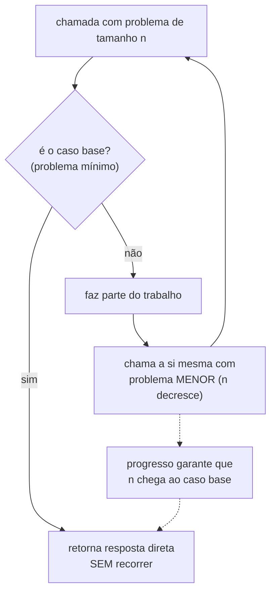
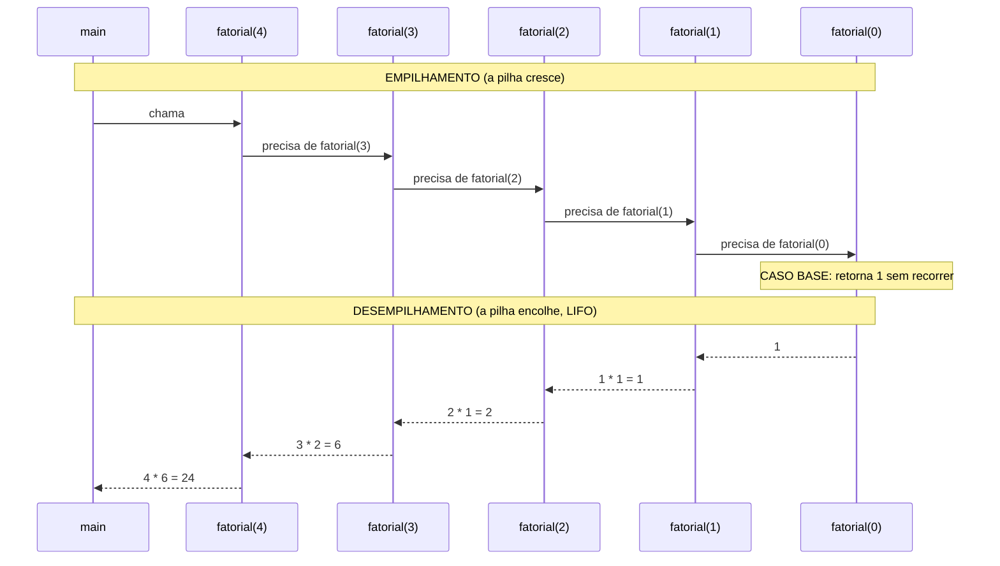
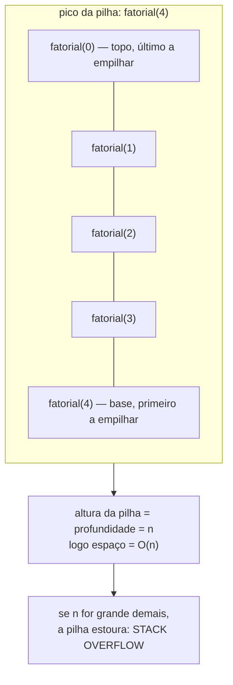
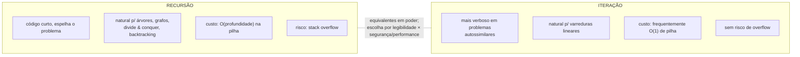
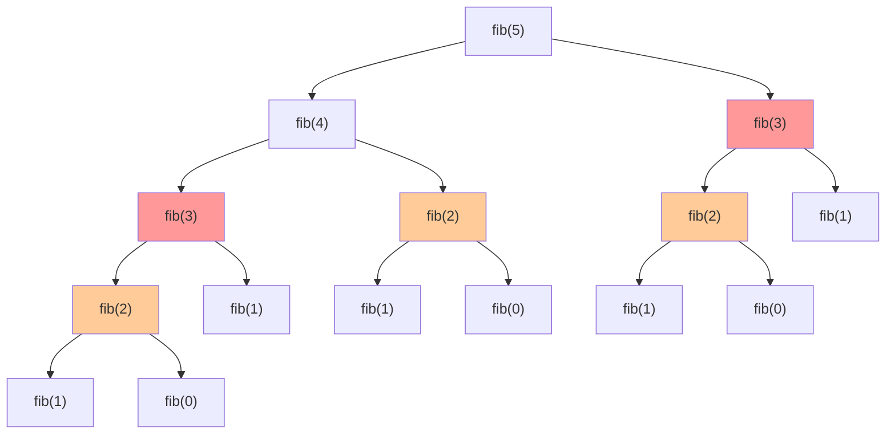

# Recursão

O clichê é a matrioska: você abre uma boneca russa e dentro tem outra boneca russa, e dentro outra, até uma que não abre. O clichê funciona, mas ele esconde a parte interessante. Uma matrioska física é *finita por construção* — o artesão parou de fabricar bonecas em algum ponto. A recursão em código não tem artesão: você é quem decide, escrevendo a função, onde está a boneca que não abre. Esqueça de colocar essa boneca, ou coloque uma que abre por engano, e a sua mão continua abrindo bonecas para sempre — até a mesa desabar. Essa "mesa que desaba" é o stack overflow, e entender por que ela desaba é metade desta nota.

A outra metade é uma ideia que parece um truque de mágica e não é: **uma função pode ser definida em termos de si mesma**. Soa circular, como uma definição de dicionário que usa a própria palavra. Mas não é circular se cada chamada resolve um problema *menor* que a anterior — tão menor que, eventualmente, sobra um problema tão pequeno que a resposta é imediata, sem precisar perguntar de novo. É a diferença entre "amor é o sentimento de amar" (circular, inútil) e "o fatorial de n é n vezes o fatorial de n−1, e o fatorial de 0 é 1" (recursivo, e perfeitamente bem definido).

> [!abstract] TL;DR
> **Recursão** é uma função que se chama a si mesma para resolver instâncias menores do mesmo problema. Toda recursão correta precisa de **dois ingredientes**: um **caso base** (uma condição de parada que *não* recorre — a boneca que não abre) e um **caso recursivo** (a chamada que reduz o problema rumo ao base). Implícito nos dois, um **terceiro requisito**: a **garantia de progresso** — cada chamada precisa chegar *mais perto* do caso base, senão a recursão é infinita e estoura a pilha. Por baixo, cada chamada empilha um **stack frame** (parâmetros, variáveis locais, endereço de retorno) na **pilha de chamadas**; o desempilhamento é LIFO, na ordem inversa. Por isso a recursão custa **O(profundidade) de espaço**, mesmo quando custa O(n) de tempo. **Toda recursão pode virar iteração** (e vice-versa): recursão é mais natural para estruturas autossimilares (árvores, grafos, divisão e conquista, backtracking); iteração evita o overhead de chamada e o risco de overflow. **Recursão de cauda** (*tail recursion*) é quando a chamada recursiva é a *última* operação — e linguagens com **TCO** (*tail call optimization*) reaproveitam o frame, transformando-a em loop O(1) de espaço. FATO prático: **Java/JVM não fazem TCO** (por causa das stack traces) e **CPython também não** (decisão explícita do Guido); **Scala (`@tailrec`)** e o **JavaScriptCore/Safari** fazem. Em Java e Python, recursão profunda **deve virar loop com pilha explícita**. Limites de profundidade típicos: **Python ~1000** (`sys.getrecursionlimit()`), **JVM milhares a dezenas de milhares** (depende de `-Xss`), **Go cresce a pilha dinamicamente** (teto default 1 GB).

## Os dois ingredientes (e o terceiro, que ninguém te conta)

Pegue a definição mais didática do mundo, o **fatorial**. Matematicamente: `n! = n × (n−1) × (n−2) × ... × 1`, e por convenção `0! = 1`. Repare que isso já é recursivo disfarçado — o `(n−1) × (n−2) × ...` *é* o fatorial de `n−1`. Então:

```python
def fatorial(n):
    if n == 0:          # caso base
        return 1
    return n * fatorial(n - 1)   # caso recursivo
```

Duas linhas de lógica, duas peças. A primeira, o **caso base**, é a boneca que não abre: `n == 0` retorna `1` *sem se chamar de novo*. Esse "sem se chamar de novo" é o ponto inteiro. Um caso base que recorre não é caso base — é só mais um caso recursivo travestido, e a recursão nunca termina.

A segunda peça, o **caso recursivo**, é onde a função se invoca: `n * fatorial(n - 1)`. E aqui mora a sutileza que os tutoriais costumam pular. Não basta a função se chamar — ela precisa se chamar **com um argumento mais perto do caso base**. Veja o `n - 1`: cada chamada diminui `n` em um. Partindo de `n = 4`, a sequência de argumentos é `4 → 3 → 2 → 1 → 0`, e em `0` o caso base intercepta. O problema *encolhe monotonicamente* rumo à parada.

A isso eu chamo o **terceiro requisito**, o implícito: a **garantia de progresso**. Pergunte-se sempre, ao escrever uma recursão: *cada chamada deixa o problema estritamente menor?* Se a resposta for não — se você chamar `fatorial(n)` dentro de `fatorial(n)`, ou `fatorial(n + 1)`, ou esquecer de mudar o argumento — a recursão não converge para o caso base. Ela diverge. E divergir, em recursão, tem um nome físico:

```python
def quebrado(n):
    if n == 0:
        return 1
    return n * quebrado(n)   # BUG: n não muda. Nunca chega a 0.
```

Essa função roda até a pilha estourar. Não porque a lógica está "errada" no sentido matemático — está errada no sentido de que *não respeita o progresso*. O caso base existe (`n == 0`), mas o caso recursivo nunca caminha até ele. É uma matrioska em que toda boneca, ao abrir, revela uma boneca do mesmo tamanho.

Vale dizer: o argumento que decresce nem sempre é um número. Numa recursão sobre lista, o "problema menor" é a cauda da lista (um elemento a menos). Numa recursão sobre árvore, são as subárvores (cada uma menor que o todo). O que tem que decrescer é alguma **medida** do problema — e essa medida tem que ter um piso, onde o caso base mora.



Leitura do diagrama: toda chamada faz a mesma pergunta — *já cheguei ao fundo?*. Se sim, devolve a resposta direta e não recorre (a saída do ciclo). Se não, faz a sua parte e delega o resto a uma chamada com o problema **menor**. A seta tracejada é o terceiro requisito: sem a garantia de que `n` decresce rumo ao base, o ciclo `A → E → A` nunca encontra a saída `C` e gira para sempre.

## A pilha de chamadas: o mecanismo físico

Até aqui falei de recursão como ideia. Mas ela roda numa máquina real, e a máquina tem um mecanismo concreto que torna a recursão possível — e que também é exatamente o que a faz custar memória e estourar. Esse mecanismo é a **pilha de chamadas** (*call stack*).

Toda vez que um programa chama uma função — recursiva ou não — o runtime empilha um **stack frame** (também chamado *activation record*). Esse frame guarda tudo que aquela invocação específica precisa para existir: os **parâmetros** recebidos, as **variáveis locais**, e — crucialmente — o **endereço de retorno**, que diz "quando eu terminar, volte para *cá* no código que me chamou". A pilha é uma estrutura **LIFO** (*last in, first out*): a última chamada empilhada é a primeira a desempilhar.

Numa chamada não-recursiva, isso é invisível — a pilha sobe um frame, a função roda, o frame sai. Na recursão, a coisa fica visceral: a função empilha um frame *e imediatamente empilha outro* (a chamada a si mesma) *antes de o primeiro terminar*. Os frames se acumulam, um sobre o outro, até alguém finalmente bater no caso base. Só então a pilha começa a *desabar* — desempilhando na ordem inversa, cada frame devolvendo seu valor ao frame de baixo.

Trace o `fatorial(4)`. A fase de **empilhamento** (descida) acontece primeiro: cada chamada suspende seu cálculo `n * (...)` porque ainda não sabe quanto vale o `(...)` — depende da chamada de baixo. Quando `fatorial(0)` retorna `1`, a fase de **desempilhamento** (subida) começa, e cada frame finalmente completa sua multiplicação:



Leitura do diagrama: a metade de cima é a descida — cinco frames se empilham e ficam *suspensos*, cada um esperando o resultado do de baixo para completar sua multiplicação. Nada é calculado ainda; só promessas acumuladas. O caso base `fatorial(0) = 1` é o gatilho que inverte o fluxo. A metade de baixo é a subida: cada frame recebe o valor, faz sua multiplicação pendente, devolve e *desempilha*. O resultado `24` só nasce no último passo — o que significa que, no pico (entre o empilhamento total e o início do desempilhamento), **os cinco frames coexistem na memória ao mesmo tempo**.

Esse pico é a chave do custo. A altura máxima da pilha é a **profundidade da recursão** — quantas chamadas aninhadas coexistem antes do caso base. Para `fatorial(n)`, a profundidade é `n`. E como cada frame ocupa memória, o **custo de espaço da recursão é O(profundidade)** — aqui, O(n) — *mesmo quando o custo de tempo também é O(n)*. Isto é fácil de esquecer: a [[02 - Análise de complexidade - Big-O]] da maioria das pessoas conta só operações (tempo), e a recursão tem um custo de **espaço escondido na pilha** que uma versão iterativa do mesmo algoritmo muitas vezes não tem.



Leitura do diagrama: empilhe os frames e olhe a altura. Para `fatorial(4)`, cinco frames coexistem no pico — o topo (`fatorial(0)`) foi o último a entrar e será o primeiro a sair (LIFO). A altura *é* a profundidade da recursão, e essa altura *é* o custo de espaço. A última seta é o aviso: a pilha tem um teto finito. Quando a profundidade ultrapassa esse teto — porque `n` é enorme, ou porque a garantia de progresso falhou e a recursão é infinita — a pilha estoura. É a mesa desabando.

## Recursão vs. iteração: o teorema que liberta

Eis um fato que assusta iniciantes e liberta quem o entende: **toda recursão pode ser reescrita como iteração, e toda iteração como recursão**. Elas são equivalentes em poder expressivo. Não existe problema que *só* a recursão resolve — é sempre uma escolha de estilo, não de capacidade. O fatorial recursivo de cima tem um gêmeo iterativo trivial:

```python
def fatorial_iter(n):
    acc = 1
    for i in range(2, n + 1):
        acc *= i
    return acc
```

Mesma resposta, sem pilha crescendo, sem risco de overflow, sem overhead de chamada de função. Então por que alguém usaria a versão recursiva? Porque **legibilidade não é um luxo** — e há problemas cuja estrutura é *intrinsecamente* recursiva, onde a versão iterativa é um pesadelo de pilhas manuais e a recursiva se lê como a própria definição do problema.

A regra de bolso: recursão brilha em **estruturas autossimilares** — coisas feitas de versões menores de si mesmas. Uma árvore é uma raiz com subárvores (que são árvores). Um grafo se percorre visitando vizinhos (e os vizinhos dos vizinhos). **Divisão e conquista** quebra o problema em metades do mesmo problema → [[06 - Divisão e conquista]]. **Backtracking** explora um galho, e se não der certo, *desfaz* e tenta outro → [[12 - Backtracking]]. Em todos esses, a recursão *espelha* a estrutura dos dados, e o código fica curto e óbvio. A iteração equivalente teria que simular a pilha à mão (você verá isso adiante) — funciona, mas você reescreveu o que a linguagem já te dava de graça.

Iteração, por outro lado, vence quando: (a) o problema é **linear** (um laço simples, sem ramificação), (b) você precisa de **garantia de espaço O(1)** sem depender da pilha, ou (c) a **profundidade pode ser enorme** e você não pode arriscar overflow. Multiplicar `n` números, somar um array, varrer uma lista — para isso, o `for` é mais honesto que a recursão.



Leitura do diagrama: as duas colunas não são "boa" e "ruim" — são **trade-offs espelhados**. O que é vantagem de um é desvantagem do outro. Recursão paga legibilidade com risco de pilha; iteração paga verbosidade com segurança de espaço. A linha tracejada do meio é o teorema da equivalência: como ambas resolvem tudo, a decisão nunca é "qual *consigo* usar?", mas "qual *devo* usar aqui?".

### Processo recursivo vs. processo iterativo (SICP)

Há uma distinção mais fina, e ela vem do *SICP* (Abelson & Sussman). **Forma sintática** e **processo** não são a mesma coisa. Uma função pode ser *escrita* de forma recursiva (ela se chama) e ainda assim *gerar um processo iterativo* — uma computação que roda em espaço constante, sem acumular uma cadeia de operações pendentes.

A diferença está no que sobra *pendente* a cada chamada. No `fatorial` lá de cima, cada frame deixa uma multiplicação suspensa (`n * (...)`) — a pilha precisa *lembrar* dela para completar na volta. Isso é um **processo recursivo**: a pilha cresce com `n`. Mas reescreva acumulando o resultado num parâmetro:

```python
def fatorial_acc(n, acc=1):
    if n == 0:
        return acc
    return fatorial_acc(n - 1, acc * n)   # nada pendente: a chamada É o retorno
```

Aqui, na volta, *não há nada a fazer* com o resultado da chamada recursiva além de devolvê-lo intacto. Não sobra multiplicação suspensa. Sintaticamente recursiva, mas o "estado" do cálculo vive todo no parâmetro `acc`, não na pilha. Esse é um **processo iterativo** — e é exatamente a porta de entrada para o próximo tópico.

## Recursão de cauda e TCO

Quando a chamada recursiva é a **última operação** da função — nada acontece com o seu retorno além de retorná-lo diretamente — temos uma **recursão de cauda** (*tail recursion*). O `fatorial_acc` acima é de cauda: a linha `return fatorial_acc(n - 1, acc * n)` não envolve o retorno em nenhuma operação posterior. Compare com `return n * fatorial(n - 1)`, onde o retorno ainda precisa ser multiplicado por `n` — *isso* exige que o frame sobreviva à chamada, para fazer a multiplicação na volta.

A consequência é profunda. Se nada precisa acontecer depois da chamada recursiva, então **o frame atual é inútil durante essa chamada**. Não há por que mantê-lo na pilha. Uma linguagem com **TCO** (*tail call optimization*, ou *proper tail calls*) percebe isso e **reaproveita o frame**: em vez de empilhar um novo, sobrescreve o atual. A profundidade da pilha para de crescer. A recursão de cauda, sob TCO, executa em **O(1) de espaço** — ela *é*, literalmente, um loop disfarçado.

Aqui está o trecho de honestidade desta nota, porque "TCO" é fonte de mitos. **Quem faz e quem não faz:**

- **Faz:** Scala oferece TCO de auto-recursão e ainda dá a anotação `@tailrec`, que faz o compilador *recusar* a compilação se o método não for de cauda — uma rede de segurança. O **JavaScriptCore (motor do Safari)** é, na prática, o único motor JS de browser que implementa os *proper tail calls* do ES6.
- **NÃO faz, e por design:** a **JVM (e Java)** não fazem TCO. A razão principal é preservar as **stack traces** completas — quando uma exceção sobe, o Java imprime toda a cadeia de chamadas, e reaproveitar frames apagaria esse rastro (também há motivos de segurança ligados a inspeção da pilha). Não é descuido; é uma decisão consciente. **CPython também não faz**, e isso foi uma escolha *explícita* do Guido van Rossum, que argumentou que TCO destrói as tracebacks e que Python prefere laços a recursão funcional.
- **Caso curioso:** o **V8** (Chrome/Node) *chegou a implementar* os proper tail calls do ES6, mas **desligou** o recurso por preocupações de experiência de depuração (frames sumindo da stack trace) — a mesma objeção da JVM e do CPython. O ES6 *especifica* TCO, mas quase nenhum motor o liga.
- **Go** não faz TCO, mas resolve o problema por outro caminho: cresce a pilha da goroutine **dinamicamente** (começa em ~2 KB e dobra conforme precisa), então recursão profunda raramente estoura na prática.

A conclusão prática é direta e vale gravar: **em Java e Python, não confie em TCO — ele não existe.** Uma recursão de cauda elegante que rodaria em O(1) no Scala vai *empilhar um frame por chamada* no Java e no Python. Para profundidade grande, ela estoura. Logo, **em Java/Python, recursão profunda deve ser reescrita como loop** (ou como recursão com pilha explícita, adiante). A elegância da cauda não te salva numa linguagem que não a otimiza.

## Stack overflow e limites de profundidade

Cada linguagem dá à pilha um teto, e ultrapassá-lo é o **stack overflow** — a mesa desabando. Os números (verificados):

- **Python:** o limite default é **~1000** chamadas aninhadas, retornável por `sys.getrecursionlimit()` e ajustável com `sys.setrecursionlimit(n)`. Mas cuidado: esse limite é uma *trava de software* que o CPython impõe de propósito, *para te proteger* de estourar a pilha real do sistema operacional (que mataria o processo com um crash de C, sem o gentil `RecursionError`). Aumentar o limite com `setrecursionlimit` afrouxa a trava de software, mas a pilha do SO continua sendo o teto físico real — subir demais troca um `RecursionError` controlado por um segfault bruto.
- **JVM/Java:** não há um número fixo — a pilha de cada thread é dimensionada pela flag **`-Xss`** (tamanho da stack por thread). Na prática, isso permite da ordem de **milhares a dezenas de milhares** de frames antes do `StackOverflowError`, dependendo do tamanho de cada frame (quantas variáveis locais a função tem) e do valor de `-Xss`. Aumentar `-Xss` compra mais profundidade ao custo de mais memória por thread.
- **Go:** a goroutine **cresce a pilha dinamicamente** — começa minúscula (~2 KB) e o runtime a expande conforme a profundidade exige, copiando para uma pilha maior. O teto default é alto (**1 GB** em sistemas 64-bit), ajustável por `runtime/debug.SetMaxStack`. Recursão profunda em Go quase nunca estoura — o limite serve mais como proteção contra recursão *infinita* (um bug) do que como restrição de recursão legítima.

O que fazer quando a profundidade é grande *por natureza* — não por bug, mas porque o problema realmente é fundo (uma DFS num grafo gigante, uma árvore degenerada que virou uma "lista" de altura `n`)? Em Java e Python, onde não há TCO e o teto é baixo, a resposta é **converter a recursão em iteração com pilha explícita**. A ideia: o que a pilha de chamadas fazia *automaticamente* por você (lembrar o que falta visitar), você passa a fazer *manualmente* numa estrutura de pilha na heap — que é muito mais espaçosa que a pilha de chamadas. Veja uma DFS:

```python
# Recursiva: simples, mas limitada pela pilha de chamadas
def dfs(no, visitados):
    visitados.add(no)
    for viz in no.vizinhos:
        if viz not in visitados:
            dfs(viz, visitados)

# Iterativa com pilha EXPLÍCITA: mesma lógica, pilha na heap (sem limite de profundidade)
def dfs_iter(inicio):
    visitados = set()
    pilha = [inicio]          # a pilha de chamadas vira um objeto na heap
    while pilha:
        no = pilha.pop()      # LIFO, igual à pilha de chamadas
        if no in visitados:
            continue
        visitados.add(no)
        for viz in no.vizinhos:
            pilha.append(viz)
```

Repare no espelho: o `pilha.append` faz o papel do "empilhar um frame", e o `pilha.pop` faz o do "desempilhar". A semântica LIFO é idêntica — você só trocou a pilha de chamadas (pequena, gerida pelo runtime) por uma pilha de dados (grande, gerida por você). É a estrutura de dados **pilha** literal fazendo o trabalho da pilha de chamadas → [[03-Dominios/Fundamentos/Estruturas de Dados/index|Estruturas de Dados]]. O preço é a perda de elegância; o ganho é a imunidade ao stack overflow.

## O Fibonacci ingênuo: quando a recursão te trai

Há uma recursão que parece tão inocente quanto o fatorial e que é uma **bomba de complexidade**. O Fibonacci, definido pela sua própria recorrência: `fib(n) = fib(n-1) + fib(n-2)`, com `fib(0) = 0` e `fib(1) = 1`.

```python
def fib(n):
    if n < 2:
        return n
    return fib(n - 1) + fib(n - 2)   # DUAS chamadas. O problema mora aqui.
```

Lindo, lê-se como a definição matemática. E desastroso. O fatorial fazia *uma* chamada recursiva — uma cadeia linear de profundidade `n`. O Fibonacci faz **duas**, e cada uma dessas faz duas, e a árvore de chamadas *explode exponencialmente*. Pior: ela recalcula as mesmas coisas repetidamente. Olhe a árvore de `fib(5)`:



Leitura do diagrama: conte os nós vermelhos e laranjas. `fib(3)` é calculado **duas vezes** (vermelho); `fib(2)` é calculado **três vezes** (laranja). E isso é só `n = 5` — para `n = 50`, os mesmos subproblemas são recalculados *bilhões* de vezes. O número total de chamadas cresce como **O(2ⁿ)**: cada nível quase dobra a largura da árvore. A recursão não é "lenta" por natureza — ela é lenta *aqui* porque **refaz trabalho que já fez**, sem memória de que já o fez.

E é exatamente esse desperdício que aponta para a saída. Se a árvore recalcula `fib(3)` duas vezes, por que não **guardar** o resultado da primeira vez e reusá-lo? Essa ideia — *lembrar respostas de subproblemas já resolvidos* — é a **memoização**, e ela transforma o O(2ⁿ) em O(n). O Fibonacci ingênuo é o gancho clássico, o exemplo de abertura de praticamente todo curso de **programação dinâmica** → [[10 - Programação dinâmica]]. Guarde a intuição: *recursão com sobreposição de subproblemas pede memória*.

## Para onde a recursão leva

Esta nota é o portão; o que segue se desenvolve em notas próprias (atomicidade — aqui eu só aponto):

- **Quanto custa uma recursão?** A análise de complexidade de algoritmos recursivos não se faz contando laços — se faz montando e resolvendo uma **recorrência** (uma equação que define o custo de `n` em termos do custo de tamanhos menores), e o atalho para os casos de divisão e conquista é o **Teorema Mestre** → [[05 - Recorrências e o Teorema Mestre]].
- **A estrutura algorítmica:** recursão é o esqueleto da **divisão e conquista** — quebrar em subproblemas, resolver recursivamente, combinar. Merge sort, quicksort, busca binária moram aqui → [[06 - Divisão e conquista]].
- **Recursão + memória:** o Fibonacci O(2ⁿ) é a porta da **programação dinâmica** → [[10 - Programação dinâmica]].
- **Recursão que explora e desfaz:** quando a recursão tenta um caminho, e se ele falhar, *volta atrás* e tenta outro, temos **backtracking** — N-rainhas, sudoku, permutações → [[12 - Backtracking]].

## Em entrevista

Recursão é tema garantido em entrevista — tanto em perguntas conceituais quanto em problemas (qualquer DFS, árvore ou D&C). Frases úteis em inglês:

- "This problem is **self-similar**, so a recursive solution mirrors its structure naturally."
- "Every recursion needs a **base case** that stops without recurring, and a **recursive case** that makes progress toward it."
- "The space complexity is **O(depth)** because of the **call stack** — each frame holds the locals and the return address."
- "This is **tail-recursive**, so a language with **TCO** would run it in constant space — but the **JVM and CPython don't optimize tail calls**, so I'd rewrite it as a loop to avoid a **stack overflow**."
- "The naïve recursion has **overlapping subproblems** and runs in O(2ⁿ); I'll **memoize** to bring it down to O(n)."
- "For very deep recursion I'd convert it to an **iterative version with an explicit stack** to avoid blowing the call stack."

Vocabulário PT → EN:

| Português | English |
| --- | --- |
| recursão | recursion |
| caso base | base case |
| caso recursivo | recursive case |
| garantia de progresso | progress guarantee |
| pilha de chamadas | call stack |
| quadro de pilha | stack frame |
| endereço de retorno | return address |
| estouro de pilha | stack overflow |
| recursão de cauda | tail recursion |
| otimização de chamada de cauda | tail call optimization (TCO) |
| recursão infinita | infinite recursion |
| profundidade da recursão | recursion depth |
| pilha explícita | explicit stack |
| subproblemas sobrepostos | overlapping subproblems |
| memoização | memoization |
| processo recursivo / iterativo | recursive / iterative process |
| árvore de chamadas | call tree |
| desempilhar | to pop / to unwind |

> [!info] Lastro
> - **SICP** — Abelson & Sussman, *Structure and Interpretation of Computer Programs* (2ª ed., MIT Press), §1.2.1: a distinção entre **processo recursivo e processo iterativo** (uma função sintaticamente recursiva pode gerar um processo iterativo se for de cauda).
> - **CLRS** — Cormen, Leiserson, Rivest, Stein, *Introduction to Algorithms* (3ª ed.): recursão, recorrências e o método de substituição/árvore de recursão (caps. 2 e 4).
> - **Python docs** — `sys.getrecursionlimit()` / `sys.setrecursionlimit()`: limite default ~1000, e a nota de que ele protege a pilha *real* do interpretador C. (docs.python.org, módulo `sys`.)
> - **Java/JVM e CPython sem TCO** — a JVM preserva stack traces completas (decisão de design ligada a debugging/segurança); Guido van Rossum rejeitou TCO em Python explicitamente pelo mesmo motivo (perda de tracebacks). O **V8** chegou a implementar os proper tail calls do ES6 e os desligou; o **JavaScriptCore/Safari** é o motor JS que os mantém. **Go** cresce a pilha da goroutine dinamicamente (default 1 GB, `runtime/debug.SetMaxStack`).

---

**Anterior:** [[03 - Análise amortizada]] · **Próxima:** [[05 - Recorrências e o Teorema Mestre]]
**MOC:** [[03-Dominios/Fundamentos/Algoritmos/index|Algoritmos]]
