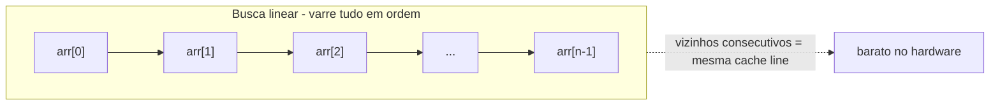
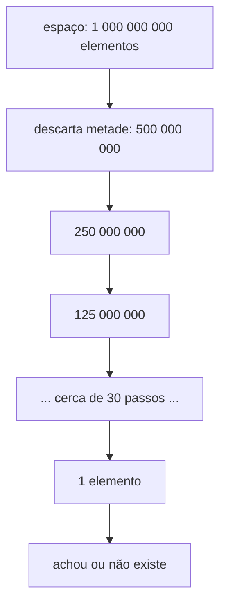
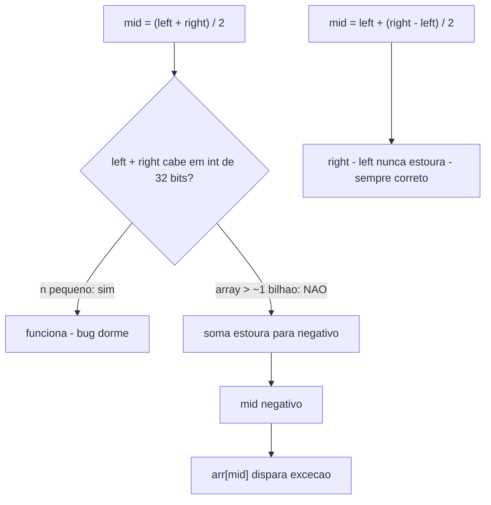
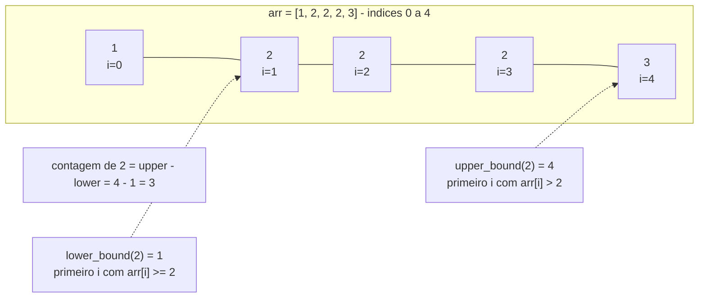
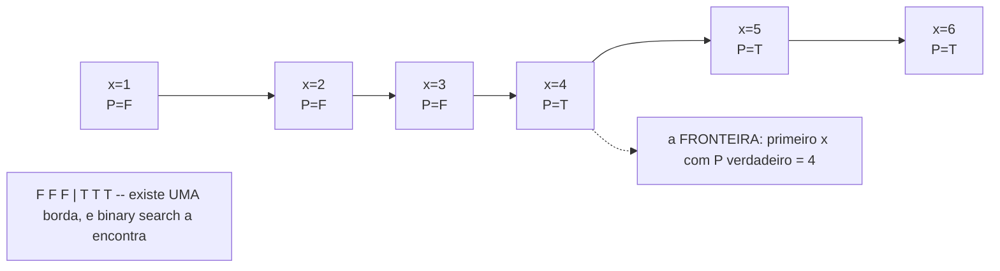
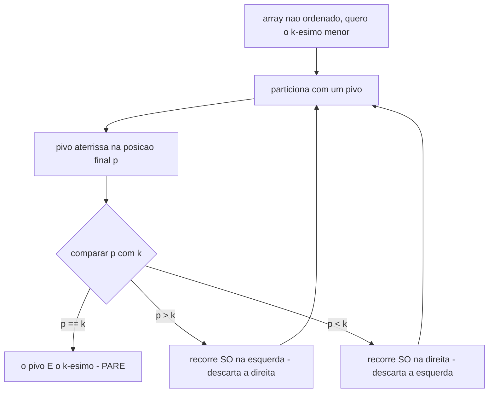
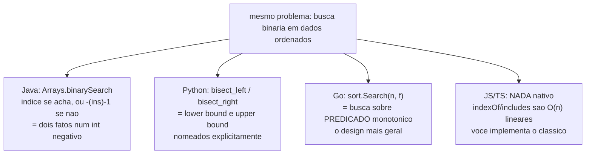

# Busca

> [!abstract] TL;DR
> **Busca linear** O(n) é o baseline honesto: serve para dados não ordenados, n pequeno, ou quando você busca uma vez só (ordenar só pra buscar uma vez não compensa). **Busca binária** O(log n) descarta metade do espaço a cada passo — mas exige dados **ordenados** e é uma das funções mais difíceis de escrever sem bug (off-by-one no laço, overflow no cálculo do meio). O salto de júnior para senior são três coisas: dominar **lower/upper bound** (achar a faixa de ocorrências de um valor com repetidos), reconhecer **busca no espaço de respostas** (predicado monotônico FFFF**T**TTT — achar o primeiro T sobre *valores*, não índices), e saber que **quickselect** acha o k-ésimo menor em O(n) médio sem ordenar tudo. Nas stdlib, a divergência é de *design de API*: Java codifica o ponto de inserção num retorno negativo, Python separa `bisect_left`/`bisect_right`, Go abstrai sobre um predicado (`sort.Search`), e JS/TS **não oferece nada nativo**.

Pense em como você procura uma palavra num dicionário de papel. Você não começa na letra A e vai virando página por página até chegar em "técnica" — isso seria busca linear, e levaria a tarde inteira. Você abre o dicionário no meio, olha a letra do topo, decide "está antes" ou "está depois", e repete *só na metade que importa*. Em quatro ou cinco aberturas você chegou lá, num livro de mil páginas. Esse gesto — descartar metade a cada passo — é a **busca binária**, e seu cérebro a inventou sozinho porque o dicionário está **ordenado**. Tire a ordem alfabética e o truque some: num dicionário embaralhado, não há o que fazer além de folhear tudo.

Esta nota é o tratamento de **busca**. A busca linear é o piso; a busca binária é o teto teórico para dados ordenados em arrays. Mas o que separa quem decorou o template de quem *entende* busca binária são as variações (lower/upper bound), a generalização (busca no espaço de respostas) e a prima esperta que acha o k-ésimo sem ordenar (quickselect). Ordenar é pré-requisito da busca binária — por isso ela vem logo depois de [[07 - Ordenação]].

> [!info] Lastro
> - **CLRS** — *Introduction to Algorithms*, 4ª ed. (Cormen, Leiserson, Rivest, Stein). Cap. 2 (exercício clássico de busca binária), cap. 9 (medianas e estatísticas de ordem: quickselect / `RANDOMIZED-SELECT` e mediana-das-medianas / `SELECT` com garantia O(n) no pior caso).
> - **Sedgewick & Wayne** — *Algorithms*, 4ª ed. (binary search em arrays ordenados, `rank`/símbolo-tabela, quickselect).
> - **Jon Bentley** — *Programming Pearls*, 2ª ed., cap. 4 e 5 ("Writing Correct Programs"): o estudo de caso famoso de que escrever uma busca binária correta é surpreendentemente difícil — em experimentos, a maioria dos programadores profissionais não consegue na primeira tentativa.
> - **Joshua Bloch** — *"Extra, Extra — Read All About It: Nearly All Binary Searches and Mergesorts are Broken"* (Google Research Blog, junho de 2006): o bug de overflow no cálculo de `mid`, que viveu no JDK por quase uma década.
> - **Python docs** — módulo [`bisect`](https://docs.python.org/3/library/bisect.html): `bisect_left`, `bisect_right`/`bisect`, `insort_left`/`insort_right`.
> - **Go docs** — [`sort.Search`](https://pkg.go.dev/sort#Search) (busca binária genérica sobre predicado monotônico) e [`slices.BinarySearch`](https://pkg.go.dev/slices#BinarySearch) (Go 1.21, retorna `(int, bool)`).
> - **Java docs** — `java.util.Arrays.binarySearch` e `java.util.Collections.binarySearch` (retorno negativo codificando o ponto de inserção).

---

## 1. Busca linear: o baseline que não merece desprezo

A busca linear é o algoritmo mais óbvio do mundo: percorra do começo ao fim, compare cada elemento com o alvo, pare quando achar. Custo O(n) no pior caso (o elemento não está, ou está no fim), O(1) no melhor (está logo no começo), O(n) na média.

```python
def busca_linear(arr, alvo):
    for i, x in enumerate(arr):
        if x == alvo:
            return i
    return -1
```

Parece bobo gastar parágrafos nisso. Mas a busca linear é frequentemente **a resposta certa**, e errar isso em entrevista te marca como alguém que aplica binary search reflexivamente sem pensar.

**Quando a busca linear é o certo:**

- **Dados não ordenados.** Busca binária *exige* ordem. Se o array não está ordenado, suas opções são: ordenar primeiro (O(n log n)) e depois buscar O(log n), ou simplesmente varrer linear O(n). Para **uma única busca**, varrer ganha de longe — ordenar custaria mais que a própria busca linear. Você só amortiza o custo de ordenar se for buscar **muitas vezes** no mesmo array.
- **n pequeno.** Para uma dúzia de elementos, a diferença entre O(n) e O(log n) é ruído. O overhead de calcular `mid`, de saltos no array que estouram a linha de cache, muitas vezes deixa a busca binária *mais lenta* que a linear nesse regime.
- **Estruturas que só dão acesso sequencial.** Numa lista encadeada você não tem acesso aleatório O(1) ao "meio" — chegar ao índice `mid` já custa O(n). Busca binária em lista encadeada é O(n log n), pior que a linear O(n). Binary search **quer array** (acesso aleatório barato).

> [!warning] Não menospreze a localidade de cache
> A análise Big-O assume que todo acesso à memória custa igual. Na prática, ler posições **consecutivas** (busca linear) aproveita a *cache line* da CPU — quando você lê `arr[i]`, o hardware já trouxe `arr[i+1]`, `arr[i+2]`... de graça. A busca binária **salta** (`mid`, depois `mid/2` ou `3·mid/2`...), e cada salto pode ser um *cache miss*. Para arrays pequenos a médios, a busca linear sequencial pode bater a binária *na prática*, mesmo com pior complexidade assintótica. É o tipo de detalhe que [[02 - Análise de complexidade - Big-O]] avisa: Big-O esconde constantes, e constantes vencem em n pequeno.



Leitura do diagrama: a busca linear caminha por vizinhos consecutivos. O ponteiro nunca pula. É por isso que, apesar do O(n), ela é *amiga do cache* — e em n pequeno essa amizade pode superar a vantagem assintótica da binária, que pula pelo array e paga *cache miss* a cada salto.

A regra de bolso: **se você vai buscar uma vez só, ou os dados não estão ordenados, ou n é pequeno, faça linear.** A busca binária só compensa quando o array já está ordenado (ou você vai buscar tantas vezes que vale ordenar) *e* n é grande o bastante para o log fazer diferença.

---

## 2. Busca binária: descartar metade a cada passo

A busca binária resolve: "em um array **ordenado**, onde está o alvo?" em O(log n). A ideia é o gesto do dicionário. Olhe o meio. Três casos:

1. `arr[mid] == alvo` → achou, retorne `mid`.
2. `arr[mid] < alvo` → o alvo, se existe, está na **metade direita**. Descarte a esquerda.
3. `arr[mid] > alvo` → o alvo está na **metade esquerda**. Descarte a direita.

Cada passo joga fora metade do espaço de busca. Partindo de n elementos: n → n/2 → n/4 → ... → 1. O número de divisões por 2 até chegar a 1 é log₂(n). Por isso O(log n): para um bilhão de elementos, ~30 comparações. Para um trilhão, ~40. O log é absurdamente lento de crescer — essa é a mágica.



Leitura do diagrama: cada seta é **uma comparação** que apaga metade do que sobrou. Trinta setas levam um bilhão a um. É a forma visual de "log n é o número de vezes que você divide n por 2 até chegar a 1" — o oposto exato de "2^k é o número de vezes que você dobra 1 até chegar a n".

### 2.1 O template confiável

Existe um template que, uma vez memorizado, você escreve sem hesitar. A versão "encontra o índice exato do alvo" (busca clássica):

```python
def busca_binaria(arr, alvo):
    left, right = 0, len(arr) - 1      # intervalo FECHADO [left, right]
    while left <= right:               # enquanto o intervalo NÃO está vazio
        mid = left + (right - left) // 2   # meio, sem overflow
        if arr[mid] == alvo:
            return mid
        elif arr[mid] < alvo:
            left = mid + 1             # descarta esquerda + o próprio mid
        else:
            right = mid - 1            # descarta direita + o próprio mid
    return -1                          # não encontrado
```

```java
// Java
static int buscaBinaria(int[] arr, int alvo) {
    int left = 0, right = arr.length - 1;
    while (left <= right) {
        int mid = left + (right - left) / 2;   // sem overflow
        if (arr[mid] == alvo) return mid;
        else if (arr[mid] < alvo) left = mid + 1;
        else right = mid - 1;
    }
    return -1;
}
```

O segredo para nunca errar é fixar um **invariante** e escrever o código *a partir dele*, em vez de chutar `<` vs `<=` e ir testando.

### 2.2 O invariante: o que o template promete

A versão acima usa **intervalo fechado** `[left, right]`: o alvo, *se existe*, está garantidamente dentro de `[left, right]`. Esse é o invariante. Tudo decorre dele:

- **Condição do laço: `left <= right`.** O intervalo `[left, right]` é não-vazio enquanto `left <= right`. Quando `left == right`, ainda há **um** elemento para checar (`arr[left]`). Quando `left > right`, o intervalo ficou vazio — o alvo não existe, saímos com `-1`. Se você escrevesse `left < right`, perderia a checagem do último elemento quando o intervalo encolhe a um só.
- **`left = mid + 1` (não `mid`).** Já comparamos `arr[mid]` e sabemos que ele não é o alvo (era menor). Mantê-lo no intervalo (`left = mid`) violaria o invariante "todo elemento de `[left, right]` ainda é candidato" e — pior — pode travar o laço para sempre. Mesmo raciocínio para `right = mid - 1`.

> [!danger] Os dois erros que matam toda busca binária
> Bentley, em *Programming Pearls*, fez professores experientes escreverem uma busca binária; **a maioria entregou código com bug** mesmo tendo horas. Os dois assassinos:
>
> **1) Off-by-one / laço infinito.** Misturar o estilo de intervalo. Se você usa intervalo fechado `[left, right]`, o par certo é `while left <= right` + `mid ± 1`. Se você usa intervalo semiaberto `[left, right)` (right começa em `len(arr)`), o par certo é `while left < right` + `right = mid` (sem o `-1`). **Misturar** os estilos — `left <= right` com `right = mid`, por exemplo — gera laço que nunca termina (quando `left == right == mid`, `right = mid` não muda nada e você gira para sempre). Escolha **um** estilo e seja consistente com o invariante.
>
> **2) Overflow no cálculo do meio.** Esta é histórica. Veja a seção 2.3.

### 2.3 O bug de overflow que viveu 9 anos no JDK

A linha inocente:

```java
int mid = (left + right) / 2;   // ERRADO para arrays grandes
```

parece óbvia e correta. E **está errada**. Se `left` e `right` forem ambos grandes — digamos, perto de 2³¹−1 num array com mais de ~1 bilhão de elementos — a **soma `left + right` estoura** o `int` de 32 bits. Em Java, a soma "vira" para um número **negativo**, `mid` fica negativo, e o acesso `arr[mid]` lança `ArrayIndexOutOfBoundsException`. O algoritmo está logicamente perfeito; é a aritmética da máquina que trai.

A correção:

```java
int mid = left + (right - left) / 2;   // CERTO
```

`right - left` nunca estoura (é uma diferença de dois não-negativos, sempre cabe), você divide por 2 (encolhe), e só então soma a `left`. Mesmo resultado matemático, sem overflow.

A história: **Joshua Bloch** (que escreveu a busca binária do JDK) publicou em **junho de 2006** o post *"Nearly All Binary Searches and Mergesorts are Broken"*. O bug estava no `java.util.Arrays.binarySearch` da biblioteca-padrão do Java **desde sua primeira versão** — quase uma década rodando em produção no mundo todo, num código que tinha passado por revisão, testes e até *prova de corretude* (a versão de Bentley em *Programming Pearls* tinha o mesmo bug, e Bentley a havia "provado" correta). O bug nunca disparou porque, nos anos 1980-90, ninguém tinha arrays de um bilhão de elementos na memória. O hardware cresceu e o bug acordou.

> [!quote] A lição de [[01 - O que é um algoritmo]]
> Este é o **edge case canônico**. Um algoritmo "correto" no papel pode estar errado na máquina porque o modelo (inteiros matemáticos infinitos) não bate com a realidade (inteiros de 32 bits que estouram). A definição de algoritmo exige *corretude para todas as entradas válidas* — e "array com 2 bilhões de elementos" é uma entrada válida. Bloch resume: a prova estava certa, *para inteiros idealizados*; a implementação rodava em inteiros reais. Sempre pergunte: "o que acontece nos extremos do domínio?" — vazio, um elemento, o maior possível, o que estoura.



Leitura do diagrama: o caminho da esquerda mostra por que o bug ficou escondido por anos — em arrays normais a soma cabe e tudo funciona. Só quando o array passa de ~1 bilhão a soma estoura e cai no ramo do crash. A forma à prova de bug (`left + (right - left) / 2`) nunca soma dois números grandes, então nunca estoura.

---

## 3. As variações que separam senior de júnior: lower e upper bound

A busca binária clássica responde "o alvo existe? em que índice?". Mas em arrays com **valores repetidos** ela é ambígua: se `arr = [1, 2, 2, 2, 3]` e você busca `2`, qual índice ela retorna? O template clássico devolve *algum* índice com 2 (qualquer um — depende de como os saltos caíram), e isso raramente é o que você quer. As perguntas úteis são outras:

- "Qual a **primeira** posição com valor `2`?" → **lower bound**.
- "Qual a posição **logo depois da última** ocorrência de `2`?" → **upper bound**.
- "Quantos `2` existem?" → `upper_bound - lower_bound`. **A faixa inteira de ocorrências, em O(log n).**

Dominar essas duas variações destrava **metade** dos problemas de busca binária em entrevista. Elas não buscam um valor *exato* — buscam uma **fronteira**.

### 3.1 As duas fronteiras numa sequência com repetidos



Leitura do diagrama: **lower bound** aponta para o *primeiro* 2 (a porta de entrada do bloco de repetidos); **upper bound** aponta para o *primeiro elemento maior que 2* (a porta de saída, logo após o último 2). A distância entre as duas portas é exatamente quantos 2 existem. Se o valor não existir no array, lower e upper bound **coincidem** — e apontam para onde ele *seria inserido* (o "insertion point").

### 3.2 Definições precisas

- **lower bound de `alvo`:** o **menor** índice `i` tal que `arr[i] >= alvo`. É o **insertion point** que mantém a ordem inserindo *antes* dos iguais. Se `alvo` está presente, é a **primeira ocorrência**.
- **upper bound de `alvo`:** o **menor** índice `i` tal que `arr[i] > alvo`. É o insertion point inserindo *depois* dos iguais. Se `alvo` está presente, é a posição **logo após a última ocorrência**.

Repare que as duas são, no fundo, "ache a primeira posição onde uma condição vira verdadeira". Para lower bound a condição é `arr[i] >= alvo`; para upper bound é `arr[i] > alvo`. Essa observação é a ponte para a seção 4 (busca no espaço de respostas) — lower/upper bound já *são* busca binária sobre um predicado, só que o predicado olha o array.

### 3.3 Os templates e a diferença minúscula que muda tudo

```python
def lower_bound(arr, alvo):
    # primeiro i com arr[i] >= alvo  (intervalo semiaberto [left, right))
    left, right = 0, len(arr)         # right = len, NÃO len-1
    while left < right:               # semiaberto: < , não <=
        mid = left + (right - left) // 2
        if arr[mid] < alvo:           # ainda pequeno demais -> avança
            left = mid + 1
        else:                         # arr[mid] >= alvo -> mid é candidato, NÃO descarte
            right = mid               # mantém mid (right = mid, sem -1)
    return left                       # left == right == a fronteira

def upper_bound(arr, alvo):
    # primeiro i com arr[i] > alvo  -- ÚNICA mudança: <= em vez de <
    left, right = 0, len(arr)
    while left < right:
        mid = left + (right - left) // 2
        if arr[mid] <= alvo:          # <= : igual também "ainda não passou" -> avança
            left = mid + 1
        else:                         # arr[mid] > alvo -> candidato
            right = mid
    return left
```

Olhe as duas funções lado a lado. A **única** diferença entre lower e upper bound é uma comparação:

| | lower bound | upper bound |
|---|---|---|
| Condição "ainda não chegou na fronteira" | `arr[mid] < alvo` | `arr[mid] <= alvo` |
| O que faz no **empate** (`arr[mid] == alvo`) | cai no `else` → trata mid como candidato (não avança além dele) | trata como "ainda não passou" → **avança** (`left = mid + 1`) |
| Resultado | para na **primeira** ocorrência | para **depois** da última |

É isso. `<` versus `<=`. No empate, lower bound *recua* a fronteira para incluir o igual; upper bound *empurra* a fronteira para além do igual. Trocar um caractere muda completamente a semântica — e é exatamente por isso que esse é o conceito que separa quem entende de quem decorou.

> [!note] Por que `right = mid` (sem `-1`) e `while left < right`
> Aqui usamos o estilo **semiaberto** `[left, right)`: `right` começa em `len(arr)` (uma posição *após* o fim — válida como "insertion point no fim"). A condição é `left < right`, e quando achamos um candidato fazemos `right = mid` (mantendo `mid`, porque `mid` *pode ser* a fronteira). O laço termina com `left == right`, e esse valor *é* a resposta. Note como isso é um estilo de intervalo **diferente** do template da seção 2.1 (fechado, `left <= right`, `mid ± 1`). Os dois estilos são corretos — o crime é **misturá-los**. Escolha conscientemente conforme a pergunta: "achar valor exato" → fechado; "achar fronteira / insertion point" → semiaberto.

Com lower e upper bound no bolso, problemas como "quantas vezes X aparece neste array ordenado", "primeira e última posição de um elemento", "qual o menor elemento >= X" viram one-liners. É a navalha suíça da busca binária.

---

## 4. Busca no espaço de respostas (binary search on the answer)

Esta é a aplicação que mais impressiona em entrevista, e a que mais gente *não enxerga*. Até aqui a busca binária procurou num **array concreto**. Agora vamos buscar num **array implícito** — uma faixa de *valores possíveis para a resposta* que nem existe na memória.

### 4.1 O predicado monotônico FFFF·TTTT

A busca binária só precisa de **uma** propriedade para funcionar: **monotonicidade**. No array clássico, a monotonicidade é a ordenação (à esquerda menor, à direita maior). Generalize: suponha que exista um **predicado** `P(x)` — uma função que devolve verdadeiro ou falso — tal que, conforme `x` cresce, `P(x)` é **falso, falso, ..., falso, e então VERDADEIRO, verdadeiro, ...** e nunca mais volta a ser falso. Uma vez verdadeiro, sempre verdadeiro.



Leitura do diagrama: a sequência de respostas do predicado é `F F F T T T` — uma transição **única** de falso para verdadeiro. Se essa transição existe e é única (monotonicidade), você pode achar a **borda** (o primeiro T) em O(log) avaliações de `P`, mesmo que os valores de `x` não estejam armazenados em lugar nenhum. Você está fazendo busca binária sobre o **espaço de valores de `x`**, não sobre índices de array.

O **sinal de reconhecimento** em entrevista: o problema pede **"o menor (ou maior) X tal que uma condição vale"**, e essa condição é **monotônica** em X (se vale para X, vale para todo valor maior; ou o contrário). Quando você lê "menor capacidade", "mínimo tempo", "maior tamanho possível tal que ainda cabe" — pense binary search on the answer.

### 4.2 O template genérico

```python
def menor_x_que_satisfaz(lo, hi, P):
    # P é monotônico: F...F T...T. Retorna o menor x em [lo, hi] com P(x) verdadeiro.
    while lo < hi:
        mid = lo + (hi - lo) // 2
        if P(mid):
            hi = mid          # mid serve -> a resposta é mid ou algo menor
        else:
            lo = mid + 1      # mid não serve -> a resposta é maior que mid
    return lo                  # lo == hi == a borda
```

É **o mesmo esqueleto** do lower bound (seção 3.3) — só que `P(mid)` substitui `arr[mid] >= alvo`. A busca binária sobre array ordenado é só um caso particular onde o predicado é "este elemento já é grande o bastante". Entender isso unifica tudo.

### 4.3 Exemplos clássicos (todos a mesma forma)

- **Raiz quadrada inteira de `n`.** "Maior `x` tal que `x*x <= n`." Predicado `P(x) = x*x > n` é monotônico. Busca binária em `[0, n]`. Não precisa de `Math.sqrt`.
- **Koko comendo bananas** (clássico de LeetCode). Koko come `k` bananas/hora; quer comer todas as pilhas em `H` horas. Acha a **menor velocidade `k`** que cabe no prazo. Predicado `P(k) = "comendo a k/h, termino em <= H horas"` é monotônico (mais rápido só ajuda). Busca binária em `k ∈ [1, max(pilha)]`.
- **Menor capacidade de navio para entregar em `D` dias.** Pacotes em ordem; cada dia o navio leva um prefixo até encher. Acha a **menor capacidade** que entrega tudo em `D` dias. `P(cap) = "com essa capacidade, entrego em <= D dias"` — monotônico (navio maior nunca atrasa). Busca binária no espaço de capacidades.
- **Alocação de páginas / split de array.** Distribuir livros entre `k` estudantes minimizando o máximo de páginas que alguém lê. `P(limite) = "consigo dividir em <= k grupos, cada um com soma <= limite"` — monotônico. Busca binária no espaço de "limite máximo".

O padrão é sempre: (1) identifique o **intervalo de respostas candidatas** `[lo, hi]`, (2) escreva o **predicado monotônico** `P(x)` que checa "esse candidato é viável?" — geralmente uma simulação/contagem O(n) —, (3) busca binária pela borda. Custo total: O(n · log(faixa de respostas)). O insight central, que vale repetir: **é busca binária sobre VALORES, não sobre índices.** Não há array; há um espaço de possibilidades com uma fronteira de viabilidade.

---

## 5. Quickselect: o k-ésimo menor em O(n) médio

Pergunta: "qual o k-ésimo menor elemento de um array (não ordenado)?" — por exemplo, a mediana, ou o 10º maior salário. A solução preguiçosa: ordene tudo (O(n log n)) e pegue `arr[k-1]`. Funciona, mas é desperdício — você ordenou o array inteiro só para olhar uma posição.

**Quickselect** acha o k-ésimo em **O(n) médio** sem ordenar tudo. Ele empresta o **particionamento** do quicksort (visto em [[06 - Divisão e conquista]]), mas com uma economia decisiva.

### 5.1 A ideia: particiona, mas recorre num lado só

Particionar (à la quicksort): escolha um **pivô**, rearranje o array para que tudo menor que o pivô fique à esquerda dele e tudo maior à direita. Depois disso, o pivô está na sua **posição final ordenada** `p` — mesmo sem o resto estar ordenado. Agora compare `p` com `k`:

- `p == k` → achamos! O pivô é o k-ésimo. Pare.
- `p > k` → o k-ésimo está **à esquerda**. Recorra **só** na esquerda.
- `p < k` → o k-ésimo está **à direita**. Recorra **só** na direita.



Leitura do diagrama: a diferença crucial em relação ao quicksort está nas setas `p > k` e `p < k` — o quicksort recorreria nos **dois** lados (para ordenar tudo); o quickselect recorre em **um só** (o que contém o k-ésimo) e **joga o outro fora**. É essa poda de metade do trabalho a cada nível que derruba o custo de O(n log n) para O(n).

### 5.2 Por que O(n) médio e não O(n log n)

No quicksort, cada nível da recursão processa os **dois** lados, então o trabalho total por nível é O(n), e há O(log n) níveis → O(n log n). No quickselect, descartamos um lado. Com um pivô razoável (particionamento equilibrado em média), o subproblema encolhe pela metade a cada passo, mas só há **um** subproblema por nível:

$$T(n) = T(n/2) + O(n)$$

Expandindo: `n + n/2 + n/4 + n/8 + ...` — uma **série geométrica** que converge para `2n`. Ou seja, **O(n)**. Não há "log n níveis fazendo O(n) cada"; há *um* caminho de trabalho que diminui geometricamente e soma a um múltiplo de n. Esse é o pulo do gato: a poda de um lado transforma o `× log n` num fator constante.

```python
import random

def quickselect(arr, k):
    # k 1-indexado: 1 = menor de todos. Trabalha sobre cópia para não destruir o input.
    def part(a, lo, hi, pivot_idx):
        pivot = a[pivot_idx]
        a[pivot_idx], a[hi] = a[hi], a[pivot_idx]   # joga o pivo pro fim
        store = lo
        for i in range(lo, hi):
            if a[i] < pivot:
                a[i], a[store] = a[store], a[i]
                store += 1
        a[store], a[hi] = a[hi], a[store]           # pivo pra posicao final
        return store

    a = list(arr)
    lo, hi, target = 0, len(a) - 1, k - 1
    while lo <= hi:
        p = part(a, lo, hi, random.randint(lo, hi))  # pivo ALEATORIO -> O(n) medio
        if p == target:
            return a[p]
        elif p < target:
            lo = p + 1
        else:
            hi = p - 1
```

### 5.3 Pior caso e a garantia de mediana-das-medianas

Igual ao quicksort, o quickselect tem **pior caso O(n²)**: se o pivô for sistematicamente o pior possível (sempre o maior ou o menor), cada partição reduz o array em apenas 1 elemento, e a série vira `n + (n-1) + (n-2) + ... = O(n²)`. Na prática, **pivô aleatório** (como no código acima) torna esse pior caso astronomicamente improvável — O(n) esperado é o que você vê.

Para uma **garantia** de O(n) no pior caso existe o algoritmo **mediana-das-medianas** (`SELECT`, em CLRS cap. 9): ele escolhe o pivô de forma esperta (mediana de medianas de grupos de 5), garantindo que cada partição descarte pelo menos uma fração fixa do array. É elegante teoricamente, mas tem constante grande e raramente compensa na prática — fica como conhecimento de cultura, não desenvolvo aqui.

> [!tip] Quickselect vs heap: a escolha certa depende do cenário
> Para "k-ésimo *maior*" há uma solução alternativa com **heap de tamanho k**: mantenha um min-heap dos k maiores vistos até agora, em O(n log k) — veja [[03-Dominios/Fundamentos/Estruturas de Dados/index|Estruturas de Dados]]. Qual escolher?
> - **Quickselect ganha em média** num array que você tem inteiro na memória: O(n) bate O(n log k).
> - **Heap ganha em streaming**: se os dados *chegam um a um* e você não pode guardar tudo (ou nem sabe quantos virão), o heap de tamanho k te dá os k maiores com memória O(k), e o quickselect nem é aplicável (ele precisa do array completo para particionar).
> - **Heap também ganha se você precisa dos k itens ordenados** no fim, não só do k-ésimo valor. Quickselect te dá *o* k-ésimo e um array particionado (os k menores ficam à esquerda, mas desordenados).

---

## 6. Implementações comparadas: Java · TypeScript · Python · Go

A busca binária é onde as bibliotecas-padrão revelam **filosofias de design de API diferentes**. Todas resolvem o mesmo problema; cada uma escolheu uma forma distinta — e a forma conta uma história sobre a linguagem.

### 6.1 Java — o ponto de inserção codificado num retorno negativo

`java.util.Arrays.binarySearch(arr, key)` (para arrays) e `java.util.Collections.binarySearch(list, key)` (para listas) fazem busca binária sobre um array/lista **já ordenado** (pré-condição — o resultado é indefinido se não estiver).

O design curioso é o **valor de retorno**:

- **Se encontrar** a chave: retorna o **índice** (≥ 0). Atenção: se houver **duplicatas**, *não há garantia* de qual dos índices será retornado.
- **Se não encontrar**: retorna **`-(insertion point) - 1`** — um número **negativo** que codifica onde a chave *seria inserida* para manter a ordem.

```java
int[] arr = {10, 20, 30, 40};
int i = Arrays.binarySearch(arr, 30);   //  i =  2   (achou no indice 2)
int j = Arrays.binarySearch(arr, 25);   //  j = -3   (nao achou; -(2) - 1)
// decodificar o insertion point quando j < 0:
if (j < 0) {
    int insertionPoint = -(j) - 1;       // = -j - 1 = -(-3) - 1 = 2
    // 25 seria inserido no indice 2 (entre 20 e 30)
}
```

Por que essa codificação esquisita? Para devolver **duas informações em um único `int`**: "achou ou não" *e* "onde está / onde caberia", sem alocar um objeto. O `-1` extra no `-(insertion point) - 1` existe para distinguir "não achei, insertion point 0" (retorna `-1`) de "achei no índice 0" (retorna `0`) — sem ele, ambos seriam `0` e ambíguos. É econômico, mas precisa ser **aprendido**: muito programador Java chama `binarySearch`, recebe `-3`, e fica confuso.

### 6.2 Python — `bisect`, com lower e upper bound explícitos

O módulo **[`bisect`](https://docs.python.org/3/library/bisect.html)** é a versão Pythônica, e a mais alinhada com a seção 3:

- **`bisect.bisect_left(a, x)`** — retorna o índice do **leftmost insertion point**. É **exatamente o lower bound** da seção 3: o primeiro `i` com `a[i] >= x`. Se `x` existe, a primeira ocorrência.
- **`bisect.bisect_right(a, x)`** (alias **`bisect.bisect`**) — o **rightmost insertion point**. É **exatamente o upper bound**: o primeiro `i` com `a[i] > x`. Se `x` existe, logo após a última ocorrência.
- **`bisect.insort_left` / `insort_right`** — inserem `x` mantendo a lista ordenada (acham o ponto com bisect e depois inserem).

```python
import bisect
a = [1, 2, 2, 2, 3]
bisect.bisect_left(a, 2)    # 1  -> lower bound: primeira ocorrencia
bisect.bisect_right(a, 2)   # 4  -> upper bound: apos a ultima
bisect.bisect_right(a, 2) - bisect.bisect_left(a, 2)   # 3 -> contagem de 2s

# "x existe?" -> verifique a posicao do bisect_left
i = bisect.bisect_left(a, 2)
existe = i < len(a) and a[i] == 2   # True
```

> [!note] O custo escondido de `insort`
> `insort` é O(log n) para *achar* a posição, mas O(n) para *inserir* numa lista Python (deslocar elementos). Os docs avisam: a busca O(log n) é dominada pela inserção O(n). `bisect` brilha em **buscar**, não em manter uma estrutura sob muitas inserções — para isso, outra estrutura de dados.

A diferença de filosofia: Python **não força você a decodificar nada**. Quer a primeira ocorrência? `bisect_left`. Quer depois da última? `bisect_right`. Os dois nomes dizem o que fazem, e mapeiam direto nos conceitos de lower/upper bound. "Achou ou não" você decide checando `a[i] == x` você mesmo.

### 6.3 Go — `sort.Search`, busca binária sobre um predicado

Go tem o design **mais geral e elegante** das quatro. **[`sort.Search(n, f)`](https://pkg.go.dev/sort#Search)** não busca um valor — busca a **borda de um predicado monotônico**, exatamente a "busca no espaço de respostas" da seção 4, **embutida na stdlib**:

> `sort.Search` retorna o menor índice `i` em `[0, n)` para o qual `f(i)` é verdadeiro, assumindo que `f` é falso para um prefixo e verdadeiro para o resto (`F...F T...T`). Se nenhum índice satisfaz, retorna `n`.

```go
// Busca de valor: monta o predicado "arr[i] >= alvo" -> isso E lower bound.
arr := []int{10, 20, 30, 40}
alvo := 30
i := sort.Search(len(arr), func(i int) bool { return arr[i] >= alvo })
// i == 2; depois confira: achou := i < len(arr) && arr[i] == alvo

// Busca no espaco de respostas: o predicado nem olha um array.
// "menor x em [1, 1e9] com x*x >= n" (raiz quadrada inteira)
n := 50
x := sort.Search(1_000_000_000, func(x int) bool { return x*x >= n })
// x == 8  (8*8 = 64 >= 50, e 7*7 = 49 < 50)
```

Repare: `sort.Search` **é** o template da seção 4.2 oferecido pela linguagem. Você não escreve o laço; você só fornece o predicado monotônico. Isso é mais geral que `bisect` (que assume um array) e que `Arrays.binarySearch` (que assume um array e uma chave).

Desde **Go 1.21**, há também **[`slices.BinarySearch`](https://pkg.go.dev/slices#BinarySearch)**, voltado ao caso comum de buscar um valor num slice ordenado, com retorno mais amigável que o de Java:

```go
import "slices"
s := []int{10, 20, 30, 40}
idx, found := slices.BinarySearch(s, 30)   // idx=2, found=true
idx2, found2 := slices.BinarySearch(s, 25) // idx2=2, found2=false (onde 25 caberia)
```

`slices.BinarySearch` retorna **`(int, bool)`** — o índice (ou onde inseriria) **e** um booleano "achou de verdade?". É o mesmo par de informações que Java empacota num retorno negativo, mas explícito e sem precisar decodificar. Idiomático de Go: tuplas de retorno em vez de valores sentinela.

### 6.4 JavaScript / TypeScript — nada nativo

A reviravolta: **não existe busca binária nativa** em arrays JS/TS. `Array.prototype` **não tem** binary search. O que existe é tudo **linear O(n)**:

- `indexOf` / `lastIndexOf` — O(n), varre o array.
- `includes` — O(n).
- `find` / `findIndex` — O(n).

Para busca binária você **implementa à mão** (com o template da seção 2.1) ou puxa uma biblioteca. Não há nem o equivalente a `bisect` ou `sort.Search`.

```typescript
// Em JS/TS, o classico voce escreve voce mesmo:
function buscaBinaria(arr: number[], alvo: number): number {
  let left = 0, right = arr.length - 1;
  while (left <= right) {
    const mid = left + Math.floor((right - left) / 2);  // Math.floor: / em JS e float
    if (arr[mid] === alvo) return mid;
    else if (arr[mid] < alvo) left = mid + 1;
    else right = mid - 1;
  }
  return -1;
}
```

> [!warning] Pegadinha de JS: divisão é de ponto flutuante
> Em JS/TS `/` sempre devolve `float` (`5 / 2 === 2.5`). Para o índice `mid` você **precisa** de `Math.floor(...)` (ou `>> 1`, `| 0`). Esquecer isso dá um índice fracionário — `arr[2.5]` é `undefined` em JS, sem erro, gerando um bug silencioso. (Em Python use `//`; em Java/Go a divisão inteira de `int` já trunca.)

### 6.5 A lição: a divergência é de design de API



Leitura do diagrama: as quatro respostas ao mesmo problema desenham um espectro de filosofias. **Java** otimiza para zero alocação e empacota tudo num `int` (à custa de você decodificar o negativo). **Python** privilegia clareza: dois nomes que mapeiam direto nos conceitos lower/upper bound. **Go** generaliza ao extremo — busca sobre um *predicado*, do qual buscar-um-valor é só um caso particular (é a "busca no espaço de respostas" pronta na stdlib). **JS/TS**, a stdlib mais enxuta, te deixa escrever o clássico à mão. Não há "melhor" absoluto; há a marca de cada linguagem. Saber *isso* — e não só "como buscar" — é o que demonstra maturidade.

---

## 7. Em entrevista

Busca binária é um dos tópicos mais frequentes em entrevistas técnicas, e o entrevistador está medindo **exatamente** a precisão do template: ele vai te dar um array com duplicatas e perguntar a primeira/última ocorrência (lower/upper bound), ou disfarçar uma "busca no espaço de respostas" num problema que *parece* não ter array nenhum. Reconhecer o padrão monotônico é metade da batalha.

**Sinais de que o problema é busca binária:**
1. O enunciado diz **"sorted array"** (array ordenado) — quase sempre quer O(log n).
2. O enunciado pede **"the minimum/maximum X such that [condição monotônica]"** — busca no espaço de respostas.
3. Pede **k-ésimo menor/maior** sem precisar de tudo ordenado — pense quickselect (ou heap, se for streaming).

**Frases úteis em inglês:**

- "Since the array is sorted, I'll use **binary search** to get this down to **O(log n)**."
- "I'll be careful with the **off-by-one**: I'm using a closed interval, so the loop condition is `left <= right` and I move `mid` by one each side."
- "To avoid **integer overflow**, I compute the midpoint as `left + (right - left) / 2` instead of `(left + right) / 2`."
- "There are duplicates, so I'll find the **lower bound** (first occurrence) and the **upper bound** (one past the last); the count is their difference."
- "This isn't a search over indices — it's **binary search on the answer**. The predicate is **monotonic**, so I can binary-search the value space."
- "For the k-th largest I'll use **quickselect** — it's **O(n) on average** because we only recurse into one side of the partition, unlike quicksort."
- "If the data were streaming I'd switch to a **size-k heap** instead, since quickselect needs the whole array in memory."

**Vocabulário PT → EN:**

| Português | English |
|---|---|
| busca binária | binary search |
| busca linear | linear search |
| array ordenado | sorted array |
| descartar metade | discard / rule out half |
| erro de um a mais (off-by-one) | off-by-one error |
| estouro de inteiro | integer overflow |
| ponto médio | midpoint |
| invariante do laço | loop invariant |
| intervalo fechado / semiaberto | closed / half-open interval |
| limite inferior (primeira posição >= alvo) | lower bound |
| limite superior (primeira posição > alvo) | upper bound |
| ponto de inserção | insertion point |
| faixa de ocorrências | range of occurrences |
| predicado monotônico | monotonic predicate |
| busca no espaço de respostas | binary search on the answer |
| espaço de busca | search space |
| k-ésimo menor / maior | k-th smallest / largest |
| particionamento | partitioning |
| pivô | pivot |
| caso médio / pior caso | average case / worst case |
| mediana-das-medianas | median of medians |

---

## 8. Resumo numa linha

> Busca **linear** O(n) é o piso para dados desordenados ou n pequeno; busca **binária** O(log n) descarta metade a cada passo em dados ordenados (cuidado com off-by-one e overflow no `mid`); **lower/upper bound** dão a faixa de repetidos; **busca no espaço de respostas** generaliza para qualquer predicado monotônico F...F T...T; e **quickselect** acha o k-ésimo em O(n) médio recorrendo só num lado da partição.

---

## Ver também

- Anterior na trilha: [[07 - Ordenação]] — ordenar é pré-requisito da busca binária.
- Próxima na trilha: [[09 - Two pointers e sliding window]].
- Base teórica: [[02 - Análise de complexidade - Big-O]] (de onde vem o O(log n) e por que constantes/cache importam em n pequeno).
- Particionamento reutilizado pelo quickselect: [[06 - Divisão e conquista]].
- k-ésimo via heap (alternativa de streaming): [[03-Dominios/Fundamentos/Estruturas de Dados/index|Estruturas de Dados]].
- Edge case canônico (overflow): [[01 - O que é um algoritmo]].
- MOC: [[03-Dominios/Fundamentos/Algoritmos/index|Algoritmos]].
