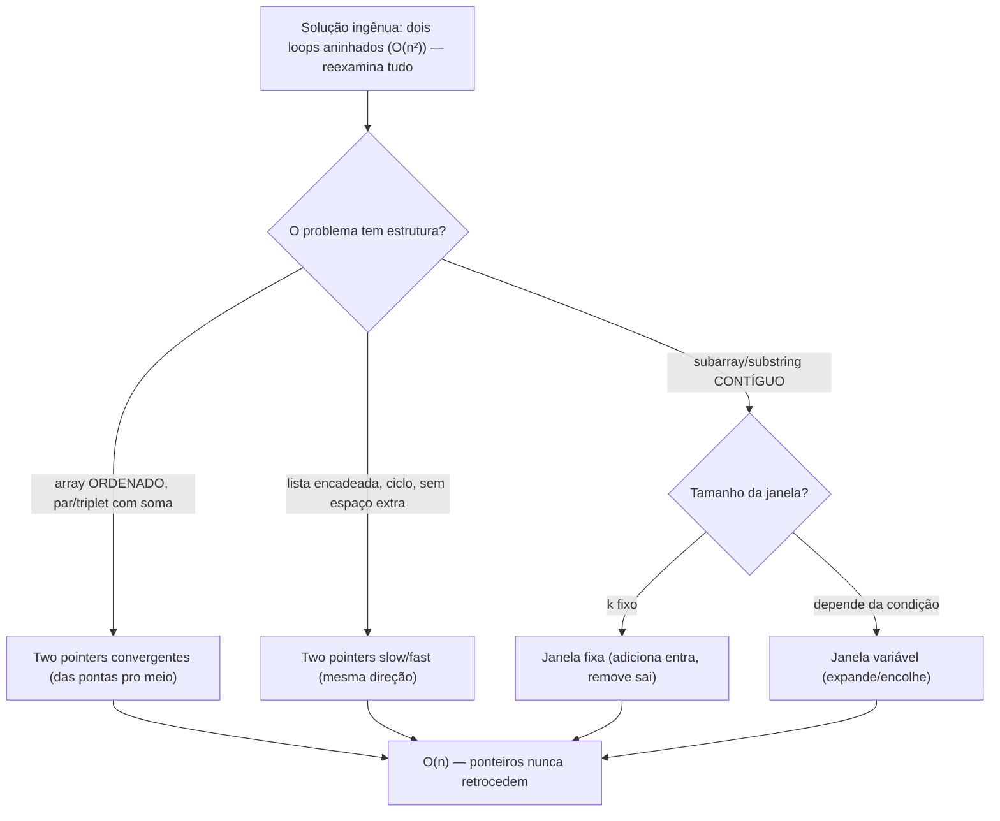
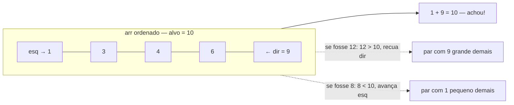
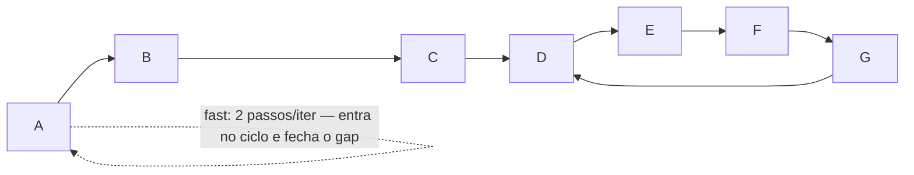
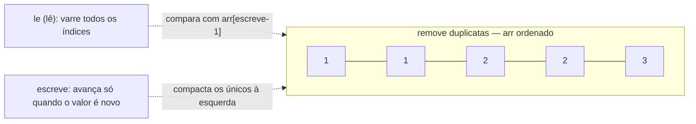
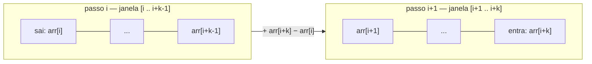
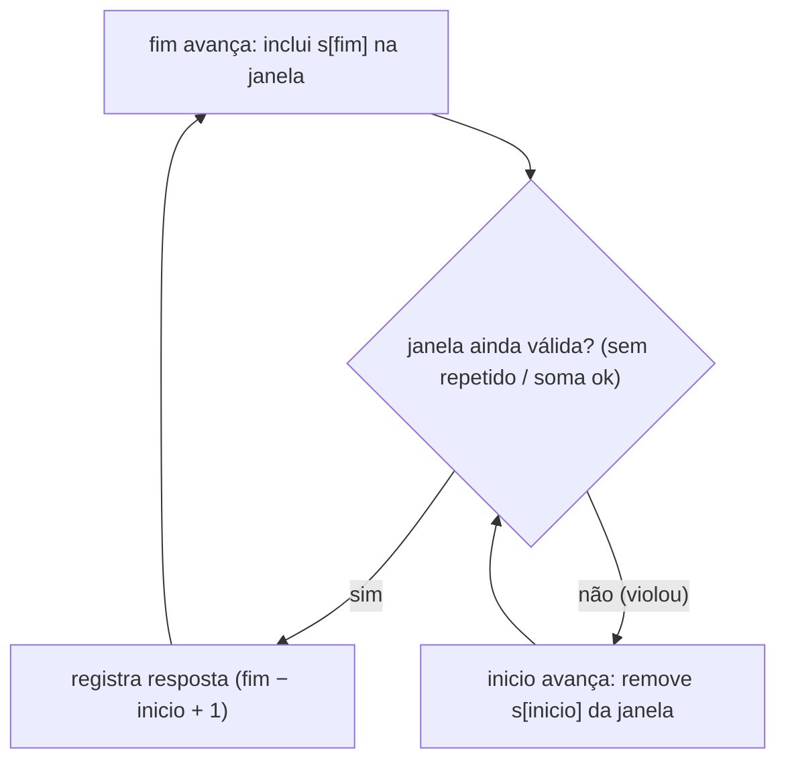

# Two pointers e sliding window

> [!abstract] TL;DR
> Os dois padrões nascem do mesmo insight: um algoritmo ingênuo de força bruta varre o array com **dois loops aninhados** — para cada elemento, reexamina todos os outros — e paga O(n²). Mas se o problema tem **estrutura** (ordem, contiguidade, monotonicidade), você não precisa reexaminar nada: basta dois índices que **avançam e nunca retrocedem**, cada elemento visitado um número constante de vezes → **O(n)**. **Two pointers** tem dois sabores: ponteiros **convergentes** (das pontas pro meio, em array ordenado: two-sum, container with most water, 3-sum) e **slow/fast** (mesma direção, velocidades diferentes: detecção de ciclo de Floyd, achar o meio, remoção in-place). **Sliding window** tem dois sabores: janela de tamanho **fixo** k (adiciona o que entra, remove o que sai — não recalcula) e janela de tamanho **variável** ("expande até violar, encolhe até valer", frequentemente com um HashMap pra lembrar o que está na janela). O ganho de senioridade é o **reconhecimento**: ler "par com soma X em array ordenado" e já enxergar two pointers; ler "subarray/substring contíguo com propriedade P" e já enxergar sliding window.

Imagine que você precisa achar dois números num array ordenado que somam exatamente 10. O jeito ingênuo: para cada número, percorra todos os outros procurando o par. São dois loops aninhados, n × n comparações, O(n²). Agora pense no array como uma régua com um dedo em cada ponta. O dedo esquerdo aponta pro menor número, o direito pro maior. Some os dois: deu **mais** que 10? O par com o maior número é grande demais — recue o dedo direito pro próximo número menor. Deu **menos** que 10? Avance o dedo esquerdo pro próximo número maior. Cada movimento te aproxima da resposta, e os dedos só caminham **um em direção ao outro, nunca para trás**. Em no máximo n passos você ou achou o par, ou os dedos se cruzaram (não existe). De O(n²) para O(n) — só porque o array estava **ordenado** e você usou essa ordem.

Esse é o coração de **two pointers**: a ordenação faz com que mover um ponteiro tenha um efeito **previsível e monotônico** sobre o que você está medindo. Você nunca precisa "voltar e reconsiderar". A mesma economia aparece, com outra roupagem, em **sliding window**: quando o problema é sobre um **trecho contíguo** do array, você não recalcula a propriedade do zero a cada posição — você mantém uma janela e só ajusta as bordas, herdando quase todo o trabalho do passo anterior.

Esta nota trata desses dois padrões juntos porque eles são, no fundo, a mesma ideia (ponteiros monotônicos que exploram estrutura) e porque, em entrevista, eles aparecem como **uma família de problemas que você precisa reconhecer no enunciado**. Depois de [[08 - Busca]] — que também descarta trabalho usando estrutura (ordem) — eles são o próximo degrau antes de [[10 - Programação dinâmica]], que ataca problemas onde *não* basta um passe linear ganancioso.

> [!info] Lastro
> - **CLRS** — *Introduction to Algorithms*, 4ª ed. (Cormen, Leiserson, Rivest, Stein). Problema 21-2 / seções de listas encadeadas e ponteiros: **detecção de ciclo de Floyd** ("tortoise and hare") como exercício clássico, com a prova de por que os ponteiros se encontram e de como localizar o início do ciclo.
> - **Sedgewick & Wayne** — *Algorithms*, 4ª ed. A técnica de dois índices que se aproximam aparece no cerne da **partição do Quicksort** (cap. 2.3) — o mesmo gesto de "dois ponteiros varrendo das pontas" reaproveitado em busca e em manipulação in-place de arrays.
> - **Robert Floyd** — algoritmo de detecção de ciclo, popularizado por **Knuth** em *The Art of Computer Programming*, vol. 2 (atribuído a Floyd como "tortoise and hare").
> - **NeetCode** ([neetcode.io/roadmap](https://neetcode.io/roadmap)) e **LeetCode** (tags "Two Pointers" e "Sliding Window") — a **categorização por padrões** de problemas de entrevista que torna "two pointers" e "sliding window" nomes de família reconhecíveis. São recursos de prática/taxonomia, não livros canônicos, mas é onde esse vocabulário de padrões foi consolidado para entrevistas.

---

## 1. A ideia comum: trocar O(n²) por O(n) explorando estrutura

Quase todo problema que se resolve com esses padrões tem uma **solução ingênua de força bruta** que é óbvia e errada-na-prática:

```python
# Força bruta: para cada par (i, j), testa. O(n²).
def tem_par_com_soma(arr, alvo):
    n = len(arr)
    for i in range(n):
        for j in range(i + 1, n):
            if arr[i] + arr[j] == alvo:
                return True
    return False
```

Dois loops aninhados, cada elemento comparado com todos os outros: O(n²). Funciona, e para n=20 ninguém reclama. Para n=200.000 (tamanho típico de uma entrada "grande" em entrevista), são 40 bilhões de operações — segundos a minutos, *time limit exceeded*.

A pergunta que destrava o O(n) é sempre a mesma: **o que no problema me deixa pular trabalho?** Três estruturas costumam estar lá:

- **Ordem.** Se o array está ordenado, comparar com o vizinho me diz algo sobre todos os outros vizinhos da mesma direção. É o que torna os ponteiros monotônicos.
- **Contiguidade.** Se a resposta é um *trecho contíguo* (subarray/substring), o trecho que começa em `i+1` tem quase tudo em comum com o trecho que começava em `i` — só perdi um elemento na frente e ganhei um atrás. Não preciso recalcular do zero.
- **Monotonicidade.** Se "ampliar a janela só pode piorar a condição" (ou só melhorar), então quando ela viola eu *sei* que encolher é a única saída — não preciso testar todas as combinações.

A consequência operacional é sempre a mesma frase: **ponteiros que avançam e nunca retrocedem**. Como cada ponteiro percorre o array no máximo uma vez (ou um número constante de vezes), o custo total é a soma dos movimentos = O(n). Isso é uma **análise amortizada** disfarçada: dentro de um único passo o ponteiro interno pode dar vários passos, mas somando tudo ao longo do algoritmo cada elemento entra e sai da janela no máximo uma vez. (Veja [[03 - Análise amortizada]] para o método do agregado por trás dessa contagem.)



Leitura do diagrama: este é o mapa mental da nota inteira. Toda a família parte da mesma origem — uma força bruta O(n²) que reexamina tudo — e se ramifica conforme a estrutura disponível. Os quatro galhos (convergente, slow/fast, janela fixa, janela variável) convergem para o mesmo destino: O(n), porque os ponteiros se movem em uma direção e somam no máximo n passos. Decorar os quatro galhos é menos importante do que internalizar a pergunta do losango: *o que me deixa pular trabalho?*

---

## 2. Two pointers convergentes: das pontas para o meio

O caso de manual é o **two-sum em array ordenado**: dado `arr` ordenado e um `alvo`, ache dois índices cujos valores somam `alvo`.

```python
def two_sum_ordenado(arr, alvo):
    esq, dir = 0, len(arr) - 1
    while esq < dir:
        soma = arr[esq] + arr[dir]
        if soma == alvo:
            return (esq, dir)
        elif soma < alvo:
            esq += 1          # preciso de MAIS: avança o menor
        else:                 # soma > alvo
            dir -= 1          # preciso de MENOS: recua o maior
    return None
```

```java
int[] twoSumOrdenado(int[] arr, int alvo) {
    int esq = 0, dir = arr.length - 1;
    while (esq < dir) {
        int soma = arr[esq] + arr[dir];
        if (soma == alvo)      return new int[]{esq, dir};
        else if (soma < alvo)  esq++;   // preciso de mais
        else                   dir--;   // preciso de menos
    }
    return new int[]{-1, -1};
}
```

**Por que isso é correto** — e não só "esperto"? A garantia vem inteiramente da **ordenação**. Pense no instante em que `arr[esq] + arr[dir] < alvo`. O valor `arr[dir]` é o maior elemento ainda em jogo na ponta direita. Se eu emparelhasse `esq` com **qualquer** outro índice ainda disponível (todos ≤ `dir`), a soma seria **ainda menor** — todos esses pares são pequenos demais. Logo `esq` está descartado *com qualquer parceiro possível*: posso eliminá-lo de vez avançando `esq`. Simetricamente, quando a soma é grande demais, `arr[dir]` é grande demais com qualquer parceiro disponível, e recuo `dir`. Cada passo elimina permanentemente um candidato sem nunca arriscar perder a resposta. É a mesma lógica de eliminação da busca binária ([[08 - Busca]]), só que de duas pontas.

Sem ordenação isso desmorona: um `arr[esq]` "pequeno demais" com o atual `dir` poderia formar o par certo com algum elemento no meio que você ainda não viu. A ordem é o que torna o movimento **monotônico** e, portanto, seguro.



Leitura do diagrama: os dois ponteiros começam nas pontas de um array ordenado e caminham um em direção ao outro. A decisão é local e binária — soma maior que o alvo recua a direita, soma menor avança a esquerda — mas cada decisão é *globalmente segura* por causa da ordem. Eles se cruzam em O(n) passos no pior caso.

### Variações do mesmo gesto

**Container with most water.** Dado um array de alturas, escolha duas barras que, com o eixo x, formem o recipiente que segura mais água. A área é `min(altura[esq], altura[dir]) × (dir − esq)`. Comece nas pontas (maior largura possível) e, a cada passo, **mova o ponteiro da barra mais baixa** — porque ela é o gargalo: manter a barra baixa e aproximar a outra só reduz a largura sem poder aumentar a altura efetiva. Mover a mais alta jamais melhora. Aqui não há "soma ordenada", mas há **monotonicidade da decisão**: sempre existe um lado cujo movimento é provadamente inútil, então o outro é seguro.

```python
def max_area(altura):
    esq, dir = 0, len(altura) - 1
    melhor = 0
    while esq < dir:
        area = min(altura[esq], altura[dir]) * (dir - esq)
        melhor = max(melhor, area)
        if altura[esq] < altura[dir]:
            esq += 1          # move o gargalo
        else:
            dir -= 1
    return melhor
```

**3-sum.** Ache todos os triplos que somam zero. A receita: **ordene**, depois **fixe** um elemento `i` e rode **two pointers convergentes** no resto do array procurando o par que soma `−arr[i]`. O loop externo é O(n), o two-pointers interno é O(n), total **O(n²)** — bem melhor que os três loops aninhados O(n³) da força bruta. O detalhe chato de 3-sum é **pular duplicatas** para não repetir triplos; é justamente onde a maioria erra em entrevista. O 3-sum mostra o padrão composto: *two pointers como sub-rotina dentro de um loop*.

> [!tip] O reflexo "ordene primeiro"
> Container with most water não precisa de ordenação; two-sum e 3-sum precisam. A pergunta que distingue: o problema fala de **soma/diferença de valores**? Então ordenar costuma destravar o movimento monotônico. O problema fala de **largura/posição** (índices)? Então a monotonicidade pode já estar na geometria, sem ordenar. Ordenar custa O(n log n) — em 3-sum isso é grátis porque o algoritmo já é O(n²); em problemas que seriam O(n), ordenar pode dominar e às vezes um HashMap O(n) é melhor (é por isso que **two-sum no array NÃO ordenado** se resolve com HashMap, não com two pointers).

---

## 3. Two pointers slow/fast: mesma direção, velocidades diferentes

O segundo sabor de two pointers não coloca os ponteiros nas pontas — coloca os dois no **mesmo começo**, andando na **mesma direção**, mas com **velocidades diferentes**. A diferença de velocidade é a ferramenta.

### 3.1 Detecção de ciclo: a tartaruga e a lebre (Floyd)

Problema: uma lista encadeada pode ter um **ciclo** (um nó cujo `next` aponta de volta pra um nó anterior). Como detectar, **sem espaço extra**? (Veja [[03-Dominios/Fundamentos/Estruturas de Dados/index|Estruturas de Dados]] para a linked list.)

A solução óbvia: vá percorrendo e guarde cada nó visitado num **HashSet**; se reencontrar um nó, há ciclo. Funciona, é O(n) tempo — mas O(n) **espaço**. O algoritmo de **Floyd** faz o mesmo em **O(1) espaço**: dois ponteiros partem do head; a **tartaruga** (`slow`) anda 1 passo por iteração, a **lebre** (`fast`) anda 2. Se a lista **termina** (sem ciclo), a lebre chega ao `null` primeiro — sem ciclo. Se há **ciclo**, a lebre entra no laço, fica dando voltas, e — porque é mais rápida — eventualmente **alcança a tartaruga por trás**. Quando `slow == fast`, há ciclo.

```python
def tem_ciclo(head):
    slow = fast = head
    while fast and fast.next:
        slow = slow.next          # 1 passo
        fast = fast.next.next     # 2 passos
        if slow is fast:
            return True           # a lebre alcançou a tartaruga
    return False                  # a lebre chegou ao fim: sem ciclo
```

```java
boolean temCiclo(No head) {
    No slow = head, fast = head;
    while (fast != null && fast.next != null) {
        slow = slow.next;
        fast = fast.next.next;
        if (slow == fast) return true;
    }
    return false;
}
```

**Por que elas necessariamente se encontram?** Uma vez que ambas estão *dentro* do ciclo, pense na distância da lebre até a tartaruga, medida ao longo do ciclo, no sentido do movimento. A cada iteração a lebre anda 2 e a tartaruga 1, então essa distância **diminui em exatamente 1** por iteração. Uma quantidade inteira não-negativa que cai de 1 em 1 chega a 0 — e 0 significa "mesmo nó". Elas não podem "saltar uma por cima da outra" porque o gap fecha unitariamente. Logo o encontro é garantido em no máximo o comprimento do ciclo. (É por isso que precisa ser 1 e 2: a diferença de velocidade tem que ser tal que o gap encolha sem pular o zero.)



Leitura do diagrama: a "cauda" A→B→C leva ao ciclo D→E→F→G→D. Sem ciclo, a lebre escaparia pelo fim; com ciclo, ela fica presa no laço, e como ganha 1 de distância por iteração sobre a tartaruga, o gap entre as duas cai até zerar — elas colidem dentro do laço. Nenhum HashSet, O(1) de memória.

**Achar o início do ciclo** (o nó D acima) é o truque-bônus que entrevistadores adoram: depois que `slow` e `fast` se encontram, **deixe um ponteiro no ponto de encontro e mova o outro de volta para o head**; avance os dois **um passo de cada vez**; o nó onde eles se reencontram é o **início do ciclo**. A justificativa é aritmética modular sobre os comprimentos da cauda e do laço (a distância do head ao início do ciclo é congruente, módulo o tamanho do ciclo, à distância do ponto de encontro ao início) — vale conhecer o fato e saber que existe a prova, mesmo sem rederivá-la sob pressão.

> [!tip] O trade-off que o entrevistador quer ouvir
> HashSet: O(n) tempo, **O(n) espaço**, trivial de escrever. Floyd: O(n) tempo, **O(1) espaço**, exige a sacada. Mencionar *as duas* e o trade-off de memória é exatamente o sinal de senioridade. Se ele disser "sem espaço extra", é Floyd; se disser "código simples e legível ganha", o HashSet é uma resposta defensável.

### 3.2 Achar o meio da lista

Mesma mecânica, outro uso: a lebre anda 2, a tartaruga 1; **quando a lebre chega ao fim, a tartaruga está exatamente no meio**. Um único passe, sem contar o tamanho primeiro.

```python
def meio(head):
    slow = fast = head
    while fast and fast.next:
        slow = slow.next
        fast = fast.next.next
    return slow   # nó do meio (o segundo dos dois, em lista de tamanho par)
```

### 3.3 Slow/fast em arrays: o ponteiro que escreve e o que lê

Em arrays, slow/fast vira o idioma de **modificação in-place**: um ponteiro **lê** (varre tudo, rápido) e o outro **escreve** (só avança quando há algo a manter, lento). O `slow` marca *onde o próximo elemento bom vai*; o `fast` *procura* o próximo elemento bom.

**Mover zeros para o fim**, preservando a ordem dos não-zeros:

```python
def mover_zeros(arr):
    escreve = 0
    for le in range(len(arr)):
        if arr[le] != 0:
            arr[escreve], arr[le] = arr[le], arr[escreve]
            escreve += 1
    return arr
```

**Remover duplicatas de array ordenado in-place** (retorna o novo comprimento):

```python
def remove_duplicatas(arr):
    if not arr:
        return 0
    escreve = 1                       # primeiro elemento sempre fica
    for le in range(1, len(arr)):
        if arr[le] != arr[escreve - 1]:
            arr[escreve] = arr[le]
            escreve += 1
    return escreve                    # arr[:escreve] são os únicos
```



Leitura do diagrama: dois ponteiros na mesma direção com papéis distintos. O `le` (leitor) percorre tudo; o `escreve` só anda quando encontra um valor que merece ficar, compactando os elementos válidos no início do array. É a versão "produtor/consumidor in-place" do par slow/fast — O(n) tempo, O(1) espaço extra.

---

## 4. Sliding window de tamanho fixo

Agora muda a família: a janela. O cenário é **subarray/substring contíguo**. Comece pelo caso fixo: dado k, encontre a **soma máxima de um subarray de tamanho exatamente k**.

A força bruta calcula a soma de cada uma das ~n janelas, cada soma custando O(k): O(n·k). Mas janelas vizinhas se **sobrepõem quase inteiramente** — a janela `[i+1 .. i+k]` é a janela `[i .. i+k−1]` menos `arr[i]` e mais `arr[i+k]`. Então não recalcule: **some o que entra, subtraia o que sai**. Cada passo é O(1), total **O(n)**.

```python
def soma_max_k(arr, k):
    soma = sum(arr[:k])               # primeira janela: O(k), uma vez só
    melhor = soma
    for fim in range(k, len(arr)):
        soma += arr[fim] - arr[fim - k]   # entra arr[fim], sai arr[fim-k]
        melhor = max(melhor, soma)
    return melhor
```

```java
int somaMaxK(int[] arr, int k) {
    int soma = 0;
    for (int i = 0; i < k; i++) soma += arr[i];   // primeira janela
    int melhor = soma;
    for (int fim = k; fim < arr.length; fim++) {
        soma += arr[fim] - arr[fim - k];          // entra um, sai um
        melhor = Math.max(melhor, soma);
    }
    return melhor;
}
```



Leitura do diagrama: a janela de tamanho k desliza uma posição. Em vez de re-somar os k elementos, você faz **uma soma e uma subtração**: ganha o elemento que entrou pela direita, perde o que saiu pela esquerda. Todo o resto da janela é herdado de graça do passo anterior — esse reaproveitamento é o que derruba O(n·k) para O(n). A mesma ideia generaliza para média móvel, contagem de vogais numa janela, etc.: mantenha um **agregado** e atualize-o nas bordas.

---

## 5. Sliding window de tamanho variável

O caso mais rico e mais cobrado: a janela **não tem tamanho fixo** — ela **cresce** (avança o `fim`) e **encolhe** (avança o `inicio`) conforme uma condição. O template universal é: **"expanda até violar; encolha até voltar a valer"**.

```python
def template_janela_variavel(arr):
    inicio = 0
    estado = ...                       # ex.: soma corrente, contagem, HashMap
    melhor = ...
    for fim in range(len(arr)):
        # 1. inclui arr[fim] na janela (atualiza estado)
        estado += arr[fim]
        # 2. enquanto a janela viola a condição, encolha pela esquerda
        while janela_invalida(estado):
            estado -= arr[inicio]
            inicio += 1
        # 3. com a janela válida, registre a resposta
        melhor = atualiza(melhor, fim - inicio + 1)
    return melhor
```

A análise é a parte sutil: o loop interno (`while`) parece deixar tudo O(n²), mas **não deixa**. O `inicio` só anda pra frente, nunca volta — ao longo de todo o algoritmo ele avança no máximo n vezes *no total*, somando todos os passos de todos os `while`. É o mesmo argumento amortizado da Seção 1: cada elemento **entra na janela uma vez** (quando `fim` passa por ele) e **sai no máximo uma vez** (quando `inicio` passa por ele). Total de movimentos = O(n).

### 5.1 Menor subarray com soma ≥ target

Janela cresce enquanto a soma é insuficiente; assim que `soma ≥ target`, tenta **encolher** pela esquerda para minimizar o comprimento, enquanto ainda satisfaz.

```python
def menor_subarray(arr, target):
    inicio = 0
    soma = 0
    melhor = float("inf")
    for fim in range(len(arr)):
        soma += arr[fim]               # expande
        while soma >= target:          # válida: tenta encolher
            melhor = min(melhor, fim - inicio + 1)
            soma -= arr[inicio]
            inicio += 1
    return melhor if melhor != float("inf") else 0
```

Note a inversão de lógica em relação ao template "viola → encolhe": aqui a janela válida é a que tem soma **suficiente**, então encolhemos *enquanto ainda válida* para achar o **mínimo**. O esqueleto é o mesmo (duas bordas, `inicio` monotônico); o que muda é *quando* encolher e *quando* registrar — sempre ditado pela palavra "menor" vs. "maior" no enunciado.

### 5.2 Maior substring sem caracteres repetidos

Aqui a janela combina com um **HashSet/HashMap** para lembrar o que está dentro. Expande incluindo `s[fim]`; se isso criou um **repetido**, encolhe pela esquerda removendo caracteres até o repetido sair.

```python
def maior_sem_repetidos(s):
    na_janela = set()
    inicio = 0
    melhor = 0
    for fim in range(len(s)):
        while s[fim] in na_janela:     # viola: tem repetido
            na_janela.remove(s[inicio])
            inicio += 1
        na_janela.add(s[fim])
        melhor = max(melhor, fim - inicio + 1)
    return melhor
```

```java
int maiorSemRepetidos(String s) {
    Set<Character> naJanela = new HashSet<>();
    int inicio = 0, melhor = 0;
    for (int fim = 0; fim < s.length(); fim++) {
        while (naJanela.contains(s.charAt(fim))) {
            naJanela.remove(s.charAt(inicio));
            inicio++;
        }
        naJanela.add(s.charAt(fim));
        melhor = Math.max(melhor, fim - inicio + 1);
    }
    return melhor;
}
```

O HashSet é o que dá à janela uma **memória O(1) de pertencimento**: "esse caractere já está aqui?" é a pergunta que decide se a janela é válida, e respondê-la em tempo constante mantém o algoritmo O(n). Esse é o casamento clássico — *sliding window + tabela hash* — e a conexão direta com [[03-Dominios/Fundamentos/Estruturas de Dados/index|Estruturas de Dados]] (HashSet/HashMap).



Leitura do diagrama: o motor da janela variável é este ciclo de dois movimentos. O `fim` sempre puxa a janela para a direita (cresce); quando a inclusão quebra a invariante, o `inicio` a empurra pela esquerda (encolhe) até voltar a valer. Como nenhum dos dois ponteiros retrocede, o array é varrido em O(n) apesar do loop aninhado aparente.

### 5.3 Minimum window substring

O boss da categoria: dada `s` e um conjunto de caracteres `t`, ache a **menor substring de `s` que contém todos os caracteres de `t`** (com multiplicidade). É janela variável + **dois HashMaps de contagem** (quantos de cada caractere `t` exige × quantos a janela tem) + um contador de "quantos requisitos já satisfeitos". Expande até a janela conter tudo; então encolhe agressivamente pela esquerda enquanto continuar contendo tudo, registrando o mínimo. Vale conhecê-lo como o exemplo de que o *mesmo template* (Seção 5) escala para condições de validade arbitrariamente ricas — o que muda é só a definição de "janela válida" e o estado que você mantém para checá-la em O(1).

---

## 6. Sinais de reconhecimento

Em entrevista, metade da batalha é **mapear o enunciado para o padrão** nos primeiros 30 segundos. Esta tabela é o gatilho — e é exatamente o tipo de reconhecimento que [[14 - Reconhecendo o algoritmo certo]] vai consolidar para todos os algoritmos do galho.

| O enunciado diz... | Padrão | Pista decisiva |
|---|---|---|
| "par / triplet com soma X" em **array ordenado** | **Two pointers convergentes** | ordenado + soma → pontas pro meio |
| "container", "trapping water", "duas linhas/colunas" | **Two pointers convergentes** | otimizar sobre largura entre extremos |
| "ciclo em linked list", "encontre onde repete", **"sem espaço extra"** | **Slow/fast (Floyd)** | lista encadeada + O(1) espaço |
| "meio da lista", "n-ésimo do fim" | **Slow/fast** | velocidades diferentes / defasagem fixa |
| "remova duplicatas in-place", "mova zeros", "compacte" | **Slow/fast (escreve/lê)** | modificação in-place de array |
| "k elementos **consecutivos**", "subarray de tamanho k" | **Sliding window FIXA** | k é dado explicitamente |
| "subarray/substring contíguo com propriedade P" | **Sliding window** | a palavra "contíguo" / "consecutivo" |
| **"menor / maior** janela que satisfaz", "no máximo k distintos" | **Sliding window VARIÁVEL** | otimizar comprimento sob condição |
| "sem repetidos", "que contém todos de t" | **Janela variável + HashMap/HashSet** | precisa lembrar o conteúdo da janela |

> [!warning] As armadilhas de reconhecimento
> - **Two pointers exige ordem** (no sabor convergente). Se o array não está ordenado e o problema é soma, pense **HashMap** antes de ordenar — ordenar custa O(n log n) e pode ser desperdício se o HashMap resolve em O(n).
> - **Sliding window quer contiguidade.** Se a "subsequência" pode pular elementos (não-contígua), sliding window **não serve** — isso costuma ser programação dinâmica ([[10 - Programação dinâmica]]).
> - **Janela variável com números negativos** quebra a monotonicidade de "soma só cresce ao expandir". Para "soma ≥ target" com negativos, sliding window simples falha; é prefix-sum + estrutura auxiliar. Pergunte sobre o domínio dos valores.

---

## 7. Por que esses padrões merecem uma nota inteira

Two pointers e sliding window não são "truques" — são a expressão concreta de um princípio que atravessa todo o galho [[03-Dominios/Fundamentos/Algoritmos/index|Algoritmos]]: **quando o problema tem estrutura, não reexamine; aproveite o trabalho já feito**. A busca binária ([[08 - Busca]]) descarta metade do espaço usando ordem; estes padrões descartam reexames usando ordem e contiguidade; a programação dinâmica ([[10 - Programação dinâmica]]) memoriza subproblemas para não recalcular. São três faces do mesmo verbo — *não repita trabalho desnecessário* — e dominar two pointers e sliding window é o degrau em que esse verbo deixa de ser teoria e vira reflexo de quem lê um enunciado e já sabe por onde atacar.

---

## Em entrevista

Esses são, ao lado de hash maps, **os padrões mais cobrados** em entrevistas de algoritmos. O entrevistador raramente diz "use two pointers" — ele descreve o problema e **espera que você reconheça o padrão**. Verbalizar esse reconhecimento em voz alta ("this is contiguous, so I'm thinking sliding window") é metade da nota.

**Frases para sinalizar o reconhecimento e o trade-off:**

- "The brute force here is two nested loops, **O(n squared)** — for each element we re-scan the rest."
- "But the array is **sorted**, so I can use **two pointers** converging from both ends and bring it down to **O(n)**."
- "Since we're looking at a **contiguous** subarray, this is a **sliding window** problem."
- "It's a **fixed-size window** of size k, so instead of recomputing each window I'll **add the incoming element and subtract the outgoing one** — O(1) per step."
- "This is a **variable-size window**: I **expand** the right end until the condition breaks, then **shrink** from the left until it holds again."
- "Each pointer only moves forward, so even with the nested `while` loop the total work is **O(n)** — it's amortized."
- "For cycle detection I'd use **Floyd's tortoise and hare** — two pointers, slow moves one step, fast moves two. It's **O(1) space** versus a HashSet which is O(n) space."
- "To find the **start of the cycle**, after they meet I reset one pointer to the head and advance both one step at a time."
- "I'll keep a **HashSet** of what's currently in the window so the membership check is **O(1)**."

**Perguntas que valem fazer ao entrevistador:**

- "Is the array **sorted**? Can I sort it, or does the original order matter?" (decide two pointers vs. HashMap)
- "Can the values be **negative**?" (quebra a janela variável baseada em soma)
- "Is the subarray **contiguous**, or can it skip elements?" (sliding window vs. DP)
- "Any constraint on **extra space**?" (decide Floyd vs. HashSet)

**Vocabulário PT → EN:**

| Português | Inglês |
|---|---|
| dois ponteiros | two pointers |
| ponteiros convergentes | converging / opposite-direction pointers |
| ponteiro lento / rápido | slow / fast pointer |
| tartaruga e lebre | tortoise and hare |
| detecção de ciclo | cycle detection |
| janela deslizante | sliding window |
| janela de tamanho fixo / variável | fixed-size / variable-size window |
| expandir / encolher a janela | expand / shrink the window |
| subarray / substring contíguo | contiguous subarray / substring |
| in-place (sem array auxiliar) | in-place |
| espaço extra constante | constant extra space / O(1) space |
| ponteiro que escreve / lê | write / read pointer |
| força bruta | brute force |
| amortizado | amortized |
| par / triplo (que soma) | pair / triplet (summing to) |
| pular duplicatas | skip duplicates |
| invariante da janela | window invariant |

> [!example] Roteiro de 30 segundos para classificar o problema
> 1. **A resposta é um trecho contíguo** (subarray/substring)? → família **sliding window**. Tamanho dado (k)? Fixa. "Menor/maior que satisfaz"? Variável.
> 2. **É sobre pares/triplos com soma** e o array está (ou pode ser) ordenado? → **two pointers convergentes**.
> 3. **É linked list** com ciclo / meio / sem espaço extra? → **slow/fast**.
> 4. Nenhum acima, mas "subsequência" pode pular elementos? → provavelmente **DP** ([[10 - Programação dinâmica]]), não estes padrões.

---

## Navegação

- Anterior: [[08 - Busca]]
- Próxima: [[10 - Programação dinâmica]]
- Estruturas de apoio (linked list, HashSet/HashMap): [[03-Dominios/Fundamentos/Estruturas de Dados/index|Estruturas de Dados]]
- Capstone de reconhecimento: [[14 - Reconhecendo o algoritmo certo]]
- MOC do galho: [[03-Dominios/Fundamentos/Algoritmos/index|Algoritmos]]
