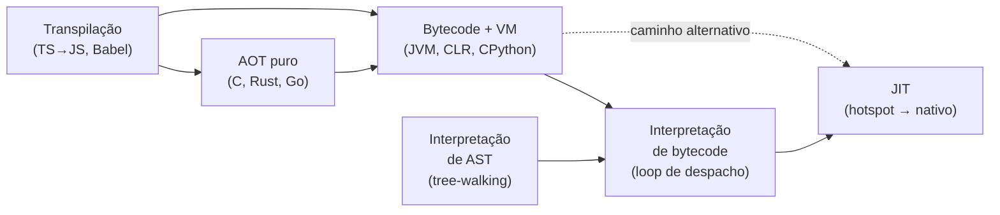
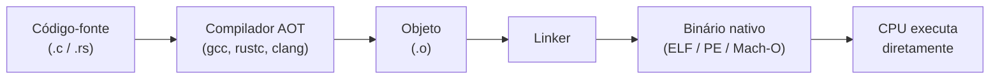
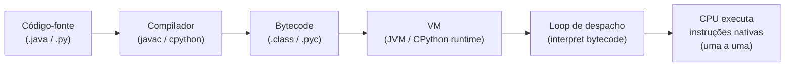
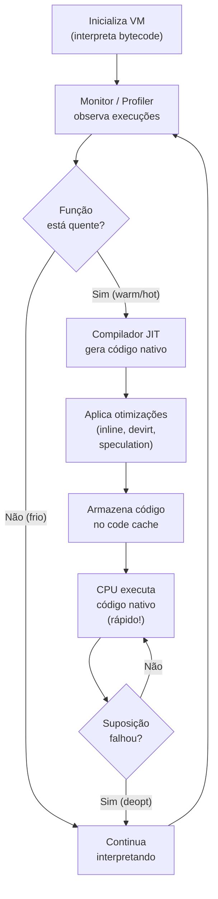
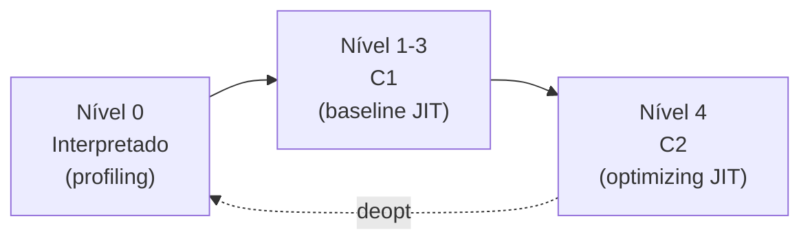
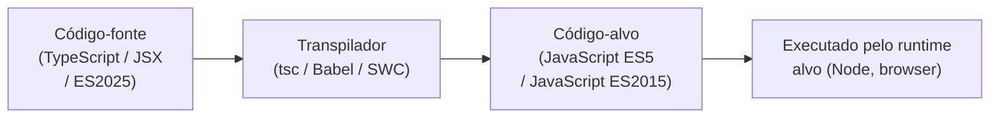
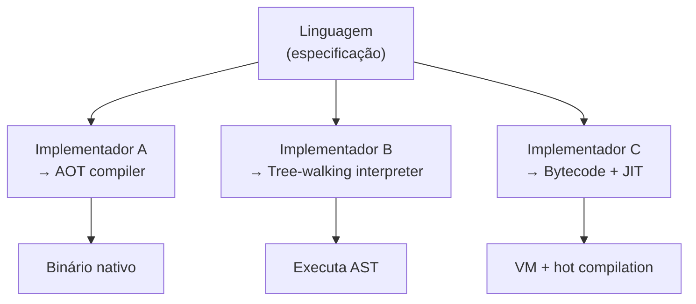
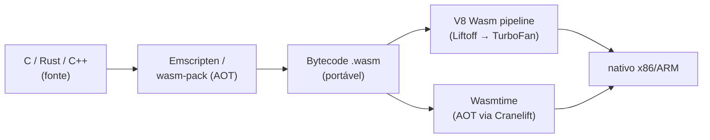

# Compilação, interpretação e JIT

> [!abstract] TL;DR
> "Linguagem compilada" × "linguagem interpretada" é uma falsa dicotomia: é o *implementador*, não a linguagem, que escolhe a estratégia. O espectro vai de AOT puro (C, Rust → binário nativo) até interpretação direta de AST, passando por bytecode+VM e JIT. JIT pode bater AOT porque otimiza com dados reais de execução — algo que nenhum compilador estático consegue fazer. Cada estratégia tem trade-offs distintos em velocidade de execução, tempo de startup, portabilidade, uso de memória e complexidade de implementação — não existe bala de prata.

---

## O espectro que ninguém te contou

Pergunte a qualquer pessoa: "Java é compilado ou interpretado?" A resposta mais comum é "interpretado". Mas Java é compilado para bytecode (.class), e esse bytecode é executado pela JVM — que por sua vez usa um JIT para compilar os trechos quentes para código nativo. É compilado? É interpretado? É os dois?

A verdade é que essa pergunta está mal formulada. Não existe um interruptor de dois estados. Existe um espectro contínuo de estratégias de execução, e implementações reais combinam várias delas ao mesmo tempo.

Pense numa fábrica de carros. Você pode construir o carro *inteiro* antes de entregar ao cliente (AOT), pode deixar o mecânico montar peça por peça na hora que o cliente pede (interpretação), ou pode pré-fabricar as peças mais pedidas enquanto o cliente espera e deixar as raras para montar sob demanda (JIT). Nenhuma fábrica real usa só uma estratégia — e nem os runtimes modernos.



> [!info] Leitura do diagrama
> Cada nó é uma estratégia — não um destino único. Uma linguagem pode percorrer múltiplos caminhos: CPython compila para bytecode (.pyc) e depois interpreta esse bytecode num loop; V8 interpreta com Ignition, depois JITa com Maglev/TurboFan. As setas mostram o fluxo de transformação, não exclusividade.

---

## AOT — compilar tudo antes de rodar

AOT significa *ahead-of-time*: o compilador transforma o código-fonte em código nativo *antes* do programa ser executado. Quando você roda `rustc main.rs`, obtém um binário ELF (no Linux) que o sistema operacional pode carregar diretamente. Não há intermediário.



> [!info] Leitura do diagrama
> Todo o trabalho pesado (parsing, otimizações, geração de código) acontece em tempo de build. Em tempo de execução, o SO carrega o binário e a CPU o executa sem nenhuma camada intermediária — daí a velocidade.

**Vantagens de AOT:**
- Execução com latência mínima e previsível (sem warmup).
- O compilador tem tempo ilimitado para otimizações agressivas (inlining, auto-vetorização, loop unrolling).
- Sem overhead de memória para uma VM.

**Desvantagens de AOT:**
- O binário é específico para arquitetura+SO. Um `.exe` Windows não roda em Linux sem recompilação.
- O compilador não sabe, em tempo de build, quais caminhos serão quentes em produção. Suas otimizações são estáticas.
- Tempo de build pode ser alto (projetos grandes em C++ ou Rust com LTO).

> [!example] C e Rust na prática
> `gcc -O2 hello.c -o hello` → binário x86-64. Rode em ARM e não funciona. Mas dentro dessa arquitetura, é o código mais rápido possível — a CPU executa instruções de máquina diretamente, sem nenhuma tradução.

**Um detalhe que muita gente esquece: AOT não significa "sem otimização de perfil".**

Compiladores modernos oferecem *Profile-Guided Optimization* (PGO): você compila uma versão de instrumentação, roda em um workload representativo, coleta o perfil, e recompila com esse perfil para guiar otimizações. É o melhor que AOT pode fazer para simular o que JIT faz dinamicamente. Mas tem um custo: o perfil de treinamento pode não representar o workload de produção real — e o binário não se adapta se o padrão de uso mudar.

> [!tip] LTO + PGO no mundo real
> Projetos como o Chrome e o Firefox usam LTO (Link Time Optimization) combinado com PGO para compilar o binário de distribuição. O processo leva horas, mas produz binários significativamente mais rápidos que uma compilação simples com `-O2`.

---

## Interpretação direta da AST — tree-walking

A forma mais simples de "executar" código é percorrer a Árvore Sintática Abstrata (AST) nó por nó, avaliando cada nó recursivamente. É o que Robert Nystrom chama de *tree-walk interpreter* em *Crafting Interpreters*: a primeira versão de Lox (jlox, em Java) faz exatamente isso.

Imagine a expressão `2 + 3 * 4`. O parser produz uma AST com um nó `+` na raiz, filho esquerdo `2`, filho direito um nó `*` com filhos `3` e `4`. O interpretador visita o nó raiz, percebe que é uma soma, avalia recursivamente cada filho, obtém `2` e `12`, e retorna `14`.

**Vantagem:** extremamente simples de implementar. É a abordagem natural ao escrever o primeiro interpretador.

**Desvantagem:** lento. Cada operação exige percorrer ponteiros em memória (a árvore), executar dispatch de tipo em cada nó, e chamar funções recursivas. O overhead por instrução é alto.

Para entender o overhead concreto: num loop `for i in range(1_000_000)`, um tree-walker percorre o nó `for` → nó `in` → nó `range` → nó `call` → nó `body` um milhão de vezes. Cada visita envolve um cast de tipo (`isinstance(node, ForNode)?`), busca de método no objeto, e retorno recursivo. O bytecode equivalente seria simplesmente um opcode `FOR_ITER` num loop tight — ordens de magnitude menos trabalho por iteração.

> [!tip] Quando tree-walking é suficiente
> Para scripts de configuração, DSLs simples ou linguagens com poucas iterações de loop, a simplicidade vence. Ferramentas como o interpretador Ruby 1.8 (antes do YARV) e versões antigas do PHP usavam algo próximo disso. Linguagens de template (Jinja2 internamente, Liquid), filtros de consulta (linguagens de regras), e shells simples de REPL pedagógico também optam por tree-walking conscientemente.

A transição de tree-walking para bytecode+VM é tão importante que Nystrom usa ela para estruturar o livro inteiro: a primeira metade constrói um interpretador tree-walking em Java (jlox); a segunda reconstrói tudo em C com VM de bytecode (clox) — e o resultado é drasticamente mais rápido com o mesmo conjunto de funcionalidades.

---

## Bytecode e máquinas virtuais

O meio-termo clássico: compilar para uma representação intermediária portável (bytecode), depois interpretá-la (ou JITá-la) em uma Máquina Virtual (VM).



> [!info] Leitura do diagrama
> O bytecode é portável — o mesmo `.class` roda em qualquer JVM. A VM lida com a especificidade de cada plataforma. O loop de despacho lê uma instrução de bytecode por vez e executa a ação correspondente em código nativo da VM.

Por que bytecode é melhor que tree-walking para interpretação? Porque é uma sequência densa e linear de instruções de alto nível (sem ponteiros de árvore, sem dispatch por tipo de nó). O loop de despacho da VM é um simples `switch` ou tabela de jump — muito mais eficiente que recursão sobre árvore.

O loop de despacho de uma VM de bytecode é conceitualmente assim:

```
// Pseudo-código do loop de despacho
while (true) {
    opcode = *ip++;   // lê próximo byte da sequência
    switch (opcode) {
        case OP_ADD:   push(pop() + pop()); break;
        case OP_LOAD:  push(constants[*ip++]); break;
        case OP_JUMP:  ip = *ip; break;
        // ... ~100 opcodes
    }
}
```

Toda a operação cabe em poucas linhas de C. A CPU pode manter o ponteiro `ip` em registrador. O bytecode fica contíguo na memória — cache-friendly. Comparado com percorrer ponteiros de árvore espalhados no heap, a diferença é brutal.

**Exemplos reais:**
- **JVM**: `javac Hello.java` → `Hello.class` (bytecode JVM). A JVM lê e executa (com JIT).
- **CPython**: `.py` → `.pyc` (bytecode CPython). O interpretador CPython executa num loop `ceval.c`. Você pode inspecionar com `import dis; dis.dis(lambda x: x+1)`.
- **V8 (Ignition)**: JavaScript → bytecode Ignition. O Ignition o interpreta; o TurboFan o JITa.
- **CLR (.NET)**: C# → IL (Intermediate Language). A CLR JITa para nativo em tempo de execução.
- **Lua 5.x**: VM de registradores (ao invés de pilha), bytecode extremamente compacto — favorita para embedding em jogos.

> [!success] O melhor dos dois mundos *parcial*
> Bytecode dá portabilidade (como interpretação pura) e performance melhor que tree-walking. Mas ainda não chega à velocidade de código nativo AOT — daí o JIT entrar.

Uma distinção sutil: VMs de **pilha** (JVM, CPython, CLR) operam sobre uma pilha de valores; VMs de **registradores** (Lua 5, Dalvik) operam sobre registradores virtuais numerados. VMs de registradores geram bytecode maior mas executam com menos instruções — menos operações de push/pop. A JVM optou por pilha por simplicidade de portabilidade; Lua optou por registradores por velocidade de interpretação. Bytecode como IR é explorado em profundidade em [[11 - Representação intermediária e SSA]].

---

## JIT — compilar em tempo de execução

JIT (*just-in-time*) é a resposta para a pergunta: "e se eu compilasse para nativo *durante* a execução, mas só o que realmente importa?"

A intuição é simples. Na maioria dos programas, 80-90% do tempo é gasto em 10-20% do código. Esse código quente (*hot path*) é o candidato natural para compilação nativa. O restante pode ser interpretado, poupando memória e tempo de compilação.

A ideia de JIT não é nova. John McCarthy explorou compilação dinâmica em Lisp nos anos 1960. A linguagem Self (Craig Chambers, David Ungar, anos 1980-90 na Stanford) formalizou técnicas de devirtualização especulativa e compilação adaptativa que mais tarde influenciaram diretamente o HotSpot. O JIT moderno que todos conhecem — o HotSpot da JVM — foi desenvolvido por Sun Microsystems nos anos 1990, integrando as ideias do Self, e se tornou o padrão de referência que V8, SpiderMonkey, Roslyn e CLR todos seguem com variações.

A pergunta certa ao ver um JIT não é "compila ou interpreta?" mas sim "em quais condições ele compila, quais otimizações pode fazer com o perfil disponível, e o que acontece quando suas suposições falham?"



> [!info] Leitura do diagrama
> O ciclo inteiro acontece em runtime. "Quente" geralmente significa "chamada mais de N vezes" (N é configurável). Deoptimização (*deopt*) acontece quando o JIT fez uma suposição que se provou errada — ex.: assumiu que uma variável sempre é `int`, mas recebeu uma string.

### Tiered compilation — camadas de otimização

Na JVM HotSpot, o JIT tem duas camadas:

- **C1 (client compiler)**: compila rápido, otimizações básicas. Entra cedo — elimina o overhead puro de interpretação.
- **C2 (server compiler)**: compila devagar, otimizações agressivas. Entra quando o profiler tem dados suficientes. Pode fazer coisas que AOT não pode.



> [!info] Leitura do diagrama
> Os níveis 1-3 do C1 diferem na quantidade de profiling instrumentado. O C2 (nível 4) é o estado estável de alta performance. Deoptimização joga de volta para nível 0.

V8 tem pipeline análogo, mas com quatro camadas desde 2023: Ignition (interpretador de bytecode) → Sparkplug (baseline JIT, compila sem otimizações mas elimina o overhead de dispatch) → Maglev (JIT de médio nível, otimizações rápidas) → TurboFan (JIT totalmente otimizador, usa Sea of Nodes como IR). Cada camada compila mais lentamente mas produz código melhor. A maioria do código fica em Maglev; apenas os hot paths mais críticos chegam ao TurboFan.

> [!warning] O custo do warmup
> Antes de estar "quente", o código roda mais devagar que AOT puro. Em aplicações de curta duração (CLIs, lambdas serverless frios), o JIT pode nunca entrar — você paga o overhead de interpretação sem colher o benefício. Isso é o *warmup problem*.
>
> Soluções emergentes: CRaC (Coordinated Restore at Checkpoint) no OpenJDK permite tirar um snapshot do processo JVM com JIT aquecido e restaurá-lo em milissegundos. GraalVM Native Image vai na direção oposta: AOT completo com análise de acessibilidade, sacrificando JIT em troca de startup instantâneo — útil para CLIs e funções serverless.

### Por que JIT pode bater AOT?

Aqui está a revirada contraintuitiva: JIT pode gerar código **mais rápido** que AOT, porque tem informações que AOT nunca terá.

**Otimizações exclusivas de JIT:**

1. **Profile-guided optimization (PGO) dinâmica**: AOT pode fazer PGO com dados de treinamento; JIT usa os dados de produção *reais*, do workload *atual*. Se o padrão de uso mudar amanhã, o JIT se adapta — o AOT não.

2. **Devirtualização especulativa**: Em Java, quase todo método é virtualmente despachado (via vtable). Se o JIT observa que `shape.area()` é chamado 99,99% das vezes com `Circle`, ele inline a implementação de `Circle` diretamente — sem dispatch. Se um `Rectangle` aparecer, deoptimiza e recompila. Isso é algo que AOT não pode fazer sem análise de hierarquia de classe inteira, que em Java com classloading dinâmico é impossível.

3. **Escape analysis**: O JIT pode detectar que um objeto criado dentro de um método nunca "escapa" para fora dele — então aloca no stack ao invés do heap, eliminando pressão de GC. AOT com análise estática pode fazer isso em casos simples; JIT faz com dados reais.

4. **Constant folding com dados de runtime**: Se o JIT observa que uma flag de feature toggle é sempre `true` desde o boot, pode eliminar o branch inteiramente — transformando código polimórfico em código especializado.

5. **Eliminação de verificações de null e bounds**: Após observar que um array sempre tem tamanho N em determinado loop, o JIT pode eliminar as verificações de bounds em cada iteração.

> [!success] Benchmark revelador
> Benchmarks como o SPECjvm mostram a JVM em par ou à frente de C equivalente em workloads de longa duração. O custo é o warmup inicial — que pode ser mitigado com snapshot (CRaC, GraalVM checkpoint).

O aprofundamento técnico de JIT — Sea of Nodes, IR speculation, escape analysis — fica em [[17 - JIT a fundo]].

---

## Transpilação — source-to-source

Transpilação (ou *source-to-source compilation*) é compilar de uma linguagem de alto nível para *outra* linguagem de alto nível.



> [!info] Leitura do diagrama
> O transpilador não precisa entender semântica profunda — frequentemente faz mapeamento sintático. O código alvo ainda precisa ser executado por outro runtime (que pode ser interpretado, JITado, etc.).

**Exemplos históricos e atuais:**
- **cfront (1983)**: o compilador original de C++, de Bjarne Stroustrup, compilava C++ para C. A fase seguinte usava um compilador C normal. Por anos, C++ não tinha compilador próprio — era definido pelo que cfront produzia.
- **TypeScript → JavaScript**: `tsc` apaga tipos e converte sintaxe moderna para JS compatível com o alvo. O código gerado ainda precisa de um runtime JS (Node, browser).
- **Babel**: converte JavaScript moderno (ES2025) para ES5. Mesmo que já seja "JavaScript", é source-to-source. Permite usar features novas em ambientes antigos.
- **Emscripten**: C/C++ → WebAssembly (ou asm.js). O alvo é portável mas de baixo nível — tecnicamente mais próximo de compilação que transpilação pela diferença de abstração.
- **CoffeeScript → JavaScript**: linguagem criada em 2009 para tornar JS mais legível. Todo programa CoffeeScript era transpilado para JS antes de qualquer execução. Historicamente importante — inaugurou o padrão de "compile-to-JS" que TypeScript depois popularizou.

> [!tip] Transpilação vs compilação
> A distinção é fuzzy. A convenção informal é: se o alvo é de nível semelhante ao da fonte (ambas linguagens de alto nível), chama-se transpilação. Se o alvo é substancialmente mais baixo (bytecode, assembly, binário), chama-se compilação. Mas a mesma ferramenta (como `emcc`) pode estar nos dois campos dependendo do alvo escolhido. O importante é entender *o que* a ferramenta faz, não o nome que usa.

> [!example] Transpilação em cadeia
> Um projeto moderno típico: `.tsx` (TypeScript + JSX) → Babel/tsc → `.js` moderno → esbuild → `.js` bundelado → V8 interpreta → Ignition bytecode → TurboFan nativo. São cinco transformações antes da CPU ver um único bit de instrução.

---

## A tabela canônica de trade-offs

| Estratégia | Velocidade pico | Startup / warmup | Portabilidade | Uso de memória | Tempo de build | Exemplo |
|---|---|---|---|---|---|---|
| AOT puro | ★★★★★ | ★★★★★ (imediato) | ★★ (por plataforma) | ★★★★★ (sem VM) | ★★ (lento em grandes projetos) | C, Rust, Go |
| Bytecode + intérprete | ★★ | ★★★★ (rápido) | ★★★★★ (bytecode portável) | ★★★ (VM) | ★★★★★ (rápido) | CPython, JVM -Xint |
| Bytecode + JIT | ★★★★ | ★★★ (warmup inicial) | ★★★★★ | ★★ (VM + code cache) | ★★★★★ | JVM HotSpot, V8, CLR |
| Tree-walking | ★ | ★★★★★ | ★★★★★ | ★★★★ | ★★★★★ | jlox, MRI Ruby 1.8 |
| Transpilação | varia | varia | varia | varia | ★★★ (depende da chain) | TypeScript, Babel |
| AOT + PGO | ★★★★★+ | ★★★★★ | ★★ | ★★★★★ | ★ (muito lento) | Chrome, Firefox (clang PGO) |

Leitura horizontal: cada linha é uma estratégia; cada coluna é uma dimensão de trade-off. Note que "AOT + PGO" pode competir com JIT em velocidade pico — mas exige processo de build custoso e o perfil pode ficar desatualizado.

Leitura vertical: a coluna "Startup" mostra uma tensão fundamental. AOT tem startup instantâneo porque não precisa compilar nada. JIT tem warmup porque precisa observar, compilar, e substituir código quente. Bytecode + interpretador tem startup bom porque só precisa carregar a VM.

> [!warning] Trade-offs são contextuais
> "JIT é melhor que bytecode simples" é verdade para workloads longos. Para um script de 50ms de duração (um pre-commit hook em Python, por exemplo), o JIT nunca aquece e você paga custo de VM sem colher benefício. É por isso que CLIs frequentemente preferem Go (AOT, startup ~10ms) a Java (JVM, startup ~200ms sem otimização).

> [!example] Escolhendo a estratégia certa
> - **Servidor de alta throughput, longa duração**: JIT ganha (JVM, Node.js). O warmup é pago uma vez; o pico de performance compensa.
> - **CLI ou ferramenta de build**: AOT ganha (Go, Rust). Startup é crítico.
> - **Script de automação ou glue code**: bytecode+interpretador é suficiente (Python, Ruby). Simplicidade importa mais que performance.
> - **Linguagem embutida num jogo**: bytecode com VM customizada ganha (Lua). Footprint pequeno e controle total.
> - **Linguagem de configuração**: tree-walking pode ser adequado (Jsonnet, algumas DSLs de CI). Executa poucas vezes, simplicidade do interpretador importa.

---

## A falsa dicotomia

Aqui está a tese central desta nota: **"linguagem compilada × linguagem interpretada" é uma categoria do implementador, não da linguagem**.

A prova vem dos contra-exemplos — cada um deles subverte a intuição popular:

**C tem interpretadores.** Cling é um interpretador C++ baseado em LLVM JIT, usado pelo CERN no ROOT (framework de análise de física de partículas). Você digita C++ num REPL e executa linha a linha. TCC (Tiny C Compiler) compila C para nativo tão rapidamente que é usado como interpretador de scripts `#!/usr/bin/tcc -run`. C, compilado?

**Python tem compiladores AOT.** Nuitka compila Python para C e depois para binário nativo — sem runtime Python. Cython permite anotar tipos e gerar extensões C com performance comparável a C puro. mypyc (usado internamente no próprio mypy) compila Python type-annotated para extensões C. Frozen modules no CPython pré-compilam módulos da stdlib para bytecode embutido no binário. Python, interpretado?

**JavaScript é interpretado e JITado.** No mesmo browser. A engine V8 pode ter diferentes estratégias para diferentes funções ao mesmo tempo: algumas no Ignition (interpretado), outras no Maglev (baseline JIT), outras no TurboFan (optimizing JIT).

**Ruby** nasceu com interpretador tree-walking (MRI 1.8), ganhou bytecode+VM (YARV, Ruby 1.9), ganhou JIT (MJIT no 3.0, YJIT no 3.1 — desenvolvido pelo time do Shopify). A especificação da linguagem não mudou; apenas o implementador evoluiu. YJIT usa um modelo de JIT de blocos básicos (*basic block versioning*) diferente do HotSpot — mesma ideia, implementação distinta.



> [!info] Leitura do diagrama
> A mesma especificação de linguagem pode ter implementações completamente diferentes. O que chamamos de "comportamento da linguagem" é, frequentemente, um acidente da implementação de referência.

> [!danger] A armadilha da "linguagem lenta"
> "Python é lento" significa "CPython — a implementação de referência — usa bytecode interpretado sem JIT". PyPy, uma implementação alternativa de Python com JIT tracing, é frequentemente 5-10× mais rápida no mesmo código. A linguagem é a mesma.

A implicação prática dessa tese é mais profunda do que parece. Quando você lê um benchmark "Java é 3× mais lento que C", a pergunta que deveria fazer é: **qual implementação de Java? qual workload? após quanto tempo de warmup?** Benchmarks rodados com a JVM recém iniciada medirão primariamente interpretação. Benchmarks de longa duração medirão o JIT aquecido — e o resultado pode ser muito diferente.

Da mesma forma, "Go é mais rápido que Python" é verdade para CPython, mas a margem pode encolher drasticamente com PyPy ou com código Python que chama extensões C (NumPy, por exemplo, executa loops em C puro — não em bytecode Python).

> [!tip] Como citar evidência em entrevista
> Em vez de "X é mais rápido que Y", diga "X tende a ter menor latência de startup porque usa AOT" ou "Y pode alcançar throughput maior em workloads de longa duração com JIT aquecido". Isso demonstra que você entende o *porquê*, não só o ranking.

---

## WebAssembly — um ponto especial no espectro

WebAssembly (Wasm) é um caso interessante que não cabe facilmente em nenhuma categoria clássica:

- É um **formato de bytecode** (`.wasm`), portável como bytecode JVM.
- É compilado AOT a partir de C, C++, Rust, Go, ou qualquer linguagem com target Wasm.
- No browser, é executado pela VM do browser — V8 tem um pipeline Wasm separado do JS.
- V8 compila Wasm para nativo via **Liftoff** (baseline JIT rápido) e depois **TurboFan** (otimizador).
- Fora do browser, **WASI** (WebAssembly System Interface) permite rodar Wasm em servidores — com runtimes como Wasmtime (AOT/JIT) ou WasmEdge (AOT via LLVM).



> [!info] Leitura do diagrama
> Wasm combina AOT (compilação da linguagem original para bytecode) com JIT ou AOT novamente na execução (o runtime que executa o bytecode pode compilar ou JITar). É uma arquitetura de dois estágios de compilação — distinta de qualquer categoria clássica.

Wasm representa uma aposta no futuro: um alvo de compilação portável e seguro (sandboxed) que não está preso a nenhuma linguagem. Rust, Python (via Pyodide), e até Java (via TeaVM) podem compilar para Wasm — e rodar no browser sem plugins.

---

## REPL e eval — interpretação sob demanda

REPL (*Read-Eval-Print Loop*) e `eval()` são casos especiais de interpretação: código chega como string em runtime e precisa ser executado *agora*.

Isso praticamente força uma arquitetura interpretada (ou JIT com compilação incrivelmente rápida). Um compilador AOT puro não pode fazer isso — não há como compilar estaticamente algo que ainda não existe.

- **Node.js REPL**: lê uma linha, faz parsing, compila para bytecode Ignition, executa, imprime resultado. Se a mesma função for chamada repetidamente no REPL, o JIT ainda entra.
- **Python `eval()`**: `eval("2 + 3")` faz parsing da string, compila para bytecode CPython (um objeto `code`), e executa via o loop em `ceval.c`. Você pode até inspecionar: `compile("2+3", "<string>", "eval")`.
- **JavaScript `eval()`**: tem uma armadilha específica — código dentro de `eval()` pode criar variáveis novas no escopo léxico circundante. Isso força o JIT a desistir de otimizações de escopo para qualquer função que contenha `eval()`. A especificação de JS permite `eval()` mudar o escopo — o JIT precisa respeitar isso, e o custo é alto. É por isso que `eval()` em código quente é uma pessimização bem documentada.
- **Jupyter notebooks**: cada célula é compilada e executada independentemente, mas o estado (variáveis, imports) persiste no kernel entre execuções. O kernel é uma instância Python viva — novo código entra via `exec()` a cada célula.

> [!tip] REPL como ferramenta de aprendizado
> O fato de linguagens com VMs (Python, Ruby, Clojure, Elixir) terem REPLs naturais não é coincidência — a arquitetura de bytecode + runtime já tem o maquinário para compilar e executar sob demanda. Linguagens AOT puras (C, Rust, Go) têm REPLs, mas precisam compilar e relinkar em tempo real — é possível, mas mais custoso.

> [!warning] eval() e segurança
> `eval()` de input de usuário é a forma mais rápida de introduzir injeção de código. Nunca execute código arbitrário vindos de fontes não confiáveis. Essa é a categoria de vulnerabilidade "code injection" — mencionada em [[03-Dominios/Fundamentos/Segurança Conceitual/16 - Classes de vulnerabilidade]].

A conexão entre GC e VMs — que aparece naturalmente aqui — é explorada em [[16 - Garbage collection]]: VMs com JIT e GC são arquiteturas profundamente co-dependentes. O JIT, por exemplo, precisa conhecer os pontos seguros (*safepoints*) onde o GC pode pausar o programa — e isso exige cooperação estreita entre os dois subsistemas. Em VMs como a JVM, o JIT emite código que periodicamente checa um flag de "solicitação de safepoint"; quando o GC precisa rodar um stop-the-world, seta esse flag e espera todas as threads chegarem ao próximo safepoint antes de varrer o heap.

---

## Por que isso importa para você como desenvolvedor

Entender o espectro de execução não é trivia acadêmica. Afeta decisões práticas do dia a dia:

**Escolha de linguagem/runtime para o problema certo.** Uma função Lambda que precisa responder em menos de 50ms no cold start não é candidata a JVM sem warmup mitigation. Um servidor de dados com queries complexas e longa duração pode se beneficiar imensamente do JIT da JVM.

**Debug de problemas de performance.** Um serviço Java que vai bem após alguns minutos mas lento no início? Warmup do JIT. Um serviço que fica lento sob carga variada? O JIT pode estar deoptimizando por mudança de tipos. Saber onde olhar depende de entender o runtime.

**Uso de profilers.** Ferramentas como JVM Flight Recorder, V8's --prof, ou py-spy coletam dados em níveis diferentes: JFR vê o código nativo gerado pelo JIT; py-spy vê o bytecode CPython. O dado que você obtém depende da camada que o profiler observa.

**Reflexão sobre benchmarks.** Comparar Go AOT com JVM sem aquecimento é comparar maçã com laranja. Comparar Go AOT com JVM aquecida é mais justo — e frequentemente surpreendente: benchmarks como o Computer Language Benchmarks Game mostram Java HotSpot e C# CLR dentro de ×2 de C em muitos workloads numéricos, porque o JIT C2 e o JIT Roslyn são excelentes otimizadores quando aquecidos.

**Decisões de deployment.** Serverless, containers pequenos, edge computing, CLIs: todos preferem AOT ou startup rápido. Serviços de longa duração, aplicações web sob carga contínua, processamento batch: todos se beneficiam de JIT. Entender essa distinção evita sofrimento de tuning pós-deploy.

**Ao depurar stack traces.** Em linguagens JIT, stack traces sob deoptimização podem parecer estranhos — frames "inlined" aparecem como se existissem, frames otimizados são desmontados. Saber que o JIT faz inlining ajuda a interpretar o stack trace corretamente.

---

## Conexões

- Anterior: [[01 - O que é um compilador e o pipeline de tradução]]
- Próxima: [[03 - Análise léxica - do texto a tokens]]
- [[11 - Representação intermediária e SSA]] — bytecode é uma forma de IR; SSA é a IR interna que JITs otimizadores como TurboFan e C2 usam para fazer otimizações como constant folding e dead code elimination
- [[16 - Garbage collection]] — VMs com JIT gerenciam memória automaticamente; GC e JIT são co-dependentes (safepoints, write barriers, stack maps para o GC encontrar ponteiros em código JITado)
- [[17 - JIT a fundo]] — aprofundamento técnico: Sea of Nodes, escape analysis, speculation, deoptimização e os pipelines completos do V8 e HotSpot

As notas seguintes do galho constroem os alicerces que tornam possível entender como um compilador ou VM realmente funciona por dentro: análise léxica, parsing, geração de IR — todas as fases que produzem aquele bytecode que a VM executa com JIT. Conhecer o espectro de execução desta nota é o mapa; as próximas notas são o território.

A jornada começa pela análise léxica — onde o texto bruto vira tokens com significado.

> [!summary] Resumo em uma linha
> O espectro AOT → bytecode+VM → interpretação → JIT existe porque cada ponto resolve um trade-off diferente em velocidade, portabilidade, startup e complexidade; "compilado × interpretado" é uma falsa dicotomia — é o implementador, não a linguagem, que escolhe a estratégia, e a mesma linguagem pode ter implementações em todos os pontos do espectro ao mesmo tempo.

---

## Em entrevista

Quando o entrevistador perguntar sobre "linguagens compiladas vs interpretadas", ele está testando se você entende que a distinção é uma simplificação. A resposta sênior mostra o espectro e cita exemplos concretos de implementações mistas.

Perguntas frequentes nesse tema incluem: "Por que Java tem warmup?", "O que é JIT?", "Como funciona o V8?", "Qual a diferença entre AOT e JIT?", "Por que Go tem startup mais rápido que Java?", "Como o Python executa código?", "O que é bytecode?", "Por que Python é lento e PyPy é rápido se são a mesma linguagem?". Todas caem nessa mesma estrutura conceitual — e a resposta passa pelo espectro de execução.

*Java compiles to bytecode, which the JVM then JIT-compiles to native code — it's neither purely compiled nor purely interpreted.*

*Python's reference implementation (CPython) compiles to bytecode and interprets it; PyPy uses tracing JIT on the same language spec and can be 5-10× faster.*

*JavaScript in V8 goes through Ignition (bytecode interpreter), then Maglev (baseline JIT), then TurboFan (optimizing JIT) — a four-tier pipeline including Sparkplug.*

*JIT can outperform AOT for long-running workloads because it optimizes with real runtime profiling data — speculative devirtualization, actual hot paths, real type distributions, runtime constant folding.*

*The warmup problem is the main cost of JIT: short-lived processes (serverless functions, CLI tools) may never reach peak performance. Go's AOT startup is ~10ms; JVM cold start is typically 200-500ms.*

*Transpilation is source-to-source: TypeScript compiles to JavaScript, which is then interpreted or JIT-compiled by the runtime. The target language still needs its own execution strategy.*

*A REPL fundamentally requires an interpreter or a very fast JIT — you can't AOT-compile code that doesn't exist yet at process startup.*

*"Compiled language" and "interpreted language" are properties of implementations, not language specs — C has interpreters (Cling), Python has AOT compilers (Nuitka, mypyc), Ruby evolved from tree-walking to bytecode VM to JIT.*

*WebAssembly sits in a unique position: it's a portable bytecode compiled AOT from C/Rust, then either JIT-compiled or AOT-compiled again by the runtime (V8, Wasmtime). Two-stage compilation.*

### Vocabulário PT → EN

| Português | English |
|---|---|
| compilação antecipada | ahead-of-time (AOT) compilation |
| compilação just-in-time | just-in-time (JIT) compilation |
| bytecode | bytecode |
| máquina virtual | virtual machine (VM) |
| interpretador | interpreter |
| interpretador de árvore | tree-walking interpreter |
| código quente / caminho quente | hot path |
| aquecimento / fase de aquecimento | warmup |
| desotimização | deoptimization (deopt) |
| transpilação | transpilation / source-to-source compilation |
| compilação em camadas | tiered compilation |
| otimização guiada por perfil | profile-guided optimization (PGO) |
| desvirtualização especulativa | speculative devirtualization |
| cache de código | code cache |
| loop de despacho | dispatch loop |
| análise de escape | escape analysis |
| bytecode de pilha / de registradores | stack-based / register-based bytecode |
| código nativo | native code / machine code |

---

> [!info] Lastro
> - Robert Nystrom, *Crafting Interpreters* (2021) — [craftinginterpreters.com](https://craftinginterpreters.com/). Caps. "A Tree-Walk Interpreter" e "Chunks of Bytecode" cobrem a diferença prática entre AST tree-walking e bytecode VM.
> - V8 Blog — "Launching Ignition and TurboFan" (2017): [v8.dev/blog/launching-ignition-and-turbofan](https://v8.dev/blog/launching-ignition-and-turbofan). Explica a migração do pipeline V8 para bytecode Ignition + JIT TurboFan.
> - V8 Blog — "Maglev — V8's Fastest Optimizing JIT" (2023): [v8.dev/blog/maglev](https://v8.dev/blog/maglev). Documenta a terceira camada de compilação JIT entre Sparkplug e TurboFan.
> - Lin Clark, "A crash course in just-in-time (JIT) compilers", Mozilla Hacks (2017): [hacks.mozilla.org/2017/02/a-crash-course-in-just-in-time-jit-compilers](https://hacks.mozilla.org/2017/02/a-crash-course-in-just-in-time-jit-compilers/). Explicação visual canônica do ciclo monitor → baseline → optimizing JIT.
> - Baeldung / Microsoft Dev Blogs — "How Tiered Compilation works in OpenJDK": [devblogs.microsoft.com/java/how-tiered-compilation-works-in-openjdk](https://devblogs.microsoft.com/java/how-tiered-compilation-works-in-openjdk/). Detalha os níveis C1/C2 e o papel do profiler na JVM HotSpot.
> - Alfred V. Aho, Monica S. Lam, Ravi Sethi, Jeffrey D. Ullman, *Compilers: Principles, Techniques, and Tools* (2ª ed., 2006) — "Dragon Book". Cap. 1 cobre o pipeline clássico compilador vs interpretador.
