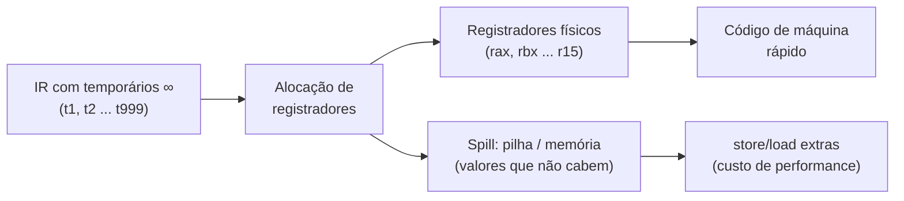
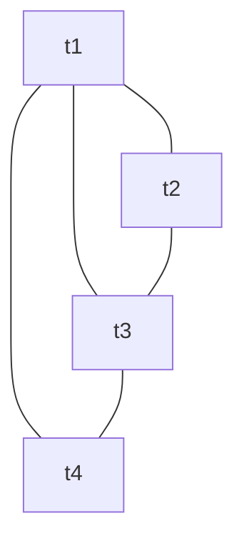
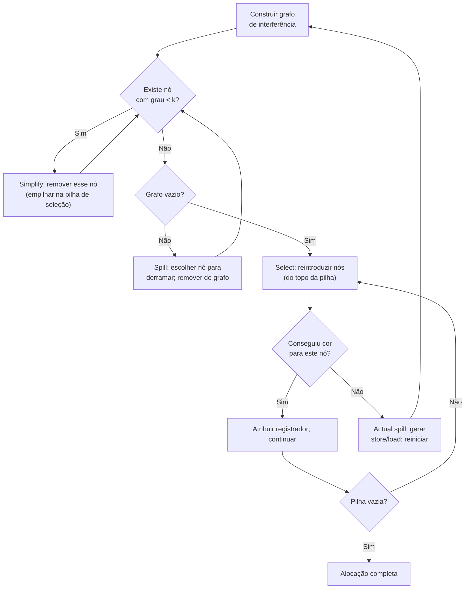
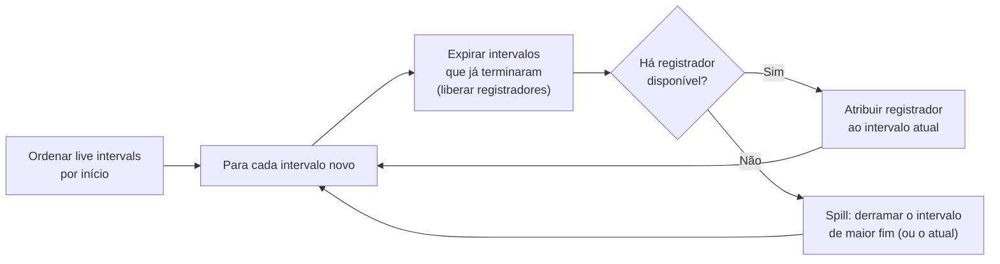
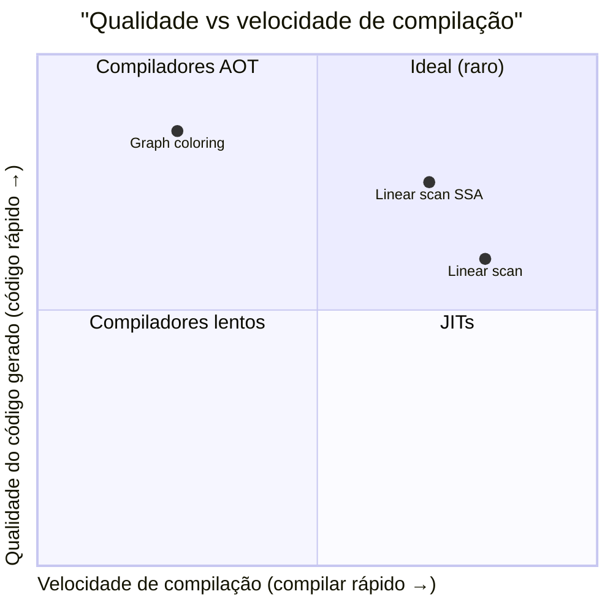

# Alocação de registradores

> [!abstract] TL;DR
> A IR (representação intermediária) usa temporários virtuais ilimitados; a CPU tem poucos registradores físicos. Alocação de registradores é o problema de mapear os temporários em registradores — e "derramar" na pilha o excesso. O modelo clássico é **coloração de grafo de interferência** (Chaitin 1982): NP-completo no caso geral, então resolvido com heurísticas. JITs preferem **linear scan**, mais rápido porém menos ótimo. SSA torna o grafo cordal → colorível em tempo polinomial (avanço moderno).

---

## O abismo entre o virtual e o físico

Quando você leu [[11 - Representação intermediária e SSA]], viu que a IR inventa temporários livremente: `t1`, `t2`, `t247`… sem limite. Isso é intencional — simplifica a geração de código e permite otimizações limpas. O compilador age como se a memória fosse gratuita e ilimitada nessa fase.

Só que no fim do dia, a CPU não conhece `t247`. Ela conhece `rax`, `rbx`, `rcx`… Em x86-64 há 16 registradores de uso geral. Apenas isso. E alguns estão reservados (ponteiro de pilha, base frame, registradores que a ABI exige para argumentos). Na prática você tem algo entre 6 e 14 registradores para jogar.

Por que isso importa? Porque registrador é rápido de verdade. Um acesso a registrador custa 1 ciclo. Um acesso à RAM (mesmo com cache L1) custa ~4 ciclos; sem cache, ~200 ciclos. A hierarquia de memória — discutida em [[03-Dominios/Fundamentos/Org. de Computadores/08 - Hierarquia de memória e cache]] — explica em detalhe essa diferença. Aqui basta saber: colocar um valor na pilha em vez de registrador pode desacelerar o código por um fator de 100×.

A alocação de registradores é o problema de decidir: qual temporário vive em qual registrador físico? E quando não há registradores suficientes, qual temporário "derramamos" para a pilha?



> [!info] Leitura do diagrama
> O fluxo mostra o contrato fundamental: temporários ilimitados entram, registradores físicos escassos saem. Tudo que não cabe vira store/load — custo real de ciclos de CPU.

---

## Liveness como insumo

Antes de alocar, o compilador precisa saber quem está "vivo" em cada ponto do programa. Isso é análise de liveness, coberta em [[12 - Otimização]].

Um temporário `t` está **vivo** num ponto `p` se existe algum caminho de `p` até um uso de `t` sem redefinição de `t` no meio. O **live range** de `t` é o conjunto de pontos onde `t` está vivo.

Considere este trecho de código:

```
t1 = a + b       ; linha 1
t2 = t1 * c      ; linha 2
t3 = t2 - d      ; linha 3
t4 = t1 + e      ; linha 4  ← t1 ainda é usado aqui!
resultado = t3 + t4  ; linha 5
```

Os live ranges ficam assim:

```mermaid
gantt
    title Live ranges dos temporários
    dateFormat X
    axisFormat %s

    section t1
    vivo : 1, 4

    section t2
    vivo : 2, 3

    section t3
    vivo : 3, 5

    section t4
    vivo : 4, 5
```



> [!info] Leitura do diagrama
> Cada barra mostra o intervalo em que o temporário está vivo (do ponto de definição ao último uso). `t1` tem um range mais longo porque é usado nas linhas 2 e 4. Dois temporários cujos ranges se sobrepõem **interferem** — não podem compartilhar registrador.

A observação crucial: se dois temporários estão vivos **ao mesmo tempo**, eles não podem morar no mesmo registrador. Caso contrário, ao escrever um, você destruiria o valor do outro.

---

## O grafo de interferência

Com os live ranges em mãos, construímos o **grafo de interferência**:

- Cada nó = um temporário
- Existe aresta entre `ti` e `tj` se os dois estão vivos simultaneamente em algum ponto

Para o exemplo acima:

- `t1` e `t2` interferem (ambos vivos na linha 2)
- `t1` e `t3` interferem (ambos vivos nas linhas 3-4)
- `t2` e `t3` interferem (ambos vivos na linha 3)
- `t3` e `t4` interferem (ambos vivos na linha 5)
- `t1` e `t4` interferem (ambos vivos na linha 4)



> [!info] Leitura do diagrama
> Cada aresta = "esses dois não podem dividir registrador". Nós muito conectados (alto grau) são os candidatos mais difíceis para alocar.

Note que `t2` e `t4` **não** interferem — não há momento em que os dois estão vivos ao mesmo tempo. Eles podem, portanto, compartilhar o mesmo registrador físico.

---

## Alocação como coloração de grafo

Se você já viu o problema das 4 cores no mapa, o conceito é o mesmo. Queremos atribuir uma **cor** (= registrador físico) a cada nó (= temporário) de modo que dois nós adjacentes jamais recebam a mesma cor. Com k registradores disponíveis, precisamos de uma **k-coloração**.

No nosso exemplo, com k = 3 registradores (`rax`, `rbx`, `rcx`):

| Temporário | Cor / Registrador |
|-----------|-------------------|
| t1        | rax               |
| t2        | rbx               |
| t3        | rcx               |
| t4        | rbx  ← pode! (t2 já morreu) |

`t4` compartilha `rbx` com `t2` sem problema, pois eles não interferem.

### O algoritmo de Chaitin

Gregory Chaitin (IBM, 1982) formalizou o ciclo clássico:



> [!info] Leitura do diagrama
> O coração do algoritmo são três fases: **simplify** (remove nós fáceis), **spill** (marca candidatos a derramar quando não há nó fácil), **select** (colore de volta). Se na fase select um nó marcado para spill não consegue cor, vira spill real e o ciclo recomeça.

**Intuição do simplify:** se um nó tem grau menor que k, podemos removê-lo temporariamente — qualquer que seja a coloração do resto, sempre sobra pelo menos uma cor para ele. Esse é o insight fundamental.

**Intuição do select:** na hora de reintroduzir (em ordem inversa da remoção), colorimos com qualquer cor não usada pelos vizinhos já coloridos. Como garantimos que havia grau < k no momento da remoção, sempre há uma cor disponível — salvo para os nós marcados para spill.

### Chaitin × Briggs: a evolução do algoritmo

O Chaitin original (1982) fazia coalescing **antes** de construir o grafo de interferência — agressivo, mas criava nós de alto grau que às vezes tornavam spills desnecessários. Preston Briggs (1994) propôs duas melhorias importantes:

1. **Coalescing conservativo**: só funde dois nós se a fusão não criar um nó com grau ≥ k. Evita inflar artificialmente o grafo.
2. **Otimistic coloring**: na fase select, ao tentar colorir um nó marcado para spill, tenta-se uma cor qualquer. Se houver — ótimo, não precisa derramar. O Chaitin original sempre derramava o nó marcado; Briggs é mais otimista e às vezes evita o spill.

> [!example] Otimistic coloring salvando o dia
> Suponha que `t5` foi marcado para spill porque tinha grau alto. Na fase select, após colorir todos os vizinhos, sobrou uma cor disponível. Briggs usa essa cor e `t5` fica em registrador — nenhum store/load gerado. Chaitin teria derramado por precaução.

Na prática, compiladores modernos como GCC e LLVM implementam variantes do Chaitin-Briggs, não o Chaitin puro.

---

## Por que é NP-completo

Aqui cabe honestidade: coloração de grafo com k cores (k ≥ 3) é NP-completo, conforme discutido em [[03-Dominios/Fundamentos/Teoria da Computação/15 - NP-completude - Cook-Levin e a cadeia de Karp]]. O problema de alocação de registradores é, no caso geral, tão difícil quanto.

A prova formal é por redução: dado um grafo G arbitrário, é possível construir um programa cujo grafo de interferência seja exatamente G. Colorir G de forma ótima seria equivalente a alocar registradores de forma ótima. Como colorir G de forma ótima é NP-completo, o mesmo vale para alocação ótima.

Isso não significa que compiladores são lentos. Significa que eles **não resolvem o problema ótimo** — usam heurísticas boas o suficiente na prática. O ciclo de Chaitin-Briggs é uma heurística: não garante a coloração mínima, mas produz código excelente na maioria dos casos reais.

A intuição prática: os grafos de interferência que aparecem em programas reais têm estrutura particular — não são grafos arbitrários. Heurísticas exploram essa estrutura e funcionam bem.

> [!warning] Heurística, não ótimo
> Nunca assuma que o compilador encontrou a alocação perfeita. Em código crítico de performance, às vezes vale reestruturar o código-fonte para reduzir o número de variáveis vivas simultaneamente — menos interferências, menos pressão sobre os registradores.

---

## Spilling: quando não há saída

Quando um temporário não consegue cor (todos os k registradores estão tomados por vizinhos), ele vai para a **pilha**. Isso se chama **spill** (derramamento).

Pense assim: você tem 3 cadeiras para 5 pessoas numa sala de reunião. Quando chega a quinta pessoa, ela precisa ficar de pé. O compilador "faz ficar de pé" o temporário que menos vai atrapalhar — mas alguém tem que ficar.

Spill gera código extra: a cada **definição** do temporário, um `store` (escreve na pilha); a cada **uso**, um `load` (lê da pilha). O temporário passa a ter um live range muito curto (só o trecho entre o load e o uso), o que às vezes resolve conflitos para os outros.

Há dois tipos de spill na terminologia do compilador:

- **Potential spill** (ou spill candidato): nó marcado durante a fase simplify por ter grau alto — pode ou não virer spill real, dependendo do otimistic coloring na fase select.
- **Actual spill** (spill real): quando na fase select o nó marcado realmente não consegue cor; o compilador gera store/load e reinicia o ciclo com esses loads/stores adicionados como novos temporários com live ranges muito curtos.

```
; Antes do spill (t3 em rax):
mov rax, [algum cálculo]
; t3 usado mais tarde

; Depois do spill (t3 vai para -8(%rbp)):
mov [rbp-8], rax    ; store: salva t3 na pilha
...
mov rdx, [rbp-8]    ; load: recupera t3 quando necessário
add rcx, rdx
```

### Escolhendo quem derramar

O compilador calcula um **spill cost** para cada candidato. A fórmula clássica de Chaitin:

```
spill_cost(t) = (soma dos usos de t × peso_do_bloco) / grau_no_grafo
```

Onde o peso do bloco básico é 10^(profundidade do loop aninhado). Um temporário dentro de um loop de profundidade 2 tem peso 100× maior que um fora de qualquer loop.

Heurística: prefira derramar o temporário com **menor custo/grau** — pouco usado e com muitas interferências. Isso libera muitas arestas de uma vez.

- Frequência de uso: quanto mais usado, mais caro é derramar
- **Loops pesam muito mais**: um temporário usado dentro de um loop interno é acessado muitas vezes; spill ali multiplica o custo pelo número de iterações
- **Grau no grafo**: temporário com muitas interferências, se derramado, resolve muitos conflitos de uma vez — bom candidato mesmo que tenha algum custo

> [!danger] Spill dentro de loop é armadilha
> Um store/load por iteração de um loop de 10.000 repetições = 10.000 acessos à memória desnecessários. O compilador tenta ao máximo **não** fazer spill de temporários dentro de loops quentes. Se você ver código assembly com stores/loads dentro de loops que não deveriam existir, provavelmente há alta pressão de registradores naquele escopo. A solução no código-fonte: reduzir variáveis vivas simultaneamente dentro do loop (calcular fora, reusar nomes, separar em funções menores).

---

## O ciclo Chaitin passo a passo no nosso exemplo

Vamos executar o algoritmo para nosso grafo com k = 3 registradores disponíveis.

Estado inicial do grafo: {t1-t2, t1-t3, t1-t4, t2-t3, t3-t4}. Graus: t1=3, t2=2, t3=3, t4=2. Note: t2 e t4 não têm aresta entre si.

**Fase Simplify (remover nós de grau < k = 3):**

- `t2` tem grau 2 < 3 → remove t2, empilha. Grafo restante: {t1-t3, t1-t4, t3-t4}. Graus: t1=2, t3=2, t4=2.
- `t4` tem grau 2 < 3 → remove t4, empilha. Grafo restante: {t1-t3}. Graus: t1=1, t3=1.
- `t1` tem grau 1 < 3 → remove t1, empilha. Grafo restante: {t3}. t3 grau 0.
- `t3` tem grau 0 < 3 → remove t3, empilha.

Pilha (topo = último): [t2, t4, t1, t3].

Fase Spill: não foi necessária. Nenhum nó ficou com grau ≥ k no momento de ser removido.

**Fase Select (recolorir em ordem inversa):**

- Reintroduz `t3`: sem vizinhos coloridos → atribui `rax`.
- Reintroduz `t1`: vizinho `t3` = rax → atribui `rbx`.
- Reintroduz `t4`: vizinho `t3` = rax → atribui `rbx`... mas `t3` é vizinho e t4-t1 também? Verificar: t4 interfere com t1 (aresta) e t3 (aresta). t1=rbx, t3=rax → atribui `rcx`.
- Reintroduz `t2`: interfere com t1 (rbx) e t3 (rax) → atribui `rcx`.

Resultado final: t1=rbx, t2=rcx, t3=rax, t4=rcx. `t2` e `t4` compartilham `rcx` — correto, pois não interferem.

> [!success] Três registradores bastaram
> O exemplo precisava de apenas 3 registradores para 4 temporários. O compartilhamento de `rcx` entre `t2` e `t4` foi possível porque seus live ranges não se sobrepõem — o compilador explorou essa "janela de tempo" para reusar o registrador.

---

## Linear scan: a velocidade dos JITs

Construir e colorir um grafo de interferência completo tem custo quadrático no número de temporários. Para um JIT — que compila em **tempo de execução**, como discutido em [[17 - JIT a fundo]] — isso é lento demais. Um JIT que demora 200ms compilando vai frustrar o usuário antes de gerar qualquer benefício de performance.

Massimiliano Poletto e Vivek Sarkar (1999) propuseram o **linear scan**: em vez de grafo, trabalhamos com **live intervals** (o intervalo numérico do início ao fim de cada live range) ordenados pelo início.

A hipótese simplificadora crucial: em vez de representar o live range exato (que pode ter "buracos" — pontos onde o temporário não está vivo mesmo dentro do seu range), usamos o **intervalo fechado** [definição, último uso]. Isso introduz interferências conservativas que não existem de fato — às vezes dois temporários parecem interferir mas não interferem — porém elimina a complexidade de construir o grafo.

Para o nosso exemplo anterior:
- `t1`: intervalo [1, 4]
- `t2`: intervalo [2, 3]  
- `t3`: intervalo [3, 5]
- `t4`: intervalo [4, 5]

Ordenados por início: t1, t2, t3, t4. O linear scan varre nessa ordem, atribuindo registradores e expirando intervalos que terminaram.

O algoritmo varre os intervalos uma vez:



> [!info] Leitura do diagrama
> Linear scan é uma única varredura. Sem grafo. A decisão de spill é gulosa: quando não há registrador, derrama quem "vive mais tempo" (pior ocupante do espaço). Isso não é ótimo, mas é O(n log n) — aceitável para um JIT.

### Graph coloring × linear scan



> [!info] Leitura do diagrama
> Graph coloring (Chaitin e variantes) produz código de alta qualidade mas é mais lento para compilar — adequado para compiladores ahead-of-time (GCC, Clang). Linear scan compila rápido mas pode gerar spills desnecessários — ideal para JITs (JVM HotSpot, V8). A variante SSA-aware do linear scan sobe a qualidade sem perder muito da velocidade.

> [!tip] Por que o JIT escolhe velocidade de compilação
> Um JIT compila em tempo de execução. Se a compilação demora 50ms, o usuário sente. Então o JIT aceita código ligeiramente pior em troca de compilação imediata. Além disso, o JIT pode recompilar o mesmo código mais tarde (OSR — On-Stack Replacement) com otimizações melhores se o método ficar quente.

---

## Refinamentos: pré-coloração, coalescing e SSA

### Alocação local vs. global

Uma distinção fundamental raramente discutida em cursos introdutórios:

- **Alocação local**: aloca registradores dentro de um único bloco básico. Simples, rápida, mas perde oportunidades cross-bloco.
- **Alocação global**: considera o fluxo entre blocos. O grafo de interferência global é maior, mas a qualidade é muito superior — variáveis que vivem across branches ficam em registradores por toda sua vida, não só em cada bloco.

O Chaitin-Briggs é uma técnica de alocação **global**. Linear scan, na versão original de Poletto e Sarkar, também é global — opera sobre os live intervals de todo o procedimento.

### Pré-coloração (registradores fixos da ABI)

A ABI (Application Binary Interface) define que os primeiros argumentos de uma função vão em registradores específicos: em x86-64 Linux, `rdi`, `rsi`, `rdx`, `rcx`, `r8`, `r9`. O valor de retorno vai em `rax`. O compilador trata esses registradores como "pré-coloridos" — temporários que representam argumentos têm cor forçada.

Isso cria restrições adicionais no grafo: o nó correspondente ao primeiro argumento não pode receber nenhuma cor exceto "rdi". Se outro temporário também precisar de "rdi" ao mesmo tempo, é necessário mover um deles — inserindo uma instrução de cópia (mov) — ou realocar. Detalhes da convenção de chamada estão em [[13 - Geração de código e seleção de instruções]].

Além dos argumentos, há registradores **caller-saved** (rax, rcx, rdx, rsi, rdi, r8-r11) que o chamador deve salvar se quiser preservar seus valores através de uma chamada, e **callee-saved** (rbx, rbp, r12-r15) que o receptor salva e restaura. O alocador precisa considerar qual conjunto cada temporário pode usar, especialmente quando há chamadas de função no meio do live range.

### Coalescing

Considere a instrução `t2 = t1` (uma simples cópia). Se `t1` e `t2` não interferem, o compilador pode **fundir** os dois em um único temporário, eliminando a instrução de cópia. Isso se chama **coalescing**. O Chaitin original fazia coalescing agressivo; Briggs (1994) propôs coalescing conservativo para evitar criar nós com grau alto demais.

> [!example] Coalescing em prática
> Antes: `mov rax, rbx` (cópia desnecessária). Após coalescing: os dois temporários compartilham `rax` — a instrução desaparece. Reduz o número de instruções e a pressão de registradores.

### SSA e grafos cordais

Aqui está o avanço moderno mais elegante. Bouchez, Brisk e Hack mostraram independentemente em 2005 que **programas em forma SSA têm grafo de interferência cordal**.

Um grafo cordal é aquele em que todo ciclo de comprimento ≥ 4 tem uma **corda** (aresta entre dois vértices não adjacentes no ciclo — um "atalho" dentro do ciclo). Grafos cordais têm uma propriedade extraordinária: são **coloríveis em tempo polinomial** pelo algoritmo de eliminação perfeita.

A intuição: em SSA, cada temporário é definido uma única vez. Isso cria uma ordem de dominância hierárquica entre os temporários. Quando dois temporários estão vivos simultaneamente, um "domina" o nascimento do outro. Essa hierarquia impede a formação de ciclos sem cordas no grafo de interferência — logo o grafo é cordal.

Consequência prática: a coloração ótima tem complexidade O(ω·|V|), onde ω é o tamanho do maior clique (que corresponde ao número máximo de variáveis vivas simultaneamente em algum ponto — exatamente a register pressure máxima). Se a register pressure máxima é k, colorimos em tempo linear no número de temporários.

> [!success] SSA quebra a barreira NP
> A manutenção da forma SSA durante a alocação transforma o grafo de interferência em cordal, permitindo coloração ótima em tempo polinomial. GCC e LLVM exploram variantes dessa ideia em seus back-ends modernos. O ponto prático: vale a pena manter a SSA até mais tarde no pipeline do compilador, só destruindo-a (com a inserção de instruções de cópia para as φ-funções) após a alocação.

Nota de honestidade: Bouchez et al. também mostraram que **após** a destruição da SSA, se as cópias inseridas pelas φ-funções não forem eliminadas por coalescing, o problema volta a ser NP-completo. A magia da SSA só funciona enquanto se mantém a forma.

---

## Register pressure: quando o compilador "perde"

**Register pressure** é o número de temporários vivos simultaneamente num dado ponto. Quando a pressão excede k, é impossível manter tudo em registradores — algum temporário vai para a pilha.

Pense na register pressure como o nível d'água num copo: enquanto abaixo da borda (k registradores), tudo bem. No momento em que sobe acima da borda, algo transborda — spill.

Situações que aumentam a pressão:

- Expressões aritméticas complexas com muitas subexpressões intermediárias (cada subexpressão é um temporário vivo até ser consumida)
- Loops com muitas variáveis de iteração simultâneas
- Chamadas de função: a ABI "mata" temporários nos **caller-saved registers** — o compilador precisa salvá-los antes da chamada e restaurá-los depois, o que equivale a spill temporário
- Código gerado por templates/macros que expande em muitos temporários simultâneos
- Desenrolamento de loop (loop unrolling): mais variáveis por iteração, mais pressão

Quando você abre o assembly de uma função e vê `push rbp`, `push rbx`, `push r12`… no prólogo, o compilador está sinalizando que vai usar esses registradores **callee-saved** porque os caller-saved não bastam. Cada push/pop tem custo — é spill gerenciado pela convenção de chamada.

A forma mais fácil de medir register pressure num ponto específico: contar quantas variáveis de um scope estão vivas ao mesmo tempo. Mais de 16 em x86-64, e você terá spills inevitavelmente.

Em arquiteturas com mais registradores — ARM64 tem 31 registradores de uso geral — a pressão raramente causa problemas em código normal. Em x86-64 legado, os 16 registradores (herdados da época em que x86 tinha apenas 8) são frequentemente gargalo em código altamente otimizado.

> [!warning] A penalidade invisível
> Um loop que parece simples em C pode gerar spills se o compilador não conseguir manter todas as variáveis em registradores. O custo aparece no profiler como tempo dentro do loop, mas a causa real é pressão de registradores — não o algoritmo em si. Compiladores modernos com `-O2` ou `-O3` às vezes reordenam cálculos para reduzir a pressão máxima — uma otimização chamada **register pressure reduction scheduling**.

> [!tip] Como ajudar o compilador
> Reduzir o escopo das variáveis (declarar dentro do bloco onde são usadas), evitar funções com muitos argumentos ao mesmo tempo, e separar funções longas em subfunções menores são estratégias que diretamente reduzem a register pressure e resultam em código mais eficiente.

---

## Conexões

- Anterior: [[13 - Geração de código e seleção de instruções]] — seleciona instruções da ISA; a alocação de registradores vem logo depois
- Próxima: [[15 - Runtime, stack frames e gestão de memória]] — os spills vão para o stack frame; entender como ele é organizado explica onde os temporários derramados moram
- [[11 - Representação intermediária e SSA]] — os temporários ilimitados que precisamos mapear; SSA torna o grafo de interferência cordal
- [[12 - Otimização]] — análise de liveness que alimenta o grafo de interferência; otimizações podem reduzir a pressão de registradores
- [[17 - JIT a fundo]] — linear scan é o algoritmo preferido dos JITs; compensações compilação-rápida vs código-ótimo
- [[03-Dominios/Fundamentos/Teoria da Computação/15 - NP-completude - Cook-Levin e a cadeia de Karp]] — coloração de grafo é NP-completo; alocação ótima é intratável no caso geral

> [!summary] Resumo em uma linha
> Alocação de registradores mapeia temporários virtuais ilimitados em poucos registradores físicos via coloração de grafo de interferência — NP-completo no geral, resolvido por heurísticas (Chaitin) ou linear scan (JITs), e polinomial se o programa permanecer em SSA.

---

## Em entrevista

Em entrevistas de compiladores (especialmente para posições de back-end, sistemas ou desenvolvimento de linguagens), alocação de registradores é um tópico diferenciador. A maioria dos candidatos sabe que "registradores são escassos"; poucos sabem explicar o modelo formal.

*Register allocation maps virtual temporaries to physical registers. Two temporaries that are simultaneously live interfere — they cannot share a register. We model this as a graph coloring problem: nodes are temporaries, edges connect interfering pairs, and k colors represent k registers.*

*Graph coloring is NP-complete in the general case, so compilers use heuristics. Chaitin's algorithm (1982) applies simplify-spill-select: repeatedly remove nodes of degree less than k, marking the rest for potential spill, then color in reverse order.*

*When a temporary cannot be colored, it spills to the stack — a store at each definition, a load before each use. Spill inside a hot loop is expensive: each iteration pays a memory access.*

*JIT compilers prefer linear scan: sort live intervals by start point, allocate registers in a single pass. It's O(n log n) versus the quadratic cost of building and coloring a full interference graph — fast to compile, slightly worse code.*

*Coalescing eliminates copy instructions by merging non-interfering temporaries that are simply copied from one to the other.*

*Register pressure is the number of simultaneously live temporaries. When pressure exceeds the register count, spills are inevitable.*

*Programs in SSA form have chordal interference graphs — colorable in polynomial time. This breaks the NP-complete barrier for the SSA case (Hack, Brisk et al., 2005).*

*Pre-coloring handles ABI constraints: argument registers are forced to specific colors before allocation begins.*

| PT | EN |
|----|----|
| Alocação de registradores | Register allocation |
| Grafo de interferência | Interference graph |
| Coloração de grafo | Graph coloring |
| Derramamento / spill | Spill |
| Intervalo vivo | Live range / live interval |
| Varredura linear | Linear scan |
| Fusão de cópia | Coalescing |
| Pressão de registradores | Register pressure |
| Pré-coloração | Pre-coloring |
| Simplificação | Simplify (Chaitin phase) |
| Seleção | Select (Chaitin phase) |
| Grafo cordal | Chordal graph |
| Registrador callee-salvo | Callee-saved register |
| Registrador caller-salvo | Caller-saved register |
| Convenção de chamada | Calling convention / ABI |

---

> [!info] Lastro
> 1. Chaitin, G. J. et al. "Register allocation & spilling via graph coloring." *ACM SIGPLAN Notices*, vol. 17, n. 6, pp. 98–105, 1982. [ACM DL](https://dl.acm.org/doi/10.1145/872726.806984)
> 2. Poletto, M.; Sarkar, V. "Linear scan register allocation." *ACM TOPLAS*, vol. 21, n. 5, pp. 895–913, set. 1999. [ACM DL](https://dl.acm.org/doi/10.1145/330249.330250)
> 3. Aho, A. V.; Lam, M. S.; Sethi, R.; Ullman, J. D. *Compilers: Principles, Techniques, and Tools* (Dragon Book), 2ª ed. Addison-Wesley, 2006. Cap. 8.8 — Register Allocation and Assignment.
> 4. Cooper, K. D.; Torczon, L. *Engineering a Compiler*, 2ª ed. Morgan Kaufmann, 2011. Cap. 13 — Register Allocation.
> 5. Appel, A. W. *Modern Compiler Implementation in Java/ML/C*. Cambridge University Press, 1998. Cap. 11 — Register Allocation.
> 6. Hack, S.; Grund, D.; Goos, G. "Register allocation for programs in SSA-form." *CC 2006* (Compiler Construction), LNCS 3923, pp. 247–262. [SpringerLink](https://link.springer.com/chapter/10.1007/11688839_20)
> 7. Brisk, P. et al. "Register allocation via coloring of chordal graphs." *APLAS 2005*, LNCS 3780, pp. 315–329. [PDF](http://compilers.cs.ucla.edu/fernando/publications/papers/APLAS05.pdf)
