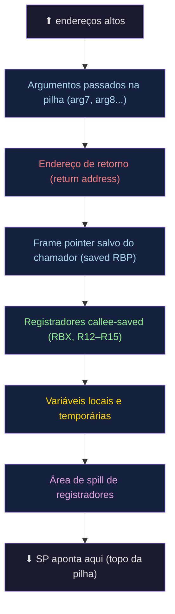
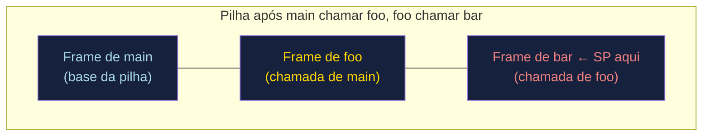
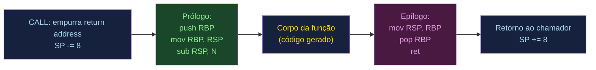
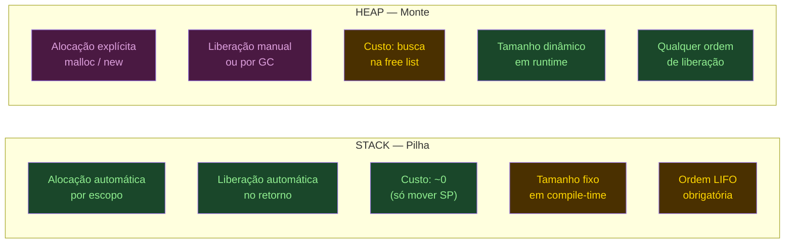
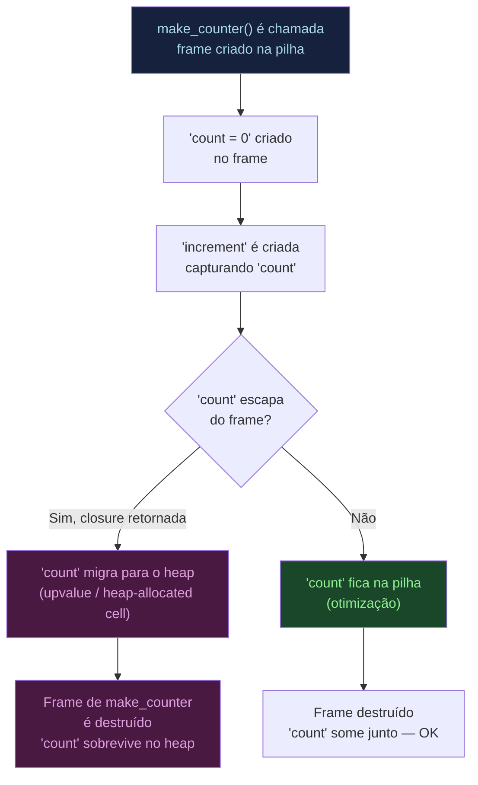

# Runtime, stack frames e gestão de memória

> [!abstract] TL;DR
> O compilador gera código que precisa de uma infraestrutura invisível para rodar: o **runtime**. Ele inclui a pilha de chamadas (stack), o heap e as convenções de chamada — contratos entre o código que chama e o código chamado. Cada chamada de função empilha um **stack frame** (registro de ativação) com argumentos, endereço de retorno e variáveis locais. Variáveis que escapam do escopo, objetos de tamanho dinâmico e closures que capturam variáveis locais migram para o **heap**. Conhecer esse mecanismo é entender por que stack overflow acontece, o que TCO resolve e por que closures de primeira classe implicam alocação dinâmica.

---

## O que é o runtime — o código que o compilador não escreveu

Imagine que você escreveu um programa em C com uma única função `main`. O compilador gera as instruções para o corpo da função. Mas quem configura o stack pointer antes de `main` ser chamada? Quem inicializa as variáveis globais? Quem chama `exit` no final?

Esse trabalho é do **runtime** — a camada de suporte que existe para que o programa possa rodar, mas que o programador não escreve linha por linha.

Mesmo em C, a linguagem mais próxima do metal, há um runtime mínimo chamado `crt0` (C Runtime Zero). O sistema operacional carrega o executável na memória (assunto de [[03-Dominios/Fundamentos/Sistemas Operacionais/index|Sistemas Operacionais]]) e transfere o controle para um pequeno stub que:

1. Configura o stack pointer inicial.
2. Inicializa variáveis globais e estáticas (seção `.data`/`.bss`).
3. Chama `main` com `argc` e `argv` devidamente montados.
4. Passa o valor de retorno de `main` para `exit`.

```c
// O que o programador escreve
int main(int argc, char *argv[]) {
    return 0;
}

// O que crt0 (simplificado) faz antes disso:
// _start:
//   xor ebp, ebp        ; frame pointer = 0 (sentinel da pilha)
//   pop rdi             ; argc
//   mov rsi, rsp        ; argv
//   call main
//   mov edi, eax
//   call exit
```

Linguagens mais ricas têm runtimes mais gordos: Java tem a JVM (com GC, class loading, JIT); Python tem o interpretador CPython; Go tem o scheduler de goroutines e o GC concurrent. Mas o princípio é o mesmo — infraestrutura que o compilador assumiu existir.

> [!tip] Por que isso importa para o compilador?
> O compilador gera código que faz *suposições* sobre o runtime: que haverá uma pilha de chamadas, que o registrador SP aponta para o topo dela, que há um heap disponível para `malloc`. Sem essas suposições honradas, o código gerado simplesmente não funciona.

---

## O stack frame — o bloco de cada chamada

Cada vez que uma função é chamada, a pilha ganha um novo **stack frame** (também chamado de *activation record* ou *registro de ativação*). Ele é o "apartamento temporário" da função: existe enquanto ela executa, desaparece quando ela retorna.

O que mora num stack frame?

| Campo | O que é |
|---|---|
| Argumentos extras | Parâmetros que não couberam em registradores |
| Endereço de retorno | Para onde voltar quando a função terminar |
| Frame pointer salvo | O FP/RBP do chamador, para restaurá-lo |
| Registradores callee-saved | Registradores que a função promete preservar |
| Variáveis locais | Variáveis declaradas no escopo da função |
| Área de spill | Variáveis que transbordaram dos registradores (ver [[14 - Alocação de registradores]]) |



> [!info] Leitura do diagrama
> A pilha cresce para baixo (endereços decrescentes). O frame de uma função começa no antigo SP (após o `call` empurrar o endereço de retorno) e se estende até o novo SP, calculado pelo prólogo. RBP aponta para o frame pointer salvo, sendo a âncora estável do frame.

---

## A pilha de chamadas — crescendo e encolhendo

A **call stack** é a sequência de frames empilhados. É uma estrutura LIFO: o último frame empurrado é o primeiro a sair quando a função retorna.



> [!info] Leitura do diagrama
> A pilha cresce para baixo. O frame mais recente (bar) fica no topo lógico, com SP apontando para sua fronteira inferior. Quando bar retorna, SP sobe de volta, "desempilhando" o frame. O frame de foo fica exposto novamente, com suas variáveis intactas.

Dois registradores conduzem esse ballet:

- **SP** (Stack Pointer / RSP em x86-64): aponta sempre para o topo atual da pilha — o endereço mais baixo em uso.
- **FP/BP** (Frame Pointer / RBP em x86-64): aponta para o frame pointer salvo dentro do frame corrente. Isso cria uma cadeia encadeada de frames (útil para depuradores reconstituírem o stack trace).

---

## Prólogo e epílogo — o que o compilador emite

O compilador não escreve apenas o *corpo* da função. Ele gera automaticamente um **prólogo** (montar o frame ao entrar) e um **epílogo** (desmontar ao sair).



> [!info] Leitura do diagrama
> O `call` já empurra o return address automaticamente (SP recua 8 bytes). O prólogo salva RBP, usa RSP como novo RBP, e reserva N bytes para variáveis locais. O epílogo desfaz tudo na ordem reversa. `ret` lê o return address do topo e salta.

Em pseudo-assembly x86-64 (System V AMD64 ABI):

```asm
; --- PRÓLOGO ---
push rbp           ; salva frame pointer do chamador
mov  rbp, rsp      ; RBP = topo atual (âncora do frame)
sub  rsp, 48       ; reserva 48 bytes para locais (alinhado a 16)

; --- CORPO DA FUNÇÃO ---
; variáveis locais acessadas por [rbp - 8], [rbp - 16], etc.
; argumentos extras (se houver) por [rbp + 16], [rbp + 24], etc.

; --- EPÍLOGO ---
mov  rsp, rbp      ; descarta variáveis locais
pop  rbp           ; restaura frame pointer do chamador
ret                ; lê return address do topo e salta
```

> [!tip] Omissão do frame pointer
> Com `-fomit-frame-pointer` (GCC/Clang), o compilador elimina o push/pop de RBP e usa RBP como registrador de uso geral. Ganha um registrador, perde facilidade de depuração. O perf do Linux usa isso; builds de debug geralmente não.

---

## Recursão, stack overflow e TCO

A recursão usa a pilha como qualquer outra chamada — só que multiplica frames. Uma função `fib(n)` que se chama duas vezes a cada passo cria uma árvore de chamadas cujo ramo mais profundo tem profundidade `n`. Com `n = 100.000`, são 100.000 frames simultaneamente na pilha.

```c
// Fibonacci recursivo ingênuo — cada chamada empilha um frame
int fib(int n) {
    if (n <= 1) return n;
    return fib(n - 1) + fib(n - 2);  // NÃO é tail call: soma ocorre depois
}
```

A pilha tem tamanho finito (tipicamente 1–8 MB no Linux, configurável via `ulimit -s`). Recursão profunda demais esgota esse espaço.

> [!danger] Stack Overflow
> Quando SP ultrapassa o limite inferior da pilha, o SO detecta o acesso a uma página de guarda (*guard page*) e envia SIGSEGV. É o temido stack overflow — não tem como capturar do jeito que capturaria um `NullPointerException`, porque a pilha que o handler usaria também está cheia.

### Tail Call Optimization (TCO)

Se a chamada recursiva é a **última operação** da função — uma *tail call* — o compilador pode reutilizar o frame atual em vez de empilhar um novo. O corpo da função vira um salto (*jump*) para o início da função chamada, passando os novos argumentos nos mesmos registradores/slots.

```c
// Fibonacci com acumulador — a chamada recursiva É a última operação
int fib_tail(int n, int a, int b) {
    if (n == 0) return a;
    return fib_tail(n - 1, b, a + b);  // tail call: compilador pode otimizar
}
// Com TCO: fib_tail(1000000, 0, 1) roda sem crescer a pilha
```

Em vez de `call` + novo frame, o compilador emite:

```asm
; Tail call otimizado: reutiliza o frame corrente
mov  edi, [novo_n]
mov  esi, [novo_a]
mov  edx, [novo_b]
jmp  fib_tail      ; salto, não chamada — SP não se move
```

**Por que Scheme garante TCO e Python não?**

O R7RS (especificação de Scheme) *mandates proper tail calls* — é parte do contrato da linguagem. Um interpretador Scheme que não fizer TCO está errado. Isso permite usar recursão como mecanismo de loop sem custo de pilha.

Python deliberadamente não garante TCO. Guido van Rossum argumentou que TCO obscurece os stack traces (a mensagem de erro não mostra "onde a recursão veio"), tornando depuração mais difícil. A linguagem prefere legibilidade a eficiência de recursão profunda.

> [!example] TCO em JavaScript (ES6+)
> O ECMAScript 6 especificou TCO, mas apenas Safari/JavaScriptCore a implementou de fato. V8 (Chrome/Node) e SpiderMonkey (Firefox) optaram por não implementar por razões semelhantes às de Python: impacto nos stack traces e complexidade de implementação.

---

## Calling conventions revisitadas

As *calling conventions* (convenções de chamada) são o contrato entre chamador e chamado: quem passa o quê, onde, e quem limpa depois. O compilador gera código seguindo essas convenções para que funções de diferentes módulos (ou linguagens) possam se chamar.

Detalhes completos em [[13 - Geração de código e seleção de instruções]]. Aqui o essencial:

**System V AMD64 ABI** (Linux/macOS x86-64):

- Argumentos inteiros: RDI, RSI, RDX, RCX, R8, R9 (até 6); extras vão na pilha.
- Retorno: RAX (inteiro/ponteiro), XMM0 (float).
- **Caller-saved** (chamador salva se quiser preservar): RAX, RCX, RDX, RSI, RDI, R8–R11.
- **Callee-saved** (chamado promete preservar): RBX, RBP, R12–R15.

```asm
; Chamando soma(3, 4) em System V AMD64
mov edi, 3     ; 1º argumento em RDI
mov esi, 4     ; 2º argumento em RSI
call soma
; resultado em RAX
```

**Red zone**: os 128 bytes *abaixo* de RSP são uma zona protegida que signal handlers não tocam. Funções folha (*leaf functions*, que não chamam outras) podem usar essa área para variáveis temporárias *sem* decrementar RSP — uma otimização pequena mas real.

**Histórico cdecl × stdcall**: no mundo 32-bit Win32, `cdecl` (padrão C) deixava o *chamador* limpar os argumentos da pilha; `stdcall` (padrão WinAPI) deixava o *chamado* limpar. Em 64-bit isso foi unificado — não há mais argumentos na pilha para funções simples.

### Um exemplo concreto de frame em C

Considere esta função simples:

```c
int soma(int a, int b) {
    int resultado = a + b;
    return resultado;
}
```

Com `gcc -O0 -fno-omit-frame-pointer`, o compilador gera algo próximo de:

```asm
soma:
    push rbp              ; salva RBP do chamador (8 bytes)
    mov  rbp, rsp         ; RBP aponta para o frame atual
    sub  rsp, 16          ; reserva 16 bytes (int resultado = 4 bytes, alinhado a 16)
    ; edi = a (1º argumento), esi = b (2º argumento)
    mov  DWORD PTR [rbp-4], edi   ; salva 'a' na pilha (não usado aqui, mas -O0 sempre salva)
    mov  DWORD PTR [rbp-8], esi   ; salva 'b' na pilha
    mov  edx, DWORD PTR [rbp-4]
    mov  eax, DWORD PTR [rbp-8]
    add  eax, edx                  ; eax = a + b
    mov  DWORD PTR [rbp-12], eax  ; resultado = eax
    mov  eax, DWORD PTR [rbp-12] ; valor de retorno em RAX
    leave                          ; equivale a: mov rsp, rbp; pop rbp
    ret
```

Com `-O2`, o compilador elimina os stores/loads redundantes e usa apenas registradores — o frame inteiro pode desaparecer porque os valores nunca precisam da pilha. Isso ilustra a relação direta entre [[14 - Alocação de registradores]] e a necessidade de stack frames: quanto melhor a alocação de registradores, menor o frame.

> [!example] Verificando no mundo real
> `gcc -O0 -S soma.c` gera o assembly em `soma.s`. `gcc -O2 -S soma.c` gera o assembly otimizado. Compare os dois e veja o frame encolhendo. `objdump -d` ou `godbolt.org` são ótimas ferramentas para explorar isso interativamente.

---

## Stack vs. Heap — dois mundos de memória

Por que existem dois lugares para dados? Porque eles têm naturezas opostas.



> [!info] Leitura do diagrama
> Verde = vantagem, amarelo = limitação. A pilha é rápida e automática mas impõe LIFO e tamanhos fixos. O heap é flexível mas requer gerenciamento e paga o custo do alocador.

A regra geral: **variáveis locais vão para a pilha; objetos que precisam sobreviver ao escopo da função que os criou vão para o heap**.

### O que força a ida para o heap?

1. **Tamanho desconhecido em compile-time**: `malloc(n * sizeof(int))` onde `n` é uma variável só faz sentido no heap.
2. **Sobrevivência ao escopo**: se você retorna um ponteiro para um objeto, ele não pode ser uma variável local (o frame foi destruído).
3. **Closures que capturam variáveis** (ver próxima seção).

> [!warning] Escape analysis como otimização inversa
> O compilador de Go faz *escape analysis*: se ele prova que um objeto alocado com `new` nunca "escapa" da função (nenhum ponteiro para ele sobrevive ao retorno), ele aloca o objeto *na pilha* mesmo sendo `new`. A alocação no heap é o padrão conservador; a pilha é a otimização quando o compilador é esperto o suficiente para provar segurança.

---

## malloc/free e o alocador de heap

Quando você chama `malloc(n)`, o que acontece?

O **alocador de heap** mantém uma estrutura de blocos livres (*free lists*). Ao receber um pedido de `n` bytes:

1. Busca um bloco livre de tamanho ≥ n.
2. Divide o bloco se for maior (e coloca o restante de volta na free list).
3. Retorna o ponteiro para o início do bloco.

Ao chamar `free(p)`:

1. Marca o bloco como livre.
2. Tenta *coalescer* com blocos vizinhos livres (para evitar fragmentação).

```c
int *v = malloc(10 * sizeof(int));  // aloca 40 bytes no heap
// ... usa v ...
free(v);  // devolve ao alocador
v = NULL; // boa prática: evitar dangling pointer
```

A fragmentação é o problema crônico do heap: muitos blocos pequenos livres que não somam o bloco grande que você precisa.

> [!danger] Erros clássicos de gerenciamento de heap
> - **Use-after-free**: acessar `v` depois de `free(v)`. O bloco pode ter sido reatribuído a outro `malloc`. Comportamento indefinido — às vezes silencioso, às vezes explorado por atacantes.
> - **Double-free**: chamar `free(v)` duas vezes. Corrompe as estruturas internas do alocador.
> - **Memory leak**: esquecer de chamar `free`. O bloco permanece alocado até o processo terminar.
> Esses são os erros de *memory safety* que linguagens com GC ou ownership (Rust) eliminam em design. Ver notas de Segurança Conceitual para o ângulo de exploração.

---

## Closures e o problema da pilha

Uma **closure** é uma função que "lembra" o ambiente léxico onde foi criada — especificamente, as variáveis do escopo externo que ela referencia. Revisitando o mecanismo de [[09 - Tabela de símbolos, escopo e resolução de nomes]].

O problema: uma closure pode sobreviver à função que criou a variável capturada.

```python
def make_counter():
    count = 0          # variável local de make_counter
    def increment():
        nonlocal count
        count += 1     # closure captura 'count'
        return count
    return increment   # retorna a closure

counter = make_counter()
# make_counter já retornou — seu frame foi destruído
# mas 'count' ainda precisa existir!
print(counter())  # 1
print(counter())  # 2
```

Se `count` estivesse na pilha, ela teria sumido com o frame de `make_counter`. A closure `increment` estaria apontando para memória reciclada — use-after-free garantido.

A solução: o compilador detecta que `count` *escapa* do escopo de `make_counter` (por ser capturada pela closure retornada) e a aloca no **heap**. Em Lua, essas variáveis capturadas são chamadas de **upvalues**.



> [!info] Leitura do diagrama
> A decisão de heap vs. pilha para variáveis capturadas é feita em compile-time (ou, em interpretadores, em tempo de criação da closure). O compilador de Go faz essa análise automaticamente via escape analysis.

> [!tip] Por que linguagens com closures de primeira classe precisam de GC (ou cuidado similar)
> Se closures podem capturar variáveis que vão para o heap, e essas closures podem ser passadas livremente, você perde a habilidade de saber *quando* liberar esse heap. A solução clássica é um **garbage collector** (nota [[16 - Garbage collection]]). Rust resolve isso com ownership e lifetimes — uma análise estática que garante que a variável capturada vive pelo menos tanto quanto a closure.

---

## O modelo de memória de um processo

Para completar o quadro, o processo vê a memória assim (endereços crescendo para baixo):

| Segmento | Conteúdo |
|---|---|
| `.text` | Código executável (instruções) |
| `.rodata` | Constantes somente-leitura (strings literais) |
| `.data` | Variáveis globais/estáticas inicializadas |
| `.bss` | Variáveis globais/estáticas não-inicializadas (zeradas pelo OS) |
| Heap | Cresce para cima (malloc/new) |
| *(gap)* | Espaço não mapeado (proteção) |
| Stack | Cresce para baixo (chamadas de função) |

O mecanismo pelo qual o OS mapeia essas regiões — páginas, tabelas de página, espaço de endereçamento virtual — é assunto de [[03-Dominios/Fundamentos/Sistemas Operacionais/index|Sistemas Operacionais]]. O modelo de registradores e o papel do PC/SP como hardware é assunto de [[03-Dominios/Fundamentos/Organização de Computadores/09 - Assembly e o modelo de execução]]. O que o **compilador** controla é o *layout* dentro de cada frame e a sequência de instruções de prólogo/epílogo.

---

## Conexões

- **Anterior**: [[14 - Alocação de registradores]] — quando os registradores não bastam, variáveis fazem spill para o stack frame.
- **Próxima**: [[16 - Garbage collection]] — o que acontece quando não se quer gerenciar o heap manualmente.
- **Closures e escopo léxico**: [[09 - Tabela de símbolos, escopo e resolução de nomes]] — onde as variáveis capturadas são resolvidas.
- **Calling conventions e geração de código**: [[13 - Geração de código e seleção de instruções]] — como o compilador emite as instruções de prólogo, epílogo e passagem de argumentos.
- **Modelo de execução de hardware**: [[03-Dominios/Fundamentos/Organização de Computadores/09 - Assembly e o modelo de execução]] — registradores SP, BP, PC e instruções CALL/RET.
- **Memória virtual e segmentos**: [[03-Dominios/Fundamentos/Sistemas Operacionais/index|Sistemas Operacionais]] — como o SO mapeia text/data/heap/stack no espaço de endereçamento.

> [!summary] Resumo em uma linha
> O runtime é a infraestrutura assumida pelo compilador: a pilha empilha *stack frames* (argumentos, return address, locais) a cada `call` e os desempilha no `ret`; objetos dinâmicos ou que escapam do escopo vão para o heap; closures forçam variáveis capturadas para o heap via upvalues.

---

## Em entrevista

Em entrevistas de nível sênior, stack frames aparecem quando a pergunta é "o que acontece quando você chama uma função?" ou "por que recursão pode dar stack overflow?". TCO é um diferencial — poucos candidatos sabem explicar *por que* Scheme a garante e Python não. Escape analysis em Go é favorito em entrevistas de sistemas.

*What is a stack frame and what does it contain?*
*What is the difference between caller-saved and callee-saved registers?*
*Why does deep recursion cause a stack overflow?*
*What is tail call optimization and how does it avoid stack growth?*
*Why do closures sometimes force variables onto the heap?*
*What is escape analysis and how does Go use it?*
*What is the red zone in the System V AMD64 ABI?*
*Why do languages with first-class closures typically need a garbage collector?*

| Português | English |
|---|---|
| Registro de ativação | Activation record / stack frame |
| Pilha de chamadas | Call stack |
| Endereço de retorno | Return address |
| Ponteiro de pilha | Stack pointer (SP / RSP) |
| Ponteiro de frame | Frame pointer (FP / RBP) |
| Prólogo | Function prologue |
| Epílogo | Function epilogue |
| Otimização de chamada em cauda | Tail call optimization (TCO) |
| Registrador salvo pelo chamador | Caller-saved register |
| Registrador salvo pelo chamado | Callee-saved register |
| Convenção de chamada | Calling convention |
| Pilha | Stack |
| Monte / heap | Heap |
| Fechamento / closure | Closure |
| Variável capturada / upvalue | Upvalue / captured variable |
| Análise de escape | Escape analysis |
| Estouro de pilha | Stack overflow |

> [!info] Lastro
> - Aho, Lam, Sethi, Ullman. *Compilers: Principles, Techniques, and Tools* (Dragon Book), 2ª ed. **Capítulo 7 — Run-Time Environments**: activation records, calling sequences, heap management. Pearson, 2006.
> - Appel, Andrew W. *Modern Compiler Implementation in C*, Cambridge University Press. **Chapter 6 — Activation Records** (pp. 124–146): stack frames, callee/caller-save, escape analysis no compilador Tiger.
> - *System V Application Binary Interface — AMD64 Architecture Processor Supplement*. Disponível em: https://refspecs.linuxbase.org/elf/x86_64-abi-0.99.pdf — especificação canônica do layout de stack frame, red zone e registro de preservação em Linux/macOS x86-64.
> - Bryant, Randal E.; O'Hallaron, David R. *Computer Systems: A Programmer's Perspective* (CS:APP), 3ª ed. **Capítulo 3 — Machine-Level Representation of Programs**, seções 3.7 (Procedures) e 3.10 (Combining Control and Data in Machine-Level Programs): stack frames reais em x86-64, figuras 3.21–3.22. Pearson, 2015. https://csapp.cs.cmu.edu/
> - Ierusalimschy, Roberto; Figueiredo, Luiz Henrique de; Celes, Waldemar. *Closures in Lua*. Paper sobre implementação de upvalues e migração para heap. https://www.cs.tufts.edu/~nr/cs257/archive/roberto-ierusalimschy/closures-draft.pdf
> - R7RS — *Revised⁷ Report on the Algorithmic Language Scheme*, seção 6.4 (*Proper tail calls*): mandato normativo de TCO como parte da semântica da linguagem. https://small.r7rs.org/
> - Go Escape Analysis. *Stack Allocations and Escape Analysis — Go Optimization Guide*. Explica como o compilador Go decide pilha vs. heap com base em análise de escape. https://goperf.dev/01-common-patterns/stack-alloc/
