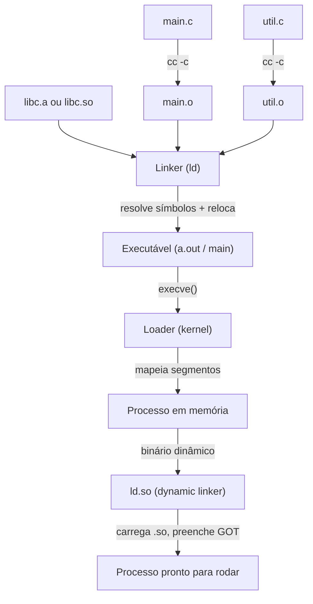
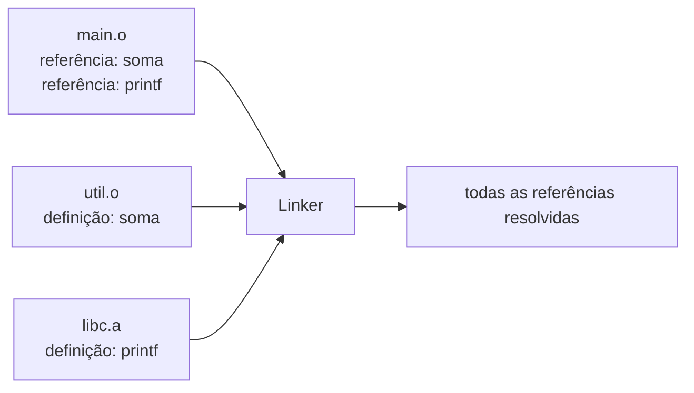
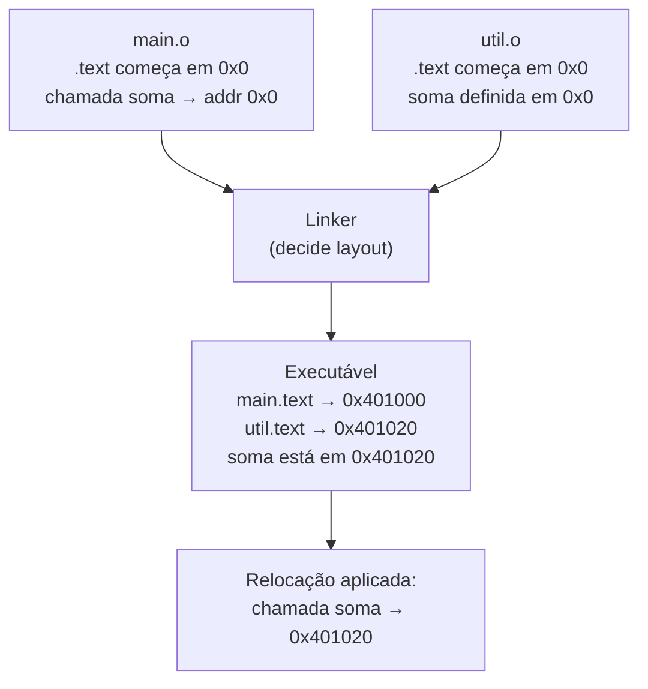
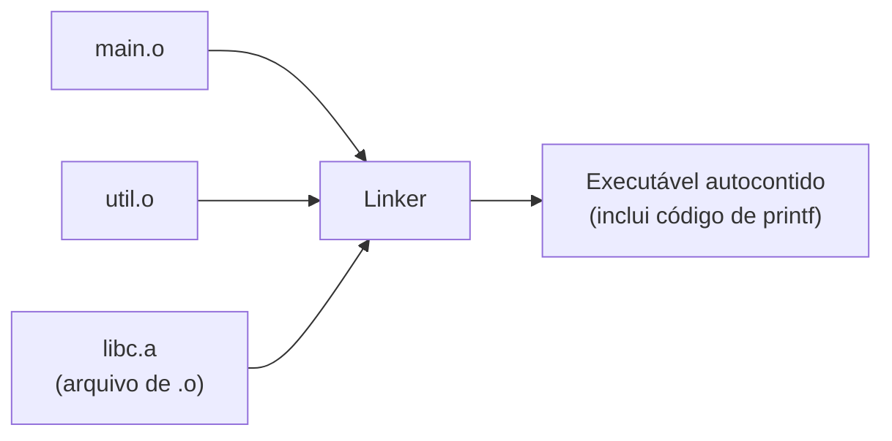
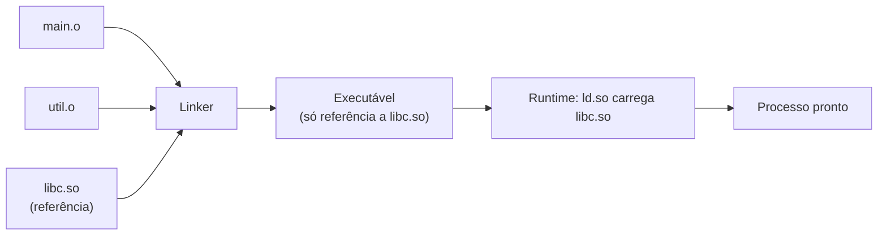
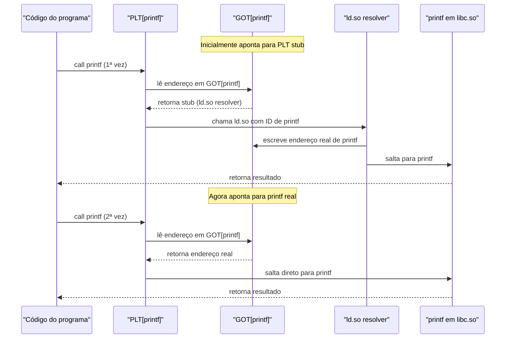

# Linking e loading

> [!abstract] TL;DR
> O compilador transforma cada arquivo-fonte em um arquivo-objeto independente. O **linker** junta esses objetos — resolvendo símbolos e reposicionando endereços — num executável. O **loader** (e, para binários dinâmicos, o dynamic linker `ld.so`) traz esse executável à vida na memória. Entender esse pipeline é a diferença entre decifrar "undefined reference" em 10 segundos ou perder uma tarde.

---

## Onde paramos — o problema da compilação separada

Na nota [[13 - Geração de código e seleção de instruções]] o back-end emitiu código de máquina para um único arquivo-fonte. Mas qualquer programa real tem dezenas ou centenas de arquivos `.c`, mais funções de bibliotecas padrão, mais bibliotecas de terceiros. Como tudo isso vira um único binário executável?

A resposta histórica é a **compilação separada**: cada arquivo `.c` é compilado de forma independente, produzindo um arquivo-objeto (`.o` no Linux/macOS, `.obj` no Windows). Isso tem vantagens concretas:

- **Build incremental**: alterei apenas `util.c`? Recompilo só `util.c`. O resto dos `.o` está intacto.
- **Reutilização**: uma biblioteca é um conjunto de `.o` pré-compilados. Você usa, não recompila.
- **Isolamento**: a unidade de compilação não "vê" os outros arquivos. Isso força interfaces explícitas.

Pense no processo de build como uma linha de montagem de fábrica: cada estação (compilador) processa uma peça independente (`.c`) e entrega componentes prontos (`.o`). O linker é o montador final que encaixa todas as peças no produto acabado (executável). Sem essa separação, qualquer mudança em qualquer arquivo forçaria recompilar o projeto inteiro — inviável em bases de código com milhares de arquivos.

O problema é que cada `.o` foi compilado **sem saber** onde as outras peças vão parar na memória. Alguém precisa juntar tudo e resolver as referências cruzadas. Esse alguém é o **linker**.

---

## O arquivo-objeto — o que o compilador entrega

Um arquivo-objeto não é só código binário jogado num arquivo. Ele tem **estrutura**. No formato ELF (Linux), um `.o` é chamado de *relocatable object file* e contém:

| Seção | Conteúdo |
|---|---|
| `.text` | Código de máquina |
| `.data` | Variáveis globais inicializadas |
| `.bss` | Variáveis globais não-inicializadas (só tamanho, sem bytes no disco) |
| `.symtab` | Tabela de símbolos |
| `.rel.text` / `.rela.text` | Entradas de relocação para o código |
| `.rel.data` | Entradas de relocação para dados |

A **tabela de símbolos** é o coração. Ela lista:

- **Símbolos definidos**: funções e variáveis que **este** arquivo implementa (ex.: `main`, `soma`).
- **Símbolos indefinidos**: funções e variáveis que **este** arquivo usa mas não implementa (ex.: `printf`, uma função de outro módulo).

Pense no `.o` como um capítulo de livro com notas de rodapé que dizem "veja capítulo X para a definição de Y". O linker é o editor que resolve todas essas notas de rodapé.

```c
// arquivo: main.c
#include <stdio.h>

extern int soma(int a, int b);  // declaração — símbolo indefinido

int main(void) {
    int r = soma(3, 4);         // referência a símbolo externo
    printf("resultado: %d\n", r); // outra referência externa
    return 0;
}
```

```c
// arquivo: util.c
int soma(int a, int b) {        // definição — símbolo definido
    return a + b;
}
```

Ao compilar `main.c`, o compilador emite código onde as chamadas a `soma` e `printf` são **espaços em branco** — endereços zerados, com entradas de relocação dizendo "aqui vai o endereço de `soma`". Cabe ao linker preencher.

---

## O fluxo completo: do .c ao processo



> [!info] Leitura do diagrama
> Cada seta é uma fase distinta do pipeline de build e carga. As fases até "Executável" ocorrem em **tempo de build**. A partir de "execve()" tudo ocorre em **tempo de execução**. O `ld.so` só entra para binários dinamicamente linkados.

---

## As duas tarefas do linker

### Tarefa 1 — Resolução de símbolos (symbol resolution)

O linker varre todos os `.o` (e bibliotecas) na ordem em que foram fornecidos e tenta casar cada **referência** a um símbolo externo com a sua **definição**.



> [!info] Leitura do diagrama
> O linker mantém um conjunto de símbolos não-resolvidos. A cada novo `.o` ou `.a` processado, ele tenta resolver pendências. Ao final, se o conjunto não estiver vazio, o build falha.

**Símbolos fortes × símbolos fracos**

- **Forte**: função definida normalmente ou variável global inicializada. Só pode haver uma definição.
- **Fraco**: variável global não-inicializada ou função marcada com `__attribute__((weak))`. Se houver um símbolo forte com o mesmo nome, o fraco é ignorado. Dois fracos → o linker escolhe um arbitrariamente (comportamento perigoso).

**Erros comuns:**

> [!danger] Undefined reference
> ```
> ld: undefined reference to 'soma'
> ```
> Símbolo referenciado mas nunca definido em nenhum dos `.o` ou bibliotecas passados. Causa típica: esqueceu de compilar `util.o`, ou a ordem dos argumentos está errada (`ld` processa da esquerda para a direita).

> [!danger] Multiple definition
> ```
> ld: multiple definition of 'soma'; util.o and extra.o
> ```
> Dois símbolos fortes com o mesmo nome. Causa típica: uma função foi definida em dois arquivos distintos, ou um `.h` com corpo de função foi incluído em dois `.c`.

### Tarefa 2 — Relocação (relocation)

Cada `.o` foi gerado assumindo que seus dados e código começam no endereço **0x0**. Ao juntar vários `.o`, o linker precisa:

1. Decidir o **layout de memória**: onde a `.text` de `main.o` começa, onde a `.text` de `util.o` vem logo depois, etc.
2. Corrigir todas as referências no código que usavam endereços relativos a 0.

As **entradas de relocação** (`rel.text`) dizem exatamente o que corrigir: "no offset X do código, há uma referência ao símbolo Y; substitua pelo endereço final de Y".



> [!info] Leitura do diagrama
> Antes da relocação, os endereços nos `.o` são placeholders. Depois, o linker corrige cada placeholder com o endereço final calculado no executável.

**Exemplo concreto** — suponha que `main.o` tem, no offset 0x10, uma instrução de chamada que usa endereço 0x0 para `soma`. O linker decide que `soma` ficará em 0x401020. Ele lê a entrada de relocação, vai até o offset 0x10 de `main.o` e substitui o placeholder por 0x401020 (ou pelo deslocamento relativo equivalente, dependendo do tipo de relocação).

```text
Entradas de relocação em main.o:
  offset: 0x11  type: R_X86_64_PC32  symbol: soma  addend: -4
  → "no offset 0x11 do .text, escreva o endereço PC-relativo de 'soma'"
```

---

## Static × Dynamic Linking

### Ligação estática



> [!info] Leitura do diagrama
> A biblioteca estática `.a` é um arquivo de `.o`. O linker copia apenas os `.o` necessários para dentro do executável final. O resultado é um binário autocontido — sem dependências externas em tempo de execução.

Uma biblioteca estática (`.a` no Linux, `.lib` no Windows) é basicamente um arquivo compactado de `.o`. O linker copia para o executável apenas os objetos de que o programa precisa — não a biblioteca inteira.

> [!tip] Quando usar ligação estática
> Contêineres minimalistas (busybox-style), binários distribuídos para sistemas com dependências incertas, ou quando você precisa de reprodutibilidade absoluta. Go usa ligação estática por padrão.

### Ligação dinâmica

O executável não copia o código da biblioteca. Em vez disso, guarda uma **referência** (nome + versão) à biblioteca compartilhada. A ligação acontece em **tempo de execução**.



> [!info] Leitura do diagrama
> O executável gerado é menor — contém metadados sobre quais `.so` precisa, não o código delas. O `ld.so` resolve e carrega as bibliotecas no momento em que o processo inicia.

**Vantagens da ligação dinâmica:**

- Executável menor em disco.
- A `.so` é **compartilhada na memória** entre todos os processos que a usam (o segmento `.text` é read-only e pode ser mapeado uma vez só).
- Atualizar a biblioteca (ex.: corrigir bug de segurança no `libssl.so`) beneficia todos os executáveis que a usam — sem recompilar.

> [!danger] DLL Hell / Dependency Hell
> O sistema tem `libfoo.so.1.2` mas o executável precisava de `libfoo.so.1.3`. Ou dois programas precisam de versões incompatíveis. O Linux mitiga isso com o mecanismo de **soname**: a `.so` carrega um nome canônico (ex.: `libssl.so.3`) e um symlink aponta para a versão exata em disco. Ainda assim, distribuir um binário para outro sistema continua sendo uma fonte clássica de dor.

---

## O Loader e o Dynamic Linker

### O que o loader faz

Quando você executa `./main`, o kernel processa a syscall `execve`. Ele lê o cabeçalho ELF do executável e mapeia os **segmentos** para o espaço de endereço do processo:

- Segmento de código (`.text`) → mapeado como read+execute.
- Segmento de dados (`.data`, `.bss`) → mapeado como read+write.

A fronteira com [[03-Dominios/Fundamentos/Sistemas Operacionais/index|Sistemas Operacionais]] está aqui: como o kernel gerencia memória virtual, paginação e a estrutura do espaço de endereço é assunto do SO. O que importa para o toolchain é que o loader **interpreta o ELF** e monta o processo.

### O dynamic linker — ld.so

Para executáveis dinamicamente linkados, o ELF lista um **interpreter** (campo `PT_INTERP`), que é o caminho do dynamic linker — tipicamente `/lib64/ld-linux-x86-64.so.2`. O kernel carrega o `ld.so` antes mesmo de transferir controle ao `main`.

O `ld.so` então:

1. Lê a lista de `.so` necessárias (seção `.dynamic`, tags `DT_NEEDED`).
2. Localiza cada `.so` (busca em `LD_LIBRARY_PATH`, `/etc/ld.so.cache`, caminhos padrão).
3. Mapeia cada `.so` na memória.
4. Resolve símbolos entre o executável e as `.so`.

### Lazy binding via PLT/GOT

Resolver todos os símbolos das bibliotecas no início do processo levaria tempo mesmo para símbolos nunca chamados. A solução é o **lazy binding**: adiar a resolução de cada função para a primeira chamada.

Os dois atores são:

- **GOT (Global Offset Table)**: tabela de ponteiros em memória read-write. Cada entrada guarda o endereço real de um símbolo externo (depois de resolvido) ou um stub temporário (antes).
- **PLT (Procedure Linkage Table)**: tabela de pequenos trechos de código read-only, um por função externa. A chamada do programa vai para o PLT, não direto para a função.



> [!info] Leitura do diagrama
> Na primeira chamada, o PLT invoca o resolver do `ld.so`, que preenche o GOT com o endereço real. Nas chamadas seguintes, o GOT já tem o endereço e o PLT salta direto — overhead zero.

### Position-Independent Code (PIC) e ASLR

Para que múltiplos processos compartilhem a mesma `.so` mapeada em endereços diferentes, o código da biblioteca precisa funcionar em **qualquer endereço**. Isso é o **PIC**: o código usa endereços relativos ao próprio PC (Program Counter), nunca absolutos. O GOT serve como âncora: o código acessa dados externos via GOT, e o `ld.so` ajusta o GOT para cada processo.

O **ASLR (Address Space Layout Randomization)** aleatoriza o endereço base onde bibliotecas e heap são mapeados a cada execução. PIC é pré-requisito para ASLR funcionar em bibliotecas — mais um elo entre o toolchain e a segurança (veja [[03-Dominios/Fundamentos/Sistemas Operacionais/index|Sistemas Operacionais]]).

> [!warning] RELRO e hardening do GOT
> O GOT precisa ser gravável em runtime (o `ld.so` preenche entradas). Isso o torna um alvo em ataques de corrupção de memória: sobrescrever uma entrada do GOT redireciona chamadas de função. A mitigação é o **RELRO** (*Relocation Read-Only*): na forma *Full RELRO*, o `ld.so` resolve **todos** os símbolos antes de `main` e então marca o GOT como read-only. O custo é o abandono do lazy binding — todos os símbolos são resolvidos no startup.

---

## Formatos de arquivo-objeto

Cada sistema operacional tem seu formato canônico:

| Formato | Sistema | Extensões |
|---|---|---|
| ELF (Executable and Linkable Format) | Linux, BSD, Solaris | `.o`, `.so`, sem extensão para executáveis |
| PE (Portable Executable) | Windows | `.obj`, `.dll`, `.exe` |
| Mach-O | macOS, iOS | `.o`, `.dylib`, sem extensão |

O foco aqui é o **ELF**, por ser o mais estudado e documentado.

Um ELF tem dois "modos de leitura":

- **Visão de link** (para o linker): lê a **Section Header Table** e trabalha com seções (`.text`, `.data`, `.symtab`, `.rela.text`…).
- **Visão de execução** (para o loader): lê o **Program Header Table** e trabalha com segmentos (conjunto de seções com mesmas permissões, mapeado de uma vez).

```text
ELF Header
  ├── e_type: ET_EXEC (executável) ou ET_REL (.o) ou ET_DYN (.so)
  ├── e_entry: endereço do _start (ponto de entrada)
  ├── e_phoff: offset da Program Header Table
  └── e_shoff: offset da Section Header Table

Program Header Table (segmentos, para o loader):
  ├── PT_LOAD [r-x]: .text   → segmento de código
  ├── PT_LOAD [rw-]: .data + .bss → segmento de dados
  ├── PT_DYNAMIC: informações para o ld.so
  └── PT_INTERP: caminho do dynamic linker

Section Header Table (seções, para o linker/debugger):
  ├── .text, .rodata, .data, .bss
  ├── .symtab, .strtab, .debug_*
  └── .rel.text / .rela.text
```

> [!example] Inspecionando um ELF
> ```bash
> readelf -h main          # cabeçalho ELF
> readelf -S main          # tabela de seções
> readelf -l main          # tabela de segmentos (program headers)
> nm main                  # tabela de símbolos
> objdump -d main          # disassembly do .text
> ldd main                 # bibliotecas dinâmicas necessárias
> ```

---

## Erro de link ≠ erro de compilação

Essa distinção importa tanto em entrevistas quanto no dia a dia.

- **Erro de compilação**: ocorre ao processar *um* arquivo-fonte. O compilador detecta problema de sintaxe, tipo incompat, uso de variável não declarada. O problema é local e a mensagem aponta a linha exata.

- **Erro de link**: ocorre ao *juntar* os objetos. O linker não sabe de sintaxe — ele só trabalha com símbolos e endereços. Os erros típicos são "undefined reference" (símbolo não encontrado em nenhum objeto) e "multiple definition" (símbolo definido mais de uma vez).

```text
Compilação separada:
  gcc -c main.c   → OK  (compilador não verifica se soma existe)
  gcc -c util.c   → OK

Linkagem:
  gcc main.o util.o → OK  (linker encontra soma em util.o)
  gcc main.o        → FALHA: undefined reference to 'soma'
```

Conectando ao [[18 - Capstone - compiladores na vida do dev]]: quando você recebe um erro, a fase onde ele aparece diz muito sobre a causa. "sintaxe" → compilação; "undefined reference" → linkagem; "segmentation fault" → execução (provavelmente [[15 - Runtime, stack frames e gestão de memória]]).

> [!warning] A armadilha da ordem de argumentos no linker
> O linker `ld` (e o `gcc` ao invocar o linker) processa arquivos e bibliotecas **da esquerda para a direita**, em uma passagem. Se você escreveu `gcc -lm main.o`, o linker vai processar `libm.a` antes de ver que `main.o` precisa de `sin()` — e não vai resolver a referência. O correto é `gcc main.o -lm`: primeiro o objeto que cria a demanda, depois a biblioteca que supre. Esse comportamento pegou gerações inteiras de programadores de surpresa.

> [!example] Diagnóstico rápido com nm e ldd
> ```bash
> # Quais símbolos main.o precisa e quais define?
> nm -u main.o        # símbolos indefinidos (U = undefined)
> nm -D libfoo.so     # símbolos exportados por uma .so
>
> # Quais .so um executável precisa?
> ldd ./main
> #   linux-vdso.so.1 => (memória virtual do kernel)
> #   libc.so.6 => /lib/x86_64-linux-gnu/libc.so.6
>
> # Por que uma .so não está sendo encontrada?
> LD_DEBUG=libs ./main 2>&1 | head -30
> ```

---

## LTO — Link-Time Optimization

A nota [[12 - Otimização]] mostrou otimizações que o compilador faz dentro de um arquivo. Mas e otimizações *entre* arquivos? Se `main.c` chama `soma()` de `util.c`, o compilador de `main.c` nunca viu o corpo de `soma` — não pode fazer *inlining* cross-file.

O **LTO (Link-Time Optimization)** resolve isso: em vez de emitir código de máquina nos `.o`, o compilador emite uma **representação intermediária** (IR — LLVM IR ou GIMPLE no GCC). O linker, ao receber `.o` com IR, faz a otimização de **todo o programa** de uma vez, com visibilidade total.

Efeitos práticos do LTO:

- **Inlining cross-file**: funções pequenas de outros módulos são inlineadas.
- **Dead code elimination global**: funções exportadas mas nunca chamadas são removidas.
- **Constant propagation cross-file**: constantes de um módulo propagam para chamadores em outros módulos.

Custo: o build fica muito mais lento (o linker faz trabalho de compilador). Em projetos grandes, usa-se **Thin LTO** (LLVM), que paraleliza a otimização por módulo com um sumário global.

```bash
# Ativar LTO com GCC:
gcc -O2 -flto main.c util.c -o main

# Ativar Thin LTO com Clang:
clang -O2 -flto=thin main.c util.c -o main
```

> [!tip] LTO em produção
> Projetos como o kernel Linux, Firefox e Chrome usam LTO em builds de release. O ganho típico de desempenho é 5-15% sobre binários sem LTO.

Como o LTO funciona na prática: em vez de emitir código nativo no `.o`, o compilador emite um **bitcode** (LLVM IR) ou GIMPLE (GCC). O linker detecta que os `.o` contêm IR, chama o otimizador de backend com visibilidade de todos os módulos de uma vez, e só então emite o código de máquina final. Para o desenvolvedor, a interface é transparente — basta adicionar `-flto` nas flags de compilação e linkagem.

**Cuidado com símbolos usados por código externo**: LTO pode eliminar funções "mortas" do ponto de vista do binário, mas que são de fato chamadas via `dlopen`/`dlsym` em runtime. Para esses casos, marque os símbolos com `__attribute__((visibility("default")))` ou use um linker script para mantê-los.

---

## Conexões

- Anterior: [[18 - Capstone - compiladores na vida do dev]] — fase onde erros de link se encaixam no ciclo de vida do dev.
- Próxima: [[20 - Bootstrapping, self-hosting e o ataque de Thompson]] — o compilador que compila a si mesmo, e por que isso importa para a confiança.
- [[13 - Geração de código e seleção de instruções]] — o back-end que produziu os `.o` que o linker recebe.
- [[12 - Otimização]] — LTO estende as otimizações do compilador ao tempo de link.
- [[15 - Runtime, stack frames e gestão de memória]] — o que acontece dentro do processo depois que o loader terminou.
- [[03-Dominios/Fundamentos/Sistemas Operacionais/index|Sistemas Operacionais]] — memória virtual, mapeamento de segmentos, syscall `execve`, ASLR como mecanismo do SO.

> [!summary] Resumo em uma linha
> O linker resolve símbolos e reloca endereços para juntar objetos num executável; o loader (e o `ld.so`) traz esse executável à memória e, para binários dinâmicos, completa a ligação em runtime via PLT/GOT.

---

## Em entrevista

Linking e loading aparecem em perguntas de sistemas, debugging e arquitetura. A distinção compilação/link é cobrada em entrevistas de SRE e backend sênior. PLT/GOT aparece em perguntas de segurança (análise de binários, bypass de ASLR).

*What's the difference between a compile error and a linker error?* A compile error is detected per-file: syntax, type mismatch, undeclared identifiers. A linker error occurs when joining objects: undefined reference (symbol missing) or multiple definition (symbol defined twice).

*What is "undefined reference to X"?* The linker could not find a definition for symbol X in any of the provided object files or libraries. Common causes: missing object file, wrong library order, missing `-l` flag.

*What is the difference between static and dynamic linking?* Static linking copies library code into the executable at build time, producing a self-contained binary. Dynamic linking keeps only a reference; the OS loads the shared library at runtime, allowing multiple processes to share the same library in memory.

*What does the dynamic linker (ld.so) do?* It maps required shared libraries into the process address space, performs symbol resolution between the executable and libraries, and (for lazily bound symbols) patches the GOT on first call.

*What is lazy binding and why does it exist?* Lazy binding defers symbol resolution to the first call, via the PLT/GOT indirection, avoiding the startup cost of resolving all external symbols upfront.

*What is PIC and why do shared libraries require it?* Position-Independent Code uses PC-relative addressing so that the same `.so` binary can be mapped at any virtual address in any process, enabling both sharing and ASLR.

*What is LTO and when would you enable it?* Link-Time Optimization allows the compiler to optimize across translation unit boundaries (inlining, dead-code elimination) at link time, at the cost of slower builds.

*What is the difference between ELF sections and segments?* Sections are the linker's view (`.text`, `.data`, `.symtab`…); segments are the loader's view (groups of sections with the same memory permissions, mapped as a unit via `PT_LOAD`).

### Vocabulário PT → EN

| Português | Inglês |
|---|---|
| Ligação | Linking |
| Carregamento | Loading |
| Vinculador / ligador | Linker |
| Carregador | Loader |
| Resolução de símbolos | Symbol resolution |
| Relocação | Relocation |
| Ligação estática | Static linking |
| Ligação dinâmica | Dynamic linking |
| Biblioteca compartilhada | Shared library |
| Biblioteca estática | Static library / archive |
| Símbolo indefinido | Undefined symbol |
| Ligação tardia / lazy | Lazy binding |
| Tabela de deslocamentos globais | Global Offset Table (GOT) |
| Tabela de ligação de procedimentos | Procedure Linkage Table (PLT) |
| Código independente de posição | Position-Independent Code (PIC) |
| Otimização em tempo de ligação | Link-Time Optimization (LTO) |

> [!info] Lastro
> - Bryant, R. E. & O'Hallaron, D. R. *Computer Systems: A Programmer's Perspective* (CS:APP), 3ª ed., Pearson, 2015 — Capítulo 7 "Linking" é a fonte principal desta nota. Site oficial: [csapp.cs.cmu.edu](https://csapp.cs.cmu.edu/)
> - Levine, J. R. *Linkers and Loaders*. Morgan Kaufmann, 1999. Referência clássica e definitiva sobre o assunto. [amazon.com](https://www.amazon.com/Linkers-Kaufmann-Software-Engineering-Programming/dp/1558604960)
> - Tool Interface Standard (TIS), *Executable and Linkable Format (ELF) Specification*, Version 1.2, 1995. Spec original do ELF, disponível em [cs.cmu.edu/afs/cs/academic/class/15213-f00/docs/elf.pdf](https://www.cs.cmu.edu/afs/cs/academic/class/15213-f00/docs/elf.pdf)
> - Linux man page: `ld.so(8)` — documentação do dynamic linker/loader. [man7.org/linux/man-pages/man8/ld.so.8.html](https://man7.org/linux/man-pages/man8/ld.so.8.html)
> - Haber, A. "Executable and Linkable Format 101 — Part 1: Sections and Segments". Intezer Blog. [intezer.com/blog/executable-and-linkable-format-101-part-1-sections-and-segments/](https://intezer.com/blog/executable-and-linkable-format-101-part-1-sections-and-segments/)
> - "PLT and GOT — the key to code sharing and dynamic libraries". technovelty.org. [technovelty.org/linux/plt-and-got-the-key-to-code-sharing-and-dynamic-libraries.html](https://www.technovelty.org/linux/plt-and-got-the-key-to-code-sharing-and-dynamic-libraries.html)
