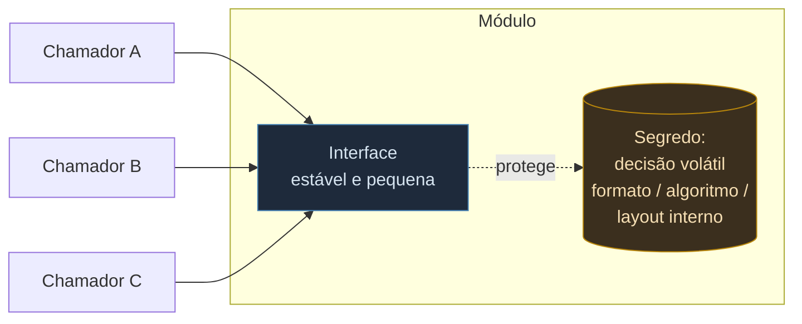
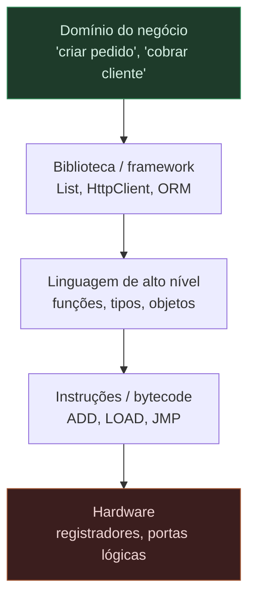
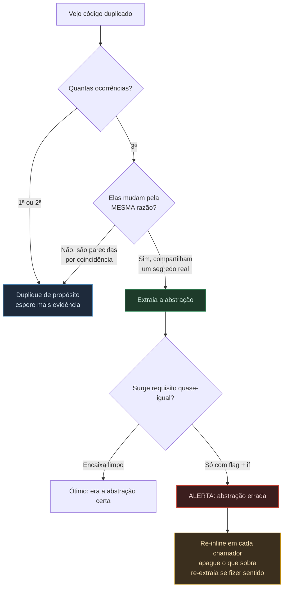

# Abstração - a ferramenta central

Se a complexidade é *o* problema deste galho ([[01 - A complexidade como problema central]]), a abstração é a ferramenta principal pra combatê-la. Não uma entre várias — *a* principal. Quase todo outro mecanismo de design (modularidade, encapsulamento, interfaces) é abstração aplicada de um jeito específico.

> [!abstract] TL;DR
> Abstração é uma **visão simplificada** que omite o detalhe irrelevante pra você raciocinar sobre o sistema sem ter tudo na cabeça ao mesmo tempo (Ousterhout: *"an abstraction is a simplified view of an entity, which omits unimportant details"*). Ela não te deixa **vago** — te dá um **novo nível semântico** em que dá pra ser preciso (Dijkstra). O critério do que esconder veio de **Parnas (1972)**: esconda **decisões de design propensas a mudar** — não "dados" genéricos, e não os passos de um fluxograma. Cada módulo guarda um *segredo* (uma decisão volátil); quando ela muda, a mudança fica local. Cuidado com a confusão central: **abstração não é indireção** — adicionar uma camada só abstrai se de fato **reduzir o que o chamador precisa saber**, senão é pedágio. E o contraponto sênior: a abstração **errada** custa mais caro que a duplicação que ela tentou eliminar (Metz). Prefira duplicar até a abstração certa se revelar (regra de três).

## O que é

A definição operacional vem de **John Ousterhout**, o mesmo autor que deu a definição de complexidade na nota de abertura:

> [!quote] Definição de abstração
> *"In modular programming, an abstraction is a simplified view of an entity, which omits unimportant details."*
> — John Ousterhout, *A Philosophy of Software Design*

Repare nos dois verbos escondidos: a abstração **suprime** detalhe (o que não importa) pra **amplificar** o que importa. É um filtro deliberado. Quando você usa uma `List`, você raciocina com "adiciona no fim, pega pelo índice" e ignora se por baixo é array dinâmico ou lista encadeada — esse detalhe foi suprimido de propósito, e graças a isso você consegue pensar no seu problema, não no da estrutura de dados.

Por que isso ataca a complexidade na raiz? Porque a memória de trabalho humana é finita (a *cognitive load* da nota 01). Você não consegue segurar um sistema inteiro na cabeça. A abstração é o que te permite raciocinar sobre uma parte **sem** carregar as outras — você confia na interface e esquece a implementação. Sem abstração, todo o sistema é um só nível, e nenhum cérebro cabe nele.

> [!note] O que a abstração ataca — e o que não consegue atacar
> A abstração é a arma principal contra a complexidade **acidental** (a que vem das ferramentas e da representação, não do problema). Ela não elimina a complexidade **essencial** — a que é inerente ao domínio: nenhuma interface enxuta faz com que cobrar imposto deixe de ter cem regras. O que a boa abstração faz é **organizar** a complexidade essencial em níveis em que você lida com um pedaço por vez, e **dissolver** a acidental que você mesmo criou. Por isso ela é central sem ser milagrosa — fronteira detalhada em [[02 - Complexidade essencial vs. acidental]] (Brooks, *No Silver Bullet*).

> [!note] A abstração tem dois lados
> Toda abstração tem uma **interface** (o que você precisa saber pra usá-la) e uma **implementação** (tudo que ela esconde). A arte está em manter a interface pequena e estável enquanto a implementação faz o trabalho pesado. Guarde essa tensão: ela volta com força em [[07 - Módulos profundos e rasos]], onde vira o critério pra dimensionar um módulo.

### Abstrair não é ficar vago — é mudar de nível

Há um mal-entendido perigoso embutido na palavra "abstrato": no uso comum, *abstrato* é sinônimo de *vago, impreciso, nebuloso*. Em software é o **oposto**. Quem cunhou a formulação definitiva foi **Edsger Dijkstra**:

> [!quote] Dijkstra sobre o propósito da abstração
> *"The purpose of abstraction is not to be vague, but to create a new semantic level in which one can be absolutely precise."*
> — Edsger W. Dijkstra, *EWD 356* (Grenoble, dez. 1972)

Leia com calma. A abstração não apaga informação pra te deixar na dúvida; ela **cria uma nova camada de vocabulário** em que você fala com precisão *outra* — uma precisão de nível mais alto. Quando você diz `lista.ordenar()`, não está sendo vago sobre o algoritmo: está sendo **exato** num nível onde "ordenar" é uma operação atômica e bem definida, e o algoritmo simplesmente não pertence a esse nível de discurso. Trocar de nível semântico é o movimento; perder precisão seria o defeito.

Repare que Dijkstra publica isso no **mesmo mês e ano** em que Parnas publica o critério de information hiding (dez. 1972). Não é coincidência: 1972 é o ano em que a ideia de que *programar é construir torres de níveis de abstração* amadurece como disciplina. Dijkstra dá o **porquê** (criar níveis precisos); Parnas dá o **como escolher a fronteira** (esconder o volátil).

## Information hiding: esconder a decisão que vai mudar

A pergunta seguinte é inevitável: **o que** uma abstração deve esconder? Esconder qualquer coisa não basta — esconder a coisa errada é pior que não esconder nada.

A resposta canônica é de **David Parnas**, no clássico *On the Criteria To Be Used in Decomposing Systems into Modules* (CACM 15(12), 1972). O critério dele é cirúrgico:

> [!quote] O critério de Parnas
> Cada módulo deve **esconder uma decisão de design propensa a mudar** — não "esconder dados" em abstrato, e não decompor o sistema pelos **passos do fluxograma**.

Duas negações fazem todo o peso aqui:

- **Não é "esconder dados".** Esconder o tipo de um campo é encapsulamento de superfície. O que Parnas quer esconder é a **decisão**: o formato do arquivo, o algoritmo de ordenação, a representação interna de uma tabela. Dado é consequência; a decisão é a causa.
- **Não é decompor por etapas.** A intuição ingênua manda dividir o programa pelos passos da execução (leia entrada → processe → escreva saída), um módulo por etapa. Parnas mostra que isso é frágil: cada módulo conhece detalhes dos outros, e mudar uma decisão respinga em todos. A decomposição boa é por **segredo** — cada módulo guarda uma decisão volátil e expõe só uma interface estável sobre ela.

O ganho concreto: quando a decisão escondida muda (e decisões voláteis *vão* mudar), a mudança fica **contida** dentro do módulo que a guardava. Os clientes não percebem. Compare com a nota 01: isso é atacar diretamente a **change amplification** — em vez de a mudança respingar em vinte arquivos, ela mora num só.

### O exemplo do próprio Parnas: o índice KWIC

Parnas não argumenta no abstrato — ele pega um programinha de brinquedo, o **KWIC** (*Key Word In Context*), e o decompõe de **duas** formas pra contrastá-las. O KWIC recebe linhas de texto, gera todas as rotações circulares de cada linha (tirar a primeira palavra e jogá-la no fim, repetidamente) e imprime tudo em ordem alfabética.

- **Decomposição 1 — por etapas do fluxograma.** Um módulo lê a entrada, outro gera as rotações, outro alfabetiza, outro imprime. Parece organizado, mas é uma armadilha: *todos* os módulos compartilham o conhecimento de **como as linhas estão armazenadas na memória** (qual array, qual layout de caracteres). Mude essa decisão de armazenamento — por exemplo, pra economizar memória guardando índices em vez de copiar caracteres — e você toca em **todos** os módulos de uma vez.
- **Decomposição 2 — por segredo.** Aqui aparece um módulo `Line Storage` cujo **único** trabalho é guardar o segredo "como os caracteres ficam dispostos na memória". Os outros módulos não sabem nada do layout: pedem "me dá a i-ésima palavra da j-ésima linha" e recebem. Trocar a representação interna agora mexe **só** dentro de `Line Storage`.

> [!example] O segredo, isolado num módulo
> Na segunda decomposição, cada módulo é caracterizado por *uma* decisão de design que ele esconde dos demais. `Line Storage` esconde o layout dos caracteres; o módulo de circular shifts esconde *como* as rotações são computadas (calculadas na hora? pré-materializadas?); o alfabetizador esconde o algoritmo de ordenação. Cada segredo é uma alavanca que você pode mexer sem o sistema inteiro saber.

A lição que atravessou meio século: a decomposição que **parece** mais natural (seguir o fluxo de execução) é justamente a que mais espalha conhecimento — e portanto a mais frágil a mudanças. A decomposição boa contraria a intuição: ela agrupa por **o que precisa ser escondido**, não por **o que acontece primeiro**.

Abaixo, o desenho do information hiding em uma fronteira: o chamador depende só da interface; o segredo volátil fica trancado atrás dela.

*Leitura do diagrama:* os chamadores tocam apenas a interface (caixa azul); o segredo (caixa âmbar) — a decisão que vai mudar — fica selado atrás dela, de modo que trocá-lo não chega a ninguém de fora.

> [!tip] A pergunta de projeto que isso te dá
> Diante de um módulo, pergunte: *"que decisão propensa a mudar este módulo protege?"* Se você não consegue nomear o segredo, provavelmente não há abstração ali — só código agrupado por acaso. E se o segredo vaza pela interface (nomes, tipos, ordem de chamadas que denunciam a implementação), a troca futura da decisão quebra os clientes.

## Abstração ≠ indireção

Aqui mora o erro mais comum, e vale uma seção inteira: **adicionar uma camada não é, por si só, abstrair.**

Indireção é interpor algo entre o chamador e o trabalho (uma função que chama outra, uma interface com um único implementador, um wrapper). Abstração é **reduzir o que o chamador precisa saber**. As duas coisas costumam andar juntas, mas não são a mesma — e confundi-las produz arquitetura ruim.

Ousterhout dá nome ao caso patológico: o **shallow module** (módulo raso) e o método *pass-through* — uma camada cuja interface é tão complicada quanto o que ela entrega, que repassa a chamada pra baixo sem esconder nada. Você teve o custo de mais uma camada (mais um nome pra aprender, mais um arquivo pra abrir, mais um salto pra seguir no debug) **sem** o benefício de esconder complexidade. O saldo é negativo: a indireção *adicionou* carga cognitiva em vez de reduzi-la.

> [!example] Indireção que não abstrai
> Um `UserService.getUser(id)` que só faz `return userRepository.findById(id)` — mesma assinatura, mesmos parâmetros, mesmo retorno, nenhuma decisão escondida. A camada existe, mas o chamador precisa saber exatamente o que precisaria sem ela. É indireção pura: custo de salto, benefício zero. Vira abstração de verdade só quando passa a *esconder* algo (cache, autorização, montagem de um agregado, tradução de erros) que o chamador deixa de carregar.

O teste é simples: **depois da camada, o chamador precisa saber menos?** Se sim, você abstraiu. Se ele precisa saber o mesmo (ou mais — porque agora tem que entender a camada *e* o que há embaixo), você só empilhou indireção. "Adicionar um nível de indireção resolve qualquer problema" é piada de programador justamente porque o nível mal-colocado *cria* problema.

## Níveis de abstração: torres que escondem o andar de baixo

Volte ao "novo nível semântico" de Dijkstra. Um sistema inteiro de software é uma **torre** desses níveis, e cada andar tem uma propriedade mágica: ele esconde o andar de baixo. Você programa em uma linguagem de alto nível e quase nunca pensa em registradores; usa um banco de dados e não pensa em setores de disco; chama uma API HTTP e não pensa em pacotes TCP. Cada nível **assume** que o de baixo funciona e fala um vocabulário mais próximo do seu problema.

*Leitura do diagrama:* cada nível depende do de baixo, mas só pela interface — quem escreve regra de negócio (topo) raciocina com "pedido" e "cliente" e legitimamente ignora registradores (base); a torre só funciona porque cada andar esconde o anterior.

O poder disso é que você só precisa segurar **um andar** na cabeça por vez. O perigo é que andares mal-construídos vazam — e quando vazam, você é obrigado a descer de nível pra entender um bug, perdendo justamente a proteção que a torre prometia. Esse fenômeno tem nota própria: [[06 - Abstrações que vazam]].

> [!note] Nível de abstração ≠ "alto/baixo nível" como elogio
> "Alto nível" não quer dizer "melhor" — quer dizer "mais distante do hardware, mais perto do domínio". Cada nível existe pra um público. O erro clássico é **misturar níveis no mesmo módulo** (uma função que monta SQL cru *e* decide regra de negócio *e* formata HTML): ela obriga você a pensar em três andares ao mesmo tempo, anulando a torre. Manter cada unidade em **um** nível de abstração é metade do que se chama "código limpo".

## Abstração por especificação: o que, não o como (Liskov)

Parnas diz *o que* esconder (a decisão volátil). **Barbara Liskov** — criadora dos tipos abstratos de dados (ADTs) na linguagem **CLU**, no clássico *Programming with Abstract Data Types* (Liskov & Zilles, 1974) — formaliza *como* se descreve uma abstração sem revelar seu interior. Ela nomeia dois mecanismos complementares:

- **Abstração por parametrização.** Você abstrai da *identidade* dos dados trocando-os por parâmetros. Um único texto de programa passa a representar um conjunto potencialmente infinito de computações. É o que faz `max(a, b)` valer pra quaisquer dois números, não só pra dois específicos.
- **Abstração por especificação.** Você abstrai dos *detalhes de implementação* (o **como**) para o **comportamento** em que o usuário pode confiar (o **quê**). A especificação isola os módulos uns dos outros: exige-se apenas que a implementação sustente o comportamento prometido — qualquer implementação que cumpra o contrato serve.

> [!abstract] A grande virada: protótipo da inversão de dependência
> A abstração por especificação inverte a relação natural. Sem ela, o cliente depende do **código** do módulo (e quebra quando o código muda). Com ela, o cliente depende da **especificação** — uma promessa textual — e fica livre da implementação. É a semente daquilo que décadas depois viraria o "D" do SOLID: dependa de abstrações, não de concretudes. Liskov estava dizendo isso, com outras palavras, em 1974.

Por que isso importa pra você na prática? Porque te dá o critério do que escrever na assinatura/docstring de um método: a especificação deve dizer **o que o método garante**, nunca **como ele faz**. No instante em que a doc menciona "usa um HashMap interno", o segredo vazou pra interface — e a abstração já começou frágil.

## Boas vs. más abstrações

Junte as duas ideias — visão simplificada (Ousterhout) + esconder a decisão volátil (Parnas) — e o critério de qualidade cai sozinho:

- **Boa abstração:** esconde os detalhes **certos** (o volátil, o irrelevante) atrás de uma interface **pequena e estável**. Ela mantém sua promessa: você usa a interface e legitimamente esquece o resto. Os melhores módulos, em Ousterhout, são **profundos** — muita funcionalidade atrás de uma interface enxuta (assunto da [[07 - Módulos profundos e rasos]]).
- **Má abstração (errada):** ou **esconde o que você precisa** (te força a contornar a interface, abrir a caixa, depender de detalhe interno), ou **vaza o que escondeu** (a decisão interna reaparece no comportamento observável). A interface grande relativa ao que entrega é o sintoma do módulo raso; o vazamento é o tema da nota vizinha.

> [!warning] Toda abstração é uma aposta
> Você aposta em *qual* decisão é volátil e *qual* é estável — e esconde a primeira atrás da segunda. Acertar a aposta é o que separa a abstração que envelhece bem da que vira pedágio. Quando a aposta erra (você expôs o que devia esconder, ou escondeu o que devia expor), a abstração trabalha contra você. E mesmo a melhor abstração não esconde *tudo* o tempo todo — onde e por que ela falha é o assunto inteiro de [[06 - Abstrações que vazam]].

Esta nota é a afirmação **positiva**: o que abstração é e por que ela é a ferramenta central. As duas notas seguintes a tensionam pelos limites — onde abstrações **vazam** ([[06 - Abstrações que vazam]]) e como **dimensionar** um módulo pra que a abstração seja profunda, não rasa ([[07 - Módulos profundos e rasos]]).

## A abstração errada: quando a cura é pior que a doença

Até aqui a abstração foi heroína. Hora do contraponto sênior — o que separa quem leu sobre abstração de quem já se queimou com ela. A tese é de **Sandi Metz**, no ensaio curto e devastador *The Wrong Abstraction* (2016):

> [!quote] Sandi Metz
> *"Duplication is far cheaper than the wrong abstraction"* — e, portanto: *"prefer duplication over the wrong abstraction."*

Como uma abstração nasce errada? Metz desenha o filme em câmera lenta, e ele é tão comum que dói reconhecer:

1. Programador A vê dois trechos duplicados, **extrai** o comum num método/classe, dá um nome, troca os dois usos pela abstração nova. Limpo. Elogiável. DRY.
2. Passa o tempo. Surge um requisito **quase** igual, mas não idêntico.
3. Programador B (que pode ser você seis meses depois) **se sente obrigado** a reusar a abstração que já existe. Em vez de questioná-la, adiciona um **parâmetro** e um **`if`** pra cobrir o caso novo.
4. Mais um requisito, mais um parâmetro, mais um branch. Repita.
5. O resultado: um método que mistura ideias que não têm nada a ver, recheado de flags e condicionais, ilegível. *"Embora cada chamador ostensivamente invoque uma abstração compartilhada, o código que eles de fato rodam é praticamente único."*
6. Ninguém ousa mexer, porque "já investimos tanto nisso". É a **falácia do custo afundado** (*sunk cost*) operando como força de design.

> [!warning] Por que a abstração errada custa mais que a duplicação
> A duplicação tem um custo **honesto e visível**: mudou a regra, você altera em N lugares. Chato, mas linear e óbvio. A abstração errada tem um custo **escondido e composto**: cada novo requisito te força a *torcer* uma estrutura que não foi feita pra ele, e cada torção dificulta a próxima. A duplicação você vê; a abstração errada você só sente — tarde demais, quando o módulo já virou um nó de condicionais.

O conselho de Metz é contraintuitivo e libertador: **"the fastest way forward is back"** (o caminho mais rápido pra frente é pra trás). Diante de uma abstração errada já instalada:

1. **Re-inline:** copie o código da abstração de volta pra dentro de cada chamador.
2. Em cada cópia, **apague o que aquele chamador não usa** (graças às flags, dá pra saber exatamente o quê).
3. Remova os parâmetros e condicionais que só existiam pra servir vários donos.
4. Agora, com o entendimento que você não tinha no dia 1, **re-extraia** a abstração certa — se ela ainda fizer sentido.

> [!tip] A regra de três: não abstraia cedo demais
> Como evitar criar a abstração errada? Espere ela aparecer. A **regra de três** ("*three strikes and you refactor*"), popularizada por **Martin Fowler** no *Refactoring* e atribuída a **Don Roberts**: a primeira vez você só escreve; na segunda ocorrência duplicada, você range os dentes e **duplica mesmo assim**; só na **terceira** você extrai a abstração. Duas ocorrências dão informação insuficiente sobre o que é, de fato, comum entre elas — abstrair no segundo caso é apostar com pouca evidência. Na terceira, o padrão real já se revelou.

O fio que une Metz, Fowler e Parnas é um só: **a abstração é uma aposta sobre o que vai mudar junto**, e você joga melhor com mais informação. Abstrair cedo é apostar no escuro; a duplicação temporária é o preço de esperar a luz acender.

*Leitura do diagrama:* o caminho seguro hesita (duplica) até a terceira ocorrência **e** confirma que os trechos mudam pela mesma razão; quando um requisito novo só entra com flag e `if`, isso é o sinal de abstração errada — e a saída é desfazer (re-inline), não empilhar mais condicionais.

> [!note] DRY não é o oposto disso
> Cuidado pra não ler Metz como "duplicação é boa, DRY é mito". Não é. DRY continua valendo pra **conhecimento** genuinamente único (uma regra de negócio que só pode ter uma fonte da verdade). O alvo de Metz é a **duplicação acidental** — dois trechos que *parecem* iguais hoje mas mudam por razões diferentes. Unificá-los acopla coisas que deveriam viver separadas. A pergunta de ouro não é "esses trechos são parecidos?", e sim "**eles vão mudar sempre juntos, pela mesma razão?**". Só então há um segredo comum pra esconder.

## Armadilhas comuns

> [!warning] O catálogo dos erros de abstração
> - **Abstrair cedo demais.** Criar a interface antes de ter casos reais suficientes — a abstração errada de Metz. Antídoto: regra de três.
> - **Indireção disfarçada de abstração.** A camada *pass-through* que não esconde nada (seção *Abstração ≠ indireção*). Antídoto: "o chamador precisa saber menos depois dela?".
> - **Misturar níveis no mesmo módulo.** Regra de negócio + SQL cru + formatação juntos. Antídoto: uma unidade, um nível de abstração.
> - **O segredo vaza pela interface.** Nomes, tipos ou ordem de chamadas que denunciam a implementação (`getUserFromHashMap`, exigir `connect()` antes de `query()`). Antídoto: especifique o **quê**, nunca o **como** (Liskov).
> - **Astronautas da arquitetura.** Abstrair tão alto que a abstração não resolve mais nenhum problema concreto — generalidade sem caso de uso. Antídoto: toda abstração deve ter clientes reais *hoje*, não hipotéticos.
> - **Sunk cost.** Manter a abstração errada porque "já investimos". Antídoto: *the fastest way forward is back*.

## Em entrevista

> [!tip] Como sinalizar senioridade
> Quase todo mundo diz "abstração esconde complexidade". O sinal de senioridade é citar o **custo** da abstração errada. Se perguntarem "quando você cria uma abstração?", a resposta forte não é "sempre que vejo duplicação" — é: *"espero a terceira ocorrência e confirmo que os trechos mudam pela mesma razão; duplicação acidental que eu unifico cedo vira a abstração errada, que custa mais caro que a própria duplicação (Metz)."* E ao desenhar um módulo, nomeie **o segredo** que ele esconde (Parnas): se você não consegue nomear a decisão volátil protegida, não há abstração ali — só código agrupado por acaso.

## Referências

- **David Parnas** — [On the Criteria To Be Used in Decomposing Systems into Modules](https://dl.acm.org/doi/10.1145/361598.361623) (CACM 15(12), 1972, p. 1053-1058). Origem do *information hiding*: o critério de decomposição é esconder **decisões de design propensas a mudar**, não dados nem etapas de fluxograma. Título, veículo e ano conferidos via ACM Digital Library e dblp.
- **John Ousterhout** — *A Philosophy of Software Design* (1ª ed. 2018; 2ª ed. 2021, Yaknyam Press). Origem da definição de abstração (*"a simplified view of an entity, which omits unimportant details"*) e da distinção módulo **profundo** vs. **raso** / método *pass-through* (indireção que não abstrai).
- **Edsger W. Dijkstra** — *EWD 356 — notas do Advanced Course on Computer Systems Architecture* (Grenoble, dez. 1972). Origem da frase *"The purpose of abstraction is not to be vague, but to create a new semantic level in which one can be absolutely precise."* Atribuição e veículo (EWD 356, dez. 1972) conferidos via E.W. Dijkstra Archive (UT Austin).
- **Barbara Liskov & Stephen N. Zilles** — *Programming with Abstract Data Types* (ACM SIGPLAN Notices 9(4), 1974, p. 50-59). Origem dos tipos abstratos de dados (ADTs) e da linguagem CLU. Os termos *abstração por parametrização* e *abstração por especificação* (o **quê** vs. o **como**) são consolidados por Liskov & Guttag em *Program Development in Java: Abstraction, Specification, and Object-Oriented Design* (2000).
- **Sandi Metz** — [The Wrong Abstraction](https://sandimetz.com/blog/2016/1/20/the-wrong-abstraction) (2016). Origem de *"duplication is far cheaper than the wrong abstraction"*, da narrativa Programador A/B, da armadilha do *sunk cost* e do remédio *"the fastest way forward is back"* (re-inline). Texto integral conferido na fonte primária.
- **Martin Fowler & Don Roberts** — *Refactoring: Improving the Design of Existing Code*. Origem da **regra de três** ("*three strikes and you refactor*"); Fowler a atribui a Don Roberts. Conferido contra resumos e a verbete da Wikipedia *Rule of three (computer programming)*.

> [!note] Sobre o lastro
> Atribuições conferidas a fontes primárias ou de alta confiança nesta pesquisa: a frase de **Dijkstra** (EWD 356, dez. 1972) bate com o E.W. Dijkstra Archive; o ensaio de **Metz** foi lido na fonte primária (sandimetz.com), incluindo a frase, a narrativa A/B e o remédio do re-inline; os dados de **Liskov & Zilles** (SIGPLAN Notices 9(4), 1974) e de **Parnas** (CACM 15(12), 1972) batem com ACM/dblp; a **regra de três** confere com o *Refactoring* de Fowler (atribuição a Don Roberts). O exemplo **KWIC** (duas decomposições; módulo `Line Storage` escondendo o layout dos caracteres) é fiel ao paper de Parnas conforme fontes secundárias confiáveis (CMU 15-413, sunnyday.mit.edu). **Ressalva honesta:** não li o texto integral de Parnas, Dijkstra (EWD 356 completo), Liskov & Zilles e Ousterhout página a página. As paráfrases (o saldo *pass-through* de Ousterhout; a redação dos dois mecanismos de Liskov; os passos exatos do KWIC) são fiéis ao argumento mas podem diferir em palavras da redação literal — o padrão de marcação de incerteza segue o da nota vizinha [[06 - Abstrações que vazam]].

## Veja também

- [[06 - Abstrações que vazam]] — os limites: onde e por que mesmo boas abstrações vazam
- [[07 - Módulos profundos e rasos]] — como dimensionar um módulo pra que a abstração seja profunda
- [[01 - A complexidade como problema central]] — o problema que a abstração existe pra combater
- [[Orientação a Objetos]] — encapsulamento, o mecanismo de linguagem que implementa information hiding
- [[Dicionário de Fundamentos#Abstração errada (the wrong abstraction)]] — o verbete do contraponto sênior
- [[Dicionário de Fundamentos]] — verbetes do domínio
