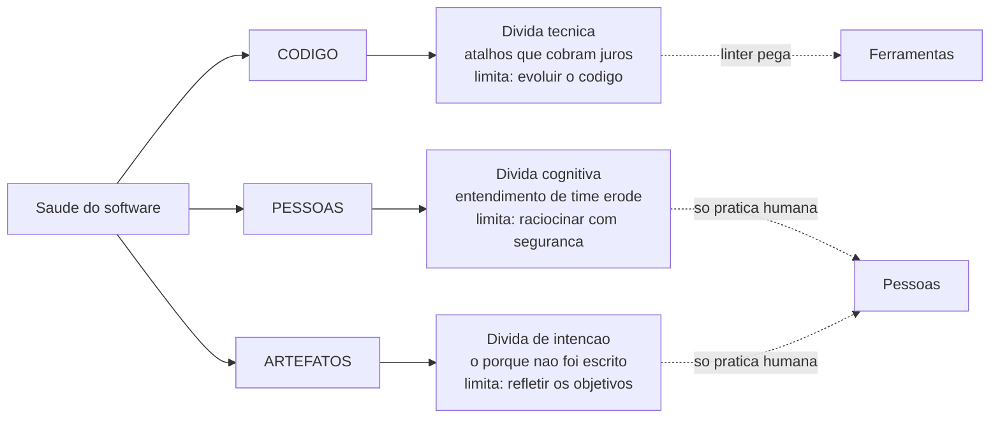
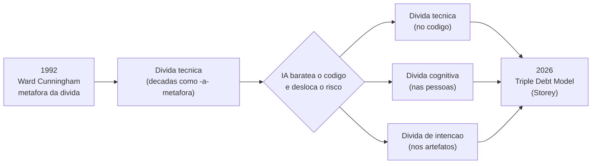
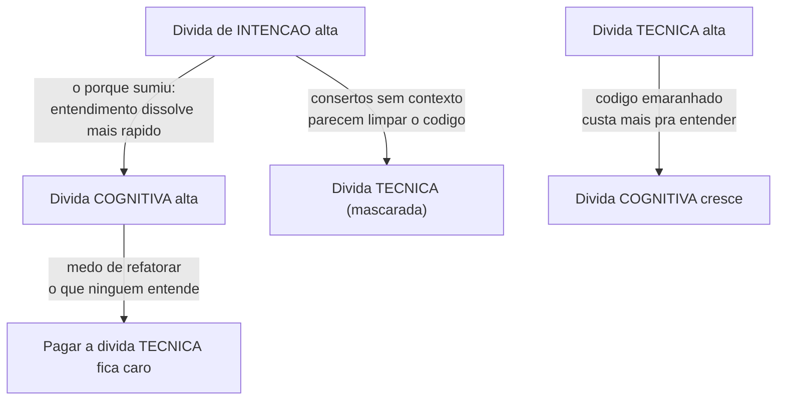
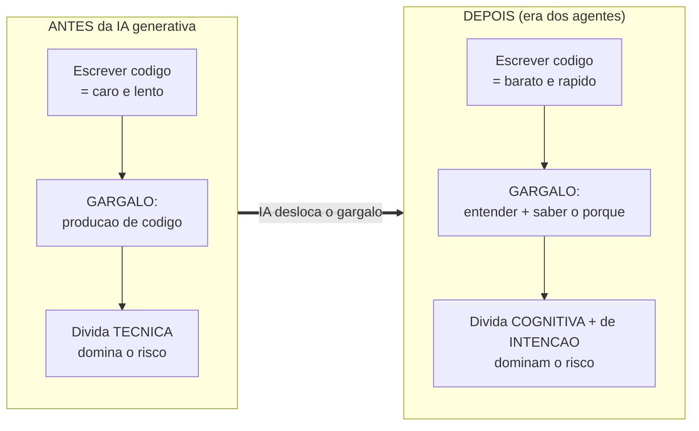
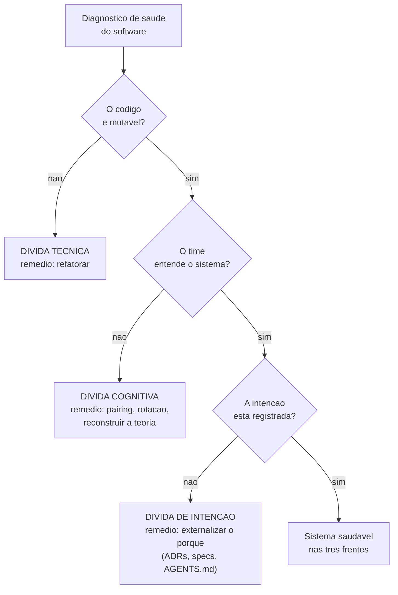

# As três dívidas do software

A nota anterior fechou separando carga cognitiva (individual, momentânea) de débito cognitivo (de time, ao longo do tempo) — e prometeu que o segundo era só uma de três peças ([[08 - Carga cognitiva e legibilidade]]). Esta nota apresenta o tabuleiro completo.

Quando dizemos que software "apodrece", costumamos pensar só no código. Mas o código é apenas um dos três lugares onde a saúde de um sistema se deteriora.

Há mais duas dívidas — e elas vivem fora do código, em lugares que nenhum linter alcança.

> [!abstract] TL;DR
> O **Triple Debt Model** (Margaret-Anne Storey, 2026) propõe que a saúde do software é corroída por **três dívidas que interagem mas são independentes**: a **dívida técnica** vive no **código** (atalhos de implementação que comprometem a evolução futura), a **dívida cognitiva** vive nas **pessoas** (erosão do entendimento compartilhado de um time ao longo do tempo) e a **dívida de intenção** vive nos **artefatos** (ausência do rationale, metas e restrições externalizados). São independentes: dá pra ter dívida técnica baixíssima e dívida de intenção altíssima ao mesmo tempo — código de IA limpinho, mas ninguém registrou *por quê*. O modelo surge agora porque a IA generativa baratea o código e desloca o risco do *escrever* pro *entender* e pro *saber o porquê*. Esta nota é o **hub**: ela enquadra as três e passa o bastão pras notas [[10 - Dívida técnica]], [[11 - Dívida cognitiva]] e [[12 - Dívida de intenção]].

## O que é

[[triple-debt-model.jpg|Triple Debt Model]]
![[triple-debt-model.jpg]]

O **Triple Debt Model** foi articulado por **Margaret-Anne Storey** em *From Technical Debt to Cognitive and Intent Debt* (arXiv, 2026).

A tese central é simples e desconfortável: a dívida técnica — o conceito que Ward Cunningham popularizou nos anos 1990 — sempre foi tratada como *a* forma de degradação do software. Mas ela é só uma das três.

Storey argumenta que existem outras duas formas de dívida, historicamente subvalorizadas, que erodem a saúde de um sistema por caminhos que o código não revela.

> [!quote] Storey, sobre o modelo
> *"This article proposes a Triple Debt Model for reasoning about software health, built around three interacting debt types: technical debt in code, cognitive debt in people, and intent debt in externalized knowledge."*

A genialidade do modelo está em **separar os lugares**.

Cada dívida vive num substrato diferente — código, mentes, artefatos —, tem uma natureza diferente e limita uma coisa diferente. Confundi-las (chamar tudo de "dívida técnica") é confundir o diagnóstico e, portanto, o remédio.

E o remédio errado é caro de duas formas: você gasta esforço onde não precisa e deixa de gastar onde a doença realmente está. Tratar dívida de intenção como "código sujo" leva o time a refatorar um código que já estava limpo — e a fatura real (o *porquê* perdido) continua correndo.

**Martin Fowler** e **Addy Osmani** popularizaram o framework depois; a fonte primária, a que cunha e defende o modelo, é o paper de Storey.

Repare numa palavra no título do paper: *software **health***. Não é à toa.

"Qualidade" sugere uma propriedade do artefato — o código é bom ou ruim. "Saúde" é uma propriedade do **sistema vivo**: o código, mais as pessoas que o mantêm, mais os artefatos que guardam o porquê. Um corpo pode ter músculos perfeitos (código limpo) e ainda assim adoecer por algo que não se vê no espelho.

É essa mudança de enquadramento — de "qualidade do código" para "saúde do sistema sociotécnico" — que abre espaço pras outras duas dívidas. Enquanto você só pergunta "o código é bom?", as dívidas cognitiva e de intenção ficam fora do quadro por definição.

## As três dívidas

A tabela abaixo é o mapa do território. Cada linha é uma dívida; cada coluna responde a uma pergunta de diagnóstico — *onde vive*, *qual é a natureza*, *o que ela limita* e *como se paga*.

| Dívida | Onde vive | Natureza | O que limita | Como se paga |
| --- | --- | --- | --- | --- |
| **Técnica** | no **código** | atalhos de implementação que cobram juros | quão fácil é **evoluir** o sistema | refatoração — e ferramentas ajudam a achar |
| **Cognitiva** | nas **pessoas** | erosão do entendimento compartilhado do time | quão seguro é **raciocinar** sobre o sistema e mudá-lo | prática humana: pairing, rotação, reconstruir a teoria |
| **De intenção** | nos **artefatos** | ausência/erosão do rationale, metas e restrições externalizados | se o sistema ainda **reflete os objetivos** originais | externalizar o *porquê* como artefato de primeira classe |

A coluna "como se paga" já antecipa o ponto mais incômodo do modelo: **só a primeira dívida tem ferramenta**. Linters, métricas e code smells farejam dívida técnica. As outras duas exigem trabalho humano deliberado — conversas, documentação, registro de decisões. Não existe linter que detecte um entendimento que se dissolveu, nem um rationale que nunca foi escrito.

O diagrama abaixo fixa onde cada dívida mora — os três substratos do sistema, e a dívida que apodrece em cada um.

Leitura do diagrama: a saúde do software se reparte em três substratos (código, pessoas, artefatos), cada um com sua dívida; repare que só a dívida técnica tem uma seta para "Ferramentas" — as outras duas só se pagam com trabalho humano.

Vamos a cada uma, em uma frase de cada vez (a profundidade fica nas notas filhas).

**Dívida técnica** é a clássica: módulos emaranhados, atalhos de deadline, abstrações erradas — escolhas de implementação que comprometem a capacidade de mudar o código no futuro. Ela mora no código, e ferramentas conseguem farejá-la. É a que esta trilha já tratou de viés ao longo das notas de complexidade, e é o tema da próxima → [[10 - Dívida técnica]].

**Dívida cognitiva** mora nas cabeças do time. É a erosão, ao longo do tempo, dos modelos mentais compartilhados necessários pra raciocinar sobre o sistema e mudá-lo com segurança — a perda da [[04 - O programa como teoria|teoria do sistema]] de Naur. Diferente da carga cognitiva (individual, do momento), é uma propriedade de **nível de time/projeto** ([[08 - Carga cognitiva e legibilidade]]). Aprofundada em → [[11 - Dívida cognitiva]].

**Dívida de intenção** mora nos artefatos — ou na sua ausência. É a falta do rationale externalizado: as metas, restrições e o *porquê* das decisões que nunca foram escritos em lugar nenhum. Storey a define no paper, e Osmani a reforça com uma imagem certeira:

> [!quote] A dívida de intenção, por Storey e por Osmani
> Storey: *"Intent debt refers to the absence or erosion of explicit rationale, goals, and constraints that guide how humans and agents evolve the system."*
>
> Osmani: *"Intent debt lives in the artifacts you may have never wrote: the goals, constraints, and rationale for why the system is the way it is."*

Note a precisão de Storey: "que guiam como **humanos e agentes** evoluem o sistema". A definição já embute a era da IA — não é só o humano que precisa do rationale; o agente também, e ele precisa *por escrito*, porque não tem o contexto tácito que um humano acumula.

Ela limita se o sistema ainda reflete o que se pretendia construir — e, na era dos agentes, o quão bem uma IA consegue evoluí-lo sem fabricar intenção. Aprofundada em → [[12 - Dívida de intenção]].

### O que o modelo não é

Três confusões comuns valem desarmar de saída, porque embaralham o uso do framework:

- **Não é uma hierarquia.** A dívida cognitiva não é "filha" da técnica, nem a de intenção é a "pior" das três. São três eixos paralelos, não três níveis de gravidade.
- **Não é uma sequência temporal.** Não é que primeiro vem a técnica, depois a cognitiva, depois a de intenção. As três se acumulam em paralelo, em ritmos próprios, desde o primeiro commit.
- **Não é "documentação vs. código".** A dívida de intenção não se paga só "documentando mais". Documentação que descreve o *como* (o que o código já diz) não quita intenção; só o *porquê* externalizado — metas, restrições, não-objetivos — paga essa dívida.

Guardar isso evita o reflexo de transformar o modelo num ranking ou numa receita linear. Ele é um **mapa de três territórios**, não uma escada.

## A genealogia: de uma dívida para três

De onde vem a palavra "dívida"?

A metáfora nasce em 1992, com **Ward Cunningham**, num relato de experiência na conferência OOPSLA. A ideia era explicar a investidores e gestores por que valia a pena gastar tempo "arrumando" código que já funcionava: assim como um empréstimo financeiro, código apressado deixa você seguir rápido *agora*, mas cobra **juros** — cada mudança futura fica mais cara — até que você "pague o principal" refatorando.

Por mais de três décadas, "dívida técnica" foi *a* metáfora da degradação de software. Tudo que tornava um sistema difícil de mexer virava "dívida técnica", num guarda-chuva que foi ficando grande demais pra dizer alguma coisa.

O que o Triple Debt Model faz é **desmembrar esse guarda-chuva**. Storey observa que muita coisa rotulada como dívida técnica não vivia no código: um time que perdeu o entendimento do próprio sistema, ou um sistema cujo propósito ninguém mais sabe explicar, não tem (necessariamente) código ruim. Tem outra coisa apodrecendo, em outro lugar.

É importante dizer que as duas dívidas "novas" **não foram inventadas do nada** — Storey deu nome (e urgência) a fenômenos que a engenharia já conhecia por outros vocabulários.

A dívida cognitiva é a leitura, em chave de "dívida", da tese de **Peter Naur** ([[04 - O programa como teoria|Programming as Theory Building]], 1985): o produto real da programação é a *teoria* que o time forma sobre o sistema, e um programa "morre" quando a equipe que detém essa teoria se dispersa. Naur descreveu o fenômeno; Storey o reembalou como uma dívida que se acumula e se paga.

A dívida de intenção ecoa o que **Parnas** (1972) chamava de *design decisions* a serem escondidas atrás de módulos — decisões que precisam ser registradas para sobreviver à passagem do tempo. O que Storey acrescenta é *por que isso ficou urgente agora*: o agente de IA torna o rationale não-escrito caro a cada sessão, não só de tempos em tempos.

Ou seja: a contribuição do Triple Debt Model não é descobrir esses fenômenos, e sim **unificá-los sob uma mesma metáfora** e mostrar que a IA mudou a importância relativa entre eles. É um trabalho de síntese e de *timing*, não de invenção.

O diagrama abaixo mostra a linhagem: uma metáfora de 1992 que, sob a pressão da IA generativa, se reparte em três.

Leitura do diagrama: a metáfora única de Cunningham segue como dívida técnica por décadas, até que a pressão da IA force o desmembramento em três dívidas distintas, reconsolidadas no Triple Debt Model de 2026.

### A metáfora e seus limites

Por que usar **uma** palavra ("dívida") para três coisas tão diferentes?

Porque a metáfora financeira captura algo verdadeiro em todas as três: você ganha velocidade *agora* tomando um atalho, e paga *depois*, com juros, se não quitar. Em todas, adiar é tentador e composto — quanto mais você espera, mais caro fica.

Mas a metáfora tem limites honestos, e vale conhecê-los:

- **Dívida financeira é mensurável; dívida de software, não.** Você sabe exatamente quanto deve ao banco. Ninguém sabe quanto "deve" em dívida cognitiva — não há saldo, só sintomas.
- **Nem toda dívida é imprudente.** Fowler mostrou no [[Dicionário de Fundamentos#Quadrante de dívida técnica (Technical Debt Quadrant)|Quadrante de Dívida Técnica]] que tomar dívida pode ser uma decisão estratégica e consciente ("a gente *precisa* lançar agora"), não um pecado.
- **Algumas dívidas não têm "principal" pra quitar.** Dívida de intenção que se perdeu de vez (a pessoa que sabia o *porquê* saiu da empresa) não se "paga": no máximo se *reconstrói por aproximação*, fabricando uma intenção plausível — que pode não ser a verdadeira.

A metáfora, então, é uma boa porta de entrada, não um modelo contábil. Ela nos dá o vocabulário ("juros", "pagar", "principal") sem prometer precisão que o software não tem.

### Três "taxas de juros" diferentes

Se levarmos a metáfora a sério por um instante, cada dívida tem um perfil de juros próprio — e isso muda quando vale a pena pagá-la.

- **Dívida técnica** tem juros *lineares e visíveis*. Cada mudança paga um pouco a mais; o custo cresce de forma mais ou menos previsível, e ferramentas o tornam mensurável. É a dívida cujo "saldo" você quase consegue ver.
- **Dívida cognitiva** tem juros *que disparam em eventos*. Ela se acumula em silêncio enquanto o time está estável, e cobra de uma vez quando alguém sai, quando o time cresce rápido, ou quando passa tempo demais sem ninguém tocar numa área. O risco mora no *bus factor*.
- **Dívida de intenção** tem juros *que a IA tornou compostos*. Antes cobrava raramente (onboarding, saída de pessoa); com agentes, cobra a cada sessão. É a única das três cuja taxa de juros literalmente *subiu* por causa de uma mudança externa de tecnologia.

A consequência prática é sobre **quando pagar**. Dívida técnica você pode pagar de forma incremental, à medida que toca o código (a [[Dicionário de Fundamentos#Regra do Escoteiro (Boy Scout Rule)|Regra do Escoteiro]]). Dívida cognitiva você paga *antes* dos eventos que a cobram — investindo em rotação, pairing e redundância de conhecimento *enquanto* o time ainda está inteiro. Dívida de intenção você paga *no momento da decisão*, externalizando o *porquê* quando ele ainda está fresco — porque depois ele não se "recupera", só se fabrica por aproximação.

> [!info] O paradoxo das dívidas baratas de pagar e fáceis de adiar
> As duas dívidas mais perigosas (cognitiva e de intenção) são, no momento certo, as **mais baratas** de pagar — escrever um ADR custa minutos, fazer um pairing custa uma tarde. O problema é que são as mais fáceis de *adiar*, porque não doem agora e não têm linter cobrando. A dívida técnica grita; as outras duas sussurram até a fatura chegar. Essa assimetria — barato pagar, fácil ignorar — é o que faz delas as dívidas dominantes da era da IA.

## Independentes, mas interagentes

O ponto mais importante — e o mais contraintuitivo — é que **as três dívidas são independentes**.

Não é uma escada onde uma leva à outra; são três eixos ortogonais. Você pode estar bem num e péssimo noutro.

O exemplo que torna isso vívido é o do **código de IA limpo sem intenção registrada**. Imagine um agente que gera um módulo impecável: bem nomeado, testado, sem duplicação, complexidade ciclomática baixa. **Dívida técnica perto de zero.** Mas em lugar nenhum está escrito *por que* aquele módulo existe, que restrição de negócio ele protege, o que ele deliberadamente *não* faz. **Dívida de intenção altíssima.** As duas convivem no mesmo arquivo, no mesmo instante. Osmani crava:

> [!quote] As dívidas operam de forma independente
> *"An agent can't generate intent, because intent is the one input that has to come from you."*

> [!example] O sintoma clássico do descolamento
> Um agente "conserta" um bug removendo uma *guard clause* cujo propósito nunca foi registrado em nenhum artefato. O código fica mais limpo (dívida técnica caiu!), os testes passam — e três semanas depois um caso de borda que aquela cláusula protegia explode em produção. A dívida técnica diminuiu *enquanto* a dívida de intenção cobrava sua fatura. Tratar isso como "problema de código" é remédio errado pra doença errada.

### As interações

Que sejam independentes não significa que não conversem. Storey fala em *interacting debt types* justamente porque uma dívida muda a **dinâmica** das outras — sem deixar de ser distinta delas.

Vale insistir na sutileza: independência e interação não se contradizem. Independência é sobre o *nível* (posso estar alto numa e baixo noutra). Interação é sobre a *velocidade* (uma alta faz a outra crescer ou doer mais rápido). São dois eixos diferentes.

As interações mais concretas:

- **Intenção alta → cognitiva acelera.** Sem o *porquê* registrado, o entendimento compartilhado se dissolve mais rápido: a cada saída de pessoa, vai embora um pedaço de teoria que nenhum artefato segurou.
- **Cognitiva alta → técnica fica assustadora de pagar.** Ninguém ousa refatorar o código que ninguém entende. A dívida técnica não cresce sozinha, mas vira *intocável* — você sabe que está lá e tem medo de mexer.
- **Técnica alta → cognitiva aumenta.** Código emaranhado é mais difícil de entender; a carga de cada leitura sobe e, com o tempo, o entendimento de time erode mais rápido.
- **Intenção alta → técnica vira "limpeza" enganosa.** Como no exemplo da *guard clause*: sem saber o *porquê*, "consertos" reduzem dívida técnica aparente enquanto detonam a intenção.

A matriz abaixo lê assim: a dívida da **linha** está alta; a seta mostra o efeito que ela provoca na dívida da ponta.

Leitura do diagrama: nenhuma seta "transforma" uma dívida na outra — cada seta diz que uma dívida alta *piora a dinâmica* de outra; a dívida de intenção é a mais perigosa porque puxa as duas restantes ao mesmo tempo.

Conclusão prática: como nenhuma se resolve de uma vez e todas se realimentam, **todas exigem manutenção contínua**. Não há um refator heroico que zere as três — há disciplina, repetida, em três frentes.

### Um cenário que costura as três

Acompanhe um sistema ao longo de seis meses pra ver as três dívidas dançando juntas — independentes no nível, acopladas na dinâmica.

**Mês 0.** Um time pequeno constrói um serviço de cobrança. Código limpo (dívida técnica baixa), todo mundo entende tudo (dívida cognitiva baixa), e o *porquê* das regras de negócio vive nas conversas diárias do time — mas nunca foi escrito (dívida de intenção já **alta**, embora ninguém sinta, porque o conhecimento tácito ainda circula).

**Mês 3.** Dois dos quatro engenheiros saem. Com eles, vai embora metade da teoria do sistema. A dívida de intenção alta **cobra sua primeira fatura**: como o *porquê* nunca foi externalizado, os novatos não têm de onde recuperá-lo. A dívida cognitiva dispara — não porque o código piorou, mas porque o entendimento compartilhado evaporou. (Interação: intenção alta acelerou a cognitiva.)

**Mês 5.** Os novatos, sem entender por que certas validações existem, têm medo de tocar nelas. O código não ficou pior, mas virou **intocável**: a dívida técnica latente agora é cara de pagar, porque ninguém ousa refatorar o que não entende. (Interação: cognitiva alta tornou a técnica assustadora.)

**Mês 6.** Pressionados por um prazo, eles pedem a um agente que "simplifique" o módulo de cobrança. O agente, lendo só o código (que diz o *como*, nunca o *porquê*), remove uma validação que parecia redundante. Dívida técnica aparente cai; os testes passam. Três semanas depois, uma cobrança duplicada chega a um cliente — a validação protegia um caso de borda que ninguém documentou. (Interação: intenção alta mascarou-se de "limpeza" técnica.)

A moral: a **dívida de intenção alta no mês 0** — invisível, indolor, fácil de ignorar — foi a raiz de tudo. Ela não causou as outras (independência), mas envenenou a dinâmica das três (interação). Um único artefato com o *porquê* das validações teria quebrado a cadeia inteira.

## Por que o modelo surge agora

Por que separar três dívidas só em 2026, se a dívida técnica existe desde os anos 1990?

Porque a **IA generativa mudou a importância relativa das três**. O argumento de Storey é que a IA não elimina o risco — ela o **desloca**.

Enquanto escrever código era caro, o gargalo da engenharia era a produção: o esforço se concentrava em *escrever*. A dívida técnica dominava o palco porque escrever bem era a parte difícil.

A IA inverte a economia: gerar código vira barato e rápido — rápido demais pra que o entendimento humano acompanhe. O gargalo migra do *escrever* pro **entender** (dívida cognitiva) e pro **saber o porquê** (dívida de intenção).

> [!quote] Storey, sobre o deslocamento
> *"As AI generates code faster than teams can understand it, two under appreciated forms of debt accumulate: cognitive debt, the erosion of shared understanding across a team, and intent debt, the absence of externalized rationale that developers and AI agents need to work safely with code."*

O diagrama abaixo contrasta os dois regimes: o de antes (escrever era o gargalo) e o de agora (código barato, entendimento e intenção viram o gargalo).

Leitura do diagrama: a IA não apaga nenhuma dívida — ela desloca o gargalo da esquerda (escrever) para a direita (entender e saber o porquê), rebaixando a dívida técnica e promovendo as outras duas ao topo do risco.

### A economia da intenção não-escrita

Osmani adiciona o golpe econômico: a intenção não-escrita antes custava barato.

Você só pagava no onboarding ou quando alguém saía do time — eventos raros, espaçados por meses. O entendimento tácito circulava em conversas de corredor, code reviews e memória institucional, e ia se reconstituindo no caminho.

Agora você paga **a cada sessão, por cada agente**.

Cada agente começa frio, sem a intenção tácita que humanos acumulavam ao longo dos anos. Ele não lê mentes nem conversas de corredor: lê artefatos. Se o *porquê* não está escrito num artefato, o agente o **fabrica** a partir do código — e código revela o *como*, nunca o *porquê*.

> [!quote] Osmani, sobre a nova economia
> *"Un-externalized intent used to cost you once in a while, at onboarding or after someone left. Now you pay it every session."*

O efeito de segunda ordem (registrado também por Fowler e pela Developers Digest): se escrever código fica trivial, a atividade cara passa a ser **verificar**.

> [!quote] Developers Digest, sobre o deslocamento do custo
> *"If coding agents make writing code cheap, verification becomes expensive."* E ainda: *"The expensive activity shifts from building to judging what correct means."*

A composição do time se reorganiza em torno disso. A Developers Digest descreve a virada de forma concreta: de "10 engenheiros de feature" para algo como "3 engenheiros + 7 pessoas definindo critérios de aceitação, harness de testes e monitoramento". A atividade cara migra de *construir* para *julgar o que é "correto"* — e julgar o que é correto é, no fundo, **saber a intenção**. Por isso o deslocamento da IA promove justamente a dívida de intenção: o gargalo novo (verificar) depende do insumo que a dívida de intenção mede (o *porquê*).

Há ainda um risco mais sutil que a IA introduz, na fronteira entre a dívida cognitiva e o uso de agentes: a **rendição cognitiva** (Shaw e Nave, divulgada por Fowler) — confiar acriticamente no raciocínio gerado por IA, contornando o pensamento deliberado. É um acelerador da dívida cognitiva: se o time deixa de *raciocinar* sobre o sistema e passa a só *aceitar* o que o agente produz, o entendimento compartilhado erode ainda mais rápido. O conceito é tratado como sintoma da era da IA — sua casa é o [[03-Dominios/IA/O Lado Sombrio da IA/index|Lado Sombrio]], não esta nota — mas vale registrar a conexão: é uma das pontes pelas quais a IA empurra a dívida cognitiva pra cima.

### A assimetria final: a IA paga duas, mas não a terceira

Aqui o modelo entrega seu insight mais afiado, e vale isolá-lo.

A IA *ajuda* com duas das três dívidas. Ela refatora rápido (abate dívida técnica) e explica código sob demanda (alivia dívida cognitiva no momento da leitura). Mas há uma dívida que ela **estruturalmente não consegue pagar**: a de intenção.

A razão não é técnica, é lógica. Intenção é o *porquê* — as metas e restrições que existem na cabeça de quem decidiu, fora do código. Um agente que tenta inferir intenção a partir do código não está *recuperando* a intenção; está **fabricando** uma hipótese plausível a partir do *como*. E o *como* nunca determina o *porquê*: o mesmo código pode servir a propósitos opostos.

> [!quote] Osmani, sobre o insumo que só vem de você
> *"An agent can't generate intent, because intent is the one input that has to come from you."* E o conselho que decorre: *"Write down the why, because it's becoming the most valuable thing you can leave in the repo."*

Fowler dá a mesma ideia por outro ângulo: programar nunca foi só digitar sintaxe que a máquina executa.

> [!quote] Fowler, sobre o que é programar
> *"Programming isn't just typing coding syntax that computers can understand and execute; it's shaping a solution."*

"Moldar uma solução" inclui comunicar *por que* ela é assim — e isso é justamente o que a IA não gera. Por isso, das três dívidas, a de intenção é a que mais cresce relativamente na era dos agentes: as outras duas têm um aliado de máquina, ela só tem você. É a dívida humana por excelência.

> [!note] Fronteira: a lente geral × a manifestação na IA
> Este galho trata as três dívidas pela lente **geral e atemporal** — elas existiriam mesmo sem IA, e a engenharia já convivia com versões mais lentas de todas. As **manifestações específicas da era da IA** (rendição cognitiva, comprehension gate, vibe coding, como agentes fabricam intenção) vivem em [[03-Dominios/IA/O Lado Sombrio da IA/index|O Lado Sombrio da IA]], onde a [[Débito cognitivo]] já tem nota própria. Esta nota linka pra lá, mas não invade o terreno: aqui o foco é o **modelo conceitual**, não o sintoma da IA.

## Diagnóstico de saúde do software

Se há três dívidas, há **três perguntas** que um sênior faz pra medir a saúde de um sistema — não uma. Reduzir o diagnóstico a "o código está limpo?" é olhar só pra primeira dívida e ficar cego pras outras duas.

As três perguntas, na ordem dos substratos:

1. **O código é mutável?** Dá pra evoluí-lo sem que cada mudança vire um campo minado? → mede **dívida técnica**.
2. **O time entende o sistema?** Mais de uma pessoa consegue explicar como ele funciona e mudá-lo com segurança? → mede **dívida cognitiva**.
3. **A intenção está registrada?** O *porquê* das decisões — metas, restrições, não-objetivos — está num artefato, ou só na cabeça de alguém? → mede **dívida de intenção**.

O diagrama abaixo transforma as três perguntas num fluxo de triagem: cada "não" aponta pra uma dívida específica e, com ela, pro remédio certo.

Leitura do diagrama: três perguntas em cascata, uma por dívida; cada "não" identifica a dívida e o remédio — e só quem responde "sim" às três chega ao sistema saudável (a profundidade de cada remédio fica nas notas filhas).

A força do checklist é o que ele *separa*: um sistema pode passar na pergunta 1 (código lindo) e falhar na 3 (ninguém sabe por que ele existe). São diagnósticos independentes, e cada "não" pede um remédio diferente.

### Os sinais que denunciam cada dívida

As três perguntas dão o veredito; mas como você *suspeita* de cada dívida no dia a dia? Cada uma tem sintomas característicos — e, como vivem em substratos diferentes, aparecem em lugares diferentes.

A tabela abaixo é um guia de triagem rápida. Não substitui as notas filhas (a profundidade dos sinais e remédios mora lá); serve pra você bater o olho num time e desconfiar de qual dívida está cobrando.

| Dívida | Onde você percebe | Sinais característicos |
| --- | --- | --- |
| **Técnica** | métricas, ferramentas, PRs | mudança pequena toca muitos arquivos; testes frágeis; *code smells*; medo de tocar em certos módulos |
| **Cognitiva** | conversas, onboarding, *bus factor* | "só fulano entende isso"; onboarding lento e doloroso; decisões reabertas porque ninguém lembra o que já foi discutido; perguntas que ninguém sabe responder |
| **De intenção** | artefatos vazios ou desatualizados | README sem seção de não-objetivos; ADRs inexistentes; agentes "consertam" coisas que não eram bug; ninguém articula em 5 minutos pra que o sistema serve e pra que *não* serve |

Repare que o sinal de dívida de intenção mais agudo da era da IA — "agentes consertam o que não era bug" — é exatamente o exemplo da *guard clause* removida. O sintoma aparece no código, mas a doença está no artefato que nunca existiu.

> [!warning] O erro de diagnóstico mais caro
> O instinto treinado de quase todo dev é traduzir qualquer problema pra "código ruim", porque é a única dívida com ferramenta e com cura conhecida (refatorar). É um viés de disponibilidade: você combate a dívida que sabe medir. O resultado é refatorar código que já estava limpo enquanto a dívida cognitiva ou de intenção — invisível ao linter — segue cobrando juros. Antes de refatorar, pergunte qual das três dívidas você está realmente pagando.

### Um teste barato para cada pergunta

Cada uma das três perguntas tem um teste de bolso — algo que você consegue rodar em minutos, sem ferramenta:

- **Código mutável?** Pegue uma mudança pequena e plausível ("trocar a moeda padrão") e estime quantos arquivos ela tocaria. Se a resposta assusta, há dívida técnica (é a [[Dicionário de Fundamentos#Mudança amplificada (change amplification)|mudança amplificada]] de Ousterhout).
- **Time entende?** Conte quantas pessoas conseguiriam, sozinhas, evoluir cada área crítica do sistema com segurança. Se alguma área tem *bus factor* 1 ("só fulano sabe"), há dívida cognitiva concentrada ali.
- **Intenção registrada?** O *teste dos 5 minutos* (Developers Digest/Osmani): você consegue articular, sem olhar o código, pra que o sistema serve, pra que ele deliberadamente *não* serve, e as três restrições mais duras que ele respeita? Se trava na segunda ou terceira, a intenção não está externalizada — está só na sua cabeça.

Esses testes não são o diagnóstico completo (a profundidade está em 10/11/12), mas dão o **sinal de alerta** em qual frente investigar. O valor de tê-los separados é não confundir o sintoma de uma dívida com o de outra.

## Como cada dívida é mal gerida

Diagnosticar é metade; a outra metade é não tratar a dívida errada do jeito errado. Cada uma tem um anti-padrão clássico de gestão — uma forma de "cuidar" que na verdade piora.

- **Dívida técnica — o refator heroico que nunca vem.** O anti-padrão é deixar a dívida acumular esperando o "grande refator" que a equipe fará "quando der" — e que nunca dá, porque o sistema só cresce. O contraponto é o pagamento incremental (a Regra do Escoteiro): mil melhorias minúsculas no lugar de um refator messiânico.
- **Dívida cognitiva — o herói insubstituível.** O anti-padrão é *celebrar* a pessoa que "sabe tudo" sobre uma área, em vez de tratar essa concentração como risco. Quanto mais o time depende de um único portador da teoria, maior a dívida cognitiva — e ela cobra no dia em que essa pessoa sai. A gestão correta é dissolver o herói: rotação, pairing, documentação do entendimento.
- **Dívida de intenção — a documentação que descreve o "como".** O anti-padrão é achar que "documentar mais" resolve, e produzir páginas que descrevem *o que o código faz* (que o código já diz). Isso não paga a dívida de intenção — só infla artefatos. O que paga é registrar o *porquê*: as metas, as restrições, os não-objetivos, as decisões e os experimentos que falharam.

O fio comum dos três anti-padrões: confundir **atividade** com **pagamento**. Refatorar muito, ter um especialista dedicado, escrever muita documentação — tudo parece "cuidar do sistema", mas pode estar pagando a dívida errada, ou nenhuma. O modelo das três dívidas existe justamente pra forçar a pergunta: *qual* dívida isso quita?

## Em entrevista

> [!tip] Como articular o Triple Debt Model
> Mencionar as três dívidas sinaliza julgamento sênior porque mostra que você não reduz "qualidade de software" a código limpo. Frase de efeito: *"Clean code is necessary but not sufficient — you can ship zero technical debt and still drown in intent debt if nobody wrote down the why."* Em PT: deixe explícito que a dívida técnica é a única que um linter pega, e que as outras duas (entendimento de time, rationale externalizado) só se combatem com **prática humana** — pair programming, ADRs, documentar o porquê. Se o entrevistador tocar em IA, conecte: *"AI shifts the bottleneck from writing code to understanding it and knowing the intent"* — e cite que agentes não conseguem *gerar* intenção, só humanos conseguem. É um framework de 2026, atribuível a Margaret-Anne Storey: citar a fonte mostra que você lê literatura, não só posts.

> [!tip] O diagnóstico como resposta de design
> Se perguntarem "como você avalia a saúde de um codebase?", não responda só "olho a cobertura de testes e o lint". Use as três perguntas: *o código é mutável, o time o entende, a intenção está registrada?* Mostrar que você diagnostica em três frentes — e que sabe qual remédio cada "não" pede — distingue o sênior do pleno que só sabe falar de dívida técnica.

## Fontes

- [[02-Glosas/2026-from-technical-debt-to-cognitive-and-intent-debt|From Technical Debt to Cognitive and Intent Debt — Margaret-Anne Storey (arXiv)]] — a **fonte primária** do Triple Debt Model
- [[02-Glosas/2026-fowler-fragments-triple-debt-model|Fragments: April 2 — Martin Fowler]] — divulgação ("técnica → código, cognitiva → pessoas, intenção → artefatos") e o custo da verificação
- [[02-Glosas/2026-the-intent-debt|The Intent Debt — Addy Osmani]] — a independência das dívidas e a economia da intenção
- [[02-Glosas/2026-intent-debt-the-ai-era-debt-nobody-is-tracking|Intent Debt: The AI-Era Debt Nobody Is Tracking — Developers Digest]] — releitura operacional da dívida de intenção

> [!note] Sobre o lastro
> O modelo é atribuído a **Margaret-Anne Storey** (paper no arXiv, 2026); **Fowler** e **Osmani** o popularizaram. Todas as citações em inglês são **verbatim** das seções "Citações" das glosas acima. **Ressalva honesta:** não li o paper de Storey página a página — as afirmações reproduzem o argumento e o vocabulário registrados nas glosas com alta fidelidade, mas detalhes de fraseado podem diferir do original. A genealogia (Cunningham, 1992, OOPSLA) e os limites da metáfora são síntese do autor a partir do contexto histórico consolidado, não citações das glosas. Padrão de marcação seguindo [[06 - Abstrações que vazam]].

## Veja também

- [[10 - Dívida técnica]] — a dívida que vive no código, em profundidade
- [[11 - Dívida cognitiva]] — a dívida que vive nas pessoas, em profundidade
- [[12 - Dívida de intenção]] — a dívida que vive nos artefatos, em profundidade
- [[08 - Carga cognitiva e legibilidade]] — o par carga × débito que esta nota completa
- [[04 - O programa como teoria]] — a teoria de Naur, lastro da dívida cognitiva
- [[Débito cognitivo]] — a manifestação na era da IA, no Lado Sombrio da IA
- [[Dicionário de Fundamentos]] — verbetes do domínio
