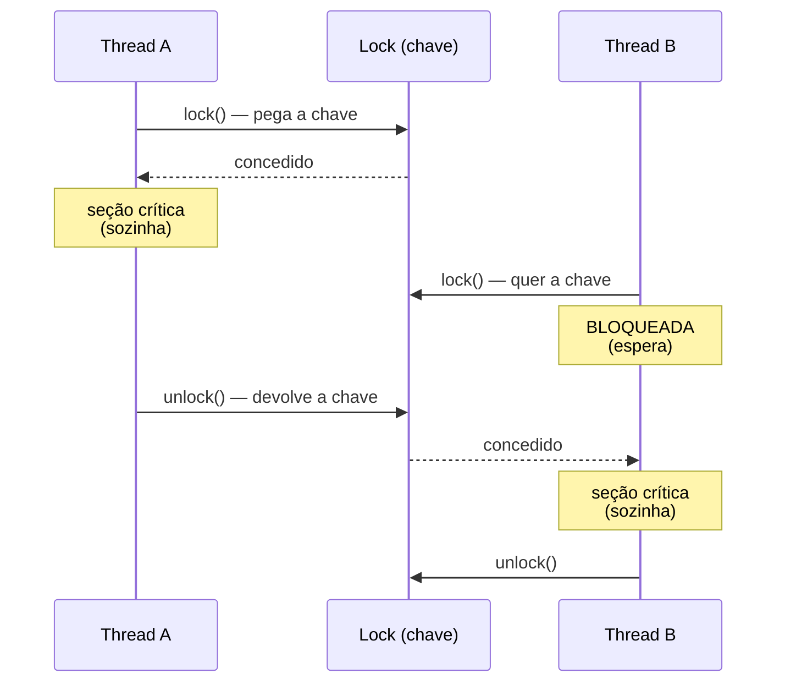
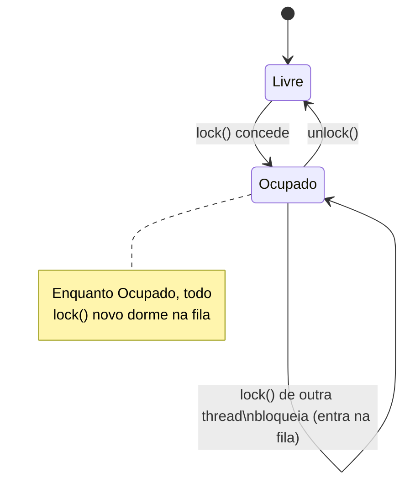
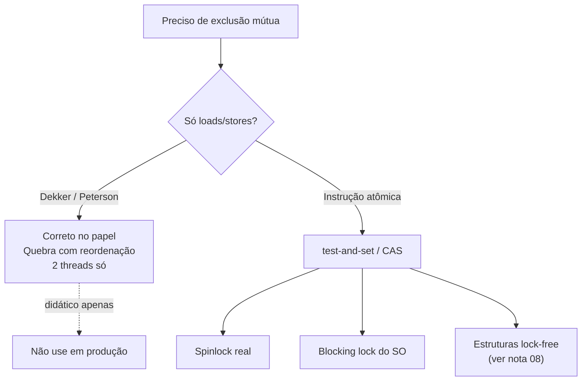
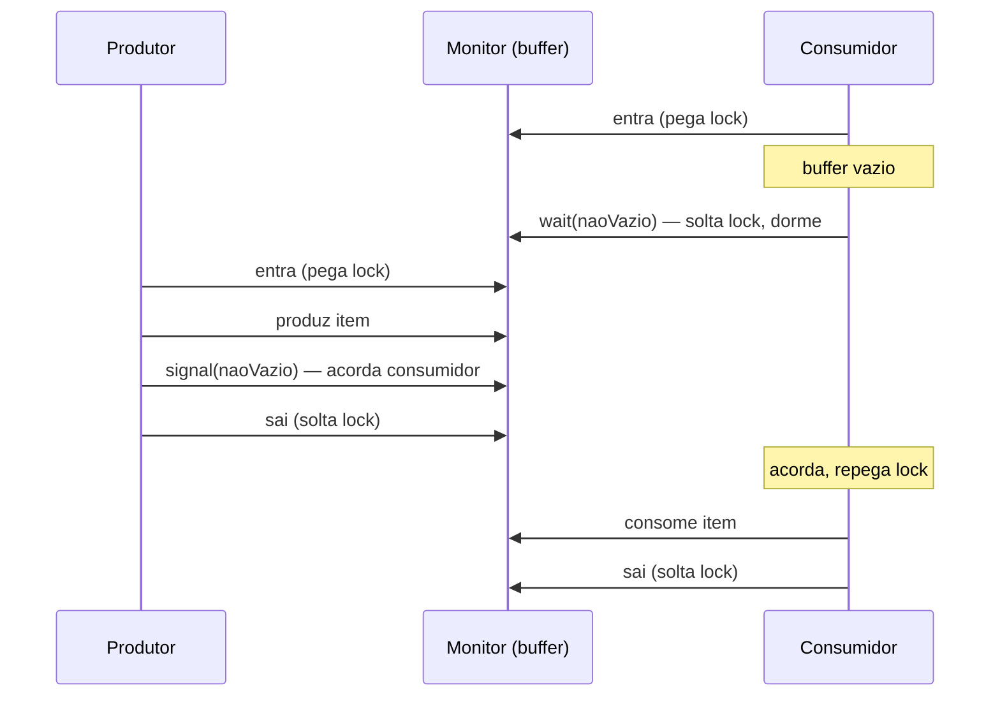
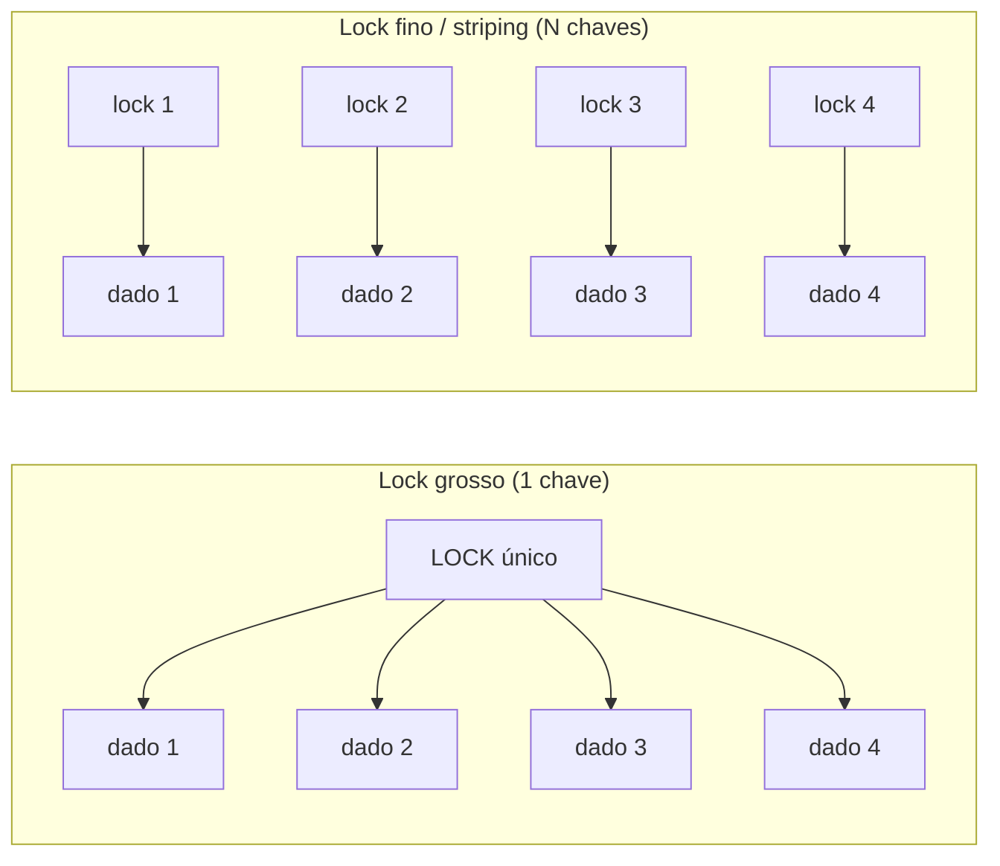
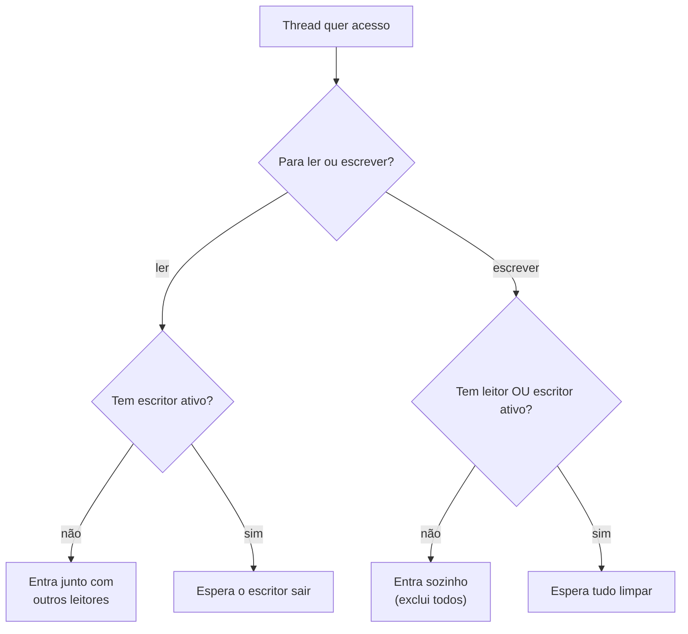

# Exclusão mútua: locks, mutexes e monitores

> [!abstract] Resumo em uma linha
> Exclusão mútua é a promessa de que apenas UMA thread por vez pisa na seção crítica — e o lock é o porteiro que cobra essa promessa em troca de paralelismo serializado.

Em [[03 - Estado compartilhado e race conditions]] vimos o estrago: duas threads incrementam o mesmo contador e o resultado some no ar. A causa era a intercalação de operações que deveriam ser indivisíveis. A cura tem nome desde 1965, quando Dijkstra publicou *Solution of a problem in concurrent programming control* e batizou o problema: **exclusão mútua** (*mutual exclusion*).

A ideia é simples de enunciar e traiçoeira de implementar. Existe um trecho de código que toca estado compartilhado. Esse trecho não pode ter duas threads dentro ao mesmo tempo. Ponto. O resto desta nota é sobre como cumprir essa regra — e quanto ela custa.

## A seção crítica

A **seção crítica** (*critical section*) é o pedaço de código que acessa um recurso compartilhado e que, se executado concorrentemente, corrompe o estado. Não é o programa inteiro. É o trecho mínimo que mexe no dado disputado: o `saldo += valor`, o `tabela.put(chave, x)`, o trecho que lê-modifica-escreve uma variável que outra thread também toca.

> [!analogy] A chave do banheiro único
> O escritório tem um banheiro só e uma chave só, pendurada na parede. Quem quer entrar pega a chave, entra, tranca, faz o que tem que fazer, sai e devolve a chave ao gancho. Enquanto a chave não está no gancho, todo mundo espera. Não importa quantas pessoas queiram entrar: a chave serializa o acesso. O banheiro é a seção crítica. A chave é o **lock**.

A formulação de Dijkstra impõe condições que sobrevivem até hoje. Duas threads nunca podem estar na seção crítica simultaneamente. Nenhuma thread pode receber prioridade fixa sobre outra — a solução tem que ser simétrica. Nada pode assumir nada sobre a velocidade relativa das threads. E uma thread que trava ou para FORA da sua seção crítica não pode bloquear as outras para sempre. Quem desenha um protocolo de lock está, no fundo, tentando satisfazer essas mesmas restrições.

Por que isso *funciona*? Porque transforma um trecho concorrente num trecho serial. Dentro da seção crítica, a thread tem a ilusão de estar sozinha no mundo. Toda a aritmética de visibilidade e ordenação que estudamos em [[04 - Atomicidade, visibilidade e ordenação]] se resolve, porque a entrega e a saída do lock funcionam como barreiras de memória: o que a thread anterior escreveu fica visível para a próxima.



Lead-in: o coração de toda exclusão mútua é este aperto de mão de duas threads e um lock.

Leitura do diagrama: A pega a chave e entra. Quando B tenta entrar, a chave não está no gancho — B fica bloqueada, parada. Só quando A devolve a chave é que B é liberada. Em nenhum instante as duas estão dentro ao mesmo tempo. Repare que B *desperdiça tempo* esperando: essa espera é o custo que vamos cobrar adiante.

## Mutex e lock: o porteiro

**Mutex** é abreviação de *mutual exclusion* — é o objeto que implementa a chave. A interface é mínima: `lock()` (ou `acquire()`) e `unlock()` (ou `release()`). Quem chama `lock()` ou pega a chave na hora (se está livre) ou espera (se está ocupada). Quem chama `unlock()` devolve a chave e, se alguém esperava, libera um.

Os termos *lock* e *mutex* viraram quase sinônimos no dia a dia, mas há uma nuance histórica. Um mutex, na tradição POSIX, tem dono: só a thread que travou pode destravar. Um *lock* genérico é o conceito guarda-chuva. Neste grimório eu uso os dois de forma intercambiável e aviso quando a distinção importa.



Lead-in: o lock é uma máquina de estados de duas posições com uma fila de espera pendurada.

Leitura do diagrama: o lock nasce Livre. O primeiro `lock()` o leva a Ocupado. Qualquer `lock()` adicional não muda o estado — apenas empilha a thread numa fila de espera. Só `unlock()` devolve o estado a Livre, e aí a próxima da fila avança. A fila é o que separa um lock justo (FIFO) de um lock que pode causar fome — assunto de [[07 - Deadlock, livelock e starvation]].

### Spinlock × blocking lock

Quando a chave está ocupada, a thread que espera tem duas posturas possíveis. Essa escolha é uma das mais importantes da concorrência de baixo nível.

O **spinlock** fica num laço apertado tentando pegar a chave de novo e de novo — *busy-wait*. Não dorme, não cede a CPU. Fica girando (*spinning*). Parece desperdício, e é, mas tem uma virtude: quando a chave libera, a thread reage no mesmo instante, sem o custo de ser acordada pelo sistema operacional.

O **blocking lock** faz o oposto. Se a chave está ocupada, a thread avisa o sistema operacional "me põe pra dormir e me acorda quando liberar". O SO tira a thread da CPU (troca de contexto) e a põe numa fila. Outra thread roda no lugar. Quando a chave libera, o SO acorda a dorminhoca (outra troca de contexto).

> [!info] O trade-off do spin vs block
> A pergunta é: **quanto tempo a chave vai ficar ocupada?** Se a seção crítica é curtíssima — alguns nanossegundos, uns poucos campos atualizados —, dormir e acordar custa mais do que a própria espera. A troca de contexto pode levar microssegundos. Aí o spinlock vence: gira um pouco e pega a chave. Mas se a seção crítica é longa, girar queima CPU à toa enquanto outra thread poderia estar trabalhando. Aí o blocking lock vence. Híbridos espertos (o *adaptive mutex*) giram por um tempinho e, se a chave não liberar, desistem e dormem.

Frase para guardar: spinlock não cede CPU e aposta em seção curta; blocking lock cede CPU e aposta em seção longa.

## Por que isso é difícil só com loads e stores

Aqui mora uma sutileza que separa quem leu de quem entendeu. Implementar `lock()` e `unlock()` parece trivial: uma variável booleana `ocupado`. Se está `false`, ponho `true` e entro. Se está `true`, espero. Errado. Mortalmente errado.

O problema é que "checar se está false E pôr true" são DUAS operações. Duas threads podem checar `false` ao mesmo tempo, ambas verem livre, ambas porem `true`, e ambas entrarem. O guarda da seção crítica precisa, ele mesmo, de uma seção crítica. É uma cobra mordendo o próprio rabo.

Os pioneiros atacaram isso usando *apenas* leituras e escritas comuns (loads e stores), sem nenhuma mágica de hardware. O **algoritmo de Dekker** (anos 1960) foi a primeira solução correta para duas threads. O **algoritmo de Peterson** (1981) é a versão enxuta e didática do mesmo problema.

> [!note] Peterson, em duas frases
> Cada thread tem um *flag* dizendo "quero entrar" (`flag[0]`, `flag[1]`) e existe uma variável `turn` ("de quem é a vez"). Para entrar, a thread levanta o próprio flag, cede a vez à outra (`turn = outra`), e só entra se a outra NÃO quer entrar OU se a vez é dela. O `turn` é o desempate gentil: "se nós dois queremos, deixo você passar primeiro". Verifiquei a mecânica de flags e turn — confere com a literatura de sistemas operacionais.

Peterson é lindo no papel e quase inútil na prática moderna. Por dois motivos. Primeiro, só funciona para duas threads — generalizar é desajeitado. Segundo, e mais grave: ele assume que as escritas em `flag` e `turn` ficam visíveis na ordem em que foram feitas. Mas, como vimos em [[04 - Atomicidade, visibilidade e ordenação]], processadores e compiladores reordenam livremente. Sem barreiras de memória explícitas, Peterson quebra em hardware real. É um algoritmo *educacional*: ensina o problema, não resolve o de produção.

A saída do mundo real foi descer ao hardware. CPUs modernas oferecem **instruções atômicas** — uma única instrução que lê-modifica-escreve sem interrupção. *Test-and-set* (lê e seta num átomo só). *Compare-and-swap* (CAS: "se o valor ainda é X, troca por Y; senão, falha"). Sobre essas primitivas se constroem todos os locks reais. É o assunto de [[08 - Operações atômicas e lock-free]] — por ora basta saber que o porteiro confiável nasce de uma instrução de processador, não de um truque de loads e stores.



Lead-in: o caminho da intenção "quero exclusão mútua" até uma implementação que sobrevive em hardware real.

Leitura do diagrama: à esquerda, a rota pura de loads e stores (Peterson/Dekker) — elegante, mas um beco sem saída prático. À direita, a rota que o hardware oferece: uma instrução atômica que vira spinlock, vira blocking lock, ou vira estrutura lock-free. Toda concorrência séria mora no ramo direito.

## Monitor: o lock que encapsula

O lock cru tem um problema de disciplina. Nada impede um programador de tocar o estado compartilhado SEM pegar o lock antes. O lock e o dado que ele protege são duas coisas soltas, e a corretude depende de todo mundo lembrar de travar. Um esquecimento e a race condition volta.

O **monitor** resolve isso por construção. É um objeto que embrulha o estado compartilhado, os métodos que o acessam, E o lock — tudo num pacote só. Entrar em qualquer método do monitor adquire o lock automaticamente; sair libera. Você não pode tocar o estado sem passar pela porta. O monitor foi inventado por Hoare e Per Brinch Hansen no início dos anos 1970, e estreou na linguagem Concurrent Pascal de Brinch Hansen.

Mas exclusão mútua sozinha não basta. Às vezes a thread entra, pega o lock, e descobre que ainda não pode trabalhar — a fila está vazia, o buffer está cheio. Ela precisa ESPERAR por uma condição, e enquanto espera, precisa SOLTAR o lock (senão ninguém muda a condição). Para isso o monitor traz as **variáveis de condição** (*condition variables*), com duas operações: `wait` (solto o lock e durmo até alguém me acordar) e `signal`/`notify` (acordo quem espera nesta condição).



Lead-in: o monitor coordena produtor e consumidor sem nenhum dos dois tocar no buffer fora do lock.

Leitura do diagrama: o consumidor entra, vê o buffer vazio e faz `wait` — repare que `wait` SOLTA o lock, senão o produtor jamais entraria. O produtor entra, produz, dá `signal` e sai. O consumidor acorda, REPEGA o lock e consome. O ponto fino: entre o `signal` e o consumidor voltar a rodar, o que acontece? Essa é a pergunta que divide as escolas.

### Hoare × Brinch Hansen × Mesa

Quando o produtor faz `signal`, quem corre em seguida? Há três respostas históricas, e elas mudam como você escreve o código.

**Semântica de Hoare (signal-and-wait):** ao dar `signal`, o sinalizador é IMEDIATAMENTE suspenso e a thread acordada roda na hora. A acordada tem a GARANTIA de que a condição é verdadeira, porque ninguém rodou entre o sinal e o despertar. Limpo de raciocinar, mas caro: força uma troca de contexto imediata e exige uma fila extra de "urgentes". É também chamada *signal-and-urgent-wait*.

**Semântica de Brinch Hansen:** mais restrita ainda — uma thread só pode dar `signal` ao SAIR do monitor. No momento do sinal, o sinalizador já está de saída, então a acordada pode correr sem ambiguidade. Simplifica a prova de corretude ao custo de flexibilidade.

**Semântica de Mesa (signal-and-continue):** ao dar `signal`, o sinalizador CONTINUA rodando dentro do monitor; a acordada só volta à fila do lock e roda quando puder. Foi a escolha da linguagem Mesa (Xerox PARC) e é a que praticamente todos os sistemas reais adotam, porque não força a troca de contexto cara do Hoare.

> [!warning] A consequência prática do Mesa: while, não if
> Com Mesa, entre o `signal` e a acordada voltar a rodar, OUTRA thread pode entrar e mudar a condição de novo. O buffer que estava cheio pode ter esvaziado. Logo, a acordada NÃO pode confiar que a condição ainda vale — tem que checar de novo. Por isso a regra de ouro: sempre espere dentro de um `while`, nunca de um `if`.
>
> ```
> while (!condição) cond.wait();   // certo (Mesa)
> if   (!condição) cond.wait();    // bug latente (só seguro em Hoare)
> ```
>
> Esse é o porquê do `while (queue.isEmpty()) wait();` que você vê em todo código Java. Não é cosmético — é a defesa contra o *spurious wakeup* e contra o roubo de condição. Verifiquei: sistemas práticos usam Mesa por causa do custo do Hoare.

O monitor é a fundação direta do `synchronized`/`wait`/`notify` de Java e dos `Lock`/`Condition` modernos. A JVM usa semântica de tipo Mesa — daí o `while` obrigatório. A mecânica concreta dessas APIs mora em [[03-Dominios/Java/Concorrência e paralelismo/index|Concorrência (Java)]]; aqui fica o conceito.

## Reentrância: a chave que a mesma mão readquire

Imagine um método sincronizado `a()` que, lá dentro, chama outro método sincronizado `b()` do mesmo objeto. Os dois usam o mesmo lock. Quando `a()` entrou, pegou a chave. Quando `a()` chama `b()`, `b()` tenta pegar a chave de novo... que a própria thread já tem. Um lock ingênuo bloquearia — a thread esperaria por si mesma, para sempre. **Auto-deadlock.**

Um **lock reentrante** (*reentrant lock*) resolve: ele lembra QUEM é o dono e quantas vezes essa thread o adquiriu. A mesma thread pode pegar a chave de novo livremente; o lock só fica de fato livre quando a thread devolve a chave o mesmo número de vezes que pegou (contador zera). Threads OUTRAS continuam bloqueadas normalmente.

> [!analogy] O crachá que você já tem no bolso
> A primeira porta pede o crachá e te dá. Da segunda porta em diante, o sistema vê que você já está com o crachá e te deixa passar sem pedir de novo — só conta quantas portas você abriu, pra cobrar a devolução na saída. Sem isso, a segunda porta te trancaria do lado de fora com o crachá no seu próprio bolso.

O `synchronized` de Java é reentrante por padrão, e o `ReentrantLock` traz isso no nome. Reentrância é o que torna métodos sincronizados que chamam outros métodos sincronizados (ou recursão sob lock) seguros. Sem ela, refatorar código concorrente viraria um campo minado.

## Granularidade: quão grosso é o lock?

Decidida a existência do lock, falta a pergunta de engenharia mais consequente: **quanto** ele protege?

Um **lock grosso** (*coarse-grained*) protege muita coisa com uma chave só. Um lock para a estrutura inteira. É simples — fácil de raciocinar, difícil de errar, impossível ter dois locks na ordem errada (logo, sem deadlock por ordenação). O preço: serializa demais. Operações que nem se cruzariam ficam na fila porque dividem a mesma chave.

Um **lock fino** (*fine-grained*) fatia o recurso e dá uma chave para cada pedaço. Threads que tocam pedaços diferentes trabalham em paralelo de verdade. Escala muito melhor. O preço: complexidade que assusta. Vários locks abrem a porta para deadlock (pegar A-depois-B numa thread e B-depois-A noutra), e o raciocínio sobre corretude fica bem mais pesado.



Lead-in: a mesma estrutura, duas filosofias de tranca.

Leitura do diagrama: à esquerda, uma chave guarda os quatro dados — qualquer acesso a qualquer dado bloqueia os outros três. À direita, cada dado tem sua chave — quatro threads podem trabalhar simultaneamente, uma em cada dado, sem se esbarrar. A direita escala; a esquerda dorme tranquila.

O meio-termo famoso é o **lock striping**. Em vez de uma chave por elemento (que custaria memória e overhead), você cria um número fixo de "faixas" (*stripes*) de locks e mapeia cada elemento a uma faixa, tipicamente por hash. O `ConcurrentHashMap` clássico fazia exatamente isso: dividia a tabela em segmentos, cada um com seu lock. Duas escritas em chaves de segmentos diferentes não se bloqueiam. Verifiquei: striping é a generalização canônica do *lock splitting* em estruturas concorrentes.

> [!tip] Regra de bolso da granularidade
> Comece grosso. É correto e simples. Só vá afinando quando o profiler PROVAR que aquele lock é o gargalo. Lock fino prematuro é a receita perfeita para um deadlock sutil que só aparece em produção, às três da manhã.

## O custo da exclusão mútua

Aqui está a verdade que separa o iniciado do adepto: **toda trava é um gargalo em potencial.** O lock não é grátis. Ele compra corretude com paralelismo, e essa moeda tem várias formas.

**Contenção** (*contention*) é a primeira. Quando muitas threads disputam a mesma chave, a maioria fica esperando. O tempo de espera é tempo morto — CPU ociosa ou queimada em spin. Quanto mais quente o lock, pior. A literatura é clara: granularidade inadequada de lock piora a contenção drasticamente.

**Serialização** é a mais fundamental, e a mais sorrateira. Dentro da seção crítica, o paralelismo simplesmente DEIXA DE EXISTIR. Você pode ter 64 núcleos, mas se todo mundo precisa passar por uma única chave, eles passam um de cada vez. Isso conversa diretamente com [[16 - As leis da escala - Amdahl e Gustafson]]: a fração serial do seu programa — e a seção crítica É fração serial — põe um teto duro no ganho de mais núcleos. Aumente os núcleos à vontade; a parte trancada não acelera.

> [!danger] Lock convoy
> Há uma patologia perversa chamada *convoy*. Uma thread segura o lock e é despejada da CPU pelo escalonador (ou pega uma falta de página). Ela está com a chave e... dormindo. Todas as outras threads encalham atrás dela, formando um comboio. Quando ela finalmente volta e solta a chave, o comboio inteiro acorda de uma vez, briga pela chave, e o ciclo se repete. O throughput despenca e fica espasmódico. Locks grossos e quentes são as melhores fábricas de convoy.

A perda de *throughput* é a soma de tudo isso. Adicionar um lock para consertar uma race condition pode, se feito sem cuidado, transformar um programa rápido-e-errado num programa correto-e-lento. O bom engenheiro de concorrência não é o que adora locks — é o que sabe minimizar quanto tempo se passa segurando um, e quantas threads disputam o mesmo.

## Leitores × escritores

Boa parte das estruturas tem um padrão de acesso desbalanceado: lê-se MUITO, escreve-se POUCO. Um cache, uma tabela de configuração, um índice. E aqui um lock comum desperdiça: dois leitores não conflitam entre si — ler não corrompe nada. Por que eles esperariam um pelo outro?

O **read-write lock** (*readers-writer lock*) responde a isso. Ele tem dois modos. No modo leitura, MUITOS leitores podem entrar ao mesmo tempo. No modo escrita, apenas UM escritor entra, e ele exclui todos — leitores e outros escritores. A regra: muitos leitores OU um escritor, nunca os dois.



Lead-in: a lógica de admissão de um read-write lock em um fluxograma.

Leitura do diagrama: leitores entram em bando, desde que nenhum escritor esteja dentro. Escritor só entra com a casa totalmente vazia, e enquanto está lá, tranca tudo. O ganho é real quando as leituras dominam: muitos leitores em paralelo, em vez de enfileirados.

> [!warning] Quando NÃO vale
> Read-write lock NÃO é melhoria gratuita. Ele é mais caro de manter do que um mutex simples (precisa contar leitores, e esse contador vira ele mesmo um ponto de contenção de cache). Se as escritas são frequentes, ou se a seção crítica de leitura é curtíssima, o overhead do read-write lock pode sair mais caro que o mutex que ele substitui. A literatura aponta que até o bloqueio leitor-leitor pode aparecer por contenção na linha de cache do contador. Use quando: leituras DOMINAM e cada leitura é longa o suficiente para o paralelismo compensar. Variantes como o `StampedLock` de Java vão além, com leitura otimista — assunto da camada Java.

## Otimista × pessimista

Há, por fim, uma escolha filosófica sobre QUANDO travar.

O **pessimismo** assume conflito: "outra thread provavelmente vai mexer nisso, então tranco ANTES de tocar". É o modelo de tudo que vimos até aqui — lock primeiro, trabalho depois. Seguro, mas paga o custo do lock mesmo quando o conflito nunca aconteceria.

O **otimismo** assume harmonia: "provavelmente ninguém vai conflitar, então faço o trabalho SEM travar e, no fim, VALIDO se alguém mexeu enquanto eu trabalhava". Se ninguém mexeu, confirmo. Se mexeu, descarto e tento de novo. Não há lock no caminho feliz — só uma verificação no final, geralmente com CAS.

> [!note] A aposta de cada um
> Pessimista aposta que o conflito é comum e paga o pedágio do lock sempre. Otimista aposta que o conflito é raro e só paga (com retry) quando dá azar. Sob baixa contenção, o otimista voa. Sob alta contenção, o otimista vira um moinho de retries desperdiçados e o pessimista, com sua fila ordenada, ganha.

O otimismo é a porta de entrada para o mundo lock-free de [[08 - Operações atômicas e lock-free]] e para a memória transacional de [[09 - Memória transacional e otimismo]]. E não é exclusividade da memória: bancos de dados implementam as duas estratégias — *optimistic* e *pessimistic locking* — para controle de concorrência de transações, com versionamento de linha versus locks explícitos. Quem já desenhou isolamento de transação em [[Banco de Dados]] reconhece o mesmo dilema, num andar acima.

Os semáforos de [[06 - Semáforos e coordenação]] generalizam o mutex (que é um semáforo binário) para contar recursos, e toda essa maquinaria de locks é exatamente o que alimenta os perigos de [[07 - Deadlock, livelock e starvation]].

## Em entrevista

Mutual exclusion guarantees that only one thread executes a critical section at a time, which serializes access to shared state and makes the read-modify-write sequence atomic. A mutex or lock is the simplest primitive; the key implementation choice is spinlock (busy-wait, ideal for very short critical sections where context-switch cost dominates) versus blocking lock (sleep and yield the CPU, better for longer sections). Pure load/store algorithms like Peterson's are correct in theory but break under memory reordering on real hardware, so production locks are built on atomic instructions such as compare-and-swap. A monitor bundles the lock plus condition variables into an object — that's the foundation of Java's `synchronized`/`wait`/`notify`, and because the JVM uses Mesa-style signal-and-continue semantics, you must always wait inside a `while` loop, never an `if`. On design questions, I emphasize that every lock is a potential bottleneck: contention and serialization cap scalability per Amdahl's law, so I start coarse for correctness and only move to fine-grained or lock striping when profiling proves a hot lock. When reads dominate and are long enough to amortize the overhead, a readers-writer lock buys real read parallelism; when conflicts are rare, optimistic concurrency avoids the lock entirely and validates at commit.

### Vocabulário

- exclusão mútua → mutual exclusion
- seção crítica → critical section
- trava / lock → lock
- mutex → mutex
- spinlock (espera ocupada) → spinlock (busy-wait)
- monitor → monitor
- reentrante → reentrant
- granularidade → granularity
- contenção → contention
- trava leitor-escritor → readers-writer lock
- comboio de travas → lock convoy
- otimista × pessimista → optimistic vs pessimistic

> [!info] Lastro
> - [Mutual exclusion — Wikipedia](https://en.wikipedia.org/wiki/Mutual_exclusion) (problema de Dijkstra, 1965; condições do problema da seção crítica) — VERIFICADO
> - [Peterson's Algorithm in Process Synchronization — GeeksforGeeks](https://www.geeksforgeeks.org/dsa/petersons-algorithm-in-process-synchronization/) (flags + turn, limite de 2 threads, uso educacional) — VERIFICADO
> - [Monitor (synchronization) — Wikipedia](https://en.wikipedia.org/wiki/Monitor_(synchronization)) (Hoare × Brinch Hansen × Mesa; signal-and-wait × signal-and-continue; Concurrent Pascal) — VERIFICADO
> - [Readers–writer lock — Wikipedia](https://en.wikipedia.org/wiki/Readers%E2%80%93writer_lock) e [Readers/Writers Lock, Lock Granularity (ETH Zürich)](https://spcl.inf.ethz.ch/Teaching/2020-pp/lectures/PP-l18-BeyondLocksIII.pdf) (granularidade, lock striping, contenção) — VERIFICADO

## Veja também

- [[03 - Estado compartilhado e race conditions]] — o problema que o lock existe para resolver
- [[04 - Atomicidade, visibilidade e ordenação]] — por que entrar/sair do lock também conserta a visibilidade
- [[06 - Semáforos e coordenação]] — o mutex como semáforo binário, generalizado
- [[07 - Deadlock, livelock e starvation]] — os perigos que o lock fino convida
- [[08 - Operações atômicas e lock-free]] — a instrução de hardware sob todo lock, e o mundo sem locks
- [[09 - Memória transacional e otimismo]] — travar e validar em vez de travar antes
- [[16 - As leis da escala - Amdahl e Gustafson]] — por que a serialização do lock põe teto no paralelismo
- [[18 - Concorrência em entrevista]] — como contar essa história numa entrevista
- [[03-Dominios/Java/Concorrência e paralelismo/index|Concorrência (Java)]] — `ReentrantLock`, `synchronized`, `StampedLock` na prática
- [[03-Dominios/Fundamentos/Concorrência e Paralelismo/index|Concorrência e Paralelismo]] — índice do galho
