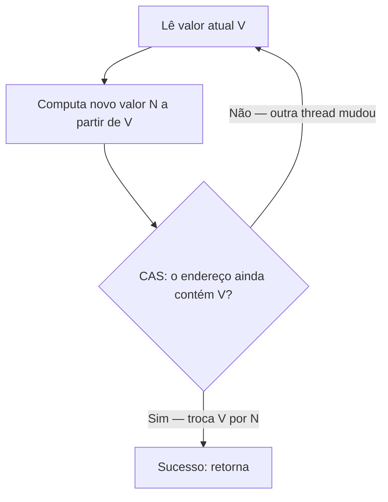
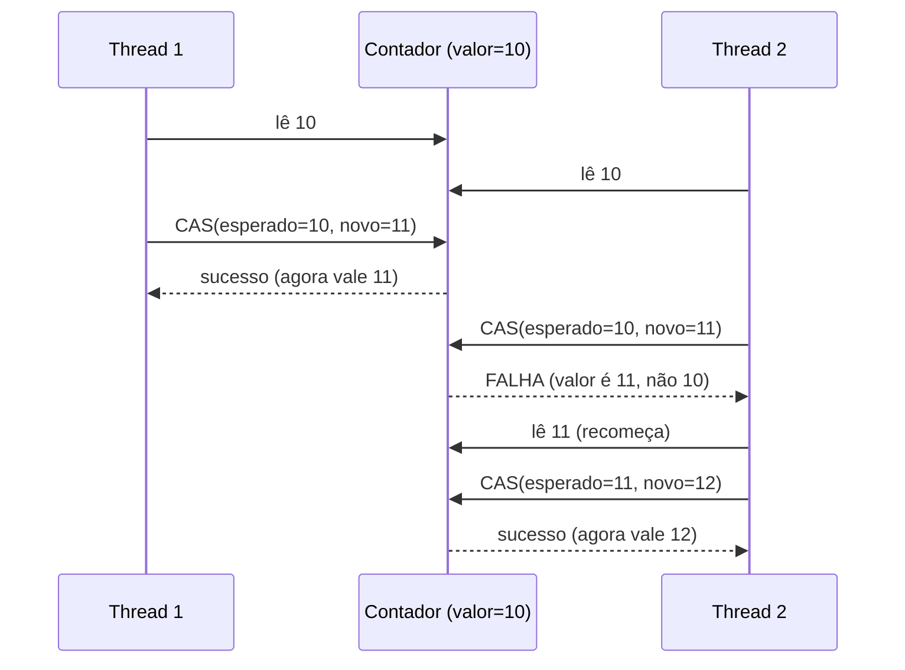
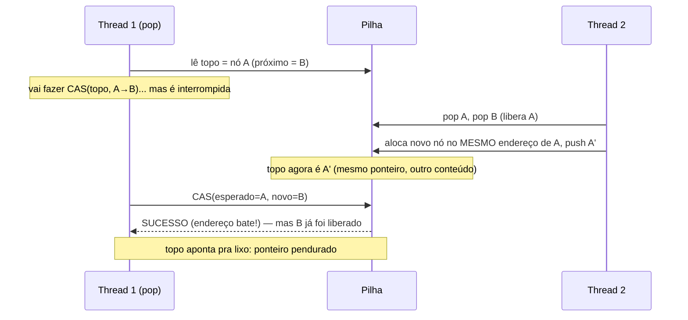
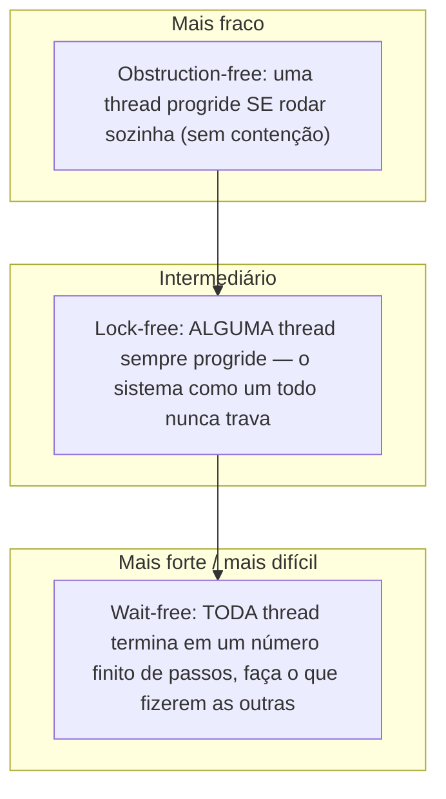
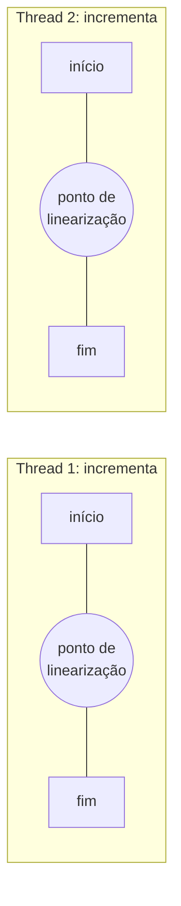
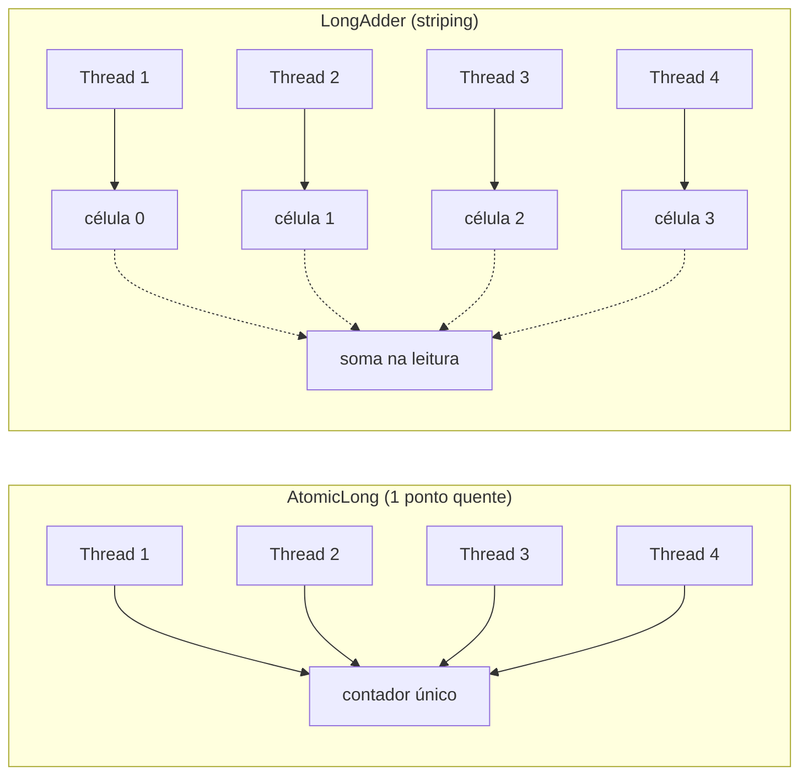
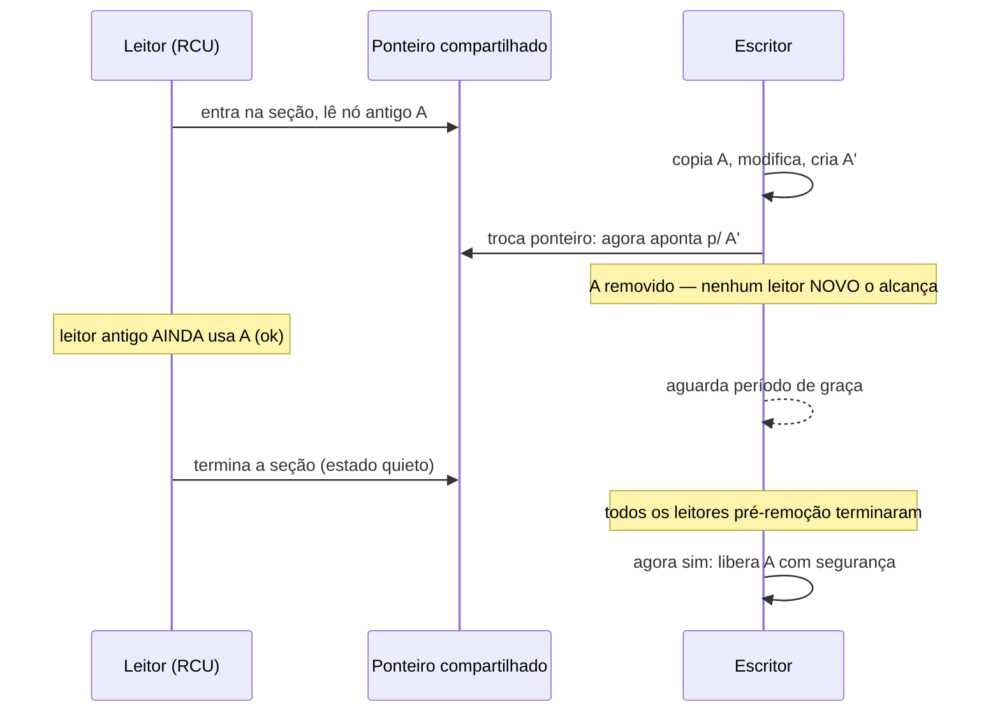

# Operações atômicas e lock-free

> [!abstract] Resumo em uma linha
> Em vez de travar, o lock-free aposta: lê o valor, calcula o novo, e só grava se ninguém mexeu no meio — tudo apoiado numa única instrução de hardware, o compare-and-swap.

Você já viu o problema em [[03 - Estado compartilhado e race conditions]]: duas threads incrementam o mesmo contador e o resultado vem errado. A cura óbvia é o lock — entra um, espera o outro (ver [[05 - Exclusão mútua - locks, mutexes e monitores]]). Mas o lock cobra pedágio: contention, context-switch, convoy, deadlock se você for desastrado. E se desse pra fazer o incremento certo *sem trancar a porta*?

Dá. A família de técnicas que faz isso se chama **lock-free**. E ela inteira repousa sobre uma única instrução mágica do processador.

---

## A instrução que move o mundo: CAS

Antes de qualquer estrutura sofisticada, precisamos de uma garantia do hardware: uma operação que o processador promete executar de forma **indivisível** — ou acontece toda, ou não acontece nada, e nenhuma outra thread enxerga um estado pela metade.

Há uma pequena família dessas instruções atômicas:

- **test-and-set** — escreve 1 numa posição e devolve o valor antigo, atomicamente. A base do spinlock mais primitivo: "se eu peguei 0, o lock é meu; se peguei 1, alguém chegou antes".
- **fetch-and-add** — soma um delta e devolve o valor anterior, atomicamente. O coração de um contador atômico.
- **compare-and-swap (CAS)** — a rainha. "Se o valor nesta posição *ainda* for X, troque por Y; senão, não faça nada e me avise que falhou." Tudo atomicamente.

No x86 isso é a instrução `CMPXCHG`, um compare-and-swap atômico que o processador resolve sem deixar ninguém espiar no meio. É o tijolo de hardware sobre o qual toda a concorrência lock-free é construída.

> [!tip] A analogia do quadro branco
> CAS é "só atualizo o quadro se ele ainda estiver como eu vi". Você fotografou o quadro, foi pra sua mesa pensar no que escrever, e voltou. Antes de apagar e reescrever, compara: o quadro está igual à foto? Se sim, pode escrever — ninguém mexeu. Se não, alguém passou na frente; você joga sua versão fora, tira foto de novo e recomeça. Nunca há um momento em que dois apagam por cima um do outro.

A assinatura conceitual do CAS é sempre a mesma:

```
boolean cas(endereço, valorEsperado, valorNovo):
    se *endereço == valorEsperado:
        *endereço = valorNovo
        retorna true       # consegui trocar
    senão:
        retorna false      # alguém mudou; tente de novo
```

Repare: o CAS **não bloqueia**. Ele não espera. Ele tenta uma vez e te conta na hora se deu certo. A inteligência de "tentar de novo" fica com você, em software.

---

## O loop CAS: otimismo em forma de código

Como transformar uma instrução que "tenta uma vez" num incremento sempre-correto? Com um loop. A receita lock-free é otimista: presume que ninguém vai atrapalhar, e se atrapalhar, refaz.

```
incrementaAtomico(contador):
    repita:
        atual = contador.lê()          # 1. lê o estado atual
        novo  = atual + 1              # 2. computa o novo valor localmente
        if contador.cas(atual, novo):  # 3. tenta trocar SE ainda for "atual"
            return novo                # sucesso: saio do loop
        # CAS falhou: outra thread mudou no meio. Volto ao passo 1.
```

Esse padrão — ler, computar, tentar CAS, repetir em caso de falha — é o **optimistic retry**, e é de longe a estratégia mais comum da programação lock-free. Não há lock em lugar nenhum. Se duas threads correm juntas, uma vence o CAS e segue; a outra vê o CAS falhar e simplesmente refaz a conta com o valor novo. Ninguém dorme, ninguém é bloqueado.

Vamos ao desenho do ciclo de vida de uma tentativa.



Leitura do diagrama: o caminho feliz desce reto — leio, calculo, troco, saio. O caminho de contenção é o laço de volta: se o CAS falha, eu não desisto nem espero, eu releio o valor (que agora é o que a outra thread deixou) e refaço. O loop só termina quando *eu* consigo aplicar minha mudança sobre um estado que ainda era o que eu vi.

Agora a versão com duas threads disputando, pra você sentir quem ganha e quem refaz.



Leitura do diagrama: ambas leem 10. A Thread 1 chega primeiro no CAS e troca 10 por 11. Quando a Thread 2 tenta seu CAS esperando 10, o valor já é 11 — falha. Ela não corrompeu nada: relê, vê 11, e tenta de novo com 11→12. Resultado final 12, correto. O CAS é o que impede o "lost update" clássico das race conditions — mas sem trancar a porta.

> [!info] CAS depende do modelo de memória
> O CAS não anda sozinho. Pra que uma thread veja o valor que a outra gravou — e na ordem certa — você precisa das garantias de visibilidade e ordenação de [[04 - Atomicidade, visibilidade e ordenação]]. Operações atômicas geralmente carregam semântica de barreira de memória embutida. Os detalhes formais de quando a propagação é garantida estão em [[11 - Modelos de memória e consistência]].

---

## O fantasma na máquina: o problema ABA

O loop CAS tem um pressuposto frágil escondido: "se o valor é o mesmo que eu li, então nada mudou". Mas valor igual não é a mesma coisa que *estado* igual.

> [!warning] O problema ABA, em uma frase
> A Thread 1 lê **A**. Outra thread muda **A → B → A**. Quando a Thread 1 faz o CAS, ela vê **A** e conclui "ninguém mexeu" — mas tudo mudou no meio. O CAS sucede quando *não deveria*.

A analogia: você olha a vaga do estacionamento, está ocupada pelo carro A. Você dá uma volta. Nesse intervalo o carro A sai, um carro B estaciona e vai embora, e o carro A volta para a mesma vaga. Você retorna, vê "carro A na vaga", e jura que ninguém saiu — quando na verdade houve um rodízio inteiro que você não testemunhou.

Com inteiros isso costuma ser inofensivo (10 voltar a ser 10 dá no mesmo). O perigo mora nas **estruturas com ponteiros reciclados**. Imagine uma pilha lock-free:



Leitura do diagrama: a Thread 1 quer remover o topo A e apontar o topo pra B. Antes do CAS, a Thread 2 remove A e B, libera A, e por azar do alocador reusa *o mesmo endereço* para um novo nó. O endereço do topo volta a ser "A". O CAS da Thread 1 compara endereços, vê que bate, e sucede — instalando como topo um ponteiro B que já foi reciclado e aponta para lixo. Resultado: corrupção silenciosa de memória, o tipo de bug que aparece uma vez por mês em produção.

Qualquer estrutura lock-free que usa CAS sobre ponteiros precisa lidar com o ABA. As curas mais comuns:

- **Contador de versão / stamped reference** — não compare só o ponteiro, compare o par `(ponteiro, contador)`. A cada modificação, o contador incrementa. A → B → A muda o contador de 0 para 2; o CAS, agora sobre o par, falha como deveria. No Java é o `AtomicStampedReference`.
- **Hazard pointers** — cada thread publica os ponteiros que está usando agora numa lista visível. Um nó só é desalocado de fato quando *nenhuma* thread tem aquele ponteiro marcado como "em uso". Isso impede a reciclagem prematura do endereço, fechando a janela do ABA. São lock-free, mas rastreiam um número fixo de ponteiros por thread.
- **Garbage collection** — em linguagens com GC (como Java), o coletor só recolhe um objeto quando ninguém mais o referencia. Logo o endereço de A *não pode* ser reusado enquanto a Thread 1 ainda segura A. O GC mata a forma clássica do ABA de graça — uma das razões pelas quais escrever lock-free em Java é menos traiçoeiro do que em C++.

> [!note] Por que o GC ajuda mas não resolve tudo
> O GC elimina a *reciclagem de endereço*, que é a versão mais perigosa do ABA. Mas o ABA lógico ainda existe: se o seu CAS só compara valores e o valor voltou a ser o mesmo por coincidência semântica, a decisão pode estar errada mesmo sem corrupção de memória. Para esses casos o contador de versão continua sendo a ferramenta certa.

---

## Taxonomia do progresso: obstruction, lock, wait

"Lock-free" virou buzzword e costuma ser usado de forma vaga. Há na verdade uma hierarquia precisa de **garantias de progresso** para algoritmos não-bloqueantes, do mais fraco ao mais forte.



Leitura do diagrama: a seta aponta para garantias estritamente mais fortes. Toda implementação wait-free é também lock-free, e toda lock-free é também obstruction-free; o inverso não vale. Subir um degrau é sempre mais difícil de provar e de codar.

Em detalhe:

- **Obstruction-free** — a garantia mais fraca. Uma thread completa sua operação num número finito de passos *se executada em isolamento*, ou seja, sem interferência. Sob contenção, duas threads podem ficar se atrapalhando indefinidamente (livelock), uma desfazendo o trabalho da outra. Não há deadlock, mas também não há promessa de que alguém termine quando há disputa.
- **Lock-free** — a garantia do meio, e a mais comum na prática. Em qualquer execução infinita, infinitas operações terminam: **alguém sempre progride**. Dito de forma crua: o sistema como um todo nunca emperra, mas *você* especificamente pode azarar e refazer seu loop CAS muitas vezes enquanto outras threads passam na frente. Se uma thread for suspensa pelo escalonador no meio da operação, as demais continuam — não há lock global a segurar ninguém.
- **Wait-free** — a garantia mais forte. **Toda** thread termina sua operação num número *limitado* de passos, independentemente do que as outras façam. Ninguém pode ser indefinidamente preterido (starvation impossível). É a propriedade que você quer em sistemas de tempo real, onde latência de cauda importa. Também é a mais difícil de projetar: poucas estruturas wait-free existem, e costumam ser mais complexas e às vezes mais lentas no caso médio do que suas primas lock-free.

> [!question] Lock-free garante que minha thread vai terminar rápido?
> Não. Lock-free garante que *o sistema* progride, não que *você* progride. Sob contenção alta, uma thread azarada pode rodar o loop CAS dezenas de vezes. A garantia de que *toda* thread termina em passos finitos é exclusiva do wait-free. Confundir os dois é um erro clássico de entrevista.

---

## Linearizabilidade: o que significa "correto"

Falamos em "loop CAS correto", "fila lock-free correta" — mas o que é *correção* numa estrutura concorrente? Num programa sequencial, a resposta é trivial: rode as operações na ordem que você escreveu, veja se o resultado bate com a especificação. Quando duas threads executam ao mesmo tempo, as operações se *sobrepõem no tempo* — não há mais uma ordem óbvia. Precisamos de um critério formal. Esse critério é a **linearizabilidade**, definida por Maurice Herlihy e Jeannette Wing num paper de 1990 que virou pedra fundamental.

> [!abstract] Linearizabilidade, em uma frase
> Uma execução é linearizável se cada operação parece tomar efeito **instantaneamente** em algum único ponto entre o seu início (invocação) e o seu fim (resposta), e a sequência resultante desses pontos respeita a especificação sequencial do objeto.

A ideia é poderosa porque te devolve o raciocínio sequencial. Se toda operação concorrente pode ser "colapsada" num instante, então o conjunto inteiro tem uma ordem total — e você pode verificar a correção como se fosse código de uma thread só. Esse instante mágico tem nome: o **ponto de linearização**. É o momento exato em que a operação "acontece de verdade".

Num loop CAS, o ponto de linearização é fácil de apontar: é o instante do CAS bem-sucedido. Antes dele, sua mudança não existe para ninguém; depois dele, ela existe para todos, atomicamente. As leituras e o cálculo local que vieram antes não contam — só o CAS que venceu. Por isso o loop CAS é o exemplo de manual de uma operação linearizável: ele tem um único ponto, nítido, onde tudo vira realidade.



Lead-in: as duas operações se sobrepõem no tempo (ambas estão "no ar" ao mesmo tempo), mas cada uma tem um instante em que de fato toma efeito.

Leitura do diagrama: cada thread tem um intervalo entre início e fim, e dentro desse intervalo um ponto (o círculo) onde a operação se torna real para o mundo todo. A linearizabilidade só exige que exista *alguma* ordem desses pontos consistente com a especificação — aqui, se o ponto da Thread 1 vem antes do da Thread 2, o resultado é "primeiro um incremento, depois o outro", e o contador termina certo. O que ela proíbe é qualquer execução que não case com nenhuma ordenação válida dos pontos.

> [!info] Linearizável × sequencialmente consistente × serializável
> Três critérios parecidos, com forças diferentes — pergunta de entrevista frequente.
> - **Linearizável** — respeita o **tempo real**. Se a operação A terminou *antes* de B começar, então A é ordenada antes de B. É o critério mais forte do mundo de objetos concorrentes em memória compartilhada; é o que estruturas lock-free almejam.
> - **Sequencialmente consistente** — todas as threads concordam numa *mesma ordem total* das operações, mas essa ordem **não precisa respeitar o relógio**. B pode ser ordenada antes de A mesmo que A tenha terminado antes — desde que todo mundo veja a mesma história. Mais fraca que linearizabilidade. (Conecta com [[11 - Modelos de memória e consistência]].)
> - **Serializável** — o critério do **banco de dados**, e opera sobre **transações** (grupos de operações), não operações isoladas. Garante que o efeito de transações concorrentes equivale a *alguma* execução serial delas — sem exigir qual ordem nem que ela respeite o tempo real. A versão que soma o tempo real chama-se *strict serializability*.
>
> Resumo: linearizabilidade está para uma única operação atômica assim como serializabilidade está para uma transação inteira. Uma é o rigor do lock-free; a outra é o rigor do ACID (ver isolamento em [[03-Dominios/Fundamentos/Banco de Dados/index|Banco de Dados]]).

Por que isso importa na prática? Porque "linearizável" é o contrato que permite compor. Se cada estrutura concorrente que você usa é linearizável, você pode raciocinar sobre ela como uma caixa-preta atômica, sem reabrir a prova interna a cada uso. É a abstração que torna as concurrent collections *usáveis* sem virar especialista no algoritmo de dentro.

---

## Por que lock-free escala — e por que dói

A motivação é real. Sem lock, somem várias dores de cabeça da [[05 - Exclusão mútua - locks, mutexes e monitores]]:

- **Sem deadlock** — não há aquisição de múltiplos locks, logo não há ciclo de espera possível.
- **Sem convoy** — uma thread que é suspensa segurando um lock paralisa todas que esperam por ele. Em lock-free não existe esse lock, então uma thread suspensa não congela as outras.
- **Sem context-switch por bloqueio** — ninguém é estacionado pelo SO; as threads continuam ativas.
- **Escala melhor sob alta concorrência** — quanto mais threads, pior o lock costuma se comportar (contention serializa tudo); o lock-free, bem feito, degrada mais graciosamente.

Mas não há almoço grátis.

> [!danger] O preço do lock-free
> - **É difícil de escrever certo.** A correção depende intimamente do modelo de memória ([[04 - Atomicidade, visibilidade e ordenação]] e [[11 - Modelos de memória e consistência]]). Esquecer uma barreira ou subestimar um reordenamento gera bugs que só aparecem em hardware específico, sob carga específica, uma vez a cada mil execuções.
> - **Retry desperdiça CPU sob contenção alta.** Se vinte threads brigam pelo mesmo endereço, dezenove gastam ciclos refazendo o loop CAS a cada rodada. O "tight CPU loop" que parecia elegante vira queima de energia.
> - **As estruturas são notoriamente sutis.** O ABA é só a ponta. Reciclagem de memória, ordering, e provas de correção fazem com que pouquíssima gente escreva estruturas lock-free do zero — quase todo mundo usa as prontas (ver [[03-Dominios/Java/Concorrência e paralelismo/index|Concorrência (Java)]]).

A regra prática: **use** estruturas lock-free (elas são a base das concurrent collections), mas pense muito antes de **escrever** uma.

---

## Contadores: o gargalo escondido do CAS

Aqui está um paradoxo interessante. O contador atômico via CAS é o exemplo-canônico do lock-free — e também o lugar onde ele mais sofre.

O problema: todas as threads brigam pela *mesma* posição de memória. Sob alta contenção, isso é duplamente ruim. Primeiro, os CAS falham muito e refazem o loop. Segundo, e pior, há **false sharing**: a linha de cache que contém o contador é constantemente invalidada e ressincronizada entre os núcleos. Cada incremento de uma thread força os outros núcleos a recarregar a linha. O contador vira um ponto de serialização disfarçado — o gargalo migra do lock para o tráfego de coerência de cache (ver [[04 - Atomicidade, visibilidade e ordenação]]).

A solução é elegante: **striping**. Em vez de um único contador, mantenha várias **células** (cada uma numa linha de cache própria, com padding). Cada thread soma na *sua* célula, escolhida por hash da identidade da thread. A leitura do total agrega todas as células de uma vez. É exatamente o que o `LongAdder` do Java faz.



Leitura do diagrama: à esquerda, quatro threads colidem no mesmo endereço — máxima contenção, máximo false sharing. À direita, cada thread escreve numa célula separada (em linhas de cache distintas, sem falsa partilha), então quase nunca colide. O custo se paga na leitura, que precisa somar todas as células — mas escritas de contador são tipicamente muito mais frequentes que leituras. Troca-se leitura barata-exata por escrita altamente escalável.

> [!tip] Quando usar o quê
> `AtomicLong` quando você precisa do valor exato a cada passo (ex.: gerar IDs sequenciais) ou a contenção é baixa. `LongAdder` quando é puro acumulador sob alta contenção (ex.: métricas, contadores de hits) e você só lê o total esporadicamente. O `LongAdder` quase sempre vence em throughput de escrita concorrente; perde se você precisa de leitura constante e exata.

---

## Estruturas lock-free: panorama

Você raramente vai implementar uma, mas vale conhecer as duas referências históricas — elas são a base conceitual das concurrent collections.

- **Pilha de Treiber** — a pilha lock-free, publicada por R. Kent Treiber em 1986. O topo é um ponteiro; `push` e `pop` são loops CAS sobre esse ponteiro (CAS troca o topo antigo pelo novo nó). Simples e elegante — e o caso de manual do problema ABA, justamente porque recicla nós do topo.
- **Fila de Michael-Scott** — a fila lock-free clássica (Michael & Scott, 1996), com ponteiros `head` e `tail` separados, cada um atualizado por CAS. É a base de implementações como a `ConcurrentLinkedQueue` do Java. Lida com o ABA tipicamente via contadores de versão.

Ambas mostram a mesma ideia: substituir "tranque a estrutura, modifique, destranque" por "leia o ponteiro, prepare a mudança, CAS o ponteiro; se falhou, releia e refaça". O otimismo do loop CAS aplicado a topologias de ponteiro.

> [!note] A ponte com a memória transacional
> O loop CAS é otimismo em pequena escala: aposto que ninguém mexeu numa palavra. A [[09 - Memória transacional e otimismo]] generaliza essa aposta para *blocos inteiros* de operações: execute a transação especulativamente e, se houver conflito, aborte e refaça. É o mesmo espírito otimista, num grão maior.

---

## O problema mais difícil: quando posso liberar a memória?

Aqui mora a parte genuinamente assustadora do lock-free com ponteiros — mais sutil até que o ABA, e na verdade sua causa raiz. Quando uma thread remove um nó de uma estrutura (faz `pop`, ou retira um elemento), ela quer **liberar** aquela memória. Mas e se *outra* thread, naquele exato instante, ainda estiver segurando um ponteiro para o mesmo nó, prestes a lê-lo? Se você der `free`, ela vai ler memória liberada — ou pior, memória já realocada para outra coisa. Em C/C++, isso é o pesadelo: use-after-free, corrupção silenciosa, o bug que aparece uma vez por semana e some quando você liga o debugger.

> [!warning] A pergunta central do reclamation
> Num programa com lock, a resposta é trivial: ninguém mais tem o ponteiro porque ninguém entrou na seção crítica. Sem lock, **não existe** esse momento garantido de "agora ninguém está olhando". Você precisa de um mecanismo explícito para descobrir quando é seguro liberar.

Em linguagens com garbage collector (Java, C#, Go), o GC resolve isso de graça: o objeto não é coletado enquanto qualquer thread o referencia. Por isso escrever lock-free em Java é *muito* menos traiçoeiro que em C++ — você herda um reclamation manager mundial. Mas o GC tem custo e pausas, e em C/C++/kernel ele simplesmente não existe. Surgiram então três esquemas clássicos de **recuperação segura de memória** (safe memory reclamation).

### Ponteiros de risco (hazard pointers)

Proposto por Maged Michael (2004), o esquema é direto: cada thread, antes de acessar um nó, **publica** o ponteiro para aquele nó numa lista global de "ponteiros em uso" — os *hazard pointers* ("ponteiros de risco", no sentido de "perigoso liberar"). Quando uma thread quer liberar um nó removido, ela não chama `free` na hora: coloca o nó numa lista de aposentados (*retired list*) e, periodicamente, varre os hazard pointers de todas as threads. Um nó só é liberado de verdade quando **nenhuma** thread o tem publicado como em uso.

É elegante: usa só leituras e escritas de uma palavra, não depende de kernel nem de scheduler, e de quebra resolve o ABA (o endereço não pode ser reciclado enquanto alguém o protege). O custo: cada leitor paga uma escrita+barreira para publicar o ponteiro, e há um número fixo de hazard pointers por thread.

### Recuperação por épocas (epoch-based reclamation)

Uma alternativa de menor overhead por leitura. Há um contador global de **épocas**. Cada thread, ao entrar numa operação, anuncia a época corrente; ao sair, anuncia que está "quieta". Nós aposentados são etiquetados com a época em que saíram, e só podem ser liberados quando *todas* as threads avançaram para além daquela época — prova de que ninguém que pudesse tê-los visto ainda está ativo. Leitores quase não pagam nada (só um marcador de entrada/saída), mas uma única thread presa numa operação longa **segura a liberação de todo mundo** — o calcanhar de aquiles do esquema.

### RCU (read-copy-update): a versão do kernel Linux

RCU é o mecanismo que o kernel Linux usa em escala massiva, e é a encarnação mais radical da ideia "leitores de graça, escritor adia a liberação". O nome conta o algoritmo: **Read** (leitores entram numa seção crítica RCU quase sem custo — sem locks, sem CAS, às vezes sem barreira nenhuma), **Copy** (o escritor que quer mudar algo faz uma cópia nova, modifica a cópia, e troca o ponteiro atomicamente), **Update** (a publicação do novo ponteiro).

O pulo do gato é o **período de graça** (*grace period*). O escritor divide a remoção em duas fases: tira o nó da estrutura *imediatamente* (a partir daí, nenhum leitor *novo* consegue alcançá-lo) e **adia a liberação** até que todos os leitores que *já estavam* na sua seção crítica quando o nó foi removido tenham terminado. Esse intervalo é o período de graça; o kernel oferece `synchronize_rcu()` (bloqueia o escritor até ele passar) e `call_rcu()` (registra um callback de liberação assíncrono). A genialidade: o escritor não precisa saber *quem* são os leitores — só esperar que todos passem por um estado quieto.



Lead-in: o escritor remove o nó na hora, mas só o libera quando tem certeza de que nenhum leitor de antes ainda o segura.

Leitura do diagrama: o leitor entra e lê o nó antigo A. O escritor cria A', troca o ponteiro (a estrutura já aponta para o novo) e **não libera A** — ele sabe que o leitor de cima ainda pode estar com A na mão. Em vez de sincronizar com o leitor (o que custaria caro e mataria a vantagem de "leitor de graça"), o escritor simplesmente *espera* o período de graça: o intervalo após o qual todo leitor que existia no momento da remoção já passou por um estado quieto. Só então a liberação de A é segura. O leitor nunca pagou nenhum lock; todo o peso ficou no lado da escrita, que é mais raro.

> [!tip] A intuição comum aos três
> Hazard pointers, épocas e RCU resolvem a *mesma* pergunta — "já posso liberar?" — com a mesma estratégia: **adiar a liberação** até provar que nenhum leitor concorrente ainda alcança o nó. Mudam só o *como provar*: hazard pointers rastreiam ponteiros individuais (preciso, mais caro por leitura); épocas e RCU rastreiam *tempo* (barato por leitura, mas um leitor lento atrasa todo mundo). É sempre uma troca entre custo do leitor e prontidão da liberação.

---

## CAS fraco × forte, e a alternativa LL/SC

Dois detalhes de baixo nível que separam quem leu o manual de quem só ouviu falar de CAS.

**CAS fraco × forte.** Algumas APIs (como `compareAndSet` × `weakCompareAndSet` no Java, ou as variantes do C++11) oferecem um CAS *fraco*, que pode falhar **espuriamente** — isto é, falhar mesmo quando o valor *era* o esperado, sem que ninguém tenha mudado nada. Por que alguém quereria isso? Porque em algumas arquiteturas o CAS fraco é mais barato, e dentro de um loop de retry uma falha espúria só custa mais uma volta — você ia reler e tentar de novo de qualquer jeito. Use o fraco dentro de loops; use o forte (`compareAndSet`) quando uma falha *tem* que significar "alguém mudou".

**LL/SC.** Nem todo processador implementa o CAS como primitivo. ARM e POWER oferecem em vez disso um par: **load-linked (LL)** lê uma posição e a marca como "vigiada"; **store-conditional (SC)** só grava se *nada* tocou aquela posição desde o LL — e devolve sucesso/falha. A diferença crucial: o SC falha se houve **qualquer escrita** no meio, mesmo que o valor tenha voltado ao original. Ou seja, **LL/SC detecta o ABA naturalmente** — onde o CAS veria "A = A, tudo bem", o SC vê "alguém escreveu aqui" e falha como deveria. O preço é a fragilidade: por implementação, LL/SC sofre falha espúria a cada context-switch ou acesso de memória no meio (o chamado *weak LL/SC*), então também precisa viver dentro de um loop de retry. Na prática, compiladores e bibliotecas constroem a abstração de CAS *em cima* de LL/SC nessas arquiteturas.

---

## Progresso sob contenção: o retry que se devora

Lock-free promete que *alguém* sempre progride. Mas há um modo de falha de performance escondido nessa promessa. Sob contenção altíssima — vinte threads brigando pelo mesmo endereço — em cada rodada uma vence o CAS e dezenove falham e refazem o loop. O sistema progride (o invariante lock-free se mantém), mas o trabalho útil despenca: a CPU queima em retries que se atropelam. Não é deadlock (alguém anda) nem o livelock puro de [[07 - Deadlock, livelock e starvation]] (lá *ninguém* anda), mas é um primo desconfortável — um *livelock de throughput*, onde o sistema gira muito e produz pouco.

A cura emprestada das redes (é o mesmo princípio do Ethernet/TCP): **recuo exponencial** (*exponential backoff*). Quando o seu CAS falha, em vez de atacar de novo na hora, espere um tempinho aleatório antes de reler e tentar. A cada nova falha, dobre a janela de espera. Quanto mais contenção você detecta (mais falhas seguidas), mais você recua — o que espalha as threads no tempo e drena a disputa. A probabilidade de duas threads colidirem repetidamente cai rápido. O custo é latência: sob baixa contenção, esperar é puro desperdício, então o backoff só compensa quando a disputa é real. Não há valores universais de janela mínima/máxima; afina-se por experimento conforme a carga.

---

## Quando NÃO ir lock-free

A honestidade que separa o senior do entusiasta: **lock-free quase nunca vale escrever à mão.** Tudo o que vimos — ABA, reclamation, ordering, linearizabilidade, backoff — conspira para que uma estrutura lock-free correta seja de uma sutileza absurda, e que os bugs sejam do tipo que só aparece num hardware específico, sob carga específica, uma vez a cada milhão de execuções, e some quando você tenta observá-lo.

A regra prática tem três camadas:

1. **Primeiro, tente um lock simples.** Um `mutex` (ver [[05 - Exclusão mútua - locks, mutexes e monitores]]) bem colocado é correto, óbvio e auditável. Para a esmagadora maioria dos casos, a contenção nem é alta o bastante para o lock importar. Otimização prematura para lock-free é um clássico tiro no pé.
2. **Se a contenção for real, use uma estrutura pronta.** As concurrent collections da plataforma (`ConcurrentHashMap`, `ConcurrentLinkedQueue`, `LongAdder`, ver [[03-Dominios/Java/Concorrência e paralelismo/index|Concorrência (Java)]]) já *são* lock-free ou lock-striped, escritas e provadas por especialistas, testadas por anos sob fogo. Você herda toda a correção de graça.
3. **Lock-free artesanal só em hot paths comprovados.** Reserve a implementação manual para o caminho que você *mediu* ser o gargalo, onde nenhuma estrutura pronta serve, e onde o ganho justifica o custo de revisão, prova e manutenção. Isso é raro — e quando acontece, normalmente é trabalho de um especialista dedicado, com testes de stress e ferramentas de model-checking.

> [!danger] O viés a evitar
> Lock-free é sedutor porque soa sofisticado. Mas "evitei o lock" não é, por si só, uma vitória — é uma aposta em dificuldade e risco de correção. A pergunta certa nunca é "dá pra fazer sem lock?", e sim "a contenção justifica pagar esse preço, e a estrutura pronta não basta?". Na maioria das vezes, a resposta honesta é: use o lock, ou use a biblioteca.

---

## Em entrevista

Speak in terms of progress guarantees, not vibes — interviewers test whether you know the hierarchy. A clean line: "Lock-free means the system always makes progress, but a given thread might retry; wait-free means *every* thread finishes in a bounded number of steps." Anchor everything on CAS: "compare-and-swap reads a value, and atomically swaps it only if it hasn't changed — that's the optimistic retry loop." Name the ABA problem unprompted, especially around pointer recycling, and offer the cures: version counters (stamped references), hazard pointers, or GC. Mention the contention cost — under heavy write contention a single atomic counter becomes a cache-coherence bottleneck (false sharing), which is exactly why `LongAdder` stripes across cells. When asked what "correct" means for a concurrent object, reach for linearizability: "each operation appears to take effect instantaneously at a single linearization point between its call and return — that's what lets me reason about it as if it were sequential," and contrast it with sequential consistency (same total order, no real-time guarantee) and serializability (the database's transaction-level cousin). If pointers come up, name the hard problem out loud: "the real difficulty isn't ABA, it's safe memory reclamation — knowing when no other thread still holds a node before I free it," then offer hazard pointers, epoch-based reclamation, and RCU (readers pay almost nothing; the writer defers freeing until a grace period proves all pre-existing readers are done). Close with honesty: "lock-free scales beautifully but is brutally hard to get right, so I reach for a mutex first, a concurrent collection second, and hand-rolled lock-free only on a hot path I've actually measured."

### Vocabulário PT → EN

- operação atômica → atomic operation
- comparar-e-trocar / CAS → compare-and-swap
- sem travas / lock-free → lock-free
- sem espera / wait-free → wait-free
- progride se isolado → obstruction-free
- problema ABA → ABA problem
- ponteiro de risco → hazard pointer
- garantia de progresso → progress guarantee
- contenção → contention
- repetição otimista → optimistic retry
- compartilhamento falso → false sharing
- linearizabilidade → linearizability
- ponto de linearização → linearization point
- consistência sequencial → sequential consistency
- serializabilidade → serializability
- recuperação de memória → memory reclamation
- recuperação por épocas → epoch-based reclamation
- período de graça → grace period
- recuo exponencial → exponential backoff
- carga-vinculada / gravação-condicional → load-linked / store-conditional (LL/SC)
- falha espúria → spurious failure

> [!info] Lastro
> - [Compare-and-swap — Wikipedia / CAS fundamentals (CMPXCHG no x86)](https://www.internalpointers.com/post/lock-free-multithreading-atomic-operations)
> - [ABA problem — Wikipedia](https://en.wikipedia.org/wiki/ABA_problem)
> - [Hazard pointer — Wikipedia](https://en.wikipedia.org/wiki/Hazard_pointer)
> - [Non-blocking algorithm (lock-free / wait-free / obstruction-free) — Wikipedia](https://en.wikipedia.org/wiki/Non-blocking_algorithm)
> - [Treiber stack — Wikipedia](https://en.wikipedia.org/wiki/Treiber_stack)
> - [Herlihy & Wing, "Linearizability: A Correctness Condition for Concurrent Objects" (TOPLAS 1990, PDF)](https://cs.brown.edu/people/mph/HerlihyW90/p463-herlihy.pdf)
> - [Linearizability — Wikipedia](https://en.wikipedia.org/wiki/Linearizability)
> - [Linearizability vs sequential consistency vs serializability — System Overflow](https://www.systemoverflow.com/learn/replication-consistency/consistency-models/linearizability-vs-sequential-vs-serializability-understanding-strong-consistency-models)
> - [Maged Michael, "Hazard Pointers: Safe Memory Reclamation for Lock-Free Objects" (IEEE TPDS 2004, PDF)](https://www.cs.otago.ac.nz/cosc440/readings/hazard-pointers.pdf)
> - [What is RCU? — The Linux Kernel documentation](https://docs.kernel.org/RCU/whatisRCU.html)
> - [Read-copy-update — Wikipedia](https://en.wikipedia.org/wiki/Read-copy-update)
> - [Load-link / store-conditional — Wikipedia](https://en.wikipedia.org/wiki/Load-link/store-conditional)
> - [CAS, ABA and LL/SC — memzero](https://blog.memzero.de/cas-llsc-aba/)
> - [Exponential back-off for lock-free contention — The Infinite Loop](https://geidav.wordpress.com/tag/exponential-back-off/)

## Veja também

- [[03 - Estado compartilhado e race conditions]] — o problema que o lock-free resolve sem travar
- [[04 - Atomicidade, visibilidade e ordenação]] — visibilidade, barreiras e false sharing, o chão sob o CAS
- [[05 - Exclusão mútua - locks, mutexes e monitores]] — a alternativa bloqueante, e suas dores
- [[09 - Memória transacional e otimismo]] — o mesmo otimismo, mas em blocos inteiros
- [[11 - Modelos de memória e consistência]] — quando a propagação entre threads é de fato garantida
- [[18 - Concorrência em entrevista]] — perguntas e armadilhas
- [[03-Dominios/Java/Concorrência e paralelismo/index|Concorrência (Java)]] — `AtomicInteger`, `AtomicReference`, `LongAdder` na prática
- [[03-Dominios/Fundamentos/Concorrência e Paralelismo/index|Concorrência e Paralelismo]] — índice do galho
