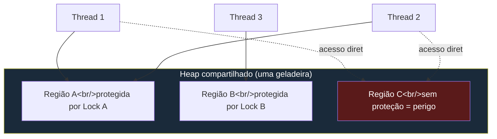
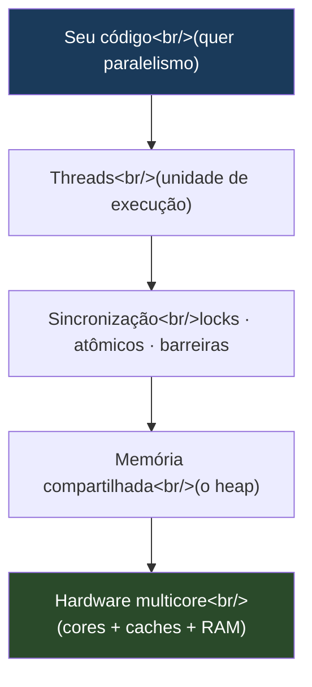
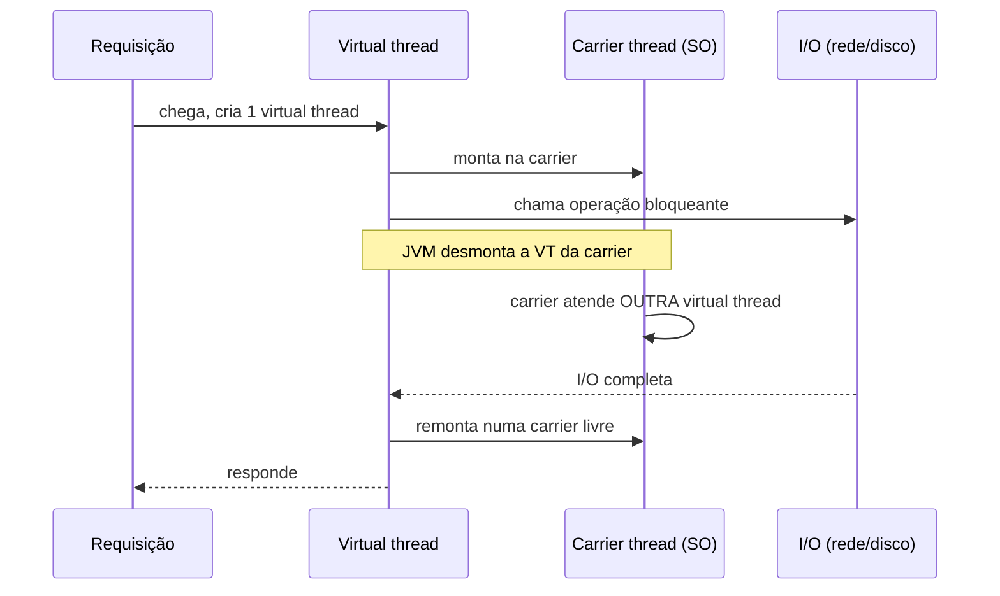
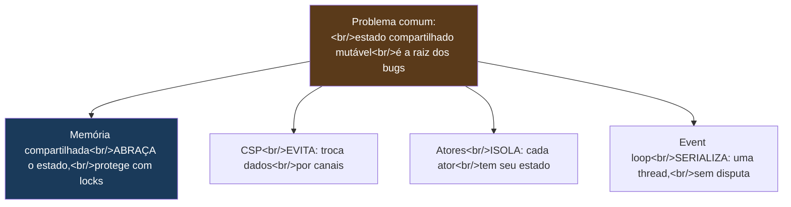

# Memória compartilhada com threads e locks

> [!abstract] Resumo em uma linha
> O modelo mais antigo e mais difícil da concorrência: várias threads dividem o mesmo heap e cabe ao programador coordenar cada acesso com locks e atômicos — poder máximo, responsabilidade máxima.

Você já passou pela fase Adepto inteira preparando este momento. Aprendeu o que dá errado quando duas threads tocam o mesmo dado `[[03 - Estado compartilhado e race conditions]]`, aprendeu a serializar o acesso com `[[05 - Exclusão mútua - locks, mutexes e monitores]]`, a coordenar com `[[06 - Semáforos e coordenação]]`, a evitar o lock de vez com `[[08 - Operações atômicas e lock-free]]`, e a temer os patológicos `[[07 - Deadlock, livelock e starvation]]`. Agora a pergunta muda de nível.

Não é mais "como faço um lock funcionar?". É: **isto tudo é UM modelo de concorrência** — uma família de respostas para uma única pergunta de fundo. E existem outros modelos que respondem à mesma pergunta de um jeito radicalmente diferente. Este é o primeiro deles, o dominante, o padrão de fábrica da indústria.

## A cozinha com uma geladeira só

Imagine uma cozinha de restaurante movimentado. Vários cozinheiros (as threads). Uma geladeira só (o heap). Todos podem abrir a geladeira, pegar ingredientes, mexer, devolver. É rápido e flexível — ninguém precisa pedir comida a um garçom intermediário, cada um vai lá e serve-se.

Mas há um problema. Se dois cozinheiros abrem a geladeira ao mesmo tempo para pegar o último ovo, um deles sai de mãos vazias — ou pior, os dois acham que pegaram e a receita quebra lá na frente. Se um cozinheiro está reorganizando uma prateleira enquanto outro lê dela, o segundo vê meia-prateleira. E se dois precisam, cada um, de dois utensílios que o outro já segurou, ninguém solta e a cozinha trava `[[07 - Deadlock, livelock e starvation]]`.

A solução do modelo de memória compartilhada é colocar **cadeados nas prateleiras**. Quem quer mexer numa prateleira pega o cadeado antes, mexe sozinho, e devolve o cadeado depois. É exatamente isso que um `lock` faz. A geladeira continua compartilhada — só o *acesso* a cada região vira exclusivo enquanto durar a operação.



Lead-in: as setas cheias passam por um lock; as pontilhadas tocam a região C direto.

Leitura do diagrama: três threads dividem um mesmo heap. As regiões A e B têm cadeados — duas threads podem querer A, mas o lock garante que só uma mexe por vez. A região C (vermelha) não tem proteção: qualquer thread toca direto, a qualquer momento. **É ali que mora a race condition.** O modelo não impede o acesso desprotegido — ele só te dá as ferramentas. A disciplina é sua.

> [!tip] O contrato do modelo em uma frase
> Threads compartilham memória mutável; a corretude depende inteiramente de o programador colocar a sincronização certa em cada ponto certo. Nada é protegido por padrão.

## Por que este modelo domina

Não é por acaso que Java, C++, C#, Rust e Kotlin nasceram com este modelo no centro. Há quatro razões pesadas.

**Mapeia direto no hardware.** Uma máquina multicore *é* memória compartilhada de verdade — vários núcleos, uma RAM, caches que precisam de coerência. Threads sobre memória compartilhada são o reflexo de software dessa realidade física. Nenhuma camada de abstração mente sobre o que a máquina faz.

**Performance.** Compartilhar um ponteiro custa zero. Não há cópia de mensagem, não há serialização, não há fila intermediária. Para paralelismo CPU-bound de alto desempenho — processar uma matriz gigante dividida entre núcleos — esse é o caminho mais curto entre o dado e o trabalho.

**Controle fino.** Você decide a granularidade do lock, escolhe entre `synchronized` e `ReentrantLock`, troca um lock por um atômico, faz lock-free quando a contenção dói. Nenhum outro modelo te dá essa régua de ajuste.

**Ecossistema maduro.** Décadas de bibliotecas, ferramentas de profiling, detectores de race, padrões de projeto consolidados. `java.util.concurrent` sozinho é uma enciclopédia.



Lead-in: a pilha do modelo, do seu código até o silício.

Leitura do diagrama: seu código pede paralelismo; as threads o executam; a sincronização disciplina o acesso à memória compartilhada; a memória descansa sobre o hardware multicore real. O ponto da figura é que cada camada é fina — quase não há tradução. É por isso que o modelo é rápido. E é por isso, veremos já, que ele é perigoso: nada esconde o estado compartilhado de você.

## Por que é o mais difícil de acertar

A mesma proximidade do hardware que dá performance cobra um preço cruel: **o programador é responsável por TODA a sincronização**. O compilador não te avisa que faltou um lock. O runtime não recusa um acesso desprotegido. O código compila, roda, passa nos testes — e quebra em produção sob carga, num núcleo ARM, uma vez a cada dez milhões de requisições.

Há um consenso na literatura que vale gravar: *shared mutable state is the root of most concurrency bugs*. Os três fantasmas:

- **Race conditions** — a ordem de execução muda o resultado `[[03 - Estado compartilhado e race conditions]]`.
- **Deadlocks** — duas threads esperam para sempre uma pela outra `[[07 - Deadlock, livelock e starvation]]`.
- **Erros de visibilidade** — uma thread escreve, outra nunca enxerga a escrita, porque o valor ficou num cache de núcleo. Este é o mais sorrateiro: não há corrida temporal, há *invisibilidade* de memória.

> [!warning] O bug que esconde o bug
> No x86 a JVM costuma ser mais estrita do que o spec exige, mascarando erros de visibilidade que só apareceriam no ARM. Seu código "funciona" no laptop e morre no servidor. Por isso o modelo de memória `[[11 - Modelos de memória e consistência]]` é o assunto que separa o pleno do sênior.

Note a assimetria com os outros perigos. Uma race tem ao menos a chance de aparecer num teste de estresse. Um erro de visibilidade pode estar correto em 100% dos seus testes e errado na natureza, porque depende do modelo de memória do *processador*, não da sua lógica.

## Showcase: como Java materializa o modelo

Java é o exemplar canônico deste modelo, e o galho dedicado tem toda a mecânica: `[[03-Dominios/Java/Concorrência e paralelismo/index|Concorrência (Java)]]` e `[[Java Concurrency]]`. Aqui o objetivo é outro — mostrar como o *modelo abstrato* vira *concreto* na linguagem, sem repetir o detalhe.

**A unidade de execução: `Thread` e `Runnable`.** O cozinheiro do nosso exemplo. Você descreve o trabalho num `Runnable` e o entrega a uma thread.

```java
Runnable tarefa = () -> processar(lote);
Thread t = new Thread(tarefa);
t.start();   // agora há dois cozinheiros na cozinha
```

**O lock embutido: `synchronized`.** Todo objeto Java carrega um *monitor* intrínseco `[[05 - Exclusão mútua - locks, mutexes e monitores]]`. A palavra `synchronized` pega esse monitor na entrada e solta na saída — o cadeado da prateleira, gratuito em cada objeto.

```java
private int contador = 0;

public synchronized void incrementa() {
    contador++;          // exclusão mútua: um cozinheiro por vez
}
```

**O contrato invisível: o Java Memory Model.** Aqui está o coração da dificuldade. O JMM define quando uma escrita de uma thread fica *visível* para a leitura de outra, via a relação **happens-before**. Sem um elo happens-before entre a escrita e a leitura do mesmo dado, você tem um *data race* — e o resultado é indefinido, não apenas "atrasado". `synchronized`, `volatile` e os atômicos existem tanto para excluir mutuamente quanto para *estabelecer* esses elos. A nota `[[11 - Modelos de memória e consistência]]` trata disso a fundo; basta reter: **o lock não serve só para travar — serve para tornar a escrita visível.**

```java
private volatile boolean pronto = false;
// uma escrita volatile "happens-before" a leitura volatile seguinte:
// a thread leitora enxerga TUDO que a escritora fez antes de pronto = true
```

**A caixa de ferramentas industrial: `java.util.concurrent`.** Quando `synchronized` é grosso demais, o pacote `j.u.c` entrega locks explícitos (`ReentrantLock`, `ReadWriteLock`), atômicos sem lock (`AtomicInteger`, `LongAdder`) `[[08 - Operações atômicas e lock-free]]`, coleções concorrentes (`ConcurrentHashMap`) e *executors* — pools de threads que separam "que trabalho fazer" de "em qual thread fazer", para você não criar threads na mão.

```java
ExecutorService pool = Executors.newFixedThreadPool(8);
pool.submit(() -> processar(lote));   // o pool gerencia os cozinheiros
```

### A virada do Project Loom

Por anos, o calcanhar do modelo Java foi o custo da thread. Uma thread de plataforma é uma thread do SO — pesada, megabytes de pilha, cara de criar. Então a indústria inteira aprendeu a *evitar* threads: pools, callbacks, programação assíncrona reativa `[[14 - Loop de eventos e assincronia]]` — código contorcido só para não pagar o preço da thread.

O **Project Loom**, finalizado no Java 21, mudou o jogo com as **virtual threads**. Uma virtual thread é gerenciada pela JVM, não pelo SO. Consome kilobytes, não megabytes. Quando bloqueia (I/O, lock, sleep), a JVM captura sua continuação, *desmonta* a virtual thread da carrier thread (uma thread de SO real, que nunca bloqueia) e monta outra no lugar. Resultado: você pode ter *milhões* de virtual threads.

> [!important] O que Loom NÃO muda
> Virtual threads continuam no modelo de memória compartilhada. Elas ainda dividem o heap, ainda exigem locks, ainda sofrem race conditions e erros de visibilidade. Loom não troca o modelo — torna barato o estilo "uma thread por tarefa", que o custo das threads de plataforma havia proibido. A dificuldade da sincronização permanece intacta.



Lead-in: o ciclo de uma virtual thread numa requisição que bloqueia em I/O.

Leitura do diagrama: cada requisição ganha sua própria virtual thread — código sequencial, fácil de ler. Quando ela bloqueia em I/O, a JVM a desmonta e libera a carrier (thread de SO real) para atender outra virtual thread. A thread de SO nunca fica parada esperando. Você escreve código simples e bloqueante; a JVM colhe a escalabilidade que antes só o estilo assíncrono dava.

> [!caution] Pinning
> Há um porém: se uma virtual thread bloqueia *dentro* de um bloco `synchronized`, ela fica **pinned** — não pode ser desmontada, e prende a carrier. Em código pesado de virtual threads, prefira `ReentrantLock` a `synchronized` nesses pontos. Mais um detalhe que o modelo de memória compartilhada deixa por sua conta.

## Este modelo × os outros quatro

Aqui está a virada de chave conceitual da fase Magus. Memória compartilhada não é "a concorrência" — é *uma resposta* a um problema. E o problema é justamente o estado compartilhado mutável. Os outros modelos são respostas diferentes à *mesma* pergunta: como evitar, esconder ou domar esse estado?



Lead-in: um problema, quatro estratégias.

Leitura do diagrama: todos partem do mesmo mal — estado compartilhado mutável. **Memória compartilhada** o abraça e o protege com sincronização explícita (este é o modelo desta nota). **CSP** `[[12 - Troca de mensagens e CSP]]` diz "não comunique compartilhando memória; compartilhe memória comunicando" — os dados andam por canais. **Atores** `[[13 - O modelo de atores]]` dá a cada ator seu estado privado e só permite mensagens entre eles. **Event loop** `[[14 - Loop de eventos e assincronia]]` simplesmente roda tudo numa thread só, eliminando a disputa pela base. São filosofias distintas; o capstone `[[18 - Concorrência em entrevista]]` compara todas lado a lado.

> [!note] A diferença essencial
> Memória compartilhada é o único modelo que *expõe* o estado compartilhado e te dá ferramentas para protegê-lo. Os outros três o *escondem* atrás de uma abstração — canais, mensagens, ou uma thread única. Por isso são mais seguros por construção, e por isso pagam em performance ou flexibilidade. Não há almoço grátis.

## Onde brilha × onde evitar

**Brilha quando:**

- O trabalho é **CPU-bound de alto desempenho** — dividir um cálculo pesado entre núcleos, sem o custo de copiar dados entre eles.
- Você precisa de **controle fino** sobre granularidade de lock, layout de memória, estratégias lock-free.
- O ecossistema importa: libs maduras, profilers, padrões consolidados (todo o `java.util.concurrent`).

**Evite quando:**

- A complexidade de sincronização **não compensa** o ganho. Se você está lutando contra deadlocks num CRUD, está no modelo errado.
- Você pode usar **imutabilidade** em vez de locks `[[08 - Imutabilidade e estado]]` — dado imutável é compartilhável sem sincronização nenhuma, e o JMM até garante *initialization safety* para campos `final` de objetos bem construídos.
- O problema é I/O-bound e cabe melhor num **modelo de mais alto nível** — um event loop, atores, ou CSP, onde a segurança vem de graça com a estrutura.

> [!tip] A regra de ouro
> O melhor estado compartilhado é o que não existe. A segunda melhor opção é o imutável. Lock é a terceira — poderosa, necessária, mas a que mais cobra disciplina. Comece pelo topo da lista.

## Em entrevista

Frame it as a *model* among several, not as "concurrency itself". Say: shared-memory threading is the default model in Java, C++, C#, and Rust because it maps directly onto multicore hardware and gives the finest control and best raw performance. Then name its cost crisply: the programmer is responsible for all synchronization, and *shared mutable state is the root of most concurrency bugs* — races, deadlocks, and silent visibility errors. If asked about Java specifically, connect the dots: `synchronized` and the monitor, the Java Memory Model with its happens-before relationship for visibility, and `java.util.concurrent` for explicit locks and atomics. Mention Project Loom / virtual threads (Java 21) as the recent shift — it keeps the shared-memory model but makes one-thread-per-task cheap, so you write simple blocking code at scale. Close by contrasting it with CSP, actors, and the event loop as *different answers to the same problem* of taming shared state. That last move signals senior-level understanding.

### Vocabulário

- memória compartilhada → shared memory
- estado mutável compartilhado → shared mutable state
- threads → threads
- lock / cadeado → lock
- visibilidade → visibility
- relação acontece-antes → happens-before relationship
- modelo de memória → memory model
- thread virtual → virtual thread
- thread portadora → carrier thread
- corrida de dados → data race
- fixação (de thread) → pinning
- pool de threads → thread pool

> [!info] Lastro
> - Oracle — *Memory Consistency Errors* (Java Tutorials): a relação happens-before como garantia de visibilidade de escritas entre threads. https://docs.oracle.com/javase/tutorial/essential/concurrency/memconsist.html
> - Oracle Java Magazine — *Virtual threads in Java*: virtual threads mantêm o modelo de memória compartilhada do Java; thread-safety e races continuam aplicáveis. https://blogs.oracle.com/javamagazine/java-virtual-threads/
> - Java Code Geeks (2026) — *Java's Memory Model Is Not What You Think*: erros de visibilidade mascarados no x86 que afloram no ARM; o sentido de data race no JMM. https://www.javacodegeeks.com/2026/04/javas-memory-model-is-not-what-you-think-the-gap-between-the-jmm-spec-and-the-jits-actual-guarantees.html
> - Okta Developer — *What the Heck Is Project Loom for Java?*: o modelo de estado compartilhado como padrão do Java e o papel das virtual threads. https://developer.okta.com/blog/2022/08/26/state-of-java-project-loom

## Veja também

- `[[01 - Concorrência e paralelismo - o que é e por que é difícil]]` — a pergunta de fundo que todo modelo responde
- `[[03 - Estado compartilhado e race conditions]]` — o perigo central deste modelo
- `[[11 - Modelos de memória e consistência]]` — happens-before e visibilidade a fundo
- `[[12 - Troca de mensagens e CSP]]` — a resposta "evite compartilhar"
- `[[13 - O modelo de atores]]` — a resposta "isole o estado"
- `[[14 - Loop de eventos e assincronia]]` — a resposta "serialize numa thread"
- `[[18 - Concorrência em entrevista]]` — os modelos comparados lado a lado
- `[[03-Dominios/Java/Concorrência e paralelismo/index|Concorrência (Java)]]` — a mecânica completa no exemplar canônico
- `[[03-Dominios/Fundamentos/Concorrência e Paralelismo/index|Concorrência e Paralelismo]]`
