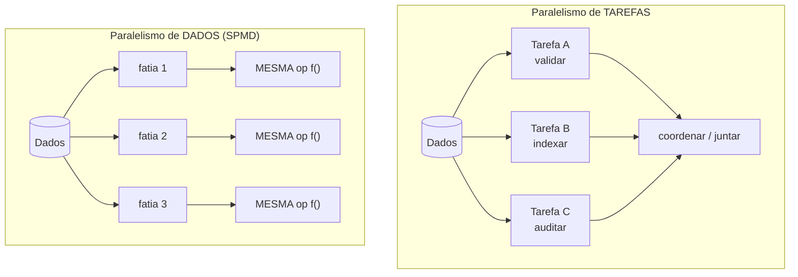
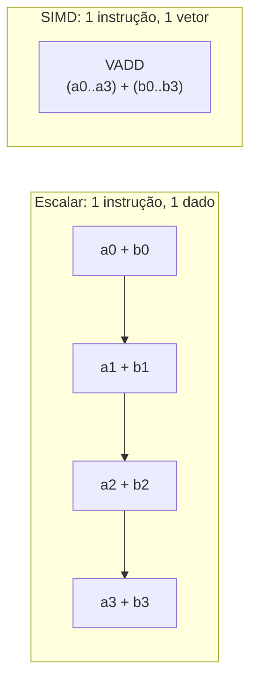
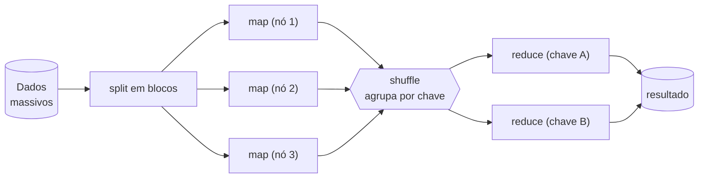
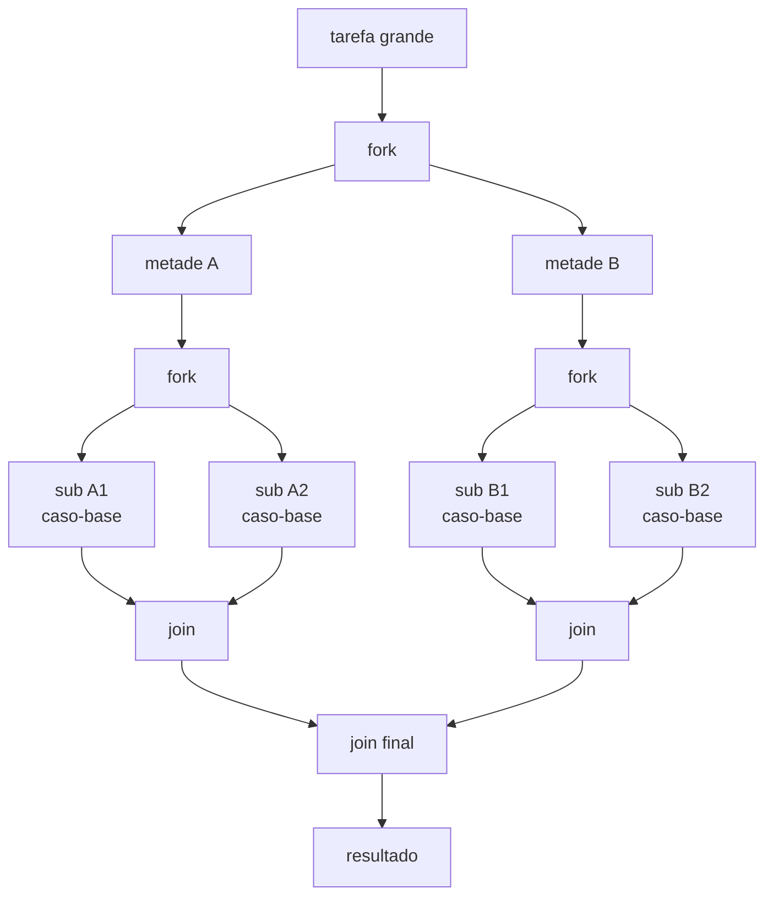

# Paralelismo de dados

> [!abstract] Resumo em uma linha
> Em vez de orquestrar tarefas diferentes, você aplica a MESMA operação a muitos pedaços de dados ao mesmo tempo — o paralelismo nasce de fatiar os DADOS, não a lógica.

Imagine um supermercado num sábado de movimento. Não existe uma fila gigante onde um caixa faz tudo. Existem mil caixas, cada um fazendo exatamente a MESMA tarefa — passar produtos, cobrar — sobre clientes DIFERENTES. Ninguém precisa coordenar com ninguém. O fluxo dobra porque você dobrou os caixas, não porque inventou um caixa mais esperto.

Isso é paralelismo de dados. E é, de longe, a forma mais fácil de paralelizar um problema — quando o problema permite.

## A virada de mentalidade

Nos modelos anteriores desta trilha, o paralelismo vinha de coordenar coisas DIFERENTES acontecendo juntas. Threads disputando uma estrutura compartilhada `[[10 - Memória compartilhada com threads e locks]]`, atores trocando mensagens, um loop de eventos `[[14 - Loop de eventos e assincronia]]` intercalando tarefas heterogêneas. Em todos eles, a dificuldade está na coordenação: quem mexe em quê, e quando.

O paralelismo de dados inverte a pergunta. Em vez de "que tarefas diferentes posso rodar juntas?", ele pergunta: "tenho UMA operação que precisa rodar sobre um monte de dados — posso aplicá-la a todos os pedaços de uma vez?".

> [!note] Paralelismo de TAREFAS × de DADOS
> - **Tarefas (task parallelism):** muitas operações DIFERENTES, possivelmente sobre os mesmos dados. Cada unidade de execução faz algo distinto e coordena com as outras pra resolver o problema. É o mundo dos threads, atores, pipelines.
> - **Dados (data parallelism):** a MESMA operação sobre subconjuntos DIFERENTES dos dados. Cada unidade roda o mesmo código, só muda o pedaço que recebe.

A literatura clássica chama esse estilo de **SPMD** — *single program, multiple data*. Você lança N unidades de execução e todas rodam o MESMO programa; o que muda entre elas é só a fatia de dados que cada uma processa. É o estilo mais comum de programação paralela justamente porque dispensa lógica diferente por unidade: um código, N fatias.

Leitura do diagrama: à esquerda, três tarefas distintas precisam se encontrar num ponto de coordenação. À direita, uma única função `f()` é replicada sobre fatias independentes — nada se encontra no meio do caminho. É essa independência que dá a escalabilidade boa.

Por que isso importa tanto? Porque "mesma operação, dados independentes" significa **sem estado compartilhado**. E sem estado compartilhado, não há corrida de dados, não há lock, não há a dor toda de `[[01 - Concorrência e paralelismo - o que é e por que é difícil]]`. O problema que era difícil simplesmente deixa de existir.

## SIMD: o paralelismo dentro da própria CPU

A forma mais primitiva e mais barata de paralelismo de dados não usa thread nenhuma. Está dentro de um único núcleo, no hardware.

**SIMD** — *single instruction, multiple data* — é uma instrução que opera sobre vários valores de uma vez. A CPU tem registradores LARGOS (128, 256, 512 bits) que cabem vários números lado a lado. Em vez de somar `a[0]+b[0]`, depois `a[1]+b[1]`, depois `a[2]+b[2]`... uma única instrução SIMD soma oito pares de uma tacada.

> [!example] A linha de montagem que clonou a estação
> Pense numa estação de trabalho que monta um produto. SIMD é pegar essa estação e CLONÁ-LA oito vezes lado a lado, ligadas ao MESMO botão. Você aperta o botão uma vez (uma instrução) e as oito estações executam o passo simultaneamente. O operário continua sendo um só; o que multiplicou foi a largura do que ele toca por gesto.

Os conjuntos de instruções SIMD têm nomes que aparecem em entrevista: **SSE** e **AVX** (Intel/AMD), **NEON** (ARM). Eles são o motor por trás de vetorização.

Leitura do diagrama: em cima, quatro somas em SEQUÊNCIA, uma instrução por par. Embaixo, UMA instrução `VADD` processa os quatro pares juntos. O trabalho é o mesmo; o número de instruções emitidas caiu por quatro.

A boa notícia é que você quase nunca escreve SIMD à mão. O compilador faz **auto-vetorização**: ele reconhece um laço regular — sem dependências entre iterações, com acesso contíguo à memória — e o reescreve em instruções vetoriais sozinho. A má notícia é que ele é tímido: basta uma ramificação imprevisível ou um padrão de acesso bagunçado pra ele desistir e voltar ao código escalar.

> [!tip] Vetorização gosta de loops "burros"
> Quanto mais regular e previsível o laço (mesma operação, mesmo passo, sem `if` no meio), mais fácil o compilador vetorizar. Ironicamente, código "inteligente" demais costuma ser código LENTO porque mata a auto-vetorização.

## GPU e CUDA: milhares de núcleos burros

Se SIMD multiplica a largura dentro de um núcleo, a GPU multiplica o NÚMERO de núcleos — para milhares. A troca é deliberada: cada núcleo de GPU é simples e lento comparado a um núcleo de CPU, mas há muitos, e todos fazem a mesma coisa sobre dados diferentes.

O modelo da GPU se chama **SIMT** — *single instruction, multiple threads*. É um primo mais flexível do SIMD. Em vez de você empacotar os dados num vetor à mão, você escreve um *kernel* — o código de UMA thread — e a GPU lança milhares de cópias dessa thread, cada uma operando em seu índice de dado. No CUDA (a plataforma da NVIDIA), essas threads são organizadas em *warps* de 32, e o warp inteiro executa a mesma instrução em sincronia.

> [!note] SIMT × SIMD: a diferença que cai em entrevista
> - **SIMD** exige que você expresse o paralelismo como "loops vetorizados" e gerencie o alinhamento e o tamanho do vetor explicitamente.
> - **SIMT** deixa cada thread executar o kernel "como escrito"; o hardware cuida do empacotamento. E o SIMT TOLERA ramificação — threads do mesmo warp podem divergir num `if`. Mas isso tem custo: na *divergência de warp*, o hardware serializa os dois caminhos, e metade das threads fica ociosa em cada um. Por isso GPU adora dados REGULARES, sem `if` por dado.

A GPU brilha em cargas massivamente paralelas e uniformes: deep learning (multiplicação de matrizes gigantes), gráficos (o mesmo shader sobre milhões de pixels), simulações físicas. Mas há um pedágio que ninguém pode esquecer:

> [!warning] O custo de mover dados CPU↔GPU
> A GPU tem memória própria, separada da RAM da CPU. Pra processar, os dados precisam VIAJAR pela ponte PCIe até a GPU, e o resultado precisa voltar. Essa transferência é lenta. Se o cálculo é pequeno, você passa mais tempo movendo dados do que calculando — e a GPU fica mais devagar que a CPU. A GPU só compensa quando o volume de cálculo POR byte transferido é alto o bastante pra amortizar a viagem.

## MapReduce: paralelismo de dados que escala em cluster

SIMD e GPU paralelizam dentro de uma máquina. E quando os dados não cabem numa máquina — terabytes, petabytes? O mesmo princípio sobe um andar e vira **MapReduce**, o modelo que a Google popularizou e que sustentou Hadoop e, depois, Spark.

A ideia tem duas fases com uma costura no meio:

- **Map** (paralelo, sem estado compartilhado): os dados são fatiados em blocos e espalhados pelo cluster. Cada nó aplica a MESMA função `map` à sua fatia, produzindo pares chave-valor. Como nenhum mapper depende de outro, essa fase escala lindamente — é paralelismo de dados puro, só que com as fatias em máquinas diferentes.
- **Shuffle** (a costura): o sistema agrupa todos os valores pela chave, ordena, e move pela rede os dados de modo que tudo de uma mesma chave vá parar no mesmo reducer. É aqui que mora o custo — tráfego de rede entre nós.
- **Reduce** (agrega): cada reducer recebe uma chave e a lista de valores dela, e aplica a função `reduce` pra produzir o resultado final.

Leitura do diagrama: o `split` distribui blocos; os `map` rodam em paralelo e independentes (a parte fácil); o `shuffle` é o gargalo de rede que reorganiza tudo por chave; os `reduce` agregam. Note que o map é embaraçosamente paralelo, mas o reduce só pode começar depois que a chave dele estiver completa — há uma barreira embutida no shuffle.

A fronteira aqui encosta nos dados distribuídos: fatiar dados por chave e espalhá-los por nós é a mesma intuição do *sharding* que aparece em `[[Banco de Dados]]`. A diferença é o objetivo — MapReduce fatia pra COMPUTAR sobre tudo de uma vez; um banco fatia pra ARMAZENAR e consultar. Mas a costura conceitual (mover o cálculo pra perto do dado, em vez do dado pra perto do cálculo) é a mesma.

## Fork-join e work-stealing: dividir pra conquistar, em threads

De volta a uma máquina só, com vários núcleos. Como você paralela um problema que pode ser quebrado recursivamente — ordenar um vetor grande, somar uma árvore, percorrer uma estrutura? A resposta é **fork-join**.

O padrão é o velho dividir-para-conquistar com paralelismo:

1. Se o pedaço de trabalho é pequeno o bastante, processe direto (caso-base).
2. Senão, **fork**: divida em sub-pedaços e dispare cada um pra ser processado em paralelo.
3. **Join**: espere os sub-resultados e combine-os.

Leitura do diagrama: a tarefa se divide em árvore até os sub-pedaços virarem pequenos o bastante pra rodar direto (as folhas); depois os resultados sobem juntando-se de volta. A profundidade da árvore é controlada pela granularidade do caso-base.

O detalhe genial é como o agendador mantém todos os núcleos ocupados: **work-stealing** (roubo de trabalho). Cada thread trabalhadora tem sua própria fila dupla (*deque*) de tarefas. Quando uma thread esvazia a própria fila, ela não fica parada — ela **rouba** uma tarefa da PONTA da fila de outra thread que ainda está cheia. O resultado é balanceamento de carga automático: ninguém fica ocioso enquanto há trabalho em qualquer lugar.

> [!info] Onde isso vive no Java
> O `ForkJoinPool` e os *parallel streams* são exatamente isso: divisão recursiva mais work-stealing. É o motor por trás de `stream.parallel()`. Os detalhes — splitterators, granularidade, quando vale a pena — estão no galho `[[03-Dominios/Java/Concorrência e paralelismo/index|Concorrência (Java)]]`.

> [!warning] Tarefas minúsculas matam o fork-join
> O work-stealing tem sua própria máquina interna (filas, sincronização, roubo). Se cada tarefa faz pouquíssimo trabalho — menos que alguns microssegundos — o overhead dessa máquina passa a custar mais que o cálculo. Granularidade pequena demais transforma o framework num peso morto. Calibre o caso-base pra cada folha fazer trabalho de verdade.

## Embaraçosamente paralelo × precisa coordenar

Nem todo problema escala igual, e a fronteira tem nome.

Um problema **embaraçosamente paralelo** (*embarrassingly parallel*) se quebra em sub-tarefas totalmente INDEPENDENTES — nenhuma precisa de resultado de outra. Processar mil imagens, testar um milhão de senhas, renderizar pixels, a fase map do MapReduce. Esses escalam quase linearmente: dobrou os núcleos, quase dobrou a vazão. São o sonho do paralelismo de dados.

No outro extremo estão os problemas com DEPENDÊNCIAS — onde sub-tarefas precisam trocar dados ou agregar resultados (uma redução, um `join`, o shuffle do MapReduce). Esses exigem barreiras de sincronização e comunicação, e cada barreira é um momento em que threads rápidas esperam as lentas. É aí que o ganho começa a vazar.

> [!quote] A regra mental
> Quanto mais INDEPENDENTES as fatias, melhor escala. Cada ponto de coordenação — barreira, redução, comunicação — é um pedágio que come parte do ganho do paralelismo.

## Quando paralelizar de verdade

Aqui mora a armadilha mais comum: assumir que paralelizar sempre acelera. Não acelera.

Particionar os dados custa. Coordenar as unidades custa. Juntar os resultados custa. Esse overhead é FIXO — você paga mesmo que os dados sejam minúsculos. Pra um vetor de dez elementos, o tempo de montar o ForkJoinPool, fatiar e juntar é maior que o de só percorrer o vetor uma vez. O paralelismo só compensa ACIMA de um limiar de volume, onde o ganho de dividir supera o custo de coordenar.

E há um teto teórico no melhor caso: a **lei de Amdahl**. Por mais núcleos que você jogue, a parte SEQUENCIAL do programa (a que não paraleliza — o shuffle, a redução final, a leitura inicial) limita o speedup máximo. Esse limite, e o contraponto otimista da lei de Gustafson, estão em `[[16 - As leis da escala - Amdahl e Gustafson]]`.

> [!danger] A regra de ouro: meça antes
> Nunca paralelize por instinto. Paralelizar adiciona overhead garantido e ganho incerto. Meça a versão sequencial, identifique se o trabalho passa do limiar, e só então pague o preço da coordenação. Em dados pequenos, sequencial quase sempre vence.

## Data parallelism × os outros modelos

O paralelismo de dados não compete com threads-e-locks `[[10 - Memória compartilhada com threads e locks]]` nem com message-passing — ele é ORTOGONAL e complementar. Você pode ter um sistema de atores onde cada ator, internamente, usa um parallel stream. Pode ter um loop de eventos que dispara um kernel de GPU.

A vantagem decisiva, quando o problema é REGULAR (mesma operação, fatias independentes), é que o paralelismo de dados é a forma mais FÁCIL de paralelizar — porque sem estado compartilhado não há corrida pra defender, não há lock pra adquirir, não há deadlock pra temer. A complexidade some por construção. Por isso a primeira pergunta diante de um problema CPU-bound deveria ser: "isso é paralelismo de dados disfarçado?". Se for, você ganhou.

Os demais padrões — quando o problema NÃO é regular, quando há estado compartilhado inevitável, quando as tarefas são heterogêneas — estão em `[[17 - Padrões de concorrência]]`.

## Em entrevista

Data parallelism applies the SAME operation to many independent data partitions — the parallelism comes from splitting the DATA, not the logic. This is the SPMD model: one program, many data slices, no shared state. Because there is no shared state, there are no data races to defend against, which makes it the EASIEST kind of parallelism when the problem is regular. It shows up at three scales: SIMD/vectorization inside a single core (one instruction over a wide register, e.g. AVX), SIMT on the GPU (thousands of threads running the same kernel, great for regular workloads like deep learning, costly when threads diverge or when you move data across PCIe), and MapReduce across a cluster (parallel map, then shuffle, then reduce). On the JVM, fork-join with work-stealing — the engine behind parallel streams and `ForkJoinPool` — recursively splits work and lets idle threads steal tasks to balance load. The key judgment call: parallelism only pays off above a threshold because partitioning and coordination have fixed overhead, and Amdahl's law caps the speedup — so always measure before parallelizing.

### Vocabulário

- paralelismo de dados → data parallelism
- paralelismo de tarefas → task parallelism
- mesma operação, dados diferentes → single program, multiple data (SPMD)
- uma instrução, vários dados → SIMD (single instruction, multiple data)
- uma instrução, várias threads → SIMT (single instruction, multiple threads)
- vetorização → vectorization
- auto-vetorização → auto-vectorization
- mapear-reduzir → map-reduce
- embaralhar (fase do MapReduce) → shuffle
- dividir e juntar → fork-join
- roubo de trabalho → work-stealing
- fila dupla → deque (double-ended queue)
- embaraçosamente paralelo → embarrassingly parallel
- aceleração / ganho → speedup
- limiar → threshold

> [!info] Lastro
> - [Data parallelism — Wikipedia](https://en.wikipedia.org/wiki/Data_parallelism) e [Task parallelism — Wikipedia](https://en.wikipedia.org/wiki/Task_parallelism) (a distinção data × task e o estilo SPMD)
> - [SIMT and Warps — Cornell Virtual Workshop](https://cvw.cac.cornell.edu/gpu-architecture/gpu-characteristics/simt_warp) e [SIMT vs SIMD — Benjamin Glick](https://www.glick.cloud/blog/simt-vs-simd-parallelism-in-modern-processors) (SIMD × SIMT, warps, divergência)
> - [What is MapReduce? — Databricks](https://www.databricks.com/glossary/mapreduce) (modelo map/shuffle/reduce em cluster)
> - [Fork/Join — The Java Tutorials (Oracle)](https://docs.oracle.com/javase/tutorial/essential/concurrency/forkjoin.html) e [How to use ForkJoinPool — InfoWorld](https://www.infoworld.com/article/2338348/how-to-use-forkjoinpool.html) (fork-join, work-stealing, deque, granularidade)

## Veja também

- `[[01 - Concorrência e paralelismo - o que é e por que é difícil]]` — por que coordenar é difícil (e por que dados independentes escapam disso)
- `[[10 - Memória compartilhada com threads e locks]]` — o modelo ortogonal: estado compartilhado e suas dores
- `[[14 - Loop de eventos e assincronia]]` — outro eixo: intercalar tarefas heterogêneas
- `[[16 - As leis da escala - Amdahl e Gustafson]]` — o teto teórico do ganho com paralelismo
- `[[17 - Padrões de concorrência]]` — quando o problema NÃO é regular
- `[[18 - Concorrência em entrevista]]` — consolidação pra entrevista
- `[[03-Dominios/Java/Concorrência e paralelismo/index|Concorrência (Java)]]` — fork-join e parallel streams na prática
- `[[03-Dominios/Fundamentos/Concorrência e Paralelismo/index|Concorrência e Paralelismo]]` — índice do galho
