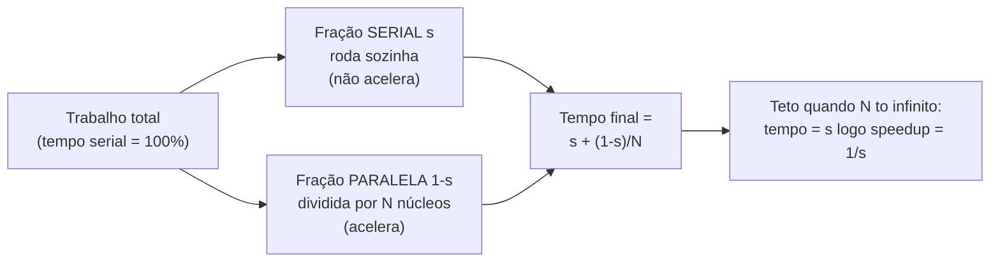
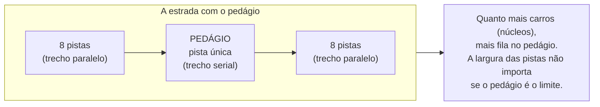
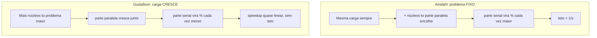

# As leis da escala: Amdahl e Gustafson

> [!abstract] Resumo em uma linha
> Dobrar os núcleos não dobra a velocidade: a parte serial impõe um teto (Amdahl), mas se você crescer o problema junto com a máquina, o ganho volta a escalar quase linear (Gustafson).

A pergunta parece ingênua, mas separa quem entende de escala de quem só compra hardware: **se eu dobrar os núcleos, dobro a velocidade?** A resposta honesta é não. Quase nunca. Há um teto, e ele tem nome.

Esta nota é o fecho conceitual do galho. Ela explica por que [[15 - Paralelismo de dados|dividir o trabalho]] entre N núcleos rende menos do que a aritmética promete, e por que adicionar núcleos pode, em algum ponto, **piorar** o desempenho. É o tipo de raciocínio que um senior puxa antes de escrever a primeira linha de código paralelo.

## Speedup e eficiência: medindo o ganho

Antes das leis, dois números.

**Aceleração (speedup)** é o quanto ficou mais rápido:

```
speedup = tempo_serial / tempo_paralelo
```

Se a versão de um núcleo leva 100 segundos e a de 4 núcleos leva 40, o speedup é 2,5×. Não 4×. Já tem dinheiro escapando.

**Eficiência** é o speedup dividido pelos núcleos:

```
eficiência = speedup / núcleos
```

No exemplo, 2,5 / 4 = 0,625, ou 62,5%. Cada núcleo está entregando só 62% do que entregaria sozinho. Os outros 38% viraram fumaça: coordenação, espera, briga por memória.

O ideal é o **speedup linear**: N núcleos rendem N× mais, eficiência de 100%. Ele existe nos slides. Na vida real, raríssimo — e quando aparece, geralmente é problema mal medido (cache esquentando, baseline ruim) ou uma carga *embaraçosamente paralela* sem nenhuma costura entre as partes.

> [!question] Por que o ideal quase nunca acontece?
> Porque todo programa real tem um pedaço que **precisa** rodar sozinho: ler o arquivo de entrada, somar os resultados parciais no fim, escrever no banco. Esse pedaço não acelera por mais núcleos que você jogue nele. Foi exatamente isso que Gene Amdahl formalizou em 1967.

## A lei de Amdahl: o teto do problema fixo

A intuição é uma frase que todo gerente de projeto deveria ter tatuada:

> [!quote] A analogia das nove mulheres
> Nove mulheres não fazem um bebê em um mês. A gestação é **serial** — você não a paraleliza adicionando "recursos". Todo programa tem sua gestação: a parte que só anda em fila indiana.

Formalmente: se uma fração `s` do trabalho é **serial** (não paralelizável) e o resto `(1-s)` é perfeitamente paralelizável, o speedup máximo com N núcleos é:

```
speedup(N) = 1 / ( s + (1 - s) / N )
```

E o golpe de misericórdia: quando N tende ao infinito, o termo `(1-s)/N` some, e o speedup tende a:

```
speedup_máximo = 1 / s
```

Leia de novo. Se 5% do seu programa é serial, o speedup máximo é `1 / 0,05 = 20×`. **Vinte.** Não importa se você tem 16, 1.000 ou um milhão de núcleos. O teto é vinte, porque aqueles 5% continuam rodando em série enquanto o resto já terminou e fica olhando.

### A tabela que dói

Veja o teto se fechando conforme a fração serial cresce. Linhas são a fração serial `s`; colunas são o número de núcleos N.

| Fração serial `s` | N=2 | N=4 | N=8 | N=16 | N=∞ (teto) |
|---|---|---|---|---|---|
| 1% (0,01) | 1,98× | 3,88× | 7,48× | 13,9× | **100×** |
| 5% (0,05) | 1,90× | 3,48× | 5,93× | 9,14× | **20×** |
| 10% (0,10) | 1,82× | 3,08× | 4,71× | 6,40× | **10×** |
| 25% (0,25) | 1,60× | 2,29× | 2,91× | 3,37× | **4×** |

Os números contam uma história brutal. Com 10% serial, mesmo 16 núcleos te dão só 6,4× — e o céu, com infinitos núcleos, é apenas 10×. Com 25% serial, você bate em 4× e acabou: jogar hardware vira queimar dinheiro.

> [!warning] A parte serial domina, e domina cedo
> O retorno marginal de cada núcleo adicional despenca rápido. Do núcleo 8 ao 16 (com s=5%) você ganha de 5,93× para 9,14× — pagou o dobro de máquina para um ganho de 1,5×. A parte serial é o pedágio que toda viagem paga, e ele não tem pista expressa.



Leitura do diagrama: o trabalho se parte em dois fluxos. A fração paralela encolhe à medida que você divide por N — pode quase zerar. Mas a fração serial fica parada, intacta, e é ela quem define o piso do tempo final. Por isso o teto do speedup é exatamente o inverso da fração serial.

### O gargalo serial, visto de outro jeito



Leitura do diagrama: você pode alargar as pistas para 8, 80 ou 800 faixas, mas se no meio existe um pedágio de pista única, todo mundo afunila ali. Esse pedágio é a fração serial. Aumentar os núcleos é alargar as pistas; o tempo de travessia é refém do pedágio.

## A lei de Gustafson: o contraponto da carga crescente

Em 1988, John Gustafson e Edwin Barsis publicaram *Reevaluating Amdahl's Law* com uma observação simples e libertadora: **na prática, ninguém compra um supercomputador para rodar o mesmo probleminha mais rápido.** Você compra para resolver um problema *maior* — uma malha mais fina, mais dados, mais resolução, mais usuários.

Essa mudança de pergunta muda tudo.

Amdahl pergunta: *"dado um problema de tamanho fixo, quanto mais rápido fico com N núcleos?"* (escalabilidade forte). Gustafson pergunta: *"dado N núcleos, quão grande é o problema que resolvo no mesmo tempo?"* (escalabilidade fraca).

A premissa de Gustafson: conforme você adiciona núcleos, a **parte paralela cresce com o problema**, enquanto a parte serial (ler config, inicializar, agregar) tende a ficar mais ou menos constante. Resultado: a fração serial **encolhe relativamente** à medida que o trabalho total cresce. O *scaled speedup* então escala quase linearmente com N — sem teto fixo.



Leitura do diagrama: as duas leis não brigam — elas respondem perguntas diferentes. Em Amdahl a carga é congelada, então a fatia serial fica cada vez mais visível conforme você acelera o resto. Em Gustafson a carga acompanha a máquina, então a fatia serial é diluída num bolo cada vez maior e some na proporção.

> [!tip] A reconciliação que impressiona em entrevista
> "Amdahl e Gustafson não se contradizem; eles assumem coisas diferentes sobre o que acontece com o tamanho do problema." Amdahl descreve **strong scaling** (problema fixo, mais núcleos). Gustafson descreve **weak scaling** (problema cresce com os núcleos). Renderização de cena fixa, processamento de batch de tamanho fechado: pensamento Amdahl. Simulação científica, treino de modelo onde você sempre quer mais dados: pensamento Gustafson.

## O overhead que Amdahl nem conta

Aqui mora a parte desconfortável. As duas leis assumem que a parte paralela é *perfeitamente* paralelizável — divide-se em N e pronto. A realidade cobra impostos que nenhuma das fórmulas inclui:

- **Coordenação e sincronização.** Toda [[05 - Exclusão mútua - locks, mutexes e monitores|região crítica protegida por lock]] é, por definição, serial: só uma thread por vez. Uma barreira faz todo mundo esperar o mais lento. Sincronização *cria* fração serial onde antes não havia.
- **Comunicação.** Threads e processos precisam trocar dados. Mais núcleos, mais mensagens, mais latência de coordenação.
- **Contenção de memória e cache.** Vários núcleos brigando pela mesma linha de cache (*false sharing*), pelo mesmo barramento de memória. O hardware compartilhado é finito.

O resultado é cruel: o speedup real não só fica abaixo de Amdahl — em algum ponto ele **vira para baixo**. Mais núcleos passam a custar mais do que rendem, porque a briga (overhead) cresce mais rápido que o trabalho útil.


Leitura do diagrama: existe um ponto doce. Antes dele, cada núcleo ajuda. Depois dele, cada núcleo adicional gasta mais tempo coordenando, esperando lock e disputando cache do que executando trabalho real. A curva de speedup sobe, achata e desce — algo que a fórmula limpa de Amdahl, otimista, nunca prevê.

> [!danger] Mais núcleos podem deixar mais lento
> Não é hipótese de slide. Aumentar o paralelismo de um serviço com forte contenção de lock costuma derrubar o throughput: as threads passam a viver na fila do mutex. Antes de subir o `parallelism`, meça a contenção — às vezes a resposta certa é *menos* threads, não mais.

## A lei de Little: dimensionando pools

Tem uma terceira lei que vive na mesma vizinhança e cai direto no dia a dia de quem dimensiona [[02 - Processos e threads|pools de threads]]. A **lei de Little** (John Little, 1961) diz, para qualquer sistema de filas estável:

```
L = λ × W
```

- `L` = número médio de itens dentro do sistema (em voo)
- `λ` = taxa de chegada (ex: requisições por segundo)
- `W` = tempo médio que cada item passa no sistema (latência)

A beleza é que ela não assume *nada* sobre a distribuição das chegadas — vale para qualquer sistema estacionário. E ela responde a pergunta prática "de quantas threads eu preciso?".

> [!example] Dimensionando um pool com Little
> Seu serviço recebe `λ = 500` req/s e cada requisição leva `W = 0,2 s` para ser atendida. Então `L = 500 × 0,2 = 100`. Você precisa de **100 unidades de concorrência simultâneas** (threads/conexões/workers) só para acompanhar a demanda média — e ainda uma folga em cima, porque a ocupação real oscila em torno da média, não fica colada nela.

Isso conversa direto com [[03-Dominios/Fundamentos/Redes e Protocolos/12 - Latência, throughput e os números|os números de latência]]: throughput (`λ`) e latência (`W`) não são independentes quando o pool satura. Se `L` (capacidade) é fixo e a latência `W` sobe, o throughput `λ` que você consegue sustentar despenca. É a mesma física vista de outro eixo, e é a base de cálculo para os [[17 - Padrões de concorrência|padrões de pool e backpressure]].

> [!info] Little contra o chute
> A reação instintiva de "vou colocar 1000 threads pra ir mais rápido" ignora que, se a latência por item é alta porque o recurso a jusante (banco, API) está saturado, mais threads só enchem a fila e aumentam o `W`. Little te força a raciocinar com os três números juntos.

## A lição de design

Tudo isso converge num punhado de regras que valem mais que qualquer framework:

1. **Descubra a fração serial primeiro.** Antes de paralelizar, meça quanto do tempo é inerentemente serial. Esse número define o seu teto de Amdahl. Se ele é alto, paralelizar é jogar dinheiro num teto baixo.
2. **Otimizar o serial pode render mais que adicionar núcleos.** Cortar a fração serial de 10% para 2% sobe o teto de 10× para 50×. Nenhuma quantidade de hardware faz isso — só refatorar o gargalo serial faz.
3. **Some o overhead na conta.** Sincronização, comunicação e contenção transformam parte do "paralelizável" em serial disfarçado. O speedup real fica abaixo da fórmula, e cedo demais costuma virar para baixo.
4. **Saiba qual pergunta você está fazendo.** Problema fixo que precisa ser mais rápido? Amdahl manda. Pode crescer o problema com a máquina? Gustafson te dá esperança.
5. **Meça, não chute.** Toda fração serial, todo overhead, toda latência é empírico. As leis te dão o esqueleto do raciocínio; o profiler te dá os números.

> [!summary] A frase para guardar
> Paralelismo não é mágica de hardware; é gestão de gargalos. A pergunta de senior nunca é "quantos núcleos?", e sim "qual é a minha fração serial, qual é o meu overhead, e o problema é fixo ou cresce?".

Para o panorama de onde isso tudo começou — por que concorrência é difícil de raciocinar — volte ao [[01 - Concorrência e paralelismo - o que é e por que é difícil|começo do galho]].

## Em entrevista

A few sentences to deploy when scaling comes up. Amdahl's law sets a hard ceiling on speedup: if a fraction `s` of the work is serial, the maximum speedup is `1/s`, no matter how many cores you add — five percent serial caps you at twenty times. Gustafson's law is the counterpoint: in practice we scale the problem size with the hardware, so the serial fraction shrinks relatively and the scaled speedup grows almost linearly. They don't contradict each other — Amdahl assumes a fixed problem (strong scaling) and Gustafson assumes a growing problem (weak scaling). Real speedup also falls below both because synchronization, communication, and memory contention add overhead the clean formulas ignore — past a point, more cores can actually make things slower. For sizing thread pools I lean on Little's law, `L = λ × W`: concurrency in flight equals arrival rate times latency. The senior move is to measure the serial fraction and the overhead before adding cores, because optimizing the serial part often beats buying hardware.

### Vocabulário

- aceleração / speedup
- eficiência / efficiency
- lei de Amdahl / Amdahl's law
- lei de Gustafson / Gustafson's law
- fração serial / serial fraction
- sobrecarga / overhead
- lei de Little / Little's law
- escalabilidade forte / strong scaling
- escalabilidade fraca / weak scaling
- teto / ceiling (upper bound)
- contenção / contention

> [!info] Lastro
> Fontes verificadas:
> - Gustafson, J. L. & Barsis, E. — *Reevaluating Amdahl's Law* (1988), origem da lei de Gustafson e do scaled speedup.
> - Wikipedia — *Gustafson's law* e *Little's law* (fórmulas e premissas de strong vs weak scaling).
> - PDC/KTH — *Scalability: strong and weak scaling* (relação Amdahl/Gustafson com escalabilidade forte e fraca).
> - Oregon State University — *Speedups and Amdahl's Law* (handout com a fórmula `1/(s+(1-s)/N)` e o limite `1/s`).

## Veja também

- [[01 - Concorrência e paralelismo - o que é e por que é difícil]]
- [[02 - Processos e threads]]
- [[05 - Exclusão mútua - locks, mutexes e monitores]]
- [[15 - Paralelismo de dados]]
- [[17 - Padrões de concorrência]]
- [[18 - Concorrência em entrevista]]
- [[03-Dominios/Fundamentos/Redes e Protocolos/12 - Latência, throughput e os números|os números de latência]]
- [[03-Dominios/Fundamentos/Concorrência e Paralelismo/index|Concorrência e Paralelismo]]
