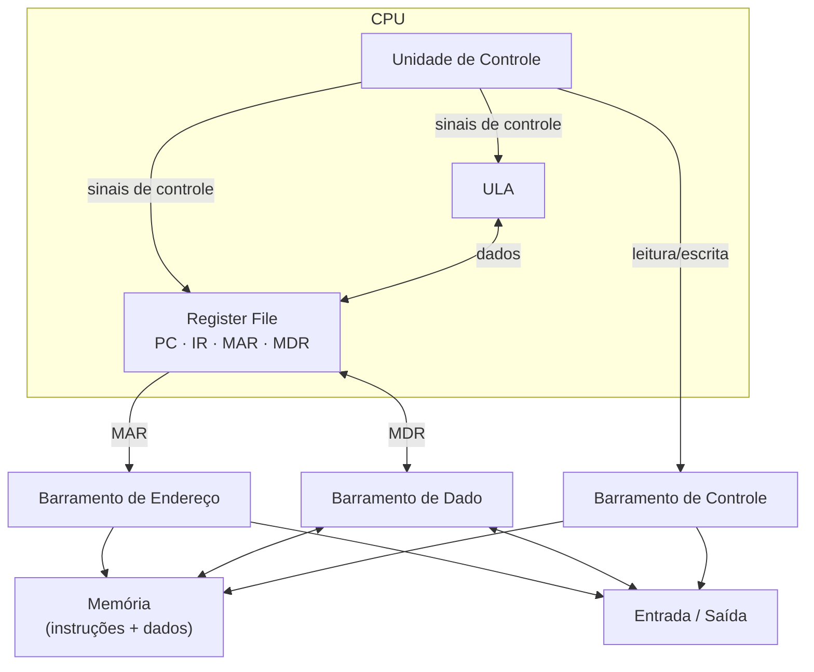
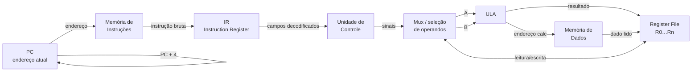
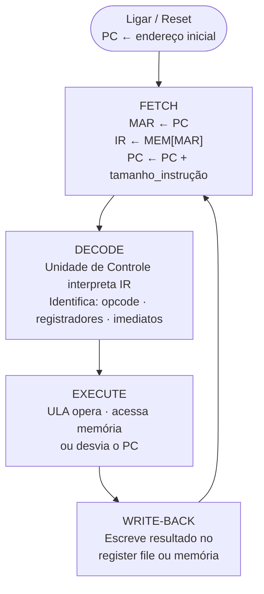
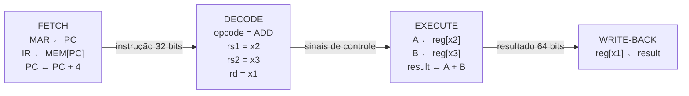
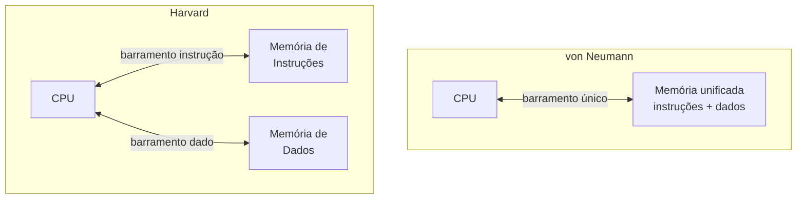
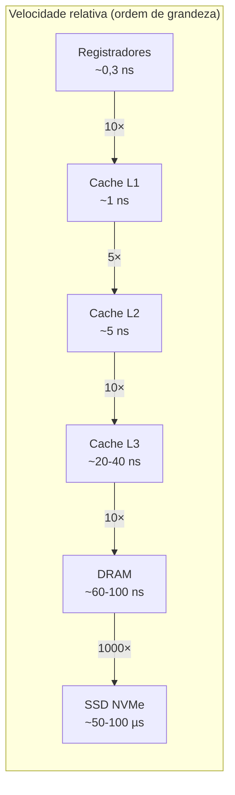

# Arquitetura de von Neumann e o ciclo de instrução

> [!abstract] TL;DR
> A arquitetura de von Neumann é a ideia de armazenar **programa e dados na mesma memória**, tratando instruções como números manipuláveis. Essa escolha, documentada por von Neumann em 1945 para o EDVAC, definiu como praticamente todo computador moderno funciona. A CPU busca uma instrução (fetch), decodifica, executa e repete bilhões de vezes por segundo. O preço: um barramento único cria o **gargalo de von Neumann** — que cache e pipeline existem para atenuar.

---

## A grande ideia: programa armazenado

Antes de 1945, programar um computador era literalmente recablear o hardware.

O ENIAC, inaugurado em 1945, tinha ~18 000 válvulas e processava 5 000 operações por segundo. Para mudar o que ele calculava, engenheiros passavam dias reconectando cabos e reposicionando chaves físicas. O "programa" era a própria topologia dos fios.

John von Neumann — matematicamente, o cérebro mais rápido da sala — participou como consultor do projeto ENIAC. Em **30 de junho de 1945**, ele distribuiu o *First Draft of a Report on the EDVAC*, um documento de 101 páginas que descrevia o sucessor do ENIAC. A ideia central:

> Instruções **são números**. Armazene-as na mesma memória que os dados. A CPU lê números da memória, interpreta alguns como comandos e opera sobre outros como valores.

Simples de enunciar. Revolucionário na prática.

Se instruções são dados, você pode:
- **Carregar um programa diferente** sem tocar no hardware — é só sobrescrever a memória.
- **Gerar código em tempo de execução** — um programa pode escrever outros programas (compiladores, JIT).
- **Auto-modificar instruções** — perigoso, mas possível (e base de várias técnicas de otimização e exploits).

Isso é a realização física da **máquina de Turing universal**: o programa *é* a fita, lida e interpretada pelo mesmo mecanismo. Veja a conexão formal em [[03-Dominios/Fundamentos/Teoria da Computação/10 - Decidível, reconhecível e a máquina universal]].

---

## Os cinco componentes clássicos

Von Neumann descreveu cinco unidades funcionais. Todo computador que você já tocou as implementa, em alguma forma:

| Componente | Função | Exemplo moderno |
|---|---|---|
| **Unidade aritmética/lógica (ULA)** | Soma, subtrai, AND, OR, comparações | ALU dentro do núcleo x86/ARM |
| **Unidade de controle** | Busca, decodifica, orquestra os demais | Decode stage do pipeline |
| **Memória** | Armazena instruções + dados | RAM DDR5; cache L1/L2/L3 |
| **Entrada** | Recebe dados do mundo externo | Teclado, placa de rede, SSD |
| **Saída** | Envia resultados para o mundo | Monitor, impressora, GPU output |

CPU = unidade de controle + ULA (+ registradores). Simples assim.

### Diagrama de blocos de von Neumann

O diagrama abaixo mostra como os componentes se conectam. O ponto crítico: **um único barramento** liga CPU, memória e I/O.

**Leitura do diagrama**: a CPU conversa com memória e I/O pelos mesmos três barramentos (endereço, dado e controle). O MAR (*Memory Address Register*) coloca o endereço no barramento de endereço; o MDR (*Memory Data Register*) é a janela por onde o dado entra ou sai. Esse compartilhamento é exatamente o gargalo que veremos adiante.

---

## Os registradores que movem o mundo

Dentro da CPU, alguns registradores têm papel estrutural no ciclo de instrução:

| Registrador | Nome completo | Papel |
|---|---|---|
| **PC** | Program Counter | Endereço da **próxima** instrução a buscar |
| **IR** | Instruction Register | Instrução que está sendo **decodificada/executada agora** |
| **MAR** | Memory Address Register | Endereço que a CPU quer ler ou escrever na memória |
| **MDR** | Memory Data Register | Dado que fluiu de ou para a memória |
| **Register file** | — | Conjunto de registradores de uso geral (R0…R31 em RISC-V; RAX…R15 em x86-64) |

O PC é o "dedo" que aponta para o próximo passo. A cada instrução executada, ele avança. Em um desvio (branch), ele pula. Em uma chamada de função, ele é salvo e redirecionado. O PC *é* o fluxo de controle.

### Diagrama do datapath

**Leitura do diagrama**: o fluxo básico de uma instrução aritmética. O PC aponta para a memória de instruções → o IR carrega a instrução → a unidade de controle emite sinais → os operandos do register file entram na ULA → o resultado volta ao register file. Para instruções de memória (load/store), a ULA calcula o endereço e o resultado vai/vem da memória de dados.

---

## O ciclo de instrução: fetch-decode-execute

A CPU repete esse ciclo eternamente — do boot ao shutdown.

**Leitura do diagrama**: quatro fases em loop infinito. Na prática, CPUs modernas sobrepõem essas fases em estágios de pipeline — mas a lógica é esta.

### Fase 1 — Fetch (busca)

A CPU copia o PC para o MAR, ativa o barramento de endereço e lê a palavra de memória naquele endereço para o IR. Depois, incrementa o PC (PC ← PC + tamanho\_instrução). Em arquiteturas de comprimento fixo como RISC-V, o incremento é sempre 4 bytes. Em x86, varia de 1 a 15 bytes.

Por que o PC incrementa *antes* do execute? Para que instruções de desvio condicional e chamadas de função possam calcular seus alvos relativos ao endereço *depois* da instrução atual — convenção que simplifica o hardware.

O fetch é o passo mais afetado pelo gargalo de von Neumann. Em cada ciclo, a CPU precisa ir à memória buscar uma instrução — e se aquela instrução não está no cache L1-I, o processador trava (stall) aguardando dezenas a centenas de nanosegundos. Por isso prefetchers de instrução e branch predictors existem: antecipar *qual* instrução será buscada a seguir para carregar o cache antes de precisar.

### Fase 2 — Decode (decodificação)

A unidade de controle examina os bits do IR. Identifica:
- O **opcode** (que operação fazer).
- Os **registradores** fonte e destino.
- **Imediatos** ou campos de deslocamento embutidos na instrução.

Ela então emite sinais de controle para ULA, multiplexadores, memória e register file. A unidade de controle é uma **máquina de estados finita** (FSM) — um tema direto de [[06 - Circuitos sequenciais e memória]].

Em CPUs mais simples (microcontroladores, RISC clássico), a unidade de controle é implementada como **hardware fixo**: lógica combinacional que mapeia diretamente os bits do opcode para sinais de controle. Rápida, eficiente em área e energia — ideal para ARM Cortex-M.

Em designs CISC históricos (VAX, 68000, IA-32 antigo), ela usa **microcódigo**: uma ROM interna que armazena *micro-programas*. Cada instrução de máquina (o opcode que o programador vê) é na verdade um ponteiro para uma sequência de micro-operações mais simples, executadas pela unidade de controle passo a passo. É literalmente um intérprete dentro do intérprete — o mesmo princípio do programa armazenado, aplicado ao nível do controle interno.

O x86 moderno mantém a aparência de CISC externamente (por compatibilidade), mas internamente o decodificador traduz instruções x86 para micro-ops RISC-like, que seguem um pipeline mais simples. O microcódigo fica como fallback para instruções complexas raramente usadas.

### Fase 3 — Execute (execução)

Três sabores:
- **ALU op**: a ULA recebe os operandos e opera (ADD, SUB, AND, SHL…). O resultado fica pronto em um ciclo (ou poucos, para multiplicação/divisão).
- **Memory op**: a ULA calcula o endereço efetivo somando base + offset; então a memória é lida (load) ou escrita (store). Se o dado não está no cache, acontece um *cache miss* — e aí a instrução espera.
- **Branch/jump**: a ULA compara operandos ou calcula o endereço-alvo; o resultado vai para o PC. Branches condicionais são problemáticos para pipelines: a CPU só sabe para onde ir *depois* de comparar, mas já precisa buscar a próxima instrução. Daí surgem os *branch predictors*.

A fase de execute pode durar mais de um ciclo de clock — cargas de memória com miss chegam a 200 ciclos de espera. O pipeline esconde parte dessa latência com execução fora de ordem, mas não pode esconder tudo.

### Fase 4 — Write-back (escrita de resultado)

O resultado da ULA (ou o dado carregado da memória) é gravado no register file. Em algumas microarquiteturas essa fase é explícita no pipeline; em descrições mais simples ela é fundida com o execute.

Por que separar write-back do execute? Em pipelines com múltiplas unidades funcionais rodando em paralelo, pode haver conflitos de escrita no mesmo registrador destino. Separar o write-back permite implementar bypass (forwarding): o resultado de uma instrução ainda na fase de execute pode ser "encaminhado" diretamente como operando de entrada de outra instrução, sem esperar ela ser gravada no register file.

### Um exemplo concreto: `ADD R1, R2, R3`

Vamos rastrear a instrução RISC-V `add x1, x2, x3` (x1 ← x2 + x3) passo a passo:

**Leitura do diagrama**: cada caixa é uma fase, cada seta é o que passa entre elas. O IR recebe os 32 bits da instrução; o decode extrai os campos; o execute faz a soma; o write-back persiste o resultado. Em um pipeline de 5 estágios, quatro outras instruções estão simultaneamente em fases diferentes — mas para fins de entender *uma* instrução, é exatamente esta sequência.

---

## Von Neumann × Harvard: dois modelos de memória

A arquitetura de von Neumann usa **uma memória unificada** para instruções e dados. A **arquitetura Harvard**, proposta originalmente para o Harvard Mark I (1944), usa **memórias e barramentos fisicamente separados** para instrução e dado.

**Leitura do diagrama**: em Harvard, a CPU pode buscar a próxima instrução e ler um dado simultaneamente — dois acessos em paralelo em ciclos independentes. Em von Neumann, fetch e acesso a dados competem pelo mesmo barramento.

### Tabela comparativa

| Aspecto | von Neumann | Harvard |
|---|---|---|
| Memória | Unificada (instrução + dado) | Separada (duas físicas) |
| Barramentos | Um | Dois |
| Paralelismo fetch/dado | Não (competem) | Sim (simultâneos) |
| Complexidade de hardware | Menor | Maior |
| Flexibilidade | Alta (auto-modificável) | Menor (instrução geralmente ROM) |
| Uso típico | PCs, servidores, smartphones | DSPs, microcontroladores (AVR, PIC) |
| Exemplo | x86-64, ARM Cortex-A | ARM Cortex-M, AVR ATmega |

**O twist moderno**: CPUs x86 e ARM de alto desempenho são von Neumann *externamente* (uma DRAM unificada), mas implementam **Harvard modificada internamente**: os caches L1 são divididos em L1-I (instrução) e L1-D (dado), com caminhos independentes dentro do núcleo. O melhor dos dois mundos — flexibilidade de memória unificada com paralelismo de busca.

---

## O gargalo de von Neumann

Aqui está o problema estrutural da arquitetura.

A CPU moderna executa instruções em nanosegundos. A DRAM leva dezenas a centenas de nanosegundos para responder. E com um barramento compartilhado, buscar a instrução e ler/escrever dados são operações que competem pelo mesmo canal.

**Resultado**: a CPU fica ociosa esperando a memória. O processador mais rápido do mundo trava se a memória não acompanha.

Esse fenômeno foi formalizado como o **gargalo de von Neumann** (*von Neumann bottleneck*) e, em sua versão quantitativa, como o **memory wall** — a divergência crescente entre a velocidade do processador e a latência da DRAM que se acentuou dos anos 1980 em diante.

**Leitura do diagrama**: cada salto na hierarquia é uma ordem de magnitude de latência. A ULA opera sobre registradores em frações de nanossegundo; buscar um dado da DRAM que não está no cache custa ≈ 200× mais ciclos. Por isso a hierarquia de memória existe — veja [[11 - Hierarquia de memória e localidade]].

Dois mecanismos atacam o gargalo:

1. **Cache**: guarda cópias de instruções e dados frequentes perto da CPU, evitando acessos à DRAM. A hierarquia L1/L2/L3 é inteiramente motivada por esse problema. Um hit de L1 custa ~4 ciclos; um miss que vai à DRAM custa ~200 ciclos. A diferença é o gargalo em ação.

2. **Pipeline**: sobrepõe as fases do ciclo de instrução, de modo que enquanto a instrução N está em execute, a instrução N+1 já está em decode e N+2 em fetch. Isso não resolve a latência de cada instrução, mas aumenta o **throughput**. Veja [[10 - Pipeline e hazards]].

3. **Out-of-order execution**: a CPU reordena instruções para executar aquelas cujos operandos já estão prontos, enquanto aguarda dados de instruções que geraram cache miss. O gargalo ainda existe, mas a CPU o esconde fazendo trabalho útil enquanto espera.

4. **Harvard modificada internamente**: L1-I e L1-D separados permitem que o front-end da CPU busque instruções ao mesmo tempo que o back-end acessa dados — dois acessos simultâneos que von Neumann clássico não permitiria.

Nenhuma dessas soluções elimina o gargalo; todas o mascaram ou reduzem. A solução radical seria o paradigma *Processing In Memory* (PIM/PNM) — trazer computação para dentro dos chips de memória. Ainda emergente em 2026, mas crescentemente relevante em cargas de IA que movem grandes tensores.

---

## Programa armazenado = realização da máquina universal

Existe uma conexão profunda entre a arquitetura de von Neumann e a teoria da computação.

A máquina de Turing universal (UTM) é uma máquina de Turing que recebe na fita a *descrição* de outra máquina de Turing e simula sua execução. O programa *é* dado na fita — não há distinção entre "hardware" e "software" nesse nível.

A arquitetura de von Neumann é a implementação física dessa ideia:
- A memória faz o papel da fita.
- As instruções são a descrição da computação.
- A CPU é o mecanismo universal que interpreta qualquer descrição.

Daí emergem diretamente:
- **Interpretadores**: um programa lê e executa outro (Python interpretando bytecode `.pyc`).
- **Compiladores JIT**: o compilador *escreve instruções de máquina na memória em tempo de execução* e depois desvia o PC para elas (JVM HotSpot, V8 do Node.js).
- **`eval()` e `exec()`**: string → código → execução. Possível porque string e código são a mesma coisa: bytes na memória.
- **Bytecode portável**: Java compila para bytecode (dado), a JVM (intérprete universal) executa em qualquer plataforma. Von Neumann em duas camadas.

Para a conexão formal com decidibilidade e a prova de que a UTM existe, veja [[03-Dominios/Fundamentos/Teoria da Computação/10 - Decidível, reconhecível e a máquina universal]].

---

## O ângulo de segurança: dados que viram código

Se programa é dado, dado pode virar programa.

Isso é literalmente o que acontece em um **buffer overflow**: um atacante escreve bytes além dos limites de um buffer na pilha. Se a proteção for fraca, esses bytes sobrescrevem o endereço de retorno — que é lido pela CPU como o próximo valor do PC. A CPU passa a executar os bytes do atacante como instruções.

O ataque existe porque a CPU não tem como distinguir "esse byte era para ser dado" de "esse byte é uma instrução". Ambos são números na memória. Não há bit mágico de "isso é código". Von Neumann apagou essa distinção intencionalmente — e o preço é que qualquer dado que chegue ao PC vira instrução.

Proteções modernas criam artificialmente essa distinção apagada:

- **DEP/NX bit** (Data Execution Prevention / No-Execute): cada página de memória tem um bit W^X (write XOR execute). Uma página de dados pode ser escrita mas não executada; uma página de código pode ser executada mas não modificada em tempo de execução. A CPU verifica o bit na tabela de páginas antes de executar. É uma distinção von Neumann vs Harvard reimplementada em software/MMU.
- **ASLR** (Address Space Layout Randomization): randomiza os endereços base de stack, heap e bibliotecas, dificultando que o atacante saiba para qual endereço redirecionar o PC.
- **Stack canaries**: um valor sentinela é colocado antes do endereço de retorno. Ao tentar sobrescrever o retorno, o canary é destruído — e o programa detecta antes de retornar.

A lição arquitetural: von Neumann nos deu flexibilidade máxima ao custo de segurança mínima por default. Toda proteção de memória moderna é uma tentativa de recuperar essa segurança sem abrir mão da flexibilidade.

---

## O que a CPU literalmente faz bilhões de vezes por segundo

Para tornar concreto: um núcleo moderno a 4 GHz executa ≈ 4 × 10⁹ ciclos por segundo. Com IPC (*instructions per cycle*) próximo de 4–6 em execução superescalar, chega-se a 16–24 bilhões de micro-operações por segundo por núcleo.

Cada uma delas passa, em alguma forma, pelas fases:
1. Buscar a instrução (ou encontrá-la já no buffer de instruções do front-end).
2. Decodificar (mapear para micro-ops internas, em x86).
3. Executar (ULA, load/store unit, branch unit).
4. Gravar o resultado (para o register file ou memória).

O que muda em CPUs modernas é que essas fases são **sobrepostas em pipeline com dezenas de estágios**, **executadas fora de ordem** (*out-of-order execution*), e **especuladas** (o processador já executa instruções *antes* de saber se vai chegar lá). Mas a lógica fundamental de von Neumann continua idêntica.

> [!tip] Perspectiva dev
> Quando você escreve `x = a + b` em Python, dezenas de bytecodes são gerados, interpretados pela CPython (ou compilados pelo JIT do PyPy), que por sua vez emitem instruções de máquina, que percorrem o ciclo fetch-decode-execute na sua CPU. Von Neumann está em todas as camadas: bytecode é dado interpretado pela VM; instruções de máquina são dado interpretado pela CPU.

> [!question] Por que JIT é tão mais rápido que interpretação pura?
> Em interpretação pura (CPython), o loop do intérprete faz fetch-decode-execute no bytecode. Cada "instrução Python" custa vários ciclos de CPU só para despachar o tipo correto de operação. Com JIT, o compilador emite instruções de máquina reais no memory space do processo e redireciona o PC para elas — a CPU executa código nativo, não código interpretado. O custo de "traduzir" acontece uma vez; os ganhos se acumulam em cada chamada subsequente.

A ISA — o conjunto de instruções que a CPU entende — é a interface entre esse modelo de hardware e o software. Veja [[08 - ISA - a interface hardware-software]].

---

> [!summary] Resumo em uma linha
> Von Neumann unificou programa e dado na mesma memória em 1945: a CPU busca instrução, decodifica, executa e repete — e o barramento compartilhado cria o gargalo que cache, pipeline e Harvard modificada existem para atacar.

---

## Em entrevista

O tema aparece em entrevistas de sistemas, infra, backend de baixa latência e qualquer vaga que mencione "conhecimento de arquitetura de computadores".

A pergunta direta é rara, mas o conceito reaparece toda vez que o entrevistador pergunta "por que cache importa?", "como funciona JIT?", ou "o que é buffer overflow no nível de hardware?".

Von Neumann architecture is the foundation of modern computing: instructions and data share the same memory and bus. The CPU runs an endless fetch-decode-execute loop — it reads an instruction from the address in the Program Counter, increments the PC, decodes the opcode and operands, and executes the operation, then repeats. The Control Unit is a finite-state machine that orchestrates this loop. The single shared bus between CPU and memory creates the von Neumann bottleneck: the CPU is orders of magnitude faster than DRAM. The stored-program concept enables JIT compilers, interpreters, and bytecode VMs because code is just data in memory. Harvard architecture uses physically separate instruction and data memories to allow parallel fetch and data access; modern CPUs implement a modified Harvard internally via split L1-I and L1-D caches while remaining von Neumann externally.

*The stored-program concept is what makes software possible: code is just bytes in memory.*
*The von Neumann bottleneck is why every interview question about performance eventually leads to caching.*
*The fetch-decode-execute cycle is what your CPU does — literally — four billion times per second.*
*The Program Counter is the cursor of execution: every branch, call, and return is just a write to the PC.*
*Harvard architecture solves the bottleneck by separating instruction and data paths; your L1 cache does the same.*
*The Control Unit is a finite-state machine — the most consequential FSM ever built.*
*JIT compilers write machine instructions into memory at runtime, then redirect the PC — von Neumann made it possible.*
*Buffer overflow attacks exploit the stored-program concept: injected bytes in data memory become executable instructions.*

| Português | English |
|---|---|
| Programa armazenado | Stored program |
| Arquitetura de von Neumann | Von Neumann architecture |
| Arquitetura Harvard | Harvard architecture |
| Ciclo de instrução | Instruction cycle |
| Busca (fetch) | Fetch |
| Decodificação | Decode |
| Execução | Execute |
| Escrita de resultado | Write-back |
| Contador de programa | Program Counter (PC) |
| Registrador de instrução | Instruction Register (IR) |
| Unidade aritmética e lógica | Arithmetic Logic Unit (ALU) |
| Unidade de controle | Control Unit |
| Gargalo de von Neumann | Von Neumann bottleneck |
| Muro de memória | Memory wall |
| Microcódigo | Microcode |
| Barramento | Bus |
| Registrador | Register |
| Execução especulativa | Speculative execution |

---

> [!info] Lastro
> - **von Neumann, J.** (1945). *First Draft of a Report on the EDVAC*. Moore School of Electrical Engineering. Distribuído em 30 jun 1945 por Herman Goldstine. Documento público: [cs.carleton.edu](https://cs.carleton.edu/faculty/jondich/courses/cs208_s19/assignments/16_files/edvac.pdf)
> - **Patterson, D. A. & Hennessy, J. L.** *Computer Organization and Design: The Hardware/Software Interface* (RISC-V Edition, 2ª ed.). Morgan Kaufmann. Capítulos 1 e 4 cobrem o datapath clássico e o ciclo de instrução com precisão.
> - **Tanenbaum, A. S. & Austin, T.** *Structured Computer Organization* (6ª ed.). Pearson. Capítulo 2 descreve a arquitetura de von Neumann e o ciclo fetch-decode-execute com diagramas detalhados de cada fase.
> - **Bryant, R. E. & O'Hallaron, D. R.** *Computer Systems: A Programmer's Perspective* (CS:APP, 3ª ed.). Pearson. Parte II (IA-32/x86-64) mostra como o ciclo de instrução se manifesta em uma ISA real; Capítulo 3 e Apêndice A cobrem pipelines.
> - **Wikipedia** — [*First Draft of a Report on the EDVAC*](https://en.wikipedia.org/wiki/First_Draft_of_a_Report_on_the_EDVAC). Sinopse histórica verificada com fontes primárias.

---

*Próxima nota*: [[08 - ISA - a interface hardware-software]]

*Tópicos relacionados*: [[06 - Circuitos sequenciais e memória]] · [[10 - Pipeline e hazards]] · [[11 - Hierarquia de memória e localidade]]
