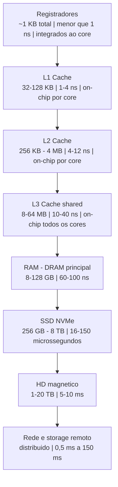
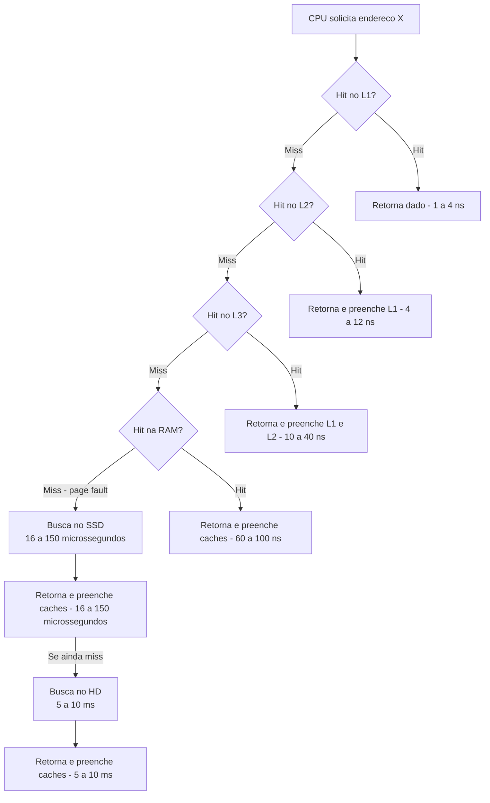
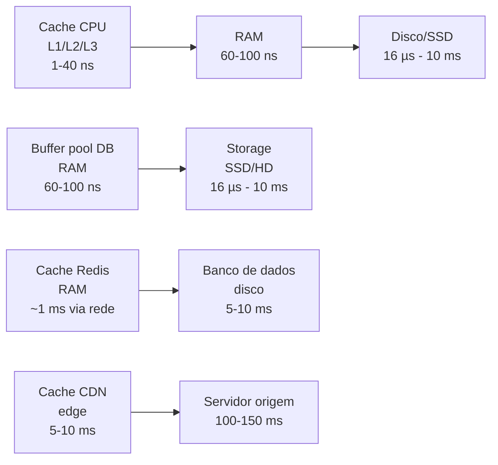

# Hierarquia de memória e localidade

> [!abstract] TL;DR
> A CPU processa dados em nanosegundos; a RAM responde em ~100 ns; o disco, em milissegundos. Esse abismo de velocidade — o **memory wall** — seria paralisante se não existisse uma solução elegante: organizar o armazenamento em **pirâmide**. Cada camada é menor, mais rápida e mais cara por byte. O truque que faz a pirâmide funcionar é a **localidade** — programas tendem a reusar o que acabaram de usar e a acessar endereços vizinhos. Caches exploram isso automaticamente. O dev que entende os números de latência toma decisões de design radicalmente melhores.

---

## O problema: a CPU é uma Ferrari parada no engarrafamento

Imagine que o processador tem fome de dados e pede um valor à memória RAM. Ele formula o pedido em menos de 1 ns. A RAM leva ~100 ns para responder.

São **300 ciclos de clock** em silêncio absoluto.

Trezentos ciclos é tempo suficiente para um processador moderno executar dezenas de instruções de ponto flutuante, verificar condições de branch, fazer operações vetoriais inteiras. Em vez disso, ele fica parado — esperando dados que estão a poucos centímetros de distância no PCB, mas a uma eternidade de distância em termos de velocidade elétrica e protocolo de DRAM.

Esse fenômeno tem nome: **memory wall**. Foi formalmente descrito por Wulf e McKee em 1994, no artigo seminal "Hitting the memory wall: Implications of the obvious". A observação era que as CPUs estavam evoluindo em frequência e capacidade de processamento muito mais rápido do que as DRAMs em latência de acesso.

Em 1980, a CPU e a RAM tinham velocidades comparáveis — o gap era de um fator ~2×.

Em 1990, já era ~10×.

Em 2000, ~50×.

Hoje, dependendo do nível de cache vs. memória principal vs. disco, o gap pode chegar facilmente a 300–1000×.

O gargalo de von Neumann que você viu em [[07 - Arquitetura de von Neumann e o ciclo de instrução]] não é só sobre o barramento único de dados/instrução — é também sobre esse abismo crescente de velocidade entre "quem processa" e "quem armazena".

> [!question] Por que a RAM é tão lenta comparada ao cache?
> Cache L1 usa **SRAM** (Static RAM): 6 transistores por bit, flip-flops que mantêm o estado enquanto houver energia. Rápida, mas cara e grande por bit.
> RAM principal usa **DRAM** (Dynamic RAM): 1 capacitor + 1 transistor por bit. Densa e barata, mas precisa ser recarregada periodicamente (refresh), e a leitura envolve carregar linhas/colunas e amplificadores de sentido — um processo inerentemente mais lento.
> Fazer 32 GB de SRAM custaria milhares de dólares e geraria calor insuportável. A física nos obriga à pirâmide.

A solução que a indústria convergiu nas últimas décadas é engenhosa: em vez de tentar tornar a memória principal tão rápida quanto a CPU, cria-se uma **hierarquia** de memórias. Cada nível é um compromisso diferente entre velocidade, capacidade e custo.

Vale notar que o hardware tenta esconder parte da latência com técnicas como **out-of-order execution** (reordenar instruções para executar outras enquanto espera a memória) e **hardware prefetching** (antecipar acessos futuros e carregá-los antes de serem solicitados). Mas essas técnicas têm limites — especialmente com acesso aleatório e pointer chasing, onde o prefetcher não consegue prever o próximo endereço.

A hierarquia de memória é a resposta estrutural e definitiva para o memory wall.

---

## A pirâmide: cada nível tem seu papel

A hierarquia de memória organiza o armazenamento de forma que os dados mais usados fiquem no nível mais rápido disponível — e os menos usados desçam para os níveis lentos mas baratos.

O diagrama abaixo representa a pirâmide de cima para baixo: mais rápido, menor e mais caro no topo; mais lento, maior e mais barato na base.

**Leitura do diagrama:** cada bloco mostra o nível, seu tamanho típico e latência aproximada. A largura visual representa tamanho relativo — em escala real, registradores seriam invisíveis e o disco de 20 TB seria tão maior que não caberia na tela.



Cada nível tem uma função específica no ecossistema:

**Registradores** vivem dentro do próprio core da CPU. São o espaço de trabalho imediato — variáveis que a CPU manipula neste exato ciclo. Tem dezenas deles (arquitetura de inteiros, ponto flutuante, vetoriais), ocupando poucos kilobytes no total.

**L1 cache** é o primeiro buffer entre o core e o mundo exterior. Dividido tipicamente em L1-I (instruções) e L1-D (dados) para evitar contenção. Hit em L1 retorna em 1–4 ciclos.

**L2 cache** é maior e um pouco mais lento. Age como "segunda linha de defesa". Se o L1 não tem o dado, o L2 provavelmente tem.

**L3 cache** é compartilhado entre todos os cores do chip. Chips de servidor modernos como AMD EPYC 9004 chegam a 384 MB de L3 (com 3D V-Cache). É o último cache antes de sair do chip para a memória principal.

**RAM (DRAM)** é onde vivem o código, a heap, a stack e os dados do processo. Acesso custa ~100 ns — 300 ciclos de espera.

**SSD** é armazenamento persistente rápido. NVMe Gen4 pode ler em ~16 µs (aleatório), o que é 160× mais lento do que a RAM.

**HD magnético** envolve mecânica real: um prato girando, um braço se movendo. O seek time (~5 ms) é determinado pela física de um motor elétrico.

**Rede** é a hierarquia que vai além da máquina. Mesmo datacenter: ~0,5 ms. Outro continente: ~150 ms.

---

## Os números que todo programador deveria conhecer de cor

Essa tabela é baseada nos "Latency Numbers Every Programmer Should Know" — um conjunto de referências popularizado por Jeff Dean e Peter Norvig, originalmente ~2009 e atualizado pela comunidade para hardware moderno.

**Leitura da tabela:** a coluna "Latência típica" é ordem de grandeza. A coluna "Ciclos (~3 GHz)" traduz quanto tempo de CPU você desperdiça esperando. A última coluna usa a analogia humana que é explicada logo após: se 1 ciclo de CPU durar 1 segundo real, quanto tempo seria?

| Nível ou operação              | Latência típica    | Ciclos (~3 GHz) | Equivalente humano (1 ciclo = 1 s) |
|--------------------------------|--------------------|-----------------|------------------------------------|
| Registrador (acesso)           | < 1 ns             | 1               | 1 segundo                          |
| L1 cache hit                   | ~1–4 ns            | 1–4             | 1–4 segundos                       |
| L2 cache hit                   | ~4–12 ns           | 4–12            | 4–12 segundos                      |
| L3 cache hit                   | ~10–40 ns          | 30–120          | 30 segundos a 2 minutos            |
| RAM (DRAM main memory)         | ~60–100 ns         | 200–300         | ~5 minutos                         |
| SSD NVMe — leitura aleatória   | ~16–150 µs         | 50k–450k        | ~6 horas a 2 dias                  |
| HD magnético — seek + leitura  | ~5–10 ms           | 15M–30M         | ~6 meses                           |
| Rede mesmo datacenter (RT)     | ~0,5 ms            | 1,5M            | ~3 semanas                         |
| Rede intercontinental (RT)     | ~100–150 ms        | 300M–450M       | ~10 anos                           |

A analogia de escala humana usa a premissa: **se 1 ciclo de CPU durar 1 segundo**, quanto tempo real você esperaria por cada nível?

- L1 = 1–4 segundos. Você pisca.
- RAM = 5 minutos. Você vai buscar um café.
- SSD = horas a dias. Você vai no fim de semana e volta.
- Disco magnético = 6 meses. Você troca de emprego antes da resposta chegar.
- Rede intercontinental = uma década. Seus filhos crescem.

Essa distorção de escala não é poesia — é o motivo pelo qual "só fazer uma chamada de rede a mais" pode custar 300× mais do que "ler da RAM", e por que ler da RAM pode custar 300× mais do que um hit de L1.

> [!warning] Erro clássico de estimativa de desempenho
> "Temos índice no banco de dados, deve ser rápido." Um seek de disco é ~10 ms. Um hit de L1 é ~1 ns. São 10 **milhões** de vezes mais lento. O índice reduz o número de seeks — não a latência de cada um. Mover páginas quentes para o buffer pool da RAM reduz a latência de ~10 ms para ~100 ns. Essa é a diferença entre 100 req/s e 10.000 req/s no mesmo hardware.

---

## Tamanho, latência e custo: o trade-off em uma tabela

A tabela anterior focava na latência. Esta foca no trade-off econômico: quanto custa ter mais velocidade, e quanto você ganha em capacidade ao aceitar mais lentidão.

**Leitura da tabela:** conforme descemos na hierarquia, a capacidade cresce em ordens de grandeza, mas a latência piora na mesma proporção. O custo por GB cai dramaticamente — RAM custa ~100–300× mais por GB do que HD.

| Nível          | Tamanho típico (2024)  | Latência       | Custo por GB (aprox.)   |
|----------------|------------------------|----------------|-------------------------|
| Registradores  | ~1 KB (dezenas de reg) | < 1 ns         | N/A — on-die            |
| L1 cache       | 32–128 KB              | ~1–4 ns        | N/A — on-die            |
| L2 cache       | 256 KB–4 MB            | ~4–12 ns       | N/A — on-die            |
| L3 cache       | 8–64 MB                | ~10–40 ns      | N/A — on-die            |
| RAM (DRAM)     | 8–128 GB               | ~60–100 ns     | ~US$ 3–6 por GB         |
| SSD NVMe       | 256 GB–8 TB            | ~16–150 µs     | ~US$ 0,08–0,15 por GB  |
| HD magnético   | 1–20 TB                | ~5–10 ms       | ~US$ 0,02–0,04 por GB  |
| Fita magnética | petabytes              | segundos–min   | < US$ 0,005 por GB      |

O custo on-die é "infinito" em termos de GB — um chip AMD EPYC 9654 com 384 MB de L3 custa centenas de dólares, e essa capacidade não pode crescer além do silício disponível no pacote.

A conclusão prática: se você precisa de acesso em nanosegundos, cabe em cache. Se cabe em RAM (~100 ns, custo razoável), ótimo. Se não cabe, vai para SSD (µs) ou disco (ms) — e você precisa de estratégia de cache para esconder essa latência.

Outro ângulo: o custo por GB de RAM vem caindo consistentemente (~50% a cada 18–24 meses, seguindo uma lei análoga à de Moore). O que hoje exige Redis distribuído para caber em RAM, amanhã pode caber em memória local de um único servidor. Isso muda as decisões de arquitetura ao longo do tempo — motivo pelo qual o modelo mental da hierarquia é mais durável do que qualquer configuração específica de hardware.

---

## Por que funciona: localidade de referência

A pirâmide só faz sentido porque programas reais exibem **localidade** — um padrão estatístico de acesso à memória que os designers de hardware exploram ativamente.

Localidade não é uma propriedade mágica. É uma consequência da estrutura dos algoritmos: loops que reiteram, variáveis de controle que são lidas mil vezes, arrays percorridos sequencialmente, funções que processam blocos contíguos de dados.

Um fato empírico importante: estudos sobre programas reais (medidos por profilers de cache) mostram que a grande maioria das execuções passa 90% do tempo em 10% do código — a regra 90/10. Essa concentração de execução é localidade temporal em ação. O cache só precisa manter esse "hot path" quente para ser eficaz.

Existem dois tipos fundamentais de localidade, e eles se reforçam mutuamente.

### Localidade temporal

> O que foi usado recentemente tende a ser usado de novo em breve.

Um loop que executa 10.000 iterações acessa as mesmas variáveis de controle repetidamente:

```python
total = 0
for i in range(1_000_000):
    total += dados[i]
```

Nesse loop, `total`, `i` e o ponteiro base de `dados` são acessados em **cada iteração**. O cache mantém essas variáveis no L1 sem esforço. Localidade temporal altíssima.

O mesmo vale para funções chamadas repetidamente, objetos de longa vida, e estruturas de dados que recebem muitas operações em sequência.

### Localidade espacial

> O que está próximo na memória de algo que foi acessado tende a ser acessado em seguida.

Quando você acessa `dados[0]`, existe grande probabilidade de logo acessar `dados[1]`, `dados[2]`, etc. O hardware explora isso com **cache lines**: ao trazer um elemento ao cache, o sistema traz um bloco inteiro de **64 bytes** ao redor dele.

Se o programa tem localidade espacial, cada cache miss "adianta" múltiplos acessos futuros. Se não tem (como em listas encadeadas com nós dispersos no heap), cada acesso pode ser um miss separado.

### Os dois tipos lado a lado

**Leitura da tabela:** cada linha mostra um padrão de código, qual tipo de localidade ele demonstra e o impacto prático no cache. A coluna "Veredicto" resume o comportamento esperado em hardware real.

| Padrão de código                                   | Localidade      | O que o cache faz                                       | Veredicto       |
|----------------------------------------------------|-----------------|---------------------------------------------------------|-----------------|
| `for i in range(n): soma += a[i]`                  | Temporal + espacial | Mantém `i`, `soma` em L1; traz 64B de `a` por miss  | Muito rápido    |
| Percorrer `linked_list` nó a nó                    | Nenhuma         | Cada nó pode estar em cache line diferente              | Muito lento     |
| Reusar resultado de função cara em loop            | Temporal        | Hit após primeira chamada se cabe em cache              | Rápido          |
| Varrer matriz row-major em C (linhas primeiro)     | Espacial        | Cada cache line cobre vários elementos da linha         | Rápido          |
| Varrer matriz row-major em C por coluna            | Nenhuma         | Cada elemento está em cache line diferente              | Muito lento     |
| Percorrer árvore binária balanceada aleatoriamente | Espacial fraca  | Nós próximos podem compartilhar cache line              | Moderado        |
| Processar buffer de vídeo pixel a pixel            | Espacial        | Pixels contíguos compartilham cache lines               | Rápido          |

> [!tip] A regra prática mais valiosa
> **Arrays batem listas encadeadas não pelo Big-O — muitas vezes o Big-O é igual.** Arrays ganham porque têm localidade espacial perfeita. Cada cache miss de uma lista encadeada pode custar ~100 ns de penalidade de RAM. Em um array, depois do primeiro miss, os próximos 7–15 elementos já estão na mesma cache line de 64 bytes e chegam de graça.

---

## O fluxo de um acesso: hit ou miss, descendo a pirâmide

Quando a CPU precisa de um valor em um endereço de memória, ela consulta os caches em ordem, do mais rápido para o mais lento, parando no primeiro hit.

**Leitura do diagrama:** siga o caminho "Hit" para retornos rápidos. Cada "Miss" desce ao próximo nível, acumulando latência. Um "cold miss" que atravessa até o HD é catastrófico — pode custar 10 bilhões de vezes mais do que um hit de L1.



Quando um dado não está na RAM — porque o SO nunca o carregou ou fez swap para liberar espaço — ocorre um **page fault**. O SO intercepta, busca a página no SSD ou HD, carrega na RAM e só então o acesso continua. Esse processo envolve troca de contexto e pode custar dezenas de milissegundos.

Em sistemas com memória insuficiente que fazem swap intensivo, o desempenho colapsa — chamado de **thrashing**. O SO passa mais tempo movendo páginas entre RAM e disco do que executando trabalho útil. É o equivalente de ter 100% de cache misses no nível do SO.

Para detalhes sobre como o SO gerencia isso com memória virtual e tabelas de página, veja [[03-Dominios/Fundamentos/Sistemas Operacionais/07 - Memória virtual e paginação]].

Um ponto importante: os caches fazem a **substituição** automaticamente. Quando um novo dado precisa entrar e o cache está cheio, uma política de substituição (tipicamente LRU ou variantes) descarta o dado menos recentemente usado. O programador não gerencia isso — o hardware faz. O que o programador controla é o **padrão de acesso**: com boa localidade, o hardware consegue ajudá-lo.

---

## A mesma ideia em escalas diferentes

O princípio "mantenha o que é quente no nível mais rápido disponível" aparece em toda a computação, não só no hardware da CPU.



**Leitura do diagrama:** cada par mostra o mesmo padrão hierárquico em uma escala diferente. O nível esquerdo é o "cache" (rápido, pequeno); o direito é o "armazenamento" (lento, grande). A estrutura é idêntica — só a escala de tempo muda.

**Cache de CPU** ↔ **Memória virtual / paginação**: o SO usa a RAM como cache para disco. Page fault = cache miss do SO. O algoritmo LRU de substituição de página é a mesma ideia que o LRU de substituição de cache line — aplicado em granularidade de páginas (4 KB) em vez de cache lines (64 bytes). Veja [[03-Dominios/Fundamentos/Sistemas Operacionais/07 - Memória virtual e paginação]].

**Buffer pool de banco de dados**: PostgreSQL, MySQL e Oracle mantêm páginas de disco na RAM. Uma query que acessa dados no buffer pool tem latência de µs. Uma query que força leitura de disco tem latência de ms — diferença de 100–1000×. O DBA que entende hierarquia aumenta `shared_buffers` estrategicamente e mantém índices hot em memória.

**Redis / Memcached como cache de aplicação**: a aplicação usa RAM de um cache distribuído em vez de bater no banco a cada requisição. A lógica de TTL (Time to Live) e invalidação é equivalente à política de substituição de cache de L1/L2. A diferença é que o Redis introduz latência de rede (~0,5 ms vs. acesso local de ~100 ns) — mas elimina os ~5–10 ms do banco.

**CDN (Content Delivery Network)**: um arquivo de imagem no servidor de origem pode estar a 150 ms de distância (rede intercontinental). Na CDN edge mais próxima, está a 5–10 ms. O cache HTTP é uma hierarquia de memória em escala geográfica. Os cabeçalhos `Cache-Control` e `ETag` são o equivalente da política de substituição em escala de HTTP.

> [!info] Padrão universal
> **Caching é o padrão arquitetural mais replicado da computação.** Toda vez que você vê dois níveis com velocidades diferentes — CPU/RAM, RAM/disco, disco/rede, edge/origem — existe oportunidade para um cache no meio. Entender a hierarquia de memória de hardware é entender o *por quê* de Redis, CDN, buffer pool e prefetch existirem. O vocabulário é diferente; o princípio é idêntico.

---

## Impacto prático: decisões de design que os números mudam

### Arrays vs. listas encadeadas: o Big-O mente

Dois algoritmos com O(n) de complexidade podem ter desempenho completamente diferente em hardware real.

Varrer um `ArrayList` de 1 milhão de inteiros: localidade espacial perfeita. O prefetcher hardware detecta o padrão linear e carrega cache lines antecipadamente. Throughput próximo da largura de banda de memória (~50 GB/s em DDR5).

Varrer uma `LinkedList` de 1 milhão de nós alocados aleatoriamente no heap: cada nó pode estar em uma cache line completamente diferente. Cada acesso a `node.next` pode ser um miss de L3 → RAM (~100 ns). Em prática, pode ser 10–50× mais lento do que o array equivalente.

O Big-O ignora constantes. A constante de cache pode dominar o desempenho real quando n é grande.

### AoS vs. SoA: layout importa

Suponha processamento de partículas em simulação física:

```c
// AoS - Array of Structs
struct Particula { float x, y, z, velocidade, massa; };
Particula particulas[1_000_000];

// SoA - Struct of Arrays
struct Particulas {
    float x[1_000_000], y[1_000_000], z[1_000_000];
    float velocidade[1_000_000], massa[1_000_000];
};
```

Se o loop de física só precisa atualizar `velocidade`, em AoS cada elemento tem 20 bytes de struct, mas você só usa 4 bytes. Uma cache line de 64 bytes traz 3 velocidades e 9 floats inúteis — 75% do cache desperdiçado.

Em SoA, `velocidade[0..15]` são 16 floats contíguos, 64 bytes, 100% utilizados. Você processa 16 partículas por cache line em vez de 3.

Esse é o motivo pelo qual game engines (Unity DOTS, Bevy ECS), simuladores físicos e código HPC usam SoA como padrão. A diferença de desempenho pode ser 3–5× em loops de processamento massivo.

### Big-O "mente" mais uma vez: heapsort vs. mergesort

Ambos são O(n log n). Heapsort tem localidade péssima: acessa o heap em padrão que destrói o cache. Mergesort percorre arrays sequencialmente e tem localidade espacial muito melhor.

Em benchmarks reais para arrays de milhões de elementos, Timsort (O(n log n), adaptativo, cache-friendly) costuma superar heapsort por 2–4× por causa de localidade.

O algoritmo teoricamente inferior em algumas métricas vence porque a constante de cache é dominante.

### Cache de rede vs. cache de RAM vs. banco: a tabela de decisão

**Leitura da tabela:** use as colunas para decidir onde cachear com base nas suas restrições de latência, consistência e escala.

| Cenário                                    | Latência alvo | Solução de cache         | Latência esperada |
|--------------------------------------------|---------------|--------------------------|-------------------|
| Resultado de query SQL frequente           | < 5 ms        | Redis (rede local)       | ~0,5–2 ms         |
| Sessão de usuário acessada em cada request | < 1 ms        | Memória do processo (heap) | ~100 ns          |
| Assets estáticos para usuários globais     | < 50 ms       | CDN edge                 | ~5–15 ms          |
| Cálculo caro em batch                      | < 100 ns      | Cache em estrutura in-process | ~1–10 ns      |
| Página de produto popular                  | < 10 ms       | Cache Redis com TTL      | ~0,5–2 ms         |

> [!example] Decisão real de design
> "Devo cachear esse resultado em Redis ou em memória local do processo?" Redis → ~0,5–2 ms (rede local). Memória local → ~100 ns (RAM). Para dados compartilhados entre múltiplas instâncias, Redis é necessário. Para dados por-processo com acesso > 10.000 req/s, memória local ganha por 5.000×. A tabela de latências informa a escolha — não só a "elegância" da solução.

### "Memória é o novo disco"

Essa frase — atribuída a Jim Gray — captura uma dinâmica importante: o que antes era o nível mais rápido disponível vai se tornando "lento" conforme o nível acima se populariza e barateia.

- Em 1980: disco era o único storage persistente; RAM era cache do disco.
- Em 2000: SSD tornou o disco "o novo tape".
- Em 2015: RAM de 32 GB por servidor tornou SSD "o novo HD".
- Em 2025: redes de 100–400 Gbps tornam storage de rede comparável ao disco local.

A hierarquia não é estática — ela evolui com preços e tecnologias. Entender o **princípio** é mais valioso do que memorizar os números atuais.

> [!tip] Para aprofundar
> Como o hardware de cache funciona internamente — linhas, conjuntos, associatividade, políticas de substituição, write-back vs. write-through, coerência em multicore — é o próximo passo natural. Veja [[12 - Cache a fundo]].

---

> [!summary] Resumo em uma linha
> A hierarquia de memória existe porque há um abismo de velocidade entre CPU e armazenamento — e a localidade dos programas permite que caches menores e rápidos escondam esse abismo com altíssima eficácia.

---

## Em entrevista

Em contextos técnicos internacionais, conhecer a hierarquia de memória e seus números de latência é sinal de engenharia de sistemas sólida. Questões sobre performance, bottlenecks e design de caches são comuns em entrevistas de sistemas distribuídos, embedded e backend de alto tráfego.

Quando perguntado sobre desempenho de um sistema, referencie a hierarquia para mostrar raciocínio estruturado: "O gargalo é provavelmente acesso a disco — podemos mover páginas quentes para RAM com um buffer pool, reduzindo latência de ~5 ms para ~100 ns, ou seja, ~50.000× mais rápido por acesso."

*Memory wall — the growing gap between CPU speed and DRAM access latency, coined by Wulf and McKee (1994).*
*Cache hierarchy — the multi-level structure (registers, L1, L2, L3, RAM, SSD, disk) that bridges the speed gap.*
*Cache hit — when the requested data is found in a given cache level without going to a slower level.*
*Cache miss — when data is not found and must be fetched from the next (slower) level.*
*Temporal locality — recently accessed data tends to be accessed again soon; exploited by keeping data in cache across iterations.*
*Spatial locality — data near recently accessed addresses tends to be accessed soon; exploited by cache line prefetching.*
*Cache line — the minimum unit of data transferred between cache levels, typically 64 bytes.*
*Pointer chasing — sequential accesses through linked data structures that defeat spatial locality.*
*Array of Structs (AoS) vs. Struct of Arrays (SoA) — memory layout trade-off with direct cache utilization implications.*
*Hardware prefetcher — a CPU unit that predicts and pre-loads cache lines before they are explicitly requested.*

| Termo PT                          | Termo EN                          |
|-----------------------------------|-----------------------------------|
| Hierarquia de memória             | Memory hierarchy                  |
| Gargalo de memória                | Memory wall                       |
| Acerto de cache                   | Cache hit                         |
| Falha de cache                    | Cache miss                        |
| Localidade temporal               | Temporal locality                 |
| Localidade espacial               | Spatial locality                  |
| Linha de cache                    | Cache line (64 bytes)             |
| Encadeamento de ponteiros         | Pointer chasing                   |
| Busca antecipada (hardware)       | Hardware prefetch                 |
| Pool de buffer (banco)            | Buffer pool                       |
| Array de structs                  | Array of Structs (AoS)            |
| Struct de arrays                  | Struct of Arrays (SoA)            |
| Política de substituição LRU      | LRU eviction policy               |
| Falta de página                   | Page fault                        |
| Acesso aleatório                  | Random access                     |
| Acesso sequencial                 | Sequential access                 |
| Registrador                       | Register                          |
| Largura de banda de memória       | Memory bandwidth                  |

---

> [!info] Lastro
> - **Bryant, R. E. & O'Hallaron, D. R.** — *Computer Systems: A Programmer's Perspective* (CS:APP), 3ª ed., Pearson, 2016. **Capítulo 6: The Memory Hierarchy** — referência canônica sobre localidade, hierarquia, caches e a "memory mountain". [csapp.cs.cmu.edu](https://csapp.cs.cmu.edu/3e/perspective.html)
> - **Patterson, D. A. & Hennessy, J. L.** — *Computer Organization and Design: The Hardware/Software Interface* (RISC-V Edition), Morgan Kaufmann, 2021. Capítulos 5–6 cobrem hierarquia de memória e caches com exemplos de RISC-V reais.
> - **Jeff Dean / Peter Norvig** — "Latency Numbers Every Programmer Should Know" (~2009, atualizado pela comunidade). Versão interativa com linha do tempo histórica: [colin-scott.github.io/personal\_website/research/interactive\_latency.html](https://colin-scott.github.io/personal_website/research/interactive_latency.html)
> - **Wulf, W. A. & McKee, S. A.** — "Hitting the memory wall: Implications of the obvious", *ACM SIGARCH Computer Architecture News*, 23(1), 1995. O artigo que cunhou o termo "memory wall" e documentou o crescimento do gap CPU × DRAM.
> - **Arthur Chiao** — "Practical Storage Hierarchy and Performance (2024)" — análise comparativa de latências em hardware moderno (NVMe Gen4, DDR5, L3 AMD EPYC). [arthurchiao.art/blog/practical-storage-hierarchy](https://arthurchiao.art/blog/practical-storage-hierarchy/)
