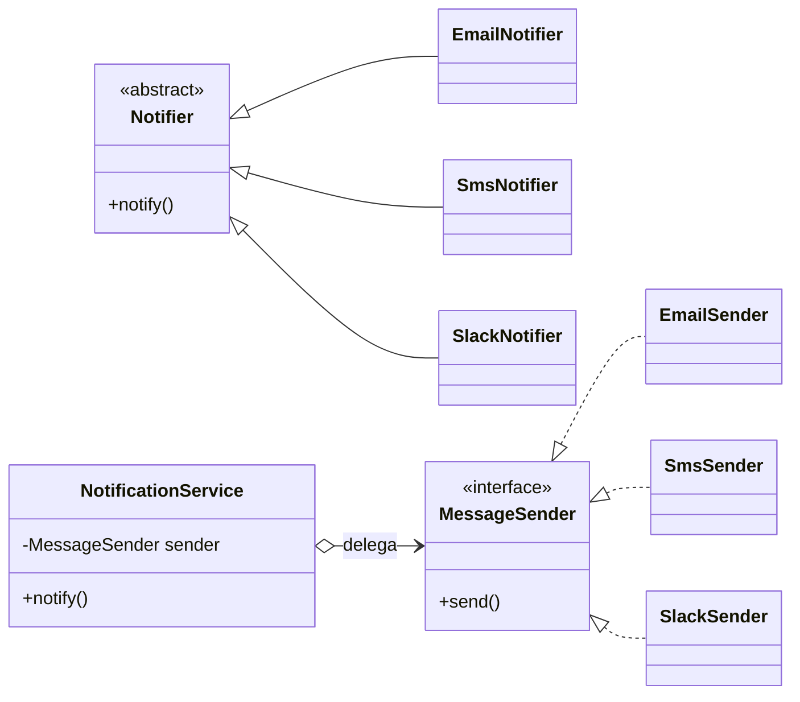
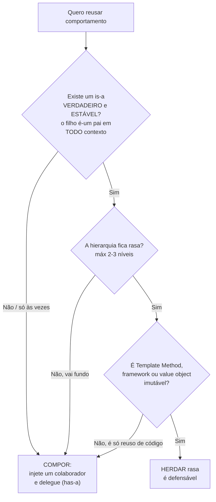
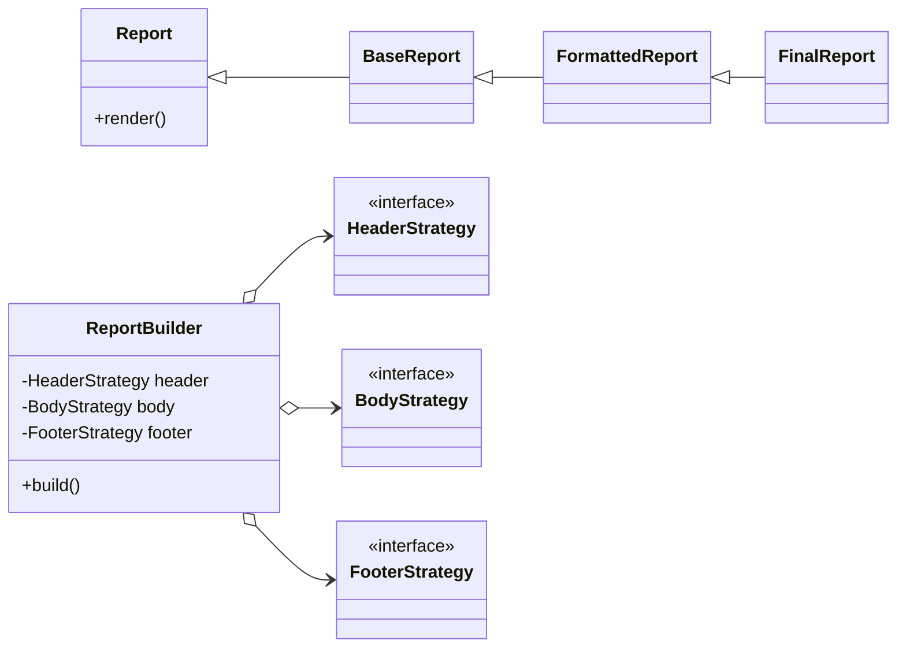

# Composição sobre herança

> [!abstract] TL;DR
> A heurística mais repetida da OO moderna: prefira **compor** objetos (has-a) a **estender** classes
> (is-a). Em vez de herdar comportamento, **injete** um colaborador e **delegue** a ele. Composição
> troca herança fixa em tempo de compilação por colaboração flexível em tempo de execução — você paga
> em **verbosidade** e recebe **flexibilidade**. Não é dogma: herança rasa e estável ainda tem lugar.

## A regra, em uma frase

Você quer reusar comportamento. Há dois caminhos.

O primeiro é herdar: `EmailNotifier extends Notifier`. O filho **é-um** pai e ganha tudo dele de
graça. Já vimos em [[04 - Herança]] o preço escondido — acoplamento forte, hierarquia rígida, fragile
base class.

O segundo é compor: o objeto **tem-um** colaborador e **delega** o trabalho a ele. Em vez de *ser* um
notificador, o `NotificationService` *tem* um `MessageSender` e pede para ele enviar.

> [!tip] Resumo em uma linha
> Herança copia o pai para dentro do filho; composição segura uma referência ao colaborador e delega.

A frase canônica do livro do Gang of Four é direta: **"favor object composition over class
inheritance"** ("prefira composição de objetos a herança de classes"). Não é "nunca herde". É "na
dúvida, componha" — porque composição é a opção que envelhece melhor.

## Por que herança machuca (resumo)

O detalhe vive em [[04 - Herança]]; aqui basta o esqueleto, porque é o "porquê" da regra:

- **Acoplamento forte filho↔base** — a subclasse enxerga internos `protected` da base, não só a
  interface pública. É o acoplamento mais apertado que OO oferece (mais em [[08 - Acoplamento e coesão]]).
- **Hierarquia rígida** — uma classe tem **uma só** cadeia de pais. Precisa de um segundo eixo de
  variação? A herança trava.
- **Fragile base class** — mudar a base pode quebrar filhos que você nem lembrava que existiam.
- **Reuso de código ≠ reuso de conceito** — herdar só para reaproveitar um método (sem um is-a
  genuíno) é abuso. Você acoplou dois conceitos diferentes só para economizar digitação.
- **Testes difíceis** — mockar um pedaço da hierarquia é dolorido; você arrasta a base inteira junto.

Composição esvazia cada um desses pontos: o colaborador é injetado, troca-se em runtime, e expõe só
sua interface pública.

## Composição em código: injete e delegue

O exemplo clássico. Não faça `EmailNotifier extends Notifier`. Em vez disso, defina **o quê** num
contrato — uma interface — e injete a implementação pelo construtor:

```typescript
// O contrato: "o quê", não "como" (ver [[06 - Interfaces e classes abstratas]])
interface MessageSender {
  send(to: string, text: string): Promise<void>;
}

// Implementações intercambiáveis — cada uma é um "como"
class EmailSender implements MessageSender {
  async send(to: string, text: string) { /* SMTP... */ }
}
class SmsSender implements MessageSender {
  async send(to: string, text: string) { /* gateway SMS... */ }
}
class SlackSender implements MessageSender {
  async send(to: string, text: string) { /* webhook... */ }
}

// O serviço TEM-UM sender e DELEGA. Não herda nada.
class NotificationService {
  constructor(private readonly sender: MessageSender) {}   // injeção

  notify(user: string, msg: string) {
    return this.sender.send(user, msg);                    // delegação
  }
}

// Trocar comportamento = passar outra implementação. Sem mexer no serviço.
new NotificationService(new EmailSender()).notify("ana@x.com", "oi");
new NotificationService(new SlackSender()).notify("@ana", "oi");
```

Repare em três coisas. Primeiro: `NotificationService` depende da **interface** `MessageSender`, não
de uma classe concreta — isso é o **DIP** (Dependency Inversion Principle, o D de
[[03-Dominios/Fundamentos/SOLID/index|SOLID]]): dependa de abstrações. Segundo: trocar e-mail por
Slack não toca uma linha do serviço — você passa outro objeto no construtor. Terceiro: testar é
trivial — injete um `FakeSender` e verifique o que foi enviado, sem rede.



**Leitura do diagrama:** à esquerda, a abordagem por herança — uma subclasse de `Notifier` para cada
canal, cada uma soldada à base (triângulo vazio `<|--`). À direita, a composição — **um** serviço que
segura um `MessageSender` (o losango `o-->` é agregação: "tem-um") e delega. As implementações
satisfazem só o contrato (linha tracejada `<|..`). O canal vira **dado** que você passa, não uma
classe nova que você escreve.

## Delegação: o verbo que sustenta tudo

Composição sem delegação é só guardar um objeto numa gaveta. O que dá vida a ela é **delegar**:
encaminhar a chamada que você recebeu para o colaborador que sabe fazer o trabalho.

É como um gerente que recebe um pedido e não executa nada sozinho — repassa para o especialista da
equipe. `notify()` não envia nada; ele **delega** `send()` ao `sender`. O gerente continua dono da
**política** (quando notificar, registrar log, repetir em falha); o especialista cuida da **mecânica**
(como falar com o SMTP).

Essa divisão é o coração da diferença: na herança, o filho **herda a mecânica** e fica preso a ela; na
composição, o objeto **delega a mecânica** e pode trocar de especialista quando quiser.

## Os patterns já são isto, com nome

Quando você compõe e delega de um jeito recorrente, o catálogo de [[Design Patterns]] já batizou o
padrão. Não vou ensinar o catálogo aqui (ele tem nota própria), mas vale ver que **composição é o
mecanismo por baixo** de vários deles:

- **Strategy** — exatamente o `MessageSender` acima: um algoritmo intercambiável injetado. "Trocar o
  comportamento passando outra implementação" *é* Strategy.
- **Decorator** — envolve um objeto com outro do mesmo contrato para somar comportamento (um
  `LoggingSender` que delega ao `sender` real e ainda registra). Reuso por **camadas**, não por
  herança.
- **Composite** — um objeto que contém vários filhos do mesmo tipo e delega a todos (uma árvore que se
  trata como folha).

A lição: aquilo que você seria tentado a resolver com uma árvore de subclasses, o GoF resolve compondo
objetos. Detalhe de cada um em [[Design Patterns]].

## Go: embedding é composição com promoção, não herança

Vale o aparte porque confunde muita gente. Go **não tem herança**, mas tem **embedding de struct** —
você embute um tipo dentro de outro e os métodos do embutido são **promovidos** para o externo, como
se fossem dele. Parece herança; **é composição**.

```go
type Logger struct{}
func (l Logger) Log(msg string) { fmt.Println(msg) }

type Service struct {
    Logger          // embedding: Service "tem-um" Logger
}
// s.Log("oi") funciona — método PROMOVIDO de Logger. Mas é delegação, não is-a.
```

A diferença não é cosmética: não há relação is-a, não há substituibilidade automática por classe-base,
não há fragile base class. Go fez essa escolha de propósito, para tornar composição o caminho **padrão**
da linguagem. O panorama de como cada linguagem trata isso está em
[[11 - Como o modelo OO difere entre linguagens]].

## Quando herança ainda é a ferramenta certa

A regra é **heurística, não lei**. Há casos em que herança rasa é mais limpa que composição — e fingir
o contrário é dogmatismo. Herde quando:

- **Há um is-a de domínio real e estável** — `CreditCardPayment` **é um** `Payment` em todo contexto, e
  esse fato não vai mudar de forma. O is-a é genuíno, não uma desculpa para reusar código.
- **Template Method** — a classe abstrata define o **esqueleto** de um algoritmo e deixa buracos para
  as filhas preencherem (`gerar()` chama `buscarDados()` abstrato). Aqui a base *controla o fluxo* e a
  herança é o mecanismo natural.
- **O framework foi projetado para você estender** — `extends HttpServlet`, `extends JpaRepository`. O
  contrato de extensão **é** a API; o framework chama seus overrides.
- **Value objects imutáveis** numa hierarquia pequena, onde não há estado mutável para corromper (ver
  [[09 - Identidade, igualdade e imutabilidade]]).

A trava de segurança em todos os casos: **mantenha a hierarquia rasa**, 2–3 níveis no máximo. Herança
profunda é onde os problemas de [[04 - Herança]] se acumulam.



**Leitura do diagrama:** a saída padrão é **compor** — herança só passa se cruzar três portões
(is-a real, hierarquia rasa, caso legítimo). "Reusar código" sozinho **não** é motivo: cai em compor.
A composição é a regra; a herança é a exceção que precisa se justificar.

## Na prática

No projeto Digidados eu mantinha uma hierarquia de **quatro níveis** de `Report`. No papel parecia
elegante — cada nível especializava o de cima, tudo bem arrumadinho no diagrama. Na vida real virou um
pesadelo de manutenção: cada requisito novo me obrigava a decidir *em que andar* da árvore mexer, e
qualquer mudança na base ameaçava os filhos lá embaixo.

Refatorei para **composição**. Em vez de herdar, criei um `ReportBuilder` que recebe três
colaboradores: `HeaderStrategy`, `BodyStrategy` e `FooterStrategy`. Cada parte do relatório virou uma
estratégia injetável; montar um relatório novo passou a ser **combinar** estratégias, não estender uma
classe.

O resultado foi mais **verboso** — mais interfaces, mais objetos passados no construtor. Mas
infinitamente mais **flexível**: uma combinação nova de cabeçalho e rodapé deixou de ser uma subclasse
nova e passou a ser uma linha de configuração.

A lição que ficou: **herança profunda elegante no papel raramente sobrevive à evolução dos
requisitos**. Composição cobra o custo da verbosidade adiantado e te devolve flexibilidade quando os
requisitos mudam — e eles sempre mudam.



**Leitura do diagrama:** à esquerda, o **antes** — quatro níveis de `Report` empilhados (`<|--`),
cada andar dependendo do de cima. À direita, o **depois** — um `ReportBuilder` que segura três
estratégias (`o-->`, "tem-um"). A árvore vertical de quatro andares virou uma composição horizontal de
três peças trocáveis. Mais caixas no diagrama, sim — e nenhuma soldada às outras.

## OO é ferramenta, não religião

Cuidado com transformar "composição sobre herança" em mandamento. A regra é uma **heurística** nascida
da observação de que herança é mal usada com frequência — não uma proibição. Um senior aplica o
julgamento: pesa is-a real, estabilidade, profundidade e custo de verbosidade caso a caso. Esse
discernimento — saber *quando* a regra se aplica e quando não — é o que o capstone
[[13 - OO na prática e em entrevista]] cobra. Decorar o slogan é júnior; saber quando furá-lo é senior.

> [!info] Lastro
> "Favor object composition over class inheritance" é um dos dois princípios fundamentais do livro
> *Design Patterns* (Gamma, Helm, Johnson, Vlissides — o **Gang of Four**, 1994), enunciado na
> introdução do catálogo. **Effective Java** (Joshua Bloch) reforça em itens dedicados: *"Favor
> composition over inheritance"* e *"Design and document for inheritance or else prohibit it"* —
> origem do exemplo do `CountingList`/fragile base class citado em [[04 - Herança]]. A relação
> **is-a vs. has-a** e a delegação como mecanismo são vocabulário canônico de OO. Simplificações
> conscientes: tratei Strategy/Decorator/Composite só como ilustração (o catálogo fica em
> [[Design Patterns]]); o embedding de Go foi reduzido ao essencial (detalhe em
> [[11 - Como o modelo OO difere entre linguagens]]); o exemplo do Digidados preserva fielmente a
> experiência real relatada, sem nomes de clientes, datas ou métricas inventados.

## Em entrevista

Este é o tópico onde o entrevistador checa se você tem **maturidade de design**, não decoreba. Mostrar
o trade-off — e que você não é dogmático — vale mais que recitar o slogan.

- A regra e seu porquê:
  "I favor composition over inheritance because composition gives me runtime flexibility and avoids the
  tight coupling between a subclass and its base."
- O mecanismo:
  "Instead of extending a class, I inject a collaborator and delegate to it — the object *has-a*
  dependency rather than *is-a* subclass."
- A ponte com SOLID:
  "Composing against an interface is dependency inversion in action: the service depends on the
  abstraction, so I can swap implementations without touching it."
- Os patterns:
  "Strategy, Decorator and Composite are really composition with a name — that's how the Gang of Four
  replaces inheritance trees."
- A honestidade (impressiona):
  "It's a heuristic, not a law. For a stable is-a domain hierarchy, a Template Method, or extending a
  framework base class, shallow inheritance is the cleaner choice."

**Vocabulário PT → EN:**

| Português | Inglês |
| --- | --- |
| composição sobre herança | composition over inheritance |
| relação tem-um / é-um | has-a / is-a relationship |
| delegar (delegação) | to delegate (delegation) |
| injetar (injeção) | to inject (injection) |
| colaborador | collaborator |
| intercambiável | interchangeable / pluggable |
| inversão de dependência | dependency inversion |
| em tempo de execução / compilação | at runtime / at compile time |
| verbosidade | verbosity |
| flexibilidade | flexibility |
| embedding de struct | struct embedding |
| promoção de métodos | method promotion |
| heurística, não lei | a heuristic, not a law |

## Veja também

- [[04 - Herança]] — o pilar cujos perigos esta regra responde
- [[05 - Polimorfismo]] — composição contra interface também é polimorfismo (por delegação)
- [[06 - Interfaces e classes abstratas]] — o contrato que o colaborador injetado satisfaz
- [[08 - Acoplamento e coesão]] — por que composição acopla mais frouxo que herança
- [[09 - Identidade, igualdade e imutabilidade]] — value objects como caso de herança segura
- [[10 - Rich vs Anemic Domain Model]] — onde domínio rico usa colaboração entre objetos
- [[11 - Como o modelo OO difere entre linguagens]] — embedding de Go como composição
- [[12 - Anti-patterns de OO]] — herança abusada (Refused Bequest, Yo-yo) que a composição evita
- [[13 - OO na prática e em entrevista]] — o capstone: quando a regra se aplica e quando furá-la
- [[Design Patterns]] — Strategy, Decorator, Composite: composição com nome
- [[03-Dominios/Fundamentos/SOLID/index|SOLID]] — o D (DIP) que torna a composição testável e flexível
