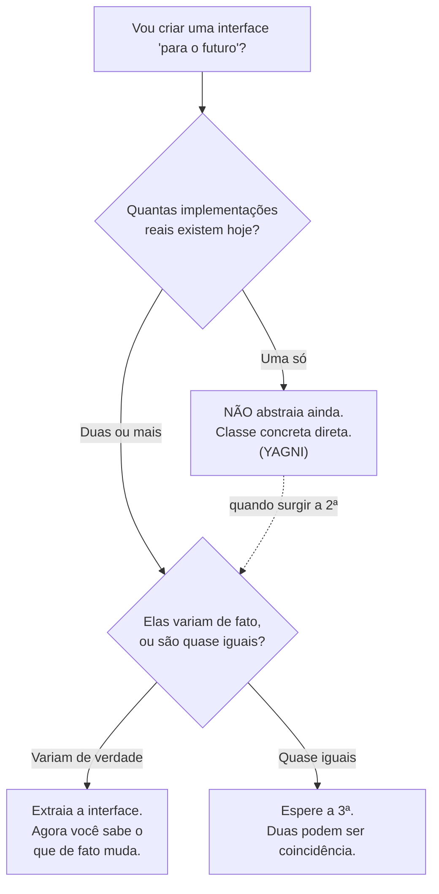
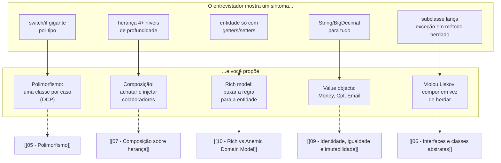

# OO na prática e em entrevista

> [!summary] Resumo
> Este é o **capstone** do galho: amarra os doze conceitos numa postura de senior — OO é **ferramenta, não religião** (às vezes uma função pura ganha de uma classe), abstração se cria **quando a segunda implementação aparece** (YAGNI), e em entrevista o que separa pleno de sênior não é recitar os quatro pilares, mas mostrar **quando** a regra importou. Fecha com checklist de armadilhas, *cheat-sheet*, discurso pronto em inglês e vocabulário PT→EN.

Você passou por doze notas. Sabe o que é [[02 - Encapsulamento|encapsulamento]], por que [[07 - Composição sobre herança|composição vence herança]] na maioria das vezes, como um [[10 - Rich vs Anemic Domain Model|modelo rico]] guarda a regra junto dos dados. Mas saber definir não é saber **aplicar** — e entrevista de senior testa a segunda coisa, não a primeira.

Esta nota não ensina conceito novo. Ela ensina **julgamento**: quando usar o que você aprendeu, quando *não* usar, e como falar sobre isso numa sala com um entrevistador que já ouviu trezentos candidatos recitarem "encapsulamento é esconder os dados".

## OO é ferramenta, não religião

Tem uma armadilha mental que pega gente boa: depois de internalizar OO, você começa a achar que **tudo** precisa ser um objeto. Precisa de uma classe `ValidadorDeCpf`? Talvez. Mas se é uma função que recebe uma `String` e devolve `boolean`, sem estado, sem identidade, sem invariante para proteger — uma **função pura** é mais simples, mais testável e mais honesta do que uma classe com um único método estático fingindo ser objeto.

O cheiro disso já tem nome no galho: [[12 - Anti-patterns de OO|Poltergeist]] — a classe-fantasma sem estado que só existe para chamar outra. Quando você se pega criando uma classe só para hospedar uma operação que não guarda nada, pare e pergunte: *isto é um objeto, ou é uma função disfarçada?*

OO brilha quando há **estado + comportamento que andam juntos** e **invariantes a proteger** — um `Pedido` que sabe se pode ser aprovado, um `Money` que só soma com a mesma moeda. Quando não há estado a guardar, OO é cerimônia. A comparação completa — OO vs. funcional vs. procedural, com seus *trade-offs* — não mora aqui; ela é tema de um galho futuro de **Paradigmas de Programação**. O que importa neste capstone é a postura: o paradigma é uma ferramenta na caixa, não uma fé. Escolha o objeto quando o objeto paga; não force.

> [!tip] O teste de uma pergunta
> Antes de criar uma classe, pergunte: "ela tem estado que precisa ser protegido?". Se a resposta é não — se é só um verbo sem memória —, provavelmente você quer uma função, um *value object* imutável, ou um método numa classe que já existe. Nem todo verbo merece uma classe própria.

## Over-engineering e YAGNI: a abstração que não pagou

A segunda armadilha é a oposta do iniciante que não abstrai nada: o sênior empolgado que abstrai **cedo demais**. O sintoma clássico — você cria uma `interface PagamentoGateway` com **uma única implementação** `StripeGateway`, "porque um dia vamos suportar PayPal também".

Esse dia quase nunca chega. E enquanto não chega, você paga um imposto: uma camada de indireção a mais para ler, um arquivo a mais para abrir, uma abstração que ninguém validou contra um segundo caso real — então ela provavelmente está **errada**, modelada sobre os contornos do único caso que existe.

A regra é **YAGNI** ("You Aren't Gonna Need It") casada com a **regra do três**: crie a abstração quando a **segunda** implementação aparecer (e firme-a na terceira). A primeira implementação não te ensina qual é a forma certa do contrato — só a segunda revela o que de fato varia e o que é comum. Abstrair antes disso é adivinhar.

Leitura do diagrama: o fluxo só libera a criação da interface quando há variação **real e demonstrada**. Uma implementação não justifica abstração — você estaria modelando contra um único ponto, sem saber qual eixo varia. A seta tracejada de volta mostra o caminho honesto: comece concreto, e refatore para a interface no momento em que a segunda implementação chega e te *mostra* o contrato. Não confunda "extensível" com "cheio de pontos de extensão que ninguém usa".

Note a simetria com a nota anterior: lá, o erro era abstrair **de menos** ([[12 - Anti-patterns de OO|Primitive Obsession]], modelo anêmico); aqui, abstrair **de mais**. Senioridade é achar o ponto entre os dois — e ele se move conforme o quanto você já *sabe* sobre o que varia.

## Armadilhas comuns em entrevista (checklist comentado)

A entrevista de design OO tem armadilhas previsíveis. Cada item abaixo é um erro que o entrevistador está caçando — e o antídoto.

- **[ ] Recitar definição sem contexto.** Dizer "encapsulamento é esconder o estado interno" é resposta de pleno. Resposta de sênior: dê um **exemplo de quando você viu a regra ser violada e por que doeu**. "Já peguei um `getItens()` que devolvia a lista interna mutável; um caller deu `.clear()` nela e corrompeu o pedido sem ninguém saber. Por isso encapsulamento não é dogma — é o que impede esse bug." Contexto > definição.

- **[ ] Dizer que "usa SOLID" sem conseguir aplicar.** O entrevistador vai cravar: *"como você aplicou DIP recentemente?"*. Se a resposta for vaga, queimou. Tenha um caso concreto na ponta da língua — em Spring, "meu `service` depende de uma `interface` de repositório e o container injeta a implementação; é o que me deixa trocar por um *fake* no teste" (detalhe em [[03-Dominios/Fundamentos/SOLID/index|SOLID]]).

- **[ ] Defender herança a qualquer custo.** Em 2026, a resposta esperada **não** é "uso herança para reaproveitar código". É: *"prefiro composição por padrão, exceto em `is-a` genuíno e em pontos de extensão de framework"*. Quem defende hierarquias profundas como primeira opção sinaliza que não sentiu na pele o [[12 - Anti-patterns de OO|Yo-yo]] nem a *fragile base class* — linke [[07 - Composição sobre herança]].

- **[ ] Confundir interface com classe abstrata.** Pergunta-pegadinha frequente. Resumo: **interface** = contrato puro, "o quê", sem estado, múltipla implementação; **classe abstrata** = implementação parcial, "o quê + parte do como", pode ter estado, herança única. Errar isso é fatal — revise [[06 - Interfaces e classes abstratas]].

- **[ ] Esquecer que OOP é ferramenta.** Se você defende objeto para *tudo*, o entrevistador conclui que você não conhece os limites do paradigma. Sinalize que sabe quando uma função pura ganha. Maturidade é conhecer a fronteira.

- **[ ] Over-engineering ao vivo.** Pediram um parser simples e você desenhou uma fábrica abstrata com strategy e visitor. Em entrevista, isso lê como insegurança, não como competência. Comece simples; **adicione abstração quando a pergunta de follow-up exigir** ("e se precisar suportar outro formato?"). Aí — e só aí — você extrai a interface, e mostra *julgamento*, não decoreba de padrões.

> [!warning] A meta-armadilha
> Todas as seis acima compartilham uma raiz: tratar OO como **conjunto de regras a recitar** em vez de **trade-offs a justificar**. O entrevistador sênior não quer ouvir *o que* é o conceito — ele quer ver você **decidir** com ele, defender a escolha, e reconhecer quando o conceito **não** se aplica. Toda boa resposta tem a forma "eu faria X **porque** Y, **a menos que** Z".

## Cheat-sheet: a frase de uma linha para cada conceito

Esta é a folha de cola do galho inteiro condensada. Para cada conceito, a frase que você **diz em entrevista** quando ele aparece.

| Conceito | A frase de 1 linha que você diz em entrevista |
| --- | --- |
| [[02 - Encapsulamento\|Encapsulamento]] | "Exponho comportamento, não estado — o objeto guarda seus próprios invariantes." |
| [[03 - Abstração\|Abstração]] | "A interface fala o *o quê* do domínio, nunca o *como* da implementação." |
| [[04 - Herança\|Herança]] | "Reservo herança para `is-a` genuíno e pontos de extensão de framework." |
| [[05 - Polimorfismo\|Polimorfismo]] | "Adiciono comportamento com uma classe nova, sem editar as existentes (OCP)." |
| [[07 - Composição sobre herança\|Composição > herança]] | "Por padrão injeto um colaborador em vez de herdar dele — acopla menos." |
| [[03-Dominios/Fundamentos/SOLID/index\|SOLID]] | "DIP em todo lugar: dependo de interfaces, o container injeta o concreto — testável e extensível." |
| [[10 - Rich vs Anemic Domain Model\|Rich model]] | "A regra de negócio mora na entidade: o `Pedido` sabe se pode ser aprovado." |
| [[12 - Anti-patterns de OO\|Anti-patterns]] | "Quase todo *smell* é sintoma de baixa coesão ou alto acoplamento — reconhecer já é metade da cura." |

Leitura da tabela: cada linha é um **gatilho de resposta**. Quando o conceito aparece no design ou na pergunta, você não improvisa uma definição de livro — você dispara a frase, e a frase já vem carregada de *trade-off* ("por padrão", "exceto", "porque"). É o oposto de recitar: é **posicionar-se**.

Leitura do diagrama: este é o **fluxo de decisão da entrevista**. O entrevistador raramente diz "me explique polimorfismo"; ele mostra um *sintoma* no código (coluna esquerda) e observa o que você propõe (coluna direita). Cada sintoma tem uma resposta canônica em 2026, e cada resposta aterrissa numa nota do galho (setas tracejadas) onde mora o detalhe. Treine o reflexo: sintoma → resposta → justificativa. É o mesmo ciclo "sintoma → anti-pattern → correção" de [[12 - Anti-patterns de OO]], agora apontado para o lado positivo do design.

## How to explain in English

> [!quote] Discurso pessoal (preserve)
> Esta é a sua narrativa pronta para a pergunta "tell me how you think about OOP". Diga com naturalidade, não decore palavra a palavra.

Object-Oriented Programming is the foundation of how I structure backend systems, but I try to be pragmatic about it. The four pillars — encapsulation, inheritance, polymorphism, abstraction — are a starting point, but what actually matters day-to-day is SOLID, composition over inheritance, and keeping domain logic inside the domain objects.

In my Spring Boot work, dependency inversion is everywhere: services depend on repository interfaces, and Spring injects the concrete implementations. That's what makes the code testable — I can swap in fakes or mocks — and extensible, because adding a new behavior usually means adding a class rather than editing existing ones.

I've learned to be skeptical of deep inheritance hierarchies. Early in my career, I built elegant class trees that turned into maintenance nightmares — any change to a base class rippled everywhere. Now I default to composition: inject a collaborator instead of inheriting from one. Inheritance I reserve for genuine is-a relationships and framework extension points.

The other habit I've built is keeping the domain rich. Instead of anemic entities with only getters and setters and fat services doing all the work, I put the business rules where the data lives. An Order knows whether it can be approved, a Money knows how to add itself to another Money of the same currency. That alignment between data and behavior is what OOP is really about.

### Frases úteis para pivotar design

Quando o entrevistador mostra um trecho de código e pergunta "what would you change?", estas frases pivotam o design na direção certa — cada uma carrega um princípio do galho:

- "I'd extract that into its own class because it has a distinct reason to change."
- "I'd depend on an interface here so we can swap implementations in tests."
- "This violates Liskov — the subclass is refusing a behavior the base class promises."
- "That's primitive obsession — we should have a Money type instead of BigDecimal everywhere."
- "I prefer composition here; inheritance would couple us too tightly to the base class."
- "Let's put that invariant inside the entity so we can't accidentally bypass it."

### Vocabulário PT→EN

| Português | Inglês |
| --- | --- |
| encapsulamento | encapsulation |
| herança | inheritance |
| polimorfismo | polymorphism |
| abstração | abstraction |
| composição | composition |
| classe base | base class / superclass |
| subclasse | subclass / derived class |
| sobrescrita | override |
| sobrecarga | overload |
| interface | interface |
| classe abstrata | abstract class |
| classe concreta | concrete class |
| instância | instance |
| inversão de dependência | dependency inversion |
| injeção de dependência | dependency injection |
| princípio da responsabilidade única | single responsibility principle |
| princípio aberto-fechado | open/closed principle |
| substituição de Liskov | Liskov substitution |
| segregação de interfaces | interface segregation |
| modelo de domínio anêmico | anemic domain model |
| modelo de domínio rico | rich domain model |
| acoplamento | coupling |
| coesão | cohesion |
| objeto de valor | value object |
| entidade | entity |
| agregado | aggregate |
| contexto delimitado | bounded context |

> [!info] Lastro
> O **canônico** aqui são os princípios consolidados da literatura OO: composição sobre herança e *Tell, Don't Ask* (Fowler), SOLID (Robert C. Martin), modelo de domínio rico vs. anêmico (Evans/Fowler), YAGNI e a "regra do três" (folclore de refactoring com origem em Beck/Fowler). A **opinião** é a calibragem de senioridade e a moldura "ferramenta, não religião": que herança é exceção e composição é padrão, que abstração se cria na segunda implementação, e o foco em *justificar trade-offs* em vez de recitar definições — postura defensável e majoritária na engenharia de 2026, mas ainda assim uma escolha de ênfase, não um teorema. O **discurso em inglês**, as **frases de pivô** e o **vocabulário** são texto pessoal do usuário, preservado literalmente. Os exemplos de código mencionados são simplificações didáticas, não casos reais.

## Recursos

### Livros

- **Domain-Driven Design** — Eric Evans (o "blue book")
- **Implementing Domain-Driven Design** — Vaughn Vernon (o "red book")
- **Clean Code** — Robert C. Martin
- **Clean Architecture** — Robert C. Martin
- **Refactoring** — Martin Fowler
- **Object-Oriented Software Construction** — Bertrand Meyer (clássico, denso)
- **Effective Java** — Joshua Bloch (capítulos 4-6 tratam de OOP em Java)

### Artigos

- **Tell Don't Ask** — Martin Fowler (https://martinfowler.com/bliki/TellDontAsk.html)
- **AnemicDomainModel** — Martin Fowler (https://martinfowler.com/bliki/AnemicDomainModel.html)
- **Composition over Inheritance** — Wikipedia (https://en.wikipedia.org/wiki/Composition_over_inheritance)
- **SOLID Principles** — Uncle Bob (https://blog.cleancoder.com/uncle-bob/2020/10/18/Solid-Relevance.html)

## Veja também

- [[01 - O que é Orientação a Objetos]] — onde tudo começou
- [[02 - Encapsulamento]] — comportamento, não estado
- [[03 - Abstração]] — o *o quê*, não o *como*
- [[04 - Herança]] — a exceção, não a regra
- [[05 - Polimorfismo]] — adicionar sem editar (OCP)
- [[06 - Interfaces e classes abstratas]] — não confundir os dois em entrevista
- [[07 - Composição sobre herança]] — o padrão de 2026
- [[08 - Acoplamento e coesão]] — a raiz que tudo orbita
- [[09 - Identidade, igualdade e imutabilidade]] — value objects contra primitive obsession
- [[10 - Rich vs Anemic Domain Model]] — a regra mora na entidade
- [[11 - Como o modelo OO difere entre linguagens]] — o paradigma muda de forma
- [[12 - Anti-patterns de OO]] — reconhecer o cheiro é metade da cura
- [[03-Dominios/Fundamentos/SOLID/index|SOLID]] — os cinco princípios por trás das frases de pivô
- [[Design Patterns]] — o catálogo construído sobre estes fundamentos
- [[Arquitetura de Software]] — DDD estratégico e SOLID no nível de módulo/serviço
