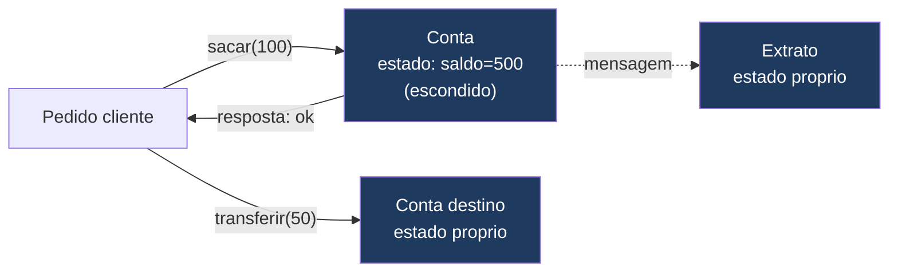
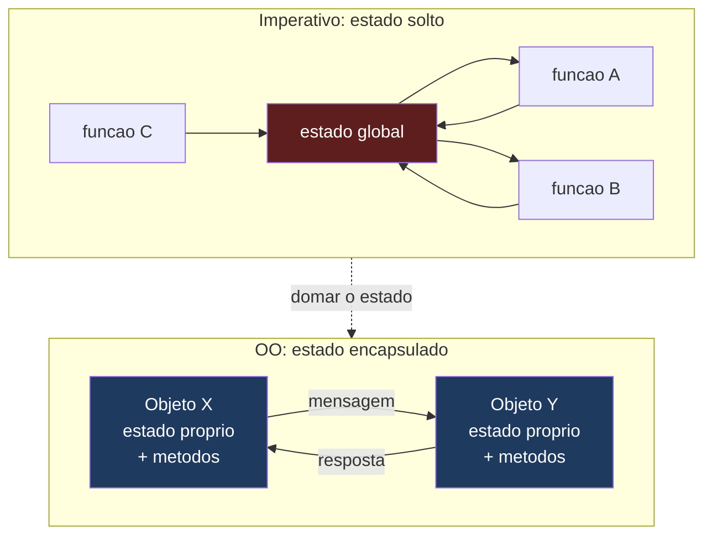
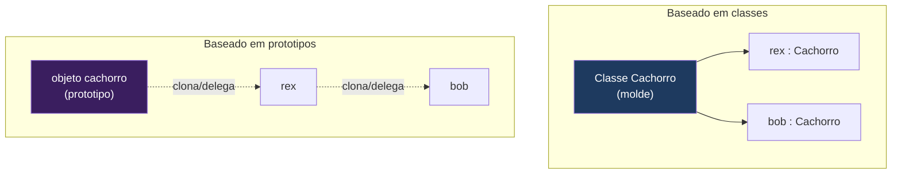
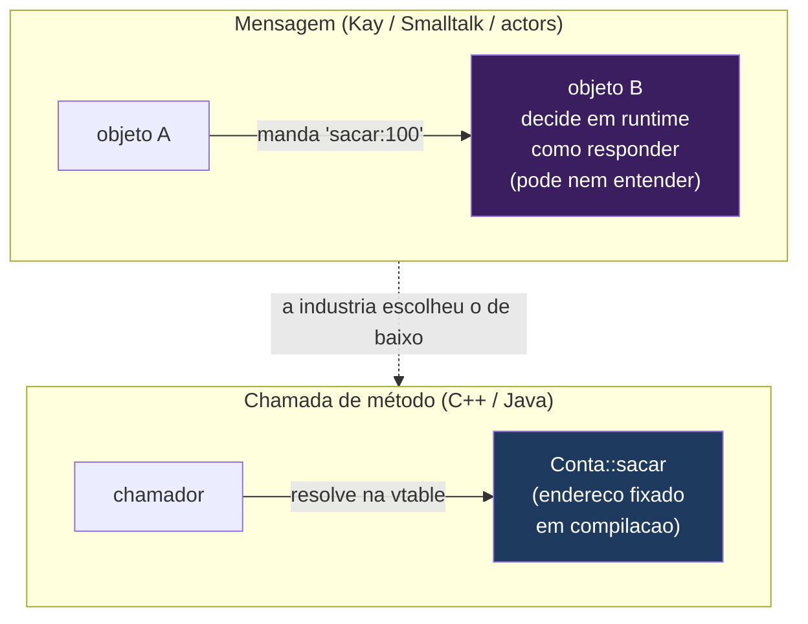
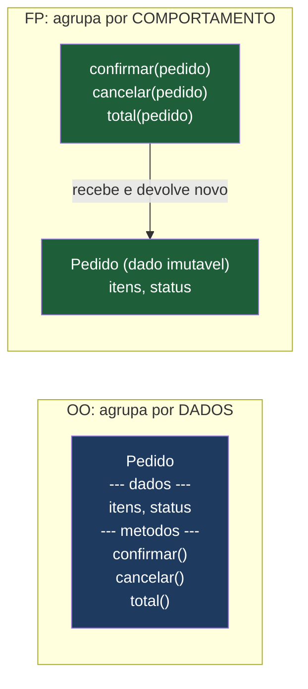
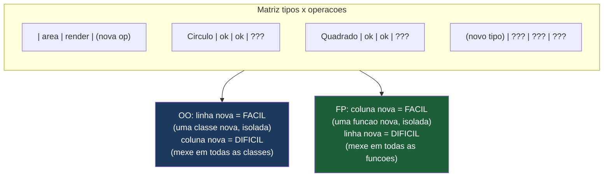

# O paradigma orientado a objetos

> [!abstract] Resumo em uma linha
> OO organiza o programa em objetos que combinam estado e comportamento e colaboram por troca de mensagens — uma forma de domar o estado mutável que o imperativo deixa solto.

Antes de mais nada, um aviso de fronteira. Existe um galho inteiro deste grimório dedicado a OO em profundidade: `[[Orientação a Objetos]]`. Lá moram os quatro pilares destrinchados, composição sobre herança, acoplamento e coesão, modelagem de domínio e a divergência entre linguagens. **Esta nota não reensina nada disso.** Aqui OO aparece como UM paradigma entre vários — sua ideia central, sua posição no mapa de paradigmas (`[[01 - O que é um paradigma de programação]]`), e como ele se compara ao imperativo e ao funcional. Toda vez que a vontade de aprofundar um pilar aparecer, eu linko o galho e sigo em frente.

## A ideia central: objetos que conversam

Imagine uma colônia de células. Nenhuma célula enxerga o interior da outra. Cada uma guarda o próprio estado, faz o próprio trabalho, e coordena com as vizinhas mandando recados — sinais químicos, mensagens. O organismo inteiro funciona não porque há um maestro lendo e escrevendo na memória de todas, mas porque as células confiam que cada uma cuida de si e responde a pedidos.

Essa é a metáfora fundadora da orientação a objetos. Um programa OO é uma população de **objetos**: cada objeto combina **estado** (os dados que ele guarda) com **comportamento** (o que ele sabe fazer), e os objetos colaboram **trocando mensagens** — pedindo coisas uns aos outros sem mexer nas tripas alheios.

O ângulo radical aqui não é "agrupar dados com funções". É a ideia de que o estado fica *escondido* atrás de uma porta, e a única forma de interagir com ele é bater nessa porta. Você não lê o saldo de uma conta enfiando a mão no campo `saldo`; você *pede* à conta que faça um saque, e ela decide se aceita.



Leitura do diagrama: o cliente nunca toca no `saldo` diretamente — ele manda a mensagem `sacar(100)` e recebe uma resposta. Cada objeto (Conta, Extrato, Conta destino) carrega seu próprio estado, blindado. A colaboração acontece pelas setas, não pela memória compartilhada.

### O que Alan Kay realmente quis dizer

Alan Kay cunhou o termo "object-oriented programming" no fim dos anos 1960, inspirado por biologia e por sistemas distribuídos. Décadas depois, num email de 2003, ele resumiu sua visão de forma cirúrgica:

> [!quote] Alan Kay (2003)
> "OOP to me means only messaging, local retention and protection and hiding of state-process, and extreme late-binding of all things. It can be done in Smalltalk and in LISP."

Repare no que NÃO está nessa frase: **herança não aparece**. Para Kay, a essência de OO eram três coisas — **mensagens** (objetos conversam por mensagens), **retenção/proteção/ocultação local do estado-processo** (cada objeto guarda e blinda o seu estado) e **late binding extremo** (qual código roda em resposta a uma mensagem se decide o mais tarde possível, em tempo de execução).

> [!warning] O termo "OO" se desviou da intenção original
> A indústria popularizou OO via classes e herança (Java, C++). Kay olhou para isso e disse que "object" talvez tenha sido um nome ruim, porque desviou a atenção da ideia que importava: **messaging**. A OO de classes que você usa no dia a dia é uma tradição; a OO de mensagens de Kay é outra. Vale saber que existem as duas.

## OO é o imperativo domado

Para entender OO como paradigma, o atalho mais honesto é compará-lo com seu antecessor direto: o imperativo (`[[02 - O paradigma imperativo]]`).

No imperativo cru, o estado mutável anda solto. Você tem variáveis, talvez globais, e qualquer parte do código pode lê-las e escrevê-las. Funciona em programas pequenos, mas em programas grandes vira um problema: quando algo dá errado, *quem* mudou aquele valor? Pode ter sido qualquer um. O estado compartilhado é o calcanhar de Aquiles do imperativo.

OO é, em grande medida, uma **resposta a esse problema**. A jogada é: pegue o estado mutável e tranque-o dentro de um objeto, atrás de uma interface. Em vez de estado global que todos mexem, estado *local* que só o dono mexe, e o resto do mundo só consegue interagir mandando mensagens. O estado continua mutável — OO não abole mutação, isso é assunto do funcional — mas a mutação fica *contida* e *rastreável*.



Leitura do diagrama: à esquerda, várias funções escrevem e leem o mesmo estado global (vermelho) — ninguém sabe quem mudou o quê. À direita, cada objeto guarda o próprio estado (azul) e só interage via mensagem. A seta tracejada é a tese: OO domar o estado solto do imperativo.

> [!tip] Por isso OO herda do imperativo
> Por baixo, os métodos de um objeto são quase sempre código imperativo: atribuições, loops, condicionais. OO não substitui o imperativo — ele o *organiza*, definindo fronteiras dentro das quais a mutação é permitida. É imperativo com cercas.

## Os quatro pilares, em uma frase cada

Aqui eu seguro a mão de propósito. Os pilares têm tratamento completo no galho `[[Orientação a Objetos]]`. Para *situar* OO como paradigma, basta saber o que cada um significa em uma frase:

- **Encapsulamento** — esconder o estado e o "como" atrás de uma interface, expondo só o "o quê".
- **Abstração** — modelar uma entidade pelos traços que importam para o problema, ignorando o resto.
- **Herança** — um tipo derivar de outro, reaproveitando e especializando comportamento.
- **Polimorfismo** — uma mesma mensagem produzir respostas diferentes conforme o objeto que a recebe.

E paro por aqui. Quando precisar de profundidade — quando usar herança ou composição, o que é coesão, como modelar um domínio —, o destino é `[[Orientação a Objetos]]`, não esta nota.

> [!note] Pilares não são consenso universal
> Como vimos, Kay nem citaria herança como pilar. A lista dos "quatro pilares" é uma convenção da tradição de classes, útil para ensinar, mas não uma lei da natureza. Tenha isso no bolso para uma entrevista.

## Duas tradições de OO

Nem toda OO é igual. Há dois eixos de divergência que vale pincelar.

**Baseado em classes × baseado em protótipos.** Na OO baseada em **classes** (Java, C++, C#), a classe é uma planta baixa: você define o molde uma vez e cria objetos como instâncias dele. Na OO baseada em **protótipos** (JavaScript, Self), não há molde separado — você cria um objeto e produz outros *clonando* esse objeto-protótipo, e a "herança" é uma cadeia de objetos que delegam uns aos outros. Self foi a linguagem que cunhou o estilo; JavaScript é o exemplo que dominou o mundo.



Leitura do diagrama: à esquerda, uma classe-molde gera instâncias. À direita, não há molde — objetos nascem de outros objetos por clonagem/delegação, formando uma cadeia. Mesma intenção (reúso de comportamento), mecanismos diferentes.

**Mensagens à la Smalltalk × chamada de método estática.** Em Smalltalk, mandar uma mensagem para um objeto é um ato dinâmico: o objeto recebe a mensagem e decide em tempo de execução como responder (o late binding extremo de Kay). Em linguagens como C++ ou Java, a "chamada de método" é, em muitos casos, mais estática — resolvida em compilação, ou via tabela de despacho — e o vocabulário "chamar método" reflete uma mentalidade diferente de "enviar mensagem". A distinção é sutil mas conceitual: *método* sugere uma função que você invoca; *mensagem* sugere um pedido que o destinatário interpreta. A próxima seção destrincha exatamente essa fenda.

## Mensagens × chamada de método: o cisma fundador

Essa distinção merece uma seção própria, porque ela explica por que dois programadores podem usar a palavra "OO" e estar falando de coisas diferentes.

Quando Kay falava em *messaging*, ele tinha em mente algo radical: o objeto que envia não sabe (e não precisa saber) quem vai responder nem como. Ele só lança um pedido — um nome de mensagem e alguns argumentos — e quem recebe decide, em tempo de execução, o que fazer com aquilo. O remetente e o destinatário são autônomos, fracamente acoplados, possivelmente em máquinas diferentes. É um modelo inspirado em **redes** e em **biologia**: células não invocam funções umas das outras, elas emitem sinais.

A indústria implementou outra coisa. Na maioria das linguagens de classes mainstream, `conta.sacar(100)` é uma **chamada de método**: o compilador (ou o runtime) procura, na tabela de métodos do tipo `Conta` (a *vtable*, em C++), o endereço da função `sacar` e salta para lá. É dynamic dispatch de verdade — o método que roda depende do tipo real do objeto, não do tipo declarado —, mas o conjunto de respostas possíveis é fechado em compilação. Você não "manda uma mensagem que o objeto interpreta"; você "invoca uma função que pertence ao objeto". A diferença de mentalidade fica no nome: *método* é uma função sua; *mensagem* é um pedido a um estranho.



Leitura do diagrama: em cima, o modelo de mensagem — A lança um pedido e B, autônomo, decide o que fazer (e pode até não entender a mensagem, devolvendo um erro em runtime). Embaixo, a chamada de método — o conjunto de respostas é resolvido pela vtable, fixado em compilação. A seta tracejada registra a tese: o que a indústria chamou de OO foi majoritariamente o modelo de baixo.

> [!quote] Alan Kay (OOPSLA 1997)
> "Actually I made up the term 'object-oriented', and I can tell you I did not have C++ in mind."

> [!warning] Por que esse cisma importa na prática
> O modelo de **mensagens** sobreviveu e prosperou onde menos se espera: em **sistemas de atores** (Erlang/Elixir, Akka). Um ator é literalmente um objeto kayano — estado privado, sem memória compartilhada, comunicação só por mensagens assíncronas. Não é coincidência que Joe Armstrong, criador de Erlang, tenha dito que Erlang talvez seja "a única linguagem OO de verdade", justamente por levar o messaging a sério. Quando você ouvir "OO não escala em concorrência", lembre que isso vale para a OO de *chamada de método sobre estado mutável compartilhado* — a OO de *mensagens* foi feita exatamente para esse cenário.

## OO × funcional: o grande debate de organização

Esta é a comparação mais frutífera — e a que mais cai em conversa de entrevista madura. OO e funcional (`[[05 - O paradigma funcional]]`) são duas respostas opostas à mesma pergunta: **como organizar um programa?**

- **OO agrupa por dados.** Você coloca, junto, os dados e as operações que agem sobre eles. Um objeto "sabe fazer". O `Pedido` carrega seu estado e os métodos `confirmar()`, `cancelar()`, `total()`.
- **Funcional agrupa por comportamento.** Você separa os dados (estruturas imutáveis, burras) das funções que os transformam. Há funções `confirmar`, `cancelar`, `total` que recebem um pedido e devolvem um novo pedido.



Leitura do diagrama: à esquerda, OO encapsula dados E comportamento na mesma caixa (o Pedido sabe se confirmar). À direita, FP mantém o dado de um lado e as funções de outro; as funções recebem o dado e devolvem um novo, sem mutar. Duas formas de fatiar o mesmo problema.

## O problema da expressão (exemplo trabalhado)

Esse contraste tem um nome técnico, cunhado por Philip Wadler num email de 1998: o **problema da expressão** (*expression problem*). A pergunta é simples e cruel: você consegue, sem mexer no código já escrito (e sem perder segurança de tipos), adicionar tanto novos *tipos* quanto novas *operações*? A resposta de OO e funcional é "metade sim, metade não" — e em metades opostas.

Vamos trabalhar um exemplo. Imagine que você modela formas geométricas e precisa de duas operações: calcular `area()` e desenhar `render()`. Comece com dois tipos, `Circulo` e `Quadrado`.

Em **OO**, cada tipo é uma classe que implementa as operações:

```
class Circulo implements Forma {
    double area()  { ... }
    void   render(){ ... }
}
class Quadrado implements Forma {
    double area()  { ... }
    void   render(){ ... }
}
```

Agora chega o pedido: **adicionar um novo tipo**, `Triangulo`. Em OO isso é *trivial e isolado* — você escreve uma classe nova, implementa `area()` e `render()` ali dentro, e nenhum código existente é tocado. O eixo "novos tipos" é o eixo fácil de OO.

Mas chega outro pedido: **adicionar uma nova operação**, `perimetro()`. Agora a dor aparece. Você tem que abrir `Circulo`, `Quadrado`, `Triangulo` — *todas* as classes — e adicionar o método em cada uma. O eixo "novas operações" é o eixo difícil de OO.

No **funcional** o mapa é o espelho exato. Os dados são burros (um tipo soma `Forma = Circulo | Quadrado`) e as operações são funções que fazem *pattern matching* sobre os casos:

```
double area(Forma f)  = match f { Circulo c -> ...; Quadrado q -> ... }
void   render(Forma f)= match f { Circulo c -> ...; Quadrado q -> ... }
```

Adicionar `perimetro()` é *trivial e isolado*: escreve-se uma função nova com seu próprio match, e nada antigo é tocado — o eixo das operações é o eixo fácil. Mas adicionar `Triangulo` exige abrir `area`, `render`, `perimetro` e *todas* as funções para inserir o caso novo no match — o eixo dos tipos é o difícil.



Leitura do diagrama: pense numa tabela onde as **linhas são tipos** e as **colunas são operações**. Adicionar uma *linha* (novo tipo) é fácil em OO e difícil em FP; adicionar uma *coluna* (nova operação) é fácil em FP e difícil em OO. Cada paradigma deixa um eixo barato e o outro caro — e eles escolhem eixos opostos. Não há almoço grátis: o problema da expressão é precisamente o nome dessa impossibilidade de ter os dois eixos baratos sem maquinário extra (typeclasses, visitor pattern, multimethods).

A lição estratégica: escolha o paradigma pelo eixo que *vai* variar. Se o conjunto de tipos é estável mas você vive adicionando operações (um interpretador, um compilador que ganha passes novos), funcional e `[[10 - Tipos algébricos, pattern matching e erros sem exceção]]` encaixam. Se as operações são estáveis mas tipos novos chegam o tempo todo (plugins, drivers, formas de pagamento), OO encaixa. O `[[05 - O paradigma funcional]]` explora o outro lado dessa moeda em profundidade.

> [!info] Sem dogma
> Não existe vencedor universal. A maioria das linguagens hoje deixa você misturar os dois (`[[14 - Linguagens multi-paradigma]]`): objetos para modelar entidades com identidade, funções puras para a lógica de transformação. Saber *quando* cada fatiamento ajuda vale mais do que torcer por um time.

## A crítica ao paradigma (não "use OO direito")

Aqui é preciso ter cuidado com uma fronteira fina. Existe a crítica do tipo "você está usando OO errado" — herança onde cabia composição, objetos anêmicos, encapsulamento furado. Essa crítica mora no galho `[[Orientação a Objetos]]` e em `[[SOLID]]`; ela não questiona o paradigma, ela pede que você o pratique melhor. O que interessa nesta nota é a outra crítica, mais funda: a que diz que o paradigma *em si*, mesmo bem feito, traz problemas embutidos. Apresento três vozes, sem virar panfleto — cada uma aponta para um descendente desta trilha.

**Joe Armstrong e o acoplamento implícito.** O criador de Erlang resumiu o desconforto numa imagem que ficou famosa:

> [!quote] Joe Armstrong (Coders at Work, 2009)
> "You wanted a banana but what you got was a gorilla holding the banana and the entire jungle."

A queixa é sobre reúso. Quando você pega um objeto para reusar, vem junto todo o ambiente implícito dele — sua hierarquia de classes pai, suas dependências, seu estado. Você queria a banana (um método) mas levou o gorila (o objeto inteiro) segurando a floresta (todo o grafo de objetos acoplados). O contraste, para Armstrong, é com funções: uma função pura é só a banana — você a pega e ela funciona em qualquer lugar.

**Rich Hickey e a conflação de identidade, estado, valor e tempo.** O criador de Clojure, na palestra *Are We There Yet?* (2009), faz uma crítica mais filosófica. A OO mainstream, diz ele, **funde** quatro coisas que deveriam ser separadas: a *identidade* (a coisa que persiste no tempo), o *estado* (o valor dessa coisa num instante), o *valor* (um dado imutável) e o *tempo*. Um objeto mutável é, ao mesmo tempo, "a conta" (identidade) e "o saldo agora" (estado) — e como tudo é "agora", não há noção real de tempo. Isso, argumenta Hickey, é exatamente o que explode em concorrência: dois threads disputam o "agora" do mesmo objeto. A separação que ele propõe (identidade como uma sequência de valores imutáveis ao longo do tempo) é o coração de `[[08 - Imutabilidade e estado]]`.

**Data-oriented design e o custo de cache.** A crítica de games e sistemas de alta performance é a mais concreta de todas, e não é filosófica: é sobre o **hardware**. OO te empurra para o layout *array of structs* (AoS) — um array de objetos `Particula`, cada um carregando `posicao`, `velocidade`, `cor`, `vida` juntos. Mas se você só precisa atualizar a posição de um milhão de partículas, o processador puxa para o cache linhas de 64 bytes cheias de `cor` e `vida` que você nem vai usar — desperdício de cache, perda de throughput. A alternativa data-oriented é o *struct of arrays* (SoA): um array só de posições, outro só de velocidades, contíguos na memória. Trocar AoS por SoA, sem mudar mais nada, rende ganhos de performance de dezenas por cento em workloads reais. A tese (Mike Acton, *Data-Oriented Design and C++*) é que OO otimiza para a conveniência do programador modelar "uma coisa", enquanto o hardware quer que você modele "muitas coisas do mesmo tipo, juntas". O layout de memória e a localidade de cache por trás disso são tratados em [[03-Dominios/Fundamentos/Estruturas de Dados/index|Estruturas de Dados]].

> [!note] Apresentando com maturidade
> Nenhuma dessas vozes diz "OO é ruim, abandone". Armstrong defende isolamento de estado (que a OO de mensagens *também* prega); Hickey separa identidade de valor (que DDD *também* faz, com value objects); o data-oriented design é sobre um nicho de performance, não sobre CRUD de negócio. A leitura madura é: cada crítica mira uma *promessa específica* de OO que vaza num *contexto específico*. Saber qual crítica se aplica a qual contexto é o que separa um sênior de um torcedor de paradigma.

## Onde OO brilha como paradigma

Apesar das críticas, OO continua dominante — e não por inércia. Ele encaixa como luva onde o domínio tem **entidades de identidade e estado**.

Uma conta bancária *é* uma coisa que persiste, muda de saldo e continua sendo a mesma conta — dois objetos com o mesmo saldo ainda são contas diferentes. Essa noção de "uma coisa que tem continuidade e história" é justamente o que OO modela bem, e é a espinha do **Domain-Driven Design**: entidades, agregados, raízes de agregado são objetos com identidade. Quando o problema é "modelar um pedaço do mundo onde as coisas têm nome próprio e mudam ao longo do tempo", OO oferece o vocabulário mais natural que existe.

Outros redutos onde OO é a escolha óbvia:

- **GUIs.** Cada botão, janela, campo é um objeto com estado próprio (visível? habilitado? texto?) que responde a eventos. A própria metáfora de widgets que recebem cliques é messaging puro.
- **Simulações e jogos (a camada de entidades).** Um inimigo, um NPC, um veículo são entidades com estado e comportamento — ironicamente, o mesmo domínio onde o data-oriented design critica o *layout* usa OO no *modelo conceitual*. As duas coisas convivem.
- **Sistemas de plugins e extensão por tipo.** Lembre do problema da expressão: quando o eixo que varia é "tipos novos chegam o tempo todo" (formas de pagamento, drivers, formatos de arquivo), OO torna a extensão trivial e isolada.

A razão profunda da dominância: a maioria do software de negócio *é* CRUD sobre entidades com identidade, escrito por times grandes que precisam de fronteiras claras. OO dá fronteiras (encapsulamento) e um vocabulário que mapeia direto no domínio. As críticas são reais, mas miram contextos (concorrência massiva, performance de loop apertado, reúso fino) que não são o dia a dia da maioria dos sistemas.

> [!warning] A armadilha do "OO ruim"
> Não confunda a crítica madura *ao paradigma* com a crítica *à prática*. Muito do que chamam de "problema de OO" é, na verdade, OO mal feito: herança usada onde caberia composição, encapsulamento furado por getters/setters, objetos anêmicos que só carregam dados sem comportamento. Esse remédio mora no galho `[[Orientação a Objetos]]` e em `[[SOLID]]` — e não tem nada a ver com Armstrong, Hickey ou cache lines.

## Em entrevista

Object-oriented programming organizes a program as a population of objects that bundle state and behavior and collaborate by sending messages. Its core promise is taming mutable state: instead of state floating free as in imperative code, each object keeps its own state hidden behind an interface. Alan Kay, who coined the term, stressed that OOP "to me means only messaging, local retention and protection and hiding of state-process, and extreme late-binding" — notice inheritance is not in that list. It's worth distinguishing what Kay meant by *messaging* — an autonomous object deciding at runtime how to respond to a request, the model that survives in actor systems like Erlang — from what mainstream class-based languages built, which is closer to a *method call* dispatched through a vtable. The deepest comparison is with functional programming: OO groups code by data (objects that know how to act), while FP groups by behavior (functions over immutable data), and the expression problem (Wadler) shows the trade-off precisely — OO makes adding new *types* easy and new *operations* hard, FP is the mirror image. OO shines for domains with state and identity; it falls under criticism when mutable state leaks and inheritance hierarchies grow deep. The mature critique of the paradigm itself isn't "use OO better" — it's Armstrong on implicit coupling (the gorilla holding the banana and the jungle), Hickey on conflating identity, state, value and time, and data-oriented design on cache cost (AoS versus SoA); each targets a specific OO promise that leaks in a specific context, not OO wholesale. Two traditions worth naming: class-based (Java, C++) versus prototype-based (JavaScript, Self). In practice, modern code mixes paradigms rather than picking one.

### Vocabulário

- orientação a objetos → object-oriented programming (OOP)
- objeto → object
- estado e comportamento → state and behavior
- troca de mensagens → message passing
- despacho dinâmico → dynamic dispatch
- chamada de método → method call
- encapsulamento → encapsulation
- abstração → abstraction
- herança → inheritance
- polimorfismo → polymorphism
- baseado em classes → class-based
- baseado em protótipos → prototype-based
- late binding (ligação tardia) → late binding
- problema da expressão → expression problem
- design orientado a dados → data-oriented design
- estado mutável → mutable state
- identidade → identity

> [!info] Lastro
> - Alan Kay, definição de OOP em email de 2003 ("OOP to me means only messaging…"), arquivada e discutida em [userpage.fu-berlin.de — Dr. Alan Kay on the meaning of OOP](https://userpage.fu-berlin.de/~ram/pub/pub_jf47ht81Ht/doc_kay_oop_de) e [Hillel Wayne — Alan Kay Did Not Invent Objects](https://www.hillelwayne.com/post/alan-kay/).
> - [Wikipedia — Prototype-based programming](https://en.wikipedia.org/wiki/Prototype-based_programming) e [Wikipedia — Smalltalk](https://en.wikipedia.org/wiki/Smalltalk) para a distinção classes × protótipos e a origem do modelo de classes em Smalltalk-76.
> - Alan Kay, "I made up the term 'object-oriented', and I can tell you I did not have C++ in mind", do OOPSLA 1997 Keynote *The computer revolution hasn't happened yet* (citado também em *Coders at Work*, Seibel, 2009).
> - Philip Wadler, *The Expression Problem* (email de 1998), [texto arquivado](https://homepages.inf.ed.ac.uk/wadler/papers/expression/expression.txt); panorama didático em [Eli Bendersky — The Expression Problem and its solutions](https://eli.thegreenplace.net/2016/the-expression-problem-and-its-solutions/).
> - Joe Armstrong, "You wanted a banana but what you got was a gorilla holding the banana and the entire jungle", em *Coders at Work* (Seibel, 2009), discutido em [John D. Cook — You wanted a banana but you got a gorilla holding the banana](https://www.johndcook.com/blog/2011/07/19/you-wanted-banana/).
> - Rich Hickey, *Are We There Yet?* (JVM Languages Summit, 2009), [InfoQ](https://www.infoq.com/presentations/Are-We-There-Yet-Rich-Hickey/), sobre a conflação de identidade, estado, valor e tempo em OO.
> - Mike Acton, *Data-Oriented Design and C++* (CppCon 2014) e [Wikipedia — AoS and SoA](https://en.wikipedia.org/wiki/AoS_and_SoA) para o trade-off de layout de memória.

## Veja também

- `[[Orientação a Objetos]]` — **o galho completo**: os quatro pilares em profundidade, composição sobre herança, acoplamento e coesão, modelagem e divergência cross-language. Comece aqui para aprofundar qualquer pilar.
- `[[SOLID]]` — os princípios que mantêm OO saudável e evitam o "OO ruim".
- `[[02 - O paradigma imperativo]]` — o paradigma que OO domestica.
- `[[05 - O paradigma funcional]]` — a contraparte que agrupa por comportamento.
- `[[08 - Imutabilidade e estado]]` — o antídoto para o estado mutável que vaza.
- `[[14 - Linguagens multi-paradigma]]` — onde OO e funcional convivem.
- `[[16 - Paradigmas na prática e em entrevista]]` — como articular tudo isso sob pressão.
- `[[01 - O que é um paradigma de programação]]` — o mapa que situa OO entre os demais.
- `[[03-Dominios/Fundamentos/Paradigmas/index|Paradigmas de Programação]]` — índice do galho.
