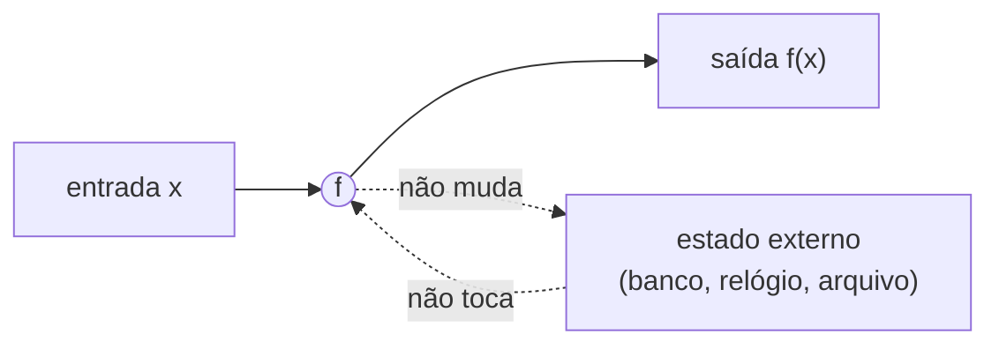
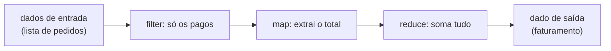
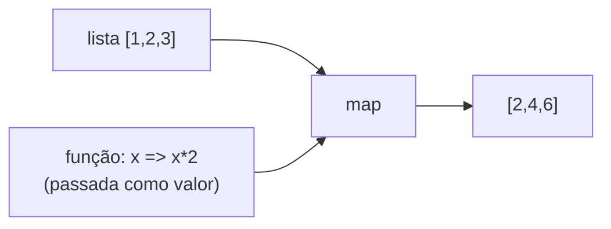
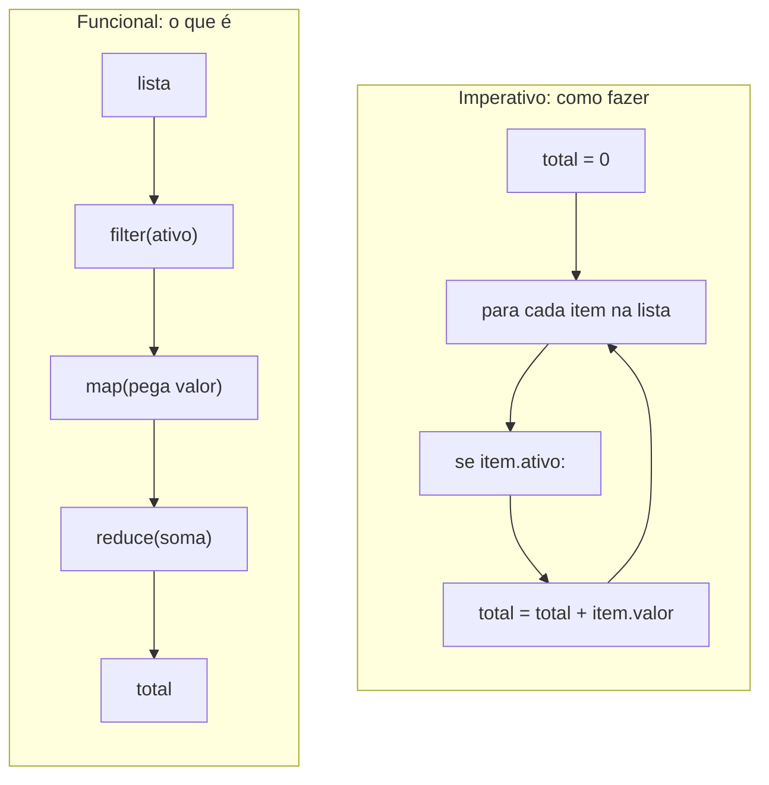
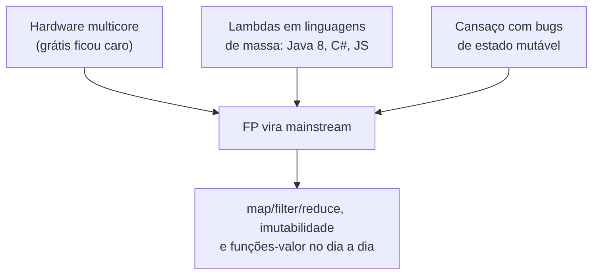
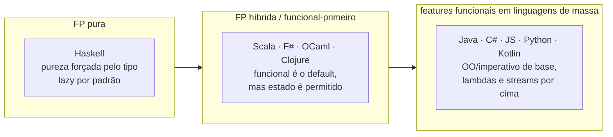
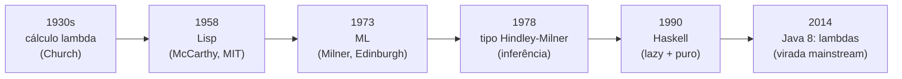

# O paradigma funcional

> [!abstract] Resumo em uma linha
> Programar funcional é descrever um programa como a avaliação de funções no sentido matemático — entrada vira saída, sem estado escondido — em vez de uma sequência de comandos que mudam o mundo.

Imagine uma máquina de fazer suco. Você coloca uma laranja, gira a manivela, sai suco de laranja. Coloca a mesma laranja de novo, gira de novo, sai exatamente o mesmo suco. A máquina não tem memória, não guarda rancor, não depende de que horas são. É previsível ao ponto do tédio. E esse tédio é exatamente o que você quer numa peça de software que precisa funcionar.

O paradigma funcional pega essa ideia e a coloca no centro de tudo. Um programa funcional é uma teia de funções — máquinas de suco — encaixadas umas nas outras. O paradigma imperativo (`[[02 - O paradigma imperativo]]`), por contraste, é uma lista de ordens dadas a uma máquina com memória: "guarde isso aqui, depois mude aquilo ali, agora some". São duas visões de mundo diferentes sobre o que *é* computar.

## A ideia central: avaliar, não comandar

No imperativo, você comanda. `total = total + item`. Você diz à máquina o que fazer com a memória dela, passo a passo, e o resultado emerge da sequência de mutações. O programa é uma receita de mudanças de estado.

No funcional, você avalia. Você define `total` como o *resultado* de aplicar uma função à lista de itens — e pronto. Não há "depois". Não há um momento em que `total` valia uma coisa e passou a valer outra. Há só uma definição: `total` é isto.

> [!info] Raiz teórica: o cálculo lambda
> O paradigma funcional descende diretamente do **cálculo lambda**, criado por **Alonzo Church** nos anos 1930 (junto a Stephen Kleene) numa tentativa de formalizar a noção de computabilidade — a mesma busca que produziu a máquina de Turing. O cálculo lambda tem só três construtos: **variáveis**, **abstração** (definir uma função) e **aplicação** (chamar uma função com um argumento). Note o que *não* há na lista: atribuição, loop, estado. Computação ali é puramente a aplicação de funções. Quando você escreve `lambda` em Python, `->` em Java ou `=>` em JavaScript, está usando notação que carrega o nome do λ de Church.

Esse parentesco importa porque explica a "personalidade" do paradigma. Linguagens funcionais não evitam estado mutável por moda — elas o evitam porque nasceram de um modelo onde estado mutável simplesmente não existe. Tudo o que vem depois (pureza, imutabilidade, composição) é consequência de levar a sério a pergunta: *e se computar fosse só avaliar funções?*

Vamos deixar a função pura concreta com um diagrama. A "máquina de suco" formalizada:



Leitura do diagrama: a função `f` recebe `x` e devolve `f(x)`. As linhas pontilhadas para o estado externo estão *cortadas*: a função não lê o relógio nem escreve no banco. Toda a informação que ela usa entra pela seta da esquerda; tudo o que ela produz sai pela seta da direita. Mesma entrada, mesma saída, sempre. Esse é o ideal — e a nota `[[07 - Funções puras e efeitos colaterais]]` mostra o que acontece quando a realidade (bancos, redes, relógios) exige furar essa parede.

## A mentalidade de transformação de dados

Se você sai daqui com uma só ideia, que seja esta: **pense no programa como um pipeline de transformações sobre dados**, não como uma sequência de mudanças de estado. É a virada mental central do paradigma — e a mais difícil, porque exige desaprender o reflexo imperativo de "pegue uma caixa de memória, mude o conteúdo dela, repita".

No modelo imperativo, o dado fica parado e o programa o *modifica*: a mesma variável `x` vale 3, depois 7, depois 12, e o estado de `x` carrega a história do que aconteceu. No modelo funcional, o dado *flui*: ele entra de um lado, atravessa uma série de funções e sai transformado do outro. Cada função recebe um valor e devolve um valor novo; ninguém "muda" nada. O programa é a tubulação; os dados são a água.



Leitura do diagrama: a entrada não é "mexida" em lugar nenhum. Cada estágio recebe o resultado do anterior e produz um valor novo, deixando o anterior intacto. Você lê o programa como uma frase — "dos pedidos, fique com os pagos, pegue o total de cada, some" — e não como uma lista de instruções para uma máquina. Essa leitura linear, da esquerda para a direita, é o motivo de o estilo funcional ser tão fácil de *acompanhar*: não há salto, não há variável que muda de valor escondida no meio do laço.

Essa mentalidade é o que torna o funcional uma família do paradigma **declarativo** (`[[04 - O paradigma declarativo]]`): você descreve *qual* transformação quer, não *como* a máquina deve executá-la passo a passo. E é também o que conecta diretamente com `[[06 - Composição e recursão]]` — encadear transformações é, no fundo, *compor* funções: a saída de uma vira a entrada da seguinte.

Por que a virada vale a pena? Porque pipeline é *modular* de um jeito que o laço não é. Quer adicionar um passo — "também aplique desconto antes de somar"? Você encaixa mais uma função no meio da tubulação, sem tocar nas outras. Quer testar um estágio isolado? Ele é uma função pura; você o roda sozinho. No laço imperativo, esses três passos vivem grudados dentro do mesmo `for`, compartilhando o acumulador — mexer num arrisca quebrar os outros. A mentalidade de transformação não é só mais elegante; ela *fatia* o problema em pedaços que você pode mover, testar e raciocinar separadamente.

## Raciocínio equacional: código como álgebra

Há uma recompensa surpreendente em escrever funções puras: você passa a raciocinar sobre o código do mesmo jeito que raciocina sobre equações na matemática. Chama-se **raciocínio equacional** (*equational reasoning*).

A ideia é simples. Se uma função é pura — mesma entrada, sempre mesma saída, sem efeito escondido —, então o nome de uma chamada e o seu resultado são *intercambiáveis*. Onde quer que apareça `dobro(21)`, você pode riscar e escrever `42` no lugar, sem mudar o comportamento do programa. E vice-versa. É a velha regra da álgebra: **substituir iguais por iguais**.

```javascript
const dobro = (x) => x * 2;
const r = dobro(21) + dobro(21);
// raciocínio equacional: dobro(21) é SEMPRE 42, então...
// r === 42 + 42 === 84  — posso provar isso "no papel", sem rodar
```

Essa propriedade tem nome técnico — **transparência referencial** — e é a nota `[[07 - Funções puras e efeitos colaterais]]` que a destrincha. O que importa aqui é o ganho prático: num programa puro, você entende um trecho olhando *só para ele*, porque o resultado não depende de quando rodou, de quantas vezes rodou, nem do que o resto do sistema estava fazendo. Compare com o imperativo, onde `conta.saldo` pode valer qualquer coisa dependendo de quem mexeu nela antes — para entender uma linha, você precisa reconstruir toda a história de mutações que veio antes dela. O raciocínio equacional troca essa "investigação policial" por uma "prova de álgebra".

É isso também que dá segurança para o compilador (e para você) fazer otimizações ousadas: se `dobro(21)` é sempre `42`, o compilador pode calcular o valor uma vez e reusar (*caching*), ou rodar duas chamadas independentes em paralelo, ou até apagar uma chamada cujo resultado ninguém usa — tudo isso *sem risco de mudar o comportamento*, porque não há efeito escondido para se perder no caminho. Num mundo de funções puras, "refatorar" deixa de ser uma aposta e vira uma manipulação algébrica que você pode justificar passo a passo.

## Funções como cidadãs de primeira classe

Aqui está o que destrava todo o resto. Numa linguagem funcional, **uma função é um valor** — tão valor quanto o número `42` ou a string `"olá"`. Isso significa que você pode:

- **atribuir** uma função a uma variável;
- **passá-la** como argumento para outra função;
- **retorná-la** de uma função.

Isso é o que se chama de **funções de primeira classe** (*first-class functions*): a linguagem não impõe restrições especiais ao uso de funções; elas circulam pelo programa como qualquer outro dado.

> [!tip] Por que isso é tão poderoso?
> Porque comportamento vira *dado*. Se uma função é um valor, você pode guardar comportamento numa lista, escolher qual comportamento usar em tempo de execução, montar comportamento novo combinando outros. O código deixa de ser só "dados sendo processados" e passa a ser "dados *e* processamento, ambos manipuláveis pelas mesmas ferramentas". Numa linguagem onde funções *não* são de primeira classe, você precisa de truques (objetos, ponteiros de função, padrões de projeto) para fingir isso.

```javascript
// JS: uma função é só um valor que mora numa variável
const dobro = (x) => x * 2;

const aplicar = (fn, valor) => fn(valor); // recebe uma função como argumento
aplicar(dobro, 21); // => 42

const fazSomador = (n) => (x) => x + n;   // retorna uma função
const somaDez = fazSomador(10);
somaDez(5); // => 15
```

### Funções de primeira classe matam a cerimônia

Aqui está o ângulo que conecta diretamente com a orientação a objetos (`[[03 - O paradigma orientado a objetos]]`). Boa parte dos *design patterns* clássicos da escola OO existe por um motivo só: em linguagens onde função *não* é valor, você precisa de um objeto para carregar comportamento de um lado para o outro. Quando a função vira cidadã de primeira classe, essa cerimônia toda evapora.

- **Strategy** (escolher um algoritmo em tempo de execução) vira uma função passada como argumento. Onde a versão OO precisa de uma interface, três classes que a implementam e um campo para guardar a estratégia escolhida, a versão funcional passa `compare` como parâmetro e acabou.
- **Command** (encapsular uma ação para executar depois) vira uma função guardada numa variável ou numa lista. A ação *é* o valor; não precisa de uma classe `Comando` com um método `executar()`.
- **Observer** (notificar interessados quando algo muda) vira uma lista de *callbacks* — funções que você invoca quando o evento acontece. Sem interface `Observador`, sem `registrar()`/`notificar()` cerimoniais.

```java
// OO clássico: uma interface + uma classe por estratégia de ordenação
interface Comparador { int compara(Pedido a, Pedido b); }
class PorData implements Comparador { public int compara(...) { ... } }
class PorValor implements Comparador { public int compara(...) { ... } }
lista.ordena(new PorValor());
```

```javascript
// Funcional: a estratégia É uma função, passada como valor
pedidos.sort((a, b) => a.valor - b.valor);   // por valor
pedidos.sort((a, b) => a.data - b.data);      // por data
```

> [!tip] O "expression problem" por outro ângulo
> OO e FP discordam sobre o que é fácil de estender. OO agrupa o código por *tipo* (uma classe junta todos os comportamentos de uma coisa), então adicionar um *tipo* novo é barato e adicionar uma *operação* nova é caro (você toca toda classe). FP agrupa por *comportamento* (uma função trata todos os tipos de uma vez, via *pattern matching* — veja `[[10 - Tipos algébricos, pattern matching e erros sem exceção]]`), então adicionar uma *operação* nova é barato e adicionar um *tipo* novo é caro. Esse dilema — chamado *expression problem* — é o coração de "FP ou OO?": não há vencedor, há um *trade-off* sobre qual eixo de mudança você espera percorrer mais.

## Higher-order functions: funções que comem funções

Se funções são valores, então nada impede uma função de **receber outra função como argumento ou devolver uma função como resultado**. Essas são as **funções de ordem superior** (*higher-order functions*, HOF), e são o pão com manteiga do dia a dia funcional.



Leitura do diagrama: `map` é uma HOF. Ela recebe *dois* argumentos — a lista de dados e uma **função** (`x => x*2`). Em vez de saber *o que* fazer com cada elemento, `map` sabe só *como percorrer* a lista; o "o quê" você injeta como valor. A mesma `map` serve para dobrar, para somar, para formatar — você só troca a função que entra.

O trio clássico — `map`, `filter`, `reduce` — substitui a maioria dos loops imperativos:

- **`map`** — transforma cada elemento (n entram, n saem).
- **`filter`** — mantém só os elementos que passam num teste (n entram, ≤ n saem).
- **`reduce`** — colapsa a coleção inteira num único valor (n entram, 1 sai).

Compare a versão imperativa com a funcional:



Leitura do diagrama: à esquerda, o imperativo descreve o *mecanismo* — um acumulador, um laço, uma mutação a cada volta. Você lê de cima a baixo seguindo o fluxo de controle. À direita, o funcional descreve a *transformação* — selecione os ativos, extraia os valores, some tudo. Cada caixa é uma função; a saída de uma é a entrada da próxima. Não há acumulador exposto, não há mutação visível. Você lê a intenção, não a maquinaria.

```java
// Java (Streams): mesma transformação
int total = itens.stream()
    .filter(Item::ativo)
    .map(Item::valor)
    .reduce(0, Integer::sum);
```

```python
# Python: map/filter como expressão
ativos = filter(lambda i: i.ativo, itens)
total  = sum(map(lambda i: i.valor, ativos))
```

> [!note] Não é só açúcar sintático
> Trocar o loop por `map`/`filter`/`reduce` não é só "ficar bonito". O loop imperativo mistura três decisões num só lugar: *o que* transformar, *como* iterar e *onde* acumular. A versão funcional separa essas decisões — e separação é o que permite que o runtime decida iterar em paralelo sem você mexer no código (veja Streams paralelos em `[[03-Dominios/Java/Collections e Streams/index|Streams (Java)]]`).

## Os cinco pilares (e quem é dono de cada um)

Esta nota apresenta os pilares; cada um tem uma nota-dona que o aprofunda. Pense neles como cinco facetas da mesma pedra — "avaliar funções sem estado escondido".

| Pilar | Frase de uma linha | Nota-dona |
|---|---|---|
| **Composição e recursão** | Programas grandes são funções pequenas encaixadas; repetição se faz por recursão, não por loop com contador. | `[[06 - Composição e recursão]]` |
| **Pureza e efeitos** | Uma função pura não lê nem escreve o mundo externo; o efeito (I/O, banco) é empurrado para a borda. | `[[07 - Funções puras e efeitos colaterais]]` |
| **Imutabilidade** | Dados não mudam; "alterar" significa criar uma cópia nova com a mudança. | `[[08 - Imutabilidade e estado]]` |
| **Lazy, currying e aplicação parcial** | Só calcula quando precisa; funções de vários argumentos viram cadeias de funções de um argumento. | `[[09 - Avaliação preguiçosa, currying e aplicação parcial]]` |
| **Tipos algébricos e pattern matching** | Modela dados como "isto OU aquilo", trata casos por correspondência e expressa erro como valor, não como exceção. | `[[10 - Tipos algébricos, pattern matching e erros sem exceção]]` |

> [!warning] Não confunda "funcional" com "tem função"
> Toda linguagem tem funções. O que faz um *estilo* ser funcional é a combinação dos pilares acima: funções de primeira classe + pureza + imutabilidade + composição. Escrever um `for` que muda uma variável global dentro de uma função chamada `processar()` não é programação funcional — é imperativo com roupa nova.

## Por que o funcional virou mainstream

Por décadas o funcional foi tachado de "coisa de acadêmico" — Haskell, Lisp, ML, longe da indústria. Isso mudou. Três forças empurraram o paradigma para o centro:



Leitura do diagrama: três pressões independentes convergiram. **Multicore**: a CPU parou de ficar mais rápida e passou a ficar *mais paralela*; estado imutável e funções puras são seguros para rodar em várias threads ao mesmo tempo, sem corrida de dados — e o Java 8 introduziu lambdas justamente para destravar streams paralelos sobre hardware multicore. **Lambdas em todo lugar**: Java 8 (2014), C#, JavaScript moderno e Python trouxeram funções de primeira classe e `map`/`filter`/`reduce` para o programador comum. **Dor com mutação**: a maioria dos bugs difíceis nasce de estado compartilhado mudando em hora inesperada; eliminar a mutação elimina classes inteiras de bug.

> [!example] O modelo híbrido venceu
> A indústria não migrou para Haskell. O que aconteceu foi mais interessante: linguagens orientadas a objetos *absorveram* o funcional. Java hoje é OO com lambdas, streams e records imutáveis. C# tem LINQ. JavaScript respira HOF. Você raramente escreve "um programa funcional" — você escreve um programa que usa *estilo* funcional onde ele paga: transformações de coleção, pipelines de dados, concorrência. A nota `[[15 - Programação funcional na prática]]` mostra como isso se parece no código de produção.

## O espectro do funcional: não é tudo-ou-nada

"Programação funcional" não é um interruptor de liga/desliga. É um *gradiente* de adoção, e onde uma linguagem cai nesse gradiente muda completamente como você programa nela. Vale a pena ter o mapa na cabeça, porque "usar FP" significa coisas bem diferentes em Haskell e em Python.



Leitura do diagrama: a flecha vai do **mais puro** (esquerda) ao **mais misturado** (direita), e quanto mais à direita, menos a linguagem *te obriga* a ser funcional.

- **FP pura — Haskell.** A pureza não é uma recomendação, é uma *lei imposta pelo compilador*: uma função que faz I/O tem um tipo diferente (`IO a`), e o sistema de tipos não deixa você esconder um efeito colateral dentro de uma função "pura". Além disso, Haskell é *lazy* por padrão — nada é calculado antes de ser preciso (veja `[[09 - Avaliação preguiçosa, currying e aplicação parcial]]`). Aqui o funcional não é estilo, é a única opção.
- **FP híbrida / funcional-primeiro — Scala, F#, OCaml, Clojure.** O default é funcional (imutabilidade, funções como valor, *pattern matching* de primeira), mas a linguagem *permite* estado mutável e laços quando você precisa fugir da pureza. Você escolhe o nível de disciplina.
- **Features funcionais em linguagens de massa — Java, C#, JavaScript, Python, Kotlin.** A base é OO/imperativa; o funcional entra como *tempero*: lambdas, `map`/`filter`/`reduce`, coleções imutáveis. Você usa estilo funcional nos trechos onde ele paga e volta ao imperativo no resto.

> [!note] A consequência prática
> Por isso "sei programação funcional" é uma frase ambígua. Dominar `map`/`filter`/`reduce` em JavaScript te coloca na *ponta direita* do espectro — útil e suficiente para 90% do trabalho de mercado. Domar mônadas e o sistema de tipos de Haskell é a ponta esquerda — raro, profundo e quase nunca exigido fora de nichos. A maioria das linguagens modernas é multi-paradigma de propósito (`[[14 - Linguagens multi-paradigma]]`), e a habilidade que o mercado valoriza é saber *quanto* funcional aplicar em cada ponto, não militar por uma extremidade.

## Uma breve história: do λ de Church ao lambda de Java

O funcional não é uma moda recente — é uma das linhagens mais antigas da computação, que passou décadas no laboratório antes de invadir a indústria.



Leitura do diagrama: a esquerda é teoria pura; a direita é o programador comum. Os marcos:

- **Anos 1930 — cálculo lambda.** Alonzo Church formaliza computação como aplicação de funções (a raiz teórica já vista acima). Décadas antes de existir um computador para rodá-la.
- **1958 — Lisp.** John McCarthy cria a Lisp no MIT, motivado por inteligência artificial. É a **segunda linguagem de alto nível mais antiga ainda em uso** (só o Fortran, de 1957, é mais velho) e pioneira em ideias hoje banais: coleta de lixo automática, tipagem dinâmica, código como dado.
- **1973 — ML.** Robin Milner cria a ML em Edimburgo, dentro do projeto LCF (prova automatizada de teoremas). Trouxe a inferência de tipos para o centro da família funcional.
- **1978 — sistema de tipos Hindley-Milner.** Milner formaliza o algoritmo (sobre ideias de J. Roger Hindley) que infere tipos polimórficos *sem você anotá-los* — você escreve código sem dizer os tipos e o compilador descobre. É a base de Haskell, Scala, F# e da inferência que hoje aparece até em Java (`var`).
- **1990 — Haskell.** Um comitê acadêmico define a Haskell como linguagem-padrão de pesquisa em funcional *lazy* e *puro*, baseada em Hindley-Milner. Vira a referência de "funcional levado às últimas consequências".
- **2014 — Java 8.** Em 18 de março de 2014, lambdas e a Streams API chegam ao Java. É o marco simbólico da **virada mainstream**: a linguagem mais usada do mercado corporativo abraça funções de primeira classe, e o estilo funcional deixa de ser "coisa de acadêmico" para virar ferramenta de todo dia.

## FP × OO: duas formas de organizar

Não há guerra santa aqui, apesar do barulho na internet. São duas maneiras de cortar o mesmo bolo:

- **OO** (`[[03 - O paradigma orientado a objetos]]`) agrupa **dados + comportamento** numa mesma unidade (o objeto), que guarda estado e oferece métodos para mexer nele. A unidade de pensamento é a *coisa*.
- **FP** organiza **funções operando sobre dados imutáveis** que ficam separados das funções. A unidade de pensamento é a *transformação*.

> [!quote] Sem dogma
> A pergunta útil não é "FP ou OO?", mas "este problema é melhor pensado como *coisas com estado* ou como *transformações de dados*?". Uma UI com botões que reagem a cliques é naturalmente "coisas". Um relatório que agrega vendas de um arquivo CSV é naturalmente "transformação". A maioria das linguagens modernas é multi-paradigma de propósito — você mistura os dois no mesmo arquivo (`[[14 - Linguagens multi-paradigma]]`). Maturidade é saber escolher a faceta certa, não defender uma seita.

## Em entrevista

Use estas falas para soar fluente sem decorar jargão:

- "Functional programming treats computation as the evaluation of functions, avoiding mutable state and side effects."
- "First-class functions mean functions are values — I can pass them around, return them, and store them like any other data."
- "Higher-order functions like `map`, `filter`, and `reduce` let me describe *what* I want instead of writing the loop mechanics by hand."
- "Immutability and pure functions make concurrent code safe by default — there's no shared mutable state to cause data races."
- "I lean on functional style for data pipelines and parallelism, and on OO for stateful, object-shaped domains — most modern languages let me mix both."
- "It traces back to Church's lambda calculus, which is why the `lambda` keyword shows up across so many languages."
- "FP isn't all-or-nothing — it's a spectrum, from pure languages like Haskell, where the type system enforces purity, to mainstream languages where I just sprinkle in lambdas and streams."
- "The core mental shift is thinking of a program as a pipeline of data transformations rather than a sequence of state changes — input flows through functions and comes out transformed."
- "Because pure functions are referentially transparent, I can reason about code equationally — substituting a call with its result like in algebra — which makes a piece easy to understand in isolation."

### Vocabulário

- avaliação de funções → function evaluation
- funções de primeira classe → first-class functions
- função de ordem superior → higher-order function
- função pura → pure function
- efeito colateral → side effect
- imutabilidade → immutability
- estado compartilhado → shared (mutable) state
- corrida de dados → data race
- cálculo lambda → lambda calculus
- multi-paradigma → multi-paradigm
- raciocínio equacional → equational reasoning
- transparência referencial → referential transparency
- pipeline de transformação de dados → data transformation pipeline
- FP pura → pure FP
- FP híbrida / funcional-primeiro → hybrid / functional-first FP
- inferência de tipos → type inference

> [!info] Lastro
> - [First-class function — Wikipedia](https://en.wikipedia.org/wiki/First-class_function): distinção entre "first-class" (sem restrição de uso) e "higher-order" (operar sobre funções); `map` como exemplo canônico de HOF.
> - [Lambda calculus — Wikipedia](https://en.wikipedia.org/wiki/Lambda_calculus): origem em Alonzo Church nos anos 1930, os três construtos (variável, abstração, aplicação) e o vínculo com computabilidade.
> - [Functional Programming in Java — Baeldung](https://www.baeldung.com/java-functional-programming): lambdas e streams do Java 8 como modelo híbrido (FP sobre base OO) e o motivo multicore.
> - [Lisp (programming language) — Wikipedia](https://en.wikipedia.org/wiki/Lisp_(programming_language)): Lisp criada por John McCarthy em 1958 no MIT; segunda linguagem de alto nível mais antiga ainda em uso (só Fortran é mais velho); pioneira em coleta de lixo, tipagem dinâmica e código-como-dado.
> - [Haskell — Wikipedia](https://en.wikipedia.org/wiki/Haskell): Haskell definida em 1990, lazy e puramente funcional, com sistema de tipos baseado em inferência Hindley-Milner.
> - [Hindley–Milner type system — Wikipedia](https://en.wikipedia.org/wiki/Hindley%E2%80%93Milner_type_system): ML surge em 1973 (Milner, projeto LCF em Edimburgo); algoritmo HM refinado por Milner em 1978 a partir de Hindley, inferindo tipos polimórficos sem anotação.
> - [Java version history — Wikipedia](https://en.wikipedia.org/wiki/Java_version_history): Java 8 lançado em 18 de março de 2014, trazendo lambdas, Streams API e interfaces funcionais — a virada funcional mainstream.

## Veja também

- `[[03-Dominios/Fundamentos/Paradigmas/index|Paradigmas de Programação]]` — índice do galho.
- `[[01 - O que é um paradigma de programação]]` — o que significa "paradigma".
- `[[02 - O paradigma imperativo]]` — o contraste: comandar em vez de avaliar.
- `[[03 - O paradigma orientado a objetos]]` — a outra grande forma de organizar.
- `[[06 - Composição e recursão]]`, `[[07 - Funções puras e efeitos colaterais]]`, `[[08 - Imutabilidade e estado]]`, `[[09 - Avaliação preguiçosa, currying e aplicação parcial]]`, `[[10 - Tipos algébricos, pattern matching e erros sem exceção]]` — os cinco pilares em detalhe.
- `[[14 - Linguagens multi-paradigma]]` — por que você mistura FP e OO no mesmo arquivo.
- `[[15 - Programação funcional na prática]]` — o estilo funcional no código de produção.
- `[[16 - Paradigmas na prática e em entrevista]]` — fechamento do galho.
