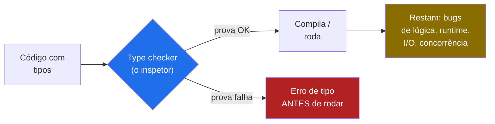
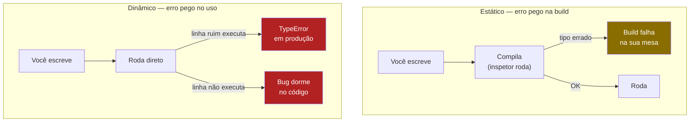
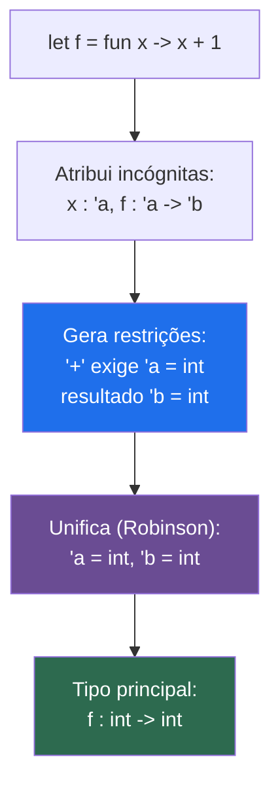
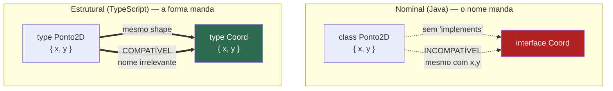
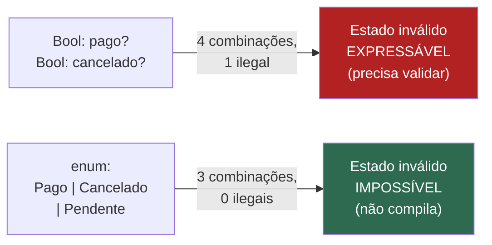

# Sistemas de tipos

> [!abstract] Resumo em uma linha
> Sistema de tipos não é um paradigma — é o eixo ortogonal que decide o que conta como valor válido e prova, antes de rodar, que você não vai tentar somar um número com uma janela.

Pare e repare numa coisa antes de tudo. As notas anteriores trataram de *paradigmas* — imperativo, OO, funcional, lógico. Tipos não estão nessa lista. E não é descuido. Sistema de tipos é uma dimensão **ortogonal**: ela cruza qualquer paradigma. Existe FP fortemente tipado (Haskell) e FP dinâmico (Clojure). Existe OO com tipos rígidos (Java) e OO sem nenhum (Ruby). Você pode girar o botão "paradigma" e o botão "tipos" de forma independente.

Por que isso importa? Porque o tipo molda como o paradigma se *expressa*. A FP ama tipos ricos — eles são a forma de modelar o domínio sem comentários (gancho `[[10 - Tipos algébricos, pattern matching e erros sem exceção]]`). A OO usa tipos como **contrato**: a interface é uma promessa verificável. E linguagens dinâmicas usam a ausência de tipos rígidos para habilitar metaprogramação, monkey-patching, duck typing. O mesmo conceito — "que valores cabem aqui?" — vira ferramenta diferente em cada cultura.

Quando você entende isso, para de fazer a pergunta errada em entrevista ("Python é melhor ou pior que Java?") e começa a fazer a certa: "que garantias eu quero pagar e que flexibilidade quero manter?". Volte ao ponto de partida em `[[01 - O que é um paradigma de programação]]`.

## O que um tipo É (e pra que serve)

Esqueça a definição de livro por um segundo. Pense numa **tomada**. Cada tomada tem um formato. O plugue de três pinos não entra no buraco de dois. Por que existe esse formato? Porque ele é uma *garantia física*: só encaixa o que faz sentido elétrico. O formato barra o erro **antes** de você ligar a corrente.

Um tipo é exatamente isso. É uma **etiqueta sobre um conjunto de valores e as operações válidas sobre eles**. `int` diz: "aqui cabem inteiros, e você pode somar, multiplicar, comparar". `String` diz: "aqui cabe texto, e você pode concatenar, medir, fatiar". O tipo é o formato da tomada.

E o **type checker** é o inspetor que fica na frente da tomada antes de você plugar. Ele olha seu programa e tenta *provar* que você nunca vai pedir uma operação inválida sobre um valor — somar texto com função, chamar um método que não existe, passar três argumentos para algo que espera dois.

> [!tip] A frase que vale a entrevista
> "Tipos são a prova mais barata de correção." Não cobrem tudo — não provam que sua lógica de negócio está certa. Mas cobrem uma classe inteira de erros (incompatibilidade de operações) de graça, em cada compilação, sem você escrever um único teste. É verificação formal pelo preço de uma anotação.

Repare na palavra **parcialmente**. O type checker prova ausência de *certas classes* de erro. Ele não prova que `dividir(a, b)` não vai estourar quando `b` for zero (a menos que você modele isso no tipo). Mas a barganha é boa: você paga pouco (anotações, ou nada, se houver inferência) e ganha uma rede que pega bobagens estruturais cedo.



Leitura do diagrama: o inspetor é um filtro que roda antes da execução. O que ele barra (D) nunca chega ao runtime. Mas perceba a caixa amarela (E): tipos não esvaziam o conjunto de bugs — só removem uma fatia. O resto continua sendo seu problema, e por isso testes não desaparecem.

## Estático × dinâmico — *quando* a checagem acontece

Este eixo responde uma pergunta só: **em que momento o inspetor trabalha?**

**Tipagem estática** — a checagem é em tempo de **compilação**. Java, Rust, TypeScript, Haskell, Go, C#. O compilador atribui um tipo a cada variável e, uma vez atribuído, ele não muda. Erros de tipo barram a build. Você descobre o problema na sua mesa, não na produção do cliente.

**Tipagem dinâmica** — a checagem é em tempo de **execução**. Python, JavaScript, Ruby. Os tipos pertencem aos *valores*, não às variáveis. A mesma variável pode segurar um número agora e uma lista logo depois. O erro só aparece quando a linha problemática efetivamente roda.

> [!note] O trade-off, sem dogma
> **Estático paga em segurança e ferramentas:** refactor automático confiável (renomear um campo e o compilador aponta os 40 lugares quebrados), autocomplete preciso, documentação que não mente. **Dinâmico paga em velocidade de prototipagem:** menos cerimônia, código que "só roda", metaprogramação livre. Não há vencedor universal. Há contexto: um script de 30 linhas não precisa de Haskell; um sistema de pagamentos com 12 desenvolvedores agradece o compilador.



Leitura do diagrama: no estático, o erro de tipo é capturado antes de qualquer execução. No dinâmico, ele só aparece quando *aquela linha específica* roda — e a caixa D4 é o perigo silencioso: um ramo `if` raro pode esconder um `TypeError` por meses até alguém cair nele em produção.

## Forte × fraca — *quanto* o inspetor cede

Aqui mora a confusão mais comum da carreira. Muita gente acha que "estático = forte" e "dinâmico = fraco". **Errado.** São eixos *diferentes e independentes*.

Estático × dinâmico é sobre *quando*. Forte × fraca é sobre **quão rígido o sistema é em relação a coerção e conversão implícita** — quanto ele cede quando você pede uma operação entre tipos incompatíveis.

**Tipagem forte** — o sistema reclama (em compilação ou em runtime) quando você invoca uma operação sobre um tipo que não a suporta. Ele recusa adivinhar o que você quis dizer.

**Tipagem fraca** — o sistema faz **coerção implícita**: tenta converter os tipos por conta própria para tornar a operação possível, mesmo que o resultado seja absurdo.

O exemplo canônico é JavaScript, que coage demais:

```javascript
"1" + 1      // "11"  — coage o número pra string, concatena
1 + "1"      // "11"  — mesmo
"5" - 1      // 4     — agora coage a string pra número!
[] + {}      // "[object Object]"
true + true  // 2     — booleano vira número
```

O `+` em `"1" + 1` decide sozinho concatenar. O `-` em `"5" - 1` decide sozinho subtrair como números. Ninguém pediu — o sistema *inferiu uma intenção* e quase sempre escolheu errado. Isso é tipagem fraca.

C é outro tipo de fraco: você pode **reinterpretar bits** com um cast, tratando a mesma memória como `int` ou `float` sem conversão de valor. O sistema deixa você passar por cima da etiqueta.

E o ponto que desfaz a confusão:

> [!warning] Python é dinâmico MAS forte
> Em Python, `"1" + 1` **levanta `TypeError`**. O sistema se recusa a coagir string com número. Logo: a checagem acontece em runtime (dinâmico), mas quando acontece, ela é **rígida** (forte). Os dois eixos giram separados. Java é estático e forte. JS é dinâmico e fraco. Python é dinâmico e forte. C é estático e (em parte) fraco. Quatro combinações reais.

A maneira mais limpa de gravar os dois eixos é uma matriz. Posicione mentalmente:

| | Forte (recusa coerção absurda) | Fraca (coage implicitamente) |
|---|---|---|
| **Estática** (checa na build) | Haskell, Rust, Java, Go | C, C++ (casts soltam os bits) |
| **Dinâmica** (checa no run) | Python, Ruby, Clojure | JavaScript, PHP, Perl |

Leitura da tabela: a diagonal "estático+forte" (Haskell, Rust) é a mais conservadora — o inspetor é rigoroso e age cedo. O canto oposto "dinâmico+fraco" (JS) é o mais permissivo — inspetor frouxo agindo tarde. Python e C provam que os eixos são independentes: ocupam cantos cruzados. **Não existe** uma reta única "seguro → inseguro"; existe um plano 2D.

## Inferência de tipos — o compilador *deduz* pra você

Tipagem estática tem fama de verborrágica. `Map<String, List<Integer>> m = new HashMap<String, List<Integer>>();` — escrever o tipo duas vezes é cansativo. A **inferência de tipos** resolve isso: o compilador **deduz** o tipo sozinho, a partir do contexto, sem você anotar.

```java
var m = new HashMap<String, List<Integer>>();  // Java infere o tipo de m
```

```scala
val nome = "Ada"   // Scala infere String
val n = 42         // infere Int
```

```go
contador := 0      // Go infere int via :=
```

Em ML e Haskell isso vai muito além: o algoritmo **Hindley-Milner** consegue deduzir os tipos de variáveis, expressões e funções inteiras a partir de código escrito num estilo *totalmente sem anotação*. Você escreve a lógica; o compilador descobre o tipo mais geral (o **tipo principal**) sem nenhuma dica sua.

E aqui está a parte bonita, o gancho com `[[11 - O paradigma lógico]]`: **o motor de inferência é, em essência, um sistema lógico**. Hindley-Milner funciona assim — atribui variáveis de tipo como incógnitas, gera **restrições** (constraints) a partir das regras da linguagem, e resolve por **unificação** (o algoritmo de Robinson, o mesmo da resolução em Prolog). Se há solução consistente, ela é garantidamente o tipo principal. Inferência de tipo é resolução de um sistema de equações sobre tipos. É programação lógica acontecendo dentro do compilador.



Leitura do diagrama: o compilador começa cego (incógnitas `'a`, `'b`), coleta fatos do uso (`+` força inteiros), e resolve o sistema por unificação — exatamente o casamento de termos do paradigma lógico. O resultado não é uma adivinhação: é o tipo *mais geral* que satisfaz todas as restrições, provado.

> [!info] Inferência não é "sem tipos"
> Confusão frequente: `var` em Java ou `:=` em Go **não** torna o código dinâmico. O tipo existe, é estático, é checado na build — só não está *escrito*. A variável continua amarrada a um tipo fixo. Inferência é açúcar sintático sobre tipagem estática, não fuga dela.

## Nominal × estrutural — compatibilidade por *nome* ou por *forma*

Quando duas coisas "são do mesmo tipo"? Há duas respostas, e elas definem culturas inteiras.

**Tipagem nominal** — compatibilidade por **nome declarado**. Dois tipos são compatíveis se, e só se, foram *declarados* relacionados (mesmo nome, ou um `implements`/`extends` explícito). Java e C#. Se uma classe não diz `implements Pato`, ela **não é** um Pato, mesmo que tenha todos os métodos de pato. O nome é o contrato.

**Tipagem estrutural** — compatibilidade por **forma (shape)**. Dois tipos são compatíveis se têm a mesma estrutura — os mesmos campos e métodos — independentemente do nome. TypeScript faz isso. As interfaces de Go também: um tipo satisfaz uma interface *implicitamente*, só por ter os métodos certos, sem nunca escrever `implements`. É o duck typing, mas verificado em compilação: "se anda como pato e grasna como pato, o compilador aceita como pato".



Leitura do diagrama: à esquerda, `Ponto2D` tem exatamente os campos de `Coord` mas é **recusado** porque nunca declarou parentesco — o nome é tudo. À direita, o mesmo shape basta: TypeScript aceita pela forma, o nome é decorativo. Trade-off: estrutural facilita refactor e desacoplamento (menos boilerplate, Go não exige `implements`), mas permite *casamentos acidentais* — dois tipos com mesma forma e significados opostos colidem.

## Tipagem gradual — misturando os dois mundos

E se você não quisesse escolher? **Tipagem gradual** deixa misturar código tipado e não-tipado no mesmo programa, com migração incremental sob seu controle. O termo foi cunhado em 2006 por **Jeremy Siek e Walid Taha**.

O mecanismo central é um tipo especial — chamado `any` em TypeScript, `dynamic` em C#, `Any` nas type hints de Python. Esse tipo é **compatível com todo mundo nos dois sentidos**: o checker trata qualquer tipo como atribuível a `any`, e `any` como atribuível a qualquer tipo. A igualdade de tipos vira uma relação mais frouxa, a **consistência**, que liga o tipo dinâmico a todos os outros. Onde há `any`, o inspetor recua; onde há anotação, ele age.

Os exemplos vivos:
- **TypeScript sobre JavaScript** — JS puro é o ponto de partida não-tipado; você adiciona anotações arquivo por arquivo, no seu ritmo.
- **Python com type hints + mypy** — desde o Python 3.5 você anota o que quiser; o `mypy` checa as partes anotadas e ignora o resto. O runtime continua dinâmico; a checagem estática é opcional, externa, incremental.

> [!example] Por que isso ganhou o mundo
> Bases de código gigantes em JS e Python não podiam parar tudo para uma reescrita tipada. Tipagem gradual permite tipar o módulo crítico hoje, o resto quando der. É a ponte entre "nada tipado" e "tudo tipado" — e foi exatamente o que levou TypeScript a dominar o ecossistema JS. Veja o concreto em `[[TypeScript]]`.

## Tipos como ferramenta de design

Até aqui tratamos tipos como *segurança*. Mas há um nível mais alto, e é onde os engenheiros sêniores moram: tipos como **ferramenta de design**.

O lema é **"make illegal states unrepresentable"** — torne os estados ilegais inexpressáveis. Em vez de validar com `if`s espalhados que um pedido não pode estar "pago" e "cancelado" ao mesmo tempo, você modela o estado como um tipo soma (`Pago | Cancelado | Pendente`) onde a combinação inválida simplesmente *não existe no espaço de tipos*. O compilador deixa de aceitar o bug — ele não é mais expressável. Isso é o coração de `[[10 - Tipos algébricos, pattern matching e erros sem exceção]]` e por que a `[[05 - O paradigma funcional]]` investe tanto em tipos ricos.



Leitura do diagrama: dois booleanos geram 4 combinações, uma das quais é nonsense ("pago E cancelado") e exige validação manual eterna. O tipo soma admite só os 3 estados reais — o estado ilegal nem tem nome no sistema. O bug não é pego: ele é *prevenido por construção*.

E há o bônus que nenhum comentário entrega: **tipo é documentação que não desatualiza**. A assinatura `fun saca(conta: Conta, valor: Dinheiro): Resultado<Saldo, ErroSaque>` conta a história inteira — o que entra, o que sai, que pode falhar — e o compilador *garante* que ela continua verdadeira. Comentário mente quando o código muda; tipo não pode mentir, ou não compila.

## Em entrevista

A type system is an orthogonal dimension, not a paradigm — it cuts across imperative, OO, and functional code alike. The first axis is **static vs dynamic**: this is about *when* type checking happens (compile time vs runtime), trading refactor safety and tooling against prototyping speed. The second, independent axis is **strong vs weak**: this is about *how strictly* the language resists implicit coercion — and the key insight is that these axes are orthogonal, which is why Python is dynamic but strong while C is static yet weak. **Type inference** (Hindley-Milner in ML/Haskell, `var`/`:=` elsewhere) lets the compiler deduce types via constraint solving and unification, so static typing doesn't have to be verbose. **Nominal typing** (Java) checks compatibility by declared name, while **structural typing** (TypeScript, Go interfaces) checks by shape — same fields means compatible. **Gradual typing** (TypeScript over JS, mypy over Python) lets you mix typed and untyped code via an `any`/`dynamic` type, enabling incremental adoption. The senior framing is treating types as a design tool: "make illegal states unrepresentable" turns whole classes of bugs into compile errors and gives you documentation that can't go stale.

### Vocabulário
- sistema de tipos → type system
- tipagem estática → static typing
- tipagem dinâmica → dynamic typing
- tipagem forte → strong typing
- tipagem fraca → weak typing
- coerção implícita → implicit coercion
- inferência de tipos → type inference
- tipagem nominal → nominal typing
- tipagem estrutural → structural typing
- tipagem gradual → gradual typing
- segurança de tipos → type safety
- tornar estados ilegais inexpressáveis → make illegal states unrepresentable

> [!info] Lastro
> - Baeldung CS, *Static vs. Dynamic and Strong vs. Weak Types in Programming* — os dois eixos como perguntas distintas ("quando" vs "quão estrito"), com C estático-fraco e Python dinâmico-forte. https://www.baeldung.com/cs/programming-types-comparison
> - Wikipedia, *Hindley–Milner type system* — dedução de tipos a partir de código sem anotação, tipo principal, unificação de Robinson, origem em ML. https://en.wikipedia.org/wiki/Hindley%E2%80%93Milner_type_system
> - Jeremy Siek, *What is Gradual Typing?* — definição do criador do termo (2006, com Walid Taha), o tipo dinâmico e a relação de consistência. https://jsiek.github.io/home/WhatIsGradualTyping.html
> - Alex Woods, *Structural vs. Nominal Type Systems* — compatibilidade por forma vs por nome, TypeScript estrutural, Go interfaces implícitas. https://alexhwoods.com/structural-vs-nominal-type-systems/

## Veja também
- `[[01 - O que é um paradigma de programação]]` — por que tipos são eixo ortogonal, não paradigma
- `[[05 - O paradigma funcional]]` — a cultura que mais investe em tipos ricos
- `[[10 - Tipos algébricos, pattern matching e erros sem exceção]]` — tipos soma e "make illegal states unrepresentable"
- `[[11 - O paradigma lógico]]` — a unificação que move a inferência Hindley-Milner
- `[[14 - Linguagens multi-paradigma]]` — como tipos e paradigmas se combinam livremente
- `[[16 - Paradigmas na prática e em entrevista]]` — fechando o domínio
- `[[TypeScript]]` — tipagem gradual e estrutural na prática
- `[[03-Dominios/Fundamentos/Paradigmas/index|Paradigmas de Programação]]`
