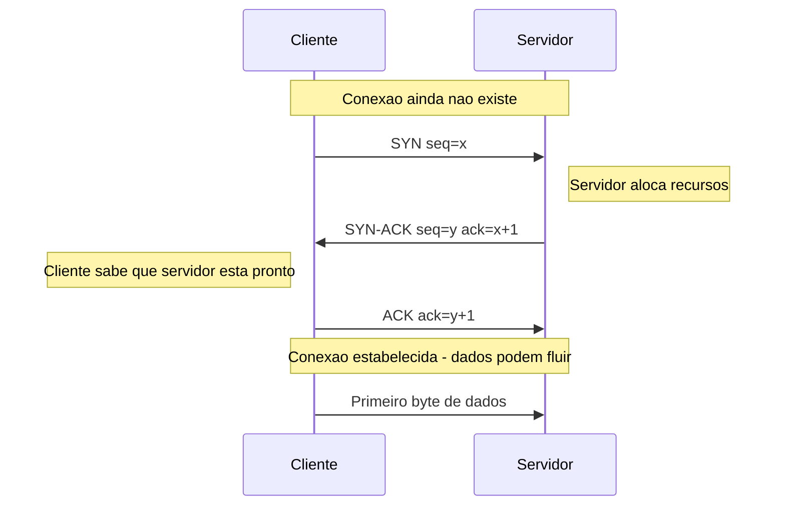
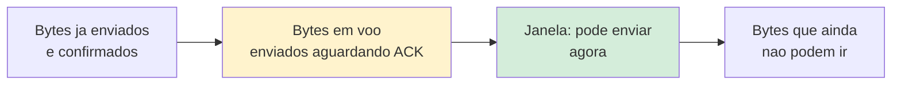
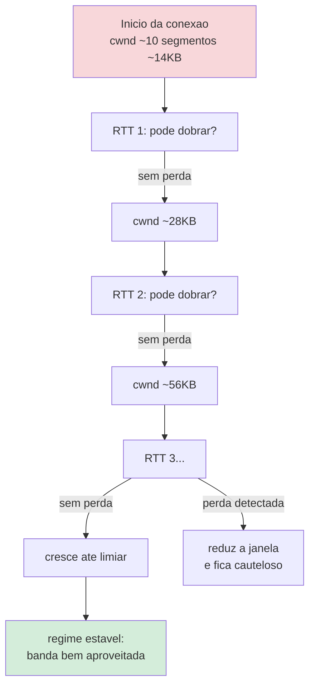
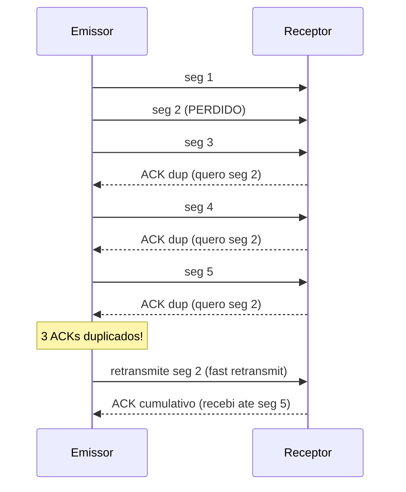
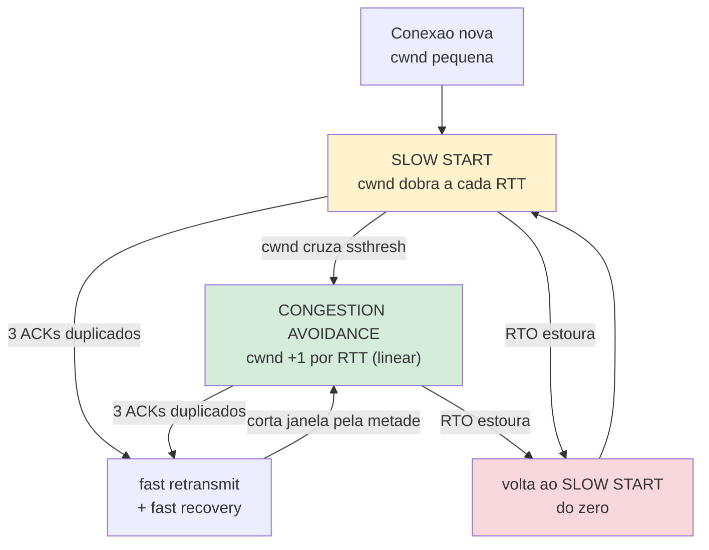
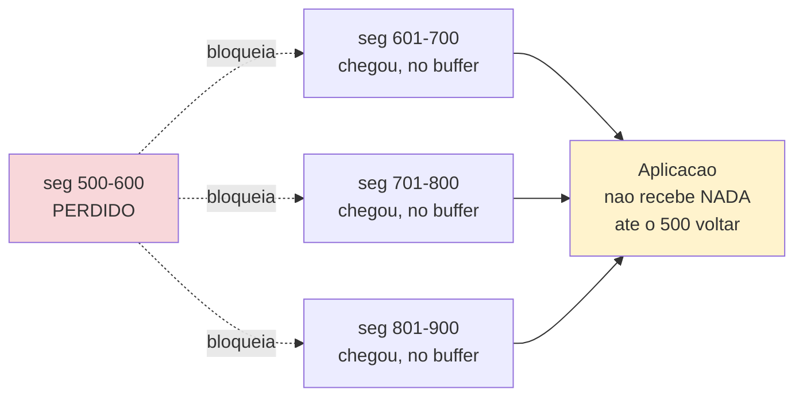
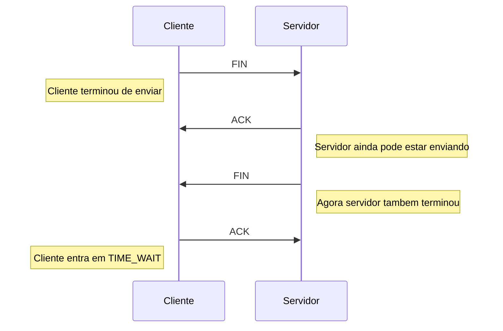

# TCP

> [!abstract] Resumo em uma linha
> TCP é o protocolo de transporte que troca velocidade bruta por garantias: entrega confiável, ordem e controle de fluxo, ao custo de um aperto de mãos inicial e de uma partida lenta.

Imagine que você precisa enviar um livro inteiro para alguém pelo correio, mas só pode mandar uma página por envelope. Como garantir que a pessoa receba todas as páginas, na ordem certa, sem nenhuma faltando? Você numeraria as páginas, pediria um recibo de cada envelope recebido, e reenviaria os que se perdessem. É exatamente isso que o TCP faz — e é por isso que ele não é "grátis".

O TCP (Transmission Control Protocol) é o cavalo de batalha da internet. HTTP, e-mail, SSH, bancos de dados — quase tudo que precisa de confiabilidade roda sobre ele. Ele vive na camada de transporte (veja [[01 - O que é uma rede e o modelo de camadas]]), em cima do IP, que por si só não promete nada. O IP entrega pacotes do jeito que dá: alguns chegam, alguns somem, alguns chegam fora de ordem ou duplicados. O TCP pega esse caos e entrega ao seu programa um fluxo de bytes limpo, ordenado e completo.

A pergunta central desta nota: **o que exatamente o TCP promete, e quanto isso custa?**

## As quatro promessas do TCP

O TCP faz quatro garantias que o IP sozinho não faz. Guarde essas quatro — elas caem em entrevista o tempo todo.

| Garantia | O que significa | Como o TCP faz |
| --- | --- | --- |
| Entrega confiável | Nenhum byte se perde no caminho | ACK + retransmissão |
| Ordenação | Os bytes chegam na ordem em que saíram | Números de sequência |
| Controle de fluxo | O emissor não afoga o receptor | Janela deslizante anunciada |
| Controle de congestionamento | O emissor não afoga a rede | Partida lenta + reação à perda |

Repare na diferença sutil entre as duas últimas. **Controle de fluxo** protege o *receptor* (ele tem buffer limitado). **Controle de congestionamento** protege a *rede inteira* (os roteadores no meio do caminho têm filas limitadas). São dois mecanismos distintos, com janelas distintas, e confundir os dois é um deslize clássico.

> [!note] Confiável e ordenado andam juntos
> A confiabilidade vem dos ACKs: para cada segmento recebido, o receptor confirma. Se o emissor não recebe a confirmação dentro de um tempo, ele retransmite. A ordenação vem dos números de sequência: cada byte tem uma posição, então o receptor remonta tudo na ordem certa mesmo que os pacotes cheguem embaralhados. O contraste é o [[03 - UDP]], que joga fora essas duas garantias em troca de velocidade.

## O 3-way handshake: o aperto de mãos de três tempos

Antes de enviar um único byte de dado, cliente e servidor precisam concordar que vão conversar. Esse acordo é o **handshake de três vias**.

Por que três tempos, e não um? Porque os dois lados precisam combinar de onde começam a numerar os bytes — e cada lado escolhe seu próprio número de sequência inicial. Um lado anunciando não basta; o outro tem que confirmar que recebeu o anúncio. Daí os três passos.

Aqui está o vai e vem completo. Antes de ler o diagrama: o cliente abre pedindo conexão (SYN), o servidor responde aceitando e abrindo o lado dele ao mesmo tempo (SYN-ACK), e o cliente confirma (ACK). Só então os dados podem fluir.

Leitura do diagrama: três mensagens cruzam a rede antes do primeiro byte útil. O `SYN` (de *synchronize*) carrega o número de sequência inicial do cliente. O servidor responde com `SYN-ACK`, que confirma o do cliente e anuncia o seu próprio. O `ACK` final fecha o acordo. A partir daí, a conexão está aberta.

> [!warning] O custo escondido: 1 RTT antes de qualquer dado
> O handshake gasta uma viagem de ida e volta inteira — 1 RTT (round-trip time) — antes do primeiro byte de conteúdo sair. Numa rede local, isso é menos de 1 ms e ninguém percebe. Mas numa conexão atravessando continentes, o RTT pode passar de 100 ms. Cada conexão TCP nova começa "devendo" esse tempo. É por isso que abrir centenas de conexões curtas é tão caro, e por que reaproveitá-las importa tanto (veja [[12 - Latência, throughput e os números]]).

## Janela deslizante: o receptor define o ritmo

Depois que a conexão está aberta, o TCP não despeja todos os dados de uma vez. Ele usa uma **janela deslizante** (*sliding window*).

A ideia: o receptor anuncia, em cada ACK, quanto espaço ainda tem no buffer dele — o *receive window*. O emissor nunca manda mais bytes "em voo" (enviados mas ainda não confirmados) do que essa janela permite. Conforme os ACKs chegam, a janela "desliza" para frente, liberando espaço para mais dados.

Leitura do diagrama: a janela é a faixa verde — o que o emissor está autorizado a enviar agora. À esquerda, o que já foi confirmado (pode esquecer). Em amarelo, o que está em voo. À direita, o que terá que esperar a janela deslizar. Se o receptor está lento processando, ele anuncia uma janela menor, e o emissor naturalmente segura o passo. Esse é o controle de fluxo: o receptor dita o ritmo.

> [!question] E se a janela anunciada for zero?
> O receptor pode anunciar janela zero quando o buffer dele encheu. O emissor então para de enviar e periodicamente sonda ("você já tem espaço?") até a janela reabrir. Sem isso, o emissor entupiria um receptor lento — exatamente o que o controle de fluxo existe para evitar.

## Partida lenta: por que a primeira request é mais lenta

Aqui está o detalhe que mais surpreende quem está começando, e que explica um monte de comportamento estranho de performance.

O controle de fluxo (janela do receptor) protege o receptor. Mas e a rede no meio do caminho? O TCP não tem como saber, de cara, quanta banda existe entre os dois pontos. Então ele **chuta baixo e vai testando**. Esse é o **slow start** (partida lenta), definido na RFC 5681.

A conexão começa com uma janela de congestionamento (*congestion window*, ou cwnd) pequena — tipicamente cerca de 10 segmentos, mais ou menos 14 KB de dados. A cada RTT bem-sucedido (sem perda), essa janela **dobra**. 14 KB, depois 28 KB, depois 56 KB... crescimento exponencial, até bater num limiar (o *slow start threshold*) ou até detectar uma perda de pacote.

Leitura do diagrama: a janela parte minúscula (vermelho) e dobra a cada ida e volta, desde que não haja perda. Quando um pacote some, o TCP interpreta como sinal de congestionamento, recua a janela e passa a crescer com mais cautela. O ponto-chave: **os primeiros RTTs de uma conexão nova são subutilizados** — a janela ainda é pequena demais para encher o cano.

Por isso a **primeira requisição numa conexão recém-aberta é mais lenta** do que as seguintes na mesma conexão. Não é o servidor que está lento; é o TCP ainda "aquecendo" a janela. Numa conexão já madura, a janela já cresceu e a banda é bem aproveitada.

> [!tip] Como mitigar a partida lenta
> A receita é a mesma: não pague o handshake nem a partida lenta de novo a cada requisição. Reaproveite conexões já "aquecidas".
> - **Keep-alive / connection pooling**: mantém a conexão TCP aberta entre requisições, então o handshake e a partida lenta acontecem uma vez só (veja [[14 - Resiliência de rede]]).
> - **HTTP/2 multiplexing**: várias requisições compartilham uma única conexão TCP já aquecida, em paralelo, sem abrir conexões novas (veja [[07 - A evolução do HTTP]]).
> - **HTTP/3 sobre QUIC**: muda o jogo combinando o estabelecimento de conexão com o handshake de criptografia, cortando RTTs iniciais (veja [[05 - TLS e HTTPS]]).

## Nagle × delayed ACK: quando duas otimizações brigam

Aqui está uma das interações mais traiçoeiras do TCP, e uma pergunta de entrevista que separa quem leu o protocolo de quem só usou. Duas otimizações, cada uma sensata sozinha, que combinadas produzem um gargalo de latência absurdo.

A primeira é o **algoritmo de Nagle**. Mandar um pacote IP só para carregar 1 byte de dado é desperdício — o cabeçalho do TCP mais o do IP somam 40 bytes de overhead para 1 byte útil. Nagle resolve isso assim: se já existe dado em voo sem ACK, segure os pequenos writes e junte-os num pacote maior. Você espera o ACK chegar antes de mandar o próximo pedacinho. Ótimo para throughput, péssimo para quem manda muitos writes pequenos.

A segunda é o **delayed ACK** (ACK atrasado). O receptor não confirma cada segmento na hora; ele espera um pouquinho — tipicamente até 40 ms, às vezes 200 ms — torcendo para piggybackar o ACK numa resposta de dados, ou para confirmar dois segmentos de uma vez. Também sensato: menos pacotes de ACK puro na rede.

Agora junte os dois. O emissor (com Nagle) segura o próximo write porque espera um ACK. O receptor (com delayed ACK) segura o ACK porque espera mais dados ou uma resposta para piggybackar. Resultado: os dois ficam **esperando um ao outro** até o timer do delayed ACK estourar. Um write que deveria sair em microssegundos trava por dezenas ou centenas de milissegundos.

> [!warning] O sintoma clássico: latência fantasma de ~40 ms
> Você manda uma requisição pequena, mede o tempo, e vê um pico inexplicável de cerca de 40 ms que não aparece em payloads grandes. Quase sempre é Nagle brigando com delayed ACK. O caso típico: um protocolo de request/response com mensagens pequenas (RPC, comandos de banco, etc.) onde o emissor faz `write` em dois pedaços (cabeçalho + corpo) e fica preso esperando o ACK do primeiro pedaço, que o receptor está segurando.
> A cura é `TCP_NODELAY`, a opção de socket que **desliga o Nagle**. Praticamente toda biblioteca de rede séria (drivers de banco, clientes HTTP, gRPC) liga `TCP_NODELAY` por padrão hoje, exatamente para escapar dessa armadilha. A regra prática: se sua aplicação faz muitos writes pequenos e latência importa mais que economizar pacotes, desligue Nagle.

## Detecção de perda: o caminho lento e o caminho rápido

O IP perde pacotes — essa é a premissa. A pergunta é: *como* o TCP descobre que perdeu, e quanto isso custa? Há dois caminhos, e a diferença de custo entre eles é enorme.

O caminho lento é o **timeout de retransmissão** (RTO, *retransmission timeout*). Para cada segmento enviado, o TCP arma um cronômetro calibrado a partir do RTT medido. Se o ACK não chega antes do cronômetro estourar, o TCP presume perda e retransmite. O problema: o RTO é deliberadamente conservador (sempre maior que o RTT real, com folga), então esperar por ele significa um silêncio longo — frequentemente centenas de milissegundos parado. Pior: o RTO geralmente dispara um recuo agressivo, voltando ao slow start do zero.

O caminho rápido é o **fast retransmit** (retransmissão rápida). Quando um segmento se perde no meio de um fluxo, os segmentos seguintes ainda chegam ao receptor — fora de ordem. A cada um que chega, o receptor reenvia um ACK pedindo de novo o byte que falta (um *ACK duplicado*). Esses ACKs duplicados são o sinal: ao receber **3 ACKs duplicados**, o emissor não espera o RTO — ele retransmite o segmento faltante imediatamente.

Antes do diagrama: o emissor manda os segmentos 1 a 5; o 2 se perde. Cada segmento que chega depois (3, 4, 5) gera um ACK duplicado pedindo "ainda quero o 2".

Leitura do diagrama: o segmento 2 some, mas 3, 4 e 5 chegam. Cada um faz o receptor repetir o mesmo ACK ("ainda falta o 2"). No terceiro ACK duplicado, o emissor age sem esperar o cronômetro: retransmite só o segmento 2. Quando ele chega, o receptor já tinha 3, 4 e 5 no buffer, então um único ACK cumulativo confirma tudo até o 5 de uma vez. Por que esperar 3 e não 1? Porque um ou dois ACKs duplicados podem ser só reordenação de rede, não perda real; três é o limiar que distingue ruído de sinal.

Junto com o fast retransmit vem a **recuperação rápida** (*fast recovery*). A lógica é fina: o fato de chegarem ACKs duplicados *prova que dados ainda estão fluindo* — segmentos continuam saindo da rede e entrando no buffer do receptor. Então não faz sentido pisar no freio total como faz o RTO. Em vez de voltar ao slow start, o TCP corta a janela pela metade e continua no regime linear de **prevenção de congestionamento**. Daí o ditado: timeout é a catástrofe (volta a engatinhar), três ACKs duplicados é só um tropeço (apenas reduz o passo).

## As fases do congestionamento: slow start não é a história toda

A nota sobre partida lenta acima conta só o começo. O crescimento exponencial do slow start não dura para sempre — seria insano dobrar a janela indefinidamente. Existe um freio: o **ssthresh** (*slow start threshold*). Enquanto a janela está abaixo do ssthresh, o TCP dobra a cada RTT (slow start). Quando cruza o ssthresh, ele muda de marcha e entra em **prevenção de congestionamento** (*congestion avoidance*), onde a janela cresce de forma **linear** — mais ou menos um segmento por RTT, não o dobro.

Esse regime linear segue uma política com nome próprio: **AIMD**, de *additive increase, multiplicative decrease* (incremento aditivo, decréscimo multiplicativo). Sem perda, a janela sobe devagar e em linha reta (additive). Ao detectar perda, ela cai pela metade de uma vez (multiplicative). Sobe reto, despenca, sobe reto de novo — o famoso padrão "dente de serra" do throughput do TCP.

Leitura do diagrama: a conexão arranca no slow start (amarelo, exponencial). Ao cruzar o ssthresh, vira para prevenção de congestionamento (verde, linear) — o regime estável onde a maior parte da vida da conexão se passa. Perda leve (3 ACKs duplicados) só corta a janela pela metade e fica no regime linear, via fast recovery. Perda grave (RTO) é a catástrofe vermelha: zera tudo de volta ao slow start. AIMD é exatamente a aresta verde subindo devagar e o corte pela metade descendo.

> [!note] O TCP que você usa hoje não é o do livro-texto
> Slow start e AIMD são o esqueleto clássico (TCP Reno), mas os algoritmos modernos ajustam a parte do "como crescer e quanto recuar". O **CUBIC** é o padrão no Linux desde o kernel 2.6.19 (2006); ele troca o crescimento linear por uma curva cúbica que aproveita melhor redes de alta banda e alto atraso. O **BBR** (Google, disponível no Linux desde o 4.9) abandona de vez a ideia de "perda = congestionamento" e em vez disso modela diretamente a banda e o RTT do gargalo, o que o torna bem mais robusto em redes com perda aleatória. A mecânica de fases muda; o princípio de sondar a rede e reagir, não.

## Head-of-line blocking: o pecado original que matou o TCP para o HTTP/3

Chegamos ao ponto que amarra este galho inteiro. A ordenação — uma das quatro promessas do TCP — tem um custo escondido que, em redes modernas, virou um defeito de design.

Lembre que o TCP entrega ao seu programa um fluxo de bytes **estritamente em ordem**. Ele não pode entregar o byte 1000 antes do byte 500. Agora imagine que o segmento que carrega os bytes 500 a 600 se perde, mas os segmentos seguintes (601 em diante) já chegaram e estão no buffer do receptor. Esses dados *estão ali, intactos, prontos* — mas o TCP **não pode entregá-los à aplicação** até o segmento perdido ser retransmitido e chegar. Tudo trava esperando aquele único buraco ser preenchido.

Isso é o **bloqueio de cabeça de fila** (*head-of-line blocking*, ou HOL blocking): um item travado no início da fila prende todos os que vêm atrás, mesmo que eles já estejam prontos. É como uma fila de banco onde a primeira pessoa demora — não importa que as dez atrás estejam resolvidas, ninguém passa.

Leitura do diagrama: o segmento perdido (vermelho) segura tudo. Três segmentos posteriores já chegaram e estão guardados no buffer, mas a aplicação não vê nenhum byte até a retransmissão do buraco completar. A garantia de ordem do TCP, que parecia só vantagem, aqui vira corrente: um pacote perdido congela o fluxo inteiro.

Por que isso importa tanto hoje? Porque o HTTP/2 colocou **vários streams lógicos dentro de uma única conexão TCP** (multiplexing). Em teoria, esses streams são independentes — uma imagem e um script baixando em paralelo não deveriam se atrapalhar. Mas como todos compartilham o mesmo fluxo de bytes do TCP, **uma perda de pacote em qualquer stream trava todos os outros**. A independência é uma ilusão na camada de aplicação, desfeita pela ordenação do TCP embaixo.

> [!important] Por que QUIC e HTTP/3 abandonaram o TCP
> Esse é o motivo central da existência do HTTP/3. Não dá para consertar o head-of-line blocking *de dentro* do TCP — a ordenação é parte do contrato dele. A única saída foi construir um novo transporte sobre o [[03 - UDP]], que não impõe ordem: o **QUIC**. O QUIC mantém streams genuinamente independentes — uma perda em um stream só bloqueia *aquele* stream, os outros continuam fluindo. Ele reimplementa por cima do UDP tudo o que o TCP dá de bom (confiabilidade, ordem *por stream*, controle de congestionamento), mas sem o gargalo da fila única. É a história contada por inteiro em [[07 - A evolução do HTTP]]: o salto do HTTP/2 para o HTTP/3 é, no fundo, a fuga do head-of-line blocking do TCP.

## Window scaling: a janela de 16 bits que não cabe na internet moderna

Um detalhe de aritmética com consequências reais de throughput. O campo de janela no cabeçalho do TCP tem **16 bits** — ele só consegue anunciar um receive window de até 65.535 bytes, cerca de 64 KB. Em 1981 isso era folgado. Hoje é um teto baixo.

O gargalo aparece quando você pensa no **produto banda-atraso** (*bandwidth-delay product*, BDP): a quantidade de dados que cabe "em voo" no cano é banda × RTT. Numa conexão de 1 Gbit/s com RTT de 100 ms, o BDP é cerca de 12 MB. Para manter o cano cheio, você precisa de até 12 MB em voo — mas a janela de 16 bits trava você em 64 KB. Você passaria a maior parte do tempo parado, esperando ACKs, usando uma fração ínfima da banda disponível.

A solução é a opção de **window scaling** (escalonamento de janela), negociada no handshake. Ela define um fator multiplicador que desloca o valor anunciado em até 14 bits, esticando o teto efetivo da janela para cerca de 1 GB. Com isso o TCP volta a conseguir encher canos gordos e longos.

> [!tip] Por que window scaling cai em entrevista
> A ligação que impressiona é esta: o número de bytes em voo é limitado pelo *menor* entre a janela de fluxo (receptor) e a janela de congestionamento (rede). De nada adianta o congestion control ter aberto uma janela enorme se a janela de fluxo está presa em 64 KB por falta de window scaling. Saber que throughput máximo ~ janela / RTT, e que o BDP dita o tamanho de janela necessário, mostra que você entende o TCP como sistema de fluxo, não só como sequência de mensagens.

## Terminação 4-way: o adeus em quatro tempos

Abrir leva três passos; fechar leva quatro. Por quê? Porque o TCP é *full-duplex* — cada lado tem seu próprio canal de envio, e cada um precisa fechar o seu separadamente. Um lado pode ter terminado de falar enquanto o outro ainda tem dados para mandar.

Antes do diagrama: quem quer encerrar manda um `FIN`, o outro lado confirma com `ACK`, depois manda *seu* próprio `FIN` quando termina, e o primeiro lado confirma. Quatro mensagens.

Leitura do diagrama: os dois `FIN` (um de cada lado) e os dois `ACK` correspondentes dão os quatro tempos. Repare que entre o `ACK` do servidor e o `FIN` dele pode haver um intervalo — o servidor pode ter mais dados para enviar antes de fechar seu lado. Depois do `ACK` final, o cliente não some imediatamente: ele entra num estado de espera chamado `TIME_WAIT`.

## TIME_WAIT: a espera que pode esgotar suas portas

Depois de mandar o último `ACK`, o lado que iniciou o fechamento fica num estado `TIME_WAIT` por cerca de **2 MSL** (duas vezes o *Maximum Segment Lifetime*). Na especificação, o MSL é tipicamente 2 minutos, então `TIME_WAIT` dura na faixa de até alguns minutos.

Por que esperar? Dois motivos. Primeiro: garantir que o `ACK` final realmente chegou — se ele se perdeu, o outro lado reenvia o `FIN` e este lado precisa estar vivo para responder. Segundo: deixar que pacotes atrasados da conexão antiga "morram" na rede, para que não apareçam de surpresa numa conexão nova que reutilize a mesma combinação de portas.

> [!warning] Esgotamento de portas efêmeras em alta concorrência
> Cada conexão TCP é identificada por uma tupla: IP de origem, porta de origem, IP de destino, porta de destino. Num servidor (ou cliente) que abre e fecha milhares de conexões curtas por segundo, cada uma deixa uma porta presa em `TIME_WAIT` por minutos. As **portas efêmeras** (a faixa de portas de origem disponíveis, tipicamente algo como 28 mil portas) são finitas. Se elas se esgotam, novas conexões falham — mesmo com CPU e memória sobrando.
> A causa raiz quase sempre é a mesma: abrir uma conexão nova para cada requisição em vez de reaproveitar. A cura é o **connection pooling** (veja [[14 - Resiliência de rede]]). Esse é um incidente de produção clássico, e saber diagnosticá-lo impressiona em entrevista.

## Em entrevista

- TCP provides four guarantees that raw IP does not: reliable delivery, in-order delivery, flow control, and congestion control.
- Reliability comes from acknowledgments and retransmission; ordering comes from sequence numbers.
- The three-way handshake (SYN, SYN-ACK, ACK) costs one full round trip before any application data flows, which is significant on high-latency links.
- Flow control protects the receiver via the advertised sliding window; congestion control protects the network via slow start.
- Slow start begins with a small congestion window (around 10 segments) and doubles it each round trip, so the first request on a fresh connection is slower while the window warms up.
- Once the window crosses ssthresh, TCP switches from slow start to congestion avoidance, which grows the window linearly following AIMD: additive increase on success, multiplicative decrease (halving) on loss, producing the classic sawtooth.
- TCP detects loss two ways: a slow retransmission timeout (RTO), which collapses back to slow start, or fast retransmit on three duplicate ACKs, which retransmits immediately and stays in fast recovery without a full reset.
- Nagle's algorithm and delayed ACK can deadlock each other on small writes, causing a ~40 ms latency stall; we disable Nagle with TCP_NODELAY for request/response workloads.
- Because TCP delivers a strictly ordered byte stream, a single lost packet causes head-of-line blocking that stalls all multiplexed streams on the connection, which is exactly why QUIC and HTTP/3 moved off TCP onto UDP.
- We mitigate slow-start cost with keep-alive, connection pooling, HTTP/2 multiplexing, and HTTP/3 over QUIC.
- Connection teardown is a four-way exchange, and the initiating side lingers in TIME_WAIT for about two times the maximum segment lifetime, which can exhaust ephemeral ports on high-concurrency servers that do not pool connections.

### Vocabulário

| Português | English |
| --- | --- |
| handshake de três vias | three-way handshake |
| número de sequência | sequence number |
| janela deslizante | sliding window |
| controle de fluxo | flow control |
| controle de congestionamento | congestion control |
| partida lenta | slow start |
| prevenção de congestionamento | congestion avoidance |
| janela de congestionamento | congestion window |
| retransmissão | retransmission |
| retransmissão rápida | fast retransmit |
| recuperação rápida | fast recovery |
| ACK atrasado | delayed ACK |
| algoritmo de Nagle | Nagle's algorithm |
| bloqueio de cabeça de fila | head-of-line blocking |
| produto banda-atraso | bandwidth-delay product |
| confirmação | acknowledgment (ACK) |
| porta efêmera | ephemeral port |
| esgotamento de portas | port exhaustion |
| tempo de ida e volta | round-trip time (RTT) |
| pool de conexões | connection pooling |

> [!info] Lastro
> - [RFC 9293 — Transmission Control Protocol (TCP)](https://datatracker.ietf.org/doc/html/rfc9293) — especificação atual do TCP; descreve o handshake de três vias, o estado TIME_WAIT e o MSL de 2 minutos.
> - [RFC 5681 — TCP Congestion Control](https://www.rfc-editor.org/rfc/rfc5681.html) — define os quatro algoritmos entrelaçados: slow start, congestion avoidance (AIMD), fast retransmit (3 ACKs duplicados) e fast recovery.
> - [TCP congestion control — Wikipedia](https://en.wikipedia.org/wiki/TCP_congestion_control) — CUBIC é o padrão no Linux desde o kernel 2.6.19 (2006); BBR (Google) está disponível desde o Linux 4.9 e modela banda e RTT em vez de tratar perda como sinal de congestionamento.
> - Ilya Grigorik, *High Performance Browser Networking* (hpbn.co), capítulos sobre TCP e HTTP/2 — explica o custo do handshake e da partida lenta, o produto banda-atraso e o head-of-line blocking que motivou o QUIC.

## Veja também

- [[01 - O que é uma rede e o modelo de camadas]] — onde TCP se encaixa nas camadas
- [[03 - UDP]] — o contraponto sem garantias
- [[05 - TLS e HTTPS]] — handshake de criptografia em cima do TCP, e o QUIC
- [[07 - A evolução do HTTP]] — multiplexing do HTTP/2 e o salto para o HTTP/3
- [[12 - Latência, throughput e os números]] — quanto custa um RTT na prática
- [[14 - Resiliência de rede]] — connection pooling e keep-alive
- [[15 - Redes em entrevista]] — perguntas e respostas
- [[03-Dominios/Fundamentos/Redes e Protocolos/index|Redes e Protocolos]]
