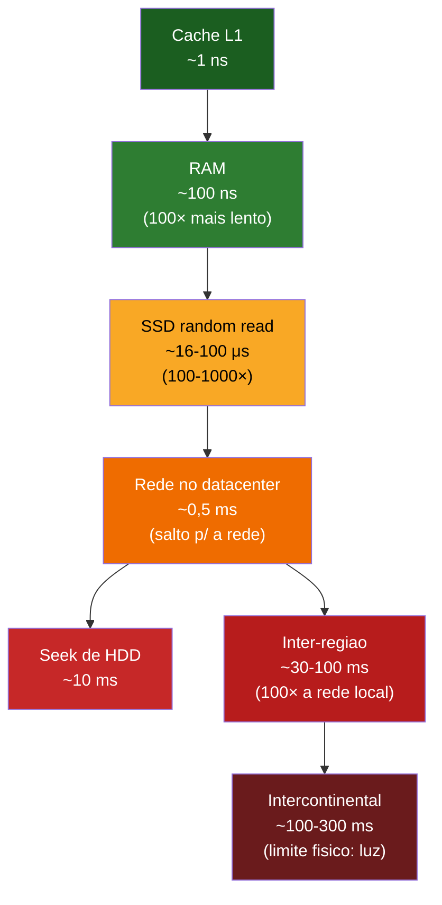
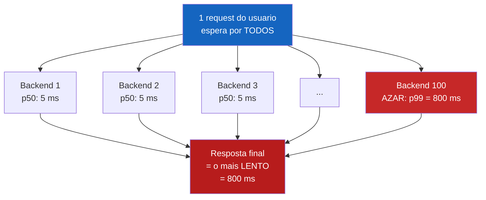
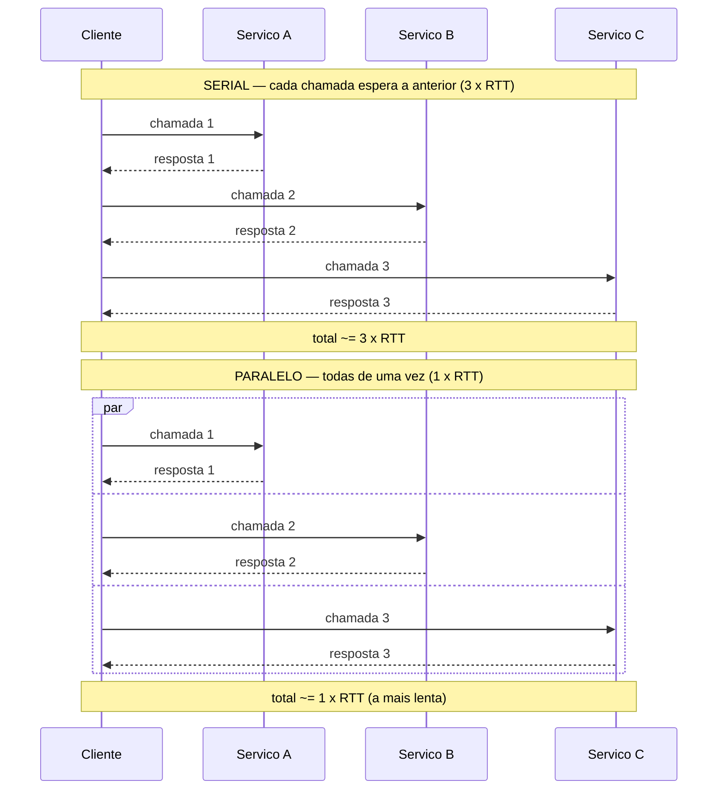

# Latência, throughput e os números

> [!abstract] Resumo em uma linha
> Latência é o tempo de UMA operação, throughput é o volume por segundo, bandwidth é o teto do canal — e a hierarquia memória → disco → rede tem ordens de grandeza que justificam quase toda decisão de system design.

Todo senior carrega uma planilha mental. Não os números exatos — esses mudam com o hardware. As **ordens de grandeza**. Quando alguém propõe "vamos buscar isso do banco a cada request", o senior já ouve o custo: um salto de microssegundos (cache local) para milissegundos (rede). Mil vezes mais caro. A intuição não vem de decorar; vem de internalizar a pirâmide.

Esta nota é sobre essa pirâmide. E sobre os três termos que iniciantes confundem o tempo todo: latência, throughput e bandwidth.

## Os três termos que ninguém deveria confundir

Imagine um cano d'água ligando duas casas.

- A **largura do cano** é a **bandwidth**: a capacidade máxima de água que o cano comporta. É uma propriedade física do canal. Um cano grosso pode levar muita água; um fino, pouca.
- O **tempo que uma gota leva** para atravessar o cano de uma ponta à outra é a **latência**: quanto demora UMA operação a completar.
- A **água que de fato sai** pela outra ponta por segundo é o **throughput**: o volume real entregue, dado tudo que atrapalha no caminho.

> [!warning] Bandwidth ≠ throughput
> Bandwidth é o teto teórico. Throughput é o que você realmente obtém — sempre menor, porque cabeçalhos de protocolo, retransmissões, controle de congestão e contenção comem parte da capacidade. Um link de 1 Gbps (bandwidth) raramente entrega 1 Gbps de dados úteis (throughput).

E o ponto que confunde mais gente: **você pode ter bandwidth altíssima E latência altíssima ao mesmo tempo.** Um link de satélite geoestacionário pode transferir gigabytes por segundo (cano larguíssimo), mas cada pacote viaja ~36.000 km até o satélite e mais ~36.000 km de volta — RTT na casa dos 500 ms a 600 ms. Bandwidth de sobra; latência terrível.

A analogia clássica: um caminhão lotado de HDs cruzando o país tem **throughput** absurdo (petabytes em um dia) e **latência** péssima (você espera um dia inteiro pela primeira resposta). "Never underestimate the bandwidth of a station wagon full of tapes."

> [!tip] A pergunta diagnóstica
> Quando alguém diz "a rede está lenta", pergunte: lento para *uma* request (latência) ou lento para *muitas* requests (throughput)? São problemas diferentes, com soluções diferentes. Latência alta você ataca aproximando ou paralelizando; throughput baixo você ataca alargando o cano ou removendo gargalos.

## RTT e suas quatro componentes

A latência de uma operação de rede — o **RTT** (Round-Trip Time), o ida-e-volta — não é um número monolítico. Ela se decompõe em quatro partes, e só uma delas o dinheiro não compra.

1. **Propagação** — o tempo do sinal viajar pela distância física. Limitado pela velocidade da luz. Na fibra, a luz anda a ~66% da velocidade no vácuo (índice de refração ~1.5), ou seja ~200.000 km/s. Isso dá um piso de aproximadamente **1 ms a cada 100–200 km** de cabo. Esse é um limite **físico**.
2. **Transmissão** — o tempo de empurrar os bits para o fio. Depende do tamanho do pacote dividido pela bandwidth. Cano mais largo → menos tempo de transmissão.
3. **Fila** (queuing) — o pacote esperando em buffers de roteadores congestionados. Variável e imprevisível; é a principal fonte de jitter.
4. **Processamento** — roteadores inspecionando cabeçalhos, decidindo rotas, fazendo NAT/firewall.

> [!important] O piso que dinheiro nenhum compra
> Propagação é regida pela velocidade da luz — uma constante do universo. Nova York ↔ Londres tem ~5.500 km de fibra; mesmo na linha reta teórica, a luz na fibra leva ~28 ms só de ida. Na prática o RTT fica perto de **70–80 ms** com os desvios reais do cabeamento. Nenhum upgrade de servidor, nenhuma otimização de código resolve isso. A única saída é **encurtar a distância física** — e é exatamente por isso que CDNs existem. Ver [[13 - Load balancing e CDN]].

Isso explica por que latência intercontinental tem um piso. Você pode comprar o melhor hardware do mundo; a luz continua levando o tempo que leva para cruzar o oceano.

## A tabela que todo programador deveria conhecer

Esta é a tabela canônica, popularizada por **Jeff Dean** (Google) a partir de números compilados também por **Peter Norvig**. Os valores absolutos envelhecem com o hardware — SSDs ficaram muito mais rápidos desde a versão original de ~2012 — então trate-os como **ordens de grandeza**, não como verdade gravada em pedra.

| Operação | Latência aproximada | Em escala humana (×1 bilhão) |
| --- | --- | --- |
| Referência em cache L1 | ~1 ns | 1 segundo |
| Branch mispredict | ~3 ns | 3 segundos |
| Referência em cache L2 | ~4–7 ns | ~5 segundos |
| Mutex lock/unlock | ~25 ns | 25 segundos |
| Acesso à RAM (main memory) | ~100 ns | ~1,5 minuto |
| Leitura sequencial 1 MB da RAM | ~3–10 μs | ~1–3 horas |
| SSD random read | ~16–100 μs | ~5 horas a 1 dia |
| Round-trip no mesmo datacenter | ~0,5 ms | ~6 dias |
| Leitura 1 MB do SSD | ~50–1.000 μs | dias |
| Seek de HDD (disco mecânico) | ~10 ms | ~4 meses |
| Round-trip mesma região (AZ↔AZ) | ~1 ms | ~11 dias |
| Round-trip inter-região (continental) | ~30–100 ms | ~1–3 anos |
| Round-trip intercontinental | ~100–300 ms | ~3–10 anos |

A coluna da direita multiplica tudo por 1 bilhão para trazer os números para a escala humana. Ela revela o que importa: se um acesso à cache L1 fosse 1 segundo, um seek de HDD seria **4 meses** e uma viagem intercontinental seriam **anos**.

> [!note] Não decore. Internalize os saltos.
> O valor não está em saber que RAM é 100 ns. Está em sentir os degraus:
> - **Cache → RAM**: ~100× mais lento.
> - **RAM → SSD**: ~100–1000× mais lento.
> - **SSD/disco local → rede no datacenter**: outro salto grande.
> - **Datacenter → outra região**: ~100× mais lento que rede local.
>
> Cada degrau é uma ordem de grandeza ou mais. É essa sequência que sua intuição precisa cantar de cor.

O diagrama abaixo desenha a pirâmide. Note como cada degrau abaixo é dramaticamente mais caro que o de cima.

Leitura do diagrama: descendo a pirâmide, a cor esquenta e o custo dispara. O verde (memória) é o reino dos nanossegundos; o amarelo (SSD) salta para microssegundos; o laranja/vermelho (rede e disco mecânico) entra nos milissegundos. Cada transição de cor é pelo menos uma ordem de grandeza. O fundo da pirâmide — intercontinental — é onde a física, não a engenharia, manda.

## Por que esses números justificam quase tudo

Internalizada a pirâmide, metade do system design vira consequência óbvia.

- **Por que caching importa**: cache evita o salto caro. Servir da RAM (~100 ns) em vez de ir ao banco remoto (~1 ms+) é mil vezes mais rápido. É o motivo de [[08 - Caching HTTP]] e de caches de aplicação existirem. Cada hit de cache é um salto da pirâmide que você não pagou.
- **Por que banco local > banco remoto**: colocar o banco na mesma região da aplicação (~1 ms) em vez de cruzar o continente (~30–100 ms) corta a latência de cada query em 30–100×. Co-localização não é detalhe; é arquitetura.
- **Por que CDN existe**: não dá para vencer a velocidade da luz, então CDNs **aproximam fisicamente** o conteúdo do usuário. Em vez de 200 ms até o servidor de origem do outro lado do mundo, 10 ms até o edge mais próximo. Ver [[13 - Load balancing e CDN]] e [[04 - DNS]] (que escolhe o edge).
- **Por que minimizar round-trips é a regra de ouro**: se cada round-trip custa dezenas de milissegundos, fazer dez em série custa centenas de milissegundos. A regra de ouro do system design de performance é: **reduza o número de round-trips serializados.** É também por isso que protocolos como o do [[02 - TCP]] sofrem com o handshake e o slow start — cada um custa RTTs antes de qualquer dado útil trafegar.

> [!tip] O reflexo do senior
> Antes de otimizar um algoritmo de O(n²) para O(n log n), pergunte: esse código está fazendo uma chamada de rede dentro do loop? Porque uma chamada de rede dentro do loop derrota qualquer melhoria de complexidade. O salto para a rede domina tudo.

## Tail latency: a média mente

Aqui está o conceito que separa o pleno do senior. Você mede a latência de um serviço e vê "média de 20 ms". Parece ótimo. Mas a média **esconde a cauda**.

O que mata a experiência do usuário não é a média; é o **p99** — o percentil 99, o valor que 99% das requests ficam abaixo. Se seu p99 é 800 ms, significa que **1 em cada 100 requests** demora quase um segundo. Para um usuário fazendo dezenas de ações, ele vai bater nessa cauda toda hora.

> [!quote] The Tail at Scale (Dean & Barroso, 2013)
> Em um serviço onde cada request precisa consultar 100 backends em paralelo, se cada backend tem só **1% de chance** de estar lento (p99 = 10 ms), a chance de **pelo menos um** estar lento é 1 − (0,99)¹⁰⁰ ≈ **63%**. A latência percebida pelo usuário, que espera por todos, tende ao p99 de um deles — não à média.

Isso é o **fan-out amplificando a cauda**. Quanto mais subsistemas uma request toca, mais provável que ela esbarre na cauda lenta de pelo menos um. Em escala, o p99 individual vira o caso comum do todo.

Leitura do diagrama: a request abre em 100 chamadas paralelas. Quase todas voltam rápido (5 ms), mas basta UMA cair na cauda lenta (vermelho, 800 ms) para a resposta final — que precisa de todos — ficar travada nesse pior caso. Com 100 backends, a probabilidade de ao menos um estar na cauda é alta. Por isso o p99 de um backend vira a experiência típica do agregado.

> [!important] Implicação prática
> Otimize a cauda, não só a média. Técnicas como **hedged requests** (mandar a mesma request a dois backends e usar a primeira resposta) atacam exatamente isso — no paper original, hedging cortou um p99 de 1.800 ms para 74 ms inflando o trabalho total em só ~2%. Monitore p95/p99/p999, nunca apenas a média. E veja [[14 - Resiliência de rede]] para timeouts e retries que limitam a cauda.

## A regra dos round-trips

Cada round-trip **serial** soma um RTT inteiro. Faça três chamadas em sequência, onde a segunda depende da primeira e a terceira da segunda, e você paga 3×RTT antes de a primeira linha de resposta sair. Faça as três em **paralelo** (quando não há dependência) e você paga só 1×RTT — o tempo da mais lenta.

Leitura do diagrama: no bloco serial, cada chamada só parte depois que a anterior volta — os RTTs empilham. No bloco paralelo (`par`), as três disparam juntas e o cliente espera apenas a mais lenta. Mesmo trabalho, mesma rede; o que muda é o **agendamento**. Se houver dependência real entre as chamadas, você é obrigado a serializar; se não houver, serializar é desperdício puro.

A consequência: **paralelize o que for independente; faça batch do que for repetitivo.** Em vez de N queries de um item cada (N round-trips), uma query de N itens (1 round-trip). Em vez de chamadas encadeadas, um fan-out paralelo.

> [!example] O caso clássico (ver capstone)
> Um endpoint que demorava 1,5 s porque fazia três chamadas HTTP **sequenciais** caiu para ~200 ms ao paralelizá-las — a soma virou o máximo. É o exemplo de debugging que vive em [[15 - Redes em entrevista]]; aqui só registramos o princípio, lá está a história completa.

## Em entrevista

In interviews, define the three terms crisply: latency is the time for one operation, throughput is volume per second, and bandwidth is the channel's ceiling — you can have high bandwidth and high latency at the same time (satellite links). I always mention that cross-continent latency has a physical floor set by the speed of light in fiber, roughly 1 ms per 100–200 km, which no amount of money buys away — that is why CDNs move content physically closer. I lean on the "latency numbers every programmer should know" hierarchy as orders of magnitude, not memorized constants: the jumps from cache to RAM to SSD to network are what drive caching, co-located databases, and minimizing round-trips. For senior signal, I bring up tail latency — the average lies, p99 is what users feel, and fan-out amplifies the tail, so a request touching 100 backends tends toward one backend's p99. Finally I state the round-trip rule: serial round-trips add up, so parallelize independent calls and batch repetitive ones. A concrete story (a 1.5 s endpoint cut to 200 ms by parallelizing three sequential HTTP calls) lands this well.

### Vocabulário

- latência → latency
- vazão / volume por segundo → throughput
- largura de banda / capacidade do canal → bandwidth
- ida-e-volta → round-trip (RTT)
- tempo de propagação → propagation delay
- atraso de fila → queuing delay
- velocidade da luz na fibra → speed of light in fiber
- cauda de latência → tail latency
- percentil 99 → 99th percentile (p99)
- amplificação por fan-out → fan-out amplification
- chamadas em série → serial / sequential calls
- chamadas em paralelo → parallel calls
- agrupar em lote → to batch
- requisições redundantes → hedged requests
- ordem de grandeza → order of magnitude
- gargalo → bottleneck

> [!info] Lastro
> - [Latency Numbers Every Programmer Should Know — gist jboner/2841832](https://gist.github.com/jboner/2841832) (números canônicos, atribuídos a Jeff Dean / Peter Norvig)
> - [Colin Scott — Latency Numbers (interactive, por ano)](https://colin-scott.github.io/personal_website/research/interactive_latency.html) (mostra como os números envelhecem com o hardware)
> - Dean, J. & Barroso, L. A. — ["The Tail at Scale", CACM 56(2), 2013, pp. 74–80](https://www.semanticscholar.org/paper/The-tail-at-scale-Dean-Barroso/0831a5baf38c9b3d43c755319a602b15fc01c52d) (p99, fan-out, hedged requests)
> - Grigorik, I. — [High Performance Browser Networking, cap. "Primer on Latency and Bandwidth"](https://hpbn.co/primer-on-latency-and-bandwidth/) (componentes do RTT, velocidade da luz na fibra ~66% de c)

## Veja também

- [[02 - TCP]] — handshake e slow start custam RTTs antes do primeiro byte útil
- [[08 - Caching HTTP]] — caching como forma de pular o salto caro da pirâmide
- [[13 - Load balancing e CDN]] — aproximar fisicamente para vencer a propagação
- [[04 - DNS]] — escolhe o edge mais próximo; também adiciona RTTs
- [[14 - Resiliência de rede]] — timeouts e retries que domam a cauda
- [[15 - Redes em entrevista]] — capstone com o caso do endpoint de 1,5 s → 200 ms
- [[System Design]] — onde esses números viram decisões de arquitetura
- [[03-Dominios/Fundamentos/Redes e Protocolos/index|Redes e Protocolos]]
