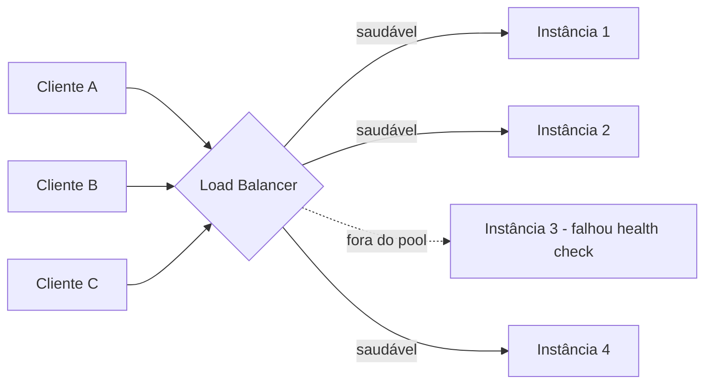
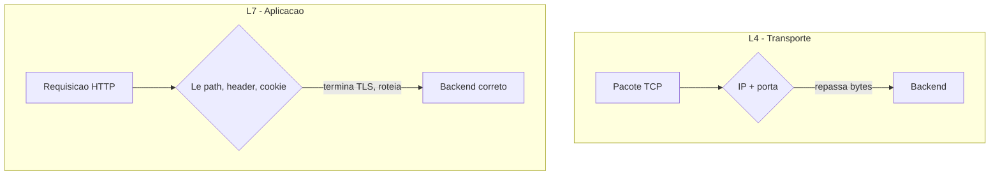
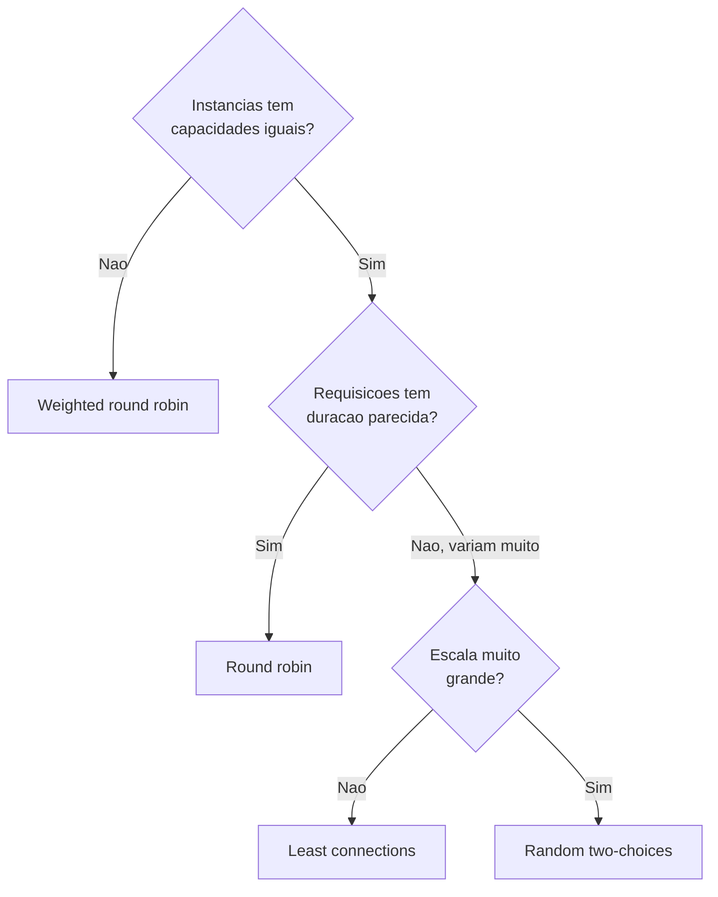
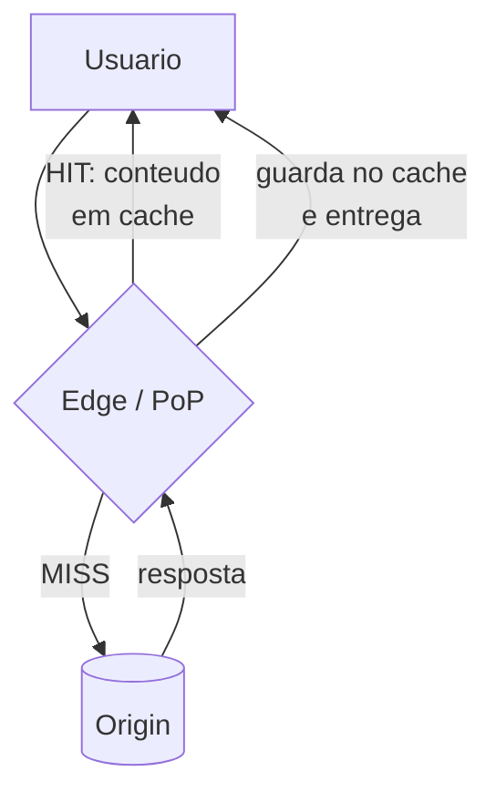

# Load balancing e CDN

> [!abstract] Resumo em uma linha
> Load balancer distribui tráfego entre instâncias para escalar e tolerar falhas; CDN cacheia conteúdo perto do usuário para cortar latência — e ambos são, no fundo, intermediários de rede que terminam protocolo e tomam decisões de roteamento antes do backend ver qualquer coisa.

Imagine um banco movimentado. Uma única recepcionista atendendo a fila inteira é o gargalo: se ela tropeça, ninguém é atendido. Você contrata cinco caixas e coloca um recepcionista na porta que olha a fila de cada um e manda você pro caixa mais livre. Isso é um **load balancer**.

Agora imagine que o cofre fica em São Paulo, mas seus clientes estão espalhados pelo Brasil inteiro. Em vez de todos viajarem até a matriz, você abre uma **filial perto de cada cliente** com cópia dos documentos mais pedidos. Isso é uma **CDN**.

Os dois resolvem problemas diferentes — um distribui carga, o outro aproxima conteúdo — mas vivem na mesma camada da sua arquitetura: na **borda**, entre o usuário e o seu servidor de origem.

> [!info] Onde esta nota para e onde o System Design começa
> Aqui é o **fundamento de rede**: como LB e CDN funcionam no nível de tráfego e protocolo. *Quando* e *onde* colocá-los na arquitetura, capacity planning, quantos níveis de balanceamento, custo — isso é decisão de sistema e mora em [[System Design]]. Esta nota te dá o vocabulário; lá você compõe.

---

## Load balancing — o que e por quê

Um load balancer (LB) fica na frente de um conjunto de instâncias idênticas do seu serviço e reparte o tráfego entre elas. Por que isso importa tanto?

- **Remove o ponto único de falha.** Uma instância caiu? O LB para de mandar tráfego pra ela e o resto do mundo nem percebe.
- **Permite escala horizontal.** Tráfego dobrou? Você sobe mais instâncias atrás do LB em vez de comprar uma máquina gigante (escala vertical, que tem teto físico e preço exponencial).
- **Centraliza responsabilidades de borda.** Terminação TLS, rate limiting, roteamento — tudo num lugar só, longe do código de negócio.

> [!tip] A pergunta-chave
> "Qual instância recebe a próxima requisição?" Toda a riqueza do load balancing está em responder isso bem — e a resposta muda conforme a *camada* em que o LB opera e o *algoritmo* que ele usa.

Lead-in: o desenho mostra o papel básico do LB — um funil que recebe N clientes e os espalha por M instâncias, removendo as que falharam.

Leitura do diagrama: três clientes chegam no LB. Ele distribui para as instâncias 1, 2 e 4. A instância 3 reprovou no health check (seta tracejada) e foi temporariamente removida do pool — nenhum tráfego vai pra ela até voltar a responder. O cliente não sabe nem que ela existe.

---

## L4 × L7 — em qual camada o LB pensa

Esta é a distinção mais importante da nota. Um LB pode operar em duas camadas do [[01 - O que é uma rede e o modelo de camadas|modelo de camadas]], e a escolha é um trade-off direto entre **velocidade** e **inteligência**.

### L4 — load balancing de transporte

O LB de camada 4 trabalha sobre TCP/UDP. Ele enxerga **IP de origem/destino e porta** — e mais nada. Não abre o pacote, não sabe se aquilo é HTTP, gRPC ou um stream de vídeo. Só decide "essa conexão vai pra instância X" e repassa os bytes.

- **Rápido e barato.** Decisão trivial, baixíssima latência, pouca CPU. Lida com volumes enormes.
- **Cego ao conteúdo.** Não roteia por URL, não inspeciona cookie, não termina TLS (o TLS passa direto pro backend).
- Exemplos: AWS Network Load Balancer (NLB), HAProxy em modo TCP.

### L7 — load balancing de aplicação

O LB de camada 7 **termina a conexão**, lê a requisição HTTP inteira e decide com base no conteúdo: path, headers, cookies, método. É o recepcionista que lê o que você quer antes de mandar pro caixa certo.

- **Roteamento inteligente.** `/api/*` vai pra um pool, `/static/*` pra outro; mobile vai pra um grupo, web pra outro.
- **Termina TLS.** Faz o handshake [[05 - TLS e HTTPS|HTTPS]] na borda e fala HTTP em texto claro com o backend dentro da rede privada (linke também a negociação de protocolo, mais abaixo).
- **Recursos de borda.** Session persistence, filtragem application-aware, rewrite de header.
- **Mais lento e caro.** Abrir e remontar cada requisição custa CPU. Ainda assim, dominante na web moderna.
- Exemplos: Nginx, AWS Application Load Balancer (ALB), Envoy.

Lead-in: compare o que cada camada *vê* antes de decidir.

Leitura do diagrama: no L4 (cima), a decisão é tomada sobre o par IP+porta — o LB nem olha dentro do pacote, só encaminha. No L7 (baixo), o LB abre a requisição HTTP, lê path/header/cookie, termina o TLS e só então escolhe o backend certo. Mais informação, mais inteligência, mais custo.

> [!note] Regra de bolso
> Precisa de throughput bruto sobre TCP/UDP puro (banco, jogos, streaming, gRPC sem inspeção)? **L4**. Precisa rotear por conteúdo HTTP, terminar TLS ou aplicar regras de aplicação? **L7**. Muitos sistemas reais usam os dois empilhados: L4 na entrada da rede, L7 mais perto do serviço.

---

## Algoritmos de distribuição

Decidido em qual camada o LB opera, falta o algoritmo: *como* ele escolhe a instância. Não existe um melhor — existe o certo pro seu tráfego.

| Algoritmo | Como decide | Quando usar |
|---|---|---|
| **Round robin** | Rodízio fixo: 1, 2, 3, 1, 2, 3... ignora carga | Instâncias homogêneas, requisições de custo parecido |
| **Weighted round robin** | Round robin com pesos; máquina mais forte recebe proporcionalmente mais | Frota heterogênea (instâncias de tamanhos diferentes) |
| **Least connections** | Manda pra quem tem menos conexões ativas agora | Requisições de duração variável (conexões longas, WebSocket) |
| **Least response time** | Combina conexões ativas + menor tempo de resposta medido | Quando latência por instância varia muito |
| **IP hash** | Hash do IP do cliente → sempre a mesma instância | Afinidade de sessão "barata" (mas veja sticky sessions abaixo) |
| **Random (two-choices)** | Sorteia duas instâncias e manda pra menos carregada das duas | Escala enorme; aproxima least-connections sem estado global |

> [!tip] "Power of two choices"
> Round robin é simples mas burro: não olha a carga real. Least connections é preciso mas exige estado coordenado, o que dói em escala. O truque *two random choices* — sortear duas instâncias e mandar pra menos ocupada — é quase tão bom quanto least-connections com uma fração do custo de coordenação. É o default sensato em sistemas grandes.

Lead-in: uma árvore de decisão prática para escolher o algoritmo.

Leitura do diagrama: comece pela homogeneidade da frota — se as máquinas diferem em capacidade, pese o round robin. Se são iguais, pergunte se as requisições custam parecido: se sim, round robin puro basta; se variam (conexões longas), você quer least connections — exceto em escala enorme, onde two-choices entrega quase o mesmo sem o custo de estado global.

---

## Health checks — quem está vivo no pool

O LB só serve pra alguma coisa se souber **quais instâncias estão saudáveis**. Mandar tráfego pra uma instância morta é pior do que não ter LB nenhum. Há dois jeitos de descobrir:

- **Passivo** — o LB observa o tráfego real. Se uma instância começa a dar timeout ou 5xx, ele a marca como suspeita. Reação **instantânea** ao primeiro erro, custo zero de probe, mas só descobre o problema *depois* de um usuário sofrer.
- **Ativo** — o LB faz probes periódicos por conta própria, independente do tráfego. Detecta falhas silenciosas (instância travada que ninguém acessou ainda), ao custo de gerar volume de probe.

Na prática você combina os dois: passivo pra reagir na hora, ativo pra varrer o silêncio.

E há **profundidades** de check ativo:

- **TCP** — só abre conexão na porta. Confirma que o processo aceita socket. Raso e rápido.
- **HTTP** (`GET /health`) — confirma que a aplicação responde 200. Verifica o processo *e* o stack web.
- **Deep** — o endpoint checa **dependências**: banco, cache, fila. "Eu consigo de fato atender?"

> [!warning] A armadilha do deep health check
> Deep check parece ótimo até virar uma bomba. Imagine 20 instâncias cujo `/health` consulta o mesmo banco. O banco hesita por 2 segundos. **Todas as 20** reprovam o health check ao mesmo tempo. O LB esvazia o pool inteiro — agora você tem zero instâncias servindo por causa de uma soluçada do banco que talvez nem afetasse o tráfego real. O remédio: health checks rasos para o LB decidir entrada/saída do pool, e monitore dependências por outro canal (alarme, não desligamento). Veja [[14 - Resiliência de rede]] para padrões de falha em cascata.

---

## Sticky sessions — o anti-padrão sedutor

*Session affinity* (ou sticky sessions) amarra um cliente sempre à mesma instância — via cookie injetado pelo LB ou via IP hash. Tentador: "guardo o estado da sessão em memória na instância e pronto".

O problema é que isso quebra justamente o que o LB te deu:

- **Atrapalha o scaling.** Subiu uma instância nova? Ela fica vazia porque os clientes velhos estão grudados nas antigas.
- **Atrapalha o failover.** A instância do cliente caiu? A sessão dele evaporou junto.
- **Desbalanceia.** Um cliente pesado fica preso numa instância que vira o gargalo.

A saída senior é **externalizar a sessão**: guarde estado num store compartilhado (Redis) ou torne o serviço *stateless* com a sessão no próprio token ([[05 - TLS e HTTPS|JWT]] assinado). Aí qualquer instância atende qualquer cliente, e o LB pode usar o algoritmo que quiser.

> [!note] A exceção legítima: WebSocket
> [[11 - WebSocket e SSE|WebSocket]] é uma conexão de longa duração presa a uma instância por natureza — uma vez estabelecida, fica lá. Isso exige *ou* sticky no handshake inicial, *ou* uma camada de pub/sub (Redis, broker) que propague mensagens entre instâncias para que qualquer uma possa empurrar dados pro cliente certo. Aqui o "stickiness" é da natureza do protocolo, não uma muleta de estado.

---

## CDN — cache de borda

Vira a chave: load balancer reparte carga; **CDN aproxima conteúdo**. Uma CDN é uma rede de servidores espalhados geograficamente (os **PoPs** — *points of presence*, ou edge servers) que guardam cópias do seu conteúdo perto dos usuários.

Por que isso é tão poderoso?

- **Corta latência.** A maior parte do tempo de uma requisição é a luz indo e voltando pelo cabo. Servir de um edge a 20 ms do usuário em vez do origin a 200 ms é uma vitória enorme — e lembra que latência é dominada por distância física, não banda (veja [[12 - Latência, throughput e os números]]).
- **Absorve picos.** Uma notícia viralizou? O edge serve milhões de cópias cacheadas; o origin nem sente.
- **Protege o origin.** Menos tráfego chegando na sua infra significa menos carga e uma camada a mais contra DDoS.

### O que a CDN cacheia

- **Estáticos** — imagens, CSS, JS, vídeo, fontes. O caso clássico, quase sempre cacheável.
- **Respostas de API** — quando os headers permitem. Aqui a CDN simplesmente respeita as regras de [[08 - Caching HTTP|Caching HTTP]]: `Cache-Control`, `ETag`, `Vary`. Se a resposta diz que pode cachear por 60 s, o edge cacheia por 60 s.
- **Edge compute** — código rodando no próprio PoP (Cloudflare Workers, Lambda@Edge) para personalizar respostas sem voltar ao origin.

Lead-in: a vida de uma requisição que passa por CDN, nos dois caminhos possíveis.

Leitura do diagrama: o usuário sempre fala com o edge mais próximo. Se o conteúdo está em cache (HIT), o edge responde na hora — rápido, e o origin nem fica sabendo. Se não está (MISS), o edge busca no origin, guarda a cópia e entrega. A próxima requisição igual vira HIT. A meta é maximizar a taxa de HIT.

### Pull × push

- **Pull CDN** — o edge busca no origin *sob demanda*, no primeiro MISS, e cacheia. Zero gestão manual; o conteúdo "esquenta" conforme é pedido. Default da maioria.
- **Push CDN** — você *empurra* o conteúdo pros edges antecipadamente. Latência mínima já na primeira requisição, bom pra conteúdo grande e previsível (um lançamento de vídeo). Custa gestão e armazenamento.

### Como o usuário chega no edge certo

Dois mecanismos roteiam o cliente pro PoP mais próximo:

- **Anycast** — vários edges anunciam **o mesmo IP**; o roteamento BGP da internet entrega o pacote ao PoP mais próximo na topologia de rede. Bônus: se um PoP cai, o BGP reencaminha sozinho pro próximo (failover automático), e o IP único ajuda a absorver DDoS.
- **GeoDNS** — o [[04 - DNS]] devolve IPs diferentes conforme a localização de quem perguntou, mandando o usuário pro edge geográfico certo.

---

## Invalidação de CDN — o problema difícil

> Há só duas coisas difíceis em computação: invalidação de cache e nomear coisas. — adágio atribuído a Phil Karlton

Cachear é fácil; saber *quando o cache está velho* é o pesadelo. Você publicou uma correção no `app.js`, mas metade do planeta ainda recebe a versão antiga do edge. Três estratégias, em ordem de elegância:

- **Cache busting por hash no nome** — o arquivo vira `app.a3f9c.js`, onde o hash muda quando o conteúdo muda. Conteúdo novo = nome novo = URL nova = nunca colide com o velho. Você marca esses arquivos como `immutable` com TTL longuíssimo. **É a melhor solução** porque elimina a invalidação: nunca precisa apagar nada, só aponta o HTML pra nova URL.
- **Purge por API** — você chama a API da CDN e manda apagar um caminho específico de todos os edges. Funciona, mas é uma operação eventualmente consistente e propaga com atraso.
- **TTL curto + `stale-while-revalidate`** — TTL baixo para refrescar logo, e a diretiva `stale-while-revalidate` deixa o edge servir a cópia velha *enquanto* busca a nova em background. O usuário nunca espera; a atualização chega na requisição seguinte.

> [!tip] Origin shield
> Num MISS global simultâneo (cache acabou de expirar em todos os PoPs), milhares de edges batem no origin ao mesmo tempo — um *thundering herd*. O **origin shield** põe um PoP intermediário entre os edges e o origin: os edges consultam o shield, o shield consolida e faz *uma* busca no origin. O origin enxerga uma requisição, não mil.

---

## Negociação de protocolo na borda

Um detalhe que confunde muita gente: **quem termina TLS e negocia a versão do HTTP é o LB ou a CDN na borda — não o seu backend**.

O cliente faz o handshake [[05 - TLS e HTTPS|TLS]] com o edge e negocia ali se vai falar HTTP/2 ou HTTP/3 (via ALPN — veja a [[07 - A evolução do HTTP|evolução do HTTP]]). Da borda pro seu servidor, a comunicação costuma ser HTTP/1.1 simples dentro da rede privada, ou texto claro.

Isso significa que seu backend pode ser ignorante a respeito de TLS e de HTTP/3 inteiramente — a borda traduz. Você ganha HTTP/3 pros usuários "de graça", só ligando na config da CDN, sem tocar uma linha do código de aplicação. A complexidade do protocolo moderno fica encapsulada na borda, transparente pro que está atrás.

---

## Em entrevista

A layer-4 load balancer routes by IP and port without inspecting the payload, so it is fast and cheap but cannot make content-based decisions. A layer-7 balancer terminates the connection, reads the HTTP request, and routes by path, header, or cookie, which is slower but enables smart routing and TLS termination at the edge. For algorithm choice I default to round robin for homogeneous fleets and least connections — or power-of-two-choices at large scale — when request durations vary widely. I avoid sticky sessions because they undermine scaling and failover; I prefer externalizing state to Redis or a stateless JWT, with WebSocket being the legitimate exception. A CDN cuts latency by caching content at edge PoPs close to the user, absorbs traffic spikes, and shields the origin, with Anycast or GeoDNS steering clients to the nearest edge. For cache invalidation I reach first for content-hashed filenames marked immutable, since that sidesteps invalidation entirely, falling back to API purge or short TTLs with stale-while-revalidate. One trap I always flag is the deep health check that consults a shared database — a brief database hiccup can fail every instance at once and empty the entire pool.

### Vocabulário

- balanceamento de carga → load balancing
- camada de transporte → transport layer (L4)
- camada de aplicação → application layer (L7)
- terminação TLS → TLS termination
- rodízio → round robin
- menos conexões → least connections
- afinidade de sessão / sessão grudenta → session affinity / sticky sessions
- verificação de saúde → health check
- raso × profundo → shallow vs deep
- sair do pool → drained / removed from the pool
- cache de borda → edge cache
- servidor de origem → origin server
- acerto × erro de cache → cache hit vs miss
- invalidação de cache → cache invalidation
- expurgo → purge
- escudo de origem → origin shield
- falha em cascata → cascading failure
- ponto de presença → point of presence (PoP)

> [!info] Lastro
> - [Layer 4 vs Layer 7 Load Balancing — A10 Networks](https://www.a10networks.com/glossary/how-do-layer-4-and-layer-7-load-balancing-differ/)
> - [What is Load Balancing? — Load Balancing Algorithms Explained — AWS](https://aws.amazon.com/what-is/load-balancing/)
> - [What is an Origin Server / Origin vs Edge — Imperva](https://www.imperva.com/learn/performance/origin-server/)
> - [Choosing the right health check with Elastic Load Balancing — AWS Networking Blog](https://aws.amazon.com/blogs/networking-and-content-delivery/choosing-the-right-health-check-with-elastic-load-balancing-and-ec2-auto-scaling/)

## Veja também

- [[01 - O que é uma rede e o modelo de camadas]] — as camadas onde L4 e L7 operam
- [[04 - DNS]] — GeoDNS e Anycast roteando o cliente pro edge
- [[05 - TLS e HTTPS]] — terminação TLS na borda
- [[07 - A evolução do HTTP]] — HTTP/2 e HTTP/3 negociados no edge
- [[08 - Caching HTTP]] — os headers que a CDN respeita
- [[11 - WebSocket e SSE]] — por que WS é a exceção do sticky session
- [[12 - Latência, throughput e os números]] — por que aproximar conteúdo corta latência
- [[14 - Resiliência de rede]] — falha em cascata e padrões de tolerância
- [[System Design]] — quando, onde e em quantos níveis compor LB e CDN
- [[15 - Redes em entrevista]] — consolidação para entrevista
- [[03-Dominios/Fundamentos/Redes e Protocolos/index|Redes e Protocolos]]
