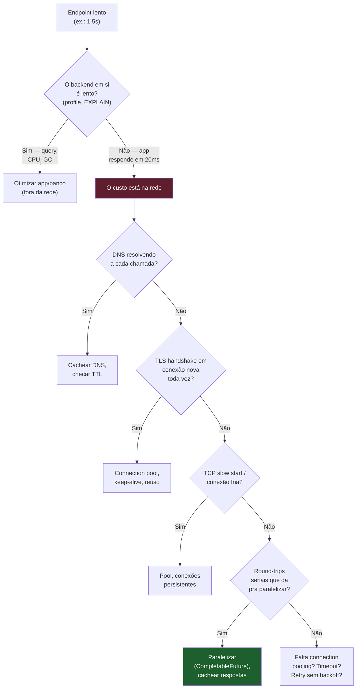
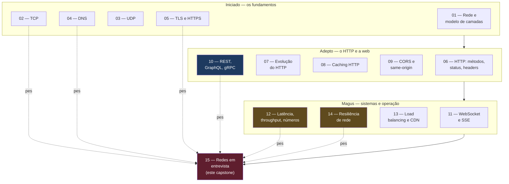

# Redes em entrevista

> [!tip] Resumo em uma linha
> Entrevista de rede tem duas faces — projetar comunicação (system design) e rastrear lentidão camada por camada (debugging) — e o segredo é tratar a rede como uma pilha de suspeitos nomeáveis, não como uma caixa-preta mágica.

As 14 notas anteriores deste galho ensinaram o conteúdo: o que acontece quando um pacote sai da sua máquina, como o TCP garante entrega, por que o TLS custa um round-trip, o que o DNS resolve, como o HTTP cacheia, quando usar gRPC em vez de REST. Esta nota não ensina nada disso de novo. Ela ensina a **performar** esse conhecimento numa sala de entrevista — a transformar 14 notas de teoria em frases que fazem o entrevistador anotar "sabe de rede de verdade".

A diferença entre saber rede e *parecer* que sabe rede, na entrevista, é estrutura. Quem sabe nomeia camadas; quem decorou fala "deve ser lentidão da internet".

---

## 1. As duas faces de networking em entrevista

Toda pergunta de rede numa entrevista cai num de dois baldes. Reconhecer qual deles é o primeiro movimento.

**System design — projetar a comunicação.** "Projete o sistema de notificações", "como dois serviços conversam aqui", "desenhe a API pública disso". Aqui você está *escolhendo*: protocolo, síncrono ou assíncrono, onde cachear, como distribuir carga, como sobreviver a falha. É uma conversa de trade-offs, não de fatos.

**Debugging — rastrear a lentidão.** "Esse endpoint está lento, como você investiga?", "a latência dobrou em produção, por onde começa?". Aqui você está *eliminando suspeitos*: é DNS? TLS? TCP? a aplicação? chamadas seriais? É um interrogatório metódico da pilha.

A maioria dos candidatos só treina a primeira face. A segunda — debugging de latência — é onde o conhecimento de rede realmente separa quem leu de quem viveu. As seções 2 e 3 atacam cada face; o resto da nota é munição (frases, vocabulário, armadilhas) que serve às duas.

```mermaid
flowchart TD
    Q["Pergunta de rede<br/>na entrevista"] --> TIPO{"Projetar ou<br/>investigar?"}
    TIPO -->|"&#34;projete a<br/>comunicação&#34;"| SD["System design<br/>escolher trade-offs"]
    TIPO -->|"&#34;está lento,<br/>investigue&#34;"| DBG["Debugging<br/>eliminar suspeitos<br/>camada por camada"]
    SD --> CHK["Checklist: protocolo,<br/>sync/async, cache,<br/>balanceamento, resiliência"]
    DBG --> ARV["Árvore de diagnóstico:<br/>DNS? TLS? TCP?<br/>app? round-trips seriais?"]

    style SD fill:#1e3a5f,color:#fff
    style DBG fill:#5f1e2e,color:#fff
```

**Leitura do diagrama:** a primeira bifurcação que você faz mentalmente é o tipo da pergunta. System design puxa o checklist da seção 3; debugging puxa a árvore de diagnóstico da seção 2. Errar o balde — atacar "está lento" desenhando uma arquitetura nova — é o erro clássico de quem está nervoso.

---

## 2. Debugging de latência rastreando as camadas

Esta é a face que mais impressiona, porque exige um modelo mental de rede que poucos têm. E nada ensina o método melhor do que um caso real.

> [!example] O endpoint de 1.5s que virou 200ms
> Um endpoint estava levando ~1.5s para responder. O `EXPLAIN ANALYZE` do banco mostrava 20ms — o banco estava inocente. O problema era que a aplicação fazia **3 chamadas HTTP síncronas sequenciais** a um serviço externo durante a request: para cada chamada, pagava DNS (não cacheado) + TLS handshake + a resposta em si, repetido três vezes. Três conexões novas, três handshakes, em série.
>
> A solução teve três frentes: **paralelizar** as chamadas com `CompletableFuture` (de série para paralelo), **cachear** as respostas com TTL curto no Redis (muitas eram idênticas), e **cachear DNS** localmente (parar de resolver o mesmo host repetidamente). Caiu de 1.5s para **200ms**.

Repare no que esse caso ensina: o gargalo não estava no lugar "óbvio" (o banco). Estava na rede, escondido em chamadas que o framework abstraía. O método que destrincha isso é sempre o mesmo — **rastrear camada por camada, do mais barato de verificar ao mais caro de corrigir**.

A árvore de diagnóstico que eu percorro mentalmente:

**Leitura do diagrama:** a primeira eliminação é separar app de rede — o `EXPLAIN ANALYZE` faz isso. Confirmado que a app é rápida, você desce a pilha: DNS (`[[04 - DNS]]`) é o mais barato de verificar e cachear; depois o TLS handshake numa conexão nova (`[[05 - TLS e HTTPS]]`); depois TCP slow start numa conexão fria (`[[02 - TCP]]`); depois round-trips seriais que dá pra paralelizar (`[[12 - Latência, throughput e os números]]`); e por fim a ausência de connection pooling e timeouts (`[[14 - Resiliência de rede]]`). O caso real cruzou três desses nós de uma vez — DNS não cacheado + TLS repetido + serial — e por isso somava 1.5s.

Dizer em voz alta "deixa eu eliminar suspeitos por camada" e percorrer essa árvore é o que faz o entrevistador ver método, não chute.

---

## 3. System design de comunicação — o checklist

Quando a pergunta é "projete a comunicação deste sistema", você não improvisa: roda um checklist. Cada item é uma decisão com trade-off, e cada decisão tem uma nota-dona que carrega o porquê.

```mermaid
flowchart TD
    START["&#34;Projete a comunicação<br/>deste sistema&#34;"] --> PROTO["1. Qual protocolo?<br/>REST / gRPC / GraphQL /<br/>mensageria"]
    PROTO --> SYNC["2. Síncrono ou<br/>assíncrono?"]
    SYNC --> PUSH["3. Precisa push<br/>servidor→cliente?<br/>SSE / WebSocket"]
    PUSH --> CACHE["4. Onde cachear?<br/>HTTP cache + CDN"]
    CACHE --> LB["5. Como distribuir<br/>carga? Load balancer,<br/>edge"]
    LB --> RESIL["6. Como resistir<br/>a falha? Timeout,<br/>retry, circuit breaker"]
    RESIL --> NUM["7. Os números batem?<br/>RTT, throughput,<br/>round-trips"]

    style PROTO fill:#1e3a5f,color:#fff
    style RESIL fill:#5f1e2e,color:#fff
    style NUM fill:#5f4a1e,color:#fff
```

**Leitura do diagrama:** é um pipeline de sete perguntas, da escolha estrutural (protocolo) à validação aritmética (os números). Você não precisa responder todas em toda pergunta, mas tê-las na cabeça impede de esquecer a resiliência ou de propor algo cujos números não fecham.

Desdobrando cada passo:

1. **Qual protocolo.** REST sobre HTTP como default — cacheável, ferramental excelente, todo mundo entende. gRPC para comunicação interna entre serviços onde latência importa (Protobuf compacto, HTTP/2 multiplexado). GraphQL quando o cliente precisa moldar a query e evitar over/under-fetching. Mensageria quando o acoplamento temporal precisa sumir. Tudo isso em `[[10 - REST, GraphQL e gRPC]]`.
2. **Síncrono × assíncrono.** Request-response bloqueante ou fire-and-forget via fila? A resposta muda a tolerância a falha e a topologia inteira.
3. **Precisa de push?** Se o servidor precisa empurrar dados, SSE para fluxo unidirecional servidor→cliente, WebSocket só para bidirecional de verdade — `[[11 - WebSocket e SSE]]`.
4. **Onde cachear.** Cache HTTP com `Cache-Control`/`ETag`/`Vary` (`[[08 - Caching HTTP]]`) e CDN na borda para o que muda raramente (`[[13 - Load balancing e CDN]]`).
5. **Como distribuir carga.** Load balancer, escolha de algoritmo, sticky sessions ou não, edge — `[[13 - Load balancing e CDN]]`.
6. **Como resistir a falha.** Timeout, retry com backoff, circuit breaker, bulkhead — `[[14 - Resiliência de rede]]`.
7. **Os números.** RTT realista, throughput, quantos round-trips a operação custa de verdade — `[[12 - Latência, throughput e os números]]`.

Quando a pergunta cresce além da comunicação (capacidade, particionamento, consistência), o frame maior vive em `[[System Design]]`, e as decisões de superfície de API em `[[API Design]]`.

---

## Em entrevista

As três seções abaixo são o arsenal verbal: o monólogo pronto, as frases de transição e o vocabulário PT→EN. Decorar não — *internalizar*, para que saiam naturais sob pressão.

### 4. How to explain in English

O monólogo abaixo é um roteiro disfarçado de fala espontânea. Cada parágrafo cobre um bloco do galho, na ordem em que um entrevistador gosta de ouvir.

> "Networking is something I deal with daily as a fullstack developer, even if most of the time the framework abstracts it away. When I'm designing APIs, I default to REST over HTTP — it's well-understood, cacheable, and has excellent tooling. For internal microservice communication where latency matters, I evaluate gRPC, because Protocol Buffers are much more compact than JSON and HTTP/2 multiplexing reduces overhead significantly.
>
> One area where networking knowledge really pays off is debugging latency issues. When an endpoint is slow, I trace through the layers: is it DNS resolution? A TLS handshake on a new connection? TCP slow start? The application itself? Or is it making sequential HTTP calls to external services when it could parallelize them? I had exactly that situation — a 1.5-second endpoint turned out to be three sequential external calls. Parallelizing them and adding a short-lived Redis cache brought it down to 200 milliseconds.
>
> For caching, I rely heavily on HTTP cache semantics — Cache-Control, ETag, Vary. For data that changes rarely, like a list of medical specialties, setting proper cache headers means the CDN serves the response directly without ever hitting my backend. That's the cheapest performance win you can get.
>
> On real-time communication: I used to default to WebSocket, but I've learned that Server-Sent Events are simpler and sufficient when the flow is server-to-client only. SSE works with HTTP/2, reconnects automatically, and doesn't require special load balancer configuration. I reserve WebSocket for truly bidirectional use cases like chat."

Como o monólogo está montado:

- **Bloco 1 — default REST + quando gRPC.** Abre estabelecendo um default sensato e mostrando que você *escolhe* a exceção com critério (latência, Protobuf, HTTP/2). Liga a `[[10 - REST, GraphQL e gRPC]]` e `[[07 - A evolução do HTTP]]`.
- **Bloco 2 — debugging por camadas.** O coração. Lista os suspeitos na ordem da pilha e fecha com o caso real (1.5s→200ms), provando que você não só sabe a teoria, já a aplicou. Liga a `[[04 - DNS]]`, `[[05 - TLS e HTTPS]]`, `[[02 - TCP]]` e `[[12 - Latência, throughput e os números]]`.
- **Bloco 3 — caching HTTP + CDN.** Mostra domínio de semântica de cache e a noção de que o melhor request é o que não chega ao backend. Liga a `[[08 - Caching HTTP]]` e `[[13 - Load balancing e CDN]]`.
- **Bloco 4 — SSE × WebSocket.** Termina com uma escolha madura — mudar de opinião ("I used to default to WebSocket") sinaliza senioridade. Liga a `[[11 - WebSocket e SSE]]`.

### 5. Frases úteis em entrevista

Frases-âncora que enquadram um trade-off em uma sentença. Solte a que couber no momento certo:

- "The bottleneck is network latency, not compute — let's minimize round-trips." — `[[12 - Latência, throughput e os números]]`
- "I'd put a CDN in front of this to serve static assets and cacheable API responses from the edge." — `[[13 - Load balancing e CDN]]`
- "We should use connection pooling here to avoid paying the TCP + TLS handshake on every request." — `[[02 - TCP]]`, `[[05 - TLS e HTTPS]]`
- "I'd add exponential backoff with jitter to these retries to avoid a thundering herd." — `[[14 - Resiliência de rede]]`
- "This is a good candidate for SSE rather than WebSocket — the communication is server-to-client only." — `[[11 - WebSocket e SSE]]`
- "REST for the public API, gRPC internally between services where we need the performance." — `[[10 - REST, GraphQL e gRPC]]`
- "Let me check if the DNS TTL is reasonable — too low means unnecessary resolution overhead." — `[[04 - DNS]]`
- "We need a circuit breaker on this external call so a downstream failure doesn't cascade." — `[[14 - Resiliência de rede]]`

Transições novas para fechar lacunas de TLS, HTTP/3 e CORS:

- "Since these connections are long-lived, I'd enable TLS session resumption so we don't redo the full handshake every time." — `[[05 - TLS e HTTPS]]`
- "If we're on HTTP/3, head-of-line blocking at the transport layer goes away because QUIC runs over UDP — worth it if our users are on lossy mobile networks." — `[[07 - A evolução do HTTP]]`, `[[03 - UDP]]`
- "CORS is enforced by the browser, not the server — so this is about setting the right response headers, and it won't protect the API from non-browser clients." — `[[09 - CORS e a same-origin policy]]`

### 6. Vocabulário PT→EN consolidado

O glossário do galho inteiro, para você narrar com a palavra exata.

| Português | English |
| --- | --- |
| camada (de rede) | layer |
| pilha de protocolos | protocol stack |
| pacote | packet |
| handshake (aperto de mão) | handshake |
| ida e volta (tempo de) | round-trip (time, RTT) |
| vazão | throughput |
| largura de banda | bandwidth |
| latência | latency |
| resolução de nome | name resolution |
| balanceamento de carga | load balancing |
| proxy reverso | reverse proxy |
| rede de distribuição de conteúdo | content delivery network (CDN) |
| conexão persistente | persistent connection / keep-alive |
| pool de conexões | connection pool / connection pooling |
| certificado digital | digital certificate |
| criptografia em trânsito | encryption in transit |
| autenticação mútua | mutual TLS (mTLS) |
| limitação de taxa | rate limiting |
| disjuntor | circuit breaker |
| recuo exponencial | exponential backoff |
| variação aleatória (anti-sincronia) | jitter |
| cabeçalho | header |
| idempotente | idempotent |
| bidirecional | bidirectional |
| eventos enviados pelo servidor | server-sent events (SSE) |
| cabeçalho de cache | cache header |
| invalidação de cache | cache invalidation |
| bloqueio de cabeça de fila | head-of-line blocking |
| sessão pegajosa | sticky session |
| tempo de vida (de registro DNS/cache) | time-to-live (TTL) |
| tempo limite | timeout |
| reenvio (nova tentativa) | retry |
| multiplexação | multiplexing |
| compressão | compression (gzip/brotli) |
| paginação | pagination |
| superdimensionamento de dados | over-fetching |
| subdimensionamento de dados | under-fetching |
| borda (da rede) | edge |
| origem (servidor de) | origin (server) |

---

## 7. Armadilhas consolidadas

As ciladas que derrubam candidatos, colhidas de todo o galho — uma frase cada, com a nota-dona:

- **Ignorar latência de rede e round-trips** — otimizar CPU enquanto o gargalo são idas e voltas. `[[12 - Latência, throughput e os números]]`
- **DNS mal configurado (TTL)** — TTL baixo demais = resolução desnecessária; alto demais = não enxerga mudança. `[[04 - DNS]]`
- **Achar que CORS protege o servidor** — CORS é regra do browser, não defesa do backend. `[[09 - CORS e a same-origin policy]]`
- **Confundir REST com HTTP** — REST é um estilo arquitetural; HTTP é o transporte. `[[10 - REST, GraphQL e gRPC]]`
- **WebSocket para tudo** — usar bidirecional onde SSE unidirecional bastava. `[[11 - WebSocket e SSE]]`
- **Sem connection pooling** — pagar TCP + TLS handshake a cada request. `[[02 - TCP]]`, `[[05 - TLS e HTTPS]]`
- **Timeouts ausentes** — uma chamada sem timeout pendura a thread indefinidamente. `[[14 - Resiliência de rede]]`
- **Retry sem backoff** — reenviar em loop apertado vira ataque de negação de serviço contra si mesmo. `[[14 - Resiliência de rede]]`
- **Ignorar overhead de TLS / keep-alive** — refazer o handshake quando dava pra reusar a conexão. `[[05 - TLS e HTTPS]]`
- **Serializar dado demais / sem paginação** — mandar 10 mil registros num payload em vez de paginar. `[[10 - REST, GraphQL e gRPC]]`
- **Sem compressão** — esquecer gzip/brotli e trafegar texto cru. `[[08 - Caching HTTP]]`
- **Sticky sessions como default** — amarrar usuário a um servidor quebra o balanceamento e a resiliência. `[[13 - Load balancing e CDN]]`
- **Cache sem invalidação** — servir dado velho porque nunca pensou em como expirá-lo. `[[08 - Caching HTTP]]`
- **Head-of-line blocking** — não saber que HTTP/1.1 e até HTTP/2 sofrem disso, e HTTP/3 resolve. `[[07 - A evolução do HTTP]]`
- **Assumir que a rede é confiável** — a primeira falácia da computação distribuída; a rede *vai* falhar. `[[14 - Resiliência de rede]]`

---

## 8. Recursos

Onde aprofundar de verdade (preservados do material original).

**Livros**

- *High Performance Browser Networking* — Ilya Grigorik. Gratuito online em [hpbn.co](https://hpbn.co). A bíblia de latência e protocolos de rede para a web.
- *Computer Networking: A Top-Down Approach* — Kurose & Ross. O livro-texto clássico, da aplicação para baixo.
- *Designing Data-Intensive Applications* — Martin Kleppmann. Para os capítulos de sistemas distribuídos e os trade-offs de comunicação.

**Online**

- HTTP/2 explained — [http2-explained.haxx.se](https://http2-explained.haxx.se)
- HTTP/3 explained — [http3-explained.haxx.se](https://http3-explained.haxx.se)
- How DNS Works — [howdns.works](https://howdns.works) (em quadrinhos)
- Latency Numbers Every Programmer Should Know — gist [jboner/2841832](https://gist.github.com/jboner/2841832)
- MDN HTTP — [developer.mozilla.org/en-US/docs/Web/HTTP](https://developer.mozilla.org/en-US/docs/Web/HTTP)
- gRPC docs — [grpc.io/docs](https://grpc.io/docs)

---

## O mapa do galho

Esta nota fecha quinze. As três fases convergem aqui — o capstone é onde a teoria das 14 anteriores vira performance de entrevista.

**Leitura do diagrama:** as três fases (Iniciado → Adepto → Magus) empilham conhecimento e desaguam no capstone. As linhas tracejadas marcam as notas de maior peso para a entrevista: TCP, DNS e TLS (os suspeitos da árvore de debugging), REST/GraphQL/gRPC (a escolha de protocolo), os números de latência, e a resiliência de rede. São essas seis que você quer ter na ponta da língua.

---

> [!info] Lastro
> Este é o capstone do galho — ele **sintetiza** as notas 01–14, que carregam o lastro factual (cada afirmação técnica aqui é desenvolvida e fundamentada na nota-dona linkada). O monólogo em inglês da seção 4, as frases da seção 5, o vocabulário da seção 6 e os recursos da seção 8 foram **preservados** do monólito original `Redes e Protocolos.md`, ora aposentado em favor das notas atômicas deste galho. O caso em primeira pessoa da seção 2 (o endpoint de 1.5s reduzido a 200ms via paralelização, cache Redis com TTL curto e cache de DNS) é uma **experiência real do autor**, não um exemplo inventado.

## Veja também

- `[[03-Dominios/Fundamentos/Redes e Protocolos/index|Redes e Protocolos]]` — o índice do galho (as 15 notas, as 3 fases)
- `[[12 - Latência, throughput e os números]]` — os números que ancoram todo argumento de performance
- `[[14 - Resiliência de rede]]` — timeout, retry/backoff, circuit breaker
- `[[10 - REST, GraphQL e gRPC]]` — a escolha de protocolo em system design
- `[[05 - TLS e HTTPS]]` e `[[04 - DNS]]` e `[[02 - TCP]]` — os primeiros suspeitos no debugging de latência
- `[[System Design]]` — o frame maior quando a pergunta cresce além da comunicação
- `[[API Design]]` — decisões de superfície de API
