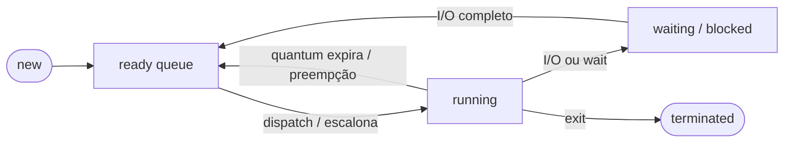
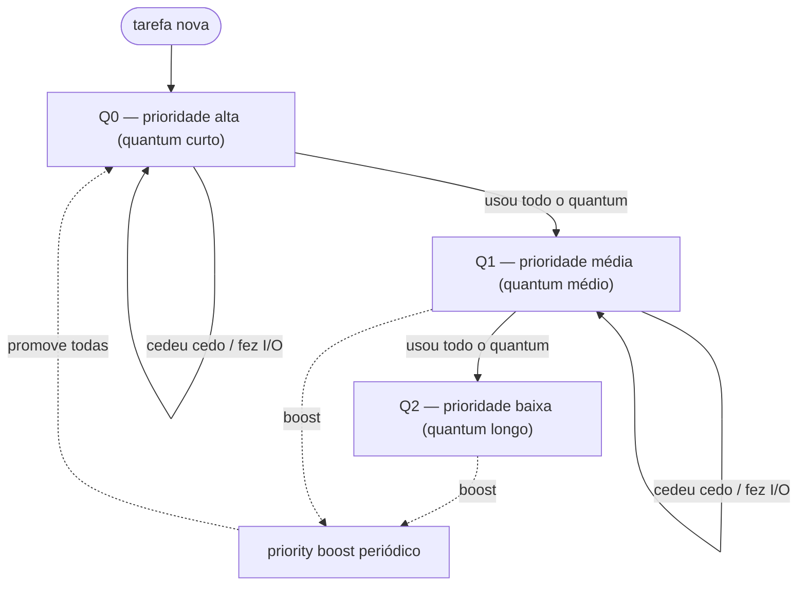
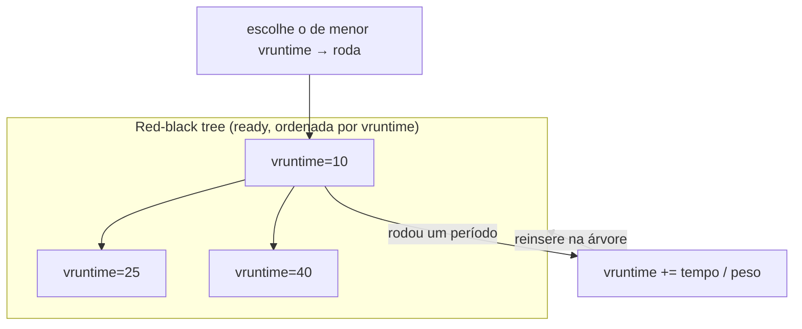
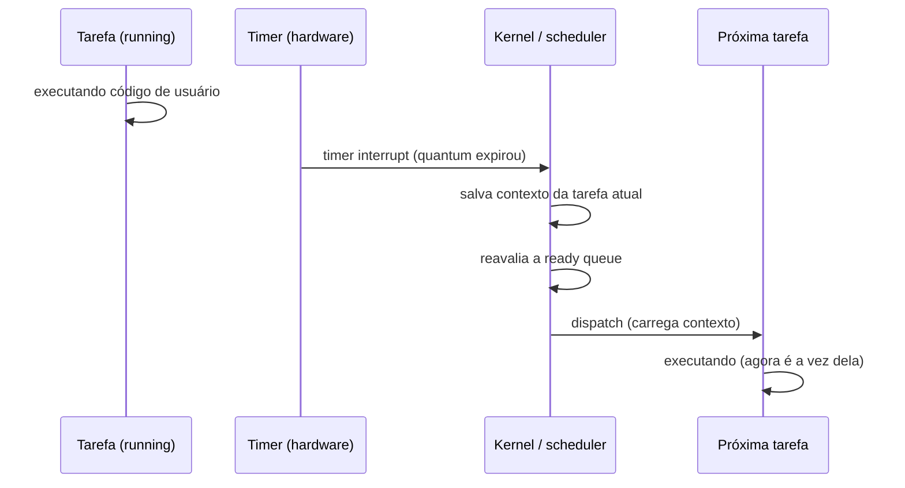

# Escalonamento de CPU

> [!abstract] Resumo em uma linha
> Quando há mais tarefas prontas do que CPUs, o escalonador decide **quem roda, quando e por quanto tempo** — equilibrando latência de resposta, throughput e justiça com algoritmos que vão do ingênuo FCFS ao CFS/EEVDF do Linux.

Imagine a fila de um banco com um único caixa e cem clientes esperando. Alguém precisa decidir a ordem. Atende quem chegou primeiro? Quem tem a tarefa mais rápida? Cada um leva cinco minutos no caixa e depois volta pro fim da fila? Esse "alguém" é o **escalonador de CPU** (CPU scheduler), e a fila é a **ready queue**.

O problema nasce de uma escassez crônica: quase sempre há mais processos e threads **prontos para rodar** do que núcleos de CPU para executá-los. Lá nos `[[03 - Processos]]` vimos que um processo transita entre estados — _new_, _ready_, _running_, _waiting_, _terminated_. O escalonador atua exatamente na transição **ready → running**: dentre todos os prontos, escolhe um para receber a CPU. Essa é a decisão mais frequente e mais sutil do kernel.

Lead-in: o escalonador vive na borda entre _ready_ e _running_.

Leitura do diagrama: tudo que importa acontece na seta `ready → running` (o **dispatch**) e na volta `running → ready` (a **preempção**). Quando um processo bloqueia em I/O, ele sai do páreo — e o escalonador imediatamente escolhe outro pronto, porque deixar a CPU ociosa é desperdício.

## Preemptivo versus cooperativo

Há duas filosofias para tirar a CPU de quem a tem.

No modelo **cooperativo** (ou _non-preemptive_), a tarefa só perde a CPU quando **ela própria cede** — bloqueando em I/O, terminando, ou chamando voluntariamente uma rotina de _yield_. É simples e barato. Mas tem um calcanhar fatal: uma tarefa egoísta (ou bugada num laço infinito) **trava o sistema inteiro**. Ninguém pode forçá-la a sair.

No modelo **preemptivo**, o SO **interrompe à força**. Como? Pelo **timer interrupt**: um relógio de hardware dispara uma interrupção a cada poucos milissegundos, o controle salta para o kernel, e o escalonador reavalia quem deve rodar. Vimos esse mecanismo em `[[02 - System calls e a fronteira kernel-usuário]]` — o timer é justamente o que garante que o kernel **sempre recupere o controle**, independente da boa vontade do código de usuário.

> [!warning] Por que SOs modernos são todos preemptivos
> Cooperatividade pura é uma bomba-relógio: basta um processo malicioso ou defeituoso para congelar tudo. O Windows 3.x e o Mac OS clássico eram cooperativos — e travavam o tempo todo. Linux, Windows NT em diante, macOS, todos os SOs de propósito geral hoje são **preemptivos**. O timer é o cabo de aço que segura a fairness.

A preempção garante **progresso** e **justiça**, mas cobra um preço: cada troca de tarefa é um **context switch** (visto nos `[[03 - Processos]]`), e trocar demais queima ciclos em overhead em vez de trabalho útil.

## As métricas: o que estamos otimizando?

Não existe escalonador "melhor" — existe escalonador melhor **para um objetivo**. E os objetivos brigam entre si.

- **CPU utilization** — fração do tempo em que a CPU está fazendo trabalho útil. Quanto mais perto de 100%, melhor.
- **Throughput** — número de processos concluídos por unidade de tempo.
- **Turnaround time** — tempo total desde a submissão até a conclusão (espera + execução + I/O).
- **Waiting time** — tempo que o processo passou **esperando na ready queue**. É o que a maioria dos algoritmos clássicos tenta minimizar.
- **Response time** — tempo entre a submissão e a **primeira resposta** (não a conclusão). Numa máquina interativa, é o que você _sente_: quanto demora pro cursor piscar depois que você apertou a tecla.

> [!tip] O trade-off central
> Otimizar **response time** (latência) e otimizar **throughput** puxam para lados opostos. Quanta-fatias curtas dão respostas rápidas, mas multiplicam context switches e derrubam o throughput. Fatias longas maximizam o trabalho útil, mas fazem o sistema parecer travado. Toda a engenharia de escalonamento é gerenciar essa tensão — somada à **fairness** (ninguém pode morrer de fome).

O perfil de carga muda tudo. Um sistema **batch** (processamento em lote, sem usuário esperando na tela) prioriza throughput e turnaround. Um sistema **interativo** (desktop, servidor web) prioriza response time. Um sistema de **tempo real** prioriza cumprir _deadlines_. Mesmo SO, objetivos opostos.

## Os algoritmos clássicos

### FCFS — First-Come, First-Served

O mais ingênuo. Uma fila FIFO pura: quem chega primeiro roda primeiro, até bloquear ou terminar. Não-preemptivo.

É simples e justo no sentido literal de "ordem de chegada". Mas sofre do **convoy effect** (efeito comboio): se um processo gordo e CPU-bound chega antes, todos os processinhos rápidos atrás dele esperam uma eternidade — como ficar preso atrás de um caminhão numa estrada de pista única. O waiting time médio explode.

### SJF / SRTF — Shortest Job First

A ideia ótima: rode primeiro a tarefa com o **menor burst de CPU**. Matematicamente, SJF **minimiza o waiting time médio** — é provadamente ótimo nesse quesito. A versão preemptiva é o **SRTF** (Shortest Remaining Time First): se chega uma tarefa mais curta que o tempo restante da atual, preempta.

Dois problemas matam o SJF na prática. Primeiro: **precisa prever o futuro** — você não sabe quanto tempo de CPU uma tarefa vai consumir antes de rodá-la (estima-se por média exponencial de bursts passados, mas é chute). Segundo: **starvation** — um fluxo contínuo de tarefas curtas faz uma tarefa longa esperar para sempre. O ótimo teórico esbarra na realidade.

### Round-Robin — a fatia de tempo

Aqui entra o **quantum** (fatia de tempo, _time slice_). Cada processo recebe um quantum de CPU; quando ele expira, o processo volta pro **fim** da ready queue e o próximo entra. É FCFS com preempção por timer.

Pense no quantum como **o tempo máximo no caixa do banco** antes de você ter que voltar pro fim da fila, mesmo sem ter terminado. Garante que ninguém monopolize o caixa.

Lead-in: o round-robin é a fila circular onde cada um leva sua fatia e roda de volta.

Leitura do diagrama: ninguém roda mais que um quantum por vez. P1 pega 4ms, é preemptado, P2 pega 4ms, e assim por diante, em círculo. Resultado: response time **excelente e previsível** — com N processos e quantum q, ninguém espera mais que (N-1)·q antes de rodar de novo.

> [!important] O tamanho do quantum importa
> Quantum **grande demais** → vira FCFS, response time degrada. Quantum **pequeno demais** → context switch a cada troca domina o tempo, throughput despenca. A regra de bolso clássica: o quantum deve ser grande o suficiente para que a maioria dos bursts de CPU termine dentro dele, mas pequeno o suficiente para manter a interatividade. Tipicamente alguns milissegundos.

### Prioridade — e o veneno do aging

Cada processo carrega uma **prioridade**; o escalonador escolhe sempre o de maior prioridade. SJF é, na verdade, escalonamento por prioridade onde a prioridade é o inverso do burst.

O problema reaparece: **starvation**. Um processo de baixa prioridade pode nunca rodar se sempre chegam outros mais prioritários. A lenda do MIT conta que, quando desligaram um IBM 7094 em 1973, acharam um job de baixa prioridade submetido em 1967 que nunca havia rodado.

A cura é o **aging** (envelhecimento): aumentar gradualmente a prioridade dos processos que esperam há muito tempo. Cedo ou tarde, até o mais humilde sobe o suficiente para rodar.

### MLFQ — Multi-Level Feedback Queue

E se o escalonador **aprendesse** o comportamento de cada tarefa sem precisar adivinhar o futuro? Essa é a sacada do MLFQ — provavelmente o algoritmo clássico mais importante, porque é o ancestral direto do que Windows e macOS usam.

São **múltiplas filas**, cada uma com uma prioridade. As regras essenciais (na formulação do OSTEP):

1. Se A tem prioridade maior que B, A roda.
2. Se A e B têm a mesma prioridade, rodam em round-robin entre si.
3. Toda tarefa **nova entra na prioridade máxima** (presumimos que seja curta/interativa até prova em contrário).
4. Se uma tarefa **usa todo o seu quantum** sem ceder, é **rebaixada** (CPU-bound demais → desce de fila).
5. Periodicamente, **todas as tarefas são promovidas** de volta ao topo (_priority boost_) — isso é o aging do MLFQ, evita starvation e corrige tarefas que mudaram de comportamento.

Lead-in: o MLFQ é um funil de filas com feedback — quem abusa da CPU afunda, quem é interativo flutua no topo.

Leitura do diagrama: tarefas interativas (que bloqueiam cedo em I/O, regra: cederam antes do quantum) **ficam no topo** e respondem rápido. Tarefas CPU-bound **afundam** para filas de baixa prioridade com quanta mais longos (rodam menos vezes, mas por mais tempo de cada vez — bom para batch). O boost periódico puxa todo mundo de volta, garantindo que nada apodreça no fundo e que tarefas que viraram interativas sejam reconhecidas.

> [!note] O MLFQ aproxima o SJF sem prever o futuro
> O genial do MLFQ é que ele **aprende** se uma tarefa é curta/interativa ou longa/CPU-bound apenas observando como ela usa o quantum. Não precisa de bola de cristal. Ele mistura o response baixo do round-robin com a tendência do SJF de priorizar trabalho curto. É por isso que virou o esqueleto dos escalonadores comerciais.

### Tabela comparativa

| Algoritmo | Preemptivo? | Otimiza | Problema principal |
|---|---|---|---|
| FCFS | Não | Simplicidade | Convoy effect (waiting alto) |
| SJF | Não | Waiting time médio (ótimo) | Precisa prever o futuro; starvation |
| SRTF | Sim | Waiting time médio | Precisa prever; starvation; mais context switch |
| Round-Robin | Sim | Response time / fairness | Quantum mal calibrado degrada tudo |
| Prioridade | Ambos | Tarefas importantes primeiro | Starvation (cura: aging) |
| MLFQ | Sim | Response + aproxima SJF | Complexo de calibrar (parâmetros) |

## O que os SOs reais usam (showcase)

Os algoritmos de livro são a base, mas os escalonadores de produção são feras mais sofisticadas, otimizadas para milhares de tarefas em múltiplos núcleos.

### Linux: do CFS ao EEVDF

Por mais de 15 anos, o Linux usou o **CFS** (Completely Fair Scheduler), criado por Ingo Molnár e mesclado no kernel 2.6.23 (2007). Sua ideia central é elegante: em vez de filas de prioridade fixas, o CFS dá a cada tarefa uma fatia **proporcional** de CPU. Ele rastreia o **vruntime** (virtual runtime) — o tempo de CPU que cada tarefa já consumiu, ponderado pelo seu peso (derivado do valor _nice_). O escalonador escolhe sempre a tarefa com o **menor vruntime** — ou seja, a que recebeu menos do que merecia.

Como achar a de menor vruntime rapidamente entre milhares de tarefas? O CFS guarda as tarefas prontas numa **árvore rubro-negra** (red-black tree) ordenada por vruntime. A tarefa mais à esquerda é a de menor vruntime — pegar a próxima a rodar é O(1) amortizado, e inserir/remover é O(log n). É o casamento direto com a estrutura que estudamos em `[[Estruturas de Dados]]`: a árvore balanceada existe porque o escalonador precisa de _min_ rápido com inserções/remoções constantes.

Mas o CFS tinha um ponto fraco: otimiza fairness, **não latência**. Uma tarefa que acorda e precisa responder já pode ficar atrás de outras com vruntime menor, mesmo que essas já tenham rodado bastante.

A partir do **kernel 6.6 (novembro de 2023)**, o CFS foi substituído pelo **EEVDF** (Earliest Eligible Virtual Deadline First). O EEVDF atribui a cada tarefa um **virtual deadline** e escolhe a tarefa _elegível_ com o deadline virtual mais próximo — o que melhora a latência das tarefas que o CFS deixava para trás, sem abandonar a fairness proporcional. É a evolução natural da mesma ideia.

Lead-in: o coração do CFS é a árvore rubro-negra ordenada por vruntime.

Leitura do diagrama: o escalonador sempre pega o nó mais à esquerda (menor vruntime). A tarefa roda, acumula vruntime proporcional ao seu peso, e é reinserida na posição correta. Tarefas de maior peso (nice menor) acumulam vruntime **mais devagar** — logo, rodam mais. É "justiça ponderada".

### Windows e macOS

| SO | Esquema | Mecanismo característico |
|---|---|---|
| **Linux** | CFS → EEVDF (desde 6.6) | vruntime + árvore rubro-negra; fairness proporcional ao peso/nice |
| **Windows** | Prioridades (32 níveis) com **boost** | Eleva temporariamente a prioridade de threads que saem de I/O ou da janela em foco — melhora response interativo |
| **macOS** | **QoS classes** (Grand Central Dispatch) | O dev marca a intenção da tarefa (`userInteractive`, `userInitiated`, `utility`, `background`); o SO escalona por essas classes |

Repare que todos, no fundo, são variações sobre prioridade-com-feedback ou fairness-ponderada — e todos favorecem o **interativo**.

## CPU-bound versus I/O-bound

Por que favorecer o interativo? Por causa da natureza das tarefas.

Uma tarefa **CPU-bound** consome longos bursts de processador (compilar, renderizar, calcular). Uma tarefa **I/O-bound** roda um pouquinho, dispara um I/O (ler disco, esperar rede) e **bloqueia** — passa a maior parte do tempo em _waiting_.

O escalonador esperto **favorece as I/O-bound**: dá a elas a CPU rapidinho assim que ficam prontas. Por quê? Porque elas usam a CPU por pouco tempo e logo liberam — e, crucialmente, mantêm os **dispositivos de I/O ocupados em paralelo**. Se você deixa a tarefa I/O-bound esperar, o disco/rede fica ocioso, e você perde paralelismo entre CPU e periféricos. Atender o I/O-bound primeiro mantém **todo o hardware trabalhando ao mesmo tempo**. O MLFQ faz exatamente isso ao manter no topo quem cede a CPU cedo.

Esse equilíbrio entre quem roda na CPU e quem bloqueia conecta diretamente ao mundo da `[[Concorrência e Paralelismo]]` e ao comportamento do `[[01 - O que é um sistema operacional]]` como árbitro de recursos.

## Multicore e afinidade de CPU

Com N núcleos, o escalonador não escolhe _uma_ tarefa — escolhe N, uma por core, simultaneamente. Surgem dois conceitos novos.

**Afinidade de CPU** (CPU affinity): a tendência (ou a imposição) de manter um processo **no mesmo núcleo** em que rodou por último. Por quê? **Cache**. Quando uma tarefa roda num core, ela aquece os caches L1/L2 daquele core com seus dados. Se for migrada para outro core, perde tudo — os caches do novo core estão frios, e ela paga _cache misses_ caros até reaquecer. Manter a afinidade preserva a localidade que vimos importar tanto em `[[Estruturas de Dados]]`: dados quentes no cache próximo valem ouro.

**Load balancing**: por outro lado, não pode deixar um core lotado enquanto outro dorme. O escalonador periodicamente **migra tarefas** de cores sobrecarregados para ociosos. Há uma tensão direta aqui — afinidade quer fixar, balanceamento quer migrar.

> [!tip] A tensão multicore em uma frase
> Afinidade (ficar = cache quente) versus load balancing (migrar = núcleos equilibrados). O escalonador migra só quando o desequilíbrio compensa o custo de esfriar o cache.

Lead-in: a preempção por timer, passo a passo.

Leitura do diagrama: o timer de hardware é quem **arranca o controle** da tarefa em execução. Sem ele, o escalonador preemptivo não existiria — voltaríamos ao mundo cooperativo onde uma tarefa egoísta congela tudo. Note o custo: salvar e carregar contexto (o _context switch_) acontece a cada virada.

## Tempo real (pincelada)

Há sistemas onde **não basta** rodar rápido em média — é preciso **cumprir deadlines garantidos**: airbag, marca-passo, controle de voo.

- **Hard real-time**: perder um deadline é falha catastrófica. O resultado depois do prazo é inútil (ou fatal).
- **Soft real-time**: perder um deadline degrada a qualidade, mas não quebra (streaming de vídeo engasga, mas não mata ninguém).

Algoritmos típicos: **EDF** (Earliest Deadline First — roda sempre a tarefa cujo deadline está mais próximo) e **Rate-Monotonic** (prioridade fixa inversamente proporcional ao período da tarefa).

> [!question] Por que Linux/Windows não são RT por padrão?
> Porque SOs de propósito geral otimizam **throughput médio e fairness**, não **garantias de pior caso**. Um interrupt inesperado, um page fault, uma seção crítica do kernel — qualquer coisa pode introduzir latência imprevisível. RT exige determinismo no pior caso, o que custa throughput. Por isso existem variantes especializadas (PREEMPT_RT no Linux, RTOS dedicados como FreeRTOS).

## Em entrevista

Talk through the **ready → running** transition: the scheduler picks who runs from the run queue, and preemption (driven by the **timer interrupt**) is what guarantees fairness and progress. Distinguish the metrics clearly — **response time** (latency to first run) is what interactive users feel, while **throughput** and **turnaround** matter for batch work, and they trade off against each other. Walk through the classics and their failure modes: FCFS suffers the **convoy effect**, SJF is optimal for waiting time but needs to predict the future and causes **starvation**, round-robin's behavior hinges on the **time quantum** size, and priority scheduling needs **aging** to avoid starvation. Explain **MLFQ** as the key insight: it learns whether a task is interactive or CPU-bound by watching how it uses its quantum, approximating SJF without a crystal ball. For real systems, mention that Linux moved from **CFS** (vruntime in a red-black tree, proportional fairness) to **EEVDF** since kernel 6.6, and that the scheduler favors **I/O-bound** tasks to keep both CPU and devices busy. If multicore comes up, bring in **CPU affinity** (cache locality) versus load balancing.

### Vocabulário

| Português | English |
|---|---|
| escalonamento | scheduling |
| preemptivo / cooperativo | preemptive / cooperative (non-preemptive) |
| fatia de tempo / quantum | time slice / quantum |
| tempo de resposta | response time |
| tempo de retorno | turnaround time |
| tempo de espera | waiting time |
| fila de prontos | ready queue / run queue |
| envelhecimento | aging |
| afinidade de CPU | CPU affinity |
| escalonador completamente justo | Completely Fair Scheduler (CFS) |
| inanição | starvation |
| efeito comboio | convoy effect |

> [!info] Lastro
> - [CFS Scheduler — The Linux Kernel documentation](https://docs.kernel.org/scheduler/sched-design-CFS.html) — vruntime, red-black tree, fairness proporcional (verificado).
> - [Completely Fair Scheduler — Wikipedia](https://en.wikipedia.org/wiki/Completely_Fair_Scheduler) — histórico CFS (2.6.23) e transição para EEVDF no kernel 6.6 (nov/2023) (verificado).
> - [Comparison of CPU Scheduling Algorithms: FCFS, SJF, SRTF, Round Robin, Priority, Multilevel Queuing (ResearchGate)](https://www.researchgate.net/publication/365100564_Comparison_of_CPU_Scheduling_Algorithms_FCFS_SJF_SRTF_Round_Robin_Priority_Based_and_Multilevel_Queuing) — comparação dos clássicos (verificado).
> - Canônicos: **OSTEP**, caps. _Scheduling: Introduction_ e _The Multi-Level Feedback Queue_ (Arpaci-Dusseau); **Tanenbaum**, _Modern Operating Systems_, cap. de escalonamento.

## Veja também

- `[[01 - O que é um sistema operacional]]` — o SO como árbitro de recursos
- `[[02 - System calls e a fronteira kernel-usuário]]` — o timer interrupt que viabiliza a preempção
- `[[03 - Processos]]` — estados do processo e a transição ready → running
- `[[04 - Threads na ótica do sistema operacional]]` — o que de fato é escalonado (threads/kernel threads)
- `[[14 - Sistemas operacionais em entrevista]]` — perguntas e respostas de escalonamento
- `[[Concorrência e Paralelismo]]` — CPU-bound versus I/O-bound no nível da aplicação
- `[[03-Dominios/Infraestrutura/Linux|Linux]]` — CFS/EEVDF na prática, `nice`, `taskset`, afinidade
- `[[03-Dominios/Fundamentos/Sistemas Operacionais/index|Sistemas Operacionais]]` — índice do galho
