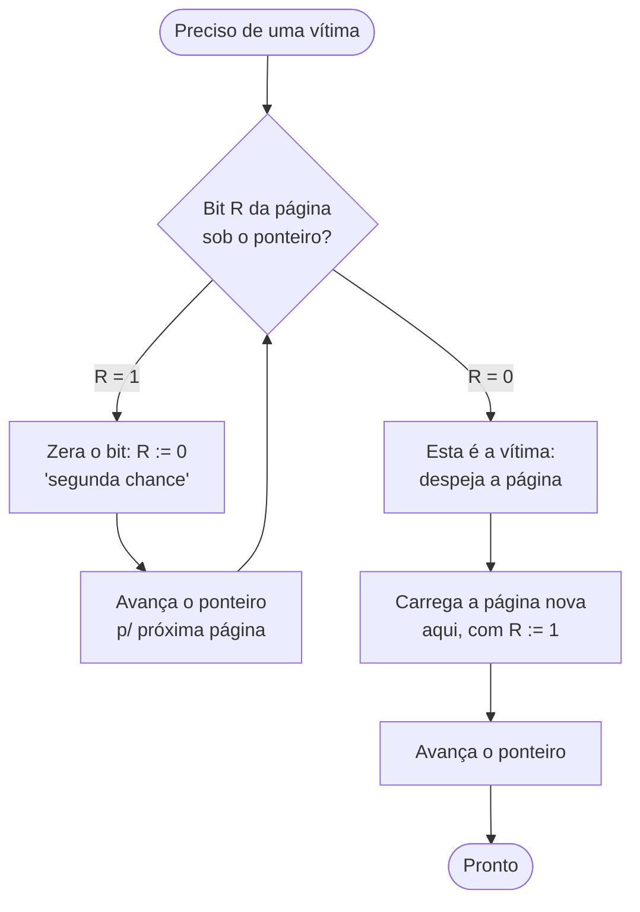
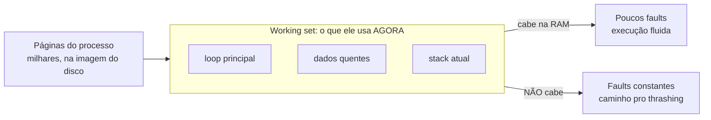
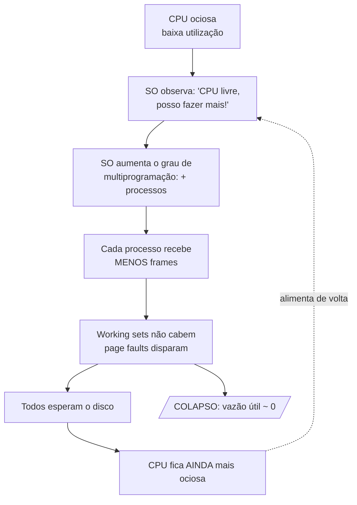
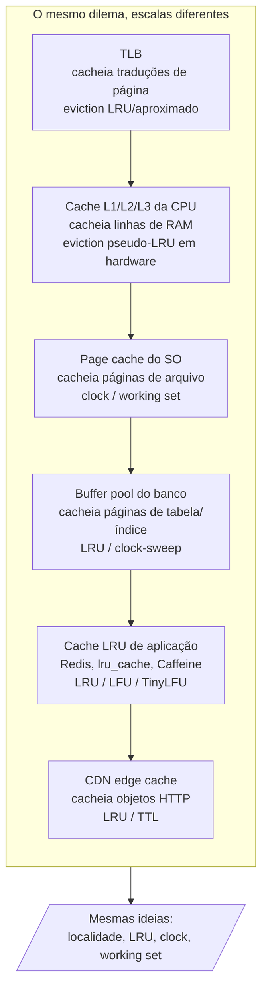

# Substituição de páginas e thrashing

> [!abstract] Resumo em uma linha
> Quando a RAM enche, o SO precisa escolher uma página-vítima pra despejar — e o mesmo dilema (LRU, clock, working set) reaparece em cache de CPU, buffer pool de banco e CDN; quando os working sets não cabem, o sistema entra em colapso de paginação: thrashing.

A nota [[07 - Memória virtual e paginação]] terminou com uma pergunta deixada em aberto. A memória virtual mente: cada processo acha que tem o endereçamento inteiro só pra ele, e o SO sustenta a mentira movendo páginas entre RAM e disco. Mas a RAM é finita. Cedo ou tarde ela enche.

E aí? Chega um *page fault major*: o processo pede uma página que está no disco, ela precisa subir pra RAM — mas não há frame livre. Antes de trazer a página nova, o SO tem que **despejar** (evict) uma página que já está lá.

A pergunta da nota inteira é uma só: **qual página despejar?**

## A escrivaninha pequena

Imagine que você trabalha numa escrivaninha minúscula. Só cabem cinco papéis na superfície. O resto está numa gaveta lenta, lá embaixo.

Você precisa de um documento que está na gaveta. Pra colocá-lo na mesa, antes você precisa **tirar** um dos cinco papéis que já estão ali e devolvê-lo à gaveta. Qual?

- O papel que você acabou de usar? Péssima ideia — provavelmente vai precisar dele de novo já já.
- Um papel que está ali parado há horas, intocado? Bem melhor candidato.
- O papel que você sabe que só vai precisar daqui a três dias? Esse seria o **ideal** — se você soubesse o futuro.

Essa decisão, repetida milhares de vezes por segundo, é a substituição de páginas. A diferença entre uma escolha boa e uma ruim é a diferença entre um sistema fluido e um sistema que passa o dia inteiro carregando e descarregando a gaveta.

## OPTIMAL: o oráculo que não existe

O algoritmo perfeito é fácil de descrever: **despeje a página que será usada mais tarde no futuro** (ou nunca mais). É o algoritmo de Belady, também chamado MIN ou OPTIMAL.

Por que é perfeito? Porque adiar o máximo possível o próximo fault da página que você manteve é, por definição, minimizar o total de faults.

Qual o problema? Ele precisa **prever o futuro**. O SO não sabe quais páginas o processo vai pedir daqui a meio segundo. OPTIMAL é irrealizável.

Então pra que serve? Como **baseline**. Você roda OPTIMAL offline sobre um trace gravado e mede: "meu algoritmo real deu 30% mais faults que o ótimo teórico". É a régua contra a qual tudo mais se mede. Nunca é implementado de verdade.

## FIFO e a anomalia de Belady

O mais ingênuo dos algoritmos reais: **despeje a página que está há mais tempo na RAM** (First In, First Out). Uma fila simples. Quem chegou primeiro sai primeiro.

É barato. E é ruim. FIFO ignora completamente se a página está sendo usada. A página da primeira instrução do seu programa — o loop principal, usado o tempo todo — entrou cedo e seria a primeira a ser despejada. Absurdo.

Mas FIFO esconde uma armadilha realmente contraintuitiva, a **anomalia de Belady**: dar MAIS frames de memória pode causar MAIS page faults.

Isso deveria ser impossível. Mais memória = menos faults, certo? Com FIFO, não necessariamente.

> [!warning] A anomalia de Belady, com números
> A string de referência clássica `1, 2, 3, 4, 1, 2, 5, 1, 2, 3, 4, 5` é o teste de sanidade. Com FIFO:
> - **3 frames** → 9 page faults
> - **4 frames** → 10 page faults
>
> Mais memória, mais faults. A causa: FIFO não é um *stack algorithm*. Não há garantia de que o conjunto de páginas na RAM com `n` frames seja um subconjunto do conjunto com `n+1` frames. Algoritmos de pilha — LRU e OPTIMAL — nunca sofrem a anomalia, porque essa propriedade de inclusão vale pra eles.

A anomalia é uma pergunta de entrevista favorita justamente porque viola a intuição. Quem nunca ouviu falar dela responde com confiança "claro que mais memória ajuda" — e cai.

## LRU: o melhor que o passado pode dar

Se não podemos ver o futuro, o melhor palpite é o **passado recente**. O princípio: a página menos recentemente usada (Least Recently Used) é a que tem menos chance de ser usada de novo em breve. Então despeje-a.

LRU funciona muito bem na prática. Em workloads reais, fica perto de OPTIMAL. É o algoritmo que você desenha mentalmente quando pensa em "cache inteligente".

O problema é o **custo de implementação exata**. Pra saber qual página é a menos recentemente usada, você precisaria, a cada *único acesso à memória*, atualizar uma estrutura — mover a página pro topo de uma lista, ou estampar um timestamp. Cada acesso. Bilhões por segundo. Em hardware. Impraticável fazer LRU puro no caminho crítico da MMU.

Então o LRU exato é, na prática, tão irrealizável quanto OPTIMAL — só que por custo, não por clarividência. O que os SOs reais usam é uma **aproximação barata** de LRU.

## CLOCK / second-chance: a aproximação que os SOs reais usam

Aqui entra a engenharia de verdade. O hardware (a MMU) consegue, de graça, manter um único bit por página: o **bit de referência** (R). Toda vez que a página é acessada, o hardware seta R = 1. Barato — é só um bit.

O algoritmo **second-chance** (também chamado **clock**, pelo seu formato circular) usa esse bit pra aproximar LRU sem rastrear cada acesso.

A ideia: é um FIFO com uma reviravolta. Quando uma página chegaria na frente da fila pra ser despejada, olhamos o bit R. Se R = 0, a página não foi tocada desde a última vez que olhamos — despeje-a. Se R = 1, ela teve uso recente; damos uma **segunda chance**: zeramos o bit e a mandamos pro fim da fila.

Pra evitar mover páginas numa fila, organizamos os frames em **círculo**, com um ponteiro girando como o de um relógio.

Vamos seguir o ponteiro do clock.

**Leitura do diagrama:** o ponteiro varre o círculo de frames. Toda página que ele encontra com R = 1 ganha uma segunda chance — o bit é zerado e o ponteiro segue. A primeira página que ele encontra com R = 0 (não tocada desde a última varredura) é a vítima. No pior caso o ponteiro dá uma volta inteira zerando bits, e na segunda passada encontra alguém com R = 0. É barato porque o hardware faz o trabalho de setar o bit; o SO só lê e zera.

Por que isso aproxima LRU? Porque uma página tocada recentemente terá R = 1 e escapará na primeira passada. Só as páginas frias — não referenciadas durante toda uma volta do ponteiro — são despejadas. É o "menos recentemente usado", grosseiramente, ao custo de um bit.

> [!tip] Clock = FIFO + um bit de história
> Tecnicamente o second-chance é "um algoritmo FIFO com uma pequena modificação que o faz aproximar LRU". Reduzimos a história de cada página a zero bits de timestamp e ficamos com o bit de referência sozinho. Variações reais (como o clock de Linux/BSD) usam dois bits ou mais, separando "referenciado" de "modificado/sujo" — uma página suja custa mais pra despejar, porque precisa ser escrita no disco antes.

## LFU: a popularidade engana

Vale citar o **LFU** (Least Frequently Used): despeje a página com menor contagem de acessos. Parece esperto, mas tem um defeito clássico: uma página muito usada *no passado* acumula uma contagem alta e fica "imortal" na RAM, mesmo que o programa nunca mais a toque. A frequência histórica mente sobre o uso futuro. LFU puro raramente é usado sozinho; aparece em variantes que envelhecem as contagens.

## A tabela de bolso

| Algoritmo | Critério de despejo | Custo | Defeito |
|---|---|---|---|
| OPTIMAL (Belady/MIN) | Página usada mais tarde no futuro | Irrealizável | Precisa prever o futuro; só serve de baseline |
| FIFO | Página há mais tempo na RAM | Baixíssimo | Ignora uso; sofre anomalia de Belady |
| LRU (exato) | Menos recentemente usada | Altíssimo | Caro demais pro caminho crítico da MMU |
| CLOCK / second-chance | Aproxima LRU via bit de referência | Baixo | O que SOs reais usam de fato |
| LFU | Menos frequentemente usada | Médio | Páginas "imortais" do passado |

## Working set e localidade: por que isso tudo funciona

Recuemos um passo. Paginação só funciona por causa de um fato empírico sobre como programas se comportam: o **princípio da localidade**.

- **Localidade temporal:** uma página acessada agora tende a ser acessada de novo em breve. (O loop que roda mil vezes.)
- **Localidade espacial:** se acessei uma posição, provavelmente vou acessar as vizinhas em breve. (Percorrer um array.)

Por causa da localidade, um processo a qualquer momento usa ativamente só um punhado de páginas — não as milhares que possui. Peter Denning formalizou isso no **modelo do conjunto de trabalho** (working set): o conjunto de páginas que um processo referenciou recentemente, dentro de uma janela de tempo.

A regra de ouro: **se o working set de um processo cabe na RAM alocada a ele, os page faults são raros.** Ele faz uns poucos faults pra "esquentar" e depois roda fluido, porque tudo que precisa já está em memória. É por isso que a substituição de páginas funciona — você só despeja páginas *fora* do working set.

**Leitura do diagrama:** das milhares de páginas que um processo possui, só um subconjunto pequeno é o working set — as páginas em uso ativo na janela atual. Se esse subconjunto cabe nos frames de RAM dados ao processo, ele roda bem. Se não cabe, cada acesso pode bater numa página despejada e gerar um fault. A soma dos working sets de todos os processos ativos é a métrica que o SO precisa vigiar.

## Thrashing: o colapso

Agora some os working sets de **todos** os processos rodando. Enquanto essa soma cabe na RAM, tudo bem. Quando ela ultrapassa a RAM física, acontece o desastre.

Cada processo precisa de mais frames do que tem. Cada acesso a uma página despejada gera um fault major. Pra trazer essa página, despeja-se outra que daqui a pouco será pedida — gerando outro fault. As páginas entram e saem do disco num ciclo vicioso. O sistema passa **mais tempo paginando do que computando**.

Isso é **thrashing**. O disco "mói" sem parar (no HDD você literalmente ouvia), a CPU fica ociosa — não porque não tem trabalho, mas porque está sempre *esperando o disco*. A vazão útil despenca pra perto de zero.

O pior é o mecanismo que **realimenta** o colapso, e é a parte mais cruel:

**Leitura do diagrama:** a CPU ociosa engana o escalonador. Vendo a CPU livre, o SO acha que pode rodar mais processos e aumenta o grau de multiprogramação — exatamente a decisão errada. Mais processos significam menos frames cada, working sets que não cabem, e ainda mais faults. A CPU fica mais ociosa ainda, e o ciclo se reforça até a vazão útil colapsar. É um penhasco, não uma ladeira: passado o ponto crítico, a performance despenca.

A curva clássica, descrita em palavras (a forma vale mais que o gráfico): conforme o **grau de multiprogramação** cresce, a utilização útil de CPU sobe — até um pico. Depois desse pico, ela **desaba** verticalmente. Existe um ponto ótimo de multiprogramação, e ultrapassá-lo é catastrófico.

### Como o SO reage

A defesa de Denning era usar o working set diretamente: o SO mede o working set de cada processo e, se a soma ameaça estourar a RAM, **suspende processos inteiros** (swap-out total) pra liberar frames pros que sobraram. Menos processos rodando, mas rodando de verdade. Quando a pressão cede, traz os suspensos de volta.

No Linux, a última linha de defesa quando a recuperação de memória falha é o **OOM killer** (Out Of Memory killer): o kernel escolhe um processo pela heurística do `oom_score` (tipicamente o que mais consome memória) e o **mata** pra liberar RAM de uma vez. É brutal, mas evita o congelamento total. Detalhe importante: o OOM killer pode disparar mesmo com memória "livre" aparente, quando não há mais cache pra recuperar e o swap está esgotado ou desabilitado.

## Swap: estender a RAM com disco

O **swap** (ou paging file) é o espaço em disco onde o SO guarda páginas que tirou da RAM. É o que torna a memória virtual maior que a física.

Mas swap é uma muleta cara. Acessar uma página no swap é **ordens de magnitude** mais lento que acessá-la na RAM — porque é disco, não memória. Quanto exatamente? Vale conferir [[03-Dominios/Fundamentos/Redes e Protocolos/12 - Latência, throughput e os números|os números de latência]]: a RAM responde em nanossegundos, um SSD em microssegundos, um HDD em milissegundos. A diferença entre RAM e disco é de milhares a milhões de vezes. Cada fault que vai ao swap é um eon na escala da CPU.

No Linux, o parâmetro **swappiness** (0 a 100) regula o quão agressivamente o kernel prefere despejar páginas anônimas (memória de processo) pro swap versus recuperar páginas de cache de arquivo. Swappiness baixo faz o kernel recuperar cache antes de tocar na memória dos processos; o padrão histórico é 60, mas para servidores de banco recomenda-se algo como 10, justamente pra não jogar dados quentes de processo no disco lento.

## O page cache: RAM livre é RAM desperdiçada

Aqui um ponto que confunde quem olha o monitor de memória pela primeira vez e entra em pânico: "minha RAM está 90% cheia!".

Calma. A RAM livre não fica ociosa. Quando você lê um arquivo do disco, o SO guarda essas páginas no **page cache**. Se você (ou outro processo) ler o mesmo arquivo de novo, a leitura é instantânea — vem da RAM, não do disco. É por isso que abrir um programa pela segunda vez é muito mais rápido que pela primeira.

> [!info] Free RAM is wasted RAM
> O slogan do gerenciamento de memória moderno. Memória física parada não rende nada. O SO agressivamente preenche a RAM ociosa com cache de arquivos — e essa memória é *recuperável na hora*: assim que um processo precisa de frames, o kernel descarta páginas de cache (que têm cópia no disco) sem custo. No Linux, a ordem de recuperação é cache de arquivo primeiro, depois swap de memória anônima, e só em desespero o OOM killer. Aquele "90% cheio" no monitor é, em grande parte, cache benéfico, não pressão real.

## A grande sacada: o MESMO problema em todas as escalas

Agora a parte que separa quem decorou o algoritmo de quem **entendeu**.

Substituição de página não é um assunto de SO. É **uma instância** de um problema universal: você tem um armazenamento rápido e pequeno na frente de um armazenamento lento e grande, e precisa decidir o que manter no rápido. Esse problema — **eviction de cache** — aparece em toda camada da computação.

**Leitura do diagrama:** desça a pilha e o problema se repete idêntico. A TLB cacheia traduções (veja [[06 - Memória - do endereço lógico ao físico]]). Os caches da CPU usam pseudo-LRU em silício. O page cache do SO usa clock. O **buffer pool** de um banco (`[[Banco de Dados]]`) cacheia páginas de tabela com LRU ou clock-sweep — é literalmente substituição de página aplicada a dados de disco. Um cache LRU de aplicação (o mesmo da estrutura em `[[Estruturas de Dados]]`, a clássica HashMap + lista duplamente ligada) decide o que manter em RAM. E uma CDN edge cache (`[[Redes e Protocolos]]`) decide quais objetos guardar perto do usuário. Localidade, LRU, clock e working set não são truques de SO — são o **vocabulário comum** de toda hierarquia de armazenamento.

> [!tip] A resposta que impressiona em entrevista
> Quando perguntarem "como você implementaria um cache LRU?", a resposta júnior é HashMap mais lista ligada. A resposta sênior reconhece a moldura: "isto é o mesmo problema da substituição de páginas do SO; o LRU exato é caro, então em escala uso uma aproximação tipo clock ou TinyLFU, e dimensiono pra que o working set caiba — porque um cache menor que o working set vira thrashing, exatamente como na RAM". Esse é o salto de quem viu o padrão uma vez no SO e o reconhece em todo lugar.

## Em entrevista

Speak in English here.

- *Page replacement* decides which page to evict when RAM is full and a major fault needs a free frame. The theoretical ideal is OPTIMAL (evict the page used furthest in the future), but it requires clairvoyance, so it only serves as a baseline.
- LRU approximates the ideal using the recent past, but exact LRU is too expensive to maintain on every memory access; real OSes use the **clock / second-chance** algorithm, an LRU approximation driven by a hardware reference bit.
- Watch for **Belady's anomaly**: with FIFO, adding more frames can *increase* page faults — stack algorithms like LRU and OPTIMAL never suffer it.
- **Thrashing** happens when the sum of working sets exceeds physical RAM: the system spends more time paging than computing, CPU sits idle waiting on disk, and naive schedulers make it worse by admitting more processes.
- The senior insight: page replacement is just cache eviction, and the same ideas — locality, LRU, clock, working set — show up in CPU caches, the DB buffer pool, application LRU caches, and CDNs. Size the cache to fit the working set, or you thrash at any scale.
- Remember "free RAM is wasted RAM": the OS fills idle memory with reclaimable page cache, and the Linux **OOM killer** is the last resort when reclaim and swap are exhausted.

### Vocabulário

- substituição de página → page replacement
- vítima / despejar → victim / to evict (eviction)
- bit de referência → reference bit
- anomalia de Belady → Belady's anomaly
- conjunto de trabalho → working set
- thrashing → thrashing
- swap / arquivo de troca → swap / paging file
- cache de páginas → page cache
- localidade temporal / espacial → temporal / spatial locality
- grau de multiprogramação → degree of multiprogramming
- matador por falta de memória → OOM killer (Out Of Memory)
- recuperação de memória → memory reclaim

> [!info] Lastro
> - [Bélády's anomaly — Wikipedia](https://en.wikipedia.org/wiki/B%C3%A9l%C3%A1dy's_anomaly) — a anomalia e a propriedade dos stack algorithms.
> - [Second Chance (or Clock) Page Replacement Policy — GeeksforGeeks](https://www.geeksforgeeks.org/operating-systems/second-chance-or-clock-page-replacement-policy/) — clock, bit de referência, fila circular.
> - [Peter J. Denning — Wikipedia](https://en.wikipedia.org/wiki/Peter_J._Denning) e [What Is Thrashing? — Baeldung](https://www.baeldung.com/cs/virtual-memory-thrashing) — working set e o ciclo de thrashing pelo grau de multiprogramação.
> - [Memory Management on Linux: Page Cache, Swap, and OOM — USAVPS](https://usavps.com/blog/memory-management-on-linux-servers-page-cache-swap-and-oom-behavior/) — ordem de reclaim, swappiness e OOM killer.

## Veja também

- [[06 - Memória - do endereço lógico ao físico]]
- [[07 - Memória virtual e paginação]]
- [[14 - Sistemas operacionais em entrevista]]
- [[03-Dominios/Fundamentos/Sistemas Operacionais/index|Sistemas Operacionais]]
