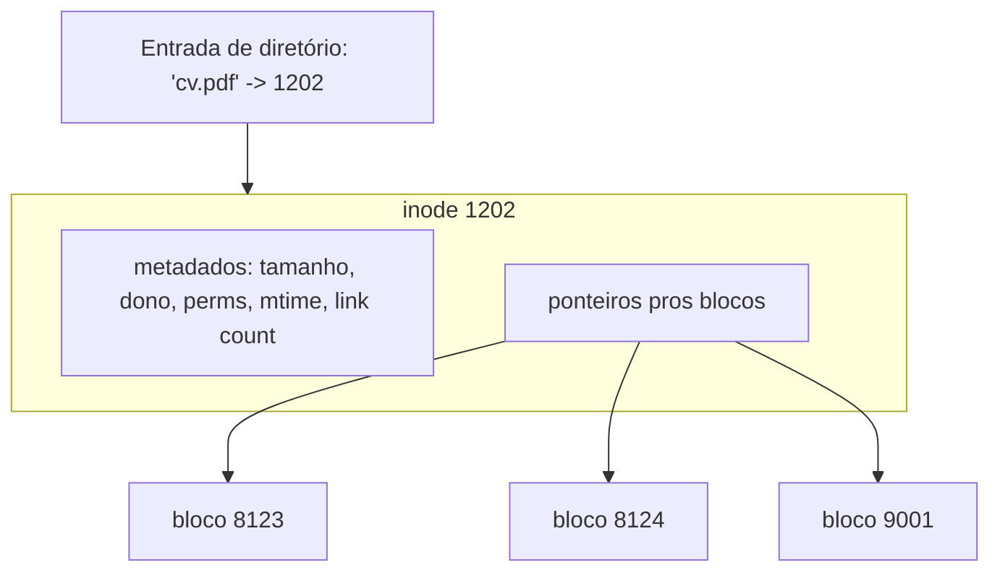
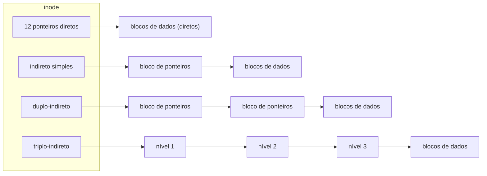
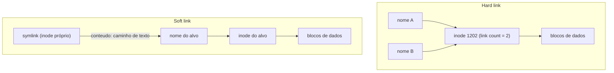
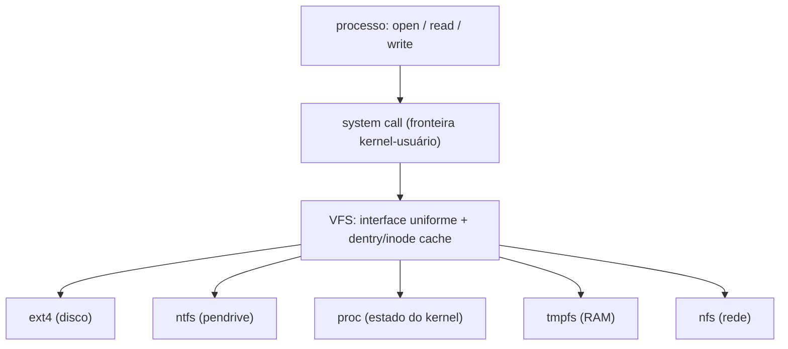
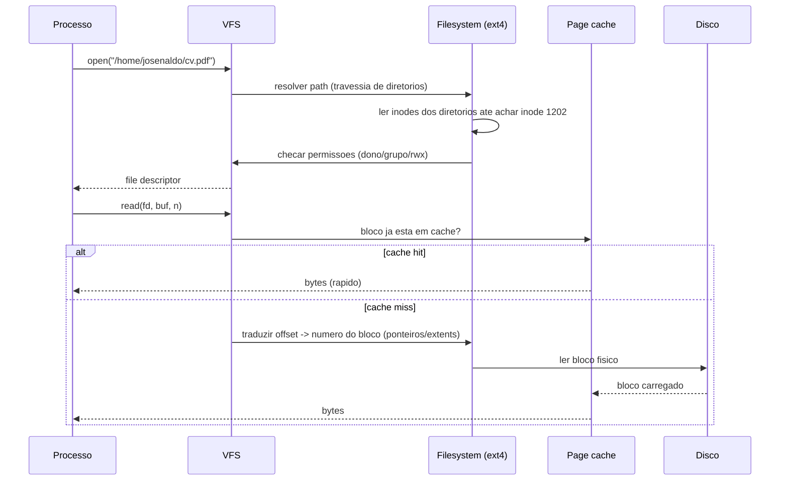

# Sistemas de arquivos

> [!abstract] Resumo em uma linha
> Um sistema de arquivos é a abstração que transforma um disco — um array bruto de blocos numerados — em arquivos e diretórios com nomes, hierarquia e metadados, e o inode é a peça central que liga o nome ao dado.

Um disco, por baixo, é uma coisa estúpida. É um vetor gigante de blocos, cada um com um número: bloco 0, bloco 1, bloco 2, até alguns bilhões. Ele não sabe o que é um "arquivo". Não sabe o que é uma "pasta". Não sabe que o bloco 8.412.991 contém o terço final do seu currículo em PDF. Ele só guarda bytes e devolve bytes quando você pede por número.

O que você quer, como humano e como programa, é outra coisa. Você quer dizer `open("/home/josenaldo/cv.pdf")` e receber de volta o conteúdo. Você quer nomes. Quer pastas dentro de pastas. Quer saber quem é o dono, quando foi modificado, quem pode ler. Quer que isso tudo sobreviva ao desligamento da máquina.

A ponte entre esses dois mundos é o **sistema de arquivos** (filesystem). Ele é exatamente a "máquina estendida" de que fala `[[01 - O que é um sistema operacional]]`, aplicada ao disco: uma camada de software que esconde a brutalidade do hardware atrás de uma abstração civilizada — arquivos e diretórios.

> [!question] Por que isso é trabalho do SO, e não do disco?
> Porque o disco é genérico de propósito. O mesmo array de blocos pode hospedar ext4, NTFS, um banco de dados que usa o dispositivo cru, ou nada. A política de "como organizar bytes em arquivos" é uma decisão de software — e o SO é quem a toma.

## A analogia da biblioteca

Antes de mergulhar, fixe esta imagem. Ela vai segurar a nota inteira.

Imagine uma biblioteca antiga, daquelas com fichário de gaveta.

- O **catálogo** (as gavetas com fichinhas) é o **diretório**. Cada ficha tem um *título* e um *número de tombo*. O catálogo não guarda o livro — guarda o mapeamento `título → tombo`.
- A **ficha de tombo** é o **inode**. Ela diz tudo sobre o livro *menos* o título: quantas páginas, em que ano entrou, quem é o autor, e — crucial — *em quais prateleiras o livro está fisicamente*.
- As **prateleiras** são os **blocos do disco**. É onde o conteúdo de fato mora.
- O **livro em si não tem o título colado nele.** O título vive no catálogo. Por isso o mesmo livro pode aparecer com dois títulos diferentes em duas fichas do catálogo — duas fichas, mesmo número de tombo. Isso é um **hard link**.

Guarde isto: **o nome não está no arquivo.** O nome está no diretório. Essa única frase explica metade dos comportamentos estranhos de um filesystem Unix.

## Arquivo e diretório

Um **arquivo**, na visão Unix, é um *stream de bytes nomeado*. Uma sequência linear, do byte 0 ao byte N-1, sem estrutura imposta pelo SO. O significado dos bytes é problema da aplicação: pra ela são pixels, pra outra são linhas de texto. O SO só vê bytes. (Sistemas legados — mainframes, alguns bancos antigos — modelavam arquivos como *registros* de tamanho fixo, com o SO ciente da estrutura. O modelo "saco de bytes" venceu por simplicidade.)

Um **diretório** é um arquivo especial. Por dentro, ele é só uma tabela que mapeia *nomes* a *números de inode*:

| nome           | inode |
| -------------- | ----- |
| `.`            | 1201  |
| `..`           | 980   |
| `cv.pdf`       | 1202  |
| `fotos`        | 1203  |
| `relatorio.md` | 1204  |

As entradas `.` (eu mesmo) e `..` (meu pai) são o que tornam a hierarquia navegável. O **caminho** (path) `/home/josenaldo/cv.pdf` é resolvido por **travessia**: comece no inode da raiz `/`, leia o diretório, ache a entrada `home` e seu inode, leia *esse* diretório, ache `josenaldo`, e assim por diante até chegar em `cv.pdf`. Cada passo é uma busca dentro de um diretório.

> [!note] Diretório é arquivo, mas você não escreve nele "na mão"
> Você não dá `write()` num diretório pra inventar uma entrada. O kernel medeia isso via `creat`, `mkdir`, `unlink`, `rename`. O diretório é dado estruturado que só o SO tem permissão de editar — senão a integridade do mapeamento iria pro brejo.

Leitura do diagrama: resolver um caminho é uma cadeia de buscas. Cada diretório é uma tabela `nome → inode`; o kernel salta de inode em inode até o último componente, e só então chega no inode do arquivo, que aponta pros blocos. Caminho longo, muitas leituras — por isso o cache de diretórios importa tanto.

## Inode: o coração da coisa

O **inode** (index node) é a estrutura que *descreve* um arquivo. Ele contém:

- **Metadados**: tamanho em bytes, dono (UID) e grupo (GID), permissões (`rwx`), tipo (arquivo comum, diretório, link, dispositivo), timestamps (`atime` de acesso, `mtime` de modificação de conteúdo, `ctime` de modificação de metadados), e o **contador de links** (quantos nomes apontam pra este inode).
- **Ponteiros pros blocos de dados**: onde, no disco, está o conteúdo.

O que o inode **não** contém é o **nome do arquivo**. O nome vive no diretório que o referencia. Isso não é detalhe trivia — é a base da existência dos hard links, de por que `mv` dentro do mesmo filesystem é instantâneo (só reescreve entradas de diretório, não move bytes), e de por que apagar um arquivo aberto não libera o espaço até o último processo fechá-lo (o contador de links pode chegar a 0, mas a contagem de *aberturas* ainda não).

Leitura do diagrama: o nome `cv.pdf` mora no diretório e aponta pro inode 1202. O inode carrega os metadados e os ponteiros. Os ponteiros levam aos blocos espalhados pelo disco. Note que os blocos não precisam ser contíguos: 8123, 8124, depois 9001.

> [!info] Onde ficam os inodes?
> Num filesystem estilo ext, há uma **tabela de inodes** numa região fixa, dimensionada na formatação. Cada inode tem número fixo. Daí o erro clássico "No space left on device" mesmo com gigabytes livres: o que acabou foram os *inodes*, não os blocos. Você criou milhões de arquivos minúsculos e esgotou a tabela.

## Alocação de blocos: como o inode encontra o dado

Um arquivo ocupa vários blocos. *Como* o filesystem registra quais blocos, e em que ordem, é o problema da **alocação**. Três estratégias clássicas, em ordem histórica:

### Contígua

Guarde o arquivo em blocos consecutivos: bloco inicial + tamanho. Leitura sequencial é *velocíssima* (o disco lê em sequência, sem reposicionar a cabeça). Mas é um pesadelo: o arquivo não pode crescer se o vizinho estiver ocupado, e o disco vira um queijo suíço de buracos pequenos demais pra qualquer arquivo — **fragmentação externa**. É o modelo dos CD-ROMs, onde nada cresce.

### Encadeada (FAT)

Cada bloco guarda um ponteiro pro próximo, como uma lista ligada. A **FAT** (File Allocation Table) do MS-DOS centraliza esses ponteiros numa tabela em memória: a entrada da FAT pro bloco *k* diz qual é o próximo bloco. Acaba a fragmentação externa. Mas o **acesso aleatório é caro**: pra ler o byte do meio do arquivo, você percorre a cadeia desde o começo. E a FAT inteira precisa caber na RAM.

### Indexada (o modelo do inode)

Aqui está a sacada que venceu. O inode carrega um **array de ponteiros**. Mas com uma engenharia esperta pra servir *tanto* o arquivo de 200 bytes quanto o de 200 GB sem desperdício:

- **12 ponteiros diretos**: apontam direto pros 12 primeiros blocos de dados. A maioria esmagadora dos arquivos é pequena — cabe inteira aqui, com zero indireção. ([OSDev: Ext2](https://wiki.osdev.org/Ext2))
- **1 ponteiro indireto simples**: aponta pra um *bloco de ponteiros* (um bloco cheio de endereços de blocos de dados).
- **1 ponteiro duplo-indireto**: aponta pra um bloco de ponteiros, cada um apontando pra outro bloco de ponteiros, que finalmente apontam pra dados.
- **1 ponteiro triplo-indireto**: mais um nível. Permite arquivos descomunais.

Leitura do diagrama: arquivos pequenos vivem só nos diretos — rápido e barato. Conforme o arquivo cresce, o filesystem "ativa" camadas de indireção. O custo de uma leitura aumenta com o tamanho (mais saltos pra alcançar blocos distantes), mas isso só penaliza arquivos grandes — exatamente os menos numerosos. É uma estrutura desbalanceada *de propósito*, otimizada pro caso comum. ([CUHK CSCI5550, File System Basics](http://www.cse.cuhk.edu.hk/~mcyang/csci5550/2020S/Lec03%20File%20System%20Basics.pdf))

> [!tip] A conta de capacidade
> Com blocos de 4 KB e ponteiros de 4 bytes, um bloco de ponteiros guarda 1024 endereços. Os 12 diretos cobrem 48 KB. O indireto simples soma 1024 × 4 KB = 4 MB. O duplo-indireto soma 1024² × 4 KB = 4 GB. O triplo, 1024³ × 4 KB = 4 TB. É a mesma lógica de um trie de `[[Estruturas de Dados]]`: profundidade crescente conforme a chave (aqui, o offset) fica maior.

Filesystems modernos (ext4, NTFS, APFS) substituem ou complementam isso por **extents**: em vez de listar bloco a bloco, registram intervalos contíguos como "comece no bloco X e pegue N blocos". Um arquivo grande e pouco fragmentado vira um punhado de extents, não milhares de ponteiros. Mais compacto, menos overhead de leitura.

## Hard link versus soft link

Este é o tópico que **cai em entrevista** com mais frequência do que qualquer outro neste assunto. Entenda a diferença pela analogia da biblioteca e nunca mais erre.

Um **hard link** é simplesmente *outro nome* pro **mesmo inode**. Duas fichas no catálogo, mesmo número de tombo. Quando você faz `ln origem.txt copia.txt`, o filesystem cria uma nova entrada de diretório `copia.txt` apontando pro inode *já existente* de `origem.txt`, e incrementa o **contador de links** do inode. Os dois nomes são absolutamente equivalentes — não há "original" e "cópia"; há um inode com dois nomes. ([ITU Online: Hard Links](https://www.ituonline.com/blogs/what-is-a-hard-link-in-linux/))

Quando você apaga um deles (`rm`), o filesystem decrementa o contador de links. O dado **só é liberado quando o contador chega a zero** — ou seja, quando o último nome some. Por isso hard link não "quebra": enquanto houver um nome vivo, o conteúdo persiste.

Duas limitações cruciais do hard link:

1. **Não cruza filesystems.** Números de inode são locais a um filesystem. O inode 1202 do disco A não tem relação com o inode 1202 do disco B. Logo, um nome num filesystem não pode apontar pro inode de outro. ([Medium: Hard and Symbolic Links](https://medium.com/@307/hard-links-and-symbolic-links-a-comparison-7f2b56864cdd))
2. **Tradicionalmente, não se faz hard link pra diretório** — isso criaria ciclos e enlouqueceria a travessia de `..`.

Um **soft link** (symbolic link, symlink) é uma fera diferente. Ele é um *arquivo próprio*, com *seu próprio inode*, cujo conteúdo é simplesmente **um caminho de texto** apontando pro alvo. `ln -s /home/josenaldo/cv.pdf atalho` cria um arquivo `atalho` cujos bytes são a string `/home/josenaldo/cv.pdf`. Quando você abre `atalho`, o kernel lê a string, percebe que é um link, e resolve o caminho de novo.

Consequências:

- **Cruza filesystems** sem problema — é só texto, não depende de número de inode.
- **Pode apontar pra diretório.**
- **Pode quebrar (dangling).** Se você apagar ou mover o alvo, o symlink continua existindo, mas aponta pro vazio. Abrir um symlink pendurado dá "No such file or directory" — embora o link em si ainda esteja lá. ([Educative: Symbolic Links](https://educative.io/courses/operating-systems-virtualization-concurrency-persistence/symbolic-links))

Leitura do diagrama: no hard link, os dois nomes apontam fisicamente pro mesmo inode — são gêmeos verdadeiros. No soft link, o link é um arquivo separado que *guarda um caminho*; ele depende do alvo continuar existindo com aquele nome. Apague o alvo e o hard link sobrevive (ainda há um nome); apague o alvo do symlink e ele fica dangling.

> [!warning] O resumo de entrevista em uma tabela
> | | Hard link | Soft link (symlink) |
> | --- | --- | --- |
> | Aponta pra | o mesmo inode | um caminho (texto) |
> | Tem inode próprio? | não | sim |
> | Cruza filesystems? | não | sim |
> | Aponta pra diretório? | não (tradicionalmente) | sim |
> | Quebra se alvo some? | não (link count) | sim (dangling) |
> | Afeta link count do inode? | sim | não |

## Diretórios grandes: de lista a árvore

Um diretório como *lista linear* funciona bem com dezenas de arquivos. Mas e um diretório com 200 mil arquivos? Buscar um nome viraria uma varredura O(n) a cada `open`. Por isso filesystems modernos guardam diretórios grandes como **árvores balanceadas** — o ext4 usa **HTree** (uma B-tree com hash dos nomes), o NTFS usa B-trees no MFT, o APFS usa B-trees por toda parte.

É exatamente o mesmo salto de raciocínio que motiva os índices em `[[Banco de Dados]]`: quando a busca linear não escala, troque a estrutura de dados por uma árvore com busca O(log n). As B-trees de `[[Estruturas de Dados]]` aparecem aqui pela mesma razão que aparecem em índices de banco — minimizar leituras de disco mantendo o fan-out alto e a altura baixa.

## Montagem e o VFS

O Linux roda dezenas de tipos de filesystem ao mesmo tempo: o ext4 do disco principal, o NTFS de um pendrive, o `proc` que expõe o estado do kernel, o `tmpfs` que vive na RAM, um `NFS` montado pela rede. Como o `cat`, o seu editor e o `open()` funcionam *identicamente* sobre todos eles, sem saber a diferença?

A resposta é o **VFS** (Virtual File System) — uma camada de indireção dentro do kernel que define uma *interface uniforme* (`open`, `read`, `write`, `lookup`, `stat`...) e delega cada chamada pro filesystem concreto, que implementa essas operações do seu jeito. ([Linux Kernel docs: Overview of the VFS](https://docs.kernel.org/filesystems/vfs.html))

Os objetos centrais do VFS:

- **superblock**: descreve uma instância montada de filesystem (estado global).
- **inode** (VFS): a abstração genérica de "um arquivo" — comum, diretório, dispositivo, pipe, link.
- **dentry** (directory entry): representa um componente de caminho; acelera a resolução de paths via cache.
- **file**: um arquivo aberto por um processo (posição do cursor, modo de acesso).

Leitura do diagrama: o processo fala uma única linguagem — `open/read/write` via `[[02 - System calls e a fronteira kernel-usuário]]`. O VFS recebe e roteia pro driver certo. Cada filesystem pode estar num disco, na RAM, na rede ou nem ter mídia: `proc` é um "filesystem" que não tem disco nenhum — ler `/proc/cpuinfo` não toca em hardware de armazenamento, o kernel *gera* o conteúdo na hora. A abstração de arquivo é tão útil que o Unix a aplica a coisas que não são arquivos.

**Montar** (mount) é o ato de enxertar um filesystem num ponto da árvore única. Você monta o pendrive em `/mnt/usb`, e a partir daí `/mnt/usb/foto.jpg` resolve pro filesystem do pendrive. Não há "drives C: e D:" como no Windows — há *uma* árvore, e filesystems são pendurados nela em pontos de montagem.

> [!note] Por que hard link não cruza mount
> Agora fecha o raciocínio anterior: cada filesystem montado tem sua própria tabela de inodes e seu próprio superblock. Um nome em `/home` (ext4) não pode referenciar um inode em `/mnt/usb` (outro filesystem) porque os números de inode pertencem a universos separados. O symlink escapa disso por guardar texto, não número.

## Showcase: ext4, NTFS, APFS

Três filosofias, três mundos. ([eureka.patsnap: File Systems Compared](https://eureka.patsnap.com/article/file-systems-compared-ntfs-ext4-apfs-and-more))

| Aspecto | ext4 (Linux) | NTFS (Windows) | APFS (macOS/iOS) |
| --- | --- | --- | --- |
| Estrutura central | tabela de inodes | MFT (Master File Table) | árvores B + objetos |
| Metadados | inode por arquivo | tudo é registro no MFT | registros em B-trees |
| Alocação | extents (sobre inode) | extents (runs no MFT) | extents + copy-on-write |
| Consistência | journaling (metadados por padrão) | journaling (log de transações) | copy-on-write (sem journal) |
| Snapshots | não nativo | não nativo | sim (point-in-time, read-only) |
| Clones | não | não | sim (clonefile, dados compartilhados) |
| Filosofia | inode + diário | tabela mestra de registros | CoW em tudo |

- **ext4** é a evolução madura do modelo inode. Adicionou **extents** sobre o esquema de ponteiros e **journaling** pra consistência (assunto de `[[12 - Journaling, consistência e durabilidade]]`). Por padrão, journala só metadados — bom equilíbrio entre segurança e velocidade.
- **NTFS** organiza *tudo* como registro na **MFT**. Até arquivos minúsculos podem morar *dentro* do próprio registro do MFT (resident data), sem gastar um bloco separado. Usa B-trees pra diretórios e um log de transações pra recuperação.
- **APFS** abandona o journaling em favor de **copy-on-write**: blocos nunca são sobrescritos no lugar. Ao modificar dados, o APFS escreve blocos *novos* e atualiza os metadados pra apontar pra eles. Isso dá de graça os **snapshots** (uma foto read-only do volume, sem duplicar nada) e os **clones** — `cp` de um arquivo grande é instantâneo porque os dois inodes compartilham os mesmos extents até que um seja modificado, e só então os blocos divergentes ganham cópia física. ([Eclectic Light: copy-on-write](https://eclecticlight.co/2017/06/23/what-is-copy-on-write-and-how-is-it-good/))

> [!tip] CoW é a mesma ideia de tantos outros lugares
> Copy-on-write aparece no `fork()` de processos (`[[03 - Processos]]`), em snapshots de banco, em estruturas persistentes funcionais. A semente é sempre a mesma: *compartilhe enquanto ninguém escreve; só pague o custo da cópia no momento da escrita divergente.*

## O caminho de um `open`/`read`

Junte tudo: o que acontece, do começo ao fim, quando um programa abre e lê um arquivo.

Leitura do diagrama: `open` faz a *travessia* do caminho — uma cadeia de leituras de diretório até achar o inode-alvo — e então checa permissões. Devolve um *file descriptor*: um índice pequeno que o processo usa nas chamadas seguintes. No `read`, o filesystem traduz o *offset* lógico (byte 50000) num *número de bloco* físico, usando os ponteiros/extents do inode. Mas antes de ir ao disco, o kernel consulta o **page cache** de `[[08 - Substituição de páginas e thrashing]]`: se o bloco já está em RAM, devolve na hora. Disco é caro; a memória que sobra vira cache de arquivos — o `[[10 - I-O e o subsistema de entrada e saída]]` cuida do trânsito até a mídia física.

> [!question] Por que ler um arquivo duas vezes é tão mais rápido na segunda?
> Page cache. A primeira leitura traz os blocos do disco pra RAM. A segunda os encontra já em memória. O SO usa toda RAM ociosa como cache de disco — daí a máxima "RAM livre é RAM desperdiçada". É também por isso que `free -h` mostra muita memória em "buff/cache": não é vazamento, é trabalho útil.

## Em entrevista

A filesystem is the OS abstraction that turns a raw array of numbered disk blocks into named files and directories with metadata. The central data structure is the **inode**, which holds a file's metadata (size, owner, permissions, timestamps, link count) and the pointers to its data blocks — but crucially **not** the file's name, which lives in the directory that references it. That single fact explains hard links: a **hard link** is just another directory entry pointing at the same inode, bumping its link count, so the data survives until the count hits zero; a **soft link** is a separate file whose contents are a path, so it can cross filesystems and point at directories but can dangle if the target moves. For large files, ext-style filesystems use **indexed allocation** with 12 direct pointers plus single, double, and triple indirect blocks, optimizing the common case of small files while still scaling to huge ones; modern filesystems layer **extents** on top. The **VFS** gives userspace a uniform `open`/`read`/`write` interface over many concrete filesystems (ext4, NTFS, proc, tmpfs, NFS), which is why `/proc` can be a "filesystem" with no backing disk. On a `read`, the kernel resolves the path, finds the inode, checks permissions, translates the logical offset to a physical block, and serves it from the page cache when possible.

### Vocabulário

- sistema de arquivos → file system / filesystem
- inode (índice de nó) → inode (index node)
- diretório → directory
- entrada de diretório → directory entry (dentry)
- ligação física → hard link
- ligação simbólica → symbolic link / soft link / symlink
- contador de links → link count / reference count
- alocação indexada → indexed allocation
- ponteiro indireto → indirect pointer / indirect block
- bloco de dados → data block
- montagem → mount / mount point
- sistema de arquivos virtual → virtual file system (VFS)
- superbloco → superblock
- registro mestre de arquivos → Master File Table (MFT)
- cópia sob escrita → copy-on-write (CoW)

> [!info] Lastro
> - [Overview of the Linux Virtual File System — Linux Kernel docs](https://docs.kernel.org/filesystems/vfs.html) — objetos do VFS (superblock, inode, dentry, file) e a interface uniforme.
> - [Ext2 — OSDev Wiki](https://wiki.osdev.org/Ext2) e [CUHK CSCI5550, File System Basics](http://www.cse.cuhk.edu.hk/~mcyang/csci5550/2020S/Lec03%20File%20System%20Basics.pdf) — 12 ponteiros diretos + indireto simples/duplo/triplo, otimização pro arquivo pequeno.
> - [File Systems Compared: NTFS, ext4, APFS — patsnap](https://eureka.patsnap.com/article/file-systems-compared-ntfs-ext4-apfs-and-more) e [Eclectic Light: copy-on-write](https://eclecticlight.co/2017/06/23/what-is-copy-on-write-and-how-is-it-good/) — comparação ext4/NTFS/APFS, extents, MFT, CoW, snapshots, clones.
> - Canônicos: **OSTEP** (capítulos de File System Implementation e FSCK/Journaling) e **Tanenbaum**, *Modern Operating Systems* (capítulo de File Systems).

## Veja também

- `[[01 - O que é um sistema operacional]]` — a "máquina estendida" que o filesystem aplica ao disco.
- `[[02 - System calls e a fronteira kernel-usuário]]` — `open`/`read`/`write` como chamadas de sistema.
- `[[08 - Substituição de páginas e thrashing]]` — o page cache que acelera leituras de arquivo.
- `[[10 - I-O e o subsistema de entrada e saída]]` — o trânsito dos blocos até a mídia física.
- `[[12 - Journaling, consistência e durabilidade]]` — como o filesystem sobrevive a um crash no meio de uma escrita.
- `[[14 - Sistemas operacionais em entrevista]]` — consolidação das perguntas clássicas.
- `[[03-Dominios/Fundamentos/Sistemas Operacionais/index|Sistemas Operacionais]]` — índice da trilha.
