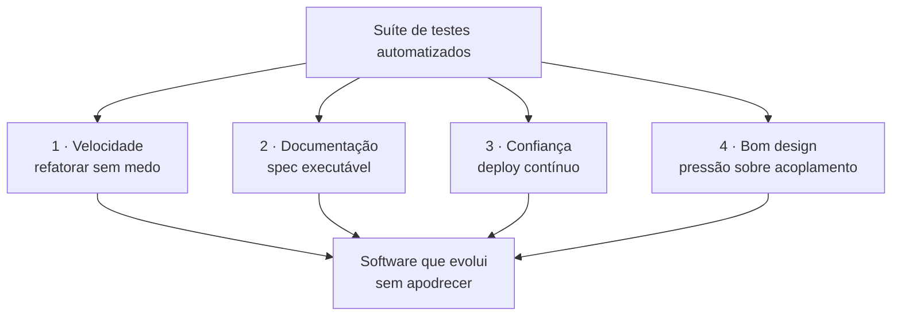
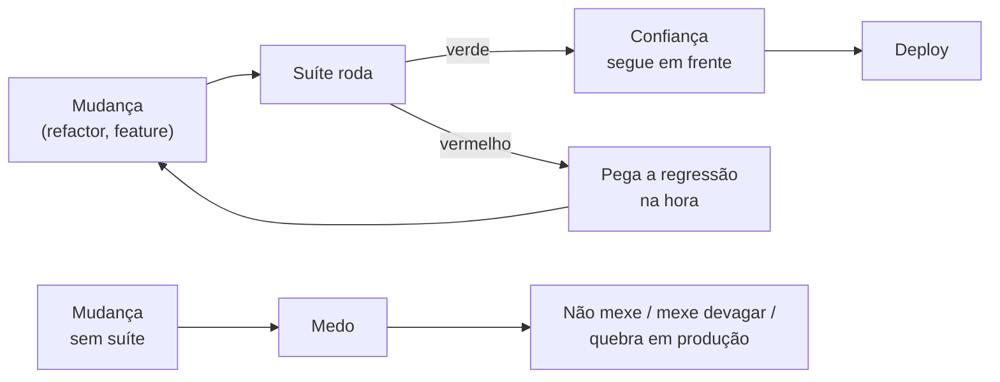
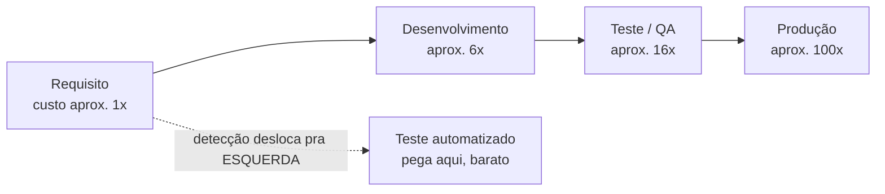
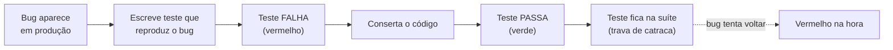
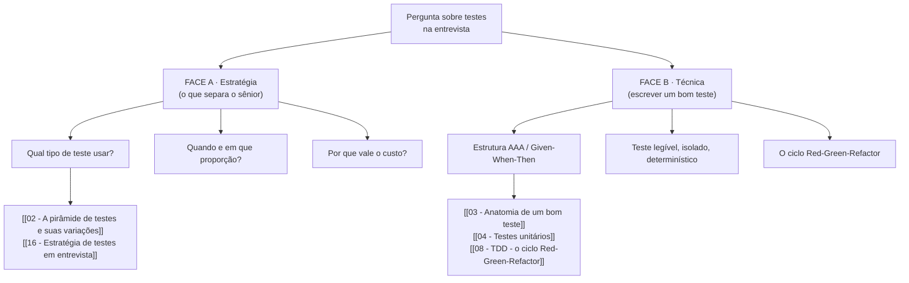

# O que são testes e por que testar

> [!abstract] Resumo em uma linha
> Um teste automatizado é um programa que roda o seu programa e verifica se o resultado bate com o esperado — mas a razão de existir dele não é caçar bug, é te dar velocidade, documentação viva, confiança pra fazer deploy e pressão por bom design.

Comece pela definição mais crua possível. Um teste automatizado é código. Código que chama o seu código, observa o que sai e compara com o que deveria sair. Se bate, passa. Se não bate, falha e te avisa. Só isso.

```python
def soma(a, b):
    return a + b

def test_soma():
    assert soma(2, 3) == 5   # arrange + act + assert, tudo aqui
```

Esse é o átomo. Um `assert` que confronta o real com o esperado. Tudo no mundo dos testes — frameworks, mocks, pirâmides, TDD — é elaboração em cima desse átomo.

Mas aqui está a pergunta que separa quem entende de quem decora: **se testar fosse só "achar bug", por que times maduros escrevem testes ANTES de o bug existir?** Por que escrevem testes pra código que já funciona? A resposta é que pegar bug é o efeito mais óbvio dos testes — e o menos importante.

## Testar não é caçar bug (essa é a parte rasa)

Pense num teste manual. Você roda o programa, clica nos botões, olha a tela. Funciona? Beleza. Esse é o jeito que todo mundo testa no começo — e funciona, até o programa crescer.

O problema do teste manual não é que ele falha em achar bugs. É que ele **não escala no tempo**. Você corrige um campo no formulário e precisa reclicar os outros quarenta pra ter certeza de que não quebrou nada. Ninguém faz isso. Então você confere só o que mexeu, reza, e descobre o estrago em produção.

O teste automatizado resolve isso com uma propriedade boba e poderosa: ele é barato de repetir. Escrever custa caro uma vez; rodar custa quase nada infinitas vezes. É essa assimetria que muda tudo.

> [!question] Então por que escrevemos testes de verdade?
> Não pra "verificar que funciona hoje". É pra **continuar sabendo que funciona depois de mil mudanças**. O valor do teste não está no momento em que você escreve — está em cada `git push` futuro em que ele roda sozinho e te diz "pode seguir".

## O que os testes NÃO podem fazer

Antes de vender testes, é preciso calibrar o que eles não entregam — senão você sai confiando demais. A frase canônica é de Edsger Dijkstra, num relatório da conferência da NATO sobre engenharia de software em 1969:

> [!warning] Testes provam a presença de bugs, não a ausência
> *"Program testing can be used to show the presence of bugs, but never to show their absence."* — Dijkstra, 1969. Um teste que passa só prova uma coisa: **aquele caminho específico, com aquelas entradas específicas, funcionou**. Diz zero sobre os infinitos caminhos que você não exercitou. Suíte verde não é certificado de "não tem bug" — é "não achei bug nos cenários que pensei em checar".

A razão é matemática. O espaço de entradas de quase qualquer função é grande demais pra testar exaustivamente. Uma função que soma dois inteiros de 64 bits tem mais de 1,8 sextilhão de pares de entrada possíveis (2 elevado a 128); você testa um punhado deles e extrapola. Testar é **amostragem**, não prova. Você escolhe os casos que parecem representativos — limites, zero, negativo, vazio, o "caminho feliz" — e aposta que cobrem as classes de comportamento que importam.

> [!tip] A pesquisa por radar
> Testar é como varrer um campo com radar. Você ilumina as direções para onde apontou a antena e vê o que está lá. O que está fora do cone do radar continua invisível — não porque não existe, mas porque você não apontou pra lá. Um teste passando ilumina um cone; a escuridão em volta continua escura. Por isso técnicas como testes de propriedade e fuzzing existem: elas giram a antena por você, gerando entradas que você não pensaria em escrever à mão.

Isso tem consequência prática direta em entrevista: nunca diga "meus testes garantem que não há bugs". Diga "minha suíte cobre os cenários de maior risco e me dá confiança proporcional à cobertura desses cenários". A primeira frase soa ingênua; a segunda soa sênior.

## As quatro funções estratégicas

Aqui mora a tese da nota. Testes existem por quatro razões, e nenhuma delas é "encontrar defeitos" diretamente. Vamos ver o mapa antes do detalhe.



Leitura do diagrama: a suíte é uma só, mas paga em quatro moedas diferentes. Velocidade, documentação, confiança e design são caminhos distintos que desembocam no mesmo lugar — software que continua mole, que aceita mudança sem virar pântano. Note que "achar bug" não aparece como função: ele é um sub-produto da função 1 (a suíte pega a regressão no instante em que você quebra algo).

### 1 · Velocidade — o paradoxo da rede de segurança

Esta é a função mais contra-intuitiva, então é a que mais cai em entrevista. A frase que todo júnior fala: *"testes deixam tudo mais lento, tenho que escrever o dobro de código"*. E está certo — no curtíssimo prazo.

O paradoxo: **testes parecem desacelerar e na verdade aceleram.** Por quê? Porque a coisa mais cara em software não é digitar código novo. É ter medo de mexer no código velho.



Leitura do diagrama: no trilho de cima, a suíte é uma **rede de segurança** — você muda, ela confere, e você sabe em segundos se quebrou algo. No trilho de baixo, sem suíte, cada mudança carrega medo, e medo é o freio mais caro que existe num codebase. Kent Beck nomeia isso direto: o objetivo do TDD é **eliminar o medo** do programador. Trabalhar com medo é trabalhar devagar.

> [!tip] A rede de segurança em uma imagem
> Um trapezista voa solto porque tem rede embaixo. Tire a rede e ele vai parar de soltar das mãos — vai se agarrar à barra. Código sem testes é trapezista sem rede: o time para de ousar refatorar, e o design congela no estado em que estava no dia em que o medo começou.

É por isso que testes habilitam **refatoração**. Refatorar é mudar a forma do código sem mudar o comportamento. Como você garante que o comportamento não mudou? A suíte verde. Sem ela, "refatorar" vira "reescrever e torcer".

Isso conecta direto com a entropia do software: todo sistema tende a apodrecer conforme é tocado por mãos diferentes ao longo de anos. Testes são o que segura a maré — veja [[03-Dominios/Fundamentos/Complexidade de Software/14 - Manutenção e evolução|Manutenção e evolução]] pra entender por que a manutenção, e não a escrita inicial, é onde mora o custo real do software.

#### O argumento econômico: o custo do bug cresce com o tempo

A versão de verdade do argumento financeiro não é "testes economizam dinheiro". É mais afiada: **o custo de consertar um bug cresce com o tempo que ele passa escondido**. Pegar um defeito na cabeça do desenvolvedor é quase grátis; pegar o mesmo defeito em produção, com cliente afetado e dados corrompidos, é caríssimo. Entre os dois extremos há uma escada de custo crescente.

A pesquisa clássica do IBM Systems Sciences Institute estimou essa escada em ordens de grandeza: um defeito custa cerca de 1 unidade pra corrigir se pego na fase de design, 6 vezes mais em desenvolvimento, 16 vezes mais no teste e perto de 100 vezes mais em produção. Os números exatos variam por estudo e devem ser lidos como tendência, não como tabela contábil — mas a tendência é robusta e sempre aponta pro mesmo lado: quanto mais à direita o bug é pego, mais caro.



Leitura do diagrama: a seta de cima é a linha do tempo de um bug solto na natureza — quanto mais ele anda pra direita sem ser pego, mais a barra de custo cresce, até o salto brutal de produção. A seta tracejada de baixo é a jogada: o teste automatizado **desloca a detecção pra esquerda**, pra perto do momento em que o código foi escrito. Esse movimento tem nome consagrado na indústria — **shift-left**: deslocar a verificação pra mais cedo no ciclo. Mover detecção pra esquerda é literalmente mover dinheiro do bolso da empresa de volta pra dentro.

> [!note] Shift-left em uma frase
> Não existe "não pegar o bug". Existe "pegar cedo e barato" ou "pegar tarde e caro". O teste automatizado é a ferramenta que torna o "cedo e barato" o caminho padrão, porque roda a cada commit, sem ninguém precisar lembrar de verificar.

E é aqui que o argumento econômico fecha o laço com **velocidade**. Uma suíte que move a detecção pra esquerda é exatamente a mesma suíte que dá confiança pra fazer deploy frequente e refatorar continuamente. Detecção barata e entrega rápida não são duas conquistas separadas — são a mesma rede de segurança vista pelo lado do dinheiro e pelo lado do calendário.

> [!info] As métricas DORA e o papel dos testes
> O programa de pesquisa **DORA** (DevOps Research and Assessment, hoje parte do Google) mede a performance de entrega de software por quatro métricas: **deployment frequency** (frequência de deploy), **change lead time** (tempo de commit até produção), **change failure rate** (taxa de mudanças que quebram) e o tempo de recuperação de falhas (no relatório de 2024 renomeado de MTTR pra *failed deployment recovery time*). Times de alta performance são rápidos E estáveis ao mesmo tempo. A suíte de testes é o que viabiliza essa combinação: ela é o portão que deixa o deploy ser frequente (velocidade) sem deixar a change failure rate subir (estabilidade). Sem testes confiáveis, você só consegue ser rápido OU estável, nunca os dois.

### 2 · Documentação — a spec que não mente

Todo README mente. Não por má fé: ele mente porque **o código muda e a prosa não acompanha**. Você lê "o endpoint retorna 200 com o usuário", roda, e leva 404. A documentação descreveu uma versão do sistema que não existe mais.

Um teste não pode mentir sobre o comportamento atual. Se o teste afirma `assert resposta.status == 200` e o código retorna 404, o teste **falha**. Documentação que falha quando está errada é documentação que se mantém honesta à força.

```python
def test_saque_acima_do_saldo_e_recusado():
    conta = Conta(saldo=100)
    with pytest.raises(SaldoInsuficiente):
        conta.sacar(150)
```

Leia esse teste como uma frase: "sacar mais que o saldo é recusado com `SaldoInsuficiente`". Isso é uma **especificação executável**. Um dev novo no time lê a suíte e aprende as regras de negócio sem precisar perguntar — e sem o risco de a regra estar desatualizada, porque se estivesse, a suíte estaria vermelha.

> [!note] Spec executável tem um nome melhor que README
> O melhor jeito de saber o que um método faz não é o comentário em cima dele. É o teste que descreve o que ele faz em cenários concretos. Por isso bons nomes de teste viram frases: `deve_recusar_saque_acima_do_saldo`. O conjunto de nomes da suíte é o sumário do comportamento do sistema.

### 3 · Confiança — sem suíte não existe deploy contínuo

Por que algumas empresas fazem deploy cinquenta vezes por dia e outras tremem pra subir uma vez por mês? A diferença raramente é ferramenta de CI. É **confiança na suíte**.

Entrega contínua é um pipeline: commit → testes → build → produção, sem mão humana clicando "aprovar". Esse pipeline só pode existir se há um portão automático em que você confia o suficiente pra deixar ir pra produção sem revisão manual. Esse portão é a suíte de testes.

> [!warning] A confiança é frágil e some rápido
> Basta a suíte deixar passar um bug feio em produção uma vez pra o time perder a fé nela — e voltar pro teste manual de tudo. Confiança em suíte é capital que se constrói devagar e se perde de uma vez. Testes que falham aleatoriamente (os flaky) são o ácido que corrói essa confiança: se metade das falhas é ruído, o time aprende a ignorar TODAS as falhas.

### 4 · Bom design — código difícil de testar é código mal desenhado

Esta função é a mais sutil e a mais valiosa. Quando você tenta escrever um teste e sofre — precisa subir um banco inteiro, mockar dez coisas, instanciar metade do sistema só pra testar uma função — o teste está te dando um **diagnóstico de design**, não um obstáculo.

Código fácil de testar é código com responsabilidades separadas e dependências que entram por fora (injetadas), em vez de serem criadas lá dentro. Isso não é coincidência: testabilidade e bom design são a mesma propriedade vista de ângulos diferentes.

> [!tip] O teste como crítico de arquitetura
> Se pra testar a função `calcular_frete` você precisa de uma conexão de banco real, é porque ela está acoplada ao banco quando não devia. O teste doloroso está apontando o acoplamento. A dor não é do teste — é do design, e o teste só a tornou visível.

O teste é, nesse sentido, o **primeiro cliente** da sua API — antes de qualquer código de produção consumi-la. Se o primeiro cliente reclama (precisa de muito setup, mocka meia dúzia de colaboradores, depende de estado global ou de um relógio real), os clientes seguintes vão reclamar igual; você só não os ouviu ainda. Três cheiros de design que o teste denuncia primeiro:

- **Setup gigante** — pra exercitar uma coisinha você precisa montar metade do mundo. Sinal de que a unidade faz coisas demais ou conhece gente demais (responsabilidades misturadas).
- **Excesso de mocks** — se o teste tem dez dublês, a unidade tem dez colaboradores; o acoplamento é alto e provavelmente as dependências nasceram lá dentro em vez de entrar por fora.
- **Dependência de estado global** — relógio do sistema, variável de ambiente, singleton mutável. Isso torna o teste não-determinístico e revela uma dependência escondida que deveria ser explícita e injetada.

É aqui que [[03-Dominios/Fundamentos/SOLID/index|SOLID]] entra como par natural dos testes. O **DIP** (Inversão de Dependência) — depender de abstrações e injetar as dependências concretas — é exatamente o que torna um objeto testável em isolamento: você passa um dublê no lugar da dependência real. Testes pressionam você a injetar dependências; injetar dependências é o coração do DIP. Quem pratica testes acaba praticando SOLID sem ter lido o acrônimo. Essa "pressão de design" fica concreta quando você escreve o primeiro teste de unidade — é o assunto de [[04 - Testes unitários]].

## Teste de regressão — a memória institucional dos bugs

Há um momento na vida de todo teste em que ele justifica sua existência sozinho: quando trava um bug pra ele nunca mais voltar. **Regressão** é o nome do fenômeno em que algo que funcionava volta a quebrar — em geral porque uma mudança em outro lugar derrubou de raspão um comportamento antigo. O teste de regressão é o anticorpo.

A receita é simples e disciplinada. Quando um bug aparece:

1. Antes de consertar, escreva um teste que **reproduz** o bug. Ele deve **falhar** — vermelho — provando que captura exatamente o defeito.
2. Conserte o código.
3. O teste agora **passa** — verde. O fix está confirmado, e não por inspeção visual.
4. O teste fica na suíte pra sempre. Se alguém reintroduzir o bug daqui a dois anos, ele acende vermelho na hora.



Leitura do diagrama: o fluxo da esquerda é a captura do bug — note que o teste nasce VERMELHO de propósito, porque um teste que já passa antes do fix não prova que pegou o defeito. Depois do conserto ele vira verde. A seta tracejada é o seguro vitalício: qualquer mudança futura que ressuscite o bug bate de cara na trava e acende vermelho antes de chegar em produção. É o efeito catraca de que Kent Beck fala — a suíte só anda pra frente, nunca deixa um ganho escorregar de volta.

> [!tip] A suíte como diário de bordo
> Cada teste de regressão é a cicatriz de um bug que já doeu. Lendo a suíte de um sistema antigo, você lê a história de tudo que já deu errado nele — é **memória institucional**. O dev que entrou ontem herda essa memória de graça: não precisa repetir os erros que o time já cometeu e pagou. Uma suíte madura é um cemitério de bugs, e cada lápide impede uma ressurreição.

Vale distinguir dois termos que entrevistador adora confundir: **retestar** (*retesting*) é confirmar que aquele fix específico funcionou; **teste de regressão** é rodar a suíte inteira pra garantir que o fix não quebrou outra coisa. O primeiro olha pro bug; o segundo olha pro resto do sistema.

## O custo é real — e mesmo assim vale

Seria desonesto pintar testes como grátis. Eles têm dois custos concretos:

- **Custo de escrita**: cada comportamento testado é código a mais pra digitar e pensar.
- **Custo de manutenção**: quando o comportamento legítimo muda, os testes daquele comportamento precisam mudar junto. Uma suíte mal desenhada faz cada refactor disparar dezenas de testes vermelhos por nada.

Esse segundo custo é o veneno silencioso. Testes acoplados a detalhes de implementação (em vez de comportamento) viram um lastro: quebram a cada mudança interna mesmo quando o comportamento externo está intacto. Vladimir Khorikov chama isso de falta de **resistência a refatoração** — uma das quatro qualidades de um bom teste (proteção contra regressão, resistência a refatoração, feedback rápido, manutenibilidade). Voltaremos a isso em [[03 - Anatomia de um bom teste]].

> [!question] Se custa, por que vale?
> Porque o custo de escrever e manter testes é pago UMA vez por comportamento, e a economia (refatorar sem medo, deploy sem tremer, onboarding sem perguntar) é colhida MIL vezes ao longo da vida do sistema. A conta só fecha porque software vive muito mais tempo na fase de manutenção do que na de escrita inicial.

A nuance sênior: nem todo código merece o mesmo nível de teste. Um script descartável que roda uma vez não precisa de suíte. Um motor de cálculo de juros que processa milhões de reais por dia precisa de muito teste. Saber **onde** gastar o orçamento de testes é estratégia — não dogma.

> [!warning] A falácia do "não temos tempo pra testar"
> Essa é a desculpa mais comum e a mais furada. A verdade é que **você sempre testa** — a pergunta é só *como*. Quem não escreve teste automatizado não deixou de testar; está testando à mão, rodando o app e clicando, toda vez que mexe em algo. A escolha real não é "testar ou não testar". É: **testar à mão toda vez** (caro, lento, não repetível, esquecível) ou **automatizar uma vez** (caro uma vez, depois quase grátis pra sempre). "Não temos tempo pra automatizar" quase sempre significa "vamos pagar o teste manual em prestações, eternamente, e fingir que não é custo". Como o teste manual não aparece numa story do board, ele vira trabalho invisível — e trabalho invisível é o mais caro de todos, porque ninguém o questiona.

## As duas faces dos testes em entrevista

Aqui está o mapa de todo o galho. Testes aparecem em entrevista de duas formas bem diferentes, e confundir as duas é o erro clássico do candidato.



Leitura do diagrama: a **Face A (estratégia)** é o que o entrevistador de sênior está sondando — ele quer ouvir você raciocinar sobre QUAIS testes escrever, em que proporção, e por quê, à luz de confiança × velocidade × custo. A **Face B (técnica)** é a habilidade de mão: escrever um teste limpo, isolado e legível. Júnior costuma só ter a Face B. O candidato que articula a Face A — "eu colocaria a maior parte do esforço em testes unitários do domínio, poucos de integração nas fronteiras, e pouquíssimos end-to-end nos fluxos críticos, porque..." — soa sênior na hora.

> [!tip] A frase que resume a senioridade
> Escrever um teste é fácil. Desenhar uma **estratégia** de testes que equilibra confiança, velocidade e custo de manutenção é o que diferencia. Frameworks você aprende numa tarde; estratégia você defende numa entrevista.

Este galho cobre as duas faces. A técnica vem em [[03 - Anatomia de um bom teste]] e [[04 - Testes unitários]]; o ciclo de trabalho guiado por testes em [[08 - TDD - o ciclo Red-Green-Refactor]]; a estratégia macro em [[02 - A pirâmide de testes e suas variações]] e [[16 - Estratégia de testes em entrevista]]. E, na ponta de linguagem, [[Testes em Java]] e [[Testes em JavaScript]] aterrissam tudo isso em ferramentas concretas.

## Em entrevista

Frases prontas em inglês pra defender a importância dos testes sem soar dogmático:

- "Tests aren't primarily about catching bugs — they're a **safety net** that lets us refactor and ship without fear."
- "A good test suite is **executable documentation**: unlike a README, it can't drift out of date, because if it lied, it would fail."
- "Continuous delivery only works if you trust your suite — the test suite is the automated gate that replaces manual sign-off."
- "When a piece of code is **hard to test**, that's usually a design smell pointing at tight coupling or hidden dependencies, not a problem with testing itself."
- "Writing tests has a real **cost** to write and maintain, but it pays off because software spends far more of its life being changed than being written."
- "I'd separate the **strategy** question — what to test and in what proportion — from the **technique** of writing a clean, isolated test; senior interviews usually probe the first."
- "I treat **flaky tests** as a fire to put out fast, because they erode the team's trust in the whole suite."
- "As Dijkstra put it, **testing shows the presence of bugs, not their absence** — a green suite means I didn't find bugs in the cases I thought to check, not that none exist. Testing is **sampling**, not proof."
- "The economic case for automated tests is **shift-left**: the cost of a defect grows the longer it stays hidden, so moving detection closer to the moment the code is written is moving money back into the company."
- "When code is **hard to test**, the test is acting as the first client of my API — painful setup or too many mocks is a **design pressure** pointing at coupling, not a testing problem."
- "After fixing a bug I write a **regression test** that fails before the fix and passes after, so the suite becomes institutional memory and the bug can never silently come back."
- "A trustworthy test suite is what lets a team be both fast and stable at once — it's the gate behind healthy **DORA metrics** like deployment frequency and change failure rate."

### Vocabulário

| Português | English |
| --- | --- |
| teste automatizado | automated test |
| suíte de testes | test suite |
| spec / especificação executável | executable specification |
| rede de segurança | safety net |
| refatorar sem medo | refactor without fear |
| cobertura de testes | test coverage |
| regressão | regression |
| teste de regressão | regression test |
| retestar (confirmar o fix) | retesting |
| deslocar para a esquerda | shift-left |
| custo do defeito | cost of defect |
| amostragem | sampling |
| pressão de design | design pressure |
| teste de propriedade | property-based test |
| teste instável / não-determinístico | flaky test |
| dependência injetada | injected dependency |
| dublê de teste | test double |
| entrega contínua | continuous delivery |
| custo de manutenção | maintenance cost |

> [!info] Lastro
> - Kent Beck, *Test-Driven Development: By Example* (Addison-Wesley, 2002) — testes como rede de segurança que elimina o medo de refatorar; "the tests are the teeth of the ratchet".
> - Vladimir Khorikov, *Unit Testing Principles, Practices, and Patterns* (Manning, 2020) — as quatro qualidades de um bom teste: proteção contra regressão, resistência a refatoração, feedback rápido e manutenibilidade.
> - Michael Feathers, *Working Effectively with Legacy Code* (Prentice Hall, 2004) — código legado definido como "código sem testes"; testes como pré-condição pra mudar com segurança.
> - Edsger W. Dijkstra, em J. N. Buxton e B. Randell (eds.), *Software Engineering Techniques* (NATO Science Committee, conferência de Roma, 1969; publicado 1970) — origem documentada de "testing shows the presence, not the absence of bugs"; também em EWD249, *Notes On Structured Programming*.
> - IBM Systems Sciences Institute — estimativa clássica do custo crescente do defeito por fase (aprox. 1x design, 6x desenvolvimento, 16x teste, 100x produção); números variam por estudo, lidos como tendência. Base empírica do argumento shift-left.
> - DORA / DevOps Research and Assessment (Google) — as quatro métricas de performance de entrega (deployment frequency, change lead time, change failure rate e tempo de recuperação de falha, renomeado de MTTR pra *failed deployment recovery time* no relatório de 2024); a suíte de testes como viabilizador de "rápido E estável".

## Veja também

- [[02 - A pirâmide de testes e suas variações]] — a estratégia macro: quais tipos e em que proporção
- [[03 - Anatomia de um bom teste]] — a técnica: o que faz um teste ser bom
- [[04 - Testes unitários]] — o tijolo fundamental da pirâmide
- [[08 - TDD - o ciclo Red-Green-Refactor]] — escrever o teste antes do código
- [[16 - Estratégia de testes em entrevista]] — a Face A destrinchada
- [[03-Dominios/Fundamentos/Testes/index|Testes]] — índice do galho
