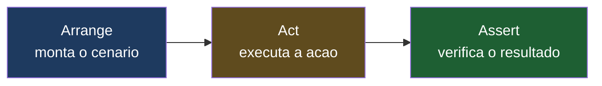
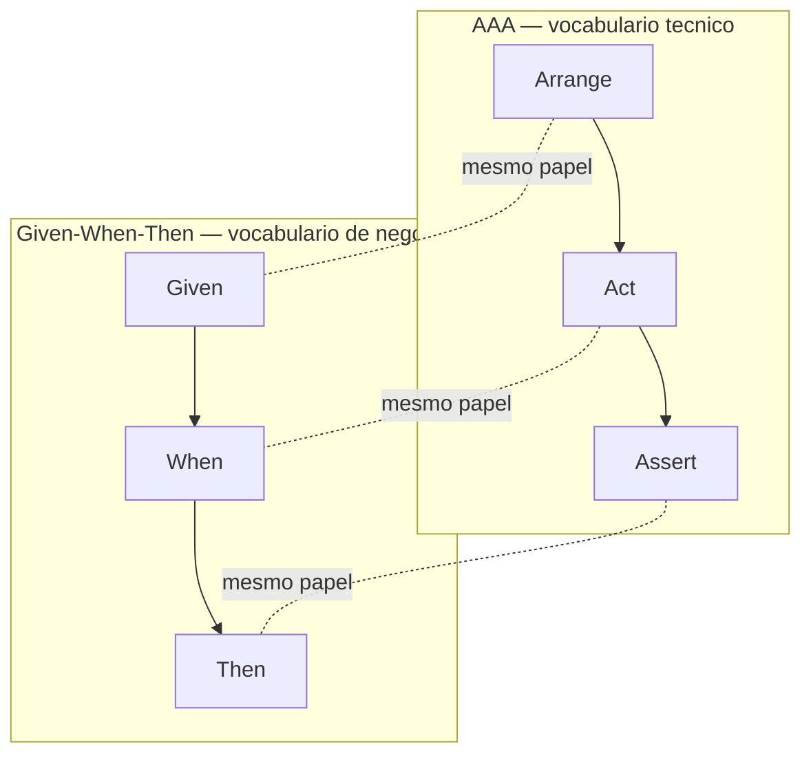
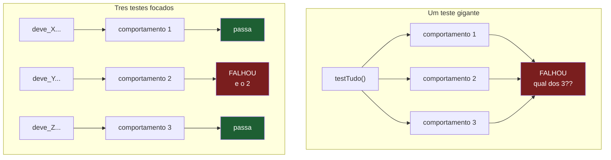
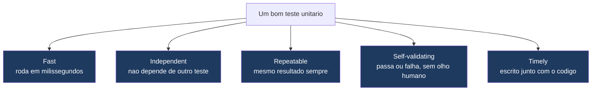

# Anatomia de um bom teste

> [!abstract] Resumo em uma linha
> Um bom teste arruma o cenário, executa uma ação e verifica um comportamento (AAA), tem nome que conta o que e quando, falha por uma única razão e obedece ao F.I.R.S.T — Fast, Independent, Repeatable, Self-validating, Timely.

Escrever teste é fácil. Escrever um bom teste é outra coisa.

A diferença não está em testar mais. Está em testar de um jeito que, seis meses depois, quando o build ficar vermelho, você consiga olhar a falha e dizer em dez segundos: "ah, é isso". Um teste ruim falha e te deixa coçando a cabeça. Um teste bom aponta o dedo para o problema.

Esta nota é a anatomia. Quais ossos sustentam um teste que vale a pena ter.

## A receita de bolo: Arrange-Act-Assert

Pense em fazer um bolo. Primeiro você separa os ingredientes na bancada: farinha, ovos, açúcar. Depois você mistura e leva ao forno. Por fim, você espeta o palito para ver se assou.

Todo teste decente segue exatamente essa coreografia. Ela tem nome: **AAA — Arrange, Act, Assert** (Arranjar, Agir, Verificar).

- **Arrange** — monte o cenário. Crie os objetos, prepare os dados, configure os dublês. É a bancada com os ingredientes.
- **Act** — execute a única ação que está sob teste. Chame o método. Uma linha, idealmente.
- **Assert** — verifique se o resultado bate com o esperado. É o palito no bolo.

O padrão nasceu com Bill Wake (2001) e foi popularizado por Kent Beck em *Test Driven Development: By Example*.

```java
@Test
void deve_aplicar_desconto_quando_cliente_e_vip() {
    // Arrange
    Cliente cliente = new Cliente(TipoCliente.VIP);
    Carrinho carrinho = new Carrinho(cliente);
    carrinho.adicionar(new Item("Livro", 100.00));

    // Act
    BigDecimal total = carrinho.calcularTotal();

    // Assert
    assertThat(total).isEqualByComparingTo("90.00"); // 10% off VIP
}
```

Repare nos três blocos separados por linhas em branco. Você lê de cima a baixo e entende a história sem precisar de comentário (os `// Arrange` aqui são só didáticos).



**Leitura do diagrama:** as três fases acontecem em ordem fixa e sem volta. Você nunca arruma de novo no meio do verificar. Se precisar, é sinal de que o teste está fazendo coisa demais.

> [!tip] Por que separar fisicamente
> A separação visual das três fases é o que torna o teste legível. Uma linha em branco entre Arrange e Act, outra entre Act e Assert. Quem lê acha o "ponto de virada" sem esforço. É barato e paga muito.

## Given-When-Then: o mesmo esqueleto, outro idioma

Se você vier do mundo BDD (Behavior-Driven Development), vai encontrar o mesmo padrão com outro vocabulário: **Given-When-Then** (Dado-Quando-Então), cunhado por Dan North e Chris Matts em meados dos anos 2000.

- **Given** (Dado) = Arrange — o contexto inicial.
- **When** (Quando) = Act — o evento que acontece.
- **Then** (Então) = Assert — o resultado esperado.

A diferença não é estrutural. É de **público**. AAA fala a língua do programador ("instancie o objeto"). Given-When-Then fala a língua do stakeholder ("dado um cliente VIP, quando ele finaliza a compra, então recebe 10% de desconto"). É o mesmo bolo descrito para o engenheiro de alimentos ou para quem vai comer.



**Leitura do diagrama:** as linhas tracejadas dizem o essencial — Given é Arrange, When é Act, Then é Assert. Escolha o vocabulário conforme quem vai ler o teste. Como diz Martin Fowler, pensar em Given-When-Then empurra você a raciocinar sobre **comportamento**, não sobre estado interno.

```gherkin
Funcionalidade: Desconto VIP
  Cenário: Cliente VIP ganha 10% de desconto
    Dado um cliente do tipo VIP
    E um carrinho com um livro de R$ 100,00
    Quando ele calcula o total
    Então o total deve ser R$ 90,00
```

## O nome conta a história

Aqui mora um dos maiores ganhos de um teste, e o mais ignorado.

O nome do teste deve te dizer **o que** está sendo testado e **sob qual condição** — sem você precisar abrir o corpo. Quando o build quebra, o CI te mostra primeiro o **nome**. Se o nome for `test1` ou `testCalculo`, você não aprendeu nada e vai ter que ler o código todo.

Compare:

- `testDesconto()` — inútil. Desconto de quê? Quando? Quanto?
- `deve_aplicar_desconto_de_10_porcento_quando_cliente_e_vip()` — você já sabe o que quebrou.

Convenções comuns (escolha uma e seja consistente no projeto):

| Convenção | Exemplo |
| --- | --- |
| `deve_X_quando_Y` (PT) | `deve_lancar_excecao_quando_saldo_insuficiente` |
| `should X when Y` (EN) | `should_throw_when_balance_insufficient` |
| `methodUnderTest_scenario_expectedBehavior` | `saque_saldoInsuficiente_lancaExcecao` |

> [!warning] Nomes que não dizem nada
> `test1`, `testCreate`, `testHappyPath`, `testIt`. São formas de não nomear. O nome do teste é a primeira linha de documentação que alguém lê quando algo quebra. Trate-o como uma frase, não como um rótulo.

A regra prática: leia o nome em voz alta. Se ele soa como uma frase que descreve uma regra de negócio, está bom. Se soa como o nome de uma variável temporária, refaça.

## Um teste, uma razão para falhar

Esta é a propriedade mais sutil — e a que mais separa o júnior do sênior.

Imagine um teste gigante com 20 verificações cobrindo 5 comportamentos diferentes. Ele quebra. O CI mostra "FALHOU". Qual dos 5 comportamentos está com problema? Você não sabe. Tem que abrir, ler, debugar. O teste falhou, mas não te disse o que falhou.



**Leitura do diagrama:** no teste gigante, a falha é ambígua — sabe-se que algo quebrou, não o quê. Nos testes focados, dois passam (verde) e um falha (vermelho): o diagnóstico vem de graça, sem abrir o código. Cada teste é um fusível: queima o que estourou, deixa o resto aceso.

A regra é: **um comportamento por teste**. Prefira muitos testes pequenos e focados a um monstro que verifica tudo.

> [!danger] O mito da "uma assertion por teste"
> Você vai ouvir "use uma única assertion por teste". Isso é meia-verdade — vira dogma e atrapalha. O correto é **um comportamento por teste**, não uma linha de assert por teste. Verificar que um objeto retornado tem `nome`, `email` e `id` corretos pode ser três asserts que validam **um** comportamento ("o objeto foi montado direito"). Tudo bem. O que você não quer é um teste que verifica cadastro, login e exclusão de uma vez só.

## F.I.R.S.T — as cinco leis

Robert C. Martin, no *Clean Code*, condensou as propriedades de um bom teste unitário em um acrônimo: **F.I.R.S.T**.



**Leitura do diagrama:** as cinco propriedades não são opcionais nem alternativas — um teste unitário decente atende as cinco ao mesmo tempo. Falhar em uma já o degrada.

### Fast — rápido

Testes unitários têm que rodar em milissegundos. Por quê? Porque você roda a suíte o tempo todo — a cada salvamento, a cada refactor. Se a suíte leva 30 minutos, você para de rodar. E teste que você não roda não protege ninguém.

Quem deixa o teste lento? Geralmente é banco de dados, rede, disco, `sleep`. Teste unitário não toca nada disso — quem toca é teste de integração (ver [[04 - Testes unitários]] para a fronteira).

### Independent — independente

Cada teste tem que rodar sozinho, em qualquer ordem, sem depender do que outro teste fez antes. Se o `teste_B` só passa quando o `teste_A` rodou primeiro (porque A deixou um registro no banco que B usa), você tem um acoplamento escondido. Mude a ordem e tudo desmorona.

Estado compartilhado entre testes é uma das causas-raiz de [[11 - Testes flaky]] — testes que passam às vezes e falham às vezes sem nada ter mudado.

### Repeatable — repetível

Rodou agora, rodou daqui a uma hora, rodou na máquina do colega, rodou no CI: mesmo resultado, sempre. Um teste que depende da data atual (`new Date()`), de um número aleatório, ou de um fuso horário, é uma bomba-relógio. Hoje passa. No dia 31 do mês, ou em outro timezone, falha.

> [!note] Determinismo é tudo
> Repeatable e Independent são primos. Os dois atacam a **não-determinismo**. Tempo, aleatoriedade, ordem de execução, estado externo — tudo que faz o teste depender de algo que você não controla é inimigo. Veja [[11 - Testes flaky]] para o catálogo completo de causas.

### Self-validating — auto-validável

O teste decide sozinho se passou ou falhou. Verde ou vermelho, booleano. Sem você ter que ler um log e julgar "hmm, parece certo". Se um humano precisa interpretar a saída, não é teste automatizado — é checklist manual disfarçado. A assertion é o juiz; ela diz sim ou não.

### Timely — oportuno

Escreva o teste junto com o código de produção, idealmente um pouco antes (a essência do TDD). Por quê "oportuno" e não "qualquer hora"? Porque teste escrito meses depois testa o código que você *acha* que escreveu, não o que você escreveria se o teste guiasse o design. Teste tardio também tende a nunca ser escrito — sempre tem algo mais urgente.

## Sem lógica no teste

Olhe este teste e desconfie:

```java
@Test
void calculaDesconto() {
    for (TipoCliente tipo : TipoCliente.values()) {
        Cliente c = new Cliente(tipo);
        if (tipo == TipoCliente.VIP) {
            assertThat(c.desconto()).isEqualByComparingTo("0.10");
        } else {
            assertThat(c.desconto()).isEqualByComparingTo("0.00");
        }
    }
}
```

Tem `for`, tem `if`. Isso é **código**. E código tem bug. Quem testa o teste? Se a lógica condicional do teste estiver errada, ele pode passar quando deveria falhar — um falso positivo silencioso.

Pior: lógica no teste quase sempre é sinal de que o teste está fazendo coisa demais. Aquele `for` está escondendo vários casos diferentes que mereciam ser testes separados (com nomes próprios, e diagnóstico próprio quando falham).

> [!tip] Use testes parametrizados, não loops
> JUnit (`@ParameterizedTest`), pytest (`@pytest.mark.parametrize`), xUnit (`[Theory]`) existem exatamente para isso: rodar o mesmo teste com vários dados, **sem** você escrever o loop. Cada caso vira uma linha de dados, o framework cuida da iteração, e cada caso falha individualmente com nome próprio.

A regra: o corpo de um teste deve ser uma linha reta. Arrange, Act, Assert, fim. Sem desvios.

## O teste como documentação viva

README envelhece. Comentário mente. Mas o teste, se está verde, está dizendo a verdade sobre o que o código faz — porque ele **roda** contra o código.

Uma classe de teste bem nomeada é a melhor documentação executável que existe:

```
ClienteVipTest
  ✓ deve_aplicar_10_porcento_de_desconto_no_total
  ✓ deve_acumular_pontos_em_dobro
  ✗ deve_ter_frete_gratis_acima_de_50_reais
```

Lendo só os nomes, um dev novo entende as regras de negócio do cliente VIP em 15 segundos — e ainda vê que o frete grátis está quebrado. Nenhum README faz isso.

Por isso, **legibilidade vence esperteza**. Um teste que usa um truque genial mas exige cinco minutos para ser entendido é um teste ruim, mesmo que correto. Escreva o teste para o humano que vai lê-lo às 3 da manhã durante um incidente, não para impressionar.

> [!info] Comportamento, não implementação
> A propriedade mais importante de um bom teste — testar **o que** o código faz, não **como** ele faz — é tão central que tem nota dedicada. Um teste amarrado aos detalhes internos quebra a cada refactor mesmo quando o comportamento não mudou. Aprofunde em [[06 - Testar comportamento, não implementação]].

## Em entrevista

A good test is structured as **Arrange-Act-Assert** — set up the scenario, perform one action, verify the outcome — which is the same skeleton as **Given-When-Then** in BDD, just spoken in stakeholder language. The test name should tell you *what* and *when* without reading the body, using a convention like `should_X_when_Y` or `methodUnderTest_scenario_expectedBehavior`. I aim for **one reason to fail per test**: many small focused tests beat one giant test, because a focused test that fails points straight at the broken behavior. I keep tests **F.I.R.S.T** — Fast, Independent, Repeatable, Self-validating, Timely — and I avoid conditional logic (`if`/`for`) inside tests, reaching for parameterized tests instead. Well-named tests are the best living documentation: they can't go stale because they run against the code. And the deepest property is testing behavior, not implementation, so the suite survives refactoring.

### Vocabulário

| PT | EN |
| --- | --- |
| arranjo-ação-verificação | arrange-act-assert |
| dado-quando-então | given-when-then |
| auto-validável | self-validating |
| uma razão para falhar | one reason to fail |
| testes parametrizados | parameterized tests |
| documentação viva | living documentation |
| falso positivo | false positive |
| convenção de nomenclatura | naming convention |
| comportamento, não implementação | behavior, not implementation |

> [!info] Lastro
> - Martin Fowler, ["Given When Then"](https://martinfowler.com/bliki/GivenWhenThen.html) — origem do GWT com Dan North e Chris Matts; raciocinar em comportamento, não estado.
> - Bill Wake / Kent Beck, *Test Driven Development: By Example* (2002) — onde o idioma Arrange-Act-Assert foi popularizado.
> - Robert C. Martin, *Clean Code* (cap. "Unit Tests") — origem do acrônimo F.I.R.S.T (Fast, Independent, Repeatable, Self-validating, Timely).

## Veja também

- [[01 - O que são testes e por que testar]] — por que escrever testes antes de como escrevê-los bem.
- [[04 - Testes unitários]] — a fronteira "unitário × integração" que sustenta o "Fast" do F.I.R.S.T.
- [[06 - Testar comportamento, não implementação]] — a propriedade mais profunda de um bom teste.
- [[11 - Testes flaky]] — quando Independent e Repeatable são violados.
- [[16 - Estratégia de testes em entrevista]] — como falar de qualidade de teste numa conversa de design.
- [[03-Dominios/Fundamentos/Testes/index|Testes]] — o galho inteiro.
