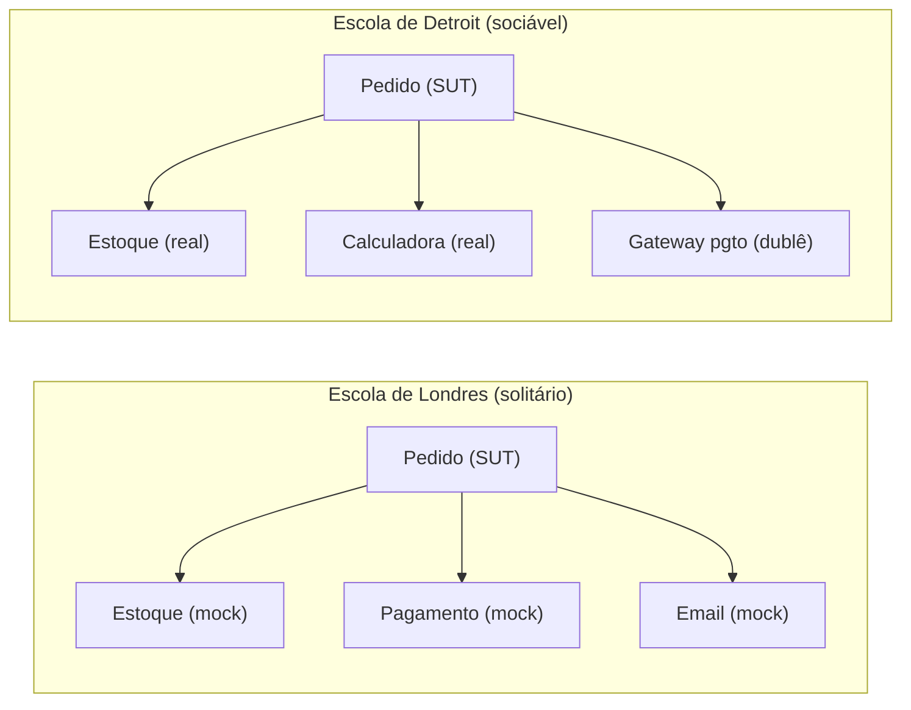
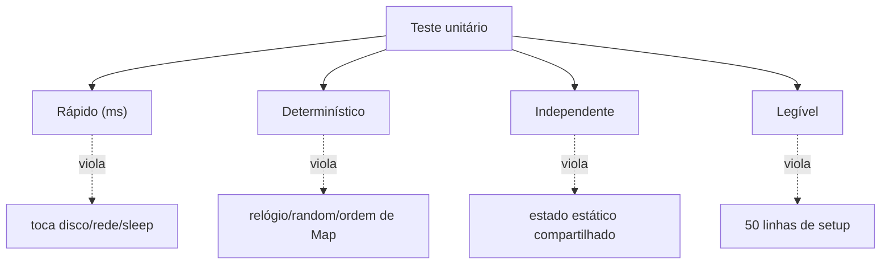
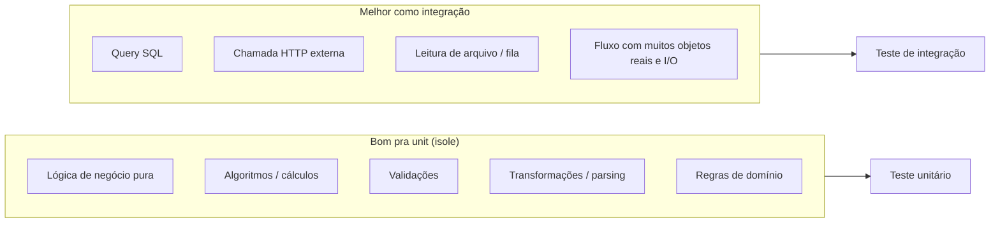
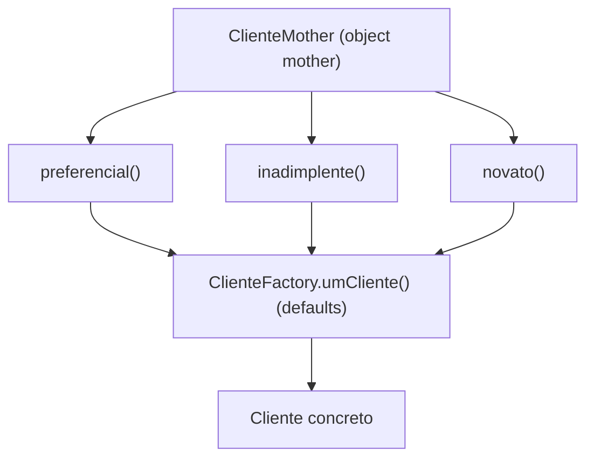

# Testes unitários

> [!abstract] Resumo em uma linha
> Teste unitário verifica uma unidade de comportamento isolada do resto do sistema, rápido e determinístico — e a maior briga da área é sobre o que "isolada" significa.

Imagine um mecânico testando uma vela de ignição. Ele não liga o carro inteiro pra ver se a vela funciona. Ele monta a vela numa **bancada**, aplica corrente, e olha a faísca. Peça isolada, no banco de testes, resultado óbvio em segundos.

Teste unitário é isso. Você pega um pedaço pequeno do código, coloca na bancada, dá uma entrada e olha a saída. Sem ligar o motor inteiro. Sem subir banco de dados. Sem rede.

E é por isso que ele é o tipo de teste mais barato, mais rápido e mais numeroso da sua base. É a fundação. Veja `[[01 - O que são testes e por que testar]]` pra entender onde ele se encaixa no quadro maior.

## O que é uma "unidade"?

Aqui mora a primeira armadilha. Pergunte a dez engenheiros o que é uma "unidade" e você vai ouvir dez respostas.

- Uns dizem: uma **função** ou método.
- Uns dizem: uma **classe**.
- Uns dizem: um **módulo** ou pacote.

Martin Fowler resolve isso de um jeito esperto. Ele diz que a unidade nunca foi sobre **tamanho** — sempre foi sobre **isolamento**. A pergunta de verdade não é "quão grande é a unidade?", é "**a unidade conversa com colaboradores reais ou não?**".

E é dessa pergunta que nasce a guerra santa do mundo dos testes.

### As duas escolas

Existem duas tradições, e elas brigam há vinte anos.

> [!note] As duas escolas, sem rodeio
> - **Escola Clássica / de Detroit (Chicago)** — a unidade é uma **unidade de comportamento**. Os colaboradores reais ficam no teste. Você só substitui o que dói (banco, rede, relógio). Fowler chama esses testes de **sociáveis** (*sociable*).
> - **Escola de Londres / mockista** — a unidade é uma **classe**. Todos os colaboradores são substituídos por dublês. A classe é testada sozinha. Fowler chama esses testes de **solitários** (*solitary*).

Os termos *solitary* e *sociable* foram cunhados por Jay Fields; Fowler os adotou no seu verbete clássico sobre testes. O próprio Fowler se declara da escola clássica — ele prefere testes sociáveis.



Lead-in: o mesmo objeto `Pedido` sob teste, com as duas filosofias lado a lado.

Leitura do diagrama: na escola de Londres, tudo que não é o `Pedido` vira mock — até colaboradores baratos como `Estoque`. Na escola de Detroit, só o que tem efeito colateral feio (`Gateway de pagamento`) vira dublê; `Estoque` e `Calculadora` continuam reais porque rodam em memória, rápido.

### O trade-off de verdade

Por que isso importa numa entrevista? Porque revela se você entende o **custo escondido** de cada escolha.

> [!warning] O trade-off: isolamento × acoplamento à implementação
> - **Londres (solitário)** te dá **isolamento perfeito**: quando o teste quebra, você sabe exatamente qual classe está com defeito — só ela é real. Mas você paga com **acoplamento à implementação**. Pra mockar um colaborador, o teste precisa saber *quais* métodos a classe chama e em que ordem. Mude a colaboração interna sem mudar o comportamento e os mocks quebram mesmo assim. Teste frágil.
> - **Detroit (sociável)** te dá **acoplamento ao comportamento**: o teste só olha entrada e saída, não liga pra como por dentro. Refatorar a tripa interna não quebra o teste. Mas você perde **localização do defeito**: quando quebra, pode ser o objeto sob teste ou qualquer um dos reais que ele usa.

Essa tensão é o coração de duas outras notas. A escolha de *quais* dublês usar é `[[05 - Test doubles - dummy, stub, spy, mock, fake]]`. E a ideia de que teste deveria amarrar comportamento, não a estrutura interna, é `[[06 - Testar comportamento, não implementação]]` — a defesa principal da escola de Detroit.

> [!tip] Posição madura
> Sênior não escolhe time pra vida toda. Escolhe por contexto. Lógica de domínio rica com muitos objetos colaborando em memória? Sociável, deixa eles reais. Uma classe que orquestra dependências caras (rede, fila, banco)? Solitária, mocka as fronteiras. O dogma é o inimigo.

## Propriedades de um bom teste unitário

Independente de escola, um bom teste unitário tem quatro propriedades inegociáveis. Elas mapeiam direto no acrônimo **F.I.R.S.T.** de `[[03 - Anatomia de um bom teste]]`.

> [!note] As quatro propriedades
> - **Rápido** — milissegundos, não segundos. Você roda milhares deles a cada save. Se um teste unitário demora 200ms, ele não é unitário; está tocando algo que não devia (disco, rede, sleep).
> - **Determinístico** — mesma entrada, mesma saída, sempre. Hoje, amanhã, na sua máquina, na CI, às 3h da manhã com o relógio virando o dia. Sem isso, vira `[[11 - Testes flaky]]`.
> - **Independente** — qualquer ordem, qualquer subconjunto. O teste 7 não pode depender do teste 3 ter rodado antes. Sem estado compartilhado entre testes.
> - **Legível** — o teste é documentação executável. Quem lê entende a regra de negócio sem abrir o código de produção.



Lead-in: as quatro propriedades e o que costuma violar cada uma.

Leitura do diagrama: cada propriedade tem um inimigo clássico. As linhas tracejadas mostram o pecado correspondente — e a maioria das dores de teste cai num desses quatro buracos.

## O que é bom (e o que não é) pra teste unitário

Nem tudo merece teste unitário. Saber **onde** o teste unitário brilha é metade da maturidade.



Lead-in: a fronteira entre o que é bom isolar e o que precisa do mundo real.

Leitura do diagrama: tudo à esquerda é determinístico e roda em memória — território natural do teste unitário. Tudo à direita só tem valor se exercitar a coisa real (o dialeto SQL, a serialização do HTTP, o protocolo da fila). Mockar essas fronteiras num teste unitário só testa o seu mock, não o sistema.

> [!question] Por que não testar a query SQL com unit?
> Porque pra mockar o banco você precisa fingir o que o banco faz. E o que ele faz — dialeto, índices, constraints, tipos — é justamente o que pode estar errado. Você acaba testando a sua suposição sobre o banco, não o banco. Isso é `[[07 - Testes de integração]]`. Em Java o ferramental concreto disso (`@DataJpaTest`, Testcontainers) está em `[[Testes em Java]]`.

Regra de bolso: **se a parte mais interessante do teste é o efeito colateral, não é unitário.** Se a parte mais interessante é a lógica, é unitário e deve ser puro.

## Não repita setup: fixtures, factories e object mothers

Conforme a base cresce, você descobre uma dor chata: criar dados de teste. Pra testar o cálculo de uma fatura, você precisa de um `Cliente`, com endereço, com histórico, com plano. Quinze linhas de setup antes de chegar na linha que importa. Repetido em trinta testes.

Existem três ferramentas pra matar essa repetição, em ordem crescente de sofisticação.

### Fixture

Estado inicial compartilhado, montado antes do teste rodar. No JUnit, o `@BeforeEach`. No pytest, a `fixture`. É o "cenário base" que vários testes partilham.

> [!warning] Cuidado com fixture compartilhada
> Fixture estática ou mutável compartilhada entre testes é a porta de entrada da dependência de ordem. Se o teste A altera a fixture e o teste B assume o estado original, você quebrou a propriedade **Independente**. Prefira fixture recriada por teste.

### Factory / Builder

Uma função (ou builder fluente) que monta o objeto com **defaults sensatos**, e te deixa sobrescrever só o que importa pro teste em questão.

```java
// Factory com defaults sensatos
public final class ClienteFactory {

    public static Cliente.Builder umCliente() {
        return Cliente.builder()
            .nome("Cliente Padrão")
            .email("cliente@exemplo.com")
            .status(Status.ATIVO)
            .limiteCredito(new BigDecimal("1000.00"));
    }
}

// No teste: só o que importa fica visível
@Test
void bloqueiaCompraAcimaDoLimite() {
    Cliente cliente = ClienteFactory.umCliente()
        .limiteCredito(new BigDecimal("100.00"))  // o que importa
        .build();

    assertThrows(LimiteExcedidoException.class,
        () -> cliente.comprar(new BigDecimal("150.00")));
}
```

O ganho é brutal: o teste mostra **só a variável relevante** (`limiteCredito`). O resto some no default. Quem lê entende a regra em três segundos.

### Object Mother

A jogada de mestre. Uma **factory nomeada por persona** — o objeto não nasce genérico, nasce *já num papel de negócio*. Fowler descreve o Object Mother como um nome cativante pra uma factory que devolve fixtures padrão usadas em vários testes; o padrão foi documentado num paper de Peter Schuh e Stephanie Punke.

```java
public final class ClienteMother {

    public static Cliente preferencial() {
        return ClienteFactory.umCliente()
            .status(Status.ATIVO)
            .limiteCredito(new BigDecimal("50000.00"))
            .pontosFidelidade(10_000)
            .build();
    }

    public static Cliente inadimplente() {
        return ClienteFactory.umCliente()
            .status(Status.BLOQUEADO)
            .limiteCredito(BigDecimal.ZERO)
            .faturasVencidas(3)
            .build();
    }
}

@Test
void inadimplenteNaoCompra() {
    Cliente cliente = ClienteMother.inadimplente();  // a persona conta a história
    assertThrows(ContaBloqueadaException.class,
        () -> cliente.comprar(new BigDecimal("10.00")));
}
```



Lead-in: a object mother empilha sobre a factory, nomeando personas de negócio.

Leitura do diagrama: a `Factory` cuida dos defaults técnicos. A `Object Mother` empilha por cima e dá **nome de negócio** às variações (`preferencial`, `inadimplente`). O teste pede a persona, não o estado bruto — fica auto-explicativo.

> [!warning] O lado escuro da object mother
> Fowler avisa: a classe tende a **inchar** com o tempo. Cada teste novo quer sua persona, e a mother vira um depósito de mil métodos. Mantenha as personas que representam papéis de negócio reais; pra variações pontuais, prefira o builder direto no teste.

## Determinismo: o inimigo silencioso

A propriedade mais traiçoeira de matar é o determinismo. O código parece puro, mas tem uma fonte de não-determinismo escondida. Três suspeitos clássicos:

> [!danger] Os três ladrões do determinismo
> - **O relógio.** `LocalDateTime.now()` dentro da lógica. O teste passa hoje, falha na virada do mês. **Injete um `Clock`** (ou um provedor de tempo) e congele-o no teste.
> - **O acaso.** `Random` sem seed, UUID gerado dentro da lógica. **Injete o gerador** ou use seed fixa no teste.
> - **A ordem da coleção.** Iterar um `HashMap` e assertar a ordem da saída. A ordem de um `HashMap` não é garantida. Use `LinkedHashMap`/`TreeMap` na produção se a ordem importa, ou asserte sem depender de ordem.

```java
// RUIM: relógio escondido, não-determinístico
public boolean expirou() {
    return LocalDateTime.now().isAfter(this.validade);
}

// BOM: relógio injetado, testável e determinístico
public boolean expirou(Clock clock) {
    return LocalDateTime.now(clock).isAfter(this.validade);
}

@Test
void expiraAposValidade() {
    Clock congelado = Clock.fixed(
        Instant.parse("2026-06-18T10:00:00Z"), ZoneOffset.UTC);
    var assinatura = new Assinatura(LocalDateTime.parse("2026-06-17T10:00"));
    assertTrue(assinatura.expirou(congelado));
}
```

Esses três são as causas-raiz mais comuns de `[[11 - Testes flaky]]` — o teste que passa às vezes. Matá-los na fonte (injetando a dependência) é mais barato que caçar a flakiness depois.

## O teste como primeiro cliente do código

Tem um benefício do teste unitário que não cabe na lista de "garantir corretude": **ele é o primeiro usuário da sua API**.

Quando você senta pra testar uma classe e descobre que precisa de quinze linhas de setup, mockar seis colaboradores e fingir três singletons globais — o teste não está ruim. **O design está ruim.** O teste só foi o primeiro a sentir a dor.

> [!tip] Difícil de testar = difícil de usar
> Código difícil de testar é código com más fronteiras: muitas dependências, estado escondido, acoplamento forte. O teste expõe isso *antes* do código entrar em produção e ser usado por gente de verdade. Por isso a escola que escreve o teste **primeiro** dá tanto valor ao teste como ferramenta de design — esse é o ciclo de `[[08 - TDD - o ciclo Red-Green-Refactor]]`.

Escrever o teste antes te força a pensar na interface do ponto de vista de quem chama. Você acaba com APIs mais limpas, dependências explícitas e menos estado global. O teste vira projeto, não só verificação.

## Em entrevista

Use these in English when the topic comes up.

A unit test exercises a single **unit of behavior** in isolation, and it must be fast, deterministic, and independent of other tests. The deepest debate is what "in isolation" means: the **London (mockist) school** treats the unit as a class and replaces every collaborator with a test double — solitary tests — while the **Detroit (classical) school** treats the unit as a behavior and keeps cheap collaborators real — sociable tests. The trade-off is sharp: solitary tests pinpoint failures but couple to implementation through their mocks, whereas sociable tests survive refactoring but blur where the defect lives. I keep business logic, algorithms, and validations as unit tests, and push anything that depends on SQL dialects, the network, or real I/O down to integration tests. To kill boilerplate I use factories with sensible defaults and **object mothers** named by business persona, like a `preferencial()` or `inadimplente()` customer. And the moment a test needs heavy setup, I read it as a design smell — the test is the code's first client, telling me the API is hard to use.

### Vocabulário

- unidade sob teste / SUT — *unit under test / system under test (SUT)*
- dublê de teste — *test double*
- teste sociável — *sociable test*
- teste solitário — *solitary test*
- fixture — *fixture*
- fábrica de objetos — *object factory / builder*
- object mother (fábrica por persona) — *object mother*
- determinístico — *deterministic*
- não-determinismo / instável — *flakiness / flaky*
- localização do defeito — *failure localization / pinpointing*
- defaults sensatos — *sensible defaults*
- relógio injetável — *injectable clock*

> [!info] Lastro
> - Martin Fowler, [bliki: "UnitTest"](https://martinfowler.com/bliki/UnitTest.html) — escolas clássica × mockista, e a definição de testes sociáveis × solitários (termos de Jay Fields).
> - Martin Fowler, [bliki: "ObjectMother"](https://martinfowler.com/bliki/ObjectMother.html) — o padrão Object Mother como factory de fixtures, referência ao paper de Schuh e Punke, e o aviso de inchaço.
> - Vladimir Khorikov, *Unit Testing: Principles, Practices, and Patterns* (Manning, 2020) — tratamento da escola de Londres × clássica e do trade-off isolamento × acoplamento.

## Veja também

- `[[01 - O que são testes e por que testar]]` — onde o teste unitário se encaixa na pirâmide.
- `[[03 - Anatomia de um bom teste]]` — F.I.R.S.T. e a estrutura AAA.
- `[[05 - Test doubles - dummy, stub, spy, mock, fake]]` — os dublês que as duas escolas usam de formas diferentes.
- `[[06 - Testar comportamento, não implementação]]` — a defesa central da escola sociável.
- `[[07 - Testes de integração]]` — o que fazer com SQL, rede e I/O.
- `[[08 - TDD - o ciclo Red-Green-Refactor]]` — o teste como ferramenta de design.
- `[[11 - Testes flaky]]` — quando o determinismo falha.
- `[[16 - Estratégia de testes em entrevista]]` — como amarrar tudo numa resposta.
- `[[Testes em Java]]` — o ferramental concreto (JUnit, Mockito, AssertJ).
- Índice da trilha: `[[03-Dominios/Fundamentos/Testes/index|Testes]]`
