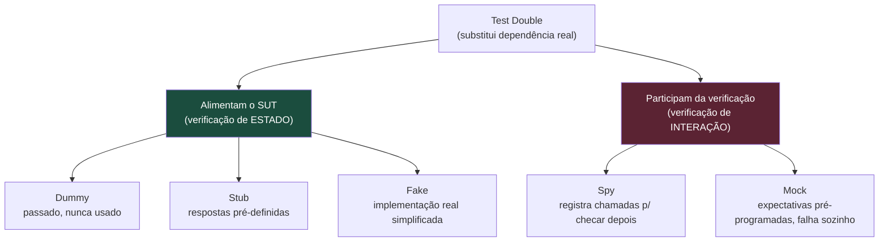
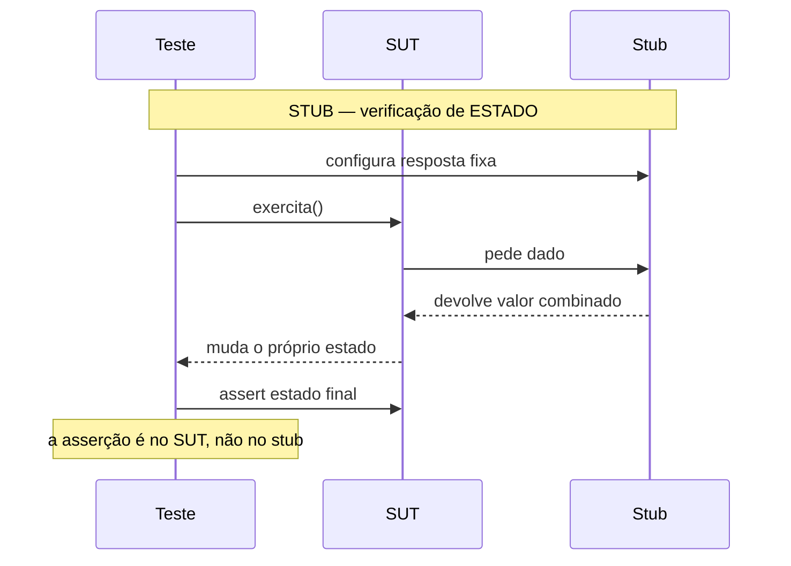
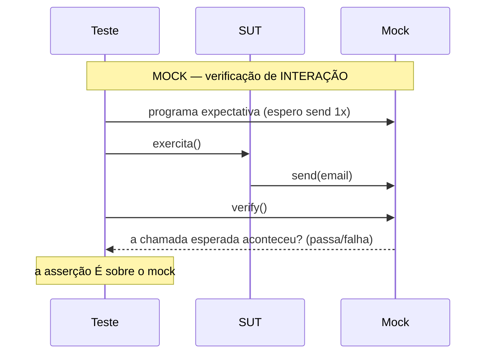
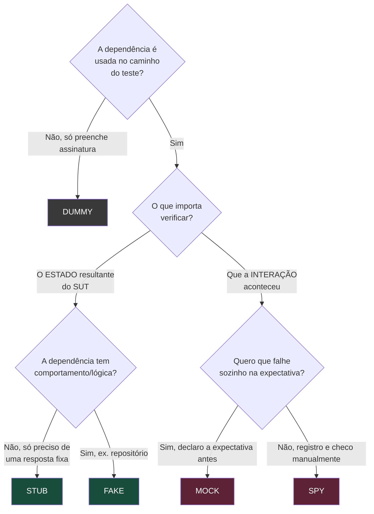

# Test doubles: dummy, stub, spy, mock, fake

> [!abstract] Resumo em uma linha
> *Test double* é o termo guarda-chuva pra qualquer objeto que substitui uma dependência real no teste; os cinco tipos (dummy, stub, spy, mock, fake) diferem em **quanto fazem** e em **se verificam estado ou interação**.

Quando você testa uma classe, ela quase nunca está sozinha. Ela conversa com um banco, um gateway de pagamento, um serviço de e-mail. No teste, você raramente quer o banco de verdade — quer algo no lugar dele. Esse "algo no lugar" tem nome.

Gerard Meszaros, no *xUnit Test Patterns*, deu a esse algo o nome de **Test Double** — uma analogia direta com o dublê de cinema. O ator principal (a dependência real) não entra em todas as cenas; em algumas você coloca um dublê. O público não percebe, mas o dublê está ali só pra fazer aquela cena funcionar.

A sacada é que existem *vários tipos* de dublê, e confundi-los é a fonte número um de testes ruins e de respostas embaralhadas em entrevista.

## A analogia do set de filmagem

Pense num set. Há vários tipos de "gente substituindo gente":

- O **figurante de fundo** que aparece na cena mas nunca fala nem interage — está lá só pra preencher o quadro. Esse é o **dummy**.
- O **dublê de fala** que tem uma frase decorada e a repete sempre igual, não importa o que aconteça — esse é o **stub**.
- O **assistente que anota tudo** que o ator fez durante a cena, pra o diretor conferir depois — esse é o **spy**.
- O **diretor de cena** que já chegou sabendo exatamente o que o ator *deve* fazer e barra a tomada na hora se ele errar a deixa — esse é o **mock**.
- O **dublê de ação** treinado, que realmente executa a cena (cai, corre, luta), só que de um jeito mais barato e controlado que o original — esse é o **fake**.

Guarde essa imagem. Ela carrega toda a taxonomia.

## A taxonomia, em um diagrama

O ponto que organiza tudo: os cinco tipos se dividem em dois mundos. Quem **alimenta** o teste (entrega valores ou comportamento pro SUT trabalhar) e quem **verifica** o teste (o próprio dublê faz parte da asserção).



Leitura do diagrama: tudo é *test double*. O galho da esquerda (dummy, stub, fake) existe pra fazer o SUT rodar — depois você verifica o **estado** do SUT. O galho da direita (spy, mock) entra na própria asserção — você verifica a **interação**. Essa divisão é a coisa mais importante da nota.

> [!warning] Cuidado com o vocabulário do dia a dia
> Na boca da maioria dos devs, "mock" virou sinônimo de "qualquer dublê". Mockito, Jest, Moq chamam tudo de "mock". A taxonomia de Meszaros é mais precisa, e é ela que separa quem entende de testes de quem só decora framework. Em entrevista, demonstre que você sabe a diferença.

## Os cinco tipos, lado a lado

| Tipo | O que faz | Alimenta ou verifica? | Exemplo típico |
|---|---|---|---|
| **Dummy** | Passado adiante, **nunca usado** de fato | Nenhum (só preenche assinatura) | `new User(null)` num parâmetro obrigatório irrelevante |
| **Stub** | Devolve **respostas fixas** pré-configuradas | Alimenta (estado) | "o gateway retorna `aprovado`" |
| **Fake** | **Implementação real**, porém simplificada | Alimenta (estado) | repositório in-memory, fake HTTP server |
| **Spy** | **Registra** como foi chamado, pra checar depois | Verifica (interação) | "o stub que também conta quantas vezes foi chamado" |
| **Mock** | Pré-programado com **expectativas**, falha sozinho | Verifica (interação) | "espero que `send()` seja chamado uma vez com este e-mail" |

Vamos um a um.

### Dummy — o figurante

O dummy existe só pra preencher uma lista de parâmetros. Ele é passado, mas o caminho de código exercido pelo teste **nunca o usa**.

```java
// O construtor exige um Logger, mas este teste
// nunca dispara nada que use o logger.
Logger dummy = null; // ou um objeto vazio
PriceCalculator calc = new PriceCalculator(dummy);

assertEquals(100, calc.total(items)); // o dummy nunca foi tocado
```

Se o dummy *fosse* usado, o teste quebraria (NPE) — e isso é bom: prova que ele realmente não participa.

### Stub — a fala decorada

O stub responde sempre a mesma coisa. Ele **não se importa** se foi chamado uma vez ou dez; só devolve o valor combinado. Serve pra colocar o SUT num caminho específico.

```java
PaymentGateway stub = mock(PaymentGateway.class);
when(stub.charge(any())).thenReturn(Result.APPROVED); // resposta fixa

OrderService service = new OrderService(stub);
service.checkout(order);

assertEquals(Status.PAID, order.status()); // verifico o ESTADO do pedido
```

Repare: a asserção é sobre o **estado final** (`order.status()`), não sobre o stub. O stub só alimentou o caminho.

### Fake — o dublê de ação

O fake tem comportamento de verdade. Ele *funciona*, só que com um atalho que o torna inadequado pra produção. O exemplo clássico de Meszaros é um banco de dados in-memory.

```java
// Implementação completa de UserRepository, mas guardando
// tudo num HashMap em vez de no Postgres.
class InMemoryUserRepository implements UserRepository {
    private final Map<Long, User> store = new HashMap<>();
    public void save(User u) { store.put(u.id(), u); }
    public User findById(Long id) { return store.get(id); }
}
```

Diferença crucial pro stub: o fake tem **lógica**. Salve e depois busque — ele lembra. Um stub `findById` devolveria sempre o mesmo objeto programado, sem se importar com o que você salvou.

### Spy — o assistente que anota

O spy é um stub que **também grava** como foi chamado, pra você conferir depois (na fase de asserção). É verificação de interação feita de forma manual/passiva.

```java
class EmailSpy implements EmailSender {
    List<Email> sent = new ArrayList<>();
    public void send(Email e) { sent.add(e); } // só registra
}

EmailSpy spy = new EmailSpy();
new SignupService(spy).register(user);

assertEquals(1, spy.sent.size());          // verifico DEPOIS
assertEquals("welcome", spy.sent.get(0).template());
```

O spy registra durante a execução e você inspeciona no fim. É o meio-termo entre stub e mock.

### Mock — o diretor exigente

O mock já chega sabendo o que **espera** receber. As expectativas são programadas *antes* (no setup) e o próprio mock **falha o teste** se elas não forem cumpridas — ou se chegar uma chamada que ele não previa.

```java
EmailSender mockSender = mock(EmailSender.class);

new SignupService(mockSender).register(user);

// O mock verifica a INTERAÇÃO: foi chamado certo?
verify(mockSender).send(argThat(e -> e.template().equals("welcome")));
verifyNoMoreInteractions(mockSender);
```

A diferença pro spy é sutil mas conceitual: o **mock carrega a expectativa dentro de si** e insiste nela. Só o mock, dos cinco, *insiste* em verificação de interação.

## Mock × Stub: a distinção que confunde todo mundo

Aqui está o coração da nota. Stub e mock parecem iguais na superfície — ambos substituem um colaborador. A diferença não está em *como* são criados, mas em *o que você verifica no teste*.

Martin Fowler cristalizou isso em **"Mocks Aren't Stubs"** com dois termos:

- **Verificação de estado** (*state verification*) — depois de exercitar o SUT, você olha o **estado** dele (e dos colaboradores) e pergunta: "ficou certo?". Stub, fake e dummy vivem aqui.
- **Verificação de interação/comportamento** (*behavior verification*) — você verifica que o SUT **fez as chamadas certas, do jeito certo**, no colaborador. Só o mock insiste nisso.



Leitura do diagrama: o stub é coadjuvante. Ele só entrega o dado combinado pro SUT trabalhar. A pergunta final do teste ("deu certo?") é respondida olhando o **SUT**, não o stub.

Agora o mock:



Leitura do diagrama: o mock é protagonista da asserção. A pergunta final ("deu certo?") é respondida perguntando ao **próprio mock** se ele recebeu as chamadas que esperava. O estado do SUT pode nem ser olhado.

> [!tip] A frase que resolve em entrevista
> "Um stub me **dá** uma resposta pra eu seguir; um mock me **cobra** uma interação que eu verifico. Stub alimenta verificação de estado; mock é verificação de interação." Dito assim, você passou.

## Por que a distinção importa (e onde ela machuca)

Testes baseados em **interação** (mocks) acoplam o teste à **implementação** — ao *como* o SUT faz, não ao *que* ele entrega. Se amanhã você refatorar o SUT pra chamar o colaborador de outro jeito (duas chamadas em vez de uma, outro método equivalente) sem mudar o comportamento observável, o mock **quebra mesmo com tudo funcionando**.

Isso é o famoso teste frágil: vermelho sem bug. E é o gancho direto pra próxima nota — [[06 - Testar comportamento, não implementação]] aprofunda *quando* o acoplamento à implementação vale a pena e quando é veneno. Aqui basta a fronteira: mock pesa a balança pro lado da implementação; stub/estado, pro lado do comportamento.

> [!danger] Sintoma de overmocking
> Se seu teste tem mais linhas de `when(...)` e `verify(...)` do que de asserção real sobre resultado, ele provavelmente está testando o mock — não o seu código. Você acabou escrevendo um teste que diz "meu código chama os métodos que eu disse que ele chamaria". Tautologia cara de manter.

## Qual dublê escolher?



Leitura do diagrama: primeiro pergunte se a dependência é tocada (se não, dummy). Depois, o eixo decisivo: você verifica **estado** (stub/fake) ou **interação** (mock/spy)? Por fim, refine: estado com lógica vira fake; interação com expectativa declarada vira mock.

Em prosa, os casos canônicos:

- **Dummy** — o método exige um parâmetro que este teste não exercita. Passe qualquer coisa.
- **Stub** — você precisa controlar a resposta de uma dependência: *"o gateway retorna sucesso"*, *"a API devolve 404"*. Sem lógica, só o valor.
- **Fake** — a dependência tem comportamento que o teste depende de verdade. Repositório que precisa lembrar o que foi salvo, relógio que avança. Mais robusto que stub, mais barato que o real.
- **Mock** — você precisa verificar um **efeito colateral que só é observável por interação**: *"enviou o e-mail?"*, *"publicou o evento?"*. Não há estado de retorno pra checar; a única evidência é a chamada.
- **Spy** — útil em código legado ou quando você quer espionar uma instância real parcialmente (Mockito `spy()` embrulha um objeto de verdade). Em código novo bem desenhado, raramente é a primeira escolha.

> [!note] Heurística prática
> Prefira **fakes e stubs** (verificação de estado) por padrão; recorra a **mocks** só quando o resultado for *invisível* exceto pela interação (e-mail enviado, mensagem publicada, log de auditoria gravado). Isso te mantém testando comportamento, não fiação interna.

## Frameworks são ferramenta, não conceito

Mockito (Java), Jest/Sinon (JS), Moq (.NET), unittest.mock (Python) — todos produzem esses dublês. Mas atenção: a API deles **não respeita a taxonomia de Meszaros**. Em Mockito, `mock()` cria um objeto que você pode usar como stub (`when().thenReturn()`) ou como mock (`verify()`) — o *tipo* é definido pelo **uso no teste**, não pela construção.

Ou seja: a mesma instância vira stub se você só configura respostas, e vira mock se você a verifica. O conceito mora no *teste*, não na *biblioteca*.

Os detalhes de cada ferramenta vivem nas notas de stack: [[Testes em Java]] (JUnit + Mockito) e [[Testes em JavaScript]] (Jest, mocks de módulo, spies). Aqui paramos no conceito.

## Em entrevista

A *test double* is the umbrella term for anything that stands in for a real dependency in a test — the analogy is a stunt double. The five types differ along one axis: do they **feed** the test or **participate in the verification**? Dummies, stubs, and fakes feed the SUT and you assert on **state**; mocks and spies are part of the assertion and verify **interaction**. The classic confusion is mock versus stub: a stub *gives* you a canned answer so the SUT can proceed, while a mock *demands* a specific interaction and fails the test itself if it doesn't happen — that's Fowler's distinction between state verification and behavior verification. I reach for fakes and stubs by default and only use mocks when the outcome is invisible except through the interaction, like "did we send the email?". The risk with mocks is coupling the test to the implementation, so a behavior-preserving refactor turns the test red even though nothing broke.

### Vocabulário PT → EN

| Português | English |
|---|---|
| dublê de teste | test double |
| objeto simulado / mock | mock object |
| esboço / resposta fixa | stub |
| espião | spy |
| falso / implementação simplificada | fake |
| objeto vazio / de preenchimento | dummy |
| verificação baseada em estado | state verification |
| verificação baseada em interação | behavior / interaction verification |
| sistema sob teste | system under test (SUT) |
| colaborador / dependência | collaborator / dependency |
| expectativa | expectation |
| efeito colateral | side effect |
| teste frágil | brittle / fragile test |
| acoplado à implementação | coupled to the implementation |

> [!info] Lastro
> - Gerard Meszaros, *Mocks, Fakes, Stubs and Dummies* — [xunitpatterns.com](http://xunitpatterns.com/Mocks,%20Fakes,%20Stubs%20and%20Dummies.html) (a taxonomia original do *xUnit Test Patterns*).
> - Martin Fowler, *Mocks Aren't Stubs* — [martinfowler.com](https://martinfowler.com/articles/mocksArentStubs.html) (state vs. behavior verification; classical vs. mockist TDD).
> - Martin Fowler, *Test Double* (bliki) — [martinfowler.com/bliki/TestDouble.html](https://martinfowler.com/bliki/TestDouble.html) (resumo dos cinco tipos com a analogia do *stunt double*).

## Veja também

- [[04 - Testes unitários]] — onde os dublês entram pra isolar o SUT
- [[06 - Testar comportamento, não implementação]] — a filosofia por trás de preferir estado a interação
- [[07 - Testes de integração]] — quando trocar o fake pelo real e deixar a dependência rodar
- [[16 - Estratégia de testes em entrevista]] — como articular tudo isso sob pressão
- [[Testes em Java]] — Mockito na prática
- [[Testes em JavaScript]] — Jest/Sinon na prática
- [[03-Dominios/Fundamentos/Testes/index|Testes]] — índice do galho
