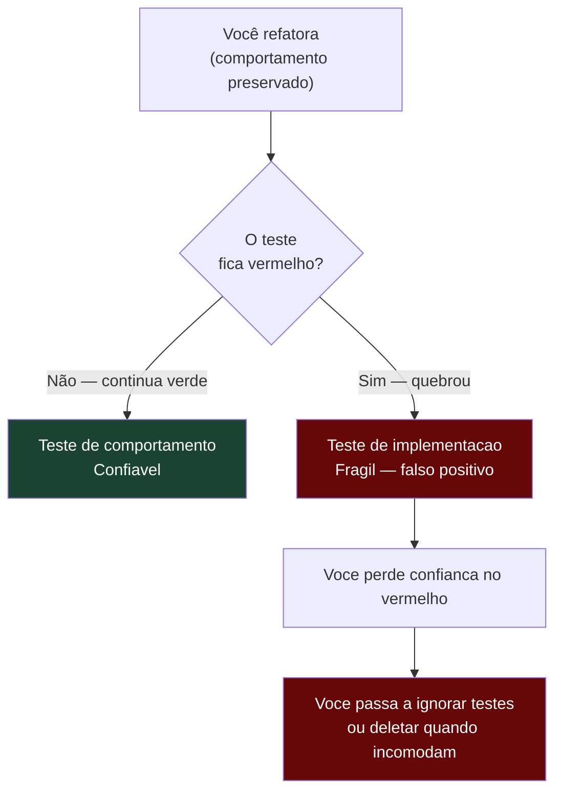
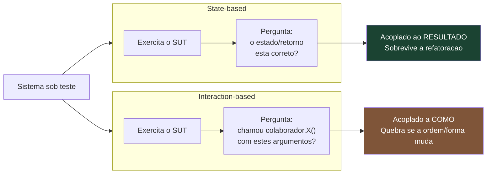
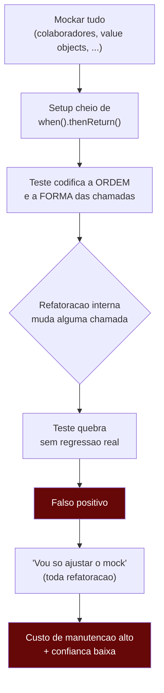
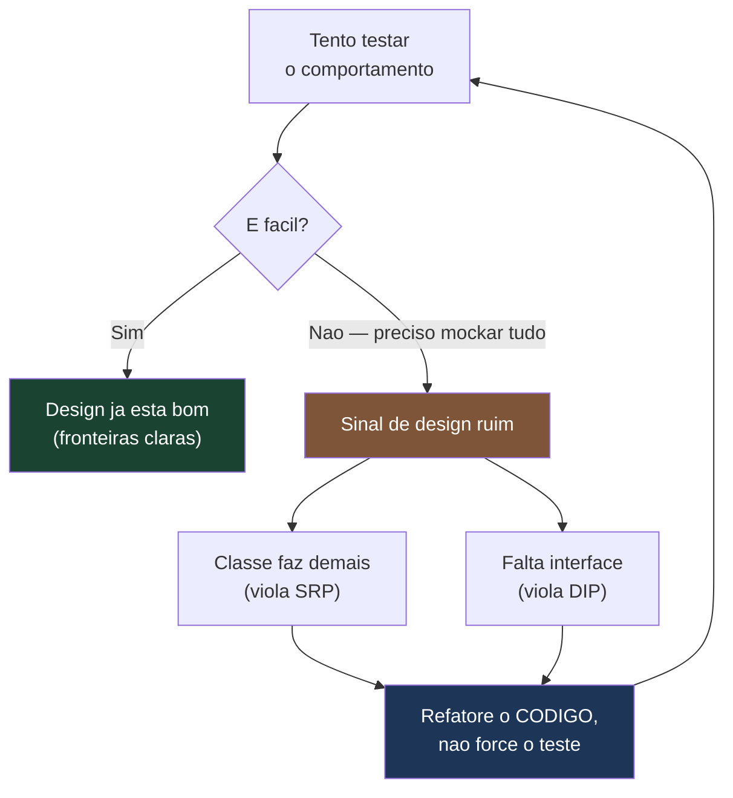

# Testar comportamento, não implementação

> [!abstract] Resumo em uma linha
> Um bom teste verifica o resultado observável do código, não os passos internos que o produziram — por isso ele sobrevive à refatoração.

Imagine que você precisa avaliar um cozinheiro. Há dois jeitos. O primeiro: você prova o prato. Está no ponto? Tempero certo? Apresentação boa? O segundo: você fica atrás dele com uma prancheta anotando cada movimento de faca — "cortou a cebola em 0,8 cm, depois pegou a frigideira com a mão esquerda, depois...".

O primeiro avaliador testa **comportamento**. O segundo testa **implementação**.

Agora pense: o que acontece quando o cozinheiro descobre uma forma melhor de cortar a cebola? Para o primeiro avaliador, nada — o prato continua delicioso. Para o segundo, o mundo desaba: "ERRADO! Você cortou diferente!". E o prato? Ah, o prato ele nem provou.

Essa é a nota inteira em uma metáfora. O teste que prova o prato é robusto. O teste que cronometra a faca é frágil. E a maior parte dos testes ruins que você vai encontrar na vida estão segurando uma prancheta.

## A regra de ouro

> [!important] A regra
> Se você refatora o código mantendo o comportamento e um teste quebra, **o teste está errado** — não o código.

Refatoração, por definição, muda a estrutura interna sem mudar o comportamento observável. Renomear uma variável. Extrair um método. Trocar um `for` por um `stream`. Reordenar duas chamadas que não dependem uma da outra. Nada disso altera o que o sistema *faz*.

Então o que um teste de comportamento deveria fazer durante uma refatoração? **Nada.** Continuar verde. Silencioso. Confirmando que você não quebrou nada.

Quando o teste fica vermelho numa refatoração pura, ele acabou de te dar um **falso positivo**: gritou "regressão!" sem que houvesse regressão. Khorikov chama essa propriedade de **resistência à refatoração** (*resistance to refactoring*) e a coloca como um dos quatro pilares de um bom teste. Um teste que não resiste à refatoração polui seu sinal: você para de confiar no vermelho, porque metade das vezes é só o teste sendo chato.



Leitura do diagrama: o ramo da esquerda é o objetivo. O da direita é a espiral — um teste frágil não só te incomoda, ele corrói a sua confiança no suite inteiro. E um suite em que ninguém confia é pior que nenhum suite, porque custa manutenção sem dar segurança.

O que é, então, o "comportamento observável"? São três coisas que o mundo de fora consegue enxergar:

- **Retorno** — o valor que o método devolve.
- **Estado** — como o objeto (ou o sistema) ficou depois.
- **Efeito visível** — uma interação com uma dependência externa que *só* é observável por essa interação (o e-mail foi enviado de verdade, a linha foi gravada no banco).

Tudo o que estiver entre a chamada e essas três coisas é **implementação**: métodos privados, ordem de operações internas, estruturas de dados intermediárias, qual colaborador foi chamado primeiro. Nada disso é assunto do seu teste.

## State-based × interaction-based testing

Há duas formas de escrever a asserção de um teste, e a escolha entre elas é o coração da fragilidade.

**State-based** (verificação de estado): você exercita o código e depois pergunta *"o objeto ficou como eu esperava?"*. Olha o retorno, olha o estado final.

**Interaction-based** (verificação de comportamento/interação): você pergunta *"o código chamou os colaboradores certos, com os argumentos certos?"*. Olha as chamadas — `verify(emailService).send(...)`.

Fowler, em **"Mocks Aren't Stubs"**, formaliza essa divisão: *state verification* investiga o estado do sistema e dos colaboradores depois do exercício; *behavior verification* checa se o sistema fez as chamadas corretas aos colaboradores. Stubs trabalham com verificação de estado; só mocks *insistem* em verificação de interação.



Leitura do diagrama: os dois começam igual — exercitam o SUT. A diferença está na pergunta final. State-based pergunta sobre o *resultado* e por isso tolera mudanças internas. Interaction-based pergunta sobre o *processo* e por isso fica refém dele. Não é que interaction-based seja sempre errado — é que ele cobra um preço (acoplamento) que nem sempre vale a pena.

> [!tip] A heurística
> **Prefira state-based.** Use interaction-based só quando o efeito é *exclusivamente* observável pela interação — não há estado nem retorno para inspecionar.

O exemplo canônico é o envio de e-mail. Quando seu serviço chama `emailService.send(user, msg)`, o que sobra para inspecionar do lado de cá? Nada. Não há valor de retorno significativo, não há estado interno que prove "o e-mail saiu". O *único* jeito de afirmar "o usuário foi notificado" é verificar que a chamada aconteceu. Aí interaction-based é a ferramenta certa, e o mock (ou spy) de `[[05 - Test doubles - dummy, stub, spy, mock, fake]]` é justificado.

Mas note a regra: você está verificando a interação porque o **comportamento** ("notificar o usuário") só se manifesta como interação. Você não está verificando a interação por preguiça de checar o estado. A diferença é sutil e separa o uso legítimo do mock do abuso.

## Over-mocking: testando os mocks

Over-mocking é quando você mocka tanta coisa que o teste deixa de falar sobre o código e passa a falar sobre os mocks. Os sintomas são reconhecíveis:

> [!warning] Sinais de over-mocking
> - **Mockar value objects / POJOs.** `mock(Money.class)`? Para quê? Um objeto de valor não tem dependência, não tem efeito colateral — é só dado. Mockar dado é cerimônia pura. Use o objeto real.
> - **Cadeias longas de `when().thenReturn()`.** Quando o `setup` do teste tem dez linhas de stubbing antes de uma linha de ação, o teste virou uma transcrição da implementação. Você codificou *como* o SUT chama os colaboradores, passo a passo.
> - **`verifyNoMoreInteractions()` rígido.** Essa asserção diz "o SUT só pode chamar exatamente isto e nada mais". É a prancheta cronometrando a faca. Adicione uma chamada inofensiva (um log, uma métrica) e o teste quebra sem que nada de relevante tenha mudado.
> - **`@Spy` no próprio SUT.** Mockar parcialmente o objeto que você está testando significa que você está testando uma quimera — parte real, parte fingida. Você não testa mais o código; testa uma versão dele que não existe em produção.

A consequência de todos esses sintomas é a mesma frase: **você acaba testando os mocks**. O teste passa porque os mocks devolvem o que você mandou devolver — uma tautologia. Khorikov é direto sobre isso: o excesso de mocking esconde defeitos e acopla o teste à implementação cedo demais.



Leitura do diagrama: cada seta é um degrau na ladeira. Mockar demais leva a setup pesado, que codifica o "como", que quebra na refatoração, que vira falso positivo, que vira retrabalho a cada mudança. O destino é um suite caro e em quem ninguém confia — exatamente o oposto do que um teste deveria entregar. (Os testes que quebram por causa de timing, e não de acoplamento, são outro animal: ver `[[11 - Testes flaky]]`.)

## Under-mocking: o outro extremo

O erro oposto também existe e é igualmente perigoso, só que mais silencioso. **Under-mocking** é quando um teste vendido como "unitário" bate em banco, rede ou disco de verdade.

> [!danger] O perigo do under-mocking
> Um teste "unit" que abre conexão com Postgres não é unitário — é de integração disfarçado. Ele é lento (segundos, não milissegundos), depende de infra (o banco precisa estar de pé), e é uma fonte clássica de flakiness (concorrência, dados sujos de outro teste, timeout de rede).

A questão não é "mockar é ruim". É *o que* você isola. Dependências fora do processo — banco, fila, API HTTP — precisam de cuidado. Em teste unitário você as substitui; quando quer exercitá-las de verdade, escreve um teste de outro nível, com intenção explícita: `[[07 - Testes de integração]]`. O pecado do under-mocking é a mistura — chamar de unitário algo que carrega o peso e a fragilidade da integração, sem os benefícios de nenhum dos dois.

Repare na simetria com o over-mocking:

| | Over-mocking | Under-mocking |
|---|---|---|
| Sintoma | Mocka tudo, até POJO | Não mocka nada, bate no banco |
| Acoplamento | Ao *como* (chamadas internas) | À *infra* (estado externo) |
| Falha típica | Falso positivo na refatoração | Flaky, lento, frágil por ambiente |
| Sinal | "Estou testando os mocks" | "Por que o teste unit demora 4s?" |

O ponto de equilíbrio entre os dois é o assunto da próxima seção.

## Fakes são subestimados (fake > mock)

Aqui está a tese central da nota, e é uma que muita gente demora anos para internalizar: **na maioria dos casos, um fake é melhor que um mock.**

Um **fake** é uma implementação real, mas simplificada, da dependência. O exemplo clássico: em vez de mockar um `UserRepository`, você escreve um `InMemoryUserRepository` que implementa a mesma interface usando um `HashMap`. Ele *funciona* — salva, busca, deleta — só que na memória, sem banco.

Por que isso é superior?

- **Não acopla a chamadas específicas.** O fake não sabe nem se importa com *quantas vezes* ou *em que ordem* você o chamou. Você guarda um usuário, depois busca — e o fake devolve o que foi guardado, porque ele *de fato* guarda. Isso é state-based testing nativo.
- **É reutilizável.** Um mock é configurado teste a teste (`when().thenReturn()` por toda parte). Um fake é escrito uma vez e usado por dezenas de testes. O setup encolhe drasticamente.
- **É mais legível.** `repo.save(user)` seguido de `assertThat(repo.findById(id)).isPresent()` lê como código de produção. Compare com três linhas de stubbing que ninguém entende em seis meses.
- **Pega bugs de verdade.** Como o fake tem lógica real (chaves do HashMap, sobrescrita em save duplicado), ele às vezes revela um comportamento que um mock — que devolve sempre o mesmo valor canned — esconderia.

> [!example] Da prancheta ao prato (caso real)
> Migrei de `@Mock UserRepository` com `when().thenReturn()` por todo lado para uma implementação `InMemoryUserRepository extends UserRepository` com `HashMap`. Ficou muito mais legível e os testes pararam de quebrar em refatorações que só mudavam a ordem de chamadas.

Esse caso amarra as duas teses da nota num nó só. **Fake > mock**: a implementação em `HashMap` deu quase todo o benefício do mock sem o custo. E **comportamento, não interação**: os testes pararam de quebrar em refatorações que só mexiam na *ordem das chamadas* — porque o fake nunca testou ordem de chamada para começar. Ele testava o estado. Mudou a ordem, o estado final continuou o mesmo, o teste continuou verde. Exatamente o que a regra de ouro pede.

```java
// ANTES — interaction-based, frágil
@Mock UserRepository repo;
// ... setup espalhado
when(repo.findById(1L)).thenReturn(Optional.of(alice));
when(repo.findByEmail("a@x.com")).thenReturn(Optional.of(alice));
// e o teste, lá no fim, ainda verificava a ordem das chamadas
verify(repo).findById(1L);
verify(repo).save(any());

// DEPOIS — state-based, robusto
class InMemoryUserRepository implements UserRepository {
    private final Map<Long, User> store = new HashMap<>();
    public Optional<User> findById(Long id) { return Optional.ofNullable(store.get(id)); }
    public Optional<User> findByEmail(String e) {
        return store.values().stream().filter(u -> u.email().equals(e)).findFirst();
    }
    public User save(User u) { store.put(u.id(), u); return u; }
}

// no teste:
var repo = new InMemoryUserRepository();
repo.save(alice);
var service = new UserService(repo);

service.deactivate(alice.id());

// asserção sobre ESTADO, não sobre chamadas:
assertThat(repo.findById(alice.id()).orElseThrow().isActive()).isFalse();
```

O teste "depois" não menciona nenhuma chamada interna. Ele afirma uma verdade sobre o mundo: *depois de desativar a Alice, a Alice está inativa*. Refatore `deactivate` como quiser — mude a ordem, extraia métodos, troque o algoritmo — enquanto a Alice acabar inativa, o teste fica verde.

> [!note] Quando o fake não serve
> Fake exige que você consiga escrever uma implementação plausível. Para o e-mail enviado, não dá — você não vai escrever um servidor SMTP de mentira só para o teste. Aí o mock/spy é certo, porque o efeito *é* a interação. A regra prática: **fake para dependências que guardam ou transformam dados (repositórios, caches); mock/spy para dependências cujo valor é o efeito colateral observável só pela chamada.**

## Como isso conecta a design

Há uma descoberta que assusta na primeira vez: a dificuldade de testar comportamento quase sempre aponta para um problema de *design*, não de *teste*.

Quando você é *forçado* a mockar dez colaboradores para testar uma classe, a classe provavelmente faz coisas demais — viola Responsabilidade Única. Quando você precisa de `@Spy` no SUT, é porque a classe mistura lógica que você quer testar com lógica que você quer fingir — sinal de que essas duas lógicas deveriam estar em classes separadas. Quando o fake é impossível de escrever porque a "dependência" é uma classe concreta cheia de detalhes, falta uma **interface** — uma fronteira limpa entre o que seu código quer e como isso é cumprido.

Testar comportamento *empurra* o código na direção certa: interfaces pequenas, contratos claros, dependências injetadas. É a mesma força que os princípios `[[03-Dominios/Fundamentos/SOLID/index|SOLID]]` aplicam de outro ângulo — Inversão de Dependência te dá a interface que vira o ponto natural do fake; Segregação de Interface te dá interfaces pequenas que são triviais de fakear.



Leitura do diagrama: o teste difícil não é um problema a contornar com mais mocks — é um *diagnóstico* gratuito do seu design. O loop de volta para "tento testar" é o ponto: você refatora o código, tenta testar de novo, e agora é fácil. Código testável e código bem desenhado são, na prática, a mesma coisa vista por ângulos diferentes. (A aplicação concreta disso em Java aparece em `[[Testes em Java]]`, e a anatomia de uma asserção sobre comportamento está em `[[03 - Anatomia de um bom teste]]` e `[[04 - Testes unitários]]`.)

## Em entrevista

> [!quote] Em inglês
> Test observable behavior, not implementation details — the golden rule is that a behavior-preserving refactor should never break a test. I default to state-based verification: I exercise the system and assert on the return value or the resulting state. I only reach for interaction-based verification (mocks) when the effect is *only* observable through the interaction, like sending an email or publishing a message. My biggest practical lever is preferring fakes over mocks — an in-memory repository backed by a HashMap gives me state-based testing for free, reads like production code, and doesn't shatter when I reorder internal calls. Over-mocking — mocking value objects, long `when().thenReturn()` chains, strict `verifyNoMoreInteractions()`, spying on the SUT — is a smell: you end up testing your mocks instead of your code. And when a class is painful to test without mocking everything, that's a design signal, not a testing problem — usually a missing interface or a class doing too much.

### Vocabulário

- comportamento observável → observable behavior
- detalhes de implementação → implementation details
- resistência à refatoração → resistance to refactoring
- falso positivo (teste quebra sem regressão) → false positive
- verificação de estado → state verification / state-based testing
- verificação de interação → interaction / behavior verification
- excesso de mocking → over-mocking
- testar os mocks → testing the mocks
- dublê de teste → test double
- implementação falsa em memória → in-memory fake
- acoplado à implementação → coupled to the implementation
- sinal de design ruim → design smell

## Veja também

- `[[03 - Anatomia de um bom teste]]` — a estrutura da asserção que verifica comportamento
- `[[04 - Testes unitários]]` — o nível onde essa filosofia mais pega
- `[[05 - Test doubles - dummy, stub, spy, mock, fake]]` — o catálogo de dublês; fake vs mock detalhado
- `[[07 - Testes de integração]]` — onde dependências reais entram com intenção explícita
- `[[11 - Testes flaky]]` — a outra fonte de testes que você não pode confiar
- `[[16 - Estratégia de testes em entrevista]]` — como articular tudo isso sob pressão
- `[[03-Dominios/Fundamentos/SOLID/index|SOLID]]` — por que código testável é código bem desenhado
- `[[Testes em Java]]` — Mockito, fakes e a aplicação concreta na linguagem
- `[[03-Dominios/Fundamentos/Testes/index|Testes]]` — o índice do galho

> [!info] Lastro
> - Martin Fowler, [**Mocks Aren't Stubs**](https://martinfowler.com/articles/mocksArentStubs.html) (2007) — a distinção canônica entre *state verification* e *behavior verification*, e entre o estilo "classicista" e o "mockista".
> - Kent C. Dodds, [**Testing Implementation Details**](https://kentcdodds.com/blog/testing-implementation-details) — por que testar detalhes de implementação quebra na refatoração e dá falsos positivos; foque no que o "usuário" do código observa.
> - Vladimir Khorikov, [**Unit Testing Principles, Practices, and Patterns**](https://www.manning.com/books/unit-testing) (Manning, 2020) — os quatro pilares, com destaque para *resistance to refactoring*; o excesso de mocking esconde defeitos e acopla o teste à implementação.
