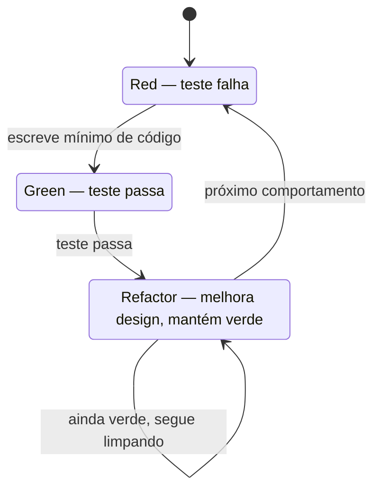
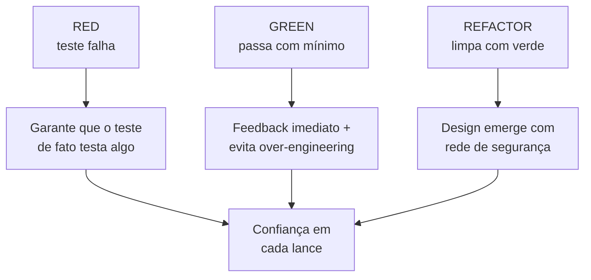
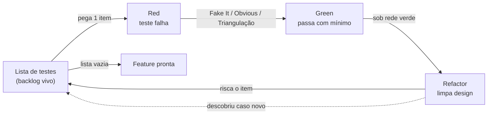
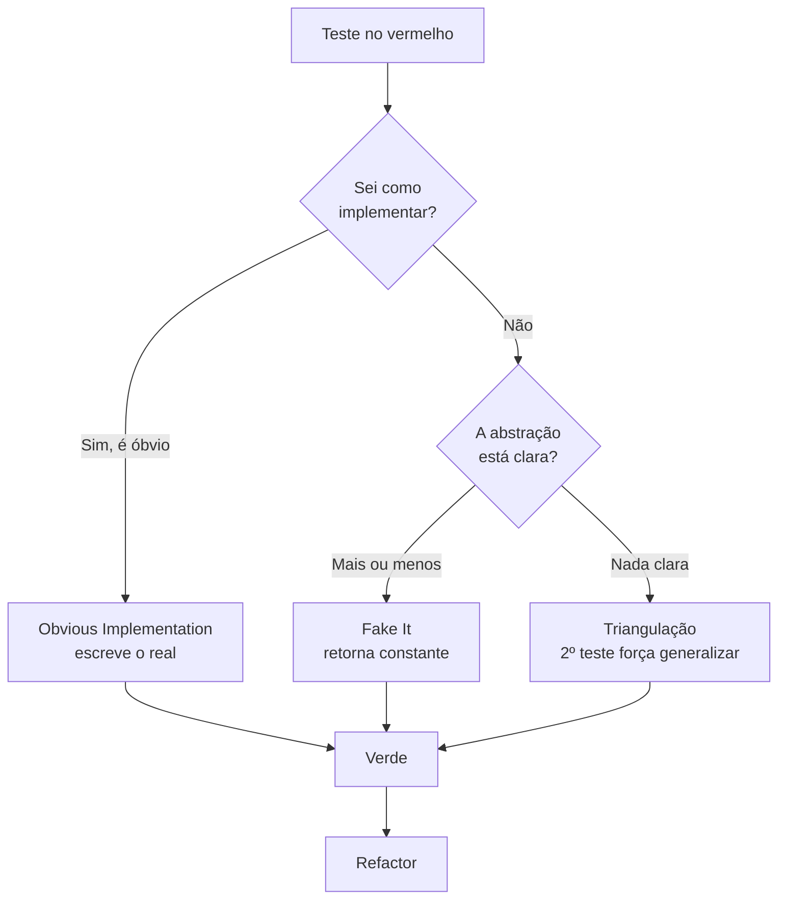
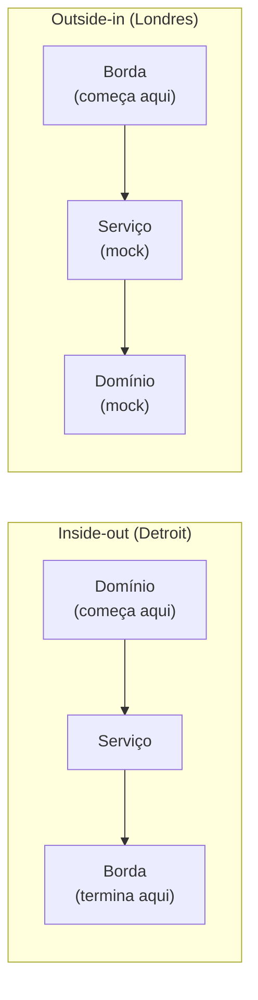

# TDD: o ciclo Red-Green-Refactor

> [!abstract] Resumo em uma linha
> TDD é um ciclo de três passos — escreva um teste que falha (Red), faça-o passar com o mínimo de código (Green), melhore o design com a rede de segurança verde (Refactor) — repetido em ciclos de minutos, onde o teste vira o primeiro cliente da sua API.

Imagine um escalador subindo uma parede de rocha. Ele não sobe trinta metros e só então pensa em proteção. A cada lance, ele prende a corda num ponto fixo, testa o peso, e só depois avança. Se cair, cai um metro — não trinta.

TDD é escalar assim. Você não escreve trezentas linhas no escuro pra depois rezar pra que funcionem. Você prende uma proteção (um teste que falha), sobe um lance (o código mínimo pra passar), arruma o equipamento na cintura (refatora), e repete. Cada ciclo dura minutos. Se errar, o erro é pequeno e o teste te avisa na hora.

A sigla é **Red-Green-Refactor** — vermelho, verde, refatorar. É o coração da disciplina que Kent Beck formalizou no fim dos anos 1990, dentro do Extreme Programming. Esta nota é sobre a **mecânica** do ciclo. *Quando* vale a pena aplicar, *quando* não vale, e o pragmatismo do dia a dia ficam em `[[09 - TDD na prática]]`.

## Os três passos

O ciclo tem exatamente três estados. Você nunca está em dois ao mesmo tempo.

### 1. Red — escreva um teste que falha

Você começa pelo **teste**, não pelo código de produção. O teste descreve o comportamento que você *quer* que exista. Você roda a suíte. O teste **falha** — vermelho. Tem que falhar. A feature ainda não existe.

Parece contraintuitivo escrever um teste pra algo que não existe. Mas é justamente aí que está o truque: o teste te força a responder, antes de escrever uma linha de produção, *como esse código vai ser usado*. Que método chamo? Que parâmetros passo? O que recebo de volta?

> [!warning] Um teste que nunca falhou é suspeito
> Se você escreve o código primeiro e o teste depois, e o teste passa de primeira, você não sabe se ele testa *alguma coisa*. Um teste que nunca esteve vermelho pode estar verificando o nada — um `assert true` disfarçado. Ver o vermelho é a prova de que o teste tem dentes.

### 2. Green — faça passar com o mínimo de código

Agora você escreve **o mínimo** de código de produção pra deixar o teste verde. Mínimo mesmo. Não é hora de elegância, abstração ou performance. É hora de feedback.

Pode ser feio. Pode ser um valor fixo retornado na cara dura (mais sobre isso adiante). O objetivo único do Green é: voltar pro verde o mais rápido possível, pra ter de novo uma base sólida sob os pés.

> [!tip] Resista ao over-engineering
> A pressa de já "deixar bem feito" no Green é a porta de entrada do over-engineering. Você adiciona um cache que ninguém pediu, uma camada de abstração pra um caso que não existe. O Green te disciplina: faça passar, só isso. O design vem no próximo passo, sob proteção.

### 3. Refactor — melhore o design com tudo verde

Com o teste verde, você tem uma **rede de segurança**. Agora — e só agora — você melhora o design: extrai um método, renomeia uma variável, remove duplicação, separa responsabilidades.

A cada pequena mudança, você roda os testes. Se continuam verdes, o comportamento foi preservado e você pode seguir. Se um fica vermelho, você quebrou algo — desfaz e tenta de novo, em um passo menor.

É no Refactor que o **design emerge**. Você não desenhou a arquitetura perfeita de antemão; você deixou ela crescer, refatoração a refatoração, sempre com a corda presa.

Depois do Refactor, você volta pro Red com o próximo comportamento. E o ciclo recomeça.



> [!note] Leitura do diagrama
> O ciclo nunca para de fato — ele dá voltas. Saímos de Red (teste falhando) pro Green (passa com o mínimo), depois pro Refactor (limpa o design). O laço de Refactor sobre si mesmo mostra que você pode fazer várias pequenas melhorias em sequência, sempre conferindo o verde. Do Refactor, volta-se pro Red com o próximo comportamento. Cada volta completa dura minutos.

## Por que cada passo importa

Os três passos não são burocracia. Cada um resolve um problema específico de quem escreve software.



> [!note] Leitura do diagrama
> Cada passo do ciclo (esquerda) entrega uma garantia concreta (centro), e as três garantias somadas produzem o resultado que justifica a disciplina: confiança a cada lance da escalada (direita). Red prova que o teste tem dentes. Green dá feedback rápido e freia o exagero. Refactor faz o design crescer sob proteção.

- **Red** garante que o teste *funciona como detector*. Ver o vermelho é a calibração do alarme de incêndio: se ele nunca apitou, você não confia nele.
- **Green** te dá **feedback em segundos**. Você sabe na hora se foi na direção certa. E, ao exigir só o mínimo, ele te impede de construir o que ainda não precisa.
- **Refactor** é onde mora a qualidade do design. Sem testes, refatorar é apavorante — qualquer mexida pode quebrar algo silenciosamente. Com a suíte verde, refatorar vira uma operação segura e barata.

## O que TDD te força a fazer

O efeito mais profundo de TDD não está nos testes que sobram. Está no que ele *muda em você enquanto escreve*. TDD é menos uma técnica de teste e mais uma técnica de **design**.

> [!quote] Martin Fowler
> "Test-Driven Development is a technique for building software that guides software development by writing tests." O foco está em *guiar o desenvolvimento* — os testes são consequência, não o objetivo.

### Pensar no design antes

O teste é o **primeiro cliente** da sua API. Antes de implementar, você já decidiu como o código será chamado — porque você acabou de chamá-lo, no teste. Se a chamada ficou desajeitada no teste, ela vai ficar desajeitada pra todo mundo. Você descobre isso *antes* de escrever a implementação, não meses depois quando outro time reclama. Veja `[[04 - Testes unitários]]` pra entender a unidade que você está colocando na bancada.

### Escrever código testável

Código difícil de testar quase sempre é código mal projetado. Se você precisa subir meio sistema pra testar uma regra, é sinal de que a regra está acoplada demais. TDD empurra você na direção de **dependências injetadas**, responsabilidades separadas, fronteiras claras — exatamente os princípios de `[[03-Dominios/Fundamentos/SOLID/index|SOLID]]`. A dor de testar é um feedback de design chegando cedo.

### Resolver o problema certo

Se você não consegue nem *escrever* o teste, você não entendeu o requisito. O teste te obriga a tornar o comportamento esperado concreto: dado isto, espero aquilo. Ambiguidade no requisito vira ambiguidade no teste — e aí você para e vai perguntar, em vez de codar a coisa errada com confiança.

### Feedback rápido, não código no escuro

Sem TDD, é comum escrever um bloco grande e só no fim descobrir que a fundação estava errada. Com ciclos de minutos, o pior caso é perder alguns minutos. Você nunca está a mais de um passo de uma base verde.

> [!info] TDD não substitui pensar
> TDD não dispensa o design de cabeça. Você ainda precisa de uma direção geral. O que o ciclo faz é manter o *design detalhado* sempre validado por código que roda, em vez de viver só na sua imaginação.

## Baby steps e "fake it till you make it"

A unidade de tempo de TDD é o **passo de bebê** (*baby step*). Cada ciclo cobre um pedacinho de comportamento. Por que tão pequeno? Porque quanto menor o passo, menor o estrago quando você erra — e mais cedo você percebe.

Kent Beck descreve **três estratégias** pra chegar do Red ao Green:

| Estratégia | Quando usar | O que você faz |
| --- | --- | --- |
| **Obvious Implementation** | A implementação é óbvia e você confia nela | Escreve o código real direto |
| **Fake It** | Não sabe ainda como implementar | Retorna uma constante; depois substitui por código real aos poucos |
| **Triangulação** | Não está nada seguro da abstração certa | Escreve um 2º (ou 3º) teste que *força* a generalização |

As três têm uma ordem natural de preferência. Beck a resume assim: se você sabe o que digitar, digite a **Obvious Implementation**. Se não sabe, **Fake It**. Se mesmo com o Fake It o design certo ainda não aparece, **triangule**. O Obvious Implementation é a "segunda marcha" — você o usa quando está confiante, e *reduz a marcha* pro Fake It no instante em que o cérebro começar a assinar cheques que os dedos não conseguem descontar.

#### Obvious Implementation — escreva o real direto

Quando o código é trivial e você confia nele, não brinque de fingir. `isEmpty()` numa lista? `return size == 0`. Pronto. Inventar um Fake It aqui só adiciona cerimônia. A armadilha é o excesso de confiança: se a "implementação óbvia" der vermelho duas vezes seguidas, é sinal pra reduzir a marcha e voltar pros passos pequenos.

#### Fake It — retorne a constante e generalize depois

O **Fake It** é o famoso "*fake it till you make it*". Você quer testar uma soma? No primeiro teste, `soma(2, 3)` deve dar `5` — então retorne `5`, cravado:

```java
int soma(int a, int b) {
    return 5; // descaradamente fake
}
```

Verde. Absurdo? Por enquanto. Mas você já tem a corda presa, e a duplicação agora está explícita: o `5` do teste e o `5` do código são o mesmo fato dito duas vezes. O próximo passo é remover essa duplicação trocando a constante por variáveis aos poucos — `return a + b` — até não sobrar nada fake.

#### Triangulação — force a generalização com um segundo caso

A **triangulação** é o que te tira da farsa quando você nem confia que a forma certa é `a + b`. Você adiciona um segundo teste que *contradiz* a constante: `soma(4, 7)` deve dar `11`. Agora o `return 5` não passa mais:

```java
// teste 1: soma(2, 3) == 5
// teste 2: soma(4, 7) == 11  -> mata o "return 5"
```

O segundo ponto *triangula* a direção certa, como dois pontos definem uma reta: você é forçado a escrever `return a + b`. A generalização emerge porque um segundo caso a exigiu — não porque você adivinhou.

> [!tip] Generalize só quando um segundo caso forçar
> A regra de ouro da triangulação: não generalize por antecipação. Espere o segundo exemplo te obrigar. Isso te protege de abstrações erradas inventadas cedo demais — você só constrói a abstração que os fatos pediram.

### A lista de testes

Antes de começar o primeiro ciclo, Beck rabisca uma **lista de testes** (*test list*): num canto da tela ou num papel, ele anota todos os casos que vêm à cabeça pro comportamento que vai construir. "Soma de positivos. Soma com zero. Soma com negativo. Overflow." A lista não é um plano rígido — é o **backlog do ciclo**.

A condução é simples e disciplinada: você pega *um* item da lista, faz o ciclo Red-Green-Refactor pra ele, risca o item — e, no caminho, quase sempre descobre casos novos que não tinha previsto. Você os anota na lista na hora, sem desviar do item atual. Quando a lista esvazia, a feature acabou.

> [!tip] A lista é memória de trabalho, não contrato
> A lista de testes resolve um problema cognitivo: ela tira de dentro da sua cabeça os casos que você ainda não cobriu, liberando atenção pro ciclo presente. Você adiciona, descarta e reordena conforme aprende. Itens que pareciam necessários somem; outros nascem do meio do código. É um documento vivo de minutos, não um requisito formal.

O diagrama abaixo mostra a lista de testes como o motor do ciclo: ela alimenta cada Red, e o próprio ciclo realimenta a lista com casos descobertos no caminho.



> [!note] Leitura do diagrama
> A lista de testes (esquerda) é a fonte de cada ciclo: você pega um item e entra no Red. O Green usa uma das três estratégias pra passar; o Refactor limpa sob a rede verde. Ao terminar, você risca o item — e a seta tracejada de volta à lista mostra o efeito colateral fértil: o ciclo quase sempre revela casos novos que você anota na hora. Quando a lista esvazia, a feature está pronta.



> [!note] Leitura do diagrama
> Diante de um teste vermelho, a escolha da estratégia depende de duas perguntas. Se a implementação é óbvia, escreva o código real direto. Se não, e a abstração ainda está vaga, "finja" com uma constante (Fake It). Se está *muito* vaga, force a forma certa com um segundo teste (triangulação). Todos os caminhos levam ao verde e seguem pro Refactor.

> [!info] Premissa de prioridade de transformação
> Uncle Bob (Robert C. Martin) propôs a **Transformation Priority Premise** (premissa de prioridade de transformação): as transformações que fazem o teste passar — trocar uma constante por uma variável, adicionar um `if`, introduzir recursão — têm uma **ordem de preferência**, do mais simples ao mais complexo. Ao escolher sempre a transformação mais alta da lista (a mais simples), você evita impasses em que um único teste te obriga a reescrever um método inteiro. É a triangulação levada ao nível da própria operação de código.

## A cadência: ciclos de minutos

O erro de quem está aprendendo é imaginar que cada ciclo é uma sessão de trabalho. Não é. Um ciclo Red-Green-Refactor saudável dura **minutos** — às vezes menos de um. Se um ciclo seu está levando meia hora, ou o passo era grande demais, ou você ficou preso no Green sem reduzir a marcha.

Esse ritmo tem dois efeitos psicológicos que importam mais do que parecem. O primeiro: o **verde frequente é dopamina**. Cada barra verde é uma microvitória, e elas se acumulam num fluxo que sustenta a concentração por horas. O segundo: cada verde é um **checkpoint** — um ponto de salvamento de jogo. Se a próxima tentativa der errado, você não perde o jogo inteiro; volta pro último save, que está a um ou dois minutos atrás.

> [!tip] Commit no verde
> A regra prática que fecha o ciclo: **faça commit sempre que estiver verde** (e nunca no vermelho). Cada verde é um estado consistente do sistema — testes passando, comportamento preservado. Commits pequenos e frequentes no verde te dão um histórico de pontos seguros pra onde voltar. Se um experimento de design der errado no meio de um Refactor, `git reset` te leva ao último verde sem dó.

> [!example] TCR — o commit-no-verde levado ao extremo
> Anos depois do livro, Kent Beck experimentou um fluxo radical chamado **TCR** — *test && commit || revert*. A ideia: você roda *um único comando* que executa os testes; se passam, **commita automático**; se falham, **reverte automático** pro último verde. O castigo de quebrar a barra não é debugar — é *perder o que você acabou de escrever*. Isso te força a passos minúsculos, porque ninguém quer reescrever vinte minutos de código. É a versão mais agressiva do commit-no-verde e um bom experimento mental pra calibrar o tamanho dos seus passos, mesmo que você não o adote no dia a dia.

> [!warning] Erros comuns no ciclo
> O ciclo é simples, mas há quatro maneiras clássicas de sabotá-lo:
> - **Teste grande demais no Red.** Se o teste cobre comportamento demais, o Red demora a virar verde — você fica longos minutos no vermelho, exatamente o estado que TDD existe pra minimizar. Quebre em passos menores.
> - **Pular o Refactor.** O ciclo "funciona" sem refatorar — os testes passam. Mas a duplicação e a bagunça se acumulam ciclo a ciclo, e a dívida vira juros compostos. O Refactor não é opcional; é onde o design é pago.
> - **Refatorar com a barra vermelha.** Refatorar é mudar a estrutura *preservando o comportamento* — e a prova de que o comportamento foi preservado é a suíte verde. Mexer no design com um teste vermelho é remover a rede no meio do salto: você não sabe mais se quebrou por causa do refactor ou do bug que já estava lá.
> - **Otimizar no Green.** Performance, caches, abstrações espertas — nada disso pertence ao Green. O Green quer *só* o verde. Otimização prematura aqui é over-engineering com outro nome, e some o feedback rápido que justifica o ciclo.

### Um ciclo de ponta a ponta

Pra ver as peças se encaixando, acompanhe uma fatia minúscula: um `Carrinho` que soma o total dos itens. Comece pela **lista de testes**: "carrinho vazio dá total zero", "um item dá o preço do item", "dois itens somam os preços".

Pega o primeiro item. **Red:** `assertEquals(0, carrinho.total())` — não compila, depois falha. **Green** com Obvious Implementation, porque é trivial: `return 0`. Verde em segundos. **Refactor:** nada a limpar ainda. Commit. Risca o item.

Segundo item: "um item dá o preço". **Red:** adiciono um item de 10 e espero `10`; o `return 0` falha. Aqui não confio na forma final, então **Fake It:** `return 10`. Verde — mas a duplicação entre o teste e o código grita. Terceiro item força a saída da farsa: dois itens de 10 e 5 devem dar `15`, e o `return 10` morre. Isso me **triangula** pro código real: somar os preços dos itens. Verde de novo. Agora, com a suíte verde, **Refactor** o laço de soma num `stream().mapToInt(...).sum()` e rodo os testes a cada passo. Lista vazia, fatia pronta — três ciclos, poucos minutos, três commits no verde.

> [!example] O que esse exemplo demonstra
> Repare que nenhuma das três estratégias foi escolhida por dogma: Obvious onde o código era trivial, Fake It onde a forma era incerta, triangulação no instante em que um caso novo matou a constante. A lista guiou a ordem; o verde frequente deu os checkpoints. Esse é o ciclo de verdade — não um ritual, mas uma sucessão de decisões pequenas e reversíveis.

## Inside-out × outside-in

Há duas direções clássicas de atacar uma feature com TDD, e elas espelham as duas escolas de teste unitário que `[[04 - Testes unitários]]` discute.

- **Inside-out (Detroit / clássica)** — você começa pelas **unidades internas** (entidades de domínio, lógica pura), testa cada uma com colaboradores reais, e vai montando pra fora até chegar na borda. O design cresce de dentro pra fora. Usa poucos dublês.
- **Outside-in (Londres / mockista)** — você começa pela **borda** (o ponto de entrada, o caso de uso) e desce pra dentro. Como as camadas internas ainda não existem, você as substitui por **mocks**, descobrindo as interfaces que vai precisar. O design é puxado de fora pra dentro. Veja `[[05 - Test doubles - dummy, stub, spy, mock, fake]]` pra entender os dublês que sustentam esse estilo.



> [!note] Leitura do diagrama
> No inside-out (esquerda), você sobe: começa pelo domínio com colaboradores reais e cresce em direção à borda. No outside-in (direita), você desce: começa pela borda e usa mocks pras camadas internas ainda inexistentes, descobrindo as interfaces no caminho. Mesma feature, direções opostas — e diferenças de quantos dublês você usa.

Nenhuma das duas é "a certa". Muita gente mistura: outside-in pra descobrir as interfaces, inside-out pra preencher a lógica de domínio.

> [!example] Double-loop TDD
> Freeman e Pryce, no livro *Growing Object-Oriented Software, Guided by Tests*, descrevem o **double-loop TDD** (loop duplo). Há um **loop externo** de testes de **aceitação** (a feature inteira, na perspectiva do usuário) e um **loop interno** de testes de **unidade**. Você roda o loop interno na escala de minutos; o externo, na escala de horas a dias. O teste de aceitação fica vermelho até que vários ciclos Red-Green-Refactor de unidade o tornem verde — aí a fatia de funcionalidade está pronta. É um tema avançado; mencionado aqui só pra você reconhecer o nome.

## Em entrevista

> [!quote] Como explicar TDD em inglês
> "TDD is a tight loop: I write a failing test first (Red), write the minimum code to pass it (Green), then refactor under a green safety net. I keep the steps small — baby steps — so a mistake costs minutes, not hours. Seeing the test fail first matters: a test that never failed might be asserting nothing. When the implementation is obvious I just type it; when I'm unsure of the abstraction, I'll fake it with a constant and then triangulate — add a second case that forces me to generalize instead of guessing the abstraction up front. I keep a running test list so the cases I still owe live on paper, not in my head, and I commit on every green so I always have a checkpoint to roll back to. For me the real payoff is design: the test is the first client of my API, so it pushes me toward testable, decoupled code with injected dependencies. I tend to mix outside-in to discover interfaces and inside-out to flesh out the domain logic."

### Vocabulário PT → EN

| Português | English |
| --- | --- |
| vermelho-verde-refatorar | red-green-refactor |
| ciclo apertado | tight loop |
| passos de bebê | baby steps |
| finja até conseguir | fake it till you make it |
| triangulação | triangulation |
| implementação óbvia | obvious implementation |
| estratégias de green | green-bar strategies |
| lista de testes | test list |
| premissa de prioridade de transformação | transformation priority premise |
| commit no verde | commit on green |
| testar-commitar-reverter | test && commit \|\| revert (TCR) |
| ponto de checkpoint | checkpoint |
| rede de segurança | safety net |
| de dentro pra fora | inside-out |
| de fora pra dentro | outside-in |
| teste de aceitação | acceptance test |
| loop duplo | double-loop TDD |
| código de produção | production code |
| over-engineering / exagero de design | over-engineering |

> [!info] Lastro
> - Kent Beck, *Test-Driven Development by Example* (2002) — fonte original do ciclo Red-Green-Refactor e das três estratégias (Fake It, Obvious Implementation, Triangulation).
> - Martin Fowler, ["TestDrivenDevelopment"](https://www.martinfowler.com/bliki/TestDrivenDevelopment.html) — definição concisa do ciclo e do framing de TDD como técnica de design.
> - Steve Freeman e Nat Pryce, *Growing Object-Oriented Software, Guided by Tests* (2009) — origem do double-loop TDD (loop externo de aceitação + loop interno de unidade) e do estilo outside-in/mockista.
> - Robert C. Martin, ["The Transformation Priority Premise"](https://blog.cleancoder.com/uncle-bob/2013/05/27/TheTransformationPriorityPremise.html) (2013) — transformações ordenadas por complexidade; escolher a mais simples evita impasses no ciclo.
> - Kent Beck, ["test && commit || revert"](https://medium.com/@kentbeck_7670/test-commit-revert-870bbd756864) (2018) — fluxo TCR; commit automático no verde, revert automático no vermelho, forçando passos minúsculos.

## Veja também

- `[[04 - Testes unitários]]` — a unidade que você coloca na bancada; o teste como primeiro cliente da API.
- `[[05 - Test doubles - dummy, stub, spy, mock, fake]]` — os dublês que sustentam o estilo outside-in/mockista.
- `[[06 - Testar comportamento, não implementação]]` — o que seus testes de TDD devem afirmar pra não travar o Refactor.
- `[[09 - TDD na prática]]` — quando TDD vale a pena, quando não vale, e o pragmatismo do dia a dia.
- `[[16 - Estratégia de testes em entrevista]]` — como posicionar TDD numa conversa de entrevista.
- `[[03-Dominios/Fundamentos/Testes/index|Testes]]` — índice do galho.
