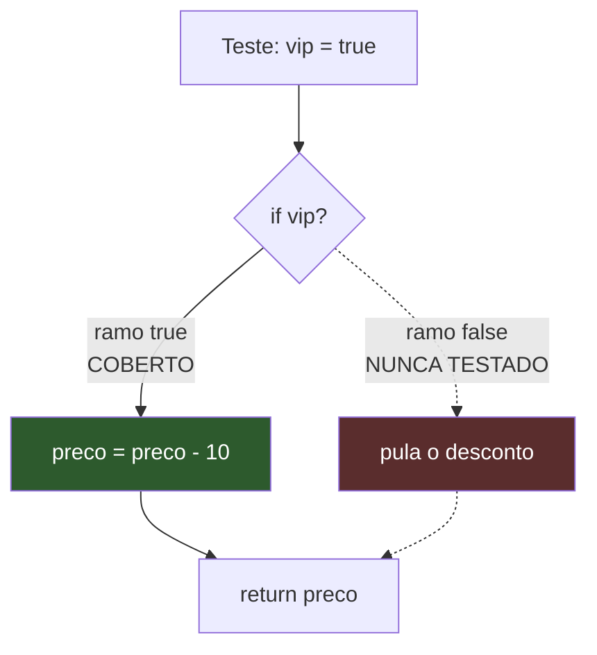
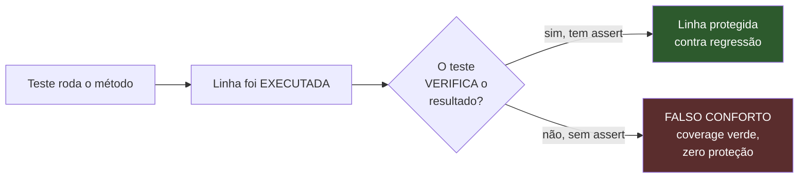
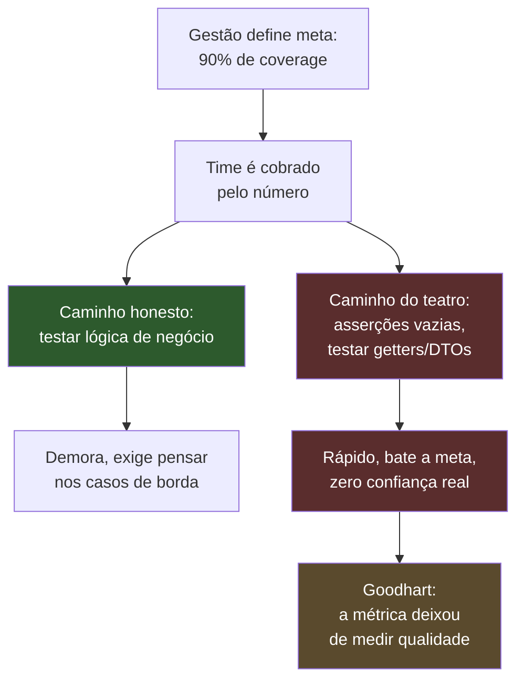
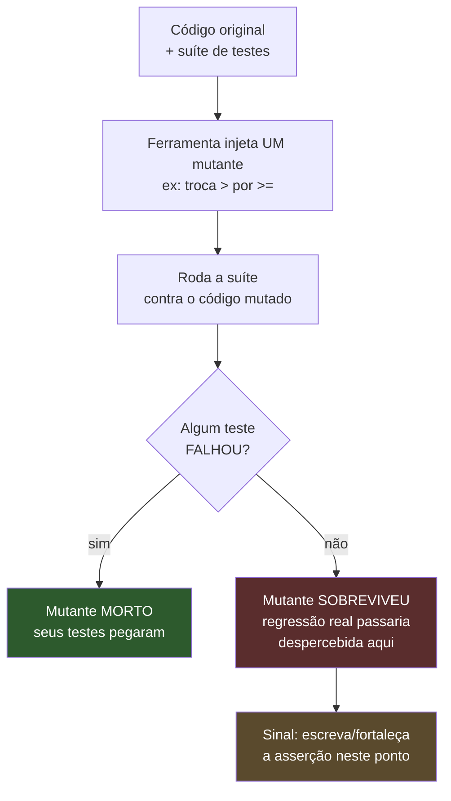

# Coverage e mutation testing

> [!abstract] Resumo em uma linha
> Coverage mede quanto código os testes *rodaram*; mutation testing mede se os testes de fato *pegariam* uma mudança — o primeiro detecta o que não foi tocado, o segundo prova se o que foi tocado está realmente protegido.

Imagine duas formas de avaliar uma turma. A primeira é a chamada: quem estava presente na aula? A segunda é a prova: quem realmente aprendeu? Presença não é aprendizado. Um aluno pode ter passado o semestre inteiro sentado na última fileira, fisicamente presente em 100% das aulas, e não ter aprendido nada.

Coverage é a chamada. Mutation testing é a prova.

Essa é a tensão central desta nota. Senior que confunde as duas — que apresenta "92% de cobertura" como prova de qualidade — entrega uma métrica de presença fingindo ser uma métrica de aprendizado. Vamos desfazer essa confusão.

## O que é coverage

**Coverage** (cobertura de código) é a porcentagem do código de produção que foi *exercitada* durante a execução dos testes. A ferramenta instrumenta o bytecode (ou o source), roda a suíte e registra: esta linha rodou, aquele `if` foi avaliado, este método foi chamado.

O número sai como percentual. "85% de cobertura de linha" significa que 85% das linhas executáveis foram tocadas por pelo menos um teste durante a suíte.

Existem vários *tipos* de coverage, e a diferença entre eles é o que separa quem entende o assunto de quem só lê o número final.

| Tipo | O que conta | O que garante | Força |
|------|-------------|---------------|-------|
| **Line coverage** | Linhas executadas / linhas totais | A linha rodou ao menos uma vez | Fraca |
| **Branch coverage** | Ramos (`if`/`else`, `switch`) percorridos | Cada caminho de decisão foi tomado | Média |
| **Method/function coverage** | Métodos invocados | A função foi chamada | Muito fraca |
| **Condition coverage** | Cada condição booleana avaliada como `true` e `false` | Subexpressões testadas isoladamente | Forte |
| **MC-DC** | Cada condição afeta o resultado independentemente | Padrão de aviônica/automotivo (DO-178C) | Muito forte (caro) |

Para o dia a dia, a regra prática é: **branch coverage vale mais que line coverage**. Por quê? Porque uma linha pode rodar sem que todos os seus caminhos sejam testados.

Veja o caso clássico. Um `if` sem `else`:

```java
public int aplicarDesconto(int preco, boolean vip) {
    if (vip) {
        preco = preco - 10; // <- esta linha
    }
    return preco;
}
```

Um único teste com `vip = true` faz **line coverage de 100%** — todas as linhas rodaram. Mas o caminho `vip = false` (pular o desconto) nunca foi testado. **Branch coverage** flagra isso: você cobriu 1 de 2 ramos = 50%.



Lead-in: o diagrama mostra o mesmo `if` sob a ótica dos dois tipos de cobertura.

Leitura do diagrama: o ramo `true` (verde) foi percorrido — line coverage feliz. O ramo `false` (vermelho, tracejado) jamais rodou. Line coverage diz 100%; branch coverage diz 50%. O bug mora exatamente no ramo que line coverage não consegue enxergar.

> [!tip] Configure a ferramenta para branch
> JaCoCo (Java), por padrão, mostra os dois. Quando alguém cita "cobertura" sem qualificar, geralmente é line — o número mais bonito e menos honesto. Em revisão, pergunte: *line ou branch?*

## A grande mentira: 100% coverage não é igual a código testado

Aqui está o ponto que derruba a métrica como prova de qualidade.

**Coverage mede o que rodou, não o que foi verificado.**

Um teste pode *executar* uma linha sem *afirmar* nada sobre ela. Considere:

```java
@Test
void deveCalcular() {
    service.calcularJuros(1000, 0.05); // chama, e... só.
}
```

Esse teste roda o método inteiro. A ferramenta de coverage registra cada linha de `calcularJuros` como coberta. **Line coverage: 100%.** Quantas asserções? **Zero.** O método poderia retornar `-999`, lançar lógica errada, corromper estado — o teste passaria igual, porque ele nunca olha para o resultado.

> [!warning] Coverage não vê asserções
> A ferramenta de cobertura instrumenta a *execução*, não a *verificação*. Ela não sabe se você escreveu `assertEquals(...)` ou se apenas chamou o método e jogou o retorno fora. Um teste sem nenhuma asserção contribui exatamente os mesmos pontos de cobertura que um teste que valida cada caso de borda. Por isso 100% de coverage **não** significa "código testado" — significa "código executado durante a suíte". São coisas diferentes.



Lead-in: o caminho de uma linha "coberta" até saber se ela está, de fato, protegida.

Leitura do diagrama: executar a linha é só metade do caminho. Sem uma asserção que reclame quando o resultado muda, a linha verde no relatório é puro teatro — ela aparece coberta, mas não há ninguém de guarda. Coverage para no segundo nó; ele nunca chega ao losango.

A nota [[03 - Anatomia de um bom teste]] insiste nisso por outro ângulo: um teste sem asserção significativa não é um teste, é uma invocação. Coverage não distingue os dois.

## Coverage theater

Quando você transforma coverage na *única* métrica — ou pior, na meta — algo previsível acontece: as pessoas otimizam o número, não a qualidade.

Isso tem nome. **Lei de Goodhart**: *"quando uma medida vira meta, ela deixa de ser uma boa medida"*. A cobertura era um bom *diagnóstico* (mostra o que ninguém testou). No momento em que o time é cobrado por bater 90%, ela vira um *alvo* — e times produzem testes inúteis só para preencher a barra.

O sintoma é o que chamo de **coverage theater**: testes que existem para o relatório, não para a confiança. Asserções vazias. Testes que chamam getters. Testes gerados automaticamente sobre DTOs. Tudo verde, nada protegido.



Lead-in: como uma meta de coverage gera incentivos perversos.

Leitura do diagrama: a meta cria pressão (B), e diante de pressão o caminho barato (D, vermelho) vence o caminho caro (C, verde) na média de um time apressado. O resultado (G) é a Lei de Goodhart em ação: você ainda tem o número, mas ele não mede mais o que prometia medir.

> [!danger] A meta de 100% é desperdício
> Buscar 100% força você a testar código trivial — getters, setters, DTOs, `toString()`, código gerado, branches defensivos que nunca acontecem. O custo marginal dispara perto do topo (os últimos 10% custam mais que os primeiros 70%) e o valor marginal despenca. Você gasta tempo escrevendo testes de getter enquanto a lógica de negócio crítica fica subtestada. É otimização do número, não do risco.

## Uso sensato

Coverage não é inútil — é uma ferramenta de diagnóstico excelente *quando usada como ferramenta, não como meta*. Como Martin Fowler resume: coverage serve para **encontrar código que não foi testado**, não para afirmar quão bons são os seus testes.

A postura sensata:

- **70–85% como faixa de equilíbrio.** Acima disso, retorno decrescente; abaixo, provavelmente há lógica importante descoberta. Não é regra cósmica, é heurística.
- **Olhe branch, não line.** Branch coverage de 80% é muito mais informativo que line coverage de 95%.
- **Cubra o que importa.** Lógica de negócio, regras de cálculo, casos de borda — veja [[10 - Técnicas de teste e edge cases]] para *o que* perseguir (limites, nulos, vazios, overflow). Não persiga DTOs e getters.
- **Use o relatório como mapa de buracos.** O valor real do relatório não é o número no topo — são as linhas vermelhas no meio. Elas dizem "ninguém testou isto". Pergunte: *isto importa?* Se sim, escreva o teste; se não (código trivial), ignore com consciência.
- **Coverage gate em CI faz sentido como piso, não teto.** "Não deixe cair abaixo de X" previne erosão; "atinja Y a todo custo" gera teatro. Veja [[15 - Testes em CI-CD]].

> [!info] Diagnóstico, não nota
> Pense no relatório de coverage como um raio-X: ele mostra onde não há tecido testado. O médico não trata "deixar o raio-X branco" como objetivo — ele usa a imagem para decidir onde olhar. Coverage é o raio-X. A decisão clínica (testar ou não) continua sua.

## Mutation testing — o complemento honesto

Se coverage não consegue ver asserções, existe alguma técnica que consiga? Sim. **Mutation testing.**

A ideia é deliciosamente simples e um pouco perversa: a ferramenta **sabota o seu código de produção** — introduz pequenos bugs deliberados, um de cada vez — e roda a sua suíte. Se algum teste **falha**, ótimo: o sabotador foi pego, o **mutante foi morto** (*killed*). Se *nenhum* teste falha, mau sinal: você plantou um bug e ninguém percebeu — o **mutante sobreviveu** (*survived*).

A analogia: imagine um detetive (sua suíte de testes) e um sabotador (a ferramenta de mutação). O sabotador injeta um bug por vez no código. Se o detetive nunca percebe, ele não é tão bom quanto o relatório de presença sugeria.

Cada mutação é uma alteração mínima, plausível, do tipo que um humano cometeria por engano:

| Mutação | Original | Mutante |
|---------|----------|---------|
| Trocar condição de borda | `a > b` | `a >= b` |
| Negar condicional | `if (x)` | `if (!x)` |
| Trocar operador aritmético | `a + b` | `a - b` |
| Remover chamada / `return` | `return x;` | (removido / `return 0;`) |
| Trocar booleano | `return true;` | `return false;` |



Lead-in: o ciclo de uma única mutação, repetido para cada mutante gerado.

Leitura do diagrama: a ferramenta planta o bug (B), roda tudo (C) e pergunta no losango se a suíte reagiu. Mutante morto (E, verde) é uma boa notícia — significa que aquela linha está de fato protegida por uma asserção. Mutante sobrevivente (F, vermelho) é o ouro do método: aponta exatamente onde uma regressão real escaparia, mesmo que o coverage daquela linha esteja verde.

O número resultante é o **mutation score**: mutantes mortos / mutantes totais. Diferente do coverage, ele mede **a qualidade dos testes**, não a quantidade de linhas tocadas. Um mutante sobrevivente que rodou em linha 100% coberta é a prova viva de que coverage e proteção são coisas distintas — o exemplo da asserção vazia, agora *medido*.

A ferramenta de referência no mundo Java é o **PIT (PITest)** — veja [[Testes em Java]] para integração com Maven/Gradle. PITest mostra precisamente qual linha foi mutada, qual mutador foi aplicado, e qual teste executou aquela linha sem falhar.

> [!warning] Mutation testing é caro
> O custo computacional é a grande desvantagem. Conceitualmente, a suíte roda *uma vez por mutante* — e um projeto gera milhares de mutantes. Por isso PITest aplica otimizações (só roda os testes que cobrem a linha mutada, rodada incremental sobre o diff) e raramente se executa a suíte de mutação inteira a cada commit. O padrão maduro: mutation testing nos módulos críticos, e/ou periódico no CI, não a cada push.

## Coverage e mutation juntos

A forma mais nítida de guardar a diferença:

- **Coverage diz: "essa linha rodou."**
- **Mutation diz: "se essa linha mudar, algum teste reclama?"**

O segundo é uma pergunta muito mais forte. Mutation testing *pressupõe* coverage (só faz sentido mutar linha coberta) e vai além: prova que a cobertura tem dentes.

Pense numa pirâmide de garantias sobre uma linha de código:

1. A linha **existe** (óbvio).
2. A linha **roda** nos testes → line coverage.
3. Todos os **caminhos** da linha rodam → branch coverage.
4. Mudar a linha **quebra** um teste → mutation testing.

Cada degrau é uma afirmação mais forte. Coverage te leva até o degrau 3. Só mutation testing te leva ao degrau 4 — o único que de fato fala sobre *proteção contra regressão*, que é o motivo de existirem testes em primeiro lugar.

> [!example] O ciclo virtuoso
> Use coverage para *encontrar* o que não está testado (rápido, barato, roda a cada commit). Use mutation testing para *validar* se o que está testado realmente protege (caro, periódico, nos pontos críticos). Coverage acha os buracos; mutation testing testa se os tampões aguentam peso.

## Em entrevista

> [!quote] Como explicar em inglês
> "Code coverage measures which lines or branches the test suite *executes* — not whether anything is actually *verified*. A test with zero assertions can still produce 100% line coverage, so coverage is a poor proxy for test quality. I prefer branch coverage over line coverage and treat 70–85% as a reasonable range, using the report to *find* untested logic rather than as a target — because when coverage becomes a goal, you get coverage theater: empty assertions written just to hit the number (Goodhart's Law). The honest complement is mutation testing: a tool injects small bugs — flipping `>` to `>=`, removing a `return` — and checks whether any test fails. A surviving mutant means a real regression would slip through, even on a fully-covered line. Tools like PITest report a mutation score, which measures the *strength* of the tests, not the quantity of lines touched — at a real computational cost, since the suite effectively runs once per mutant."

### Vocabulário PT → EN

- cobertura de código → code coverage
- cobertura de linha → line coverage
- cobertura de ramo → branch coverage
- cobertura de condição → condition coverage
- teste de mutação → mutation testing
- mutante → mutant
- mutante sobrevivente → surviving mutant
- mutante morto → killed mutant
- pontuação de mutação → mutation score
- asserção vazia / sem asserção → empty / missing assertion
- meta de cobertura → coverage target
- piso de cobertura (em CI) → coverage floor / gate
- retorno decrescente → diminishing returns
- código trivial → boilerplate / trivial code
- regressão → regression
- proteção contra regressão → regression safety net

> [!info] Lastro
> - Martin Fowler, [*Test Coverage* (bliki)](https://martinfowler.com/bliki/TestCoverage.html) — coverage serve para achar código não testado; é de pouca utilidade como afirmação numérica de qualidade dos testes; uma meta de cobertura é facilmente atingida com testes de baixa qualidade.
> - hcoles, [PITest — *State of the art mutation testing system for the JVM*](https://github.com/hcoles/pitest) e [Baeldung, *Mutation Testing with PITest*](https://www.baeldung.com/java-mutation-testing-with-pitest) — definição de mutante morto vs. sobrevivente, mutation score, e o que o relatório aponta (linha mutada, mutador, teste que rodou sem falhar).
> - [JAVAPRO, *Test Your Tests: Mutation Testing in Java with PIT*](https://javapro.io/2026/01/21/test-your-tests-mutation-testing-in-java-with-pit/) — mutation testing mede qualidade dos testes (não quantidade) e expõe falsos positivos das métricas de coverage.

## Veja também

- [[03 - Anatomia de um bom teste]] — por que um teste sem asserção significativa não é teste; coverage não distingue os dois
- [[10 - Técnicas de teste e edge cases]] — *o que* cobrir: limites, nulos, vazios — a lógica que merece os pontos de coverage
- [[13 - Além do básico - property-based, snapshot, contract, smoke]] — outras técnicas que reforçam a confiança além da contagem de linhas
- [[15 - Testes em CI-CD]] — coverage gate como piso, não teto; onde encaixar mutation testing periódico
- [[16 - Estratégia de testes em entrevista]] — como falar de métricas de teste sem cair na armadilha do número único
- [[Testes em Java]] — JaCoCo e PITest na prática (Maven/Gradle)
- [[03-Dominios/Fundamentos/Testes/index|Testes]] — índice da trilha
