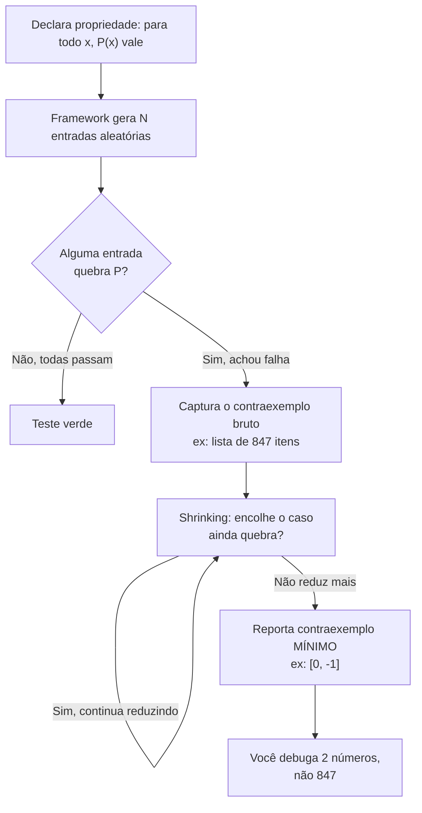
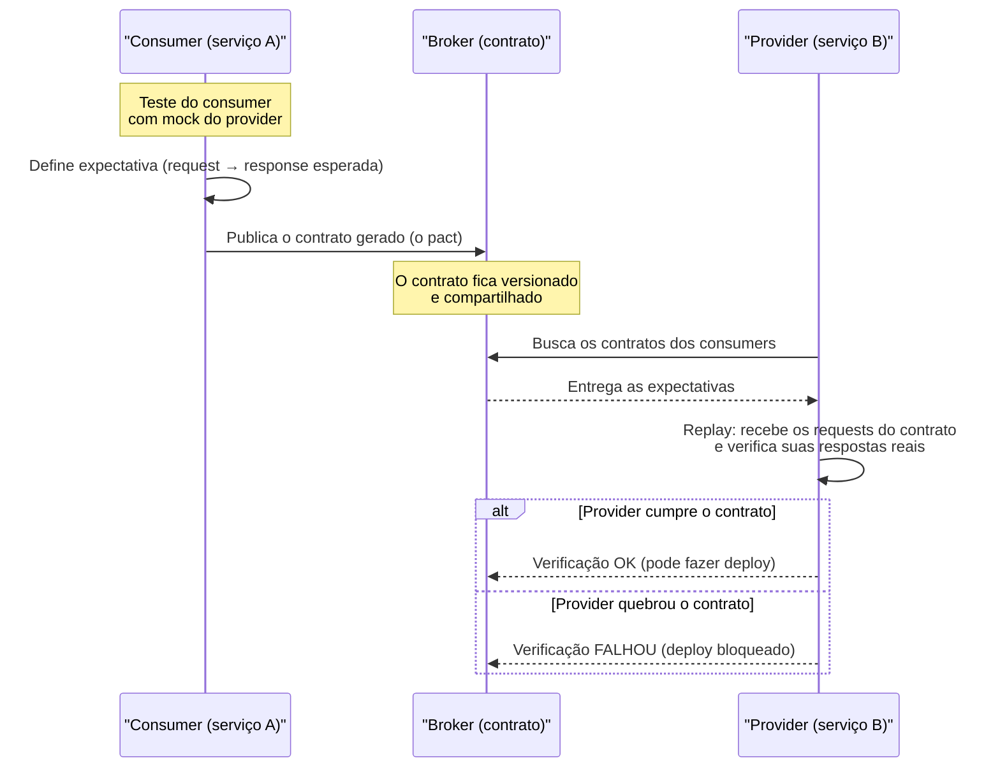
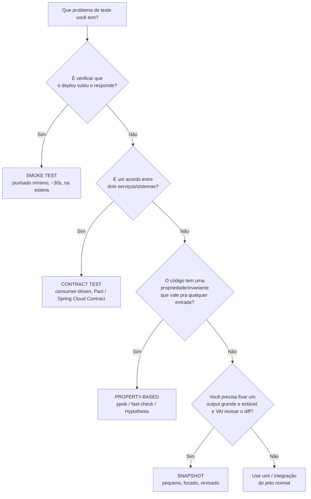

# Além do básico: property-based, snapshot, contract, smoke

> [!abstract] Resumo em uma linha
> Quatro técnicas de nicho — propriedade, snapshot, contrato e fumaça — que não substituem unit/integração, mas rendem muito no contexto certo: a propriedade caça contraexemplos que você não imaginou, o snapshot congela o output, o contrato faz dois serviços concordarem sem subir juntos, e a fumaça pergunta "o sistema acordou?".

A [[02 - A pirâmide de testes e suas variações|pirâmide]] te deu os andares principais: unit, integração, e2e. Mas existe uma **long tail** de tipos de teste que raramente aparece em tutorial e que, num nível senior, separa quem decora a pirâmide de quem sabe escolher a ferramenta certa pro problema certo.

Esta nota cobre quatro delas. A regra que costura tudo: **são especialistas, não generalistas.** Você não substitui seus testes de unidade por property-based; você adiciona property-based onde a lógica tem invariantes. Cada bloco aqui responde duas perguntas — *o que resolve?* e *quando vale?*.

---

## Property-based testing

Você escreve um teste de exemplo assim: "pra entrada `[3, 1, 2]`, `sort` devolve `[1, 2, 3]`". Bom. Mas você escolheu esse exemplo. E os exemplos que você **não** escolheu? A lista vazia, a lista com um elemento só, a lista já ordenada, a lista com dez mil duplicatas, a lista com `NaN`?

O property-based testing inverte a pergunta. Em vez de afirmar o resultado pra uma entrada específica, você declara uma **propriedade** que deve valer pra *qualquer* entrada — e o framework gera centenas de entradas aleatórias tentando te derrubar.

> [!tip] Analogia
> Teste de exemplo é você apontar o dedo num ponto do mapa e dizer "aqui funciona". Property-based é soltar mil macacos no teclado, cada um digitando uma entrada diferente, todos procurando o ponto onde sua propriedade quebra. Você não escolhe os exemplos — você descreve a *lei*, e a máquina busca o contraexemplo.

A propriedade clássica de uma ordenação: *o resultado tem o mesmo tamanho da entrada, está em ordem não-decrescente, e é uma permutação da entrada original.* Repare que isso vale pra `[3,1,2]`, pra `[]`, pra `[5,5,5]` — pra tudo. Você nunca menciona uma entrada concreta.

### A propriedade de ouro: round-trip

A propriedade mais valiosa na prática é a **ida-e-volta** (round-trip). Se você tem um par `encode`/`decode`, `serialize`/`deserialize`, `compress`/`decompress`, então pra qualquer `x`:

```
decode(encode(x)) == x
```

Isso é ouro pra parsers, serializadores JSON/protobuf, codecs, conversores de formato. Uma única propriedade de três linhas exercita o que mil casos manuais não pegariam.

```java
// jqwik (Java)
@Property
void roundTripPreservaValor(@ForAll @AlphaChars String original) {
    String codificado = Base64.getEncoder()
        .encodeToString(original.getBytes(UTF_8));
    String decodificado = new String(
        Base64.getDecoder().decode(codificado), UTF_8);
    assertThat(decodificado).isEqualTo(original);
}
```

```javascript
// fast-check (JS)
import fc from 'fast-check';

test('round-trip JSON preserva o objeto', () => {
  fc.assert(
    fc.property(fc.object(), (obj) => {
      expect(JSON.parse(JSON.stringify(obj))).toEqual(obj);
    })
  );
});
```

```python
# Hypothesis (Python)
from hypothesis import given, strategies as st

@given(st.lists(st.integers()))
def test_sort_idempotente(xs):
    once = sorted(xs)
    assert sorted(once) == once   # ordenar de novo não muda nada
```

### Shrinking: o contraexemplo mínimo

Aqui mora a mágica que distingue property-based de "rodar com input aleatório". Quando um dos mil macacos acha uma entrada que quebra — digamos uma lista de 847 números — você não quer debugar 847 números. Você quer o **menor** caso possível que ainda falha.

O framework faz isso sozinho. Chama-se **shrinking** (redução): achou a falha, ele começa a encolher o contraexemplo — remove elementos, diminui números, esvazia strings — e a cada passo verifica se *ainda* quebra. Quando não dá mais pra reduzir, te entrega o mínimo irredutível.



Lead-in: o ciclo vai de cima (a lei que você declarou) até o fundo (o contraexemplo enxuto que aterrissa no seu console).

Leitura do diagrama: a entrada bruta que quebrou (`E`) quase nunca é a que você vê — o laço de `F` mastiga ela até `G`, o caso mínimo. É por isso que property-based é prático e não só "fuzzing chique": o relatório vem mastigado.

> [!info] QuickCheck, a origem
> O property-based testing nasceu no Haskell com o **QuickCheck**. O **Hypothesis** (Python, desde 2015) popularizou a ideia fora do mundo funcional. Há uma diferença sutil entre eles: no QuickCheck o shrinking é definido **por tipo** (qualquer valor daquele tipo encolhe do mesmo jeito), enquanto o Hypothesis usa shrinking **integrado** à geração. Pra você usuário, o efeito é o mesmo: contraexemplo mínimo de graça.

### Quando vale property-based

Vale quando existe uma **invariante** que você consegue declarar sem reescrever a implementação:

- Lógica matemática e algorítmica (ordenação, busca, estruturas de dados).
- Parsers e serializadores (a propriedade round-trip).
- Invariantes de domínio: "o saldo nunca fica negativo", "o total da fatura é a soma dos itens".
- Funções puras em geral.

Não vale quando você não consegue formular a propriedade sem copiar a lógica do código (aí o teste só repete o bug). E se a propriedade é "o resultado é exatamente Y", você já tem um teste de exemplo — não precisa de gerador.

Esta técnica é a parceira natural de [[10 - Técnicas de teste e edge cases]]: ela **gera** os edge cases que você não pensou. A lista vazia, o overflow, o caractere unicode estranho — a máquina acha pra você.

---

## Snapshot testing

Você renderiza um componente, ou serializa uma estrutura grande, ou pega a resposta de uma API. Como escrever a asserção? Comparar campo por campo de um objeto com cinquenta propriedades é tedioso e frágil.

O snapshot testing resolve por **fotografia**. Na primeira execução, ele grava o output num arquivo (`.snap`). Nas próximas, compara o output atual com a foto guardada. Igual? Passa. Diferente? Falha e te mostra o diff.

> [!tip] Analogia
> Snapshot é a foto "antes/depois" da reforma da casa. Você não descreve cada parede — você compara duas imagens e olha o que mudou. O problema é o mesmo da foto: ela só vale se alguém *olhou* o "depois" e confirmou que era a casa que queria, não a parede caindo.

```javascript
// Jest
test('renderiza o card do usuário', () => {
  const tree = render(<UserCard name="Ada" role="admin" />);
  expect(tree).toMatchSnapshot();
});
```

Na primeira vez, o Jest grava a árvore renderizada num `.snap`. Mudou o componente? O teste falha e mostra o que diferiu.

### O risco que define o destino do snapshot

Aqui está a armadilha senior, e ela é grave o suficiente pra merecer um callout próprio.

> [!danger] Snapshot fatigue: o carimbo automático
> O snapshot empurra **toda** a carga cognitiva pro revisor. O teste é fácil de criar — `toMatchSnapshot()` e pronto. Mas quando ele falha, o Jest te oferece um atalho fatal: aperte `u` e *todos* os snapshots se atualizam. Depois de algumas semanas, o engenheiro entra em **snapshot fatigue** e começa a apertar `u` sem ler o diff. Nesse ponto o teste não testa mais nada — ele carimba qualquer mudança como "esperada". Você tem coverage no relatório e zero proteção na prática.

O agravante: capturar uma árvore de componente inteira gera snapshots de centenas de linhas. Ninguém revisa um diff de 500 linhas com atenção, e o snapshot muda por motivos não relacionados (renomeou uma classe CSS lá longe → metade dos snapshots viram vermelho).

### Quando vale snapshot

Vale **com critério**, e o critério é: o diff tem que ser revisável por um humano.

- Snapshots **pequenos e focados** — uma estrutura de dados, um componente folha, um pedaço de resposta de API. Não a página inteira.
- Output que muda raramente e de forma intencional.
- Sempre acompanhado da disciplina de **revisar cada diff de snapshot como revisa código**. Se o time não revisa, o snapshot é pior que nenhum teste, porque dá falsa sensação de cobertura.

A pergunta de triagem antes de gravar um snapshot: *"se isto mudar, eu vou olhar o diff ou vou apertar `u`?"* Se a resposta honesta é `u`, não escreva o snapshot.

---

## Contract testing

Cenário de microserviços: o serviço **A** (consumer) chama o serviço **B** (provider) por HTTP. Você quer garantir que os dois concordam sobre a forma da mensagem — os campos, os tipos, o status code. A solução ingênua é subir os dois juntos e testar de ponta a ponta. Lento, frágil, e exige coordenar dois deploys.

O contract testing resolve testando **cada lado em isolamento** contra um **contrato** compartilhado — um documento que descreve "quando você me mandar isto, eu te respondo aquilo".

> [!tip] Analogia
> Contract testing é o aperto de mão antes da reunião. Em vez de A e B descobrirem na hora da chamada real que falam línguas diferentes, eles combinam **antes** o protocolo: "você me manda o CPF como string de 11 dígitos, eu te devolvo `{ nome, status }`". Cada um treina sozinho contra o combinado. Ninguém precisa estar na sala ao mesmo tempo.

### Consumer-driven: quem manda na forma é quem consome

A variante mais útil é o **consumer-driven contract** (contrato dirigido pelo consumidor). A ideia: quem define a expectativa é o **consumer**, porque é ele que sabe o que realmente usa da resposta. O provider só verifica que cumpre.

O fluxo com Pact:



Lead-in: leia de cima pra baixo seguindo o contrato (no meio) como o documento que os dois lados consultam sem nunca se falarem diretamente.

Leitura do diagrama: o consumer roda primeiro e *gera* o contrato a partir das suas próprias expectativas (não o provider). O provider depois pega esse contrato e faz **replay** — reexecuta os requests e checa as próprias respostas. Repare que A e B nunca sobem juntos; o broker no meio é o único ponto de encontro.

> [!info] A definição de Fowler
> Martin Fowler define contract test como "uma técnica para testar um ponto de integração checando cada aplicação em isolamento, garantindo que as mensagens que ela envia ou recebe conformam a um entendimento compartilhado documentado num contrato". O **Pact** é o padrão de fato pra consumer-driven contracts; no ecossistema Spring, o **Spring Cloud Contract** cumpre o mesmo papel.

### Quando vale contract testing

Vale quando você tem **vários serviços com evolução coordenada** e quer matar o medo de quebrar um consumer ao mudar um provider:

- Microserviços onde times diferentes donos de A e B precisam evoluir em ritmos diferentes.
- Substituir e2e caros e instáveis pela combinação "contrato + teste isolado de cada lado".
- APIs internas com muitos consumidores — o contrato vira a documentação executável da fronteira.

Não vale pra um monolito, nem pra uma integração pontual com terceiro que você não controla (você não consegue fazer o provider deles rodar seu contrato).

Isto fecha a fronteira que [[07 - Testes de integração]] abre: a integração testa que A fala com B *de verdade*; o contrato testa que A e B *concordam sobre a forma* sem precisar estar no ar ao mesmo tempo. Pra como isso entra na esteira, veja [[15 - Testes em CI-CD]].

---

## Smoke testing

Acabou o deploy. O artefato subiu. A pergunta mais básica do mundo, antes de qualquer suite cara: **o sistema acordou e responde?**

O smoke test é um punhado mínimo de verificações pós-deploy que dão **sinal de vida** em segundos. A home carrega? O `/health` retorna 200? O login aceita um usuário? Não é profundidade — é o pulso.

> [!tip] Analogia
> O nome vem do hardware: você liga a placa de circuito e olha se sai fumaça. Saiu fumaça? Falhou, nem adianta testar o resto. Em software é igual — se o build "está fumegando", você rejeita antes de gastar a QA pesada em cima de algo que nem sobe.

```javascript
// Smoke test pós-deploy — roda em ~30s
test('sistema responde', async () => {
  const res = await fetch(`${BASE_URL}/health`);
  expect(res.status).toBe(200);
});

test('home renderiza', async () => {
  const res = await fetch(`${BASE_URL}/`);
  expect(res.status).toBe(200);
  expect(await res.text()).toContain('<title>');
});
```

O ponto não é a riqueza das asserções — é a **velocidade** e o **posicionamento**. Smoke roda imediatamente depois do deploy (em staging ou direto em produção), e se ele falha, o build é rejeitado / o deploy é revertido antes que QA mais profunda gaste tempo num sistema instável.

> [!note] Smoke não é a suite, é o disjuntor
> Um erro comum é inflar o smoke test até ele virar uma suite e2e completa. Não. Se passa de ~30s, deixou de ser smoke. O valor é justamente ser rápido o bastante pra rodar a cada deploy sem ninguém reclamar. Profundidade fica pros outros andares da pirâmide.

### Quando vale smoke

Sempre que houver deploy automatizado. É o último portão da esteira: passou pelo build, pelos testes, fez deploy → smoke confirma que o que está no ar respira. Em produção, vira também a primeira camada de monitoramento de releases.

Conecta direto com [[15 - Testes em CI-CD]] (é um estágio da pipeline) e tem primo distante em [[14 - Performance, carga, caos e segurança]] — onde a pergunta deixa de ser "responde?" e passa a ser "aguenta?".

---

## Quando cada um vale

A mensagem central, antes da tabela: **nenhum destes substitui unit ou integração.** São ferramentas de nicho. Você adiciona onde o nicho aparece.

| Técnica | Resolve | Use quando | Cuidado |
|---|---|---|---|
| **Property-based** | Casos que você não imaginou | Lógica com invariantes, parsers, round-trip | Propriedade fraca = teste inútil |
| **Snapshot** | Asserção sobre output grande | Output estável, diff revisável | Snapshot fatigue: carimbar `u` sem ler |
| **Contract** | Acordo entre serviços sem subir os dois | Microserviços, evolução coordenada | Inútil pra monolito ou terceiro |
| **Smoke** | "O sistema acordou?" | Todo deploy automatizado | Não vire suite e2e disfarçada |

E o fluxograma de decisão:



Lead-in: entre por cima com o problema em mãos e desça pelas perguntas — a primeira que der "sim" é a sua ferramenta.

Leitura do diagrama: a ordem das perguntas não é aleatória. Smoke e contract são decisões de *arquitetura de teste* (onde, entre quê), por isso vêm primeiro; property e snapshot são decisões sobre a *natureza do código sob teste*. Se nenhuma casa, a resposta honesta é o caixote final: você não precisava de técnica de nicho, precisava de um unit test bem-feito.

---

## Em entrevista

These four are "differentiator" answers — most candidates stop at unit, integration, and e2e. Mentioning them signals breadth, as long as you frame them as niche tools, not replacements. The cleanest one-liner for **property-based testing**: instead of asserting one example, you declare a property that holds for any input, the framework generates hundreds of random inputs to break it, and **shrinking** reduces the failing case to a minimal counterexample. For **contract testing**, the key phrase is **consumer-driven**: the consumer defines its expectations, the provider verifies them, and neither has to be running at the same time — perfect for microservices that evolve independently. On **snapshot testing**, show maturity by naming the trap: snapshot fatigue, where engineers blindly accept the diff and the test stops protecting anything. And **smoke testing** is your post-deploy sign of life — a handful of checks in seconds, not depth.

### Vocabulário

- teste baseado em propriedades — property-based testing
- redução / shrinking — shrinking
- contraexemplo mínimo — minimal counterexample
- ida-e-volta — round-trip
- teste de snapshot — snapshot testing
- teste de contrato — contract testing
- contrato dirigido pelo consumidor — consumer-driven contract
- teste de fumaça — smoke test
- sinal de vida — sign of life / health check
- invariante — invariant

> [!info] Lastro
> - [Martin Fowler — ContractTest](https://martinfowler.com/bliki/ContractTest.html) — define contract test como checar cada aplicação em isolamento contra um entendimento compartilhado documentado num contrato.
> - [Hypothesis — Integrated vs type based shrinking](https://hypothesis.works/articles/integrated-shrinking/) — diferença entre o shrinking por tipo (QuickCheck) e o integrado (Hypothesis).
> - [The Perils of Jest Snapshot Testing — Peter Hrynkow](https://peterhrynkow.com/testing/2019/01/07/the-perils-of-snapshot-testing.html) — snapshot fatigue e o carimbo automático de diffs.
> - [What is Consumer-Driven Contract Testing — Pactflow](https://pactflow.io/what-is-consumer-driven-contract-testing/) — o consumer expressa expectativas, o provider verifica; Pact como padrão de fato.
> - [Smoke testing (software) — Wikipedia](https://en.wikipedia.org/wiki/Smoke_testing_(software)) — origem do termo no hardware e papel de build verification.

---

## Veja também

- [[02 - A pirâmide de testes e suas variações]] — os andares principais; estas quatro são a long tail fora da pirâmide.
- [[07 - Testes de integração]] — a fronteira que o contract testing cobre por outro ângulo.
- [[10 - Técnicas de teste e edge cases]] — property-based gera os edge cases que você não pensou.
- [[14 - Performance, carga, caos e segurança]] — quando "responde?" vira "aguenta?".
- [[15 - Testes em CI-CD]] — onde smoke e contract entram na esteira.
- [[16 - Estratégia de testes em entrevista]] — como posicionar estas técnicas numa resposta.
- [[Testes em Java]] e [[Testes em JavaScript]] — jqwik, fast-check, Pact e snapshot na prática.
- [[03-Dominios/Fundamentos/Testes/index|Testes]] — índice do galho.
