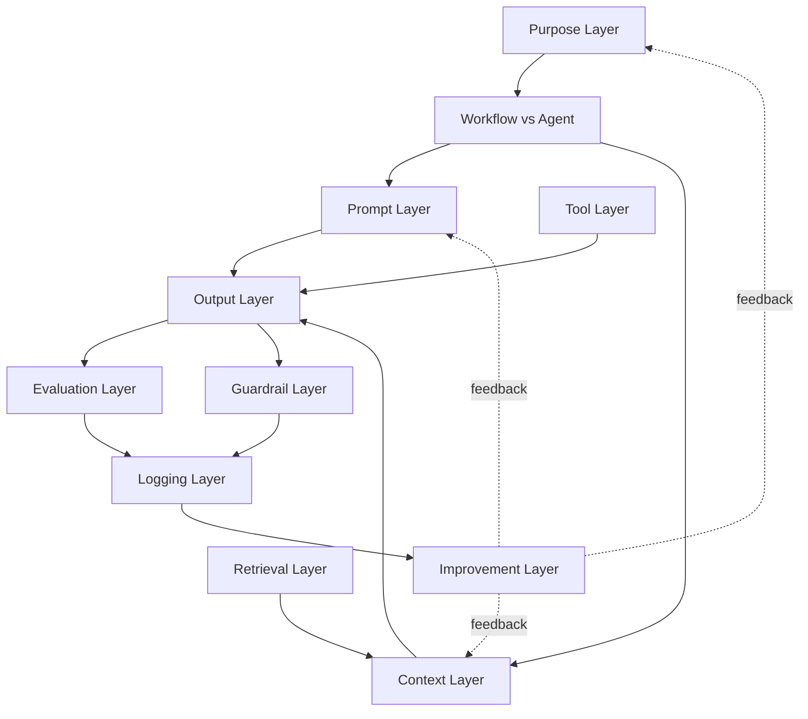

# As 11 camadas — visão geral

> [!abstract] TL;DR
> Um sistema de IA em produção se monta em onze camadas: **Purpose, Prompt, Context, Output, Retrieval, Tool, Workflow vs Agent, Evaluation, Guardrail, Logging, Improvement**. As três primeiras definem o que o sistema é, sabe e como se comporta. As quatro do meio executam — produzem output, puxam conhecimento, chamam tools, escolhem entre caminho fixo e agent. As três seguintes controlam — medem, restringem, registram. A última fecha o loop e transforma o sistema one-off em sistema que evolui. Esta nota é o mapa; cada camada tem sua própria nota fina nesta trilha.

## O que é o stack

Um **AI engineering stack** é a sequência de decisões que separa um demo de chatbot de um sistema de IA confiável. Cada camada responde uma pergunta específica e produz um artefato concreto — um documento, um arquivo de configuração, uma rubrica, um schema. O stack inteiro forma o **blueprint** do sistema antes de uma linha de código ser escrita.

A formalização das 11 camadas usada nesta trilha vem da série *Become an AI Engineer* do @hooeem, capítulo #18. Outras taxonomias existem (Lilian Weng fala de planning/memory/tool use; Anthropic fala de building blocks/workflows/agents), mas as 11 camadas têm a virtude de serem **operacionais**: cada uma é um template que você preenche.

## As camadas, em uma frase cada

| # | Camada | Pergunta que responde |
|---|--------|------------------------|
| 1 | **Purpose** | O que esse sistema é, pra quem, e o que ele NÃO faz |
| 2 | **Prompt** | Como o modelo deve se comportar (role, standards, proibições) |
| 3 | **Context** | O que o modelo precisa saber pra decidir bem |
| 4 | **Output** | Em que formato o modelo entrega a resposta |
| 5 | **Retrieval** | Quando puxar informação externa, de quais fontes, como citar |
| 6 | **Tool** | O que o modelo pode fazer (ações no mundo) |
| 7 | **Workflow vs Agent** | Caminho fixo ou descoberto dinamicamente? |
| 8 | **Evaluation** | Como saber se o output está bom |
| 9 | **Guardrail** | O que o sistema NÃO pode fazer; quando parar |
| 10 | **Logging** | O que registrar de cada run pra debugar e melhorar |
| 11 | **Improvement** | Como o sistema evolui a partir do que aprende |

## Como elas se conectam

A leitura do grafo:

1. **Purpose** vem primeiro porque sem ele as outras camadas não têm critério de decisão.
2. **Workflow vs Agent** é a bifurcação arquitetural — define se o resto do stack monta um pipeline fixo ou um loop autônomo.
3. **Prompt, Context, Retrieval, Tool** alimentam a geração; **Output** é o que sai.
4. **Evaluation** e **Guardrail** rodam em paralelo no output: uma mede qualidade, a outra checa segurança.
5. **Logging** captura tudo.
6. **Improvement** lê os logs e retroalimenta as camadas de definição (Purpose, Prompt, Context).

## A ordem em que se monta na prática

Existe uma ordem natural de construção que não é a ordem numérica:

1. **Purpose** primeiro (sempre).
2. **Workflow vs Agent** segundo (define a arquitetura).
3. **Output** terceiro (sabendo o que sai, o resto fica restrito).
4. **Prompt + Context** quarto (instrução + conhecimento).
5. **Retrieval + Tool** se necessário (conhecimento externo e ações).
6. **Evaluation + Guardrail** antes de ir pra qualquer ambiente compartilhado.
7. **Logging** antes do primeiro usuário real.
8. **Improvement** após a primeira semana de uso real.

Construir as três camadas de controle (Eval, Guardrail, Logging) **antes** de expor o sistema é o ponto onde demos viram produtos. Pular essa etapa é a causa raiz de a maioria dos "MVPs de IA" nunca chegarem a prod.

## O que esta trilha entrega

- Notas 02 a 12: uma por camada, finas, com 3 perguntas-padrão respondidas (o que é, decisões-chave, onde aprofundar).
- Nota 13: setup completo end-to-end com um exemplo concreto (gerador de newsletter semanal) atravessando todas as 11 camadas.

## Veja também

- [[02 - Purpose Layer — o que o sistema é]] — começa aqui
- [[08 - Workflow vs Agent Layer]] — a bifurcação arquitetural
- [[13 - Setup completo — do zero ao sistema de produção]] — recipe end-to-end
- [[Context Engineering]] — trilha-irmã sobre o que alimenta a Context Layer
- [[Anatomia de Agents]] — trilha-irmã sobre Tool e Workflow vs Agent

## Fontes

- **@hooeem** — *Become an AI Engineer (thread)*, chapter #18 "Building your AI engineering stack". X/Twitter, 2025.
- **Anthropic** — [*Building effective agents*](https://www.anthropic.com/engineering/building-effective-agents) (2024). Taxonomia building blocks → workflows → agents.
- **Lilian Weng** — [*LLM-powered Autonomous Agents*](https://lilianweng.github.io/posts/2023-06-23-agent/) (2023). Componentes planning + memory + tool use.
