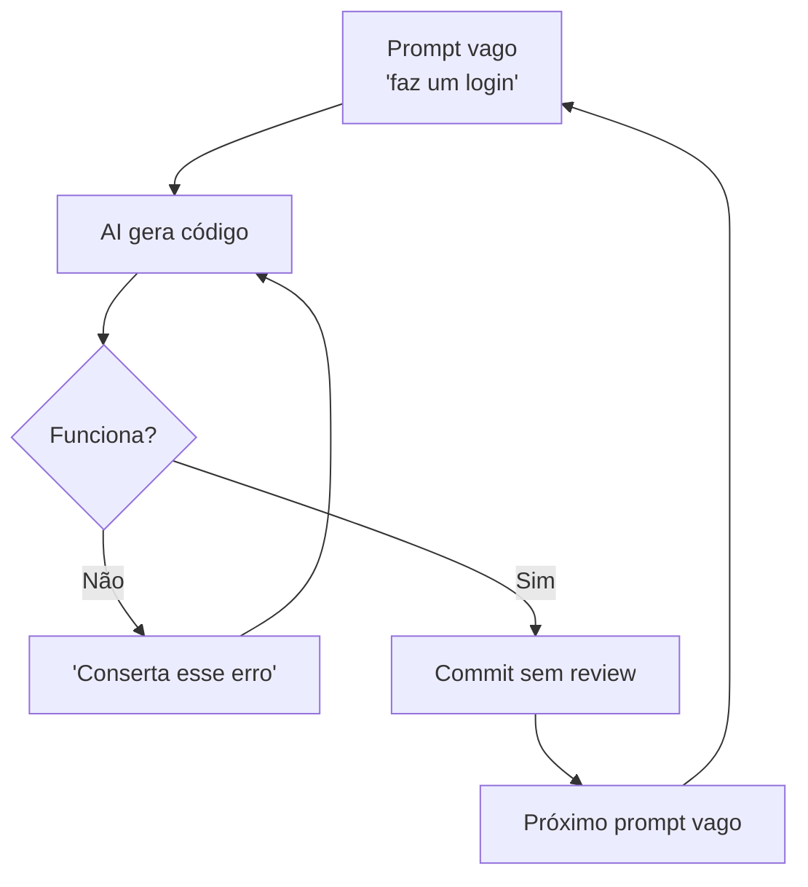
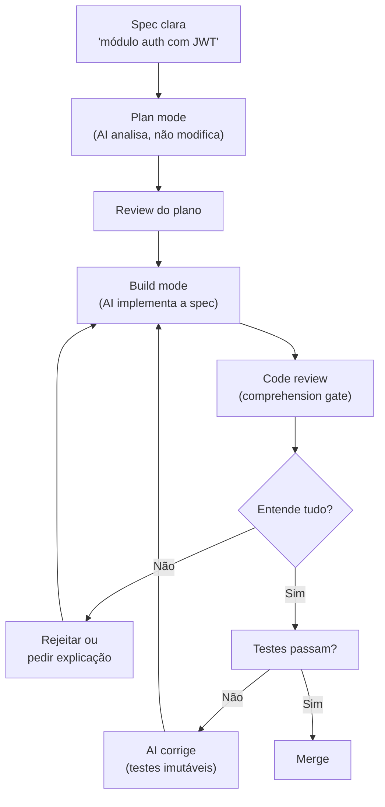

# Vibe coding vs engenharia disciplinada

> [!abstract] TL;DR
> "Vibe coding" é gerar código por tentativa e erro conversacional com IA — funciona para protótipos mas gera tech debt exponencial em produção. Engenharia disciplinada com IA mantém o humano como arquiteto e o agente como executor, com specs claras, testes imutáveis, e code review rigoroso. O gap entre os dois é a diferença entre "funciona no meu localhost" e "funciona em produção por 3 anos". A competência profissional em 2026 está na engenharia disciplinada.

O termo "vibe coding" nasceu de um tweet de Andrej Karpathy em fevereiro de 2025 e virou fenômeno cultural — Palavra do Ano do Collins em 2025. Mas em 2026 o próprio Karpathy declarou que essa era está se encerrando: o mercado profissional migra para a *engenharia agêntica*, com especificações detalhadas e supervisão humana. Esta nota contrasta os dois polos e mostra por que a competência de 2026 mora na disciplina, não na vibe.

## O que é

**[[Dicionário de IA#vibe coding|Vibe coding]]** (termo cunhado por Andrej Karpathy em 2025) descreve o workflow de:

1. Pedir algo ao AI em linguagem natural
2. Aceitar o que ele gerar
3. Se quebrar, pedir para consertar
4. Repetir até funcionar

**Engenharia disciplinada com IA** é o workflow de:

1. Definir a spec/arquitetura antes de gerar código
2. Usar o [[Dicionário de IA#Coding agent|agente]] como executor da spec
3. Revisar cada mudança com compreensão do porquê
4. Manter testes, linting e CI como barreiras imutáveis

Na formulação original, Karpathy descreveu um modo em que o desenvolvedor "se entrega totalmente às vibes, abraça as exponenciais e esquece que o código existe" — explicitamente adequado a protótipos e projetos descartáveis de fim de semana, não a código de produção. O uso do termo para sistemas em produção é justamente o que adquiriu conotação negativa.

## Por que importa

| Métrica                | Vibe coding           | Engenharia disciplinada |
| ---------------------- | --------------------- | ----------------------- |
| Velocidade inicial     | ★★★★★                 | ★★★                     |
| Qualidade 1 mês depois | ★★                    | ★★★★★                   |
| Tech debt acumulada    | Exponencial           | Controlada              |
| Segurança              | ❌ Vulnerável          | ✅ Auditada              |
| Manutenibilidade       | Muito baixa           | Alta                    |
| Custo de tokens        | Alto (muitos retries) | Menor (menos iterações) |

Há dado empírico do acúmulo de tech debt: o estudo do GitClear sobre 211 milhões de linhas encontrou queda de ~60% na atividade de refatoração entre 2021 e 2024, enquanto instâncias de copy-paste cresceram ~48% — em 2024, pela primeira vez, linhas copiadas-e-coladas superaram as refatoradas. É o rastro de gerar sem revisar.

## Como funciona

### O ciclo vicioso do vibe coding

**Problemas que se acumulam:**

- O AI pode "consertar" erros de forma que introduz novos bugs
- Cada iteração adiciona contexto descontrolado, aumentando [[Dicionário de IA#Token|custo de tokens]]
- Código gerado não segue padrões do projeto
- Testes são modificados pelo AI para "passar" em vez de testar corretamente

### O ciclo virtuoso da engenharia disciplinada

### Práticas da engenharia disciplinada

| Prática                                                         | O que é                                   | Por que importa                    |
| --------------------------------------------------------------- | ----------------------------------------- | ---------------------------------- |
| **[[Dicionário de IA#Comprehension gate\|Comprehension gate]]** | Se não entende a mudança, não faz merge   | Evita código fantasma no codebase  |
| **Testes imutáveis**                                            | AI não pode reescrever testes para passar | Testes são a barreira de qualidade |
| **Plan before build**                                           | Usar plan mode antes de gerar código      | Reduz iterações (e tokens)         |
| **[[Dicionário de IA#Spec-driven development\|Spec-driven]]**                                                 | Definir o "o quê" antes do "como"         | Mantém coerência arquitetural      |
| **Context files**                                               | CLAUDE.md, .cursorrules, agents.md        | O agente segue seus padrões        |
| **Commits atômicos**                                            | Cada commit resolve uma coisa             | Reversibilidade granular           |

### O espectro entre vibe e disciplina

Na prática, o ideal não é nem 100% vibe nem 100% spec-driven. Depende da fase:

| Fase                                  | Abordagem recomendada                                    |
| ------------------------------------- | -------------------------------------------------------- |
| **Prototipagem / spike**              | Vibe coding é OK — descarte o código depois              |
| **MVP v1**                            | Semi-disciplinado — specs leves, testes básicos          |
| **Feature em produção**               | Disciplinado — specs, testes, review                     |
| **Infraestrutura / auth / pagamento** | Ultra-disciplinado — human review obrigatório, zero vibe |

## Armadilhas

- **"Vibe coding é ruim"** — não é. É excelente para prototipagem, exploração, e aprendizado. O problema é usá-lo em produção.
- **"Engenharia disciplinada é lenta"** — parece mais lenta no primeiro dia. No dia 30, o projeto com disciplina está muito à frente porque não está gastando tempo consertando tech debt.
- **"O AI é tão bom que review não precisa"** — falso. [[Dicionário de IA#LLM (Large Language Model)|LLMs]] alucinam, ignoram edge cases, e introduzem vulnerabilidades silenciosas. Review é obrigatório.
- **"Testes são opcionais com AI"** — ao contrário: com AI, testes são MAIS importantes. Sem testes, não há barreira entre código correto e alucinação que funciona por acaso.
- **Reescrever testes para passar** — se o agente modifica os testes junto com o código, os testes não estão testando nada. Testes devem ser escritos ANTES ou separadamente.

## Veja também

- [[01 - De autocomplete a agentes autônomos]] — a evolução que levou ao gap
- [[03 - O comprehension gate]] — a prática central da disciplina
- [[14 - agents.md e configuração de projeto]] — como configurar o agente para trabalhar com disciplina
- [[16 - O loop agentic — plan, act, observe]] — o ciclo que a disciplina estrutura
- [[17 - Human-in-the-loop — quando (não) confiar]] — quando a supervisão humana é obrigatória

## Referências

- **Karpathy, Andrej** — *Vibe Coding* (X/Twitter, 2025). O termo original e seu contexto.
- **Plus8Soft** — *The Comprehension Gate* (2026). Framework de code review para AI.
- **Eventuallymaking.io** — *AI-Assisted Engineering vs Vibe Coding* (2026). Análise do gap.
- **Wikipedia** — [*Vibe coding*](https://en.wikipedia.org/wiki/Vibe_coding). Definição canônica, origem e evolução do termo.
- **InfoWorld** — [*Vibe coding or spec-driven development? How to choose*](https://www.infoworld.com/article/4166817/vibe-coding-or-spec-driven-development-how-to-choose.html) (2026).
- **Towards Data Science** — [*From Vibe Coding to Spec-Driven Development*](https://towardsdatascience.com/from-vibe-coding-to-spec-driven-development/).
