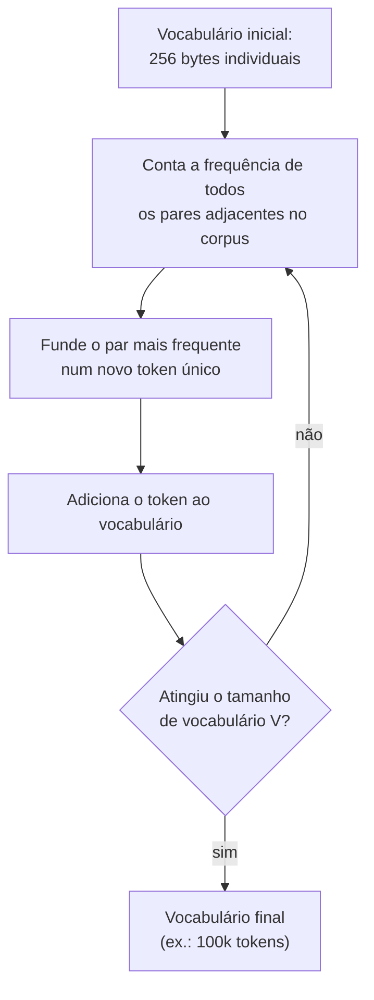

# Tokens e tokenização

> [!abstract] TL;DR
> Tokens são as unidades atômicas que LLMs processam — não caracteres, não palavras, mas pedaços intermediários de texto definidos por um algoritmo de compressão chamado BPE. Uma palavra comum como "the" é 1 token; "tokenização" pode ser 3. Entender tokenização é pré-requisito para entender custos, limites de contexto e por que seu prompt às vezes gasta mais do que esperado.

> [!tip] Comece pelo vídeo
> Gustavo Guanabara (Curso em Vídeo) apresenta o conceito de tokens do zero, em ~19 minutos — um bom panorama antes de mergulhar no texto:


## O que é

No ciclo que fecha a nota anterior, o primeiro passo era *tokenização* — e ali ele passou rápido. Aqui abrimos essa caixa: o que é, afinal, um token, e como um texto vira a sequência de pedaços que o modelo de fato processa.

**Tokenização** é o processo de converter texto bruto (strings de caracteres) em sequências de **[[Dicionário de IA#Token|tokens]]** — unidades numéricas que o modelo realmente processa. Cada token é mapeado para um ID inteiro no vocabulário do modelo.

Um LLM não processa texto como letras nem como palavras inteiras. Ele processa tokens: pedaços de texto, geralmente subpalavras. Dependendo do tokenizador:

- `"hello"` → 1 token
- `"tokenização"` → 3 tokens (`"token"`, `"iza"`, `"ção"`)
- `" "` (espaço) → geralmente embutido no token seguinte
- `"😊"` → 1-2 tokens (byte-level BPE resolve Unicode nativamente)

O vocabulário típico de um LLM moderno tem entre **32.000 e 200.000 tokens**.

> [!info] O que é o vocabulário de um LLM
> O **vocabulário** é o dicionário fixo e finito de todos os tokens que o modelo reconhece — definido uma única vez, quando o tokenizador é treinado, antes do treino do modelo começar. Não é um detalhe abstrato: o tamanho do vocabulário (`V`) dimensiona duas estruturas reais do modelo.
>
> - **Tabela de embedding** — uma linha por token (`V` linhas). É como o modelo converte cada ID de token no vetor que ele de fato processa (ver [[03 - Embeddings — do token ao vetor]]).
> - **Camada de saída** — a cada passo de geração, o modelo produz `V` **logits** (um score bruto por token) e aplica **softmax** (que transforma esses scores em probabilidades somando 1), gerando uma distribuição sobre *todo* o vocabulário. Não precisa dominar esses dois termos agora — a nota [[05 - Completação — o loop autoregressivo]] os destrincha; aqui basta saber que a saída é uma escolha entre as `V` entradas.
>
> Por isso "qual o próximo token?" é, literalmente, escolher entre essas `V` entradas: o vocabulário é o **espaço de escolha** do modelo a cada token gerado. O custo de inflar `V` é tratado em [[#O trade-off do tamanho de vocabulário]].

## Por que importa

Tokens são a unidade de **tudo** em [[Dicionário de IA#LLM (Large Language Model)|LLMs]]:

1. **Custo** — APIs cobram por milhão de tokens (input e output separadamente)
2. **Limite de contexto** — a janela de contexto é medida em tokens, não em palavras ou caracteres
3. **Velocidade** — cada token gerado exige uma passada completa pelo modelo
4. **Qualidade** — tokenização ruim (quebras em pontos estranhos) degrada a capacidade do modelo de entender o texto

**Regra prática para inglês:** 1 token ≈ 4 caracteres ≈ 0.75 palavras. Para português, a proporção é pior: ~1 token ≈ 3 caracteres, porque diacríticos e sufixos aumentam a fragmentação.

## Como funciona

### Byte Pair Encoding (BPE)

O algoritmo mais usado em LLMs modernos. É um método de compressão iterativo e determinístico.

#### Passo a passo

1. **Inicialização** — começar com um vocabulário base de todos os bytes individuais (256 entries)
2. **Contagem** — escanear o corpus de treinamento e contar a frequência de todos os pares adjacentes de tokens
3. **Merge** — fundir o par mais frequente em um novo token e adicioná-lo ao vocabulário
4. **Repetição** — repetir passos 2-3 até atingir o tamanho de vocabulário desejado (ex: 100k)



#### Exemplo concreto

```
Corpus: "aab aab aac"
Vocab inicial: {a, b, c, espaço}

Iteração 1: par mais frequente = "aa" → merge → novo token "aa"
  Corpus: "aa b aa b aa c"

Iteração 2: par mais frequente = "aa b" → merge → novo token "aab"
  Corpus: "aab aab aa c"

(continua até atingir vocab size)
```

#### Pré-tokenização: o BPE não roda no texto cru

Na prática, o BPE descrito acima **não roda direto sobre o texto bruto**. Antes vem um passo de **pré-tokenização**: uma expressão regular quebra o texto em pedaços — contrações, sequências de letras, números (em grupos de 1 a 3 dígitos) e pontuação. O BPE então roda **isoladamente dentro de cada pedaço**, e nenhum merge cruza essas fronteiras.

Isso tem consequências concretas: `" world"` (com espaço à frente) e `"world"` viram tokens diferentes, e o tokenizador nunca funde uma letra com a pontuação ao lado. E o exemplo didático acima **não está errado** — ele mostra fielmente a *mecânica* do merge (achar o par mais frequente e fundir). O que a pré-tokenização acrescenta é uma *regra de fronteira*: na prática o merge só roda dentro de cada pedaço, então um tokenizador real jamais fundiria atravessando um espaço ou uma vírgula. Mecânica certa; faltava dizer **onde** ela pode acontecer.

### Variantes de tokenização

O BPE é o algoritmo dominante, mas não o único. As variantes diferem sobretudo em *como* decidem o que fundir:

| Método                      | Usado por             | Características                                                               |
| --------------------------- | --------------------- | ----------------------------------------------------------------------------- |
| **Byte-Level BPE**          | GPT-4, Llama 3/4      | Opera em bytes, não caracteres. Resolve qualquer Unicode sem "unknown tokens" |
| **SentencePiece (Unigram)** | T5, modelos Google    | Modelo probabilístico que encontra a segmentação mais provável                |
| **WordPiece**               | BERT, modelos antigos | Similar a BPE mas usa likelihood em vez de frequência                         |
| **Tiktoken**                | OpenAI (GPT-3.5+)     | Implementação otimizada de BPE em Rust, usada pela API                        |

### Impacto da tokenização no custo

Qualquer que seja a variante, uma consequência pesa direto no bolso: o mesmo conteúdo não custa igual em todo idioma.

```
Frase em inglês: "The quick brown fox" → 4 tokens
Frase em português: "A raposa marrom rápida" → ~7 tokens
Frase em japonês: "素早い茶色の狐" → ~8-10 tokens
```

Isso significa que **usar LLMs em idiomas não-ingleses custa mais** — o tokenizador foi treinado predominantemente em texto inglês, então tem mais merges para padrões ingleses.

Esse "imposto multilíngue" vem caindo com tokenizadores mais novos. O `cl100k_base` (GPT-4) forçava uma quebra a cada letra-com-diacrítico em scripts não-latinos, inflando a contagem; o `o200k_base` do GPT-4o dobrou o vocabulário (~200 mil tokens) e melhorou bastante a compressão em chinês, árabe e código. O ganho para o inglês é modesto, mas para conteúdo multilíngue é grande.

### Tokenizadores na prática

Para contar tokens antes de enviar para a API:

| Provider    | Ferramenta                                                             | Uso                                                          |
| ----------- | ---------------------------------------------------------------------- | ------------------------------------------------------------ |
| OpenAI      | `tiktoken` (Python)                                                    | `tiktoken.encoding_for_model("gpt-4").encode("texto")`       |
| Anthropic   | Estimativa via API                                                     | Resposta inclui `usage.input_tokens` e `usage.output_tokens` |
| Google      | `count_tokens()` API                                                   | Endpoint dedicado para contagem                              |
| Open-source | `tokenizers` (HuggingFace)                                             | Biblioteca universal para qualquer tokenizador               |
| Visual      | [platform.openai.com/tokenizer](https://platform.openai.com/tokenizer) | Visualização interativa                                      |

## Comparativo

| Aspecto                      | Character-level | Word-level   | **Subword (BPE)**  |
| ---------------------------- | --------------- | ------------ | ------------------ |
| **Vocab size**               | ~256            | 100k+        | 32k–200k           |
| **Palavras desconhecidas**   | Nenhuma         | Muitas (OOV) | Nenhuma            |
| **Comprimento da sequência** | Muito longo     | Curto        | Otimizado          |
| **Cobertura de idiomas**     | Total           | Limitada     | Total (byte-level) |
| **Uso em LLMs modernos**     | Raro            | Legado       | **Padrão**         |

## O trade-off do tamanho de vocabulário

A tabela acima trata "vocab size" como um número solto, mas escolhê-lo é um equilíbrio com tensões reais. Um vocabulário **maior** representa mais texto em menos tokens — entrada e saída mais baratas, janela de contexto que rende mais, melhor cobertura multilíngue. Mas tem dois custos:

1. **Parâmetros.** Cada token do vocabulário ocupa uma linha nas matrizes de embedding de entrada e de saída. Dobrar o vocab dobra essas matrizes. O salto de 32 mil (Llama 2) para 128 mil tokens (Llama 3) é parte de por que o modelo "pequeno" cresceu de 7B para 8B de parâmetros.
2. **Sinal de treino.** Tokens raros aparecem pouco no corpus e recebem menos atualizações de gradiente — no limite, viram tokens sub-treinados (ver glitch tokens, adiante).

Não existe vocab "ótimo" universal: é um ponto de equilíbrio entre custo de inferência, comprimento de sequência e capacidade do modelo.

## Tokens especiais e chat templates

Nem todo token corresponde a texto. O vocabulário inclui **tokens especiais** que estruturam a entrada: marcadores de início e fim de sequência (BOS/EOS) e, em modelos de chat, separadores de turno e de papel — como `<|im_start|>` (família GPT) ou `<|eot_id|>` (Llama 3).

Um **chat template** é o molde que envolve cada mensagem nesses marcadores antes de mandar pro modelo. Duas implicações práticas:

- **Consomem contexto invisível.** Os marcadores ocupam tokens da janela sem aparecer pro usuário, então a contagem real de uma conversa é sempre maior que a soma do texto visível.
- **São específicos de cada modelo.** Aplicar o template de um modelo em outro (separadores errados, ordem trocada) degrada a qualidade — o modelo foi treinado esperando aquele formato exato.

## Quando a tokenização vaza para o comportamento do modelo

A tokenização não é só um detalhe de custo — ela molda o que o modelo **consegue** fazer. Dois sintomas conhecidos:

### O problema do "strawberry"

O modelo nunca vê caracteres; vê tokens. `"strawberry"` é fatiado em `st` + `raw` + `berry`, então perguntar "quantos `r` tem?" exige uma granularidade que o modelo simplesmente não enxerga — daí o erro viral de contar 2 em vez de 3. O mesmo vale para aritmética: como os dígitos são fatiados pela regex em grupos de 1 a 3 de forma inconsistente, alinhar casas decimais fica difícil. Modelos mais recentes mitigam isso tokenizando dígitos um a um.

### Glitch tokens

Alguns tokens entram no vocabulário porque apareceram no corpus que treinou o **tokenizador**, mas quase nunca no corpus que treinou o **modelo** — ficam com embeddings sub-treinados. Invocá-los produz comportamento anômalo: alucinação, recusa ou texto sem sentido. O caso clássico é `SolidGoldMagikarp` (um nome de usuário do Reddit que sobreviveu na limpeza do vocabulário). Além de curiosidade, são uma superfície real de robustez e segurança.

> [!example] O caso SolidGoldMagikarp
> Em fevereiro de 2023, os pesquisadores Jessica Rumbelow e Matthew Watkins agruparam os embeddings de tokens do GPT-2/GPT-3 e encontraram um cluster bizarro: strings como `SolidGoldMagikarp`, `TheNitromeFan` e `cloneembedreportprint`. Eram **nomes de usuário do subreddit r/counting** (onde as pessoas se revezam contando até o infinito), repetidos tantas vezes nos dados que treinaram o *tokenizador* que o BPE deu a cada um seu **próprio token dedicado**.
>
> O problema: esses threads de contagem foram filtrados do corpus que treinou o *modelo*. O token existia no vocabulário, mas seu embedding ficou praticamente **no estado aleatório inicial** — nunca treinado. Pedir pro `text-davinci-003` repetir "SolidGoldMagikarp" fazia ele responder "distribute"; outros glitch tokens disparavam recusa, insulto ou texto sem nexo.
>
> O fenômeno sumiu nos modelos mais novos: o tokenizador atual quebra a palavra em cinco tokens normais (`Solid`, `Gold`, `Mag`, `ik`, `arp`), então não sobra um único embedding sub-treinado pra invocar.

## Armadilhas

- **"1 token = 1 palavra"** — falso. Uma palavra longa ou incomum pode ser 3-5 tokens. Palavras curtas e comuns geralmente são 1 token.
- **Ignorar a contagem antes de enviar** — sem contar tokens, é impossível prever custo e saber se cabe na janela de contexto. Use tiktoken ou equivalente.
- **Tokenização cross-language** — modelos treinados predominantemente em inglês gastam 1.5x–3x mais tokens em outros idiomas. Isso impacta custo e eficiência de contexto.
- **"Tokens de código são iguais a tokens de texto"** — código tende a ser mais eficiente por ter padrões repetitivos (keywords, indentação). Mas strings e comentários longos consomem tanto quanto texto natural.
- **Não considerar tokens especiais** — tokens como `<|start|>`, `<|end|>`, separadores de role consomem espaço no contexto sem serem visíveis ao usuário.

## O futuro: modelos sem tokenizador

A tokenização é uma **heurística** de pré-processamento — não faz parte do aprendizado de ponta a ponta —, e há pesquisa ativa para eliminá-la. O **Byte Latent Transformer** (BLT, Meta, 2024) opera direto sobre bytes: em vez de tokens fixos, agrupa bytes em *patches* de tamanho **dinâmico**, segmentados pela **entropia** do próximo byte — alocando mais compute onde o texto é imprevisível e patches longos onde é previsível.

O resultado iguala modelos baseados em tokenização até 8B de parâmetros e elimina de uma vez vários problemas herdados: a cegueira ortográfica (o "strawberry"), a fragilidade a ruído e a desigualdade multilíngue. Não é produção mainstream ainda, mas sinaliza que a tokenização pode ser uma fase, não um pilar permanente.

## Tokens em uma frase

Se for para guardar uma coisa só: **um token é o pedaço de texto que o modelo realmente enxerga — nem letra, nem palavra, mas uma subpalavra escolhida por um algoritmo de compressão (BPE) — e é a unidade de custo, de contexto e de velocidade de tudo num LLM.**

Mas repare onde paramos: ao fim da tokenização, cada token virou apenas um **ID inteiro** — `"gato"` é o número 1842, e o número 1842, sozinho, não significa nada. Como é que o modelo extrai *sentido* de um índice? Esse é o salto da próxima nota: transformar o ID num **vetor**, posicionado num espaço onde significados parecidos ficam perto. É a [[03 - Embeddings — do token ao vetor]].

## Veja também

- [[01 - O que é um LLM]] — contexto geral dos modelos
- [[03 - Embeddings — do token ao vetor]] — o passo seguinte: como o ID do token vira um vetor com significado
- [[05 - Completação — o loop autoregressivo]] — como o vocabulário vira a "escolha" do próximo token na saída
- [[06 - A janela de contexto]] — como tokens definem os limites do que o modelo "vê"
- [[12 - Pricing de APIs — como calcular custos]] — impacto direto da contagem de tokens no bolso

## Ver mais

- [Andrej Karpathy — *Let's build the GPT Tokenizer*](https://www.youtube.com/watch?v=zduSFxRajkE) (2024, 2h13) — constrói um tokenizador BPE do zero, em código, e no fim revisita os "quirks" da tokenização (o strawberry, a aritmética, por que às vezes YAML bate JSON). O recurso definitivo para ir além do conceito.

## Referências

- **Sennrich, Haddow, Birch** — *Neural Machine Translation of Rare Words with Subword Units* (2016). Paper original do BPE para NLP.
- **OpenAI** — *Tiktoken* (GitHub). Implementação de referência do tokenizador GPT.
- **HuggingFace** — *Tokenizers library*. Biblioteca universal para BPE, WordPiece, Unigram.
- **Karpathy, Andrej** — [*minbpe*](https://github.com/karpathy/minbpe) (2024). Código mínimo do BPE, incluindo o regex de pré-tokenização do GPT-4. (O vídeo correspondente está em "Ver mais".)
- **"Tokenization counts: the impact of tokenization on arithmetic in frontier LLMs"** — [arXiv:2402.14903](https://arxiv.org/abs/2402.14903) (2024). Padrões de erro aritmético dependentes do fatiamento de dígitos.
- **"Why Do Large Language Models Struggle to Count Letters?"** — [arXiv:2412.18626](https://arxiv.org/abs/2412.18626) (2024). Liga o erro do "strawberry" à granularidade dos tokens.
- **Rumbelow, Jessica & Watkins, Matthew** — [*SolidGoldMagikarp (plus, prompt generation)*](https://www.lesswrong.com/posts/aPeJE8bSo6rAFoLqg/solidgoldmagikarp-plus-prompt-generation) (LessWrong, 2023). Descoberta original dos glitch tokens via clustering de embeddings.
- **"Fishing for Magikarp: Automatically Detecting Under-trained Tokens in LLMs"** — [arXiv:2405.05417](https://arxiv.org/abs/2405.05417) (2024). Método para detectar glitch tokens; contexto do SolidGoldMagikarp.
- **Hugging Face** — [*Welcome Llama 3*](https://huggingface.co/blog/llama3) (2024). Tokenizer de 128k tokens e seu impacto no tamanho do modelo.
- **njkumar** — [*Multilingual token compression in GPT-o family models*](https://www.njkumar.com/gpt-o-multilingual-token-compression/) (2024). Comparação `cl100k_base` vs `o200k_base`.
- **Meta AI** — [*Byte Latent Transformer: Patches Scale Better Than Tokens*](https://arxiv.org/abs/2412.09871) (2024). Modelo tokenizer-free com patches segmentados por entropia.
