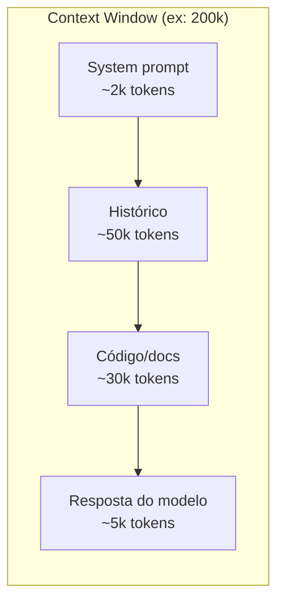
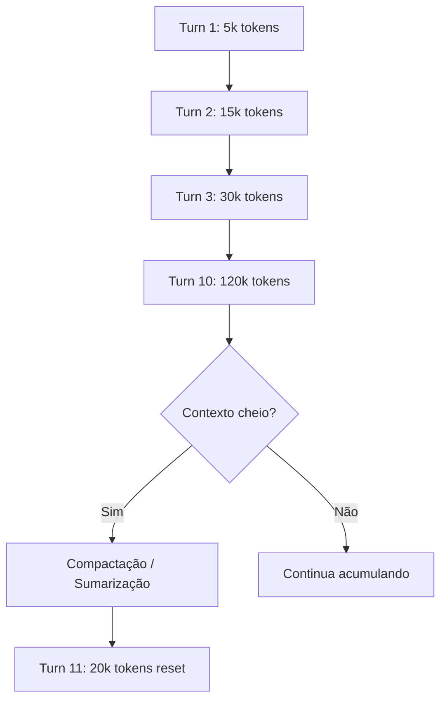

# A janela de contexto

> [!abstract] TL;DR
> A janela de contexto é o limite máximo de tokens que um LLM pode processar de uma vez — incluindo input (prompt, histórico, system instructions) E output (resposta gerada). Em 2026, janelas de 1M+ tokens são comuns nos modelos frontier, mas ter 1M de contexto não significa que o modelo é bom em usá-lo todo. Atenção degrada com distância, custo cresce linearmente, e contexto grande sem curadoria desperdiça dinheiro e qualidade.

## O que é

A **[[Dicionário de IA#Context window|janela de contexto]]** (context window) é a quantidade máxima de [[Dicionário de IA#Token|tokens]] que um [[Dicionário de IA#LLM (Large Language Model)|LLM]] consegue "ver" simultaneamente durante uma interação. Ela engloba **tudo**:

- System prompt e instruções
- Histórico de mensagens
- Documentos e código inseridos como contexto
- Tool definitions e respostas de ferramentas
- A resposta que o modelo está gerando

Quando o total excede o limite, dados antigos são **silenciosamente descartados** (truncamento) ou a API retorna um erro.

## Por que importa

1. **Custo direto** — cada token no contexto é cobrado como input token. Contexto de 100k tokens × $3/MTok = $0.30 por chamada
2. **Qualidade** — modelos perdem acurácia ao longo de janelas muito grandes. O fenômeno "lost in the middle" — informação no meio do contexto é a mais esquecida
3. **Velocidade** — TTFT (time-to-first-token) cresce com o tamanho do contexto porque a fase de prefill processa todos os input tokens
4. **Design de sistemas** — saber o tamanho do contexto determina se você precisa de RAG, memória persistente, ou sumarização

## Como funciona

### Input tokens vs output tokens

| Tipo                                                        | Descrição                                               | Custo                                       |
| ----------------------------------------------------------- | ------------------------------------------------------- | ------------------------------------------- |
| **Input tokens**                                            | Tudo que você envia: prompt, histórico, contexto, tools | Mais barato (ex: $3/MTok no Claude Sonnet)  |
| **Output tokens**                                           | Tudo que o modelo gera: resposta, tool calls, reasoning | Mais caro (ex: $15/MTok no Claude Sonnet)   |
| **[[Dicionário de IA#Reasoning tokens\|Reasoning tokens]]** | Tokens internos de "pensamento" em modelos de reasoning | Cobrados como output, invisíveis ao usuário |

### O custo real do contexto: prefill, decode e KV cache

Por baixo do tampo, o tamanho do contexto cobra duas contas diferentes:

- **[[Dicionário de IA#prefill|Prefill]] (compute-bound)** — fase em que o modelo "lê" o prompt inteiro. Custo de atenção cresce **quadraticamente** com o número de tokens; é o que infla o [[Dicionário de IA#TTFT (time-to-first-token)|TTFT (time-to-first-token)]] em prompts longos.
- **Decode (memory-bound)** — geração token a token. O gargalo aqui é o **[[Dicionário de IA#KV cache|KV cache]]**: estrutura na VRAM que guarda os vetores K/V de cada token já visto. O KV cache cresce **linearmente** com o contexto, mas a banda de memória da GPU é finita — é o [[Dicionário de IA#memory bandwidth bottleneck|gargalo de banda de memória]] que limita o throughput, não o compute.

Por isso modelos de 1M+ não são só caros em dinheiro: são caros em VRAM e, em latência, pagam um pedágio quadrático no prefill que nenhum truque de prompt elimina.

### Janelas de contexto em 2026

| Modelo            | Context window   | Output máximo | Nota                                    |
| ----------------- | ---------------- | ------------- | --------------------------------------- |
| GPT-5.4           | ~1.1M tokens     | ~64k tokens   | —                                       |
| Claude Opus 4.6   | 1M tokens        | 128k tokens   | Maior output do mercado                 |
| Claude Sonnet 4.6 | 200k tokens      | 64k tokens    | Custo-benefício para código             |
| Gemini 3.1 Pro    | 1M–2M tokens     | 64k tokens    | Suporte experimental a 2M               |
| DeepSeek V4       | 128k–163k tokens | 32k tokens    | Menor contexto, mas mais barato         |
| Qwen 3.6          | 1M tokens        | 64k tokens    | Foco em agentes                         |
| Llama 4 Scout     | 10M tokens       | —             | MoE com 16 experts, janela experimental |

> [!info] Pricing tier acima de 200k (legacy)
> Modelos antigos da Anthropic (Sonnet 4.5 e anteriores) cobravam tarifa **long-context** para prompts >200k input: ~$6/MTok input e $22.50/MTok output, contra $3/$15 da faixa padrão. Opus 4.6 e Sonnet 4.6 (e Opus 4.7) entregam 1M **no preço base** desde outubro de 2025 — o multiplicador 2x foi removido. Pegadinha: no tier legacy, cobra-se **tudo** no preço premium, não só o excedente — um prompt de 201k input custa o dobro do de 199k.

### Context window ≠ memória real

> [!warning] Distinção crítica
> Ter 1M de contexto **não** é a mesma coisa que ter 1M de "memória de trabalho efetiva". Na prática:

- **"Lost in the middle" e [[Dicionário de IA#context rot|context rot]]** — Stanford (2023) mostrou o padrão U: melhor recall no início e fim, pior no meio. **Chroma Research (2025)**, testando 18 modelos frontier, foi além e cunhou o termo **context rot** — degradação mensurável bem antes do limite (um modelo de 200k pode cair com 50k). O padrão U vale quando o contexto está **<50% cheio**; acima disso, **recency bias** domina (o modelo favorece o final, depois o meio, e ignora o início).
- **[[Dicionário de IA#attention|Atenção]] diluída** — quanto mais tokens no contexto, mais a atenção se distribui, reduzindo a "resolução" com que o modelo enxerga cada pedaço
- **Custo acumulado** — em agentes, o contexto cresce a cada turn. Uma sessão de 50 turns pode facilmente ultrapassar 200k tokens

### Janela nominal vs janela efetiva

Em 2026, a maioria dos modelos frontier anuncia 1M+ de contexto, mas benchmarks como **RULER** (NVIDIA), **NoLiMa** e **MRCR v2** mostram que a *janela efetiva* — onde o modelo realmente mantém acurácia — costuma ser **30–60 pontos** menor que a nominal em tarefas de recall multi-fato. Casos extremos:

- **Granite 3.1-8B**: 128k nominal, ~32k de [[Dicionário de IA#effective context length|effective context length]] (Red Hat, 2025).
- **Gemini 2.5 Pro**: 100% de recall até ~530k, queda a 99.7% em 1M (single-needle); cai mais em multi-needle.

Regra prática: a partir de ~25–50% da janela nominal, prepare-se pra degradação mensurável, especialmente em tarefas com várias âncoras de informação. "1M de contexto" virou marketing — engenharia séria mede effective context length pra carga real, não decora o número da spec sheet.

### Como modelos estendem contexto além do pretraining

Modelos não nascem com 1M de contexto: a maioria é pretrained em 4k–32k e depois **estendida** por técnicas que ajustam as **position embeddings**:

- **[[Dicionário de IA#RoPE (Rotary Position Embedding)|RoPE]]** (Rotary Position Embedding) — codifica posição via rotação de vetores; é a base de Llama, Qwen, Mistral.
- **[[Dicionário de IA#YaRN|YaRN]]** (Yet another RoPE extensioN) — escala frequências do RoPE + ajuste de temperatura da atenção; estende contexto 2–4x com **10x menos tokens de treino** que métodos anteriores.
- **NTK-aware / Dynamic NTK** — interpolação suave das frequências, evitando colapso no extremo da janela.

A consequência prática: um modelo "1M tokens" pode ter sido pretrained em 32k e estendido via YaRN — funciona, mas a qualidade no fim da janela é uma função de quão bem a extensão foi treinada, não da janela nominal.

### O ciclo do contexto em agentes

Ferramentas como Claude Code e Cursor implementam **[[Dicionário de IA#context compaction|compactação automática]]** — quando o contexto se aproxima do limite, resumem o histórico e reiniciam com um contexto menor mas denso.

## Quando usar / quando não usar

| Cenário                            | Abordagem                                                                        | Contexto necessário      |
| ---------------------------------- | -------------------------------------------------------------------------------- | ------------------------ |
| Chat simples                       | Janela padrão                                                                    | <10k tokens              |
| Edição multi-arquivo               | Context com arquivos relevantes                                                  | 50k–200k tokens          |
| Análise de codebase inteiro        | [[Dicionário de IA#RAG (Retrieval-Augmented Generation)\|RAG]] + semantic search | Não cabe — use retrieval |
| Agente autônomo (longa sessão)     | Compactação + state files                                                        | Gerenciado ativamente    |
| Processamento de documentos longos | Modelo com 1M+ contexto                                                          | 200k–1M tokens           |

## Armadilhas

- **"Mais contexto = melhor resposta"** — falso. Contexto irrelevante dilui a atenção do modelo e aumenta custo sem melhorar qualidade. Curadoria > quantidade.
- **Ignorar o custo acumulado** — uma sessão de agente que roda 100 turns pode custar $10+ só em input tokens se o contexto não for gerenciado.
- **Confiar no truncamento silencioso** — quando o contexto excede o limite, o que é cortado depende da implementação. Pode ser justamente a informação mais importante.
- **"O modelo lembra tudo"** — não lembra. Cada chamada de API é stateless. O "histórico" é reenviado a cada turn, consumindo tokens de input.
- **Não distinguir input de output tokens** — output é 3-5x mais caro. Um modelo verboso que gera respostas longas custa muito mais que um conciso.

## Veja também

- [[02 - Tokens e tokenização]] — a unidade que mede a janela
- [[04 - Atenção e o mecanismo transformer]] — o motor que sofre quando a janela cresce
- [[10 - Pricing de APIs — como calcular custos]] — onde o custo do contexto vira fatura
- [[11 - Prompt caching e otimizações de API]] — como reduzir custo de contexto repetido
- [[12 - Streaming, batching e latência]] — como o tamanho do contexto afeta performance

## Referências

- **Liu et al.** — [*Lost in the Middle: How Language Models Use Long Contexts*](https://arxiv.org/abs/2307.03172) (Stanford, 2023). O paper que documentou o padrão U de atenção em contextos longos.
- **Chroma Research** — [*Context Rot: How Increasing Input Tokens Impacts LLM Performance*](https://research.trychroma.com/context-rot) (2025). Estudo com 18 modelos frontier mostrando degradação bem antes do limite nominal e mudança do padrão U para recency bias.
- **NVIDIA** — [*RULER: What's the Real Context Size of Your Long-Context Language Models?*](https://github.com/NVIDIA/RULER) (2024). Benchmark sintético que expôs o gap entre janela nominal e janela efetiva.
- **Peng et al.** — [*YaRN: Efficient Context Window Extension of Large Language Models*](https://arxiv.org/abs/2309.00071) (2023). Método de extensão de contexto via escala de frequências RoPE + temperatura da atenção.
- **Morph** — [*KV Cache Explained: Why It's the Most Important Optimization in LLM Inference*](https://www.morphllm.com/kv-cache-explained). Mecânica de prefill, decode e KV cache em inferência de LLMs.
- **The New Stack** — [*Anthropic makes a pricing change that matters for Claude's longest prompts*](https://thenewstack.io/claude-million-token-pricing/) (2025). Mudança do tier 200k em modelos Claude 4.6.
- **Anthropic** — *Claude Model Card* (2026). Especificações de context window e output limits.
- **OpenAI** — *API Reference — Models* (2026). Documentação de context windows por modelo.
- **Google DeepMind** — *Gemini Technical Report* (2026). Detalhes da arquitetura de contexto longo.
